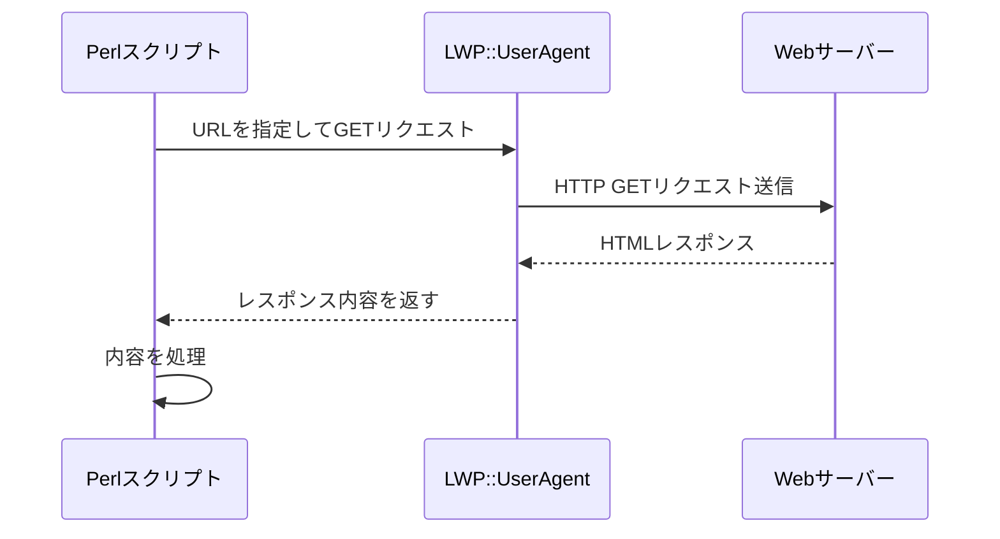
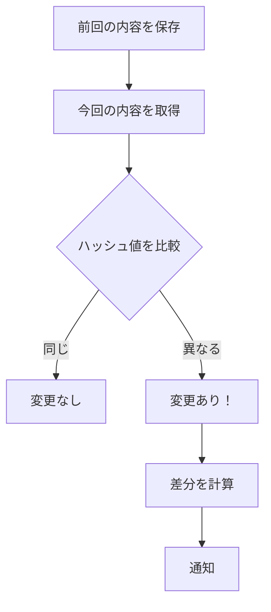
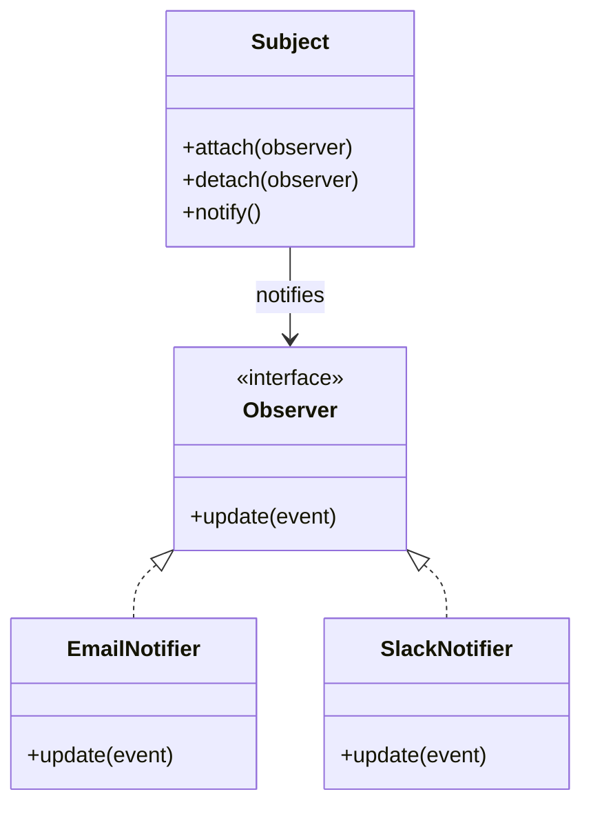
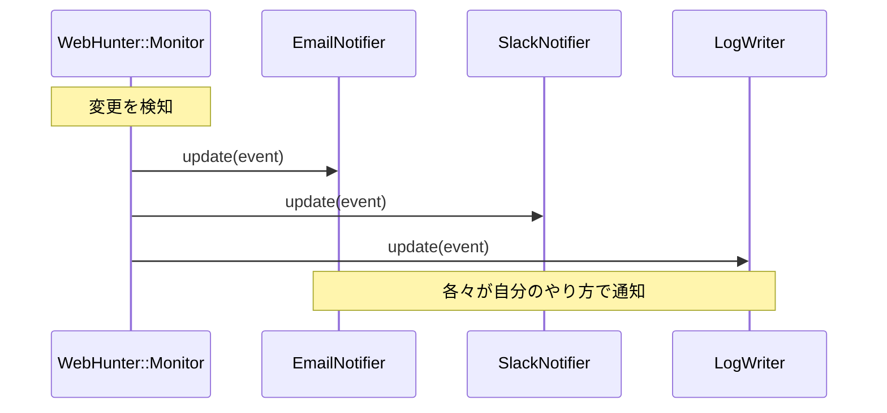
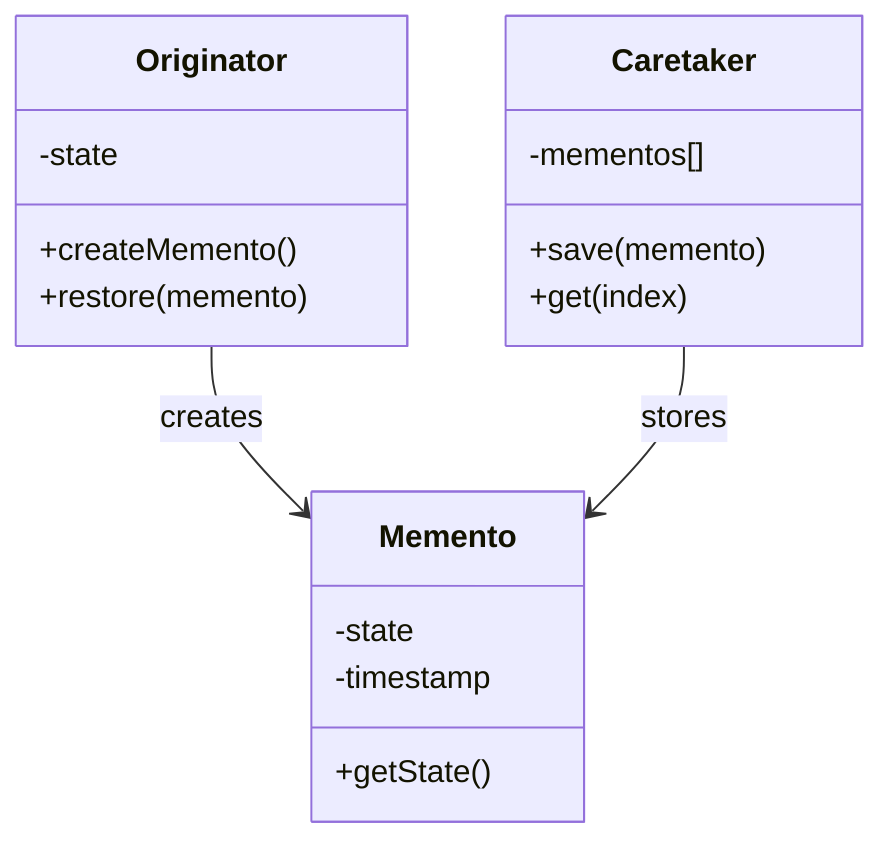
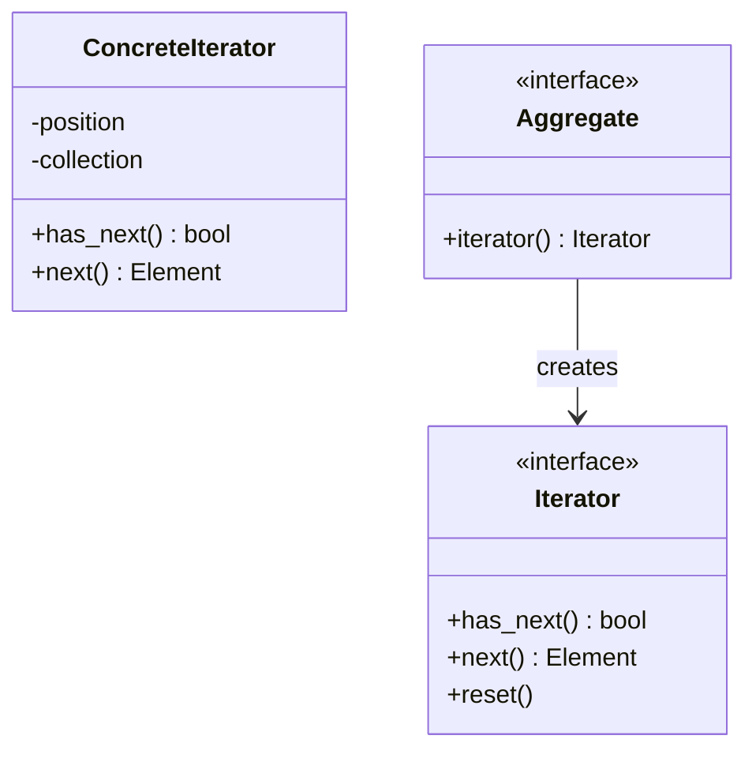
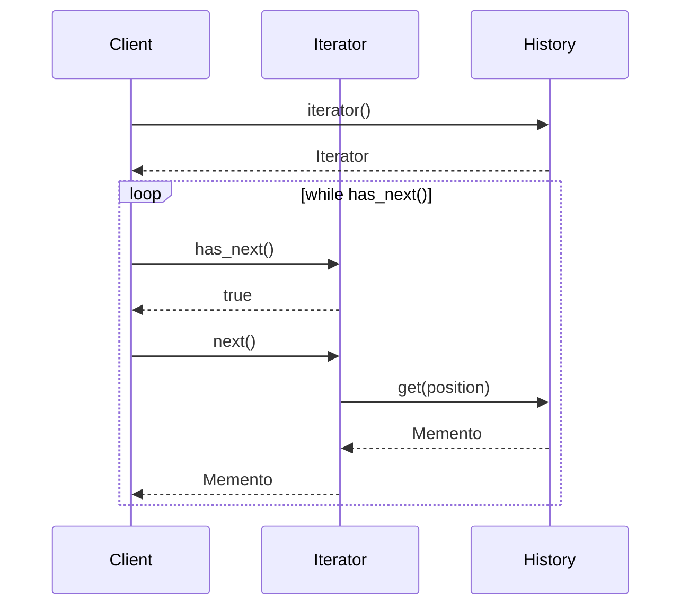
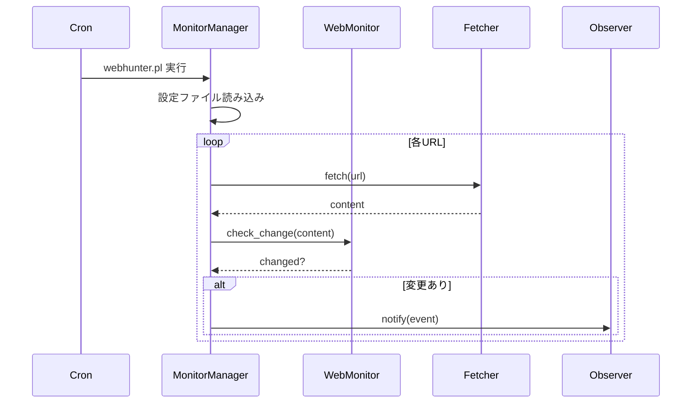
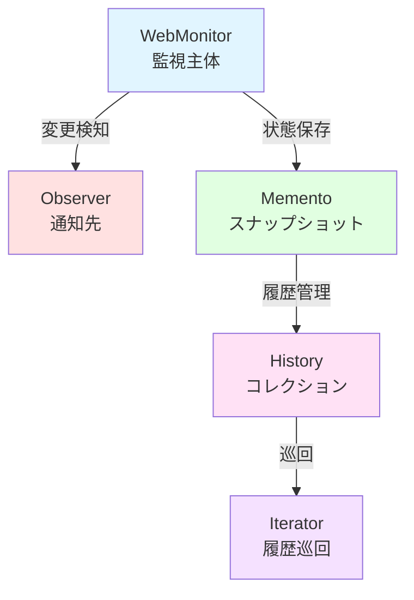
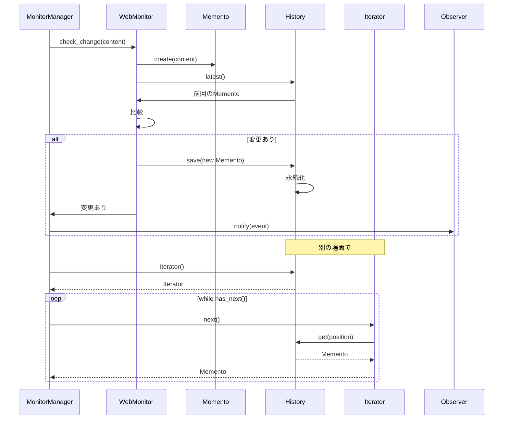

「競合サイトの価格が気になる」「政府の公開情報が更新されたらすぐ知りたい」「お気に入りのニュースサイトに新着記事が出たら通知してほしい」──そんな経験、ありませんか？

毎日手動でブラウザを開いてチェックするのは面倒です。かといって、月額課金のWebモニタリングSaaSに頼るのももったいない。そこで、Perlで自作してしまいましょう。

この記事では、「Webページ変更ハンター」を段階的に構築していきます。URLリストを登録し、定期的にWebページをチェック、変更があれば複数の通知先（メール、Slack、ログ）に通知。過去のスナップショットと比較して「何が」変わったかを可視化する──そんなツールを、デザインパターンを学びながら作っていきます。

## 対象読者と使用技術

### 対象読者

- Perlの基礎は知っているが、オブジェクト指向は初めて
- デザインパターンを「理論」ではなく「実践」で学びたい
- 実際に動くツールを作りながら理解を深めたい

### 使用技術

- **Perl**: v5.36以降（signatures、postfix dereferenceを使用）
- **OOPフレームワーク**: Moo（軽量で高速）
- **デザインパターン**: Observer、Memento、Iterator
- **依存モジュール**: LWP::UserAgent、Storable、Text::Diff、YAML::PP

---

## 第1章：URLの内容を取得してみよう

まず、「Webページの内容を取得する」という基礎から。これができなければ何も始まりません。

### HTTP通信の基礎

WebページをPerlで取得するには、HTTP通信を行う必要があります。Perlには定番のモジュール「LWP::UserAgent」があります（"LWP"は"Library for WWW in Perl"の略）。

基本的な流れはこうです：



### シンプルな取得スクリプト

まずは最小限のコードで、指定したURLの内容を取得してみましょう：

```perl
#!/usr/bin/env perl
use v5.36;
use utf8;
use LWP::UserAgent;

# UserAgentを作成
my $ua = LWP::UserAgent->new(
    timeout => 10,
    agent   => 'WebHunter/0.1',
);

# URLを取得
my $url = 'https://example.com';
my $response = $ua->get($url);

# 成功したか確認
if ($response->is_success) {
    say "取得成功！";
    say "Content-Type: ", $response->header('Content-Type');
    say "文字数: ", length($response->decoded_content);
    say "\n--- 内容 ---";
    say substr($response->decoded_content, 0, 500);  # 最初の500文字だけ表示
} else {
    die "取得失敗: ", $response->status_line;
}
```

`v5.36` を使うことで、`say`（末尾に改行を自動追加する`print`）やその他のモダン機能が使えます。`decoded_content` は、文字コードを自動判定してデコードしてくれる便利なメソッドです。

### Mooでクラス化してみる

さて、これを「何度も使える部品」にするため、Mooでクラス化してみましょう：

```perl
package WebHunter::Fetcher {
    use Moo;
    use LWP::UserAgent;
    use namespace::clean;

    has ua => (
        is      => 'lazy',
        builder => sub {
            LWP::UserAgent->new(
                timeout => 10,
                agent   => 'WebHunter/0.1',
            );
        },
    );

    has timeout => (
        is      => 'ro',
        default => 10,
    );

    sub fetch ($self, $url) {
        my $response = $self->ua->get($url);
        
        return {
            success => $response->is_success,
            status  => $response->status_line,
            content => $response->is_success ? $response->decoded_content : undef,
            headers => { $response->headers->flatten },
        };
    }
}
```

**ポイント**:
- **`has ua => (is => 'lazy', builder => sub {...})`**: `ua`属性は最初にアクセスされたときに自動生成されます（遅延初期化）
- **`sub fetch ($self, $url)`**: Perl v5.36以降の「signatures」機能を使用
- **`namespace::clean`**: クラス定義内で`use`したモジュールの関数がメソッドとして見えないようにします
- **戻り値はハッシュリファレンス**: 成功/失敗、ステータス、内容、ヘッダーをまとめて返します

---

## 第2章：変更を検知する仕組み

URLの内容を取得できるようになりました。しかし、これだけでは「監視」にはなりません。「前回見たとき」と「今回見たとき」を比較して、「変わったかどうか」を判定する必要があります。

### ハッシュ値で変更を検知

MD5ハッシュを使いましょう。Perlのコアモジュール「Digest::MD5」で簡単に計算できます：

```perl
use Digest::MD5 qw(md5_hex);

my $text1 = "Hello, World!";
my $text2 = "Hello, World!";
my $text3 = "Hello, Perl!";

say "text1とtext2は同じ？ ", md5_hex($text1) eq md5_hex($text2) ? "YES" : "NO";
say "text1とtext3は同じ？ ", md5_hex($text1) eq md5_hex($text3) ? "YES" : "NO";
```

同じテキストなら同じハッシュ値、1文字でも違えば全く異なるハッシュ値になります。

### ChangeDetectorクラスを作る

変更検知機能をクラス化しましょう：

```perl
package WebHunter::ChangeDetector {
    use Moo;
    use Digest::MD5 qw(md5_hex);
    use namespace::clean;

    has previous_hash => (
        is      => 'rw',
        default => '',
    );

    sub detect ($self, $content) {
        my $current_hash = md5_hex($content);
        
        # 初回チェック
        if (!$self->previous_hash) {
            $self->previous_hash($current_hash);
            return {
                changed      => 0,
                first_check  => 1,
                current_hash => $current_hash,
            };
        }

        # 変更チェック
        my $changed = ($current_hash ne $self->previous_hash);
        
        my $result = {
            changed       => $changed,
            first_check   => 0,
            current_hash  => $current_hash,
            previous_hash => $self->previous_hash,
        };

        $self->previous_hash($current_hash) if $changed;

        return $result;
    }
}
```



---

## 第3章：変更を通知したい！── Observerパターン


変更を検知できるようになりました。しかし、検知だけでは意味がありません。「変更があった」という事実を、誰か（あるいは何か）に伝える必要があります。

通知先が増えると、コードが破綻します：

```perl
# ❌ こうなると悲惨
sub on_change ($self, $url, $content) {
    $self->send_email($url, $content);
    $self->send_slack($url, $content);
    $self->write_log($url, $content);
    # LINE通知も...Discord通知も...
}
```

通知先が増えるたびに、この関数を修正しなければなりません。これは「Open-Closed Principle（開放閉鎖原則）」違反です。

### Observerパターンの登場



「Subject（主体）」は複数のObserverを登録でき、変更があったときに全員に`update()`メソッドを呼びます。新しい通知先を追加するときは、新しいObserverクラスを作って`attach()`で登録するだけ。既存コードを一切変更しません。

### Observerを実装

まず、Observerの「役割」を定義します：

```perl
package WebHunter::Observer {
    use Moo::Role;
    use namespace::clean;

    requires 'update';  # このRoleを使うクラスは必ずupdateメソッドを実装
}
```

具体的なObserverたち：

```perl
package WebHunter::Observer::Email {
    use Moo;
    use namespace::clean;
    
    with 'WebHunter::Observer';

    has to => (
        is       => 'ro',
        required => 1,
    );

    sub update ($self, $event) {
        say "[EMAIL] 宛先: ", $self->to;
        say "  URL: $event->{url}";
        say "  変更検知時刻: $event->{timestamp}";
    }
}

package WebHunter::Observer::Slack {
    use Moo;
    use namespace::clean;
    
    with 'WebHunter::Observer';

    has webhook_url => (
        is       => 'ro',
        required => 1,
    );

    sub update ($self, $event) {
        say "[SLACK] Webhook: ", substr($self->webhook_url, 0, 30), "...";
        say "  URL: $event->{url}";
    }
}

package WebHunter::Observer::Log {
    use Moo;
    use namespace::clean;
    
    with 'WebHunter::Observer';

    has logfile => (
        is      => 'ro',
        default => 'webhunter.log',
    );

    sub update ($self, $event) {
        say "[LOG] ログファイル: ", $self->logfile;
        say "  URL: $event->{url}";
    }
}
```

### Subject（監視主体）を作る

```perl
package WebHunter::Monitor {
    use Moo;
    use namespace::clean;

    has observers => (
        is      => 'ro',
        default => sub { [] },
    );

    sub attach ($self, $observer) {
        push $self->observers->@*, $observer;
    }

    sub detach ($self, $observer) {
        $self->observers->@* = grep { $_ != $observer } $self->observers->@*;
    }

    sub notify ($self, $event) {
        for my $observer ($self->observers->@*) {
            $observer->update($event);
        }
    }

    sub on_change ($self, $url, $content) {
        my $event = {
            url       => $url,
            content   => $content,
            timestamp => time,
        };
        $self->notify($event);
    }
}
```



---

## 第4章：過去の状態を残しておく ── Mementoパターン


通知の仕組みができました。しかし、「昨日の状態と比較したい」「先週のスナップショットを見たい」という要求が出てきます。

ここで登場するのが「Mementoパターン」です。オブジェクトの内部状態をスナップショットとして保存し、後で復元できるようにする仕組みです。

### Mementoパターンの仕組み



- **Originator（作成者）**: 状態を持つオブジェクト。スナップショットを作成する。
- **Memento（記念品）**: 状態のスナップショット。不変オブジェクト。
- **Caretaker（管理者）**: Mementoを保存・管理する。

### WebPageMementoを作る

```perl
package WebHunter::Memento {
    use Moo;
    use Digest::MD5 qw(md5_hex);
    use namespace::clean;

    has url => (
        is       => 'ro',
        required => 1,
    );

    has content => (
        is       => 'ro',
        required => 1,
    );

    has timestamp => (
        is      => 'ro',
        default => sub { time },
    );

    has hash => (
        is      => 'lazy',
        builder => sub ($self) {
            md5_hex($self->content);
        },
    );

    sub to_string ($self) {
        my $time = localtime($self->timestamp);
        my $size = length($self->content);
        return sprintf("[%s] %s (hash: %s, size: %d bytes)",
            $time, $self->url, substr($self->hash, 0, 8), $size);
    }
}
```

### Caretaker（管理者）を作る

```perl
package WebHunter::History {
    use Moo;
    use Storable qw(store retrieve);
    use namespace::clean;

    has snapshots => (
        is      => 'ro',
        default => sub { [] },
    );

    has storage_file => (
        is      => 'ro',
        default => 'webhunter_history.dat',
    );

    sub save ($self, $memento) {
        push $self->snapshots->@*, $memento;
    }

    sub latest ($self) {
        return undef if !$self->snapshots->@*;
        return $self->snapshots->[-1];
    }

    sub get ($self, $index) {
        return $self->snapshots->[$index];
    }

    sub count ($self) {
        return scalar $self->snapshots->@*;
    }

    sub persist ($self) {
        store($self->snapshots, $self->storage_file);
    }

    sub load ($self) {
        return unless -e $self->storage_file;
        my $data = retrieve($self->storage_file);
        $self->snapshots->@* = $data->@*;
    }
}
```

`Storable`はPerlのコアモジュールで、Perlのデータ構造をバイナリ形式でファイルに保存・復元できます。

---

## 第5章：履歴を順番に見る ── Iteratorパターン

過去のスナップショットを複数保存できるようになりました。しかし、これらを「順番に見る」とき、素朴に書くと内部構造に依存してしまいます：

```perl
# ❌ 内部構造に依存している
for my $i (0 .. $history->count - 1) {
    my $snapshot = $history->snapshots->[$i];
    say $snapshot->to_string;
}
```

もし履歴の保存方法が「配列」から「データベース」に変わったら、このコードは壊れます。

### Iteratorパターンの仕組み



### HistoryIteratorを作る

```perl
package WebHunter::HistoryIterator {
    use Moo;
    use namespace::clean;

    has history => (
        is       => 'ro',
        required => 1,
    );

    has position => (
        is      => 'rw',
        default => 0,
    );

    sub has_next ($self) {
        return $self->position < $self->history->count;
    }

    sub next ($self) {
        return undef unless $self->has_next;
        my $item = $self->history->get($self->position);
        $self->position($self->position + 1);
        return $item;
    }

    sub reset ($self) {
        $self->position(0);
    }
}
```

逆順Iteratorも：

```perl
package WebHunter::HistoryReverseIterator {
    use Moo;
    use namespace::clean;

    has history => (
        is       => 'ro',
        required => 1,
    );

    has position => (
        is      => 'lazy',
        builder => sub ($self) {
            $self->history->count - 1;
        },
    );

    sub has_next ($self) {
        return $self->position >= 0;
    }

    sub next ($self) {
        return undef unless $self->has_next;
        my $item = $self->history->get($self->position);
        $self->position($self->position - 1);
        return $item;
    }

    sub reset ($self) {
        $self->position($self->history->count - 1);
    }
}
```



---

## 第6章：複数サイトを同時監視

これまで1つのURLを監視する仕組みを作ってきました。実用的なツールにするため、複数のサイトを同時監視できるようにしましょう。

### 設定ファイルを作る

YAML形式で監視対象を管理：

```yaml
# webhunter_config.yaml
urls:
  - url: https://example.com/price
    name: 競合A社価格ページ
    check_interval: 3600

  - url: https://news.example.com/
    name: ニュースサイト
    check_interval: 1800

observers:
  - type: email
    to: admin@example.com

  - type: slack
    webhook_url: https://hooks.slack.com/services/YOUR/WEBHOOK/URL

  - type: log
    logfile: webhunter.log
```

### MonitorManagerクラス

```perl
package WebHunter::MonitorManager {
    use Moo;
    use YAML::PP;
    use WebHunter::WebMonitor;
    use WebHunter::Fetcher;
    use WebHunter::Observer::Email;
    use WebHunter::Observer::Slack;
    use WebHunter::Observer::Log;
    use namespace::clean;

    has config_file => (
        is      => 'ro',
        default => 'webhunter_config.yaml',
    );

    has monitors => (
        is      => 'ro',
        default => sub { {} },
    );

    has observers => (
        is      => 'ro',
        default => sub { [] },
    );

    has fetcher => (
        is      => 'lazy',
        builder => sub { WebHunter::Fetcher->new },
    );

    sub BUILD ($self, $args) {
        $self->load_config;
    }

    sub load_config ($self) {
        return unless -e $self->config_file;

        my $yp = YAML::PP->new;
        my $config = $yp->load_file($self->config_file);

        for my $url_config ($config->{urls}->@*) {
            my $monitor = WebHunter::WebMonitor->new(
                url => $url_config->{url},
            );
            $self->monitors->{$url_config->{url}} = {
                monitor        => $monitor,
                name           => $url_config->{name} // $url_config->{url},
                check_interval => $url_config->{check_interval} // 3600,
            };
        }

        for my $obs_config ($config->{observers}->@*) {
            my $observer;
            if ($obs_config->{type} eq 'email') {
                $observer = WebHunter::Observer::Email->new(
                    to => $obs_config->{to}
                );
            } elsif ($obs_config->{type} eq 'slack') {
                $observer = WebHunter::Observer::Slack->new(
                    webhook_url => $obs_config->{webhook_url}
                );
            } elsif ($obs_config->{type} eq 'log') {
                $observer = WebHunter::Observer::Log->new(
                    logfile => $obs_config->{logfile}
                );
            }
            push $self->observers->@*, $observer if $observer;
        }
    }

    sub run_check_all ($self) {
        my @results;

        for my $url (sort keys $self->monitors->%*) {
            my $info    = $self->monitors->{$url};
            my $monitor = $info->{monitor};
            my $name    = $info->{name};

            say "チェック中: $name ($url)";

            my $result = $self->fetcher->fetch($url);
            unless ($result->{success}) {
                warn "取得失敗: $url - $result->{status}";
                next;
            }

            my $check = $monitor->check_change($result->{content});
            
            if ($check->{changed}) {
                say "  ✓ 変更検知！";
                
                my $event = {
                    url       => $url,
                    name      => $name,
                    content   => $result->{content},
                    previous  => $check->{previous},
                    current   => $check->{current},
                    timestamp => time,
                };
                
                $self->notify_observers($event);
                
                push @results, { url => $url, changed => 1 };
            } else {
                say "  変更なし";
                push @results, { url => $url, changed => 0 };
            }
        }

        return \@results;
    }

    sub notify_observers ($self, $event) {
        for my $observer ($self->observers->@*) {
            $observer->update($event);
        }
    }

    sub count ($self) {
        return scalar keys $self->monitors->%*;
    }
}
```

### cronで定期実行

```cron
0 * * * * cd /path/to/webhunter && perl webhunter.pl >> logs/webhunter.log 2>&1
```



---

## 第7章：差分を見やすく表示する

複数サイトを同時監視できるようになりました。しかし、「変わった」だけでは困ります。「**どこが**変わったの？」

### Text::Diffで差分を計算

```perl
use Text::Diff;

my $old = <<'EOF';
価格: 1,000円
在庫: あり
EOF

my $new = <<'EOF';
価格: 1,200円
在庫: あり
EOF

my $diff = diff(\$old, \$new);
say $diff;

# 出力:
# @@ -1,2 +1,2 @@
# -価格: 1,000円
# +価格: 1,200円
#  在庫: あり
```

### DiffFormatterクラス

```perl
package WebHunter::DiffFormatter {
    use Moo;
    use Text::Diff;
    use HTML::Entities qw(encode_entities);
    use namespace::clean;

    has use_color => (
        is      => 'ro',
        default => 0,
    );

    sub format_diff ($self, $old, $new, %options) {
        my $diff = diff(
            \$old,
            \$new,
            {
                STYLE => $options{style} // 'Unified',
            }
        );
        
        return $diff unless $self->use_color;
        return $self->colorize($diff);
    }

    sub colorize ($self, $diff) {
        my @lines = split /\n/, $diff;
        my @colored;
        
        for my $line (@lines) {
            if ($line =~ /^-/) {
                push @colored, "\e[31m$line\e[0m";  # 赤
            } elsif ($line =~ /^\+/) {
                push @colored, "\e[32m$line\e[0m";  # 緑
            } elsif ($line =~ /^@@/) {
                push @colored, "\e[36m$line\e[0m";  # シアン
            } else {
                push @colored, $line;
            }
        }
        
        return join("\n", @colored);
    }

    sub format_html_diff ($self, $old, $new) {
        my $diff = diff(\$old, \$new, { STYLE => 'Unified' });
        my @lines = split /\n/, $diff;
        my @html;
        
        push @html, '<pre style="background: #f5f5f5; padding: 10px;">';
        
        for my $line (@lines) {
            my $escaped = encode_entities($line);
            
            if ($line =~ /^-/) {
                push @html, qq{<span style="color: #c00;">$escaped</span>};
            } elsif ($line =~ /^\+/) {
                push @html, qq{<span style="color: #0c0;">$escaped</span>};
            } elsif ($line =~ /^@@/) {
                push @html, qq{<span style="color: #06c;">$escaped</span>};
            } else {
                push @html, $escaped;
            }
        }
        
        push @html, '</pre>';
        return join("\n", @html);
    }

    sub get_summary ($self, $old, $new) {
        my $diff = diff(\$old, \$new, { STYLE => 'Unified' });
        my @lines = split /\n/, $diff;
        
        my $added   = grep { /^\+/ && !/^\+\+\+/ } @lines;
        my $deleted = grep { /^-/  && !/^---/    } @lines;
        
        return {
            added   => $added,
            deleted => $deleted,
            total   => $added + $deleted,
        };
    }
}
```

---

## 第8章：3つのパターンの正体

全7章で「WebHunter」を作ってきました。最終章では、Observer、Memento、Iteratorの3つのパターンがどう協調し、どんな原則に基づいているかを解説します。

### 3つのパターンの役割



- **Observer**: 変更の通知（疎結合な1対多の依存関係）
- **Memento**: 状態の保存（カプセル化を守る履歴管理）
- **Iterator**: コレクションの巡回（内部構造の隠蔽）

### SOLID原則との対応

| 原則 | 対応 |
|------|------|
| **S** (Single Responsibility) | 各クラスが1つの責任のみ（Fetcher=通信、History=履歴、Iterator=巡回） |
| **O** (Open-Closed) | 新しいObserverを追加しても既存コード変更不要 |
| **L** (Liskov Substitution) | どのObserver実装も同じインターフェースで置換可能 |
| **I** (Interface Segregation) | Observerは`update()`だけを要求 |
| **D** (Dependency Inversion) | 具象ではなく抽象（Role）に依存 |

### パターン協調のシーケンス



---

## まとめ：完成したツールの機能

この記事を通じて、以下の機能を持つツールが完成しました：

1. **複数URLの監視**: 設定ファイルで管理
2. **変更検知**: ハッシュ値による効率的な比較
3. **複数の通知先**: メール、Slack、ログファイル（拡張可能）
4. **履歴保存**: 過去のスナップショットを永続化
5. **履歴巡回**: 時系列で過去の状態を確認
6. **差分表示**: どこが変わったかを視覚化
7. **定期実行**: cronで自動化

デザインパターンは「銀の弾丸」ではありませんが、適材適所で使う「道具」として強力です。Perlの表現力とMooの使いやすさを活かして、美しいコードを書いていきましょう。

Happy Hacking!
