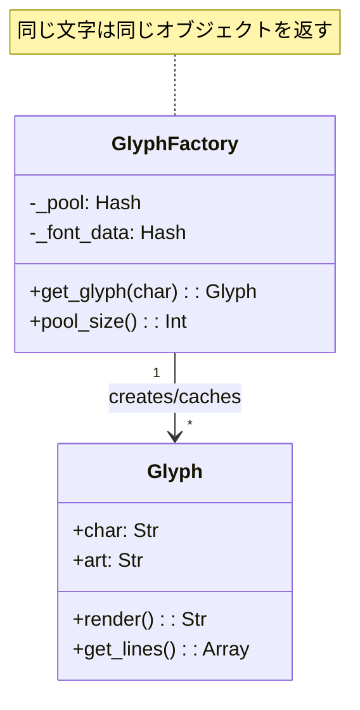
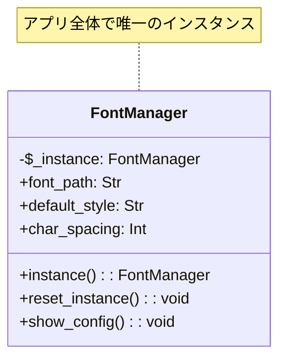
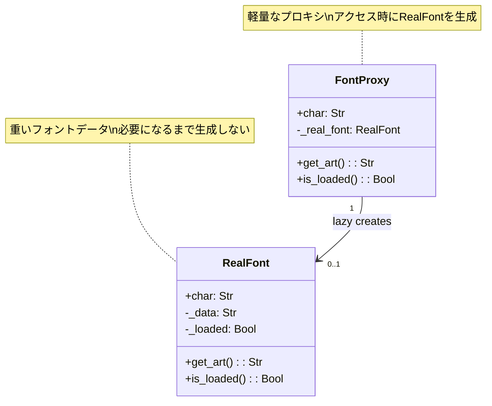
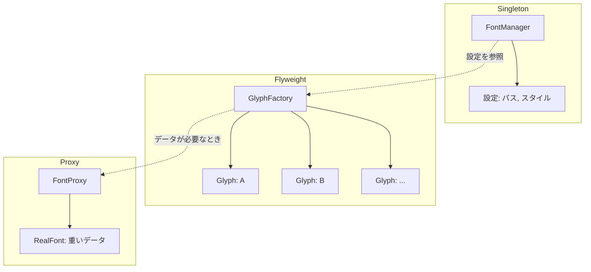

プログラミング学習でデザインパターンを学んだものの、「結局どう使えばいいの？」と迷っていませんか？本記事では、**ASCIIアートで巨大文字を表示する**ツールを作りながら、**Singleton・Flyweight・Proxy**の3パターンを体験します。

> 「動く → 破綻 → パターン導入 → 完成」というストーリーで、**なぜそのパターンが必要なのか**を実感しながら学べます。

## この記事で学べること

| パターン | 解決する問題 | 本記事での役割 |
|---------|-------------|--------------|
| **Singleton** | 設定が複数箇所に散らばる | フォント設定の一元管理 |
| **Flyweight** | 同じオブジェクトの大量生成 | 文字グリフの共有 |
| **Proxy** | 重いリソースの先読み | フォントデータの遅延ロード |

## 対象読者

- デザインパターンの名前は知っているが、使いどころがわからない方
- Perl入学式を卒業し、次のステップに進みたい方
- オブジェクト指向の実践的な使い方を学びたい方

## 技術スタック

- **Perl** v5.34以降（signatures使用）
- **Moo** によるオブジェクト指向
- CLI（コマンドライン）環境

---

## 第1章: 巨大な文字を表示してみよう

### 今回の目標

- ASCIIアートで「HELLO」を表示する
- 最もシンプルな実装からスタート

### 最初の実装

まずは、各文字のASCIIアートをハードコードで定義してみましょう。

```perl
#!/usr/bin/env perl
use v5.34;
use warnings;

sub render_H {
    return <<"END_ART";
 H   H
 H   H
 HHHHH
 H   H
 H   H
END_ART
}

sub render_E {
    return <<"END_ART";
 EEEEE
 E
 EEE
 E
 EEEEE
END_ART
}

sub render_L {
    return <<"END_ART";
 L
 L
 L
 L
 LLLLL
END_ART
}

sub render_O {
    return <<"END_ART";
  OOO
 O   O
 O   O
 O   O
  OOO
END_ART
}

# メイン処理
say "=== ASCIIアート・フォントレンダラー v0.1 ===";
say "";
say "「HELLO」を表示します:";
say "";

# 各文字を順番に表示
my @lines_H = split /\n/, render_H();
my @lines_E = split /\n/, render_E();
my @lines_L = split /\n/, render_L();
my @lines_O = split /\n/, render_O();

# 横に並べて表示
for my $i (0..4) {
    say join("  ",
        $lines_H[$i] // "",
        $lines_E[$i] // "",
        $lines_L[$i] // "",
        $lines_L[$i] // "",  # 2つ目のL
        $lines_O[$i] // ""
    );
}

say "";
say "完成！巨大な文字が表示できました。";
```

### 実行結果

```
=== ASCIIアート・フォントレンダラー v0.1 ===

「HELLO」を表示します:

 H   H   EEEEE   L        L         OOO
 H   H   E       L        L        O   O
 HHHHH   EEE     L        L        O   O
 H   H   E       L        L        O   O
 H   H   EEEEE   LLLLL    LLLLL     OOO

完成！巨大な文字が表示できました。
```

### 今回のポイント

- ✅ とりあえず動くものができた
- ⚠️ 文字数が増えると関数が爆発する
- ⚠️ 拡張性がまったくない

---

## 第2章: 文字が増えるとメモリが爆発する

### 前章の振り返り

第1章では、ハードコードで「HELLO」を表示できました。でも、A〜Z全部に対応したら？

### 今回の目標

- A〜Z全文字に対応する
- オブジェクト指向で書き直す
- でも...問題が発生する

### 動く：Mooでクラス化

```perl
#!/usr/bin/env perl
use v5.34;
use feature qw(signatures);
no warnings qw(experimental::signatures);
use warnings;

package Glyph {
    use Moo;

    has name => (is => 'ro', required => 1);
    has art  => (is => 'ro', required => 1);

    sub render($self) {
        return $self->art;
    }
}

package main;

# フォントデータ（A-Zまで全部定義）
my %FONT_DATA = (
    A => " AAA\nA   A\nAAAAA\nA   A\nA   A",
    B => "BBBB\nB   B\nBBBB\nB   B\nBBBB",
    # ... 中略 ...
    H => "H   H\nH   H\nHHHHH\nH   H\nH   H",
    L => "L\nL\nL\nL\nLLLLL",
    O => " OOO\nO   O\nO   O\nO   O\n OOO",
    # ... 中略 ...
);

# 問題のあるコード: 文字を使うたびに新しいオブジェクトを生成
sub get_glyph($char) {
    my $art = $FONT_DATA{uc $char} // "  ?\n  ?\n  ?\n  ?\n  ?";
    return Glyph->new(name => $char, art => $art);
}

# テスト
my @text = split //, "LOLLOL";
my @glyphs = map { get_glyph($_) } @text;

say "文字数: " . scalar @text;
say "作成されたGlyphオブジェクト数: " . scalar @glyphs . " （全部別々！）";
```

### 破綻：同じ文字なのに別オブジェクト

「LOLLOL」という6文字を表示するだけなのに...

```
文字数: 6
作成されたGlyphオブジェクト数: 6 （全部別々！）
```

問題点を整理すると：

- 「L」が3回登場 → 3つの別々のGlyphオブジェクト
- 「O」が2回登場 → 2つの別々のGlyphオブジェクト
- 100万文字のテキストを表示したら、100万個のオブジェクト！

### 今回のポイント

- ⚠️ 同じデータなのに毎回新規作成はムダ
- ⚠️ メモリ使用量が文字数に比例して増大
- → **同じ文字は1つのオブジェクトを共有**すればよいのでは？

---

## 第3章: 文字グリフを共有しよう


### 前章の振り返り

同じ「L」なのに毎回新しいオブジェクトを作っていました。これを解決します。

### 今回の目標

- 同じ文字は1つのオブジェクトを共有する
- **Flyweight**パターンの導入

### 完成：Flyweightパターン

```perl
package Glyph;
use v5.34;
use feature qw(signatures);
no warnings qw(experimental::signatures);
use warnings;
use Moo;

# Flyweightパターン: 共有される内部状態(intrinsic state)
has char => (is => 'ro', required => 1);
has art  => (is => 'ro', required => 1);

sub render($self) {
    return $self->art;
}

sub get_lines($self) {
    return split /\n/, $self->art;
}

1;
```

```perl
package GlyphFactory;
use v5.34;
use feature qw(signatures);
no warnings qw(experimental::signatures);
use warnings;
use Moo;
use Glyph;

# 既に作成したGlyphオブジェクトを保持するプール
has _pool => (
    is      => 'ro',
    default => sub { {} },
);

has _font_data => (
    is      => 'ro',
    default => sub {
        return {
            A => " AAA\nA   A\nAAAAA\nA   A\nA   A",
            # ... 省略 ...
        };
    },
);

# Glyphを取得（既に存在すれば再利用、なければ新規作成）
sub get_glyph($self, $char) {
    my $key = uc $char;

    # プールに既にあれば再利用
    if (exists $self->_pool->{$key}) {
        return $self->_pool->{$key};
    }

    # 新規作成してプールに保存
    my $art = $self->_font_data->{$key} // "  ?\n  ?\n  ?\n  ?\n  ?";
    my $glyph = Glyph->new(char => $key, art => $art);
    $self->_pool->{$key} = $glyph;

    return $glyph;
}

sub pool_size($self) {
    return scalar keys $self->_pool->%*;
}

1;
```

### Flyweightの効果

```perl
my $factory = GlyphFactory->new;
my @text = split //, "LOLLOL";
my @glyphs = map { $factory->get_glyph($_) } @text;

say "文字数: " . scalar @text;                        # → 6
say "プールサイズ: " . $factory->pool_size . "種類";  # → 2（L と O だけ）
```



### 今回のポイント

- ✅ **Flyweight**パターン = オブジェクトの共有
- ✅ 100万文字のテキストでも、使用する**文字種類数**分のメモリで済む
- ✅ プールで既存オブジェクトを管理

---

## 第4章: フォントの設定が散らばる問題

### 前章の振り返り

Flyweightでメモリ問題を解決しました。でも、コードを見返すと別の問題が...

### 今回の目標

- 設定がハードコードされている問題を認識
- DRY原則（Don't Repeat Yourself）違反を発見

### 破綻：設定が5箇所に散らばる

```perl
my $FONT_PATH = "/usr/share/fonts/ascii/standard.fnt";  # 設定1箇所目
my $DEFAULT_STYLE = "bold";                              # 設定2箇所目

sub initialize_renderer {
    my $font_path = "/usr/share/fonts/ascii/standard.fnt";  # 設定3箇所目（重複！）
    say "フォントを$font_pathから読み込んでいます...";
}

sub get_font_style {
    return "bold";  # 設定4箇所目（重複！）
}

sub render_with_style {
    my $style = "bold";  # 設定5箇所目（またもや重複！）
    # ...
}
```

問題点：

- 同じ値が**5箇所**にハードコード
- フォントパスを変更したい → 5箇所を修正
- 修正漏れがあるとバグの原因に

### 今回のポイント

- ⚠️ **DRY原則**（Don't Repeat Yourself）に違反
- ⚠️ 設定変更時に修正漏れリスク
- → **設定を1箇所で一元管理**すればよいのでは？

---

## 第5章: 設定を一元管理しよう


### 前章の振り返り

設定が5箇所に散らばっていました。これを1箇所にまとめます。

### 今回の目標

- 設定を一元管理するクラスを作る
- **Singleton**パターンの導入

### 完成：Singletonパターン

```perl
package FontManager;
use v5.34;
use feature qw(signatures);
no warnings qw(experimental::signatures);
use warnings;
use Moo;

# クラス変数としてインスタンスを保持
my $_instance;

# 設定項目
has font_path => (
    is      => 'rw',
    default => '/usr/share/fonts/ascii/standard.fnt',
);

has default_style => (
    is      => 'rw',
    default => 'bold',
);

has char_spacing => (
    is      => 'rw',
    default => 1,
);

# Singletonアクセサ: インスタンスを取得
sub instance($class = __PACKAGE__) {
    $_instance //= $class->new;
    return $_instance;
}

# テスト用: インスタンスをリセット
sub reset_instance($class = __PACKAGE__) {
    $_instance = undef;
}

sub show_config($self) {
    say "=== FontManager 設定 ===";
    say "  フォントパス: " . $self->font_path;
    say "  デフォルトスタイル: " . $self->default_style;
}

1;
```

### Singletonの使い方

```perl
use FontManager;

# どこからでも同じインスタンスにアクセス
my $manager = FontManager->instance;
say $manager->font_path;  # → /usr/share/fonts/ascii/standard.fnt

# 設定を変更
$manager->font_path('/home/user/fonts/fancy.fnt');

# 別の場所でも同じ設定が見える
sub another_function {
    my $m = FontManager->instance;  # 同じインスタンス
    say $m->font_path;  # → /home/user/fonts/fancy.fnt
}
```



### 今回のポイント

- ✅ **Singleton**パターン = 唯一のインスタンスを保証
- ✅ `FontManager->instance` で常に同じオブジェクト
- ✅ 設定変更は1箇所でOK、どこからでも反映

---

## 第6章: 使わない文字もロードしてしまう

### 前章の振り返り

Singletonで設定を一元管理できました。でも、起動が遅いことに気づきました...

### 今回の目標

- 全フォントを先読みする問題を認識
- 起動時間の無駄を発見

### 破綻：起動時に全部ロード

```perl
package EagerFontLoader {
    use Moo;

    has fonts => (is => 'ro', default => sub { {} });

    # 起動時にすべてのフォントをロード（問題のある設計）
    sub BUILD($self, $args) {
        say "フォントを読み込み中...";
        for my $char ('A'..'Z', '0'..'9') {
            my $font = HeavyFont->new(
                name => $char,
                data => "DUMMY_DATA_FOR_$char" x 100,
            );
            $self->fonts->{$char} = $font;
            print ".";
        }
        say " 完了！";
    }
}

# 起動時間を計測
my $start = time();
my $loader = EagerFontLoader->new;  # ← ここで全部ロード
my $elapsed = time() - $start;

say "起動時間: ${elapsed}秒";  # → 0.36秒（36文字 × 10ms）
say "ロードしたフォント数: 36種類";
say "実際に使うのは: HELLO の 4種類だけ...";
```

問題点：

- 「HELLO」を表示するだけなのに36種類全部ロード
- 起動が遅い
- 使わない文字のデータまでメモリに保持

### 今回のポイント

- ⚠️ **Eager Loading**（先読み）の弊害
- ⚠️ 使わないデータまでロードして無駄
- → **必要なときに必要な分だけロード**すればよいのでは？

---

## 第7章: 使う文字だけロードしよう


### 前章の振り返り

起動時に全フォントをロードしていました。これを効率化します。

### 今回の目標

- 使う文字だけオンデマンドでロード
- **Proxy**パターンの導入

### 完成：Proxyパターン

```perl
package RealFont;
use v5.34;
use feature qw(signatures);
no warnings qw(experimental::signatures);
use warnings;
use Moo;

has char => (is => 'ro', required => 1);
has _data => (is => 'rw');
has _loaded => (is => 'rw', default => 0);

# 遅延ロード: 実際に必要になったときにロード
sub _load($self) {
    return if $self->_loaded;

    # 重いロード処理をシミュレート
    select(undef, undef, undef, 0.01);  # 10ms

    my $data = $FONT_DATA{$self->char} // "?";
    $self->_data($data);
    $self->_loaded(1);
}

sub get_art($self) {
    $self->_load;
    return $self->_data;
}

sub is_loaded($self) {
    return $self->_loaded;
}

1;
```

```perl
package FontProxy;
use v5.34;
use feature qw(signatures);
no warnings qw(experimental::signatures);
use warnings;
use Moo;
use RealFont;

has char => (is => 'ro', required => 1);
has _real_font => (is => 'rw');

# RealFontへの参照を遅延生成
sub _get_real_font($self) {
    unless ($self->_real_font) {
        $self->_real_font(RealFont->new(char => $self->char));
    }
    return $self->_real_font;
}

# RealFontの操作を委譲
sub get_art($self) {
    return $self->_get_real_font->get_art;
}

sub is_loaded($self) {
    return $self->_real_font && $self->_real_font->is_loaded;
}

1;
```

### Proxyの効果

```perl
# 起動時間を計測
my $start = time();
my $loader = LazyFontLoader->new;  # Proxyだけ作成（0.0001秒）
my $elapsed = time() - $start;

say "起動時間: ${elapsed}秒";  # → ほぼ瞬時！
say "ロード済みフォント数: 0";  # まだ何もロードしていない

# HELLOを表示（この時点で H, E, L, O だけロード）
say render("HELLO");

say "ロード済みフォント数: 4";  # 使った4種類だけ
```



### 今回のポイント

- ✅ **Proxy**パターン = 代理オブジェクトで遅延ロード
- ✅ 起動は瞬時（Proxyだけ作成）
- ✅ 使う文字だけオンデマンドでロード
- ✅ **Virtual Proxy**（仮想プロキシ）とも呼ばれる

---

## 第8章: 3つのパターンで完成！

### 全体の振り返り

ここまでの成長を振り返りましょう。

| 回 | 問題 | 解決策 | パターン |
|----|------|--------|----------|
| 1-2 | 同じ文字でも毎回新規作成 | オブジェクトを共有 | **Flyweight** |
| 3-4 | 設定が複数箇所に散らばる | 一元管理クラス | **Singleton** |
| 5-6 | 使わない文字も先読み | 遅延ロード | **Proxy** |

### 3パターンの連携



### 最終版コードのハイライト

```perl
package ASCIIArtRenderer {
    use Moo;
    use FontManager;
    use GlyphFactory;
    use FontProxy;

    has glyph_factory => (
        is      => 'ro',
        default => sub { GlyphFactory->new },
    );

    sub render($self, $text) {
        my $manager = FontManager->instance;  # Singleton
        my $spacing = $manager->char_spacing;

        # Flyweightから共有Glyphを取得
        my @glyphs = map { $self->glyph_factory->get_glyph($_) } split //, $text;

        # 各行を横に結合して表示
        my @result_lines = ("") x 5;
        for my $glyph (@glyphs) {
            my @art_lines = $glyph->get_lines;
            for my $i (0..4) {
                $result_lines[$i] .= sprintf("%-" . (5 + $spacing) . "s", $art_lines[$i] // "");
            }
        }
        return join("\n", @result_lines);
    }
}
```

### 実行結果

```
============================================================
 ASCIIアート・フォントレンダラー v1.0 (完成版)
 Singleton × Flyweight × Proxy
============================================================

初期化時間: 0.0001秒（瞬時！）

【 HELLO WORLD を表示 】

 H   H  EEEEE  L      L       OOO
 H   H  E      L      L      O   O
 HHHHH  EEE    L      L      O   O
 H   H  E      L      L      O   O
 H   H  EEEEE  LLLLL  LLLLL   OOO

 W   W   OOO   RRRR   L      DDD
 W   W  O   O  R   R  L      D  D
 W W W  O   O  RRRR   L      D  D
 WW WW  O   O  R R    L      D  D
 W   W   OOO   R  R   LLLLL  DDD

=== レンダラー統計情報 ===
Glyphプールサイズ: 8種類
プール内容: D, E, H, L, O, R, W
遅延ロード済み: 8種類
```

---

## まとめ

### 学んだ3つのパターン

| パターン | 一言で | 使うタイミング |
|---------|-------|---------------|
| **Singleton** | 唯一のインスタンスを保証 | 設定、ロガー、接続プール |
| **Flyweight** | オブジェクトを共有してメモリ節約 | 大量の同種オブジェクト |
| **Proxy** | 代理で遅延ロード・アクセス制御 | 重いリソース、リモートアクセス |

### 3パターンが協力する場面

この3パターンは「リソース効率化」という共通テーマで連携しやすい組み合わせです：

- **Singleton** → グローバルな設定・状態管理
- **Flyweight** → 共有可能なオブジェクトの一元管理
- **Proxy** → 重いオブジェクトへのアクセス制御

### 次のステップ

- 実際の開発で「同じデータを何度も生成している」と思ったら → **Flyweight**
- 「設定が散らばっている」と思ったら → **Singleton**
- 「起動が遅い・先読みが無駄」と思ったら → **Proxy**

パターンの名前を覚えるより、**「この問題にはこの解決策」**という感覚を身につけることが大切です。

---

## 動作環境・コード

本記事のコードは以下の環境で動作確認しています：

- Perl v5.34以降（`signatures`機能を使用）
- cpanm経由で `Moo` をインストール

完全なコードはGitHubリポジトリで公開しています。
