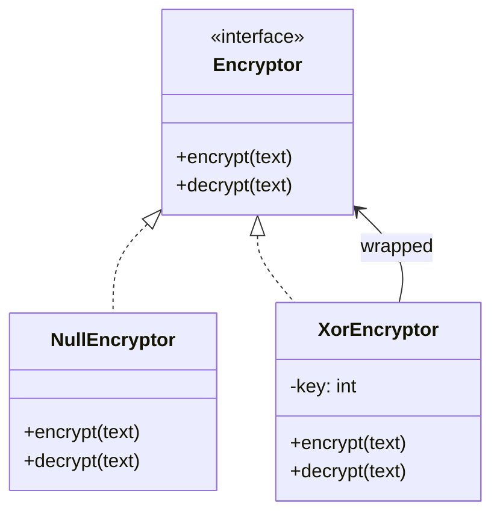
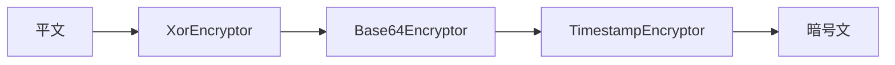
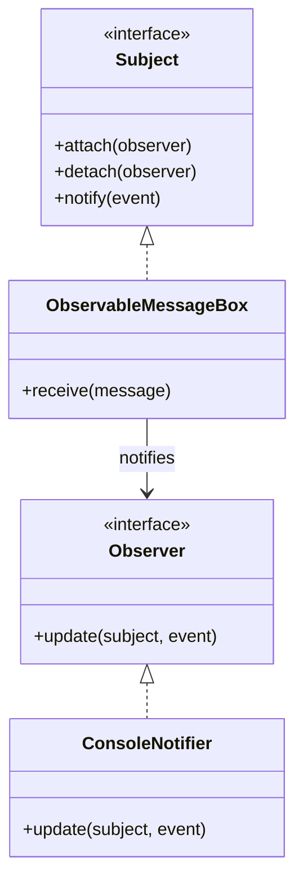
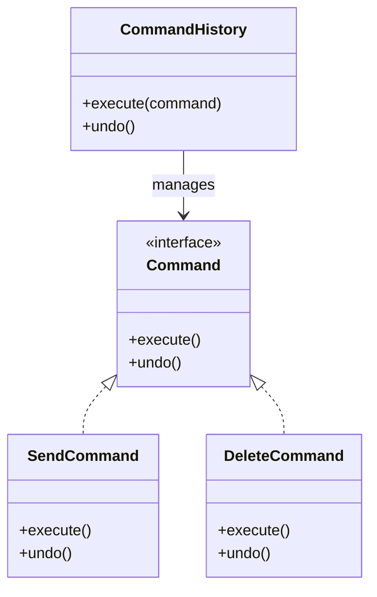
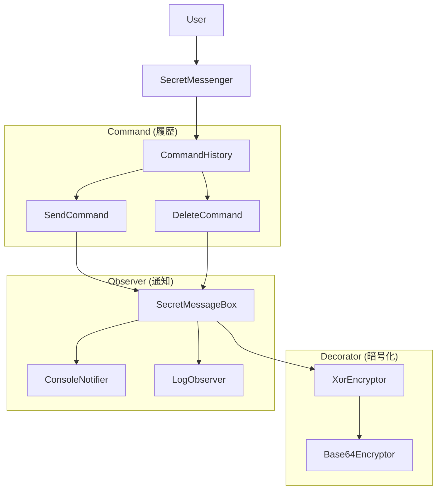
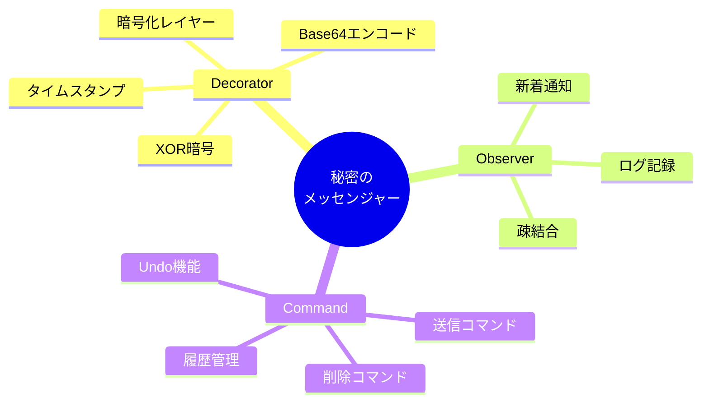

> **🔐 暗号通信ツールを作りながらデザインパターンを学ぶ**
>
> 「デザインパターンは知ってるけど、いつ使うかわからない」
> 「複数のパターンをどう組み合わせればいいの？」
>
> そんな悩みを解決します。この記事では、**秘密のメッセンジャー**を作りながら、3つのGoFデザインパターンを実践的に学びます。

## この記事で作るもの

友人と秘密のメッセージをやり取りできる暗号通信ツールを構築します。

```
Alice → [暗号化] → MessageBox → [復号] → Bob
                        ↓
              自動通知 & 操作履歴
```

**完成形の機能**:
- 📩 **メッセージ送受信**: シンプルなメールボックス
- 🔐 **多層暗号化**: XOR → Base64 の暗号化レイヤー
- 🔔 **自動通知**: 新着メッセージ到着時に通知
- ↩️ **Undo機能**: 送信/削除の取り消し

## 習得できるパターン

| パターン | 役割 | 本記事での実装 |
|---------|------|---------------|
| **Decorator** | 機能の動的追加 | 暗号化レイヤーの積み重ね |
| **Observer** | 状態変化の通知 | 新着メッセージの自動通知 |
| **Command** | 操作のオブジェクト化 | 履歴管理とUndo機能 |

## 対象読者

- Perlの基本構文を理解している方
- オブジェクト指向の基礎（クラス、継承）を知っている方
- デザインパターンを「使える」レベルにしたい方

## 技術スタック

```perl
use v5.36;           # Perl 5.36以降（signatures対応）
use Moo;             # 軽量オブジェクト指向フレームワーク
use namespace::clean;
use MIME::Base64;    # Base64エンコード用
```

---

## 第1章: まずはメッセージを送ろう

### 今回の目標

- `Message`クラスと`MessageBox`クラスを作成
- シンプルなメッセージ送受信を実現

### 動く：基本クラスの実装

まずは最もシンプルな形から始めましょう。

```perl
package Message {
    use Moo;
    use namespace::clean;
    
    has 'sender'    => (is => 'ro', required => 1);
    has 'recipient' => (is => 'ro', required => 1);
    has 'body'      => (is => 'ro', required => 1);
    has 'timestamp' => (is => 'ro', default => sub { time });
    
    sub format($self) {
        return sprintf("[%s] %s -> %s: %s",
            scalar(localtime($self->timestamp)),
            $self->sender,
            $self->recipient,
            $self->body
        );
    }
}

package MessageBox {
    use Moo;
    use namespace::clean;
    
    has 'owner'    => (is => 'ro', required => 1);
    has 'messages' => (is => 'rw', default => sub { [] });
    
    sub receive($self, $message) {
        push $self->messages->@*, $message;
    }
    
    sub get_all($self) {
        return $self->messages->@*;
    }
    
    sub count($self) {
        return scalar $self->messages->@*;
    }
}
```

### 動作確認

```perl
my $alice_box = MessageBox->new(owner => 'Alice');
my $bob_box   = MessageBox->new(owner => 'Bob');

my $msg = Message->new(
    sender    => 'Alice',
    recipient => 'Bob',
    body      => 'こんにちは、ボブ！'
);
$bob_box->receive($msg);

say "ボブのメッセージボックス: ", $bob_box->count, "件";
```

### 今回のポイント

- `Message`は不変（immutable）なデータオブジェクト
- `MessageBox`は単純なコレクション管理
- まだ暗号化なし = **平文そのまま**

---

## 第2章: 暗号化したい！でも…

### 前章の振り返り

第1章では基本的なメッセージ送受信を実装しました。しかし、メッセージは平文のまま保存されています。秘密のメッセンジャーなのに、これでは秘密になりません！

### 今回の目標

- XOR暗号を追加しようとする
- 既存コードの変更が必要になり**破綻**を体験

### 破綻：既存コードへの暗号化追加

暗号化を追加しようとすると、こうなってしまいます：

```perl
package MessageBox {
    use Moo;
    use namespace::clean;
    
    has 'owner'        => (is => 'ro', required => 1);
    has 'messages'     => (is => 'rw', default => sub { [] });
    has 'use_encrypt'  => (is => 'ro', default => 0);  # 暗号化フラグ追加
    has 'encrypt_key'  => (is => 'ro', default => 42); # 暗号化キー追加
    
    sub receive($self, $message) {
        my $body = $message->body;
        if ($self->use_encrypt) {
            $body = $self->_xor_encrypt($body);  # 暗号化ロジック混入
        }
        # ... 保存処理
    }
    
    sub get_all($self) {
        # 復号ロジックも必要に...
    }
    
    sub _xor_encrypt($self, $text) {
        # 暗号化メソッドがMessageBoxに混在
    }
}
```

### 問題点の整理

| 問題 | 説明 |
|------|------|
| **クラスの肥大化** | MessageBoxが暗号化の責務まで持つ |
| **OCP違反** | 新しい暗号方式を追加するたびにMessageBoxを変更 |
| **テスト困難** | 暗号化とメールボックス機能が分離できない |
| **再利用不可** | 暗号化ロジックを他で使えない |

> **OCP（開放閉鎖の原則）**: 拡張に対して開いていて、修正に対して閉じているべき

### 今回のポイント

- 「動くコード」と「良いコード」は違う
- 責務の分離ができていないと拡張時に破綻する
- → **Decoratorパターン**で解決へ

---

## 第3章: レイヤーで包もう

### 前章の振り返り

暗号化を追加しようとしたら、MessageBoxクラスが肥大化して破綻しました。責務の分離が必要です。

### 今回の目標

- **Decoratorパターン**を導入
- 暗号化をMessageBoxから分離

### Decoratorパターンとは




### 完成：Encryptor::Role の実装

```perl
package Encryptor::Role {
    use Moo::Role;
    use namespace::clean;
    
    requires 'encrypt';
    requires 'decrypt';
    
    has 'wrapped' => (is => 'ro', predicate => 'has_wrapped');
    
    sub process_encrypt($self, $text) {
        my $result = $self->encrypt($text);
        return $self->has_wrapped 
            ? $self->wrapped->process_encrypt($result) 
            : $result;
    }
    
    sub process_decrypt($self, $text) {
        my $result = $self->has_wrapped 
            ? $self->wrapped->process_decrypt($text) 
            : $text;
        return $self->decrypt($result);
    }
}
```

### XorEncryptor の実装

```perl
package XorEncryptor {
    use Moo;
    with 'Encryptor::Role';
    use namespace::clean;
    
    has 'key' => (is => 'ro', default => 42);
    
    sub encrypt($self, $text) {
        return join '', map { chr(ord($_) ^ $self->key) } split //, $text;
    }
    
    sub decrypt($self, $text) {
        return $self->encrypt($text);  # XORは対称暗号
    }
}
```

### 改善されたMessageBox

```perl
package MessageBox {
    use Moo;
    use namespace::clean;
    
    has 'owner'     => (is => 'ro', required => 1);
    has 'messages'  => (is => 'rw', default => sub { [] });
    has 'encryptor' => (is => 'ro', default => sub { NullEncryptor->new });
    
    sub receive($self, $message) {
        my $encrypted_body = $self->encryptor->process_encrypt($message->body);
        # 暗号化はEncryptorに委譲
    }
}
```

### 今回のポイント

- **Decorator**は機能を「包む」パターン
- MessageBoxは暗号化の詳細を知らない
- **OCP達成**: 新しい暗号方式は新クラス追加で対応

---

## 第4章: 暗号を重ねる

### 前章の振り返り

Decoratorパターンで暗号化を分離しました。次は複数のDecoratorを重ねてみましょう。

### 今回の目標

- Base64エンコード、タイムスタンプ追加など複数のDecoratorを重ねる
- Decoratorの真の威力を体感

### 動く：Base64Decorator の追加

```perl
package Base64Encryptor {
    use Moo;
    with 'Encryptor::Role';
    use MIME::Base64 qw(encode_base64 decode_base64);
    use namespace::clean;
    
    sub encrypt($self, $text) {
        return encode_base64($text, '');  # 改行なし
    }
    
    sub decrypt($self, $text) {
        return decode_base64($text);
    }
}
```

### 完成：3層のDecoratorチェーン

```perl
# Timestamp → Base64 → XOR の順で暗号化
my $chain = TimestampEncryptor->new(
    wrapped => Base64Encryptor->new(
        wrapped => XorEncryptor->new(key => 42)
    )
);

my $encrypted = $chain->process_encrypt("SECRET MESSAGE");
# → "1738500000|eWt6a256fXd8cXV8Z3lvYmU="
```

### レイヤー構成



### 今回のポイント

- Decoratorは**ネスト可能**
- 組み合わせは無限大
- 各レイヤーは独立してテスト可能

---

## 第5章: 新着メッセージを見逃すな

### 前章の振り返り

Decoratorパターンで暗号化レイヤーを自由に重ねられるようになりました。次は「新着メッセージの通知」機能を追加したくなります。

### 今回の目標

- ポーリングによるメッセージチェックを実装
- その非効率さを体感

### 破綻：ポーリング実装

```perl
package MessagePoller {
    use Moo;
    use namespace::clean;
    
    has 'box'        => (is => 'ro', required => 1);
    has 'last_count' => (is => 'rw', default => 0);
    
    sub check_for_new($self) {
        my $current_count = $self->box->count;
        if ($current_count > $self->last_count) {
            my $new_count = $current_count - $self->last_count;
            $self->last_count($current_count);
            return $new_count;
        }
        return 0;
    }
}
```

### 問題点の整理

| 問題 | 説明 |
|------|------|
| **リソース無駄** | 定期的にチェックが必要 → CPU/メモリ消費 |
| **遅延** | チェック間隔が長い → 通知が遅れる |
| **負荷** | チェック間隔が短い → 負荷が増える |
| **責務の問題** | メッセージ到着を知っているのはMessageBoxだけ |

### 今回のポイント

- ポーリングは「プル型」の設計
- 本当に必要なのは「プッシュ型」の通知
- → **Observerパターン**で解決へ

---

## 第6章: 監視者を配置せよ

### 前章の振り返り

ポーリングによるメッセージチェックは非効率でした。メッセージ到着時に「能動的に通知」してほしいですね。

### 今回の目標

- **Observerパターン**を導入
- メッセージ到着時に自動通知

### Observerパターンとは




### 完成：Subject::Role と Observer の実装

```perl
package Subject::Role {
    use Moo::Role;
    use namespace::clean;
    
    has 'observers' => (is => 'rw', default => sub { [] });
    
    sub attach($self, $observer) {
        push $self->observers->@*, $observer;
    }
    
    sub notify($self, $event, @args) {
        $_->update($self, $event, @args) for $self->observers->@*;
    }
}

package ObservableMessageBox {
    use Moo;
    with 'Subject::Role';
    use namespace::clean;
    
    sub receive($self, $msg) {
        push $self->messages->@*, $msg;
        $self->notify('new_message', $msg);  # 通知を発火！
    }
}

package ConsoleNotifier {
    use Moo;
    with 'Observer::Role';
    use namespace::clean;
    
    sub update($self, $subject, $event, @args) {
        if ($event eq 'new_message') {
            my ($msg) = @args;
            say "📩 新着: ", $msg->sender, " -> ", $msg->body;
        }
    }
}
```

### 使用例

```perl
my $box = ObservableMessageBox->new(owner => 'Bob');
$box->attach(ConsoleNotifier->new);

$box->receive(Message->new(sender => 'Alice', recipient => 'Bob', body => 'Hello!'));
# → 即座に通知: 📩 新着: Alice -> Hello!
```

### 今回のポイント

- **Observer**は「通知」のパターン
- **疎結合**: MessageBoxは通知先の詳細を知らない
- 複数のObserverを登録できる（ログ、メール通知、Slack等）

---

## 第7章: 操作を記録したい

### 前章の振り返り

Observerパターンで新着メッセージの自動通知ができるようになりました。次は「操作履歴」と「Undo機能」が欲しくなります。

### 今回の目標

- ベタ書きで履歴管理を実装
- Undo実装の難しさを体感

### 破綻：ベタ書き履歴

```perl
package MessageBox {
    use Moo;
    use namespace::clean;
    
    has 'history' => (is => 'rw', default => sub { [] });
    
    sub receive($self, $msg) {
        push $self->messages->@*, $msg;
        push $self->history->@*, { action => 'receive', msg => $msg };
    }
    
    sub delete($self, $index) {
        my $msg = splice $self->messages->@*, $index, 1;
        push $self->history->@*, { action => 'delete', msg => $msg, index => $index };
    }
    
    sub undo($self) {
        my $last = pop $self->history->@*;
        
        # 問題: アクションごとに異なる処理が必要
        if ($last->{action} eq 'receive') {
            pop $self->messages->@*;
        } elsif ($last->{action} eq 'delete') {
            # 元の位置に戻すのが難しい...
            splice $self->messages->@*, $last->{index}, 0, $last->{msg};
        }
        # 新しいアクションを追加するたびにこのメソッドを変更必要
    }
}
```

### 問題点の整理

| 問題 | 説明 |
|------|------|
| **undoの肥大化** | アクション種別ごとに分岐が必要 |
| **OCP違反** | 新しい操作を追加するたびにundo修正 |
| **テスト困難** | 操作と履歴管理が分離できない |

### 今回のポイント

- 操作を「データ」として扱いたい
- 各操作に「逆操作」を定義させたい
- → **Commandパターン**で解決へ

---

## 第8章: 命令をオブジェクトに

### 前章の振り返り

ベタ書き履歴では、新しい操作を追加するたびにundoメソッドを修正する必要がありました。

### 今回の目標

- **Commandパターン**を導入
- 各操作を独立したオブジェクトに

### Commandパターンとは




### 完成：Command::Role と実装

```perl
package Command::Role {
    use Moo::Role;
    use namespace::clean;
    requires 'execute';
    requires 'undo';
    has 'description' => (is => 'ro', default => '');
}

package SendCommand {
    use Moo;
    with 'Command::Role';
    use namespace::clean;
    
    has 'box'     => (is => 'ro', required => 1);
    has 'message' => (is => 'ro', required => 1);
    has '+description' => (default => sub { '送信' });
    
    sub execute($self) { $self->box->add($self->message) }
    sub undo($self)    { $self->box->remove_last }
}

package DeleteCommand {
    use Moo;
    with 'Command::Role';
    use namespace::clean;
    
    has 'box'         => (is => 'ro', required => 1);
    has 'index'       => (is => 'ro', required => 1);
    has 'deleted_msg' => (is => 'rw');  # Undo用に保存
    has '+description' => (default => sub { '削除' });
    
    sub execute($self) { 
        $self->deleted_msg($self->box->remove_at($self->index));
    }
    sub undo($self) { 
        $self->box->insert_at($self->index, $self->deleted_msg);
    }
}
```

### CommandHistory

```perl
package CommandHistory {
    use Moo;
    use namespace::clean;
    
    has 'history' => (is => 'rw', default => sub { [] });
    
    sub execute($self, $command) {
        $command->execute;
        push $self->history->@*, $command;
    }
    
    sub undo($self) {
        return unless $self->history->@*;
        my $command = pop $self->history->@*;
        $command->undo;
    }
}
```

### 今回のポイント

- **Command**は「操作」をオブジェクト化するパターン
- 各Commandが自分のundo方法を知っている
- 新しい操作は新Commandクラス追加で対応（OCP達成）

---

## 第9章: 完成！秘密のメッセンジャー

### 前章までの振り返り

3つのパターンを個別に学びました：

| パターン | 解決した問題 |
|---------|-------------|
| **Decorator** | 暗号化レイヤーの動的追加 |
| **Observer** | 新着メッセージの自動通知 |
| **Command** | 操作履歴とUndo機能 |

### 今回の目標

- 3パターンを統合して完成版を構築

### 完成版アーキテクチャ



### 完成版コード

```perl
package SecretMessenger {
    use Moo;
    use namespace::clean;
    
    has 'box'     => (is => 'ro', required => 1);
    has 'history' => (is => 'ro', default => sub { CommandHistory->new });
    
    sub send($self, $sender, $body) {
        my $msg = Message->new(
            sender    => $sender,
            recipient => $self->box->owner,
            body      => $body
        );
        $self->history->execute(SendCommand->new(box => $self->box, message => $msg));
    }
    
    sub delete($self, $index) {
        $self->history->execute(DeleteCommand->new(box => $self->box, index => $index));
    }
    
    sub undo($self) {
        if ($self->history->can_undo) {
            $self->history->undo;
            say "↩️ Undo完了";
        }
    }
}
```

### デモ実行

```perl
# 暗号化チェーン: Base64 → XOR
my $encryptor = Base64Encryptor->new(
    wrapped => XorEncryptor->new(key => 42)
);

# Bobのメッセージボックス
my $box = SecretMessageBox->new(owner => 'Bob', encryptor => $encryptor);
$box->attach(ConsoleNotifier->new(name => 'Desktop'));

# メッセンジャーアプリ
my $app = SecretMessenger->new(box => $box);

$app->send('Alice', 'こんにちは、秘密のメッセージです！');
# → [Desktop] 📩 新着: Alice

$app->delete(0);
# → [Desktop] 🗑️ メッセージ削除

$app->undo;
# → ↩️ Undo完了
```

---

## まとめ

### 学んだこと

この記事では、**秘密のメッセンジャー**を構築しながら3つのGoFデザインパターンを学びました。



### パターンの選択基準

| 状況 | 適用パターン |
|------|-------------|
| 機能を動的に追加・削除したい | Decorator |
| 状態変化を複数の場所に通知したい | Observer |
| 操作を記録・取り消し・再実行したい | Command |

### 次のステップ

- **Memento**: 状態のスナップショット保存
- **Strategy**: アルゴリズムの交換可能化
- **Factory**: オブジェクト生成の委譲

### 完成コード

本記事のコードは以下で確認できます：

- [ch09_secret_messenger.pl](https://github.com/nqou-net/www.nqou.net/tree/main/agents/tests/observer-decorator-command-series/lib/ch09_secret_messenger.pl)

---

> 🎉 **おめでとうございます！**
>
> これで「暗号通信ツールを作った」と友人に自慢できますね。
> デザインパターンは使ってこそ身につきます。ぜひ自分のプロジェクトでも試してみてください！
