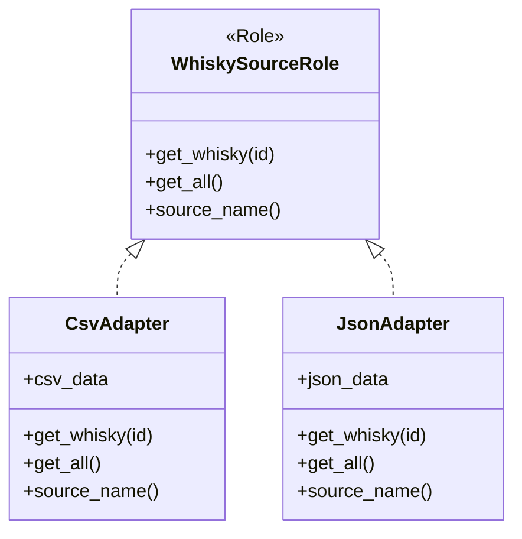
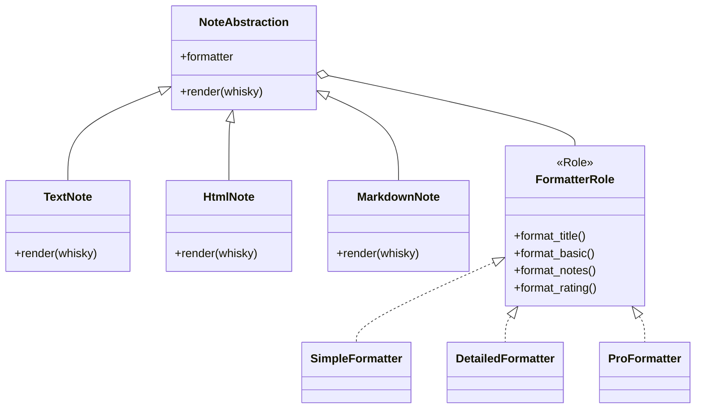
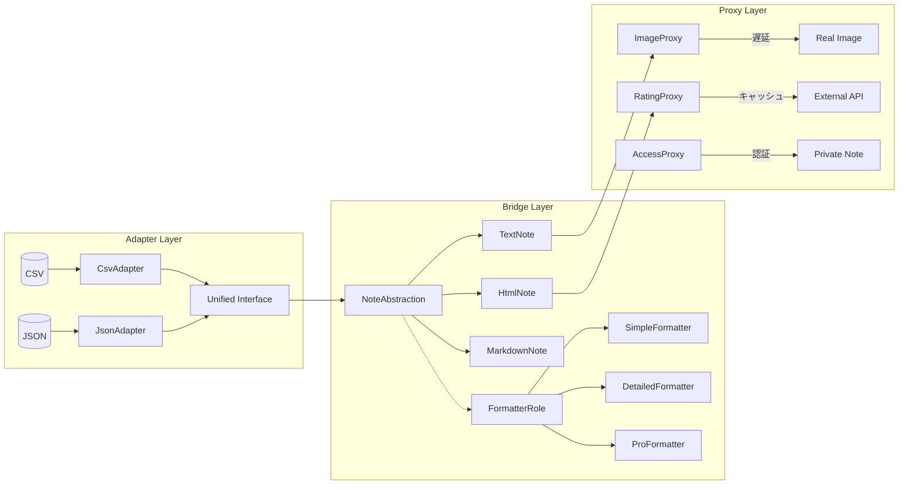
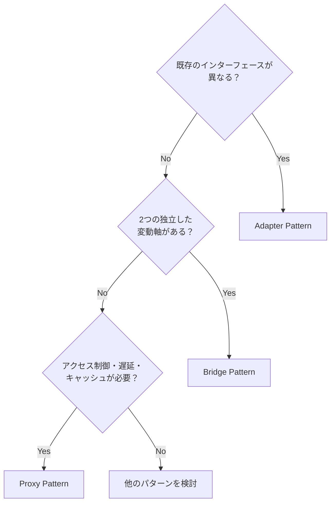

## はじめに

「Bridge、Adapter、Proxy......全部『間に入る』パターンでしょ？」

デザインパターンを勉強していると、この3つの違いがイマイチわからないという声をよく聞きます。確かに、どれも「何かと何かの間に入って何かする」という点では似ています。しかし、**なぜ間に入るのか**という目的が全く異なるのです。

本記事では、**ウイスキーのテイスティングノート**を題材に、この3パターンを実際に手を動かしながら学びます。

### この記事で作るもの

ウイスキーの試飲記録を管理するCLIツールを段階的に構築します。

- **CSV/JSON**から銘柄情報を読み込み
- **Text/HTML/Markdown**形式で出力
- **Simple/Detailed/Pro**スタイルで表示
- **遅延ロード・キャッシュ・アクセス制御**機能付き

### 習得する3パターン

| パターン | 何のために「間に入る」か | キーワード |
|---------|-------------------------|-----------|
| **Adapter** | 異なるインターフェースを統一するため | 変換、ラッパー、互換性 |
| **Bridge** | 2つの独立した変動軸を分離するため | 抽象×実装、n×m → n+m |
| **Proxy** | 本物へのアクセスを制御するため | 代理、遅延、キャッシュ |

### 対象読者

- デザインパターンシリーズを一通り読了したが、まだ自力で使いこなせない方
- Bridge/Adapter/Proxyの違いがピンとこない方
- 「if/elseに戻ってしまう」を卒業したい方

### 技術スタック

- Perl v5.36以降（signatures、postfix dereference対応）
- Moo（軽量OOPフレームワーク）
- JSON::PP（標準モジュール）

---

## 第1章: まずはCSVから読み込もう

### 今回の目標

- CSVファイルからウイスキー情報を読み込む
- テキストで表示する基本的な処理を実装

### 最初の実装

まずはシンプルに、CSVデータを読み込んで表示してみましょう。

```perl
#!/usr/bin/env perl
use v5.36;
use warnings;

# CSVデータをHEREDOCで定義
my $csv_data = <<'CSV';
id,name,region,age,abv,nose,palate,finish,rating
1,山崎12年,日本,12,43,蜂蜜とバニラ,フルーティで滑らか,長くスパイシー,92
2,ラフロイグ10年,アイラ,10,40,強烈なピート,スモーキーで塩辛い,力強くドライ,88
3,グレンフィディック12年,スペイサイド,12,40,洋梨とリンゴ,クリーミーで甘い,フレッシュな余韻,85
CSV

# CSVをパースして表示
say "=== ウイスキーテイスティング・ノート ===\n";

my @lines = split /\n/, $csv_data;
my $header = shift @lines;

for my $line (@lines) {
    next unless $line =~ /\S/;
    my @fields = split /,/, $line;
    my ($id, $name, $region, $age, $abv, $nose, $palate, $finish, $rating) = @fields;
    
    say "【$name】";
    say "  産地: $region / 熟成: ${age}年 / 度数: ${abv}%";
    say "  香り: $nose";
    say "  味わい: $palate";
    say "  余韻: $finish";
    say "  評価: $rating/100";
    say "";
}

say "=== 読み込み完了 ===";
```

実行結果：

```
=== ウイスキーテイスティング・ノート ===

【山崎12年】
  産地: 日本 / 熟成: 12年 / 度数: 43%
  香り: 蜂蜜とバニラ
  味わい: フルーティで滑らか
  余韻: 長くスパイシー
  評価: 92/100
...
```

動きました！CSVを読み込んで、きれいにフォーマットして表示できています。

### 今回のポイント

- CSVの基本的なパースはsplitで十分
- HEREDOCでサンプルデータを埋め込むと開発しやすい

---

## 第2章: JSONも読みたい！でも形式が違う

### 今回の目標

- JSONファイルにも対応したい
- しかし、JSONの構造がCSVと全く異なる問題に直面

### 問題：インターフェースの不一致

友人が「このウイスキーデータベースのJSONも使えない？」と言ってきました。喜んで受け取ったJSON、しかし......

```json
{
    "whiskies": [
        {
            "whisky_id": "W002",
            "whisky_name": "ラフロイグ10年",
            "origin": { "country": "スコットランド", "region": "アイラ" },
            "specs": { "age_years": 10, "alcohol_percentage": 40 },
            "tasting_notes": {
                "aroma": "強烈なピート",
                "taste": "スモーキーで塩辛い",
                "after": "力強くドライ"
            },
            "score": 88
        }
    ]
}
```

CSVとは構造が全く違います！

- `id` → `whisky_id`
- `name` → `whisky_name`
- `region` → `origin.region`（ネスト構造！）
- `rating` → `score`

### if/else地獄の始まり

「とりあえずフォーマット判定で分岐すればいいか」と思って書いたコードがこちら：

```perl
sub read_whisky_data($format, $data) {
    my @whiskies;
    
    if ($format eq 'csv') {
        my @lines = split /\n/, $data;
        shift @lines;
        for my $line (@lines) {
            my @f = split /,/, $line;
            push @whiskies, {
                id     => $f[0],
                name   => $f[1],
                region => $f[2],
                # ... 以下略
            };
        }
    }
    elsif ($format eq 'json') {
        my $obj = decode_json($data);
        for my $w ($obj->{whiskies}->@*) {
            # JSONの構造がCSVと全く違う！変換が必要
            push @whiskies, {
                id     => $w->{whisky_id},
                name   => $w->{whisky_name},
                region => $w->{origin}{region},  # ネスト構造
                # ... 以下略
            };
        }
    }
    # TODO: XMLも追加したい... elsif ($format eq 'xml') { ... }
    # TODO: 外部APIも追加したい... elsif ($format eq 'api') { ... }
    else {
        die "未対応のフォーマット: $format";
    }
    
    return @whiskies;
}
```

### 問題点

| 問題 | 説明 |
|-----|------|
| if/elseの肥大化 | 新フォーマット追加のたびに分岐が増える |
| 変換ロジックの散乱 | 各フォーマットの変換処理が1つの関数に集中 |
| テストが困難 | 特定のフォーマットだけテストしにくい |
| 拡張性が低い | 新しい開発者が追加しにくい |

「XML対応」「外部API対応」と要望が出るたびに、この関数がどんどん膨れ上がっていきます。

---

## 第3章: Adapterでデータソースを統一

### 今回の目標

- Adapterパターンで異なるデータソースを統一インターフェースで扱う
- if/else地獄から脱出する

### Adapterパターンとは？

**Adapterパターン**は、異なるインターフェースを持つ既存のクラスを、期待されるインターフェースに変換するパターンです。

> 「何のために間に入る？」→ **異なるインターフェースを統一するため**

### 設計

まず、データソースの統一インターフェースをRoleとして定義します。

```perl
package WhiskySourceRole;
use v5.36;
use warnings;
use Moo::Role;

# 統一インターフェース: すべてのAdapterが実装するメソッド
requires 'get_whisky';     # id を指定して1つ取得
requires 'get_all';        # 全件取得
requires 'source_name';    # データソース名

1;
```

次に、このRoleを実装するAdapterを作ります。

**CsvAdapter.pm**

```perl
package CsvAdapter;
use v5.36;
use warnings;
use Moo;

with 'WhiskySourceRole';

has csv_data => (is => 'ro', required => 1);
has '_cache' => (is => 'lazy', builder => '_build_cache');

sub _build_cache($self) {
    my @whiskies;
    my @lines = split /\n/, $self->csv_data;
    shift @lines; # ヘッダー除去
    
    for my $line (@lines) {
        next unless $line =~ /\S/;
        my @f = split /,/, $line;
        push @whiskies, {
            id     => $f[0],
            name   => $f[1],
            region => $f[2],
            age    => $f[3],
            abv    => $f[4],
            nose   => $f[5],
            palate => $f[6],
            finish => $f[7],
            rating => $f[8],
        };
    }
    
    return { map { $_->{id} => $_ } @whiskies };
}

sub get_whisky($self, $id) { $self->_cache->{$id} }
sub get_all($self) { values $self->_cache->%* }
sub source_name($self) { 'CSV' }

1;
```

**JsonAdapter.pm**

```perl
package JsonAdapter;
use v5.36;
use warnings;
use utf8;
use Moo;
use JSON::PP;
use Encode qw(decode);

with 'WhiskySourceRole';

has json_data => (is => 'ro', required => 1);
has '_cache' => (is => 'lazy', builder => '_build_cache');

sub _build_cache($self) {
    my $json_text = $self->json_data;
    $json_text = decode('UTF-8', $json_text) unless utf8::is_utf8($json_text);
    my $obj = JSON::PP->new->utf8(0)->decode($json_text);
    my @whiskies;
    
    for my $w ($obj->{whiskies}->@*) {
        # JSONの独自構造 → 統一構造へ変換
        push @whiskies, {
            id     => $w->{whisky_id},
            name   => $w->{whisky_name},
            region => $w->{origin}{region},
            age    => $w->{specs}{age_years},
            abv    => $w->{specs}{alcohol_percentage},
            nose   => $w->{tasting_notes}{aroma},
            palate => $w->{tasting_notes}{taste},
            finish => $w->{tasting_notes}{after},
            rating => $w->{score},
        };
    }
    
    return { map { $_->{id} => $_ } @whiskies };
}

sub get_whisky($self, $id) { $self->_cache->{$id} }
sub get_all($self) { values $self->_cache->%* }
sub source_name($self) { 'JSON' }

1;
```

### 使い方

```perl
# どちらも同じインターフェースで使える！
my $csv_adapter = CsvAdapter->new(csv_data => $csv_data);
my $json_adapter = JsonAdapter->new(json_data => $json_data);

# 統一されたメソッドでアクセス
my @all_whiskies;
push @all_whiskies, $csv_adapter->get_all;
push @all_whiskies, $json_adapter->get_all;
```

### 今回のポイント

- **Adapter**は異なるインターフェースを統一する
- 各データソースの変換ロジックがAdapterクラスに分離される
- 新しいデータソースの追加は新しいAdapterを作るだけ



---

## 第4章: 出力形式を増やしたい

### 今回の目標

- Text/HTML/Markdownの3つの出力形式に対応
- さらにSimple/Detailed/Proの3スタイルに対応
- 組み合わせ爆発の問題に直面

### 問題：組み合わせ爆発

「テキストだけじゃなくてHTMLでも出力したい」
「Markdownでブログに貼りたい」
「シンプル表示と詳細表示を切り替えたい」
「プロ向けの評価チャート付き表示も欲しい」

要望をまとめると：

| 出力形式 | スタイル |
|---------|----------|
| Text | Simple, Detailed, Pro |
| HTML | Simple, Detailed, Pro |
| Markdown | Simple, Detailed, Pro |

3×3 = **9パターン**の組み合わせが必要です。

### if/elseで実装してみると...

```perl
sub render_note($whisky, $format, $style) {
    if ($format eq 'text') {
        if ($style eq 'simple') { ... }
        elsif ($style eq 'detailed') { ... }
        elsif ($style eq 'pro') { ... }
    }
    elsif ($format eq 'html') {
        if ($style eq 'simple') { ... }
        elsif ($style eq 'detailed') { ... }
        elsif ($style eq 'pro') { ... }
    }
    elsif ($format eq 'markdown') {
        if ($style eq 'simple') { ... }
        elsif ($style eq 'detailed') { ... }
        elsif ($style eq 'pro') { ... }
    }
}
```

9つの分岐！そして新しいフォーマットを追加すると3つ、新しいスタイルを追加しても3つの実装が必要になります。

| 追加 | 必要な実装数 |
|------|-------------|
| 新フォーマット（PDF） | 3つ（Simple/Detailed/Pro） |
| 新スタイル（Expert） | 3つ（Text/HTML/MD） |
| 両方追加 | 4つ |

これが**組み合わせ爆発**です。n×m の組み合わせを n+m で実現する方法が必要です。

---

## 第5章: Bridgeで出力とスタイルを分離

### 今回の目標

- Bridgeパターンで出力形式とスタイルを分離
- 3×3=9パターンを3+3=6クラスで実現

### Bridgeパターンとは？

**Bridgeパターン**は、抽象部分と実装部分を分離し、それぞれを独立して変更できるようにするパターンです。

> 「何のために間に入る？」→ **2つの独立した変動軸を分離するため**

### 設計

2つの軸を分離します：

1. **抽象側（Abstraction）**: 出力形式（Text/HTML/Markdown）
2. **実装側（Implementor）**: スタイル（Simple/Detailed/Pro）

まず実装側（スタイル）のRoleを定義：

```perl
package FormatterRole;
use v5.36;
use warnings;
use Moo::Role;

requires 'format_name';
requires 'format_title';
requires 'format_basic';
requires 'format_notes';
requires 'format_rating';

1;
```

スタイルごとの実装：

```perl
# SimpleFormatter.pm
package SimpleFormatter;
use v5.36;
use warnings;
use Moo;

with 'FormatterRole';

sub format_name($self) { 'Simple' }
sub format_title($self, $whisky) { $whisky->{name} }
sub format_basic($self, $whisky) { "$whisky->{region} $whisky->{rating}点" }
sub format_notes($self, $whisky) { '' }  # シンプルでは省略
sub format_rating($self, $whisky) { '' }

1;
```

```perl
# ProFormatter.pm
package ProFormatter;
use v5.36;
use warnings;
use utf8;
use Moo;

with 'FormatterRole';

sub format_name($self) { 'Pro' }
sub format_title($self, $whisky) { $whisky->{name} }
sub format_basic($self, $whisky) {
    join(' / ', "産地: $whisky->{region}", "熟成: $whisky->{age}年", "度数: $whisky->{abv}%")
}
sub format_notes($self, $whisky) {
    join("\n", "【香り】$whisky->{nose}", "【味わい】$whisky->{palate}", "【余韻】$whisky->{finish}")
}
sub format_rating($self, $whisky) {
    my $rating = $whisky->{rating};
    my $stars = '★' x int($rating / 20) . '☆' x (5 - int($rating / 20));
    "$stars $rating/100"
}

1;
```

次に抽象側（出力形式）を定義：

```perl
# NoteAbstraction.pm（基底クラス）
package NoteAbstraction;
use v5.36;
use warnings;
use Moo;

has formatter => (is => 'ro', required => 1);

sub _get_title($self, $whisky) { $self->formatter->format_title($whisky) }
sub _get_basic($self, $whisky) { $self->formatter->format_basic($whisky) }
sub _get_notes($self, $whisky) { $self->formatter->format_notes($whisky) }
sub _get_rating($self, $whisky) { $self->formatter->format_rating($whisky) }

1;
```

```perl
# TextNote.pm
package TextNote;
use v5.36;
use warnings;
use Moo;

extends 'NoteAbstraction';

sub render($self, $whisky) {
    my $title  = $self->_get_title($whisky);
    my $basic  = $self->_get_basic($whisky);
    my $notes  = $self->_get_notes($whisky);
    my $rating = $self->_get_rating($whisky);
    
    my $output = "【$title】\n";
    $output .= "  $basic\n" if $basic;
    $output .= "  $notes\n" if $notes;
    $output .= "  $rating\n" if $rating;
    
    return $output;
}

1;
```

```perl
# HtmlNote.pm
package HtmlNote;
use v5.36;
use warnings;
use Moo;

extends 'NoteAbstraction';

sub render($self, $whisky) {
    my $title  = $self->_get_title($whisky);
    my $basic  = $self->_get_basic($whisky);
    my $notes  = $self->_get_notes($whisky);
    my $rating = $self->_get_rating($whisky);
    
    my $output = "<article>\n  <h2>$title</h2>\n";
    $output .= "  <p class=\"basic\">$basic</p>\n" if $basic;
    $output .= "  <div class=\"notes\">$notes</div>\n" if $notes;
    $output .= "  <p class=\"rating\">$rating</p>\n" if $rating;
    $output .= "</article>";
    
    return $output;
}

1;
```

### 使い方

```perl
# 出力形式×スタイルの組み合わせを自由に
my $text_simple = TextNote->new(formatter => SimpleFormatter->new);
my $html_pro = HtmlNote->new(formatter => ProFormatter->new);
my $md_detailed = MarkdownNote->new(formatter => DetailedFormatter->new);

say $text_simple->render($whisky);
say $html_pro->render($whisky);
say $md_detailed->render($whisky);
```

### 今回のポイント

- **Bridge**は2つの独立した変動軸を分離する
- n×m = 9パターンを n+m = 6クラスで実現
- 新しい出力形式やスタイルの追加が各1クラスで済む



---

## 第6章: 画像の読み込みが重い！

### 今回の目標

- ウイスキー画像の一括読み込みでパフォーマンス問題を体験
- 遅延ロードの必要性を理解

### 問題：全件ロードが重い

ウイスキー画像ギャラリーを追加しようとしました。

```perl
package SlowGallery;
use Moo;

has images => (is => 'ro', default => sub { [] });

sub load_all($self, @image_ids) {
    say "画像を全件ロードします...";
    
    for my $id (@image_ids) {
        my $img = WhiskyImage->new(id => $id, filename => "whisky_$id.jpg");
        # 画像は生成時に即座にロードされる（重い！）
        push $self->images->@*, $img;
    }
}
```

```perl
# WhiskyImage は生成時にデータをロード
package WhiskyImage;
use Moo;

has id => (is => 'ro', required => 1);
has filename => (is => 'ro', required => 1);
has data => (is => 'lazy', builder => '_load_image');

sub _load_image($self) {
    say "  [!] 画像をロード中: $self->{filename} (1秒かかる重い処理...)";
    sleep 1;  # 重い処理をシミュレート
    return "IMAGE_DATA_FOR_$self->{id}";
}

sub BUILD($self, $args) {
    $self->data;  # 生成時に即座にロード（問題！）
}
```

### 実行結果

```
=== ギャラリー初期化開始 ===
画像を全件ロードします...

  [!] 画像をロード中: whisky_1.jpg (1秒かかる重い処理...)
  [!] 画像をロード中: whisky_2.jpg (1秒かかる重い処理...)
  [!] 画像をロード中: whisky_3.jpg (1秒かかる重い処理...)

=== ギャラリー初期化完了（3秒経過）===

ユーザーが見たいのは1件目だけなのに、全件ロードしてしまった！
```

### 問題点

| 問題 | 説明 |
|-----|------|
| 初期化が遅い | N件の画像があればN秒かかる |
| 無駄なロード | ユーザーが見ない画像もロード |
| スケールしない | データが増えるほど遅くなる |

解決策は「必要な時だけロードする」＝**遅延ロード**です。

---

## 第7章: Proxyで遅延・キャッシュ・制御

### 今回の目標

- Proxyパターンで遅延ロード、キャッシュ、アクセス制御を実装
- 3種類のProxyを体験

### Proxyパターンとは？

**Proxyパターン**は、別のオブジェクトへのアクセスを制御する代理オブジェクトを提供するパターンです。

> 「何のために間に入る？」→ **本物へのアクセスを制御するため**

### Proxyの3つの役割

| 種類 | 役割 | 例 |
|-----|------|-----|
| Virtual Proxy | 遅延初期化 | 重い画像を必要な時だけロード |
| Cache Proxy | キャッシュ | 外部API結果をTTL付きでキャッシュ |
| Protection Proxy | アクセス制御 | 権限のあるユーザーのみアクセス許可 |

### 1. ImageProxy（遅延ロード）

```perl
package ImageProxy;
use v5.36;
use warnings;
use Moo;

has id => (is => 'ro', required => 1);
has filename => (is => 'ro', required => 1);
has real_image => (is => 'lazy', builder => '_load_real_image');
has '_loaded' => (is => 'rw', default => 0);

sub _load_real_image($self) {
    say "  [Proxy] 画像を遅延ロード中: $self->{filename}";
    sleep 1;
    $self->_loaded(1);
    return "IMAGE_DATA_FOR_$self->{id}";
}

# サムネイル表示（軽い処理）- 本物はロードしない
sub show_thumbnail($self) {
    say "  [Proxy] サムネイル表示: $self->{filename} (本物は未ロード)";
    return "THUMBNAIL_$self->{id}";
}

# 実際のデータが必要な時だけロード
sub get_data($self) {
    return $self->real_image;  # lazyにより初回アクセス時のみロード
}

sub is_loaded($self) { $self->_loaded }

1;
```

使い方：

```perl
my $img_proxy = ImageProxy->new(id => 1, filename => 'yamazaki12.jpg');
say "画像Proxy作成（まだロードされていない）";

$img_proxy->show_thumbnail;  # 本物はロードしない（軽い）
# → [Proxy] サムネイル表示: yamazaki12.jpg (本物は未ロード)

$img_proxy->get_data;  # この時点で初めてロード
# → [Proxy] 画像を遅延ロード中: yamazaki12.jpg
```

### 2. RatingProxy（キャッシュ）

```perl
package RatingProxy;
use v5.36;
use warnings;
use Moo;

has whisky_id => (is => 'ro', required => 1);
has '_cache' => (is => 'rw');
has '_cache_time' => (is => 'rw', default => 0);
has cache_ttl => (is => 'ro', default => 60);  # 60秒キャッシュ

sub _fetch_rating($self) {
    say "  [Proxy] 外部APIから評価を取得中...";
    sleep 1;  # 重い処理をシミュレート
    return { score => 92, reviews => 150, avg_price => 8000 };
}

sub get_rating($self) {
    my $now = time;
    
    # キャッシュが有効か確認
    if ($self->_cache && ($now - $self->_cache_time) < $self->cache_ttl) {
        say "  [Proxy] キャッシュから評価を返却";
        return $self->_cache;
    }
    
    # キャッシュがないか期限切れ → 外部から取得
    my $rating = $self->_fetch_rating;
    $self->_cache($rating);
    $self->_cache_time($now);
    
    return $rating;
}

sub invalidate_cache($self) {
    $self->_cache(undef);
    $self->_cache_time(0);
}

1;
```

### 3. AccessProxy（アクセス制御）

```perl
package AccessProxy;
use v5.36;
use warnings;
use Moo;

has private_note => (is => 'ro', required => 1);
has owner_id => (is => 'ro', required => 1);
has permission_level => (is => 'ro', default => 'private');

sub can_access($self, $user_id, $is_friend = 0) {
    my $level = $self->permission_level;
    
    return 1 if $level eq 'public';
    return ($user_id eq $self->owner_id || $is_friend) if $level eq 'friends';
    return ($user_id eq $self->owner_id);  # private
}

sub get_note($self, $user_id, $is_friend = 0) {
    if ($self->can_access($user_id, $is_friend)) {
        say "  [Proxy] アクセス許可: user=$user_id";
        return $self->private_note;
    }
    else {
        say "  [Proxy] アクセス拒否: user=$user_id";
        return { error => 'Access denied' };
    }
}

1;
```

### 今回のポイント

- **Proxy**は本物へのアクセスを制御する
- 遅延ロード・キャッシュ・認証の3つの役割がある
- クライアントはProxyと本物を区別しなくてよい

---

## 第8章: 3つのパターンを統合する

### 今回の目標

- Adapter → Bridge → Proxy の連携でアプリケーション全体を構築
- 3パターンがどう協調するかを体験

### 全体像

```
┌─────────────┐    ┌─────────────┐    ┌─────────────┐
│   Adapter   │ → │   Bridge    │ → │    Proxy    │
│(データ取得) │    │(出力生成)   │    │(制御・最適化)│
└─────────────┘    └─────────────┘    └─────────────┘
      ↓                 ↓                  ↓
 CSV/JSON/API     Text/HTML/MD ×      遅延ロード
 を統一IF化       Simple/Detail/Pro   キャッシュ/認証
```

### 統合版コード

```perl
#!/usr/bin/env perl
use v5.36;
use warnings;

# Adapterパターン: データソース統一
use CsvAdapter;
use JsonAdapter;

# Bridgeパターン: 出力形式×スタイル
use TextNote;
use HtmlNote;
use SimpleFormatter;
use ProFormatter;

# Proxyパターン: 遅延・キャッシュ・制御
use ImageProxy;
use RatingProxy;

# Step 1: Adapter でデータソースを統一
my $csv_adapter = CsvAdapter->new(csv_data => $csv_data);
my $json_adapter = JsonAdapter->new(json_data => $json_data);

my @all_whiskies;
push @all_whiskies, $csv_adapter->get_all;
push @all_whiskies, $json_adapter->get_all;

say "合計: " . scalar(@all_whiskies) . " 件のウイスキー";

# Step 2: Bridge で出力形式×スタイルを組み合わせ
my $text_simple = TextNote->new(formatter => SimpleFormatter->new);
my $html_pro = HtmlNote->new(formatter => ProFormatter->new);

for my $w (@all_whiskies) {
    say $text_simple->render($w);
}

# Step 3: Proxy で遅延・キャッシュ
my $img_proxy = ImageProxy->new(id => 1, filename => 'yamazaki12.jpg');
$img_proxy->show_thumbnail;  # 軽い処理

my $rating_proxy = RatingProxy->new(whisky_id => 1);
my $rating = $rating_proxy->get_rating;  # 初回は外部から
$rating = $rating_proxy->get_rating;     # 2回目はキャッシュから
```

### データフローの可視化



---

## 第9章: 振り返り〜3つの「間に入る」パターン

### 3パターンの本質的な違い

| パターン | 何のために「間に入る」か | 問題を解決する対象 |
|---------|-------------------------|-------------------|
| **Adapter** | 異なるインターフェースを統一する | インターフェースの不一致 |
| **Bridge** | 2つの変動軸を分離する | 組み合わせ爆発 |
| **Proxy** | 本物へのアクセスを制御する | パフォーマンス・セキュリティ |

### 使い分けの判断基準



### 今回作ったクラス構成

| レイヤー | クラス | 役割 |
|---------|--------|------|
| Adapter | `WhiskySourceRole` | 統一インターフェース |
| Adapter | `CsvAdapter`,`JsonAdapter` | データ変換 |
| Bridge | `NoteAbstraction` | 抽象側基底 |
| Bridge | `TextNote`,`HtmlNote`,`MarkdownNote` | 出力形式 |
| Bridge | `FormatterRole` | 実装側インターフェース |
| Bridge | `SimpleFormatter`,`DetailedFormatter`,`ProFormatter` | スタイル |
| Proxy | `ImageProxy` | 遅延ロード |
| Proxy | `RatingProxy` | キャッシュ |
| Proxy | `AccessProxy` | アクセス制御 |

### 発展的な学習

本シリーズで学んだパターンの応用：

1. **Adapter + Factory**: 複数のAdapterを動的に選択
2. **Bridge + Decorator**: 出力に追加の装飾を適用
3. **Proxy + Chain of Responsibility**: 複数のProxyを連鎖

### まとめ

「全部『間に入る』パターンでしょ？」という疑問から出発し、それぞれが**なぜ**間に入るのかを体験しました。

- **Adapter**: 異なるものを同じに見せる
- **Bridge**: 2つの軸を独立させる
- **Proxy**: 本物へのアクセスをコントロールする

この違いが「手で」わかるようになったら、もう「if/elseに戻ってしまう」ことはありません。

ウイスキーのテイスティングノートを楽しみながら、デザインパターンも楽しんでください。🥃
