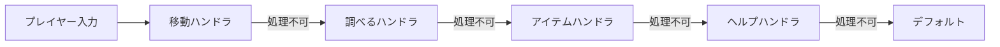
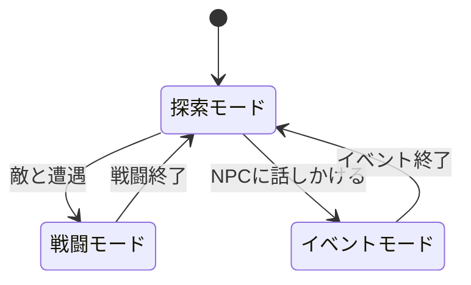
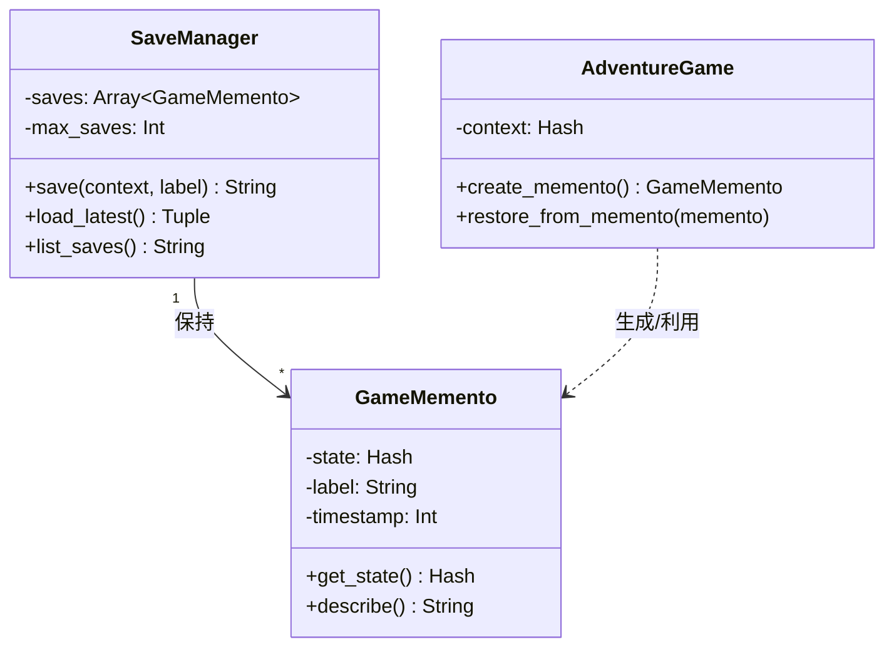
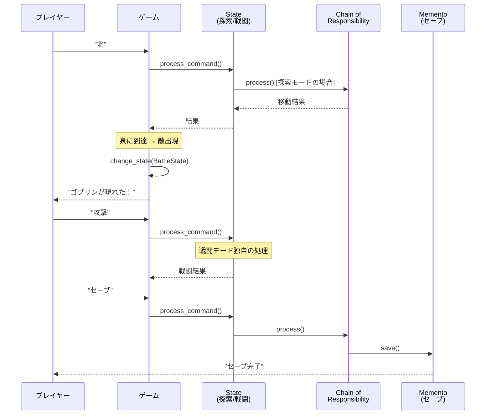
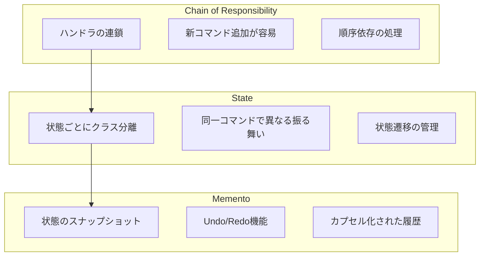

テキストアドベンチャーゲームを作りながら、3つのデザインパターン（Chain of Responsibility、State、Memento）を実践的に学びましょう。

「北に進む」「調べる」「攻撃」といったコマンドを処理し、探索モードと戦闘モードを切り替え、任意の時点に「タイムトラベル」できるゲームエンジンを段階的に構築します。

## この記事で学べること

| パターン | 役割 | ゲームでの用途 |
|---------|------|---------------|
| **Chain of Responsibility** | 処理要求の連鎖的受け渡し | プレイヤーコマンドを複数ハンドラで順番に解釈 |
| **State** | 状態に応じた振る舞い変更 | ゲームモード（探索/戦闘）で同じコマンドの挙動を変更 |
| **Memento** | 状態のスナップショット保存・復元 | セーブ/ロード機能（タイムトラベル） |

## 対象読者

- デザインパターンの名前は知っているが、いつ使えばいいか分からない方
- Perlの基本文法（サブルーチン、ハッシュ、配列）を理解している方
- 手を動かしながら学びたい方

## 技術スタック

- **Perl**: v5.36以降（signatures使用）
- **Moo**: 軽量オブジェクト指向フレームワーク
- **Storable**: 状態のディープコピー用

```bash
# 必要なモジュールのインストール
cpanm Moo Storable
```

---

## 第1章: 冒険の始まり - シンプルなゲームループ

### 今回の目標

- 基本的なREPL（Read-Eval-Print Loop）構造を理解する
- 「北に進む」「調べる」を受け付けるシンプルなゲームを作る

### 動く：最初の実装

まずは素朴な実装から始めましょう。プレイヤーのコマンドを `if/else` で判定するシンプルなゲームです。

```perl
#!/usr/bin/env perl
use v5.36;
use warnings;
use utf8;

binmode STDOUT, ':utf8';
binmode STDIN, ':utf8';

package Game {
    use Moo;

    has location => (
        is      => 'rw',
        default => '森の入り口',
    );

    has hp => (
        is      => 'rw',
        default => 100,
    );

    has inventory => (
        is      => 'rw',
        default => sub { [] },
    );

    has running => (
        is      => 'rw',
        default => 1,
    );

    my %MAP = (
        '森の入り口' => { '北' => '小道' },
        '小道'       => { '北' => '泉', '東' => '古い小屋', '南' => '森の入り口' },
        '古い小屋'   => { '西' => '小道' },
        '泉'         => { '南' => '小道' },
    );

    my %DESCRIPTIONS = (
        '森の入り口' => '薄暗い森の入り口に立っている。北に小道が続いている。',
        '小道'       => '木々に囲まれた小道。東に古い小屋、北には泉がある。',
        '古い小屋'   => '朽ちかけた小屋。何か落ちていそうだ。',
        '泉'         => '澄んだ水の泉。神秘的な雰囲気が漂う。',
    );

    my %ITEMS = (
        '古い小屋' => '古びた鍵',
    );

    sub describe_location($self) {
        return $DESCRIPTIONS{$self->location} // '見知らぬ場所にいる。';
    }

    sub process_command($self, $input) {
        # 移動コマンド
        if ($input eq '北') {
            return $self->_move('北');
        }
        elsif ($input eq '南') {
            return $self->_move('南');
        }
        elsif ($input eq '東') {
            return $self->_move('東');
        }
        elsif ($input eq '西') {
            return $self->_move('西');
        }
        # 調べるコマンド
        elsif ($input eq '調べる') {
            return $self->_examine();
        }
        # 持ち物確認
        elsif ($input eq '持ち物') {
            my @items = @{$self->inventory};
            return @items ? '持ち物: ' . join(', ', @items) : '何も持っていない。';
        }
        # ヘルプ
        elsif ($input eq 'ヘルプ') {
            return 'コマンド: 北, 南, 東, 西, 調べる, 持ち物, 終了';
        }
        # 終了
        elsif ($input eq '終了') {
            $self->running(0);
            return 'ゲームを終了します。';
        }
        else {
            return 'そのコマンドは分からない。「ヘルプ」で確認しよう。';
        }
    }

    sub _move($self, $direction) {
        my $next = $MAP{$self->location}{$direction};
        if ($next) {
            $self->location($next);
            return "${direction}に進んだ。";
        }
        return 'そちらには進めない。';
    }

    sub _examine($self) {
        my $item = $ITEMS{$self->location};
        if ($item && !grep { $_ eq $item } @{$self->inventory}) {
            push @{$self->inventory}, $item;
            return "${item}を見つけた！";
        }
        return '特に何もない。';
    }

    sub run($self) {
        say '=== タイムトラベル冒険ゲーム ===';
        say '';

        while ($self->running) {
            say 'HP: ' . $self->hp . '/100';
            say '現在地: ' . $self->location;
            say $self->describe_location();
            print '> ';
            my $input = <STDIN>;
            chomp($input);
            my $result = $self->process_command($input);
            say $result;
            say '';
        }
    }
}

my $game = Game->new;
$game->run;
```

### 今回のポイント

- ✅ 基本的なゲームループ（REPL）構造
- ✅ データ駆動のマップ定義（`%MAP`ハッシュ）
- ✅ `if/else`によるコマンド分岐

この時点では問題なく動きます。しかし...

---

## 第2章: コマンドが増えると大変！

### 前章の振り返り

第1章では、`if/else`でコマンドを判定するシンプルなゲームを作りました。「北」「南」「調べる」など、基本的なコマンドは問題なく処理できています。

### 今回の目標

- コマンドが増えたときの問題を体験する
- なぜリファクタリングが必要なのかを理解する

### 破綻：問題が発生

ゲームを拡張して「攻撃」「使う」「話す」コマンドを追加してみましょう。

```perl
sub process_command($self, $input) {
    # 移動コマンド（4方向）
    if ($input eq '北') {
        return $self->_move('北');
    }
    elsif ($input eq '南') {
        return $self->_move('南');
    }
    elsif ($input eq '東') {
        return $self->_move('東');
    }
    elsif ($input eq '西') {
        return $self->_move('西');
    }
    # 調べる
    elsif ($input eq '調べる') {
        return $self->_examine();
    }
    # 話す
    elsif ($input eq '話す') {
        return $self->_talk();
    }
    # 攻撃
    elsif ($input eq '攻撃') {
        if ($self->in_battle) {
            return $self->_attack();
        }
        return '戦闘中ではない。';
    }
    # アイテム使用
    elsif ($input =~ /^使う\s+(.+)$/) {
        my $item = $1;
        return $self->_use_item($item);
    }
    # 持ち物確認
    elsif ($input eq '持ち物') {
        # ...
    }
    # セーブ
    elsif ($input eq 'セーブ') {
        # ...
    }
    # ロード
    elsif ($input eq 'ロード') {
        # ...
    }
    # ヘルプ
    elsif ($input eq 'ヘルプ') {
        # ...
    }
    # 終了
    elsif ($input eq '終了') {
        # ...
    }
    else {
        return 'そのコマンドは分からない。';
    }
}
```

### 問題点の整理

| 問題 | 影響 |
|------|------|
| **巨大なif/else** | 100行を超える条件分岐、見通しが悪い |
| **新コマンド追加の困難さ** | 既存のif/elseの中に新しい条件を追加する必要 |
| **テストの困難さ** | 分岐が多すぎてテストケースが爆発 |
| **責任の混在** | 1つのメソッドが全コマンドの処理を担当 |

> [!WARNING]
> この状態でコマンドを追加し続けると、すぐに1000行を超えるモンスターメソッドが誕生します。

### 今回のポイント

- ⚠️ `if/else`の肥大化は保守性を著しく下げる
- ⚠️ 新機能追加のたびに既存コードを変更する必要がある
- 💡 これは**Open/Closed原則**（拡張に開き、修正に閉じる）に違反している

次章では、この問題を「Chain of Responsibility」パターンで解決します。

---

## 第3章: コマンドハンドラの連鎖 - Chain of Responsibility

### 前章の振り返り

第2章では、`if/else`が肥大化する問題を確認しました。コマンドが増えるたびに条件分岐が増え、保守が困難になります。

### 今回の目標

- Chain of Responsibilityパターンを導入する
- コマンドを処理する「ハンドラ」を連鎖させる
- 新コマンドを既存コードを変更せずに追加できるようにする

### Chain of Responsibilityとは



コマンドを受け取ったら、順番に各ハンドラに問い合わせ、処理できるハンドラが見つかったらそこで処理を終了します。

### 完成：パターン導入

まず、ハンドラの基底ロール（インターフェース）を定義します。

```perl
package CommandHandler {
    use Moo::Role;

    has next_handler => (is => 'rw', predicate => 'has_next');

    requires 'can_handle';  # このハンドラで処理できるか？
    requires 'handle';      # 実際の処理

    sub set_next($self, $handler) {
        $self->next_handler($handler);
        return $handler;  # チェーンを続けられるように
    }

    sub process($self, $context, $command) {
        if ($self->can_handle($context, $command)) {
            return $self->handle($context, $command);
        }

        if ($self->has_next) {
            return $self->next_handler->process($context, $command);
        }

        return { handled => 0, message => 'そのコマンドは分からない。' };
    }
}
```

次に、具体的なハンドラを実装します。

**MoveHandler.pm（移動ハンドラ）:**

```perl
package MoveHandler;
use v5.36;
use warnings;
use utf8;
use Moo;

with 'CommandHandler';

my %MAP = (
    '森の入り口' => { '北' => '小道' },
    '小道'       => { '北' => '泉', '東' => '古い小屋', '南' => '森の入り口' },
    '古い小屋'   => { '西' => '小道' },
    '泉'         => { '南' => '小道', '北' => '宝物庫' },
    '宝物庫'     => { '南' => '泉' },
);

sub can_handle($self, $context, $command) {
    return $command =~ /^[北南東西]$/;
}

sub handle($self, $context, $command) {
    my $next = $MAP{$context->{location}}{$command};

    if ($next) {
        $context->{location} = $next;
        return { handled => 1, message => "${command}に進んだ。" };
    }
    return { handled => 1, message => 'そちらには進めない。' };
}

1;
```

**ExamineHandler.pm（調べるハンドラ）:**

```perl
package ExamineHandler;
use v5.36;
use warnings;
use utf8;
use Moo;

with 'CommandHandler';

my %ITEMS = (
    '古い小屋' => '古びた鍵',
    '泉'       => '回復薬',
);

sub can_handle($self, $context, $command) {
    return $command eq '調べる';
}

sub handle($self, $context, $command) {
    my $item = $ITEMS{$context->{location}};

    if ($item && !grep { $_ eq $item } @{$context->{inventory}}) {
        push @{$context->{inventory}}, $item;
        return { handled => 1, message => "${item}を見つけた！" };
    }
    return { handled => 1, message => '特に何もない。' };
}

1;
```

**ゲーム本体でのチェーン構築:**

```perl
sub _build_handler_chain($self) {
    my $move    = MoveHandler->new;
    my $examine = ExamineHandler->new;
    my $item    = UseItemHandler->new;
    my $help    = HelpHandler->new;

    # チェーンを構築
    $move->set_next($examine)
         ->set_next($item)
         ->set_next($help);

    return $move;  # チェーンの先頭を返す
}

sub process_command($self, $command) {
    return $self->handler_chain->process($self->context, $command);
}
```

### 今回のポイント

- ✅ 各ハンドラは「自分が処理できるか」だけを判断
- ✅ 新コマンドは新しいハンドラを追加してチェーンに挿入するだけ
- ✅ 既存のハンドラコードを変更する必要がない（Open/Closed原則）

> [!TIP]
> Chain of Responsibilityは「処理できる人が見つかるまで順番に聞いていく」パターンです。会社の稟議システムや、例外処理のキャッチチェーンと同じ考え方です。

---

## 第4章: 探索モードと戦闘モード - State

### 前章の振り返り

第3章では、Chain of Responsibilityパターンでコマンド処理を整理しました。新しいコマンドが追加しやすくなりました。

しかし、新しい問題が発生しています。

### 今回の目標

- 「攻撃」コマンドは戦闘中のみ有効にしたい
- ゲームモードによって同じコマンドの挙動を変えたい
- Stateパターンを導入する

### 問題：モードによる振る舞いの違い

「攻撃」コマンドを考えてみましょう。

- **探索モード**: 「戦闘中ではない」と表示
- **戦闘モード**: 敵にダメージを与える

これを`if`で書くと...

```perl
sub handle_attack($self) {
    if ($self->mode eq 'exploration') {
        return '戦闘中ではない。';
    }
    elsif ($self->mode eq 'battle') {
        # 攻撃処理
    }
    elsif ($self->mode eq 'event') {
        return 'イベント中は攻撃できない。';
    }
    # モードが増えるたびにelsifが増える...
}
```

これはまた`if/else`地獄に陥りそうです。

### Stateパターンとは



モードごとにクラスを作り、「現在のモード」に処理を委譲します。

### 完成：パターン導入

**GameStateRole（状態の基底ロール）:**

```perl
package GameStateRole {
    use Moo::Role;

    requires 'name';            # 状態の名前
    requires 'process_command'; # コマンド処理
    requires 'on_enter';        # 状態に入った時の処理
}
```

**ExplorationState.pm（探索状態）:**

```perl
package ExplorationState;
use v5.36;
use warnings;
use utf8;
use Moo;

with 'GameStateRole';

sub name($self) { '探索' }

sub on_enter($self, $game) { '' }

sub process_command($self, $game, $cmd) {
    # ハンドラチェーンに委譲
    return $game->handler_chain->process($game, $cmd);
}

1;
```

**BattleState.pm（戦闘状態）:**

```perl
package BattleState;
use v5.36;
use warnings;
use utf8;
use Moo;

with 'GameStateRole';

has enemy_name => (is => 'ro', required => 1);
has enemy_hp   => (is => 'rw', required => 1);

sub name($self) { '戦闘' }

sub on_enter($self, $game) {
    return $self->enemy_name . 'が現れた！';
}

sub process_command($self, $game, $cmd) {
    my $ctx = $game->context;

    if ($cmd eq '攻撃') {
        my $damage = int(rand(20)) + 10;
        $self->enemy_hp($self->enemy_hp - $damage);

        if ($self->enemy_hp <= 0) {
            $ctx->{defeated}{$self->enemy_name} = 1;
            $game->change_state(ExplorationState->new);
            return {
                handled => 1,
                message => $self->enemy_name . "を倒した！"
            };
        }

        # 敵の反撃
        my $counter = int(rand(10)) + 5;
        $ctx->{hp} -= $counter;
        return {
            handled => 1,
            message => sprintf('%sに%dダメージ！反撃で%dダメージ受けた。',
                               $self->enemy_name, $damage, $counter)
        };
    }
    elsif ($cmd eq '逃げる') {
        $ctx->{location} = '小道';  # 逃げ場所
        $game->change_state(ExplorationState->new);
        return { handled => 1, message => '逃げた！' };
    }
    elsif ($cmd eq 'ヘルプ') {
        return { handled => 1, message => '戦闘中: 攻撃, 逃げる' };
    }

    return { handled => 1, message => '戦闘中はそれはできない！' };
}

1;
```

**ゲーム本体での状態管理:**

```perl
has state => (is => 'rw', default => sub { ExplorationState->new });

sub change_state($self, $new_state) {
    $self->state($new_state);
    my $msg = $new_state->on_enter($self);
    say $msg if $msg;
}

sub process_command($self, $cmd) {
    # 現在の状態に処理を委譲
    return $self->state->process_command($self, $cmd);
}
```

### 今回のポイント

- ✅ モードごとにクラスを分離し、責任を明確化
- ✅ 同じコマンドでもモードによって振る舞いが変わる
- ✅ 新しいモードは新しいStateクラスを追加するだけ

> [!TIP]
> Stateパターンは「今どんな状態か」によって振る舞いを変えたい時に使います。自動販売機、ゲーム、ワークフロー管理など、状態遷移がある場面で活躍します。

---

## 第5章: タイムトラベル機能を実装 - Memento

### 前章の振り返り

第4章では、Stateパターンでゲームモード管理を実装しました。探索モードと戦闘モードで異なる振る舞いが実現できています。

### 今回の目標

- 「セーブ/ロード」機能を実装する
- 任意の時点に戻れる「タイムトラベル」機能
- Mementoパターンを導入する

### Mementoパターンとは



ゲームの状態を「スナップショット」として保存し、後で復元できるようにします。

### 完成：パターン導入

**GameMemento.pm（メメント）:**

```perl
package GameMemento;
use v5.36;
use warnings;
use utf8;
use Moo;
use Storable qw(dclone);

has state     => (is => 'ro', required => 1);
has label     => (is => 'ro', default  => 'セーブ');
has timestamp => (is => 'ro', default  => sub { time() });

sub BUILDARGS($class, %args) {
    # 状態のディープコピーを作成（重要！）
    $args{state} = dclone($args{state}) if exists $args{state};
    return \%args;
}

sub get_state($self) {
    # 復元時もディープコピーを返す
    return dclone($self->state);
}

sub describe($self) {
    sprintf('%s (場所: %s, HP: %s)',
            $self->label,
            $self->state->{location} // '?',
            $self->state->{hp} // '?');
}

1;
```

> [!IMPORTANT]
> `dclone`でディープコピーを作成することが重要です。浅いコピーだと、元のオブジェクトが変更されたときにメメントの中身も変わってしまいます。

**SaveManager.pm（管理者）:**

```perl
package SaveManager;
use v5.36;
use warnings;
use utf8;
use Moo;

has saves     => (is => 'rw', default => sub { [] });
has max_saves => (is => 'ro', default => 10);

sub save($self, $context, $label = 'セーブ') {
    my $memento = GameMemento->new(state => $context, label => $label);

    my @saves = @{$self->saves};
    push @saves, $memento;

    # 最大数を超えたら古いものを削除
    shift @saves if @saves > $self->max_saves;

    $self->saves(\@saves);
    return 'セーブ完了: ' . $memento->describe;
}

sub load_latest($self) {
    my @saves = @{$self->saves};
    return (undef, 'セーブデータがありません') unless @saves;

    my $memento = $saves[-1];
    return ($memento->get_state, 'ロード: ' . $memento->describe);
}

sub list_saves($self) {
    my @saves = @{$self->saves};
    return 'セーブデータがありません' unless @saves;

    my @lines = ('セーブ一覧:');
    for my $i (0 .. $#saves) {
        push @lines, sprintf('  [%d] %s', $i, $saves[$i]->describe);
    }
    return join("\n", @lines);
}

1;
```

**ゲーム本体での利用:**

```perl
has save_manager => (is => 'ro', default => sub { SaveManager->new });

# SaveHandlerをチェーンに追加
package SaveHandler {
    use Moo;
    with 'CommandHandler';

    sub can_handle($self, $game, $cmd) { $cmd eq 'セーブ' }

    sub handle($self, $game, $cmd) {
        my $msg = $game->save_manager->save($game->context);
        return { handled => 1, message => $msg };
    }
}

package LoadHandler {
    use Moo;
    with 'CommandHandler';

    sub can_handle($self, $game, $cmd) { $cmd eq 'ロード' }

    sub handle($self, $game, $cmd) {
        my ($state, $msg) = $game->save_manager->load_latest;
        if ($state) {
            $game->restore_context($state);
            $game->change_state(ExplorationState->new);
        }
        return { handled => 1, message => $msg };
    }
}
```

### 今回のポイント

- ✅ ゲーム状態をスナップショットとして保存
- ✅ 任意の時点に「タイムトラベル」可能
- ✅ Originatorの内部状態をカプセル化（外部に漏らさない）

> [!TIP]
> Mementoパターンは「Undo/Redo」「セーブ/ロード」「トランザクションロールバック」など、状態の保存・復元が必要な場面で使います。

---

## 第6章: 3つのパターンを統合

### 前章までの振り返り

- **Chain of Responsibility**: コマンドを順番に処理するハンドラチェーン
- **State**: ゲームモード（探索/戦闘）による振る舞いの切り替え
- **Memento**: セーブ/ロード機能

### 今回の目標

- 3つのパターンを統合した完全なゲームを完成させる
- パターン間の連携を理解する

### パターン間の連携



### 完成：統合版コード

統合版の主要部分を示します（全体は `agents/tests/chain-state-memento/lib/adventure.pl` を参照）。

```perl
package AdventureGame {
    use Moo;

    has context => (
        is      => 'rw',
        default => sub {
            {
                location  => '森の入り口',
                hp        => 100,
                inventory => [],
                unlocked  => {},
                defeated  => {},
                running   => 1,
            }
        },
    );

    has state         => (is => 'rw', default => sub { ExplorationState->new });
    has save_manager  => (is => 'ro', default => sub { SaveManager->new });
    has handler_chain => (is => 'lazy');

    sub _build_handler_chain($self) {
        my $move = MoveHandler->new;
        $move->set_next(ExamineHandler->new)
             ->set_next(UseItemHandler->new)
             ->set_next(InventoryHandler->new)
             ->set_next(SaveHandler->new)
             ->set_next(LoadHandler->new)
             ->set_next(SaveListHandler->new)
             ->set_next(HelpHandler->new)
             ->set_next(QuitHandler->new);
        return $move;
    }

    sub change_state($self, $new_state) {
        $self->state($new_state);
        my $msg = $new_state->on_enter($self);
        say $msg if $msg;
    }

    sub restore_context($self, $state) {
        $self->context($state);
    }

    sub run($self) {
        say '=== タイムトラベル冒険ゲーム ===';
        say '（Chain of Responsibility + State + Memento）';
        say '';

        while ($self->context->{running}) {
            my $ctx = $self->context;
            say "HP: $ctx->{hp}/100 | モード: " . $self->state->name;
            say '現在地: ' . $ctx->{location};
            say $self->describe_location();
            print '> ';
            my $input = <STDIN>;
            chomp($input);

            my $result = $self->state->process_command($self, $input);
            say $result->{message};
            say '';

            # ゲームオーバー判定
            if ($ctx->{hp} <= 0) {
                say 'ゲームオーバー...ロードしますか？(y/n)';
                my $ans = <STDIN>;
                chomp($ans);
                if ($ans eq 'y') {
                    my ($state, $msg) = $self->save_manager->load_latest;
                    if ($state) {
                        $self->restore_context($state);
                        $self->change_state(ExplorationState->new);
                        say $msg;
                    } else {
                        say $msg;
                        $ctx->{running} = 0;
                    }
                } else {
                    $ctx->{running} = 0;
                }
            }

            # クリア判定
            if ($ctx->{location} eq '宝物庫') {
                say 'おめでとう！冒険クリア！';
                $ctx->{running} = 0;
            }
        }
    }
}
```

### プレイデモ

```
=== タイムトラベル冒険ゲーム ===
（Chain of Responsibility + State + Memento）

HP: 100/100 | モード: 探索
現在地: 森の入り口
薄暗い森の入り口。北に小道。
> 北
北に進んだ。

HP: 100/100 | モード: 探索
現在地: 小道
木々に囲まれた小道。東に小屋、北に泉。
> セーブ
セーブ完了: セーブ (場所: 小道, HP: 100)

HP: 100/100 | モード: 探索
現在地: 小道
> 北
北に進んだ。
ゴブリンが現れた！

HP: 100/100 | モード: 戦闘
現在地: 泉
> 攻撃
ゴブリンに15ダメージ！反撃で8ダメージ受けた。

HP: 92/100 | モード: 戦闘
> ロード
ロード: セーブ (場所: 小道, HP: 100)

HP: 100/100 | モード: 探索
現在地: 小道
（タイムトラベルで戦闘前に戻った！）
```

### 今回のポイント

- ✅ Chain of Responsibility + State + Memento の3パターン連携
- ✅ コマンド処理 → 状態遷移 → 履歴保存の流れ
- ✅ ゲームオーバー時にセーブポイントに戻れる「タイムトラベル」機能

---

## 第7章: 新しいモードを追加しよう - 拡張性の実証

### 前章の振り返り

第6章では、3つのパターンを統合したゲームが完成しました。

### 今回の目標

- 「ショップモード」を追加して拡張性を実証する
- **既存コードを変更せずに**機能追加ができることを確認する
- Open/Closed原則の威力を体験する

### 追加する機能

1. **ShopState**: ショップモード（アイテムの売買）
2. **BuyHandler**: ショップへの遷移コマンド

### ShopState.pm（新状態）

```perl
package ShopState;
use v5.36;
use warnings;
use utf8;
use Moo;

has shop_items => (
    is      => 'ro',
    default => sub {
        {
            '回復薬' => 10,
            '強化薬' => 20,
            '護符'   => 50,
        }
    },
);

sub name($self) { 'ショップ' }

sub on_enter($self, $game) {
    return "店主「いらっしゃい！何をお求めかな？」\n" .
           "【買う [アイテム名]】【売る [アイテム名]】【一覧】【戻る】";
}

sub process_command($self, $game, $cmd) {
    my $ctx = $game->context;

    if ($cmd eq '一覧') {
        my @list;
        for my $item (sort keys %{$self->shop_items}) {
            push @list, sprintf('%s: %dゴールド', $item, $self->shop_items->{$item});
        }
        return {
            handled => 1,
            message => "店の品物:\n  " . join("\n  ", @list)
        };
    }
    elsif ($cmd =~ /^買う\s+(.+)$/) {
        my $item = $1;
        my $price = $self->shop_items->{$item};

        if (!$price) {
            return { handled => 1, message => 'その商品はない。' };
        }

        $ctx->{gold} //= 0;
        if ($ctx->{gold} < $price) {
            return { handled => 1, message => 'ゴールドが足りない。' };
        }

        $ctx->{gold} -= $price;
        push @{$ctx->{inventory}}, $item;
        return { handled => 1, message => "${item}を購入した！" };
    }
    elsif ($cmd eq '戻る') {
        $game->change_state(ExplorationState->new);
        return { handled => 1, message => 'ショップを出た。' };
    }

    return { handled => 1, message => '「一覧」「買う [アイテム]」「戻る」' };
}

1;
```

### BuyHandler.pm（新ハンドラ）

```perl
package BuyHandler;
use v5.36;
use warnings;
use utf8;
use Moo;

my %SHOP_LOCATIONS = ('古い小屋' => 1);

sub can_handle($self, $game, $cmd) {
    return $cmd eq '買い物' || $cmd eq 'ショップ';
}

sub handle($self, $game, $cmd) {
    my $location = $game->context->{location};

    if ($SHOP_LOCATIONS{$location}) {
        require ShopState;
        $game->change_state(ShopState->new);
        return { handled => 1, message => '' };
    }

    return { handled => 1, message => 'ここにはショップがない。' };
}

# CommandHandler互換のメソッド
has next_handler => (is => 'rw', predicate => 'has_next');

sub set_next($self, $h) { $self->next_handler($h); $h }

sub process($self, $game, $cmd) {
    return $self->handle($game, $cmd) if $self->can_handle($game, $cmd);
    return $self->next_handler->process($game, $cmd) if $self->has_next;
    return { handled => 0, message => 'コマンド不明。' };
}

1;
```

### 既存コードへの変更点

**変更なし！** 新しいファイルを追加しただけです。

チェーンに追加する場合は、以下のように挿入するだけ：

```perl
# 既存のチェーン構築
$move->set_next($examine)
     ->set_next(BuyHandler->new)  # ← 追加
     ->set_next($item)
     ->set_next($help);
```

### 今回のポイント

- ✅ **既存コードを1行も変更せずに**機能追加
- ✅ 新しいState（ShopState）と新しいHandler（BuyHandler）を追加
- ✅ Open/Closed原則：「拡張に開き、修正に閉じる」を実証

> [!TIP]
> デザインパターンの真価は「変更に強い設計」にあります。新機能追加時に既存コードを触らなくて済むのは、保守性・テスト容易性の面で大きなメリットです。

---

## 第8章: 振り返り - 3つのデザインパターン

### 使用したパターンのまとめ

この連載で使用した3つのパターンを振り返りましょう。



### パターン対応表

| 場面 | パターン | 今回の実装 | ビジネス応用例 |
|------|----------|------------|---------------|
| 処理要求の連鎖 | Chain of Responsibility | コマンドハンドラチェーン | バリデーション、承認フロー |
| 状態による振る舞い変更 | State | ゲームモード（探索/戦闘/ショップ） | 注文ステータス、ワークフロー |
| 状態の保存・復元 | Memento | セーブ/ロード | Undo/Redo、トランザクション |

### いつ使うべきか

**Chain of Responsibility**
- ✅ 複数の処理候補があり、どれが処理するか動的に決まる
- ✅ 処理の優先度や順序が重要
- ✅ 新しい処理を追加しやすくしたい

**State**
- ✅ オブジェクトの振る舞いが状態によって変わる
- ✅ 状態遷移のルールが複雑
- ✅ `if (state == X)` が多発している

**Memento**
- ✅ オブジェクトの状態を保存・復元したい
- ✅ Undo/Redo機能が必要
- ✅ 状態の履歴を保持したい

### 完成コードの構造

```
chain-state-memento/
├── lib/
│   ├── simple_game.pl      # 第1章: シンプルなゲーム
│   ├── messy_game.pl       # 第2章: if/else肥大化
│   ├── CommandHandler.pm   # Chain of Responsibilityロール
│   ├── MoveHandler.pm      # 移動ハンドラ
│   ├── ExamineHandler.pm   # 調べるハンドラ
│   ├── HelpHandler.pm      # ヘルプハンドラ
│   ├── handler_chain.pl    # 第3章: チェーン導入
│   ├── GameState.pm        # Stateロール
│   ├── ExplorationState.pm # 探索状態
│   ├── BattleState.pm      # 戦闘状態
│   ├── EventState.pm       # イベント状態
│   ├── GameMemento.pm      # メメント
│   ├── SaveManager.pm      # セーブ管理
│   ├── adventure.pl        # 第6章: 統合版
│   ├── ShopState.pm        # 第7章: 拡張（ショップ）
│   └── BuyHandler.pm       # 第7章: 拡張（ハンドラ）
└── t/
    ├── 01_simple_game.t    # 第1章テスト
    ├── 02_messy_game.t     # 第2章テスト
    ├── 03_chain.t          # Chain of Responsibilityテスト
    ├── 04_state.t          # Stateテスト
    ├── 05_memento.t        # Mementoテスト
    ├── 06_adventure.t      # 統合テスト
    └── 07_extension.t      # 拡張性テスト
```

### 次のステップ

この記事で学んだパターンをさらに深めるために：

1. **別のパターンを追加**: Observer（イベント通知）、Factory（敵の生成）
2. **永続化**: Storableでファイルに保存、データベースと連携
3. **シナリオエンジン**: YAMLからマップ・敵・イベントを読み込む
4. **Web化**: Mojoliciousでブラウザから遊べるように

---

## まとめ

テキストアドベンチャーゲームを作りながら、3つのデザインパターンを学びました。

| パターン | 解決した問題 | 得られた恩恵 |
|---------|-------------|------------|
| Chain of Responsibility | if/elseの肥大化 | コマンド追加が容易 |
| State | モードによる振る舞いの分岐 | 状態ごとの責任分離 |
| Memento | 状態の保存・復元 | タイムトラベル機能 |

デザインパターンは「名前のついた定石」です。一度身につければ、設計の議論が円滑になり、保守性の高いコードが書けるようになります。

ぜひ、完成したゲームを拡張して、オリジナルの冒険を作ってみてください！
