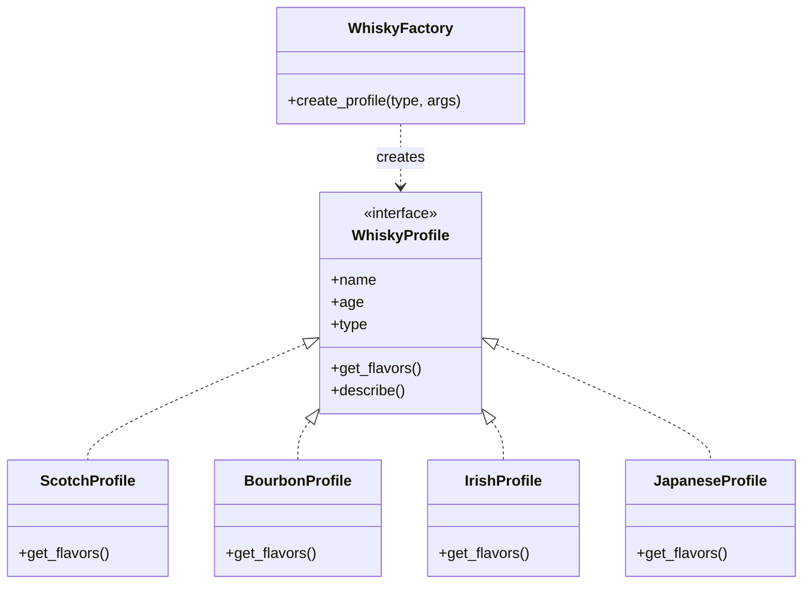
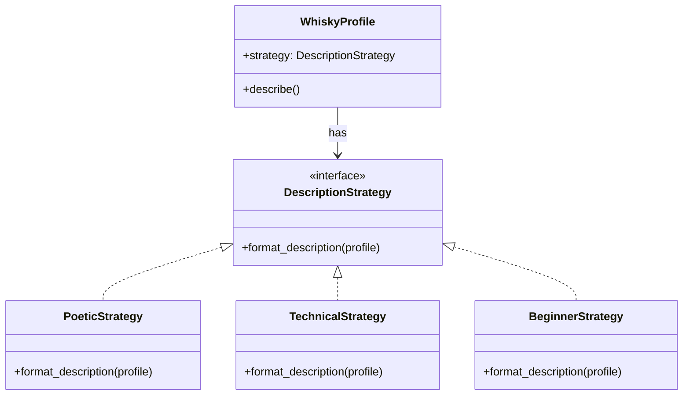
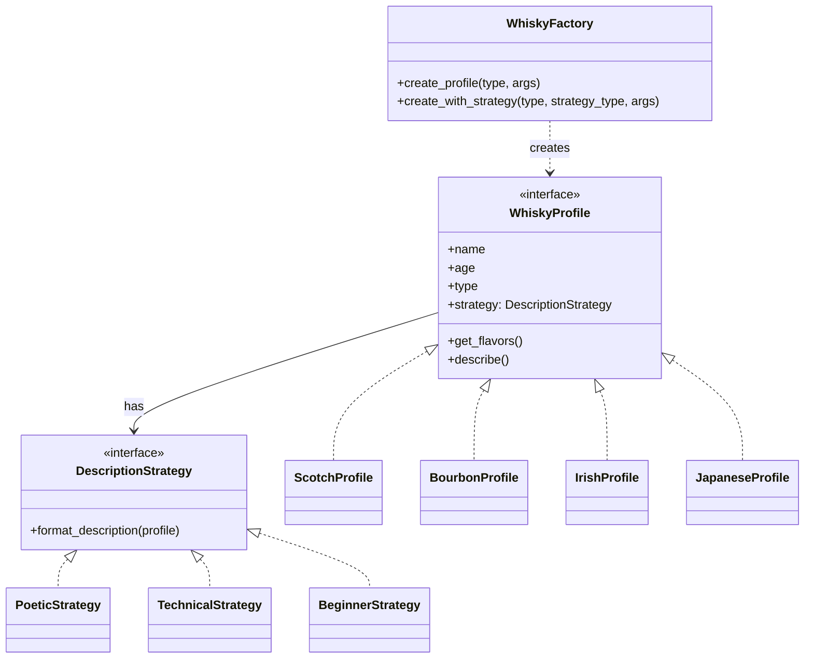

「デザインパターンの本は読んだけど、実際に使えるかというと…」

そんな悩みを持っていませんか？Factory Method、Strategy——名前は知っているし、サンプルコードも見た。でも、自分でゼロから設計しようとすると、気づけばまたif/elseの山。

この記事では、ウイスキー香味プロファイル生成器を作りながら、2つのデザインパターンを手で覚えます。「動く→破綻→パターン導入」のサイクルを繰り返すことで、「なぜこのパターンが必要なのか」が腹落ちする体験をお届けします。

完成したら、友人との飲み会で「俺が作ったシステムでこのウイスキーを分析してやろうか？」と自慢しましょう。

---

## この記事で習得できること

| パターン | 役割 | 本記事での実装 |
|---------|------|--------------|
| Factory Method | オブジェクト生成の責務分離 | ウイスキータイプ名からプロファイルオブジェクト生成 |
| Strategy | アルゴリズムの切り替え | テイスティングノートの記述スタイル切り替え |

---

## 対象読者

- 「デザインパターン学習シリーズ」を一通り読んだが、まだ自力で使いこなせない方
- if/elseから脱却したい方
- 手を動かしながらパターンを定着させたい方
- Whiskyが好きな方（オプション）

---

## 技術スタック

| 項目 | バージョン・ライブラリ |
|------|----------------------|
| Perl | v5.36以降（signatures、postfix dereference対応） |
| オブジェクト指向 | Moo |
| 外部依存 | なし（標準ライブラリのみ） |

---

## 第1章: スコッチの香りを言葉にしよう

### 今回の目標

- WhiskyDescriberクラスを作成する
- スコッチウイスキーのテイスティングノートを詩的に表現する

### 動く：最初の実装

まずは1種類のウイスキーだけを扱うシンプルな実装から始めます。

```perl
#!/usr/bin/env perl
use v5.36;

package WhiskyDescriber {
    use Moo;
    
    has name => (is => 'ro', required => 1);
    has age  => (is => 'ro', required => 1);
    has type => (is => 'ro', required => 1);
    
    sub describe($self) {
        if ($self->type eq 'scotch') {
            return sprintf(
                "%s %d年: スコットランドの荒々しい大地を思わせる、"
                . "ピートの煙と海の香り。琥珀色の液体に秘められた複雑な物語。",
                $self->name, $self->age
            );
        }
        return "未知のウイスキー";
    }
}

package main {
    my $whisky = WhiskyDescriber->new(
        name => 'Laphroaig',
        age  => 10,
        type => 'scotch',
    );
    
    say "=== ウイスキー香味プロファイル ===\n";
    say $whisky->describe();
}
```

### 実行結果

```
=== ウイスキー香味プロファイル ===

Laphroaig 10年: スコットランドの荒々しい大地を思わせる、ピートの煙と海の香り。琥珀色の液体に秘められた複雑な物語。
```

動きました！スコッチウイスキーの詩的なテイスティングノートが出力されています。

### 今回のポイント

- Mooの`has`で属性を定義し、`sub`でメソッドを実装
- `$self`を使ったオブジェクト指向の基本構造
- signatures（`$self`）で引数を明示的に宣言

次の章では、ウイスキーの種類と記述スタイルを増やしていきます。

---

## 第2章: バーボンもアイリッシュも！条件分岐地獄

### 前章の振り返り

WhiskyDescriberクラスを作成し、スコッチウイスキーのテイスティングノートを出力しました。

### 今回の目標

- バーボン、アイリッシュ、ジャパニーズを追加する
- 詩的/技術的/初心者向けの3つの記述スタイルを追加する

### 動く：if/elseで全部対応

新しいウイスキーと記述スタイルを追加してみましょう。

```perl
#!/usr/bin/env perl
use v5.36;

package WhiskyDescriber {
    use Moo;
    
    has name  => (is => 'ro', required => 1);
    has age   => (is => 'ro', required => 1);
    has type  => (is => 'ro', required => 1);
    has style => (is => 'ro', default => 'poetic');
    
    sub describe($self) {
        my $description = '';
        
        # タイプとスタイルの組み合わせで分岐
        if ($self->type eq 'scotch') {
            if ($self->style eq 'poetic') {
                $description = sprintf(
                    "%s %d年: スコットランドの荒々しい大地を思わせる、"
                    . "ピートの煙と海の香り。",
                    $self->name, $self->age
                );
            } elsif ($self->style eq 'technical') {
                $description = sprintf(
                    "%s %d年: フェノール値35ppm、塩味強、ヨード香顕著",
                    $self->name, $self->age
                );
            } else {
                $description = sprintf(
                    "%s %d年: スモーキーで力強い味わい ★★",
                    $self->name, $self->age
                );
            }
        } elsif ($self->type eq 'bourbon') {
            if ($self->style eq 'poetic') {
                $description = sprintf(
                    "%s %d年: 焦がしたオークとバニラの甘美なハーモニー",
                    $self->name, $self->age
                );
            } elsif ($self->style eq 'technical') {
                $description = sprintf(
                    "%s %d年: トウモロコシ含有率70%%, チャーレベル4",
                    $self->name, $self->age
                );
            } else {
                $description = sprintf(
                    "%s %d年: 甘くて飲みやすい ★★★★★",
                    $self->name, $self->age
                );
            }
        }
        # elsif ($self->type eq 'irish') { ... }
        # elsif ($self->type eq 'japanese') { ... }
        # どんどん増える...
        
        return $description;
    }
}

package main {
    my $scotch = WhiskyDescriber->new(
        name => 'Laphroaig', age => 10, type => 'scotch', style => 'poetic'
    );
    my $bourbon = WhiskyDescriber->new(
        name => "Maker's Mark", age => 6, type => 'bourbon', style => 'beginner'
    );
    
    say "=== ウイスキー香味プロファイル ===\n";
    say $scotch->describe();
    say $bourbon->describe();
}
```

### 破綻：問題が発生

一応動きますが、問題が見えてきました。

問題点1: 組み合わせ爆発
- 4種類 × 3スタイル = 12通りの条件分岐
- カナディアン、ライ、シングルモルト... 増やすたびに地獄

問題点2: describeメソッドが肥大化
- 修正箇所の特定が困難
- 1つの変更が別のケースに影響するリスク

問題点3: テストが書けない
- 各ケースを網羅的にチェックする必要
- モック化が困難

```perl
# これが12通りになったら...？
if ($self->type eq 'scotch') {
    if ($self->style eq 'poetic') { ... }
    elsif ($self->style eq 'technical') { ... }
    elsif ($self->style eq 'beginner') { ... }
}
elsif ($self->type eq 'bourbon') { ... }
elsif ($self->type eq 'irish') { ... }
elsif ($self->type eq 'japanese') { ... }
# if/else地獄！
```

### 今回のポイント

- 機能追加のたびにif/elseが増える「条件分岐の爆発」が発生
- タイプとスタイルの2軸で分岐すると、組み合わせが掛け算で増える
- 次章でこの問題をFactory Methodパターンで解決します

---

## 第3章: ウイスキー工場を作ろう

### 前章の振り返り

ウイスキータイプと記述スタイルの組み合わせで、if/elseが爆発する問題が発生しました。

### 今回の目標

- 各ウイスキータイプを独立したクラスにする
- Factory Methodパターンで生成を整理する

### 破綻からの脱出：Factory Methodの導入

まず、ウイスキータイプの問題を解決しましょう。各タイプを独立したクラスにし、ファクトリで生成します。

```perl
#!/usr/bin/env perl
use v5.36;

# ====================
# WhiskyProfile Role: 共通インターフェース
# ====================
package WhiskyProfile {
    use Moo::Role;
    
    has name => (is => 'ro', required => 1);
    has age  => (
        is       => 'ro',
        isa      => sub { die "Age must be positive" unless $_[0] > 0 },
        required => 1,
    );
    has type => (is => 'ro', required => 1);
    
    # 具象クラスで実装必須
    requires 'get_flavors';
    
    sub describe($self) {
        my $flavors = $self->get_flavors();
        return sprintf(
            "%s %d年: %s\n香味: %s",
            $self->name,
            $self->age,
            $flavors->{poetic_description},
            join(', ', $flavors->{notes}->@*)
        );
    }
}

# ====================
# 具象クラス群
# ====================
package ScotchProfile {
    use Moo;
    with 'WhiskyProfile';
    
    sub get_flavors($self) {
        return {
            poetic_description => 'スコットランドの荒々しい大地を思わせる、'
                                . 'ピートの煙と海の香り。',
            notes              => ['ピート', '海藻', 'ヨード', 'オーク'],
        };
    }
}

package BourbonProfile {
    use Moo;
    with 'WhiskyProfile';
    
    sub get_flavors($self) {
        return {
            poetic_description => '焦がしたオークとバニラの甘美なハーモニー、'
                                . 'ケンタッキーの夕暮れのような温かみ。',
            notes              => ['バニラ', 'カラメル', 'オーク', 'トウモロコシの甘み'],
        };
    }
}

package IrishProfile {
    use Moo;
    with 'WhiskyProfile';
    
    sub get_flavors($self) {
        return {
            poetic_description => '三回蒸留による滑らかさ、'
                                . 'エメラルドの島の穏やかな風のよう。',
            notes              => ['ハチミツ', 'バニラ', 'グリーンアップル', 'クリーム'],
        };
    }
}

package JapaneseProfile {
    use Moo;
    with 'WhiskyProfile';
    
    sub get_flavors($self) {
        return {
            poetic_description => '繊細な日本の四季を映し出す、バランスの芸術。'
                                . '水明りのような透明感と深み。',
            notes              => ['桜', '梅', 'ミズナラ', '緑茶', 'はちみつ'],
        };
    }
}

# ====================
# Factory Method: WhiskyFactory
# ====================
package WhiskyFactory {
    use Moo;
    
    sub create_profile($self, $type, %args) {
        my %profile_map = (
            scotch   => 'ScotchProfile',
            bourbon  => 'BourbonProfile',
            irish    => 'IrishProfile',
            japanese => 'JapaneseProfile',
        );
        
        my $class = $profile_map{lc $type}
            or die "Unknown whisky type: $type";
        
        return $class->new(type => $type, %args);
    }
}

# ====================
# メイン処理
# ====================
package main {
    say "=== ウイスキー香味プロファイル生成器 ===\n";
    
    my $factory = WhiskyFactory->new;
    
    my @whiskies = (
        $factory->create_profile('scotch', name => 'Laphroaig', age => 10),
        $factory->create_profile('bourbon', name => "Maker's Mark", age => 6),
        $factory->create_profile('irish', name => 'Jameson', age => 12),
        $factory->create_profile('japanese', name => '山崎', age => 18),
    );
    
    for my $whisky (@whiskies) {
        say $whisky->describe();
        say "";
    }
}
```

### 何が改善されたか？

1. if/elseが消えた: `%profile_map`ハッシュでタイプとクラスをマッピング
2. 各タイプが独立: ScotchProfile、BourbonProfileなどが別々のクラスに
3. 拡張が容易: 新しいタイプは新クラス + マップ登録だけ

```perl
# 新しいタイプを追加するのはこれだけ！
package CanadianProfile {
    use Moo;
    with 'WhiskyProfile';
    sub get_flavors { ... }
}
# ファクトリのマップに追加
canadian => 'CanadianProfile',
```

### Factory Methodパターンとは



Factory Methodパターンは、オブジェクト生成の責務を専用のファクトリクラスに委譲するパターンです。クライアントは具象クラスを直接知る必要がなく、ファクトリを通じてオブジェクトを取得します。

### 今回のポイント

- Moo::Roleでインターフェース（共通契約）を定義
- `requires`で具象クラスに実装を強制
- ファクトリのハッシュマップでif/elseを排除
- 新規タイプの追加が「新クラス + マップ登録」だけで完結

ただし、まだ記述スタイルの切り替えができていません。次章でStrategyパターンを導入します。

---

## 第4章: 記述スタイルを切り替えよう

### 前章の振り返り

Factory Methodパターンで、ウイスキータイプごとにクラスを分離しました。しかし、記述スタイル（詩的/技術的/初心者向け）の切り替えがまだできていません。

### 今回の目標

- 記述スタイルを戦略（Strategy）として抽出する
- 実行時にスタイルを切り替え可能にする

### Strategyパターンの導入

記述スタイルを「戦略」として独立させます。

```perl
#!/usr/bin/env perl
use v5.36;

# ====================
# Strategy Role: 記述戦略の共通インターフェース
# ====================
package DescriptionStrategy {
    use Moo::Role;
    requires 'format_description';
}

# ====================
# 具象戦略クラス群
# ====================
package PoeticStrategy {
    use Moo;
    with 'DescriptionStrategy';
    
    sub format_description($self, $profile) {
        my $flavors = $profile->get_flavors();
        return sprintf(
            "%s %d年: %s\n香味: %s",
            $profile->name,
            $profile->age,
            $flavors->{poetic_description},
            join(', ', $flavors->{notes}->@*)
        );
    }
}

package TechnicalStrategy {
    use Moo;
    with 'DescriptionStrategy';
    
    sub format_description($self, $profile) {
        my $flavors = $profile->get_flavors();
        return sprintf(
            "%s %d年 [%s]\n度数: %d%% | 樽: %s\n成分特性: %s",
            $profile->name,
            $profile->age,
            $profile->type,
            $flavors->{abv} // 43,
            $flavors->{cask_type} // '不明',
            join(', ', $flavors->{technical_notes}->@*)
        );
    }
}

package BeginnerStrategy {
    use Moo;
    with 'DescriptionStrategy';
    
    sub format_description($self, $profile) {
        my $flavors = $profile->get_flavors();
        return sprintf(
            "%s (%d年もの)\n🥃 %s\n👍 おすすめ度: %s",
            $profile->name,
            $profile->age,
            $flavors->{simple_description},
            '★' x ($flavors->{beginner_friendly} // 3)
        );
    }
}

# ====================
# WhiskyProfile Role（Strategy対応版）
# ====================
package WhiskyProfile {
    use Moo::Role;
    
    has name => (is => 'ro', required => 1);
    has age  => (
        is       => 'ro',
        isa      => sub { die "Age must be positive" unless $_[0] > 0 },
        required => 1,
    );
    has type => (is => 'ro', required => 1);
    
    # Strategy: 記述戦略を注入
    has strategy => (
        is      => 'ro',
        does    => 'DescriptionStrategy',  # Roleによる型制約
        default => sub { PoeticStrategy->new },
    );
    
    requires 'get_flavors';
    
    # 戦略に委譲
    sub describe($self) {
        return $self->strategy->format_description($self);
    }
}

# ====================
# 具象プロファイルクラス（拡張版）
# ====================
package ScotchProfile {
    use Moo;
    with 'WhiskyProfile';
    
    sub get_flavors($self) {
        return {
            poetic_description  => 'スコットランドの荒々しい大地を思わせる、'
                                 . 'ピートの煙と海の香り。',
            simple_description  => 'スモーキーで力強い味わい。海辺のウイスキー！',
            notes               => ['ピート', '海藻', 'ヨード', 'オーク'],
            technical_notes     => ['フェノール値35ppm', '塩味強', 'ヨード香顕著'],
            cask_type           => 'バーボン樽',
            abv                 => 43,
            beginner_friendly   => 2,
        };
    }
}

package BourbonProfile {
    use Moo;
    with 'WhiskyProfile';
    
    sub get_flavors($self) {
        return {
            poetic_description  => '焦がしたオークとバニラの甘美なハーモニー、'
                                 . 'ケンタッキーの夕暮れのような温かみ。',
            simple_description  => '甘くて飲みやすい、バニラとカラメルの香り！',
            notes               => ['バニラ', 'カラメル', 'オーク', 'トウモロコシの甘み'],
            technical_notes     => ['トウモロコシ含有率70%', 'チャーレベル4', 'エステル高'],
            cask_type           => '新品チャー樽',
            abv                 => 45,
            beginner_friendly   => 5,
        };
    }
}

# ====================
# Factory（Strategy対応版）
# ====================
package WhiskyFactory {
    use Moo;
    
    sub create_profile($self, $type, %args) {
        my %profile_map = (
            scotch   => 'ScotchProfile',
            bourbon  => 'BourbonProfile',
        );
        
        my $class = $profile_map{lc $type}
            or die "Unknown whisky type: $type";
        
        return $class->new(type => $type, %args);
    }
    
    # 便利メソッド: 戦略付きで生成
    sub create_with_strategy($self, $type, $strategy_type, %args) {
        my %strategy_map = (
            poetic    => 'PoeticStrategy',
            technical => 'TechnicalStrategy',
            beginner  => 'BeginnerStrategy',
        );
        
        my $strategy_class = $strategy_map{lc $strategy_type}
            or die "Unknown strategy type: $strategy_type";
        
        my $strategy = $strategy_class->new;
        
        return $self->create_profile($type, strategy => $strategy, %args);
    }
}

# ====================
# デモ: 同じウイスキーを3つの視点で
# ====================
package main {
    say "=== Strategy パターンデモ ===\n";
    say "同じスコッチを3つの視点で記述:\n";
    
    my $factory = WhiskyFactory->new;
    
    for my $style (qw/poetic technical beginner/) {
        my $whisky = $factory->create_with_strategy(
            'scotch',
            $style,
            name => 'Ardbeg',
            age  => 10,
        );
        
        say "■ " . uc($style) . " VIEW:";
        say $whisky->describe();
        say "";
    }
}
```

### 実行結果

```
=== Strategy パターンデモ ===

同じスコッチを3つの視点で記述:

■ POETIC VIEW:
Ardbeg 10年: スコットランドの荒々しい大地を思わせる、ピートの煙と海の香り。
香味: ピート, 海藻, ヨード, オーク

■ TECHNICAL VIEW:
Ardbeg 10年 [scotch]
度数: 43% | 樽: バーボン樽
成分特性: フェノール値35ppm, 塩味強, ヨード香顕著

■ BEGINNER VIEW:
Ardbeg (10年もの)
🥃 スモーキーで力強い味わい。海辺のウイスキー！
👍 おすすめ度: ★★
```

### Strategyパターンとは



Strategyパターンは、アルゴリズム（この場合は記述方法）をクラスとしてカプセル化し、実行時に切り替え可能にするパターンです。

### 今回のポイント

- `does => 'DescriptionStrategy'`でRole型制約を設定
- 戦略クラスに処理を委譲（`$self->strategy->format_description($self)`）
- 新しい記述スタイルは新クラス追加だけで対応可能

---

## 第5章: 完成！香味プロファイル生成器

### 前章までの振り返り

- Factory Method: ウイスキータイプごとにクラスを分離
- Strategy: 記述スタイルを戦略として抽出

### 今回の目標

- 両パターンを統合した完成版を作成する
- 4種類のウイスキー × 3種類のスタイルを自在に組み合わせる

### 完成版コード

```perl
#!/usr/bin/env perl
use v5.36;

# ====================
# Strategy パターン: 記述戦略
# ====================
package DescriptionStrategy {
    use Moo::Role;
    requires 'format_description';
}

package PoeticStrategy {
    use Moo;
    with 'DescriptionStrategy';
    
    sub format_description($self, $profile) {
        my $flavors = $profile->get_flavors();
        return sprintf(
            "%s %d年: %s\n香味: %s",
            $profile->name,
            $profile->age,
            $flavors->{poetic_description},
            join(', ', $flavors->{notes}->@*)
        );
    }
}

package TechnicalStrategy {
    use Moo;
    with 'DescriptionStrategy';
    
    sub format_description($self, $profile) {
        my $flavors = $profile->get_flavors();
        return sprintf(
            "%s %d年 [%s]\n度数: %d%% | 樽: %s\n成分特性: %s",
            $profile->name,
            $profile->age,
            $profile->type,
            $flavors->{abv} // 43,
            $flavors->{cask_type} // '不明',
            join(', ', $flavors->{technical_notes}->@*)
        );
    }
}

package BeginnerStrategy {
    use Moo;
    with 'DescriptionStrategy';
    
    sub format_description($self, $profile) {
        my $flavors = $profile->get_flavors();
        return sprintf(
            "%s (%d年もの)\n🥃 %s\n👍 おすすめ度: %s",
            $profile->name,
            $profile->age,
            $flavors->{simple_description},
            '★' x ($flavors->{beginner_friendly} // 3)
        );
    }
}

# ====================
# WhiskyProfile Role
# ====================
package WhiskyProfile {
    use Moo::Role;
    
    has name => (is => 'ro', required => 1);
    has age  => (
        is       => 'ro',
        isa      => sub { die "Age must be positive" unless $_[0] > 0 },
        required => 1,
    );
    has type => (is => 'ro', required => 1);
    has strategy => (
        is      => 'ro',
        does    => 'DescriptionStrategy',
        default => sub { PoeticStrategy->new },
    );
    
    requires 'get_flavors';
    
    sub describe($self) {
        return $self->strategy->format_description($self);
    }
}

# ====================
# 具象プロファイル群
# ====================
package ScotchProfile {
    use Moo;
    with 'WhiskyProfile';
    
    sub get_flavors($self) {
        return {
            poetic_description  => 'スコットランドの荒々しい大地を思わせる、'
                                 . 'ピートの煙と海の香り。琥珀色の液体に秘められた複雑な物語。',
            simple_description  => 'スモーキーで力強い味わい。海辺のウイスキー！',
            notes               => ['ピート', '海藻', 'ヨード', 'オーク'],
            technical_notes     => ['フェノール値35ppm', '塩味強', 'ヨード香顕著'],
            cask_type           => 'バーボン樽',
            abv                 => 43,
            beginner_friendly   => 2,
        };
    }
}

package BourbonProfile {
    use Moo;
    with 'WhiskyProfile';
    
    sub get_flavors($self) {
        return {
            poetic_description  => '焦がしたオークとバニラの甘美なハーモニー、'
                                 . 'ケンタッキーの夕暮れのような温かみ。',
            simple_description  => '甘くて飲みやすい、バニラとカラメルの香り！',
            notes               => ['バニラ', 'カラメル', 'オーク', 'トウモロコシの甘み'],
            technical_notes     => ['トウモロコシ含有率70%', 'チャーレベル4', 'エステル高'],
            cask_type           => '新品チャー樽',
            abv                 => 45,
            beginner_friendly   => 5,
        };
    }
}

package IrishProfile {
    use Moo;
    with 'WhiskyProfile';
    
    sub get_flavors($self) {
        return {
            poetic_description  => '三回蒸留による滑らかさ、'
                                 . 'エメラルドの島の穏やかな風のよう。',
            simple_description  => 'なめらかで優しい味わい。初心者に最適！',
            notes               => ['ハチミツ', 'バニラ', 'グリーンアップル', 'クリーム'],
            technical_notes     => ['三回蒸留', 'ノンピート', '軽快な口当たり'],
            cask_type           => 'シェリー樽',
            abv                 => 40,
            beginner_friendly   => 5,
        };
    }
}

package JapaneseProfile {
    use Moo;
    with 'WhiskyProfile';
    
    sub get_flavors($self) {
        return {
            poetic_description  => '繊細な日本の四季を映し出す、バランスの芸術。'
                                 . '水明りのような透明感と深み。',
            simple_description  => 'バランスが良く飲みやすい。フルーティで上品！',
            notes               => ['桜', '梅', 'ミズナラ', '緑茶', 'はちみつ'],
            technical_notes     => ['ミズナラ樽熟成', '軟水仕込み', '独自ブレンド技術'],
            cask_type           => 'ミズナラ樽',
            abv                 => 43,
            beginner_friendly   => 4,
        };
    }
}

# ====================
# Factory Method: WhiskyFactory
# ====================
package WhiskyFactory {
    use Moo;
    
    sub create_profile($self, $type, %args) {
        my %profile_map = (
            scotch   => 'ScotchProfile',
            bourbon  => 'BourbonProfile',
            irish    => 'IrishProfile',
            japanese => 'JapaneseProfile',
        );
        
        my $class = $profile_map{lc $type}
            or die "Unknown whisky type: $type";
        
        return $class->new(type => $type, %args);
    }
    
    sub create_with_strategy($self, $type, $strategy_type, %args) {
        my %strategy_map = (
            poetic    => 'PoeticStrategy',
            technical => 'TechnicalStrategy',
            beginner  => 'BeginnerStrategy',
        );
        
        my $strategy_class = $strategy_map{lc $strategy_type}
            or die "Unknown strategy type: $strategy_type";
        
        my $strategy = $strategy_class->new;
        
        return $self->create_profile($type, strategy => $strategy, %args);
    }
}

# ====================
# メイン処理
# ====================
package main {
    say "=" x 70;
    say "🥃 ウイスキー香味プロファイル生成器";
    say "   Factory Method + Strategy パターン統合デモ";
    say "=" x 70;
    say "";
    
    my $factory = WhiskyFactory->new;
    
    # デモ1: 各種ウイスキーをデフォルト戦略（詩的）で表示
    say "【デモ1】Factory Method: 各種ウイスキーを生成";
    say "-" x 70;
    
    my @whiskies = (
        $factory->create_profile('scotch', name => 'Laphroaig', age => 10),
        $factory->create_profile('bourbon', name => "Maker's Mark", age => 6),
        $factory->create_profile('irish', name => 'Jameson', age => 12),
        $factory->create_profile('japanese', name => '山崎', age => 18),
    );
    
    for my $whisky (@whiskies) {
        say $whisky->describe();
        say "";
    }
    
    # デモ2: 同じウイスキーを3つの視点で
    say "=" x 70;
    say "【デモ2】Strategy パターン: 同じウイスキーを3つの視点で記述";
    say "-" x 70;
    say "";
    
    for my $style (qw/poetic technical beginner/) {
        my $whisky = $factory->create_with_strategy(
            'scotch',
            $style,
            name => 'Ardbeg',
            age  => 10,
        );
        
        say "■ " . uc($style) . " VIEW:";
        say $whisky->describe();
        say "";
    }
    
    # デモ3: 型制約のテスト
    say "=" x 70;
    say "【デモ3】Mooの型制約テスト";
    say "-" x 70;
    
    eval {
        my $invalid = $factory->create_profile('scotch', name => 'Test', age => -5);
    };
    say "✓ 負の年数でエラー検出: $@" if $@;
    
    eval {
        my $invalid_type = $factory->create_profile('vodka', name => 'Test', age => 5);
    };
    say "✓ 未知のタイプでエラー検出: $@" if $@;
    
    say "\n" . "=" x 70;
    say "🎉 デモンストレーション完了！";
    say "=" x 70;
}
```

### 2パターンの相乗効果

| パターン | 解決する問題 | 本記事での実装 |
|---------|-------------|--------------|
| Factory Method | 生成ロジックの集中化 | 4種類のウイスキータイプを7クラスで管理 |
| Strategy | アルゴリズムの交換 | 3種類の記述スタイルを実行時に切り替え |
| **組み合わせ** | 柔軟な拡張性 | 4タイプ × 3スタイル = 12通りを少ないコードで実現 |

### 統合クラス図



### 拡張例：新しいタイプとスタイルの追加

```perl
# 新しいウイスキータイプを追加
package CanadianProfile {
    use Moo;
    with 'WhiskyProfile';
    
    sub get_flavors($self) {
        return {
            poetic_description  => 'メープルの優しさとライ麦の個性...',
            simple_description  => '軽やかで飲みやすい！',
            notes               => ['メープル', 'ライ麦', 'バニラ'],
            technical_notes     => ['ライ麦含有率高', '軽快'],
            cask_type           => 'オーク樽',
            abv                 => 40,
            beginner_friendly   => 4,
        };
    }
}

# 新しい戦略を追加
package SommelierStrategy {
    use Moo;
    with 'DescriptionStrategy';
    
    sub format_description($self, $profile) {
        my $f = $profile->get_flavors();
        return sprintf(
            "Tasting Notes: %s\nNose: %s\nPalate: %s",
            $profile->name,
            $f->{notes}->[0],
            $f->{notes}->[1]
        );
    }
}

# ファクトリのマップに追加するだけ！
# canadian => 'CanadianProfile',
# sommelier => 'SommelierStrategy',
```

### 今回のポイント

- Factory Method + Strategy の組み合わせで柔軟な拡張性を実現
- 新規タイプ・スタイルの追加は「クラス追加 + マップ登録」だけ
- 開放閉鎖原則（OCP）: 既存コードを変更せずに機能拡張

---

## まとめ

この記事では、ウイスキー香味プロファイル生成器を作りながら、2つのデザインパターンを体験しました。

### 学んだこと

| パターン | 解決する問題 | Perlでの実装ポイント |
|---------|-------------|-------------------|
| Factory Method | 生成ロジックの集中化、if/else排除 | ハッシュマップ + Moo::Role |
| Strategy | アルゴリズムの交換、条件分岐削減 | `does`による型制約 + 委譲 |

### デザインパターンを「手で覚える」とは

1. **動く**: まずは素朴に実装する
2. **破綻**: 機能追加で問題が発生する
3. **パターン導入**: 問題を解決する設計に改善する
4. **完成**: パターンの効果を実感する

このサイクルを体験することで、「なぜこのパターンが必要なのか」が腹落ちします。

### 次のステップ

- 他のウイスキータイプを追加してみる
- 自分だけのテイスティングノートデータベースを作る
- 友人との飲み会で自慢する

🥃 乾杯！

---

## 関連シリーズ

- [Mooで覚えるオブジェクト指向プログラミング](/2026/01/02/233311/)
- [データエクスポーター（Strategy）](/2026/01/09/005530/)
- [APIレスポンスシミュレーター（Factory Method）](/2026/01/17/132411/)
- [ダンジョンマスター（3パターン）](/2026/02/01/093248/)
