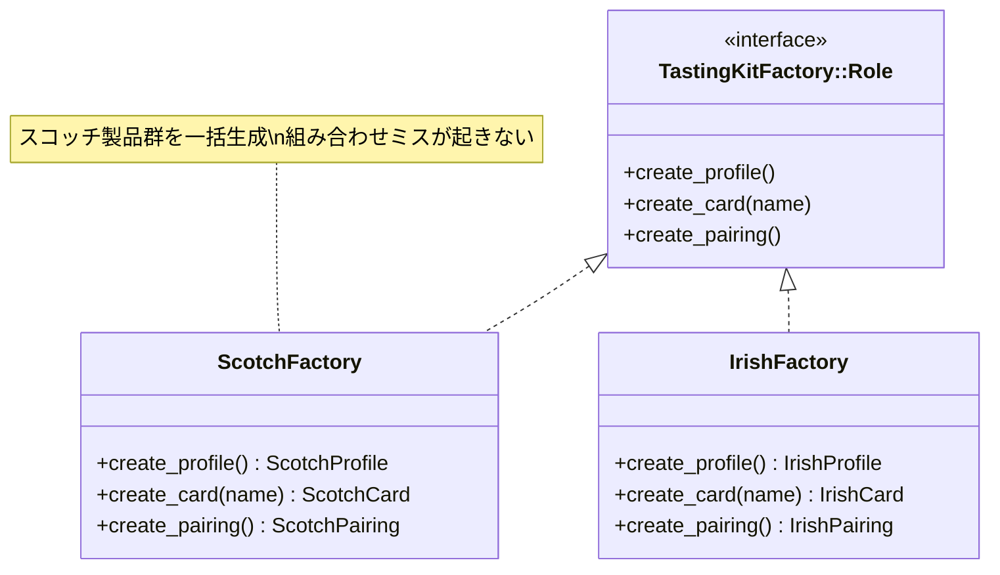
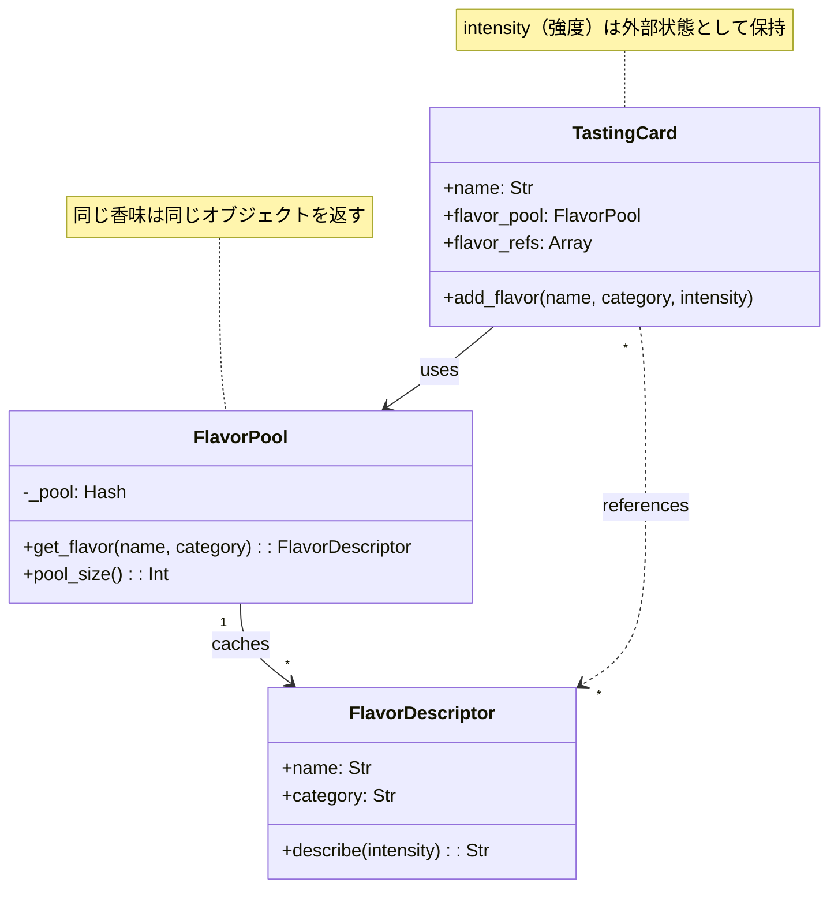
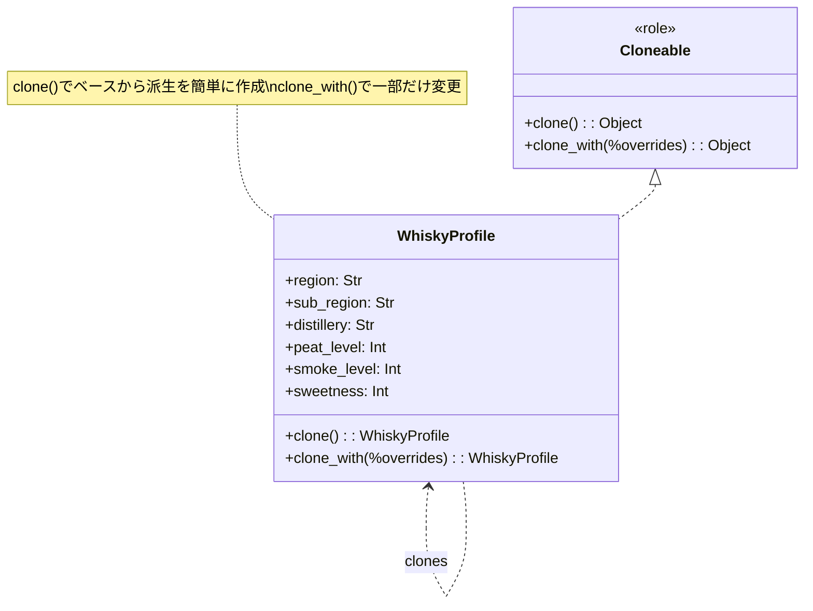
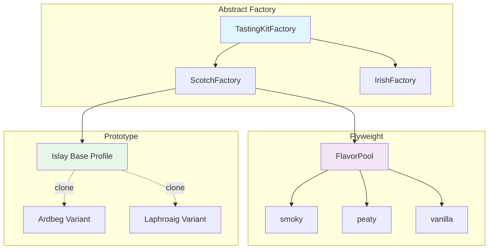

「デザインパターンは勉強したけど、いつ使えばいいかわからない」——そんな悩みを抱えていませんか？

この記事では、ウイスキーのテイスティングカードを生成するツールを作りながら、**Abstract Factory・Flyweight・Prototype**の3つのパターンを実践します。産地ごとに異なるカードフォーマット、大量の香味語彙、プロファイルの派生——それぞれの問題に対して、パターンがどう解決策を提供するかを体験しましょう。

> 完成したら、次のテイスティング会で「俺が作ったカード生成器で出力したやつ」と自慢できます。

## この記事で学べること

| パターン | 解決する問題 | 本記事での役割 |
|---------|-------------|--------------|
| **Abstract Factory** | 関連オブジェクトの組み合わせミス | 産地別キットの一括生成 |
| **Flyweight** | 同じオブジェクトの大量生成 | 香味語彙の共有プール |
| **Prototype** | 類似オブジェクトの手動作成 | プロファイルのクローン |

## 対象読者

- デザインパターンの名前は知っているが、使いどころがわからない方
- Perl入学式を卒業し、次のステップに進みたい方
- ウイスキーが好きで、趣味と学習を両立させたい方

## 技術スタック

- **Perl** v5.36以降（signatures使用）
- **Moo** によるオブジェクト指向
- CLI（コマンドライン）環境

---

## 第1章: テイスティングカードを作ってみよう

### 今回の目標

- ウイスキーのテイスティングカードを1枚出力する
- 最もシンプルな実装からスタート

### 最初の実装

まずは、1つのウイスキー情報をカードとして出力してみましょう。

```perl
#!/usr/bin/env perl
use v5.36;

# シンプルなテイスティングカード
say "╔════════════════════════════════════════╗";
say "║     WHISKY TASTING CARD                ║";
say "╠════════════════════════════════════════╣";
say "║ Name: Ardbeg 10 Years                  ║";
say "║ Region: Islay, Scotland                ║";
say "╠════════════════════════════════════════╣";
say "║ NOSE:                                  ║";
say "║   smoky, peaty, citrus, vanilla        ║";
say "║ PALATE:                                ║";
say "║   intense smoke, sea salt, pepper      ║";
say "║ FINISH:                                ║";
say "║   long, peaty, warming                 ║";
say "╠════════════════════════════════════════╣";
say "║ PAIRING:                               ║";
say "║   Blue cheese, smoked salmon           ║";
say "╚════════════════════════════════════════╝";
```

### 実行結果

```
╔════════════════════════════════════════╗
║     WHISKY TASTING CARD                ║
╠════════════════════════════════════════╣
║ Name: Ardbeg 10 Years                  ║
║ Region: Islay, Scotland                ║
╠════════════════════════════════════════╣
║ NOSE:                                  ║
║   smoky, peaty, citrus, vanilla        ║
║ PALATE:                                ║
║   intense smoke, sea salt, pepper      ║
║ FINISH:                                ║
║   long, peaty, warming                 ║
╠════════════════════════════════════════╣
║ PAIRING:                               ║
║   Blue cheese, smoked salmon           ║
╚════════════════════════════════════════╝
```

### 今回のポイント

- ✅ とりあえず動くものができた
- ⚠️ すべてハードコード——拡張性ゼロ
- ⚠️ 産地が増えたらどうする？

---

## 第2章: 産地が増えると分岐地獄

### 前章の振り返り

ハードコードでカードを1枚出力できました。でも、スコッチだけでなくアイリッシュ、ジャパニーズにも対応したら？

### 今回の目標

- 複数産地に対応する
- if/elseで分岐を実装
- 問題を体験する

### 動く：Mooでクラス化

```perl
#!/usr/bin/env perl
use v5.36;

package TastingCard {
    use Moo;

    has name   => (is => 'ro', required => 1);
    has region => (is => 'ro', required => 1);
    has nose   => (is => 'ro', required => 1);
    has palate => (is => 'ro', required => 1);
    has finish => (is => 'ro', required => 1);

    sub render($self) {
        my $output = "";
        $output .= "╔════════════════════════════════════════╗\n";
        $output .= "║     WHISKY TASTING CARD                ║\n";
        $output .= "╠════════════════════════════════════════╣\n";
        $output .= sprintf("║ Name: %-33s║\n", $self->name);
        $output .= sprintf("║ Region: %-31s║\n", $self->region);
        $output .= "╠════════════════════════════════════════╣\n";
        $output .= "║ NOSE:                                  ║\n";
        $output .= sprintf("║   %-37s║\n", $self->nose);
        $output .= "║ PALATE:                                ║\n";
        $output .= sprintf("║   %-37s║\n", $self->palate);
        $output .= "║ FINISH:                                ║\n";
        $output .= sprintf("║   %-37s║\n", $self->finish);
        $output .= "╚════════════════════════════════════════╝\n";
        return $output;
    }
}

package main {
    # 産地ごとに異なるカードを作成
    sub create_card($region_type) {
        if ($region_type eq 'scotch') {
            return TastingCard->new(
                name   => 'Ardbeg 10',
                region => 'Islay, Scotland',
                nose   => 'smoky, peaty, citrus',
                palate => 'intense smoke, sea salt',
                finish => 'long, peaty',
            );
        }
        elsif ($region_type eq 'irish') {
            return TastingCard->new(
                name   => 'Redbreast 12',
                region => 'Ireland',
                nose   => 'fruity, sherry, spice',
                palate => 'smooth, honey, nuts',
                finish => 'warm, lingering',
            );
        }
        elsif ($region_type eq 'japanese') {
            return TastingCard->new(
                name   => 'Yamazaki 12',
                region => 'Japan',
                nose   => 'floral, peach, vanilla',
                palate => 'delicate, mizunara oak',
                finish => 'elegant, long',
            );
        }
        else {
            die "Unknown region: $region_type";
        }
    }

    my $card = create_card('scotch');
    print $card->render;
}
```

### 破綻：if/elseが増殖する

産地が3つになっただけで、すでにif/elseが3段階。さらに...

- ペアリング情報も産地ごとに変えたい → 別のif/else追加
- フレーバープロファイルも産地ごとに → また別のif/else追加
- カードのフォーマットも産地ごとに → さらにif/else追加

```perl
# 破綻するコード（イメージ）
sub create_card($region) {
    my ($card, $profile, $pairing);
    
    if ($region eq 'scotch') {
        $card = ScotchCard->new(...);
        $profile = ScotchProfile->new(...);
        $pairing = ScotchPairing->new(...);
    }
    elsif ($region eq 'irish') {
        $card = IrishCard->new(...);
        $profile = IrishProfile->new(...);
        $pairing = IrishPairing->new(...);  # 間違えてScotchPairing使ったらバグ！
    }
    # ... 産地が増えるたびに分岐が増える
}
```

問題点を整理すると：

- **組み合わせミスのリスク**: ScotchCardにIrishPairingを紐付けるミス
- **if/elseの肥大化**: 産地×製品種類の組み合わせ爆発
- **変更が困難**: 新産地追加時に複数箇所を修正

### 今回のポイント

- ⚠️ 関連するオブジェクト群をif/elseで生成すると組み合わせミスが起きる
- ⚠️ 産地という「ファミリ」ごとに一貫したオブジェクト群が必要
- → **産地別の「キット」を一括生成**すればよいのでは？

---

## 第3章: 産地別キットを工場で生産

### 前章の振り返り

if/elseで産地ごとにオブジェクトを生成していましたが、組み合わせミスのリスクがありました。

### 今回の目標

- 産地別に関連オブジェクトを一括生成
- **Abstract Factory**パターンの導入

### 完成：Abstract Factoryパターン

```perl
#!/usr/bin/env perl
use v5.36;

# === 製品インターフェース（Role） ===
package FlavorProfile::Role {
    use Moo::Role;
    requires 'get_nose';
    requires 'get_palate';
    requires 'get_finish';
}

package TastingCard::Role {
    use Moo::Role;
    requires 'render';
}

package Pairing::Role {
    use Moo::Role;
    requires 'suggest';
}

# === スコッチ製品 ===
package ScotchProfile {
    use Moo;
    with 'FlavorProfile::Role';
    
    sub get_nose($self)   { return 'smoky, peaty, maritime' }
    sub get_palate($self) { return 'intense smoke, brine, pepper' }
    sub get_finish($self) { return 'long, warming, peaty' }
}

package ScotchCard {
    use Moo;
    with 'TastingCard::Role';
    
    has profile => (is => 'ro', required => 1);
    has name    => (is => 'ro', required => 1);
    
    sub render($self) {
        my $p = $self->profile;
        return join("\n",
            "┏━━━ SCOTCH TASTING CARD ━━━┓",
            "┃ " . $self->name,
            "┃ Nose: " . $p->get_nose,
            "┃ Palate: " . $p->get_palate,
            "┃ Finish: " . $p->get_finish,
            "┗━━━━━━━━━━━━━━━━━━━━━━━━━━━━┛",
        );
    }
}

package ScotchPairing {
    use Moo;
    with 'Pairing::Role';
    
    sub suggest($self) {
        return ['Blue cheese', 'Smoked salmon', 'Dark chocolate'];
    }
}

# === アイリッシュ製品 ===
package IrishProfile {
    use Moo;
    with 'FlavorProfile::Role';
    
    sub get_nose($self)   { return 'fruity, honey, vanilla' }
    sub get_palate($self) { return 'smooth, creamy, spice' }
    sub get_finish($self) { return 'warm, gentle, sweet' }
}

package IrishCard {
    use Moo;
    with 'TastingCard::Role';
    
    has profile => (is => 'ro', required => 1);
    has name    => (is => 'ro', required => 1);
    
    sub render($self) {
        my $p = $self->profile;
        return join("\n",
            "╭──── IRISH TASTING CARD ────╮",
            "│ " . $self->name,
            "│ Nose: " . $p->get_nose,
            "│ Palate: " . $p->get_palate,
            "│ Finish: " . $p->get_finish,
            "╰────────────────────────────╯",
        );
    }
}

package IrishPairing {
    use Moo;
    with 'Pairing::Role';
    
    sub suggest($self) {
        return ['Irish stew', 'Soda bread', 'Apple pie'];
    }
}

# === Abstract Factory ===
package TastingKitFactory::Role {
    use Moo::Role;
    requires 'create_profile';
    requires 'create_card';
    requires 'create_pairing';
}

package ScotchFactory {
    use Moo;
    with 'TastingKitFactory::Role';
    
    sub create_profile($self) { return ScotchProfile->new }
    
    sub create_card($self, $name) {
        return ScotchCard->new(
            name    => $name,
            profile => $self->create_profile,
        );
    }
    
    sub create_pairing($self) { return ScotchPairing->new }
}

package IrishFactory {
    use Moo;
    with 'TastingKitFactory::Role';
    
    sub create_profile($self) { return IrishProfile->new }
    
    sub create_card($self, $name) {
        return IrishCard->new(
            name    => $name,
            profile => $self->create_profile,
        );
    }
    
    sub create_pairing($self) { return IrishPairing->new }
}

# === メイン処理 ===
package main {
    sub create_tasting_kit($factory, $whisky_name) {
        my $card    = $factory->create_card($whisky_name);
        my $pairing = $factory->create_pairing;
        return ($card, $pairing);
    }
    
    # スコッチのキットを作成
    my $scotch_factory = ScotchFactory->new;
    my ($card, $pairing) = create_tasting_kit($scotch_factory, 'Laphroaig 10');
    
    say $card->render;
    say "Pairing: " . join(", ", $pairing->suggest->@*);
    say "";
    
    # アイリッシュのキットを作成
    my $irish_factory = IrishFactory->new;
    ($card, $pairing) = create_tasting_kit($irish_factory, 'Redbreast 12');
    
    say $card->render;
    say "Pairing: " . join(", ", $pairing->suggest->@*);
}
```

### 実行結果

```
┏━━━ SCOTCH TASTING CARD ━━━┓
┃ Laphroaig 10
┃ Nose: smoky, peaty, maritime
┃ Palate: intense smoke, brine, pepper
┃ Finish: long, warming, peaty
┗━━━━━━━━━━━━━━━━━━━━━━━━━━━━┛
Pairing: Blue cheese, Smoked salmon, Dark chocolate

╭──── IRISH TASTING CARD ────╮
│ Redbreast 12
│ Nose: fruity, honey, vanilla
│ Palate: smooth, creamy, spice
│ Finish: warm, gentle, sweet
╰────────────────────────────╯
Pairing: Irish stew, Soda bread, Apple pie
```

### Abstract Factoryの効果



### 今回のポイント

- ✅ **Abstract Factory**パターン = 関連製品群の一括生成
- ✅ ScotchFactoryは必ずスコッチ製品を返す——組み合わせミスが構造的に防止
- ✅ 新産地追加は新Factoryクラスを追加するだけ（既存コード無修正）
- ✅ クライアントコードはFactoryのインターフェースにだけ依存

---

## 第4章: 同じ香味が何度も作られる

### 前章の振り返り

Abstract Factoryで産地別キットを一括生成できるようになりました。でも、大量のカードを生成すると...

### 今回の目標

- 大量カード生成時のメモリ問題を認識
- 香味オブジェクトの重複を発見

### 破綻：香味オブジェクトが爆発

テイスティングイベントで100枚のカードを生成する場合を考えてみましょう。

```perl
#!/usr/bin/env perl
use v5.36;

package FlavorDescriptor {
    use Moo;
    
    has name        => (is => 'ro', required => 1);
    has category    => (is => 'ro', required => 1);  # nose/palate/finish
    has intensity   => (is => 'ro', default => 5);   # 1-10
    has description => (is => 'ro', default => '');
    
    our $INSTANCE_COUNT = 0;
    
    sub BUILD($self, $args) {
        $INSTANCE_COUNT++;
    }
}

package TastingCard {
    use Moo;
    
    has name    => (is => 'ro', required => 1);
    has flavors => (is => 'ro', default => sub { [] });
    
    sub add_flavor($self, $name, $category) {
        # 毎回新しいオブジェクトを作成（問題！）
        my $flavor = FlavorDescriptor->new(
            name     => $name,
            category => $category,
        );
        push $self->flavors->@*, $flavor;
    }
}

package main {
    # 100枚のカードを生成
    my @cards;
    for my $i (1..100) {
        my $card = TastingCard->new(name => "Whisky #$i");
        
        # 全カードに同じ香味を追加
        $card->add_flavor('smoky', 'nose');
        $card->add_flavor('peaty', 'nose');
        $card->add_flavor('vanilla', 'palate');
        $card->add_flavor('honey', 'palate');
        $card->add_flavor('long', 'finish');
        
        push @cards, $card;
    }
    
    say "カード数: " . scalar(@cards);
    say "FlavorDescriptorインスタンス数: $FlavorDescriptor::INSTANCE_COUNT";
    say "";
    say "問題: 100枚のカードで500個の香味オブジェクト！";
    say "      でも実際に使っている香味は5種類だけ...";
}
```

### 実行結果

```
カード数: 100
FlavorDescriptorインスタンス数: 500

問題: 100枚のカードで500個の香味オブジェクト！
      でも実際に使っている香味は5種類だけ...
```

### 問題分析

| 項目 | 値 |
|------|-----|
| カード数 | 100枚 |
| カードあたりの香味数 | 5個 |
| 生成されたオブジェクト | 500個 |
| **実際に必要な種類** | **5種類** |
| 無駄なオブジェクト | 495個（99%が無駄！） |

### 今回のポイント

- ⚠️ 同じ「smoky」なのに100個の別オブジェクト
- ⚠️ メモリ使用量がカード数に比例して増大
- → **同じ香味は1つのオブジェクトを共有**すればよいのでは？

---

## 第5章: 香味語彙を共有しよう

### 前章の振り返り

同じ「smoky」なのに毎回新しいオブジェクトを作っていました。これを解決します。

### 今回の目標

- 香味オブジェクトを共有する
- **Flyweight**パターンの導入

### 完成：Flyweightパターン

```perl
#!/usr/bin/env perl
use v5.36;

# Flyweight: 共有される香味オブジェクト
package FlavorDescriptor {
    use Moo;
    
    # 内部状態（intrinsic state）: 共有される
    has name     => (is => 'ro', required => 1);
    has category => (is => 'ro', required => 1);
    
    our $INSTANCE_COUNT = 0;
    
    sub BUILD($self, $args) {
        $INSTANCE_COUNT++;
    }
    
    sub describe($self, $intensity) {
        # 外部状態（extrinsic state）: 呼び出し時に渡される
        my $level = $intensity >= 7 ? 'strong' : $intensity >= 4 ? 'medium' : 'subtle';
        return sprintf("%s %s", $level, $self->name);
    }
}

# Flyweight Factory: オブジェクトプール
package FlavorPool {
    use Moo;
    
    has _pool => (
        is      => 'ro',
        default => sub { {} },
    );
    
    sub get_flavor($self, $name, $category) {
        my $key = "$category:$name";
        
        # プールに既にあれば再利用
        if (exists $self->_pool->{$key}) {
            return $self->_pool->{$key};
        }
        
        # 新規作成してプールに保存
        my $flavor = FlavorDescriptor->new(
            name     => $name,
            category => $category,
        );
        $self->_pool->{$key} = $flavor;
        
        return $flavor;
    }
    
    sub pool_size($self) {
        return scalar keys $self->_pool->%*;
    }
    
    sub list_flavors($self) {
        return [sort keys $self->_pool->%*];
    }
}

# カードクラス（Flyweightを利用）
package TastingCard {
    use Moo;
    
    has name         => (is => 'ro', required => 1);
    has flavor_pool  => (is => 'ro', required => 1);
    has flavor_refs  => (is => 'ro', default => sub { [] });
    
    sub add_flavor($self, $name, $category, $intensity = 5) {
        my $flavor = $self->flavor_pool->get_flavor($name, $category);
        push $self->flavor_refs->@*, { flavor => $flavor, intensity => $intensity };
    }
    
    sub render_flavors($self) {
        my @lines;
        for my $ref ($self->flavor_refs->@*) {
            push @lines, $ref->{flavor}->describe($ref->{intensity});
        }
        return join(", ", @lines);
    }
}

package main {
    my $pool = FlavorPool->new;
    
    # 100枚のカードを生成
    my @cards;
    for my $i (1..100) {
        my $card = TastingCard->new(
            name        => "Whisky #$i",
            flavor_pool => $pool,
        );
        
        # 全カードに同じ香味を追加（プールから取得）
        $card->add_flavor('smoky', 'nose', 8);
        $card->add_flavor('peaty', 'nose', 7);
        $card->add_flavor('vanilla', 'palate', 5);
        $card->add_flavor('honey', 'palate', 6);
        $card->add_flavor('long', 'finish', 9);
        
        push @cards, $card;
    }
    
    say "=== Flyweightパターンの効果 ===";
    say "カード数: " . scalar(@cards);
    say "FlavorDescriptorインスタンス数: $FlavorDescriptor::INSTANCE_COUNT";
    say "プールサイズ: " . $pool->pool_size . "種類";
    say "";
    say "プール内容: " . join(", ", $pool->list_flavors->@*);
    say "";
    say "--- サンプルカード ---";
    say "カード名: " . $cards[0]->name;
    say "香味: " . $cards[0]->render_flavors;
}
```

### 実行結果

```
=== Flyweightパターンの効果 ===
カード数: 100
FlavorDescriptorインスタンス数: 5
プールサイズ: 5種類

プール内容: finish:long, nose:peaty, nose:smoky, palate:honey, palate:vanilla

--- サンプルカード ---
カード名: Whisky #1
香味: strong smoky, strong peaty, medium vanilla, medium honey, strong long
```

### Flyweightの効果

| 項目 | Before | After |
|------|--------|-------|
| FlavorDescriptorオブジェクト数 | 500個 | **5個** |
| メモリ削減率 | - | **99%削減** |



### 今回のポイント

- ✅ **Flyweight**パターン = オブジェクトの共有
- ✅ 内部状態（name, category）は共有、外部状態（intensity）はカードごと
- ✅ 100枚のカードでも5種類分のメモリで済む
- ✅ FlavorPoolがFlyweight Factoryとして機能

---

## 第6章: Islayベースから派生を作りたい

### 前章の振り返り

Flyweightで香味オブジェクトを共有できるようになりました。でも、プロファイルを細かくカスタマイズしたい場合は...

### 今回の目標

- ベースプロファイルから派生を作る問題を認識
- new()の限界を体験

### 破綻：派生プロファイルを手作業で作成

Islayの基本プロファイルを元に、Ardbeg風やLaphroaig風を作りたい場合：

```perl
#!/usr/bin/env perl
use v5.36;

package WhiskyProfile {
    use Moo;
    
    has region       => (is => 'ro', required => 1);
    has sub_region   => (is => 'ro', default => '');
    has nose_notes   => (is => 'ro', default => sub { [] });
    has palate_notes => (is => 'ro', default => sub { [] });
    has finish_notes => (is => 'ro', default => sub { [] });
    has peat_level   => (is => 'rw', default => 5);
    has smoke_level  => (is => 'rw', default => 5);
    has sweetness    => (is => 'rw', default => 5);
    
    sub describe($self) {
        return sprintf(
            "Region: %s (%s)\nPeat: %d, Smoke: %d, Sweet: %d",
            $self->region,
            $self->sub_region || 'general',
            $self->peat_level,
            $self->smoke_level,
            $self->sweetness,
        );
    }
}

package main {
    # Islayの基本プロファイル
    my $islay_base = WhiskyProfile->new(
        region       => 'Scotland',
        sub_region   => 'Islay',
        nose_notes   => ['smoky', 'peaty', 'maritime'],
        palate_notes => ['intense smoke', 'brine', 'pepper'],
        finish_notes => ['long', 'warming'],
        peat_level   => 8,
        smoke_level  => 9,
        sweetness    => 3,
    );
    
    say "=== Islay Base Profile ===";
    say $islay_base->describe;
    say "";
    
    # Ardbeg風（よりスモーキー）を作りたい
    # 問題: 全パラメータを再指定する必要がある！
    my $ardbeg_style = WhiskyProfile->new(
        region       => 'Scotland',           # 同じ
        sub_region   => 'Islay',              # 同じ
        nose_notes   => ['smoky', 'peaty', 'maritime'],  # 同じ
        palate_notes => ['intense smoke', 'brine', 'pepper'],  # 同じ
        finish_notes => ['long', 'warming'],  # 同じ
        peat_level   => 9,                    # 違うのはここだけ！
        smoke_level  => 10,                   # 違うのはここだけ！
        sweetness    => 2,                    # 違うのはここだけ！
    );
    
    say "=== Ardbeg Style (作るのが大変...) ===";
    say $ardbeg_style->describe;
}
```

### 問題分析

```perl
# Laphroaig風も作りたい... また全部書くの？
my $laphroaig_style = WhiskyProfile->new(
    region       => 'Scotland',           # コピペ
    sub_region   => 'Islay',              # コピペ
    nose_notes   => ['smoky', 'peaty', 'maritime', 'medicinal'],  # 1つ追加
    palate_notes => ['intense smoke', 'brine', 'pepper'],  # コピペ
    # ... 続く
);

# Lagavulin風も... Bowmore風も... Bruichladdich風も...
# 全部コピペ地獄！！
```

問題点：

- **DRY原則違反**: 同じ値を何度も書いている
- **変更に弱い**: Islay全体のベースを変えたら全派生を修正
- **タイプミスリスク**: コピペで値を書き間違える可能性

### 今回のポイント

- ⚠️ ベースから少しだけ変えた派生を作りたいのに、全部指定し直し
- ⚠️ 属性が増えるほど、派生作成のコストが増大
- → **ベースをコピーして、一部だけ変更**できればよいのでは？

---

## 第7章: プロファイルをクローンして派生

### 前章の振り返り

ベースプロファイルから派生を作るのに、全パラメータを再指定していました。

### 今回の目標

- ベースをクローンして一部変更
- **Prototype**パターンの導入

### 完成：Prototypeパターン

```perl
#!/usr/bin/env perl
use v5.36;

# Cloneable Role: クローン機能を提供
package Cloneable {
    use Moo::Role;
    use Storable qw(dclone);
    
    sub clone($self) {
        # 深いコピーを作成
        return dclone($self);
    }
    
    sub clone_with($self, %overrides) {
        my $cloned = $self->clone;
        
        # 指定された属性だけ上書き
        for my $key (keys %overrides) {
            if ($cloned->can($key)) {
                $cloned->$key($overrides{$key});
            }
        }
        
        return $cloned;
    }
}

package WhiskyProfile {
    use Moo;
    with 'Cloneable';
    
    has region       => (is => 'ro', required => 1);
    has sub_region   => (is => 'ro', default => '');
    has distillery   => (is => 'rw', default => 'Generic');
    has nose_notes   => (is => 'rw', default => sub { [] });
    has palate_notes => (is => 'rw', default => sub { [] });
    has finish_notes => (is => 'rw', default => sub { [] });
    has peat_level   => (is => 'rw', default => 5);
    has smoke_level  => (is => 'rw', default => 5);
    has sweetness    => (is => 'rw', default => 5);
    
    sub describe($self) {
        return sprintf(
            "Distillery: %s\nRegion: %s (%s)\nPeat: %d, Smoke: %d, Sweet: %d\nNose: %s",
            $self->distillery,
            $self->region,
            $self->sub_region || 'general',
            $self->peat_level,
            $self->smoke_level,
            $self->sweetness,
            join(', ', $self->nose_notes->@*),
        );
    }
}

package main {
    say "=== Prototypeパターンによる派生作成 ===\n";
    
    # Islayの基本プロファイル（プロトタイプ）
    my $islay_base = WhiskyProfile->new(
        region       => 'Scotland',
        sub_region   => 'Islay',
        distillery   => 'Islay Base',
        nose_notes   => ['smoky', 'peaty', 'maritime'],
        palate_notes => ['intense smoke', 'brine', 'pepper'],
        finish_notes => ['long', 'warming'],
        peat_level   => 8,
        smoke_level  => 8,
        sweetness    => 3,
    );
    
    say "--- Islay Base Profile ---";
    say $islay_base->describe;
    say "";
    
    # Ardbeg風: クローンして一部だけ変更
    my $ardbeg = $islay_base->clone_with(
        distillery  => 'Ardbeg',
        peat_level  => 10,
        smoke_level => 10,
        sweetness   => 2,
    );
    
    say "--- Ardbeg Style (cloned from base) ---";
    say $ardbeg->describe;
    say "";
    
    # Laphroaig風: クローンして別の変更
    my $laphroaig = $islay_base->clone_with(
        distillery => 'Laphroaig',
        peat_level => 9,
    );
    $laphroaig->nose_notes(['smoky', 'peaty', 'maritime', 'medicinal', 'seaweed']);
    
    say "--- Laphroaig Style (cloned from base) ---";
    say $laphroaig->describe;
    say "";
    
    # Bowmore風: Ardbegからさらに派生
    my $bowmore = $ardbeg->clone_with(
        distillery  => 'Bowmore',
        peat_level  => 6,
        smoke_level => 5,
        sweetness   => 5,
    );
    
    say "--- Bowmore Style (cloned from Ardbeg) ---";
    say $bowmore->describe;
}
```

### 実行結果

```
=== Prototypeパターンによる派生作成 ===

--- Islay Base Profile ---
Distillery: Islay Base
Region: Scotland (Islay)
Peat: 8, Smoke: 8, Sweet: 3
Nose: smoky, peaty, maritime

--- Ardbeg Style (cloned from base) ---
Distillery: Ardbeg
Region: Scotland (Islay)
Peat: 10, Smoke: 10, Sweet: 2
Nose: smoky, peaty, maritime

--- Laphroaig Style (cloned from base) ---
Distillery: Laphroaig
Region: Scotland (Islay)
Peat: 9, Smoke: 8, Sweet: 3
Nose: smoky, peaty, maritime, medicinal, seaweed

--- Bowmore Style (cloned from Ardbeg) ---
Distillery: Bowmore
Region: Scotland (Islay)
Peat: 6, Smoke: 5, Sweet: 5
Nose: smoky, peaty, maritime
```

### Prototypeの効果



### 今回のポイント

- ✅ **Prototype**パターン = クローンによるオブジェクト生成
- ✅ `clone()`で完全コピー、`clone_with()`で一部変更
- ✅ Storable::dclone()で深いコピーを実現
- ✅ 派生の派生（Ardbeg → Bowmore）も簡単

---

## 第8章: 3つのパターンで完成！

### 全体の振り返り

ここまでの成長を振り返りましょう。

| 章 | 問題 | 解決策 | パターン |
|----|------|--------|----------|
| 2-3 | 産地別オブジェクトの組み合わせミス | ファミリ一括生成 | **Abstract Factory** |
| 4-5 | 香味オブジェクトの大量生成 | 共有プール | **Flyweight** |
| 6-7 | 派生プロファイルの手動作成 | クローン | **Prototype** |

### 3パターンの連携



### 最終版コードのハイライト

```perl
#!/usr/bin/env perl
use v5.36;

# === Flyweight: 香味プール ===
package FlavorPool {
    use Moo;
    
    my $_instance;
    has _pool => (is => 'ro', default => sub { {} });
    
    sub instance { $_instance //= __PACKAGE__->new }
    
    sub get($self, $name, $category) {
        my $key = "$category:$name";
        $self->_pool->{$key} //= FlavorDescriptor->new(
            name => $name, category => $category
        );
        return $self->_pool->{$key};
    }
}

package FlavorDescriptor {
    use Moo;
    has name     => (is => 'ro', required => 1);
    has category => (is => 'ro', required => 1);
}

# === Prototype: クローン可能プロファイル ===
package Cloneable {
    use Moo::Role;
    use Storable qw(dclone);
    
    sub clone($self) { dclone($self) }
    
    sub clone_with($self, %overrides) {
        my $c = $self->clone;
        $c->$_($overrides{$_}) for grep { $c->can($_) } keys %overrides;
        return $c;
    }
}

package WhiskyProfile {
    use Moo;
    with 'Cloneable';
    
    has distillery => (is => 'rw', required => 1);
    has peat_level => (is => 'rw', default => 5);
    has flavors    => (is => 'rw', default => sub { [] });
    
    sub add_flavor($self, $name, $category) {
        push $self->flavors->@*, FlavorPool->instance->get($name, $category);
    }
}

# === Abstract Factory: 産地別キット生成 ===
package TastingKitFactory::Role {
    use Moo::Role;
    requires 'create_base_profile';
    requires 'create_card';
}

package ScotchFactory {
    use Moo;
    with 'TastingKitFactory::Role';
    
    sub create_base_profile($self) {
        my $profile = WhiskyProfile->new(distillery => 'Islay Base', peat_level => 8);
        $profile->add_flavor('smoky', 'nose');
        $profile->add_flavor('peaty', 'nose');
        return $profile;
    }
    
    sub create_card($self, $profile) {
        return TastingCard->new(profile => $profile);
    }
}

package TastingCard {
    use Moo;
    has profile => (is => 'ro', required => 1);
    
    sub render($self) {
        my $p = $self->profile;
        my $flavors = join(', ', map { $_->name } $p->flavors->@*);
        return sprintf(
            "┏━━━ TASTING CARD ━━━┓\n┃ %s (Peat: %d)\n┃ Flavors: %s\n┗━━━━━━━━━━━━━━━━━━━━┛",
            $p->distillery, $p->peat_level, $flavors
        );
    }
}

# === メイン処理: 3パターンの統合 ===
package main {
    say "=== ウイスキーテイスティングカード生成器 v1.0 ===";
    say "=== Abstract Factory × Flyweight × Prototype ===\n";
    
    # Abstract Factory: 産地別ファクトリでベースプロファイル作成
    my $scotch_factory = ScotchFactory->new;
    my $base = $scotch_factory->create_base_profile;
    
    say "--- Base Profile ---";
    say $scotch_factory->create_card($base)->render;
    say "";
    
    # Prototype: ベースをクローンして派生を作成
    my $ardbeg = $base->clone_with(distillery => 'Ardbeg', peat_level => 10);
    my $bowmore = $base->clone_with(distillery => 'Bowmore', peat_level => 5);
    
    say "--- Ardbeg (cloned) ---";
    say $scotch_factory->create_card($ardbeg)->render;
    say "";
    
    say "--- Bowmore (cloned) ---";
    say $scotch_factory->create_card($bowmore)->render;
    say "";
    
    # Flyweight: 香味オブジェクトの共有状況
    my $pool = FlavorPool->instance;
    say "=== Flyweight Pool Status ===";
    say "共有香味オブジェクト数: " . scalar(keys $pool->_pool->%*);
    say "プール内容: " . join(', ', sort keys $pool->_pool->%*);
}
```

### 実行結果

```
=== ウイスキーテイスティングカード生成器 v1.0 ===
=== Abstract Factory × Flyweight × Prototype ===

--- Base Profile ---
┏━━━ TASTING CARD ━━━┓
┃ Islay Base (Peat: 8)
┃ Flavors: smoky, peaty
┗━━━━━━━━━━━━━━━━━━━━┛

--- Ardbeg (cloned) ---
┏━━━ TASTING CARD ━━━┓
┃ Ardbeg (Peat: 10)
┃ Flavors: smoky, peaty
┗━━━━━━━━━━━━━━━━━━━━┛

--- Bowmore (cloned) ---
┏━━━ TASTING CARD ━━━┓
┃ Bowmore (Peat: 5)
┃ Flavors: smoky, peaty
┗━━━━━━━━━━━━━━━━━━━━┛

=== Flyweight Pool Status ===
共有香味オブジェクト数: 2
プール内容: nose:peaty, nose:smoky
```

---

## まとめ

### 学んだ3つのパターン

| パターン | 一言で | 使うタイミング |
|---------|-------|---------------|
| **Abstract Factory** | 関連製品群の一括生成 | 組み合わせミスを構造的に防ぎたい |
| **Flyweight** | オブジェクト共有でメモリ節約 | 同じ内容のオブジェクトが大量にある |
| **Prototype** | クローンで派生作成 | ベースから少し変えた派生が欲しい |

### 3パターンが協力する場面

この3パターンは「オブジェクト生成の効率化」という共通テーマで連携しやすい組み合わせです：

- **Abstract Factory** → 産地という「ファミリ」で一貫したオブジェクト群を生成
- **Flyweight** → 香味語彙という「共有すべきデータ」を効率管理
- **Prototype** → 蒸溜所バリエーションという「派生」を簡単に作成

### 次のステップ

- 「関連するオブジェクトを一緒に作りたい」と思ったら → **Abstract Factory**
- 「同じデータのオブジェクトが大量にある」と思ったら → **Flyweight**
- 「ベースから少しだけ変えた派生を作りたい」と思ったら → **Prototype**

パターンの名前を覚えるより、**「この問題にはこの解決策」**という感覚を身につけることが大切です。

---

## 動作環境・コード

本記事のコードは以下の環境で動作確認しています：

- Perl v5.36以降（`signatures`機能を使用）
- cpanm経由で `Moo` と `Storable` をインストール

```bash
cpanm Moo Storable
```

Sláinte! 🥃
