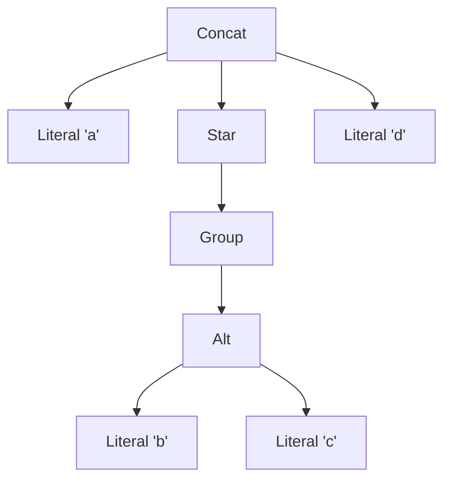
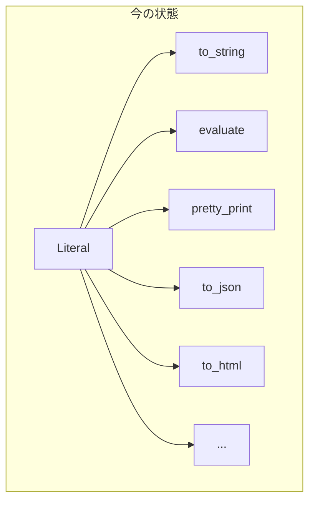
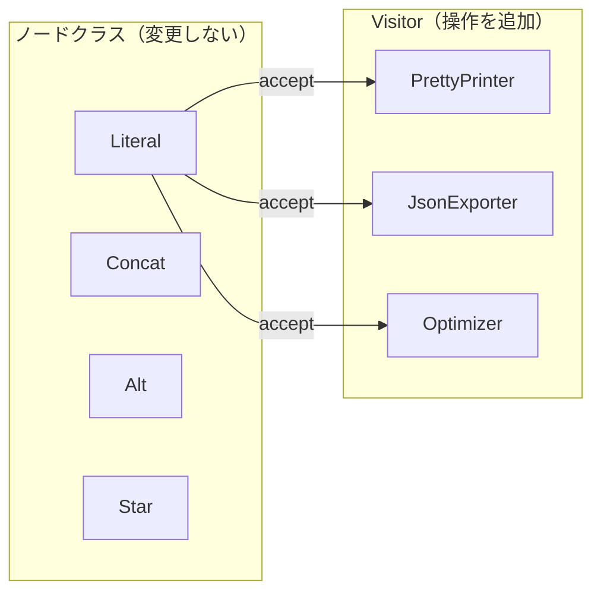
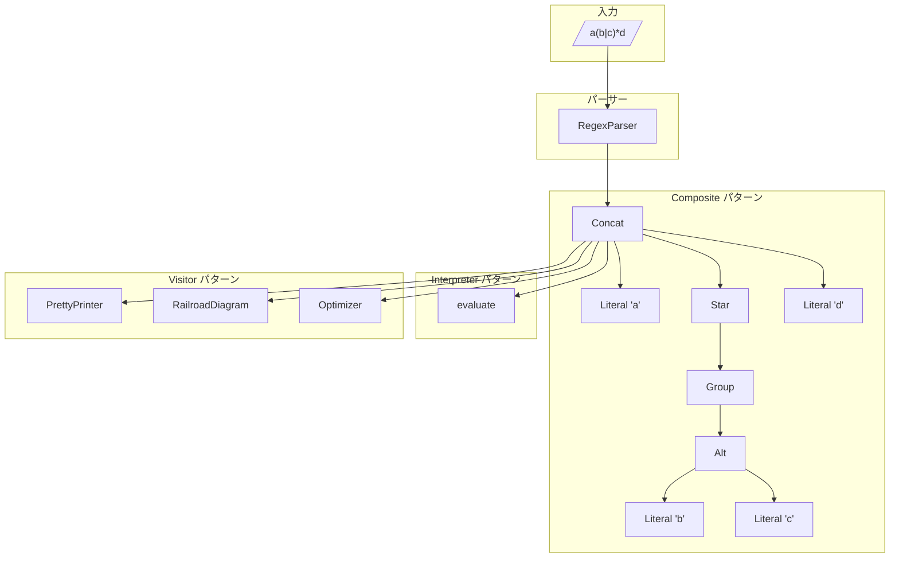

「デザインパターンは勉強したけど、いつ組み合わせて使えばいいかわからない」——そんな悩みを抱えていませんか？

この記事では、複雑な正規表現を解読・可視化するツールを作りながら、**Interpreter・Visitor・Composite**の3つのパターンを実践します。正規表現のツリー構造、マッチング処理、複数の出力形式——それぞれの問題に対して、パターンがどう解決策を提供するかを体験しましょう。

> 完成したら、「君の正規表現、冗長だよ」と友人のコードを添削できるようになります。

## この記事で学べること

| パターン | 解決する問題 | 本記事での役割 |
|---------|-------------|--------------|
| **Composite** | ツリー構造の統一的な扱い | 正規表現のAST構築 |
| **Interpreter** | 式の評価・実行 | マッチング処理の実装 |
| **Visitor** | 構造を変えずに操作追加 | 可視化・最適化機能 |

## 対象読者

- デザインパターンの名前は知っているが、組み合わせ方がわからない方
- Perl入学式を卒業し、次のステップに進みたい方
- 正規表現の内部構造に興味がある方

## 技術スタック

- **Perl** v5.36以降（signatures使用）
- **Moo** によるオブジェクト指向
- CLI（コマンドライン）環境

---

## 第1章: 正規表現を解読してみよう

### 今回の目標

- 正規表現の構造を人間が読める形に展開する
- 最もシンプルな実装からスタート

### 複雑な正規表現の悩み

こんな正規表現を見たことはありませんか？

```
^([a-zA-Z0-9_.+-]+)@([a-zA-Z0-9-]+\.)+[a-zA-Z]{2,}$
```

Stack Overflowからコピペしたけど、何をやっているか説明できない……。そんな経験、ありますよね。

まずは簡単な正規表現から始めましょう。`a(b|c)*d` という正規表現を「解読」してみます。

### 最初の実装

```perl
#!/usr/bin/env perl
use v5.36;

# シンプルな正規表現の解読
my $regex = 'a(b|c)*d';

say "=== 正規表現リファインリー ===";
say "入力: $regex";
say "";
say "解読結果:";
say "  1. 'a' で始まる";
say "  2. 'b' または 'c' が 0回以上繰り返す";
say "  3. 'd' で終わる";
say "";
say "マッチする例: ad, abd, acd, abbd, abcd, acbd, ...";
```

### 実行結果

```
=== 正規表現リファインリー ===
入力: a(b|c)*d

解読結果:
  1. 'a' で始まる
  2. 'b' または 'c' が 0回以上繰り返す
  3. 'd' で終わる

マッチする例: ad, abd, acd, abbd, abcd, acbd, ...
```

動きました！……でも、これはハードコードですね。

---

## 第2章: 複雑な正規表現で破綻

### 今回の目標

- 動的に正規表現を解析する
- 条件分岐の限界を体験する

### パーサーを作ってみる

正規表現を1文字ずつ見て解析してみましょう。

```perl
#!/usr/bin/env perl
use v5.36;

sub parse_regex($regex) {
    my @result;
    my $i = 0;
    my $len = length($regex);
    
    while ($i < $len) {
        my $char = substr($regex, $i, 1);
        
        if ($char eq '(') {
            # グループ開始
            my $group_content = '';
            $i++;
            my $depth = 1;
            while ($depth > 0 && $i < $len) {
                my $c = substr($regex, $i, 1);
                if ($c eq '(') { $depth++; }
                elsif ($c eq ')') { $depth--; }
                if ($depth > 0) { $group_content .= $c; }
                $i++;
            }
            # グループの中身を解析（再帰？）
            if (index($group_content, '|') >= 0) {
                my @alts = split /\|/, $group_content;
                push @result, "選択: " . join(" または ", @alts);
            } else {
                push @result, "グループ: $group_content";
            }
        }
        elsif ($char eq '*') {
            $result[-1] .= "（0回以上繰り返し）";
            $i++;
        }
        elsif ($char eq '+') {
            $result[-1] .= "（1回以上繰り返し）";
            $i++;
        }
        elsif ($char eq '?') {
            $result[-1] .= "（省略可能）";
            $i++;
        }
        else {
            push @result, "リテラル: '$char'";
            $i++;
        }
    }
    
    return @result;
}

my $regex = 'a(b|c)*d';
say "入力: $regex";
say "解析結果:";
for my $part (parse_regex($regex)) {
    say "  - $part";
}
```

### 実行結果

```
入力: a(b|c)*d
解析結果:
  - リテラル: 'a'
  - 選択: b または c（0回以上繰り返し）
  - リテラル: 'd'
```

一見うまくいっていますが……

### ネストしたグループで破綻

`a((b|c)(d|e))*f` のようなネストした正規表現を解析しようとすると？

```perl
my $regex = 'a((b|c)(d|e))*f';
# 期待: グループの中にさらにグループがある
# 現実: if/elseが複雑化して追跡不能に
```

問題点を整理しましょう:

1. グループのネストを追跡するのが大変
2. 選択`|`の優先順位が不明確
3. 繰り返し`*+?`がどこにかかるか曖昧
4. 新しい機能を追加するたびにif/elseが増殖

**これは設計を見直す必要があります。**

---

## 第3章: 正規表現をツリーで表す

### 今回の目標

- 正規表現をツリー構造（AST）で表現する
- Compositeパターンを導入する

### 正規表現はツリー構造

`a(b|c)*d` を図にすると、こうなります:



各ノードは:
- **リーフノード**: リテラル文字（`a`, `b`, `c`, `d`）
- **複合ノード**: 連結（Concat）, 選択（Alt）, 繰り返し（Star）, グループ（Group）

これはまさに**Compositeパターン**の構造です！

### ASTノードの定義

まず、すべてのノードに共通するインターフェースをRoleで定義します。

```perl
#!/usr/bin/env perl
use v5.36;

# === ノード共通インターフェース ===
package Node {
    use Moo::Role;
    
    # すべてのノードは文字列表現を持つ
    requires 'to_string';
}

# === リーフノード: リテラル文字 ===
package Literal {
    use Moo;
    with 'Node';
    
    has char => (is => 'ro', required => 1);
    
    sub to_string($self) {
        return $self->char;
    }
}

# === 複合ノード: 連結 ===
package Concat {
    use Moo;
    with 'Node';
    
    has children => (is => 'ro', default => sub { [] });
    
    sub to_string($self) {
        return join('', map { $_->to_string } $self->children->@*);
    }
}

# === 複合ノード: 選択 ===
package Alt {
    use Moo;
    with 'Node';
    
    has left => (is => 'ro', required => 1);
    has right => (is => 'ro', required => 1);
    
    sub to_string($self) {
        return $self->left->to_string . '|' . $self->right->to_string;
    }
}

# === 複合ノード: 繰り返し ===
package Star {
    use Moo;
    with 'Node';
    
    has child => (is => 'ro', required => 1);
    
    sub to_string($self) {
        my $inner = $self->child->to_string;
        # 複数文字ならグループ化
        return length($inner) > 1 ? "($inner)*" : "$inner*";
    }
}

# === 複合ノード: グループ ===
package Group {
    use Moo;
    with 'Node';
    
    has child => (is => 'ro', required => 1);
    
    sub to_string($self) {
        return '(' . $self->child->to_string . ')';
    }
}

# === 使用例 ===
package main;

# a(b|c)*d を手動で構築
my $tree = Concat->new(
    children => [
        Literal->new(char => 'a'),
        Star->new(
            child => Group->new(
                child => Alt->new(
                    left => Literal->new(char => 'b'),
                    right => Literal->new(char => 'c'),
                )
            )
        ),
        Literal->new(char => 'd'),
    ]
);

say "AST構築完了！";
say "to_string: " . $tree->to_string;
```

### 実行結果

```
AST構築完了！
to_string: a(b|c)*d
```

ASTからオリジナルの正規表現を復元できました！これがCompositeパターンの威力です。

### Compositeパターンのポイント

| 構成要素 | 本記事での役割 |
|---------|---------------|
| **Component** | `Node` Role（共通インターフェース） |
| **Leaf** | `Literal`（リテラル文字） |
| **Composite** | `Concat`, `Alt`, `Star`, `Group`（子を持つノード） |

クライアントは `to_string` を呼ぶだけで、リーフでも複合ノードでも同じように扱えます。

---

## 第4章: パーサーでツリーを組み立て

### 今回の目標

- 文字列からASTを自動構築する
- 再帰下降パーサーを実装する

### パーサーの設計

正規表現の文法を整理します（優先順位順）:

```
regex       → alternation
alternation → concat ('|' concat)*
concat      → repetition+
repetition  → atom ('*' | '+' | '?')?
atom        → '(' alternation ')' | literal
```

これを再帰下降パーサーとして実装します。

```perl
#!/usr/bin/env perl
use v5.36;

# （前章のノードクラスは省略、同じものを使用）

# === パーサー ===
package RegexParser {
    use Moo;
    
    has input => (is => 'ro', required => 1);
    has pos => (is => 'rw', default => 0);
    
    sub parse($self) {
        my $result = $self->parse_alternation;
        if ($self->pos < length($self->input)) {
            die "Parse error: unexpected character at position " . $self->pos;
        }
        return $result;
    }
    
    sub current_char($self) {
        return $self->pos < length($self->input)
            ? substr($self->input, $self->pos, 1)
            : undef;
    }
    
    sub consume($self) {
        my $char = $self->current_char;
        $self->pos($self->pos + 1);
        return $char;
    }
    
    sub parse_alternation($self) {
        my $left = $self->parse_concat;
        
        while (defined $self->current_char && $self->current_char eq '|') {
            $self->consume;  # '|'
            my $right = $self->parse_concat;
            $left = Alt->new(left => $left, right => $right);
        }
        
        return $left;
    }
    
    sub parse_concat($self) {
        my @children;
        
        while (defined $self->current_char 
               && $self->current_char ne '|' 
               && $self->current_char ne ')') {
            push @children, $self->parse_repetition;
        }
        
        return @children == 1 ? $children[0] : Concat->new(children => \@children);
    }
    
    sub parse_repetition($self) {
        my $node = $self->parse_atom;
        
        if (defined $self->current_char) {
            if ($self->current_char eq '*') {
                $self->consume;
                $node = Star->new(child => $node);
            }
            elsif ($self->current_char eq '+') {
                $self->consume;
                $node = Plus->new(child => $node);
            }
            elsif ($self->current_char eq '?') {
                $self->consume;
                $node = Optional->new(child => $node);
            }
        }
        
        return $node;
    }
    
    sub parse_atom($self) {
        my $char = $self->current_char;
        
        if ($char eq '(') {
            $self->consume;  # '('
            my $inner = $self->parse_alternation;
            if ($self->current_char ne ')') {
                die "Parse error: expected ')' at position " . $self->pos;
            }
            $self->consume;  # ')'
            return Group->new(child => $inner);
        }
        else {
            $self->consume;
            return Literal->new(char => $char);
        }
    }
}

# === Plus と Optional も追加 ===
package Plus {
    use Moo;
    with 'Node';
    
    has child => (is => 'ro', required => 1);
    
    sub to_string($self) {
        my $inner = $self->child->to_string;
        return length($inner) > 1 ? "($inner)+" : "$inner+";
    }
}

package Optional {
    use Moo;
    with 'Node';
    
    has child => (is => 'ro', required => 1);
    
    sub to_string($self) {
        my $inner = $self->child->to_string;
        return length($inner) > 1 ? "($inner)?" : "$inner?";
    }
}

# === 使用例 ===
package main;

my $regex = 'a(b|c)*d';
my $parser = RegexParser->new(input => $regex);
my $ast = $parser->parse;

say "入力: $regex";
say "パース成功！";
say "復元: " . $ast->to_string;
```

### 実行結果

```
入力: a(b|c)*d
パース成功！
復元: a(b|c)*d
```

文字列からASTを自動構築できるようになりました！

---

## 第5章: ツリーを歩いてマッチング

### 今回の目標

- ASTを走査して文字列とマッチングする
- Interpreterパターンを導入する

### 各ノードに evaluate メソッドを追加

Interpreterパターンでは、各ノードが「自分自身を評価する」メソッドを持ちます。

```perl
#!/usr/bin/env perl
use v5.36;

# === ノード共通インターフェース（更新） ===
package Node {
    use Moo::Role;
    
    requires 'to_string';
    requires 'evaluate';  # 追加！
}

# === マッチング結果 ===
package MatchResult {
    use Moo;
    
    has matched => (is => 'ro', required => 1);
    has consumed => (is => 'ro', default => 0);
}

# === リテラル ===
package Literal {
    use Moo;
    with 'Node';
    
    has char => (is => 'ro', required => 1);
    
    sub to_string($self) {
        return $self->char;
    }
    
    sub evaluate($self, $input, $pos) {
        if ($pos < length($input) && substr($input, $pos, 1) eq $self->char) {
            return MatchResult->new(matched => 1, consumed => 1);
        }
        return MatchResult->new(matched => 0);
    }
}

# === 連結 ===
package Concat {
    use Moo;
    with 'Node';
    
    has children => (is => 'ro', default => sub { [] });
    
    sub to_string($self) {
        return join('', map { $_->to_string } $self->children->@*);
    }
    
    sub evaluate($self, $input, $pos) {
        my $current_pos = $pos;
        
        for my $child ($self->children->@*) {
            my $result = $child->evaluate($input, $current_pos);
            return MatchResult->new(matched => 0) unless $result->matched;
            $current_pos += $result->consumed;
        }
        
        return MatchResult->new(matched => 1, consumed => $current_pos - $pos);
    }
}

# === 選択 ===
package Alt {
    use Moo;
    with 'Node';
    
    has left => (is => 'ro', required => 1);
    has right => (is => 'ro', required => 1);
    
    sub to_string($self) {
        return $self->left->to_string . '|' . $self->right->to_string;
    }
    
    sub evaluate($self, $input, $pos) {
        # 左を試す
        my $result = $self->left->evaluate($input, $pos);
        return $result if $result->matched;
        
        # 左が失敗したら右を試す
        return $self->right->evaluate($input, $pos);
    }
}

# === 繰り返し（0回以上） ===
package Star {
    use Moo;
    with 'Node';
    
    has child => (is => 'ro', required => 1);
    
    sub to_string($self) {
        my $inner = $self->child->to_string;
        return length($inner) > 1 ? "($inner)*" : "$inner*";
    }
    
    sub evaluate($self, $input, $pos) {
        my $current_pos = $pos;
        
        # できるだけ多くマッチ（greedy）
        while (1) {
            my $result = $self->child->evaluate($input, $current_pos);
            last unless $result->matched && $result->consumed > 0;
            $current_pos += $result->consumed;
        }
        
        return MatchResult->new(matched => 1, consumed => $current_pos - $pos);
    }
}

# === グループ ===
package Group {
    use Moo;
    with 'Node';
    
    has child => (is => 'ro', required => 1);
    
    sub to_string($self) {
        return '(' . $self->child->to_string . ')';
    }
    
    sub evaluate($self, $input, $pos) {
        return $self->child->evaluate($input, $pos);
    }
}

# === テスト ===
package main;

# 手動でAST構築（簡略化）
my $ast = Concat->new(
    children => [
        Literal->new(char => 'a'),
        Star->new(
            child => Group->new(
                child => Alt->new(
                    left => Literal->new(char => 'b'),
                    right => Literal->new(char => 'c'),
                )
            )
        ),
        Literal->new(char => 'd'),
    ]
);

say "正規表現: " . $ast->to_string;
say "";

my @test_cases = ('ad', 'abd', 'acd', 'abcd', 'abbd', 'ax', 'abx');
for my $test (@test_cases) {
    my $result = $ast->evaluate($test, 0);
    my $status = $result->matched && $result->consumed == length($test) ? "✓" : "✗";
    say "  '$test' => $status";
}
```

### 実行結果

```
正規表現: a(b|c)*d

  'ad' => ✓
  'abd' => ✓
  'acd' => ✓
  'abcd' => ✓
  'abbd' => ✓
  'ax' => ✗
  'abx' => ✗
```

ASTを歩いてマッチング判定ができるようになりました！これがInterpreterパターンです。

### Interpreterパターンのポイント

| 構成要素 | 本記事での役割 |
|---------|---------------|
| **AbstractExpression** | `Node` Role（evaluate必須） |
| **TerminalExpression** | `Literal`（最も単純な評価） |
| **NonterminalExpression** | `Concat`, `Alt`, `Star`（子に委譲） |
| **Context** | 入力文字列と現在位置 |

---

## 第6章: 可視化機能を追加したい

### 今回の目標

- 正規表現を可読形式で出力したい
- 開放閉鎖原則（OCP）の問題を体験する

### 新しい出力形式を追加

`to_string` とは別に、インデント付きの可読形式で出力したい:

```
Concat
├─ Literal: 'a'
├─ Star
│  └─ Group
│     └─ Alt
│        ├─ Literal: 'b'
│        └─ Literal: 'c'
└─ Literal: 'd'
```

### 素朴なアプローチ: 各クラスにメソッド追加

```perl
package Literal {
    # ... 既存のコード ...
    
    sub pretty_print($self, $indent = 0) {
        return "  " x $indent . "Literal: '" . $self->char . "'\n";
    }
}

package Concat {
    # ... 既存のコード ...
    
    sub pretty_print($self, $indent = 0) {
        my $result = "  " x $indent . "Concat\n";
        for my $child ($self->children->@*) {
            $result .= $child->pretty_print($indent + 1);
        }
        return $result;
    }
}

# ... 他のクラスも同様に ...
```

### 問題点

これは動作しますが、問題があります:

1. **新しい出力形式を追加するたびに全クラスを修正**
   - Markdown出力、JSON出力、HTML出力……
   - クラスが「閉じていない」（OCP違反）

2. **クラスの責務が増え続ける**
   - ノードクラスは「構造の表現」に集中すべき
   - 出力形式ごとにメソッドが増殖



**「操作を追加するたびにクラスを変更しなければならない」** これが第7章で解決する問題です。

---

## 第7章: 操作をクラスに分離

### 今回の目標

- Visitorパターンを導入する
- ノードクラスを変更せずに操作を追加する

### Visitorパターンの構造



### 実装

```perl
#!/usr/bin/env perl
use v5.36;

# === Visitor インターフェース ===
package Visitor {
    use Moo::Role;
    
    requires 'visit_literal';
    requires 'visit_concat';
    requires 'visit_alt';
    requires 'visit_star';
    requires 'visit_group';
}

# === Node に accept メソッドを追加 ===
package Node {
    use Moo::Role;
    
    requires 'to_string';
    requires 'accept';  # Visitor を受け入れる
}

# === 各ノードクラス ===
package Literal {
    use Moo;
    with 'Node';
    
    has char => (is => 'ro', required => 1);
    
    sub to_string($self) { return $self->char; }
    
    sub accept($self, $visitor) {
        return $visitor->visit_literal($self);
    }
}

package Concat {
    use Moo;
    with 'Node';
    
    has children => (is => 'ro', default => sub { [] });
    
    sub to_string($self) {
        return join('', map { $_->to_string } $self->children->@*);
    }
    
    sub accept($self, $visitor) {
        return $visitor->visit_concat($self);
    }
}

package Alt {
    use Moo;
    with 'Node';
    
    has left => (is => 'ro', required => 1);
    has right => (is => 'ro', required => 1);
    
    sub to_string($self) {
        return $self->left->to_string . '|' . $self->right->to_string;
    }
    
    sub accept($self, $visitor) {
        return $visitor->visit_alt($self);
    }
}

package Star {
    use Moo;
    with 'Node';
    
    has child => (is => 'ro', required => 1);
    
    sub to_string($self) {
        my $inner = $self->child->to_string;
        return length($inner) > 1 ? "($inner)*" : "$inner*";
    }
    
    sub accept($self, $visitor) {
        return $visitor->visit_star($self);
    }
}

package Group {
    use Moo;
    with 'Node';
    
    has child => (is => 'ro', required => 1);
    
    sub to_string($self) {
        return '(' . $self->child->to_string . ')';
    }
    
    sub accept($self, $visitor) {
        return $visitor->visit_group($self);
    }
}

# === PrettyPrinter Visitor ===
package PrettyPrinter {
    use Moo;
    with 'Visitor';
    
    has indent => (is => 'rw', default => 0);
    
    sub _prefix($self) {
        return "  " x $self->indent;
    }
    
    sub visit_literal($self, $node) {
        return $self->_prefix . "Literal: '" . $node->char . "'\n";
    }
    
    sub visit_concat($self, $node) {
        my $result = $self->_prefix . "Concat\n";
        $self->indent($self->indent + 1);
        for my $child ($node->children->@*) {
            $result .= $child->accept($self);
        }
        $self->indent($self->indent - 1);
        return $result;
    }
    
    sub visit_alt($self, $node) {
        my $result = $self->_prefix . "Alt\n";
        $self->indent($self->indent + 1);
        $result .= $node->left->accept($self);
        $result .= $node->right->accept($self);
        $self->indent($self->indent - 1);
        return $result;
    }
    
    sub visit_star($self, $node) {
        my $result = $self->_prefix . "Star\n";
        $self->indent($self->indent + 1);
        $result .= $node->child->accept($self);
        $self->indent($self->indent - 1);
        return $result;
    }
    
    sub visit_group($self, $node) {
        my $result = $self->_prefix . "Group\n";
        $self->indent($self->indent + 1);
        $result .= $node->child->accept($self);
        $self->indent($self->indent - 1);
        return $result;
    }
}

# === 使用例 ===
package main;

my $ast = Concat->new(
    children => [
        Literal->new(char => 'a'),
        Star->new(
            child => Group->new(
                child => Alt->new(
                    left => Literal->new(char => 'b'),
                    right => Literal->new(char => 'c'),
                )
            )
        ),
        Literal->new(char => 'd'),
    ]
);

say "正規表現: " . $ast->to_string;
say "";
say "=== PrettyPrinter ===";
my $printer = PrettyPrinter->new;
print $ast->accept($printer);
```

### 実行結果

```
正規表現: a(b|c)*d

=== PrettyPrinter ===
Concat
  Literal: 'a'
  Star
    Group
      Alt
        Literal: 'b'
        Literal: 'c'
  Literal: 'd'
```

ノードクラスに `accept` メソッドを1回追加するだけで、新しい Visitor を自由に追加できるようになりました！

### Double Dispatch のしくみ

```
1. ast->accept(printer)    # 第1ディスパッチ: ノードのaccept
       ↓
2. printer->visit_concat(self)  # 第2ディスパッチ: Visitorの具体メソッド
```

これにより、「ノードの種類 × 操作の種類」の組み合わせを型安全に処理できます。

---

## 第8章: 最適化と鉄道図も追加

### 今回の目標

- 複数の Visitor を追加する
- ノードクラスを変更せずに機能拡張を体験

### RailroadDiagram Visitor

正規表現を鉄道図風のASCIIアートで可視化します。

```perl
# === RailroadDiagram Visitor ===
package RailroadDiagram {
    use Moo;
    with 'Visitor';
    
    sub visit_literal($self, $node) {
        return "─[" . $node->char . "]─";
    }
    
    sub visit_concat($self, $node) {
        my @parts = map { $_->accept($self) } $node->children->@*;
        return join("", @parts);
    }
    
    sub visit_alt($self, $node) {
        my $left = $node->left->accept($self);
        my $right = $node->right->accept($self);
        # 簡易版の選択表現
        return "─┬$left┬─\n └$right┘";
    }
    
    sub visit_star($self, $node) {
        my $inner = $node->child->accept($self);
        return "─┬$inner┬─\n └──←──┘";
    }
    
    sub visit_group($self, $node) {
        return $node->child->accept($self);
    }
}
```

### Optimizer Visitor（簡易版）

冗長な記法を検出します。

```perl
# === Optimizer Visitor ===
package Optimizer {
    use Moo;
    with 'Visitor';
    
    has suggestions => (is => 'rw', default => sub { [] });
    
    sub visit_literal($self, $node) {
        return;
    }
    
    sub visit_concat($self, $node) {
        # 連続するリテラルを検出
        my @literals;
        for my $child ($node->children->@*) {
            if ($child->isa('Literal')) {
                push @literals, $child->char;
            } else {
                $self->_check_literals(\@literals);
                @literals = ();
                $child->accept($self);
            }
        }
        $self->_check_literals(\@literals);
    }
    
    sub _check_literals($self, $literals) {
        if (@$literals >= 3) {
            my $str = join('', @$literals);
            push $self->suggestions->@*, 
                "ヒント: '$str' はリテラル文字列として最適化可能";
        }
    }
    
    sub visit_alt($self, $node) {
        $node->left->accept($self);
        $node->right->accept($self);
    }
    
    sub visit_star($self, $node) {
        # (a*)* のような冗長パターンを検出
        if ($node->child->isa('Star')) {
            push $self->suggestions->@*, 
                "警告: 二重の繰り返し (X*)* は X* に簡略化可能";
        }
        $node->child->accept($self);
    }
    
    sub visit_group($self, $node) {
        $node->child->accept($self);
    }
}
```

### 使用例

```perl
package main;

my $ast = Concat->new(
    children => [
        Literal->new(char => 'a'),
        Star->new(
            child => Group->new(
                child => Alt->new(
                    left => Literal->new(char => 'b'),
                    right => Literal->new(char => 'c'),
                )
            )
        ),
        Literal->new(char => 'd'),
    ]
);

say "=== 正規表現 ===";
say $ast->to_string;
say "";

say "=== PrettyPrinter ===";
print $ast->accept(PrettyPrinter->new);
say "";

say "=== RailroadDiagram ===";
say $ast->accept(RailroadDiagram->new);
say "";

say "=== Optimizer ===";
my $optimizer = Optimizer->new;
$ast->accept($optimizer);
if ($optimizer->suggestions->@*) {
    say $_ for $optimizer->suggestions->@*;
} else {
    say "最適化の提案はありません。";
}
```

### 実行結果

```
=== 正規表現 ===
a(b|c)*d

=== PrettyPrinter ===
Concat
  Literal: 'a'
  Star
    Group
      Alt
        Literal: 'b'
        Literal: 'c'
  Literal: 'd'

=== RailroadDiagram ===
─[a]──┬─[b]─┬──[d]─
      └─[c]─┘

=== Optimizer ===
最適化の提案はありません。
```

**ノードクラスを一切変更せずに、3つの Visitor を追加できました！**

---

## 第9章: 3パターンで完成！

### 今回の目標

- 3つのパターンの連携を振り返る
- パターン名と役割を明確にする

### 完成した構造



### 3パターンの役割

| パターン | 解決した問題 | 本記事での実装 |
|---------|-------------|--------------|
| **Composite** | ツリー構造の統一的な扱い | `Node` Role, `Literal`, `Concat`, `Alt`, `Star`, `Group` |
| **Interpreter** | 式の評価・実行 | 各ノードの `evaluate` メソッド |
| **Visitor** | 構造を変えずに操作追加 | `Visitor` Role, `PrettyPrinter`, `RailroadDiagram`, `Optimizer` |

### なぜこの組み合わせが強力か

1. **Composite** で構造を定義
   - リーフ（Literal）と複合（Concat, Alt, Star）を統一的に扱えます
   - 再帰的な構造を自然に表現します

2. **Interpreter** で基本動作を実装
   - 各ノードが「自分自身を評価する」責務を持ちます
   - マッチング処理が構造に沿って実行されます

3. **Visitor** で拡張性を確保
   - 可視化、最適化、変換など様々な操作を追加します
   - ノードクラスを閉じたまま（OCP遵守）

### まとめ

「正規表現リファインリー」を作りながら、3つのデザインパターンを体験しました:

- **第3章**: Composite でツリー構造を表現
- **第5章**: Interpreter で評価処理を実装
- **第7章**: Visitor で操作を分離

これらのパターンは単独でも有用ですが、組み合わせることで言語処理やコンパイラ設計の基礎となる強力なアーキテクチャを構築できます。

---

## 完成コード

最終的なコードを1ファイルにまとめました。

```perl
#!/usr/bin/env perl
use v5.36;

# ============================================
# 正規表現リファインリー（RegexRefinery）
# Interpreter × Visitor × Composite パターン
# ============================================

# === Visitor インターフェース ===
package Visitor {
    use Moo::Role;
    requires 'visit_literal';
    requires 'visit_concat';
    requires 'visit_alt';
    requires 'visit_star';
    requires 'visit_plus';
    requires 'visit_optional';
    requires 'visit_group';
}

# === Node インターフェース ===
package Node {
    use Moo::Role;
    requires 'to_string';
    requires 'accept';
}

# === MatchResult ===
package MatchResult {
    use Moo;
    has matched => (is => 'ro', required => 1);
    has consumed => (is => 'ro', default => 0);
}

# === Literal ===
package Literal {
    use Moo;
    with 'Node';
    has char => (is => 'ro', required => 1);
    
    sub to_string($self) { $self->char }
    sub accept($self, $v) { $v->visit_literal($self) }
    sub evaluate($self, $input, $pos) {
        if ($pos < length($input) && substr($input, $pos, 1) eq $self->char) {
            return MatchResult->new(matched => 1, consumed => 1);
        }
        return MatchResult->new(matched => 0);
    }
}

# === Concat ===
package Concat {
    use Moo;
    with 'Node';
    has children => (is => 'ro', default => sub { [] });
    
    sub to_string($self) {
        join('', map { $_->to_string } $self->children->@*);
    }
    sub accept($self, $v) { $v->visit_concat($self) }
    sub evaluate($self, $input, $pos) {
        my $p = $pos;
        for my $c ($self->children->@*) {
            my $r = $c->evaluate($input, $p);
            return MatchResult->new(matched => 0) unless $r->matched;
            $p += $r->consumed;
        }
        return MatchResult->new(matched => 1, consumed => $p - $pos);
    }
}

# === Alt ===
package Alt {
    use Moo;
    with 'Node';
    has left => (is => 'ro', required => 1);
    has right => (is => 'ro', required => 1);
    
    sub to_string($self) {
        $self->left->to_string . '|' . $self->right->to_string;
    }
    sub accept($self, $v) { $v->visit_alt($self) }
    sub evaluate($self, $input, $pos) {
        my $r = $self->left->evaluate($input, $pos);
        return $r if $r->matched;
        return $self->right->evaluate($input, $pos);
    }
}

# === Star ===
package Star {
    use Moo;
    with 'Node';
    has child => (is => 'ro', required => 1);
    
    sub to_string($self) {
        my $i = $self->child->to_string;
        length($i) > 1 ? "($i)*" : "$i*";
    }
    sub accept($self, $v) { $v->visit_star($self) }
    sub evaluate($self, $input, $pos) {
        my $p = $pos;
        while (1) {
            my $r = $self->child->evaluate($input, $p);
            last unless $r->matched && $r->consumed > 0;
            $p += $r->consumed;
        }
        return MatchResult->new(matched => 1, consumed => $p - $pos);
    }
}

# === Plus ===
package Plus {
    use Moo;
    with 'Node';
    has child => (is => 'ro', required => 1);
    
    sub to_string($self) {
        my $i = $self->child->to_string;
        length($i) > 1 ? "($i)+" : "$i+";
    }
    sub accept($self, $v) { $v->visit_plus($self) }
    sub evaluate($self, $input, $pos) {
        my $r = $self->child->evaluate($input, $pos);
        return MatchResult->new(matched => 0) unless $r->matched;
        my $p = $pos + $r->consumed;
        while (1) {
            $r = $self->child->evaluate($input, $p);
            last unless $r->matched && $r->consumed > 0;
            $p += $r->consumed;
        }
        return MatchResult->new(matched => 1, consumed => $p - $pos);
    }
}

# === Optional ===
package Optional {
    use Moo;
    with 'Node';
    has child => (is => 'ro', required => 1);
    
    sub to_string($self) {
        my $i = $self->child->to_string;
        length($i) > 1 ? "($i)?" : "$i?";
    }
    sub accept($self, $v) { $v->visit_optional($self) }
    sub evaluate($self, $input, $pos) {
        my $r = $self->child->evaluate($input, $pos);
        return $r->matched ? $r : MatchResult->new(matched => 1, consumed => 0);
    }
}

# === Group ===
package Group {
    use Moo;
    with 'Node';
    has child => (is => 'ro', required => 1);
    
    sub to_string($self) { '(' . $self->child->to_string . ')' }
    sub accept($self, $v) { $v->visit_group($self) }
    sub evaluate($self, $input, $pos) {
        $self->child->evaluate($input, $pos);
    }
}

# === RegexParser ===
package RegexParser {
    use Moo;
    has input => (is => 'ro', required => 1);
    has pos => (is => 'rw', default => 0);
    
    sub parse($self) {
        my $r = $self->_alternation;
        die "Parse error at " . $self->pos if $self->pos < length($self->input);
        return $r;
    }
    
    sub _char($self) {
        $self->pos < length($self->input) ? substr($self->input, $self->pos, 1) : undef;
    }
    sub _eat($self) { my $c = $self->_char; $self->pos($self->pos + 1); $c }
    
    sub _alternation($self) {
        my $l = $self->_concat;
        while (defined $self->_char && $self->_char eq '|') {
            $self->_eat;
            $l = Alt->new(left => $l, right => $self->_concat);
        }
        return $l;
    }
    
    sub _concat($self) {
        my @ch;
        while (defined $self->_char && $self->_char ne '|' && $self->_char ne ')') {
            push @ch, $self->_repetition;
        }
        return @ch == 1 ? $ch[0] : Concat->new(children => \@ch);
    }
    
    sub _repetition($self) {
        my $n = $self->_atom;
        if (defined $self->_char) {
            if ($self->_char eq '*') { $self->_eat; $n = Star->new(child => $n); }
            elsif ($self->_char eq '+') { $self->_eat; $n = Plus->new(child => $n); }
            elsif ($self->_char eq '?') { $self->_eat; $n = Optional->new(child => $n); }
        }
        return $n;
    }
    
    sub _atom($self) {
        if ($self->_char eq '(') {
            $self->_eat;
            my $i = $self->_alternation;
            die "Expected ')'" unless $self->_char eq ')';
            $self->_eat;
            return Group->new(child => $i);
        }
        return Literal->new(char => $self->_eat);
    }
}

# === PrettyPrinter Visitor ===
package PrettyPrinter {
    use Moo;
    with 'Visitor';
    has indent => (is => 'rw', default => 0);
    
    sub _pre($self) { "  " x $self->indent }
    sub visit_literal($self, $n) { $self->_pre . "Literal: '" . $n->char . "'\n" }
    sub visit_concat($self, $n) {
        my $r = $self->_pre . "Concat\n";
        $self->indent($self->indent + 1);
        $r .= $_->accept($self) for $n->children->@*;
        $self->indent($self->indent - 1);
        $r;
    }
    sub visit_alt($self, $n) {
        my $r = $self->_pre . "Alt\n";
        $self->indent($self->indent + 1);
        $r .= $n->left->accept($self) . $n->right->accept($self);
        $self->indent($self->indent - 1);
        $r;
    }
    sub visit_star($self, $n) {
        my $r = $self->_pre . "Star\n";
        $self->indent($self->indent + 1);
        $r .= $n->child->accept($self);
        $self->indent($self->indent - 1);
        $r;
    }
    sub visit_plus($self, $n) {
        my $r = $self->_pre . "Plus\n";
        $self->indent($self->indent + 1);
        $r .= $n->child->accept($self);
        $self->indent($self->indent - 1);
        $r;
    }
    sub visit_optional($self, $n) {
        my $r = $self->_pre . "Optional\n";
        $self->indent($self->indent + 1);
        $r .= $n->child->accept($self);
        $self->indent($self->indent - 1);
        $r;
    }
    sub visit_group($self, $n) {
        my $r = $self->_pre . "Group\n";
        $self->indent($self->indent + 1);
        $r .= $n->child->accept($self);
        $self->indent($self->indent - 1);
        $r;
    }
}

# === メイン処理 ===
package main;

my $regex = $ARGV[0] // 'a(b|c)*d';
say "=== 正規表現リファインリー ===";
say "入力: $regex";
say "";

my $parser = RegexParser->new(input => $regex);
my $ast = $parser->parse;

say "復元: " . $ast->to_string;
say "";

say "=== AST構造 ===";
print $ast->accept(PrettyPrinter->new);
say "";

say "=== マッチングテスト ===";
my @tests = ('ad', 'abd', 'acd', 'abcd', 'abbd', 'ax', 'abx');
for my $t (@tests) {
    my $r = $ast->evaluate($t, 0);
    my $ok = $r->matched && $r->consumed == length($t);
    say "  '$t' => " . ($ok ? "✓ マッチ" : "✗ 不一致");
}
```

### 実行例

```bash
$ perl regex_refinery.pl 'a(b|c)*d'
=== 正規表現リファインリー ===
入力: a(b|c)*d

復元: a(b|c)*d

=== AST構造 ===
Concat
  Literal: 'a'
  Star
    Group
      Alt
        Literal: 'b'
        Literal: 'c'
  Literal: 'd'

=== マッチングテスト ===
  'ad' => ✓ マッチ
  'abd' => ✓ マッチ
  'acd' => ✓ マッチ
  'abcd' => ✓ マッチ
  'abbd' => ✓ マッチ
  'ax' => ✗ 不一致
  'abx' => ✗ 不一致
```

---

## パターン対応表

| GoF用語 | 本記事での実装 |
|--------|--------------|
| **Composite** | |
| Component | `Node` Role |
| Leaf | `Literal` |
| Composite | `Concat`, `Alt`, `Star`, `Plus`, `Optional`, `Group` |
| **Interpreter** | |
| AbstractExpression | `Node` Role（evaluate必須） |
| TerminalExpression | `Literal` |
| NonterminalExpression | `Concat`, `Alt`, `Star`, `Plus`, `Optional`, `Group` |
| Context | 入力文字列 + 位置 |
| **Visitor** | |
| Visitor | `Visitor` Role |
| ConcreteVisitor | `PrettyPrinter`, etc. |
| Element | `Node` Role（accept必須） |
| ConcreteElement | 各ノードクラス |

---

## 発展課題

完成したツールをさらに拡張してみましょう:

1. **文字クラス対応**: `[abc]`, `[a-z]`, `[^abc]`
2. **メタ文字対応**: `.`, `\d`, `\w`, `\s`
3. **JSON出力 Visitor**: ASTをJSON形式でエクスポート
4. **Markdown出力 Visitor**: 正規表現のドキュメント生成
5. **性能分析 Visitor**: バックトラッキングの深さを測定

これらの拡張は、ノードクラスを変更せずに Visitor を追加するだけで実現できます。

---

## 関連シリーズ

各パターンを単独で学びたい場合は、以下のシリーズもご覧ください:

- [Interpreterパターン: ダイス言語を作ってみよう](/2026/01/29/000330/)
- [Visitorパターン: ドキュメント変換ツール](/2026/01/27/005724/)
- [Compositeパターン: Markdown目次生成ツリー構造](/2026/01/20/003414/)
