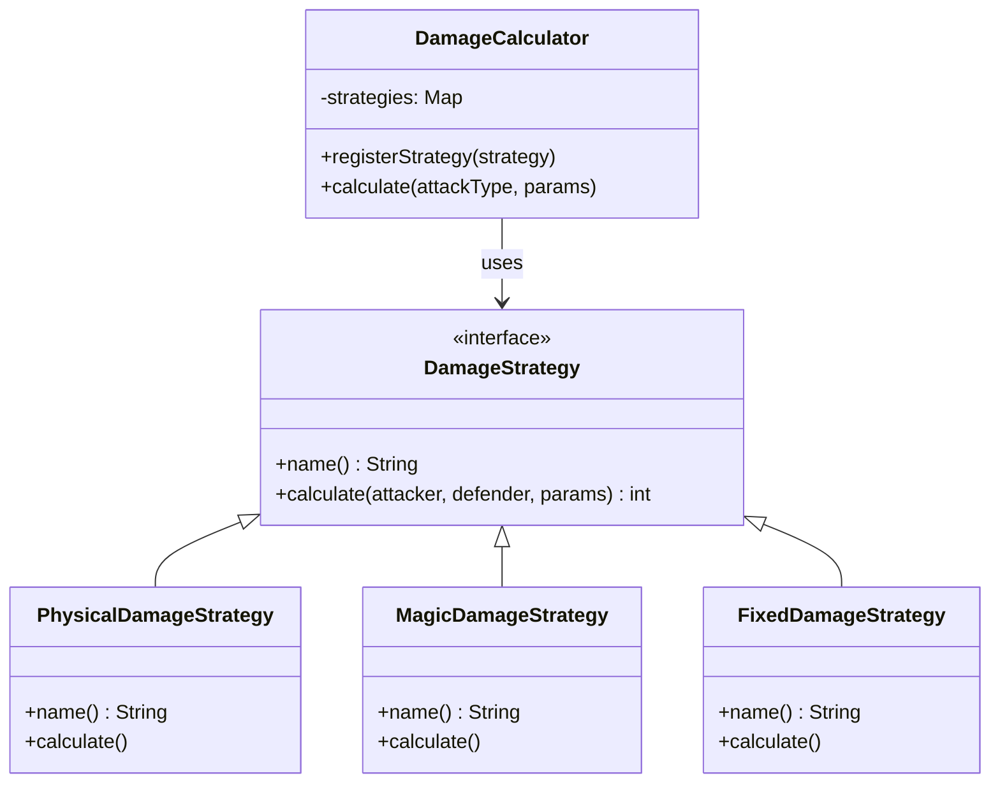

## プロローグ：深夜のコード診療所

「先生、患者さんです！」

助手の声が夜更けのクリニックに響く。元ネイルサロンだったこの場所には、今でもネイル用のLEDライトがひっそりと残っている。私はモニターから目を離し、玄関を見た。

担ぎ込まれてきたのは、目の下にクマを作った青年。彼の手には、分厚いノートPCが握られている。

「先生……ダメージ計算の関数が……もう500行を超えて……」

私は青年のPCを受け取り、コードを開いた。

**重症。**

`if-else`の森が延々と続いている。物理ダメージ、魔法ダメージ、固定ダメージ、割合ダメージ……攻撃タイプが増えるたびに、この神クラスは肥大化していったのだろう。

「新しいスキルを追加するたびに、この関数に行を足していたのか」

「はい……最初は30行だったんです。でも気づいたら……」

青年はうなだれた。私は立ち上がり、ホワイトボードにペンを走らせた。

「手術が必要だ。**Strategyパターン**で」

---

## 第1章：緊急入院 — 診断

### 症状の確認

患者のコードを見てみよう。これが「if-else地獄」だ。

```perl
sub calculate ($self, $attack_type, %params) {
    my $damage = 0;
    my $attacker = $self->{attacker};
    my $defender = $self->{defender};

    # 攻撃タイプ別分岐（if-else地獄の始まり）
    if ($attack_type eq '物理') {
        $damage = $attacker->{attack} - $defender->{defense};
        if ($params{critical}) {
            $damage = int($damage * 1.5);
        }
        if ($params{element} && $defender->{weakness}) {
            if ($params{element} eq $defender->{weakness}) {
                $damage = int($damage * 1.5);
            } elsif ($params{element} eq $defender->{resistance}) {
                $damage = int($damage * 0.5);
            }
        }
    }
    elsif ($attack_type eq '魔法') {
        $damage = $attacker->{magic_attack} - $defender->{magic_defense};
        $damage = int($damage * 1.2);
        # ... 同じようなif-elseが続く
    }
    elsif ($attack_type eq '固定') {
        $damage = $params{fixed_damage} // 100;
    }
    elsif ($attack_type eq '割合') {
        my $percent = $params{percent} // 10;
        $damage = int($defender->{max_hp} * $percent / 100);
    }
    # ... 10種類以上の攻撃タイプが延々と続く
    else {
        warn "Unknown attack type: $attack_type";
        $damage = 0;
    }

    return $damage;
}
```

「先生、これって……」

助手が心配そうに青年を見ている。いや、私のことを見ている気がした。彼女なりの愛情表現だろう。いつも私の体調を気にかけてくれる。

「つまりですね」助手が青年に向き直った。「この関数には3つの問題があります」

| 症状 | 具体的な問題 | リスク |
|------|--------------|--------|
| 条件分岐過多症候群 | 攻撃タイプが10種類以上 | バグ混入率が指数的に増加 |
| 拡張不能症 | 新スキル追加のたびに既存コードを修正 | OCP違反、デグレの温床 |
| コピペ依存症 | 似たようなロジックが各分岐に散在 | 修正漏れ、メンテナンス地獄 |

「放置すれば、この関数は1000行を超える。いずれ誰も触れなくなる」

青年の顔が青ざめた。

---

## 第2章：処方箋 — Strategyパターンとは

### パターンの説明

私はホワイトボードに図を描いた。



「Strategyパターン」

「患者さん、これは処理のやり方を交換可能にするパターンです」助手が補足する。「攻撃タイプごとに1つのクラスを作り、それを差し替えられるようにするんです」

「え、でもそれだとクラスがめちゃくちゃ増えませんか……？」

「増える。しかし、管理は楽になる」

私はペンを置いた。500行の巨大関数と、20行のクラス6個。どちらが健全かは明らかだ。

### 禁忌事項

「ただし」と私は付け加えた。

「このパターンを使いすぎるな」

| 禁忌 | 理由 |
|------|------|
| 分岐が2〜3個程度 | 過剰投薬。シンプルなif-elseで十分 |
| 今後仕様が変わらない | 予防治療の必要なし |

「なるほど……」

青年は少しだけ顔色を取り戻した。

---

## 第3章：手術開始 — Strategyインターフェースの作成

「では始める」

### 基底クラスの作成

まず、すべてのダメージ計算戦略の基底となるクラスを作る。

```perl
package DamageStrategy {
    sub new ($class, %args) {
        return bless \%args, $class;
    }

    # 抽象メソッド（サブクラスで実装）
    sub calculate ($self, $attacker, $defender, %params) {
        die "calculate() must be implemented by subclass";
    }

    sub name ($self) {
        die "name() must be implemented by subclass";
    }

    # 共通: クリティカル倍率
    sub critical_modifier ($self, $is_critical) {
        return $is_critical
            ? ($self->{critical_multiplier} // 1.5)
            : 1.0;
    }

    # 共通: 属性相性を計算
    sub element_modifier ($self, $element, $defender) {
        return 1.0 unless $element;
        return 1.0 unless $defender->{weakness} || $defender->{resistance};

        if ($element eq ($defender->{weakness} // '')) {
            return $self->{weakness_multiplier} // 1.5;
        }
        if ($element eq ($defender->{resistance} // '')) {
            return $self->{resistance_multiplier} // 0.5;
        }
        return 1.0;
    }

    # 共通: バフ/デバフ補正
    sub buff_modifier ($self, $attacker, $defender) {
        my $mod = 1.0;
        if ($attacker->{buffs} && $attacker->{buffs}{attack_up}) {
            $mod *= 1.25;
        }
        if ($defender->{debuffs} && $defender->{debuffs}{defense_down}) {
            $mod *= 1.2;
        }
        return $mod;
    }

    # 共通: 最低ダメージ保証
    sub ensure_minimum ($self, $damage) {
        return $damage < 1 ? 1 : int($damage);
    }
}
```

「先生、共通処理が基底クラスにまとまりましたね」

助手がうなずいた。遅くまで残って手伝ってくれている。私と一緒にいたいのか。

「これで各Strategyは自分の計算ロジックだけを持てばいい」

---

## 第4章：投薬 — 具象Strategyの実装

### 物理ダメージStrategy

```perl
package PhysicalDamageStrategy {
    use parent -norequire, 'DamageStrategy';

    sub new ($class) {
        return $class->SUPER::new(
            critical_multiplier   => 1.5,
            weakness_multiplier   => 1.5,
            resistance_multiplier => 0.5,
        );
    }

    sub name ($self) { '物理' }

    sub calculate ($self, $attacker, $defender, %params) {
        my $base = $attacker->{attack} - $defender->{defense};

        $base *= $self->critical_modifier($params{critical});
        $base *= $self->element_modifier($params{element}, $defender);
        $base *= $self->buff_modifier($attacker, $defender);

        return $self->ensure_minimum($base);
    }
}
```

### 魔法ダメージStrategy

```perl
package MagicDamageStrategy {
    use parent -norequire, 'DamageStrategy';

    sub new ($class) {
        return $class->SUPER::new(
            base_multiplier       => 1.2,
            critical_multiplier   => 1.3,
            weakness_multiplier   => 2.0,
            resistance_multiplier => 0.25,
        );
    }

    sub name ($self) { '魔法' }

    sub calculate ($self, $attacker, $defender, %params) {
        my $base = $attacker->{magic_attack} - $defender->{magic_defense};
        $base *= $self->{base_multiplier};

        $base *= $self->critical_modifier($params{critical});
        $base *= $self->element_modifier($params{element}, $defender);
        $base *= $self->buff_modifier($attacker, $defender);

        return $self->ensure_minimum($base);
    }
}
```

### 固定ダメージStrategy

```perl
package FixedDamageStrategy {
    use parent -norequire, 'DamageStrategy';

    sub name ($self) { '固定' }

    sub calculate ($self, $attacker, $defender, %params) {
        # 固定ダメージは防御・属性・クリティカルを無視
        my $damage = $params{fixed_damage} // 100;
        return $self->ensure_minimum($damage);
    }
}
```

「先生！」青年が声を上げた。「新しい攻撃タイプを追加する場合は……？」

「こうする」

---

## 第5章：新しい攻撃タイプの追加

### 割合ダメージStrategy（追加処方）

```perl
package PercentDamageStrategy {
    use parent -norequire, 'DamageStrategy';

    sub name ($self) { '割合' }

    sub calculate ($self, $attacker, $defender, %params) {
        my $percent = $params{percent} // 10;
        my $damage  = int($defender->{max_hp} * $percent / 100);

        # 上限チェック
        my $cap = $params{cap} // 9999;
        $damage = $cap if $damage > $cap;

        return $self->ensure_minimum($damage);
    }
}
```

「たった20行で新しい攻撃タイプが追加できた……」

青年の目が輝いている。

「元の関数では50行の追加が必要だった。今は5行のクラス定義と、15行のロジック」

私は成果を表にまとめた。

| 項目 | Before | After | 改善率 |
|------|--------|-------|--------|
| 新タイプ追加工数 | 50行 | 20行 | -60% |
| 既存コード修正 | 必須 | 不要 | 0件 |
| 影響範囲 | 全攻撃タイプ | 新クラスのみ | 限定化 |

---

## 第6章：統合 — DamageCalculatorコンテキスト

### コンテキストクラスの実装

最後に、Strategyを束ねるコンテキストクラスを作る。

```perl
package DamageCalculator {
    sub new ($class, %args) {
        return bless {
            attacker   => $args{attacker},
            defender   => $args{defender},
            strategies => {},
        }, $class;
    }

    # Strategy を登録
    sub register_strategy ($self, $strategy) {
        my $name = $strategy->name;
        $self->{strategies}{$name} = $strategy;
        return $self;
    }

    # ダメージ計算
    sub calculate ($self, $attack_type, %params) {
        my $strategy = $self->{strategies}{$attack_type}
            or die "Unknown attack type: $attack_type";

        return $strategy->calculate(
            $self->{attacker},
            $self->{defender},
            %params
        );
    }

    # 登録済みの攻撃タイプ一覧
    sub available_types ($self) {
        return sort keys %{$self->{strategies}};
    }
}
```

### 使用例

```perl
# セットアップ
my $calc = DamageCalculator->new(
    attacker => $attacker,
    defender => $defender,
);

# Strategy登録
$calc->register_strategy(PhysicalDamageStrategy->new);
$calc->register_strategy(MagicDamageStrategy->new);
$calc->register_strategy(FixedDamageStrategy->new);
$calc->register_strategy(PercentDamageStrategy->new);

# 計算実行
my $phys  = $calc->calculate('物理', critical => 1);
my $magic = $calc->calculate('魔法', element => '炎');
my $fixed = $calc->calculate('固定', fixed_damage => 200);
```

「if-elseが……ない……」

青年はモニターを見つめている。

「strategy を差し替えるだけで攻撃タイプが変わる。既存コードには一切触れない」

助手がコーヒーを差し出してきた。彼女なりの愛情表現だろう。いつも絶妙なタイミングで労ってくれる。

「お疲れさまでした、先生」

私はカップを受け取った。

---

## 第7章：退院 — Before/After比較

### 全体のメトリクス

| 指標 | Before | After | 改善率 |
|------|--------|-------|--------|
| calculate関数の行数 | 120行 | 5行 | -96% |
| if/else/elsif数 | 12個 | 0個 | -100% |
| クラス数 | 1（神クラス） | 7（Strategy群） | +600% |
| 新タイプ追加工数 | 50行 | 20行 | -60% |
| テスタビリティ | 低 | 高 | ↑ |

クラス数は増えた。しかし、それぞれの責務は単一だ。テストも書きやすくなる。

### 最終確認

```perl
# テスト結果
ok 1 - 物理ダメージは正の値: 90
ok 2 - 物理ダメージ (150 - 60) = 90
ok 3 - クリティカルは通常より大きい
ok 4 - クリティカル (90 * 1.5) = 135
ok 5 - 固定ダメージはそのまま
ok 6 - 割合ダメージ (400 * 10%) = 40
1..6
```

「全テストパス」

青年は涙ぐんでいた。

「先生……本当にありがとうございます」

「感謝は、このコードに」

---

## エピローグ：次の患者

青年が退院していった。

私はモニターに向かい、カルテを書き終えた。助手が窓際に立ち、夜明けの空を見ている。彼女はよく遅くまで残ってくれる。私と一緒にいたいのだろうか。

「先生」

「何か」

「次の患者さん、もう来てます」

彼女が振り返った。その手には、また別のノートPCが握られている。

「今度は……Singleton中毒みたいです」

私は椅子から立ち上がった。

「診察室に通せ」

コード診療所の夜は、まだ終わらない。

---

## 処方箋まとめ

### Strategyパターンの適用基準

| 症状 | 適用すべき | 経過観察 |
|------|-----------|----------|
| 条件分岐が5個以上 | ✓ | |
| 今後も分岐が増える予定 | ✓ | |
| 分岐が2〜3個程度 | | ✓ |
| 仕様が固定 | | ✓ |

### 処方の手順

1. 共通インターフェース（Strategyクラス）を定義
2. 各アルゴリズムを個別クラスとして実装
3. コンテキストクラスでStrategyを管理
4. 実行時に必要なStrategyを登録・選択

### 副作用

- クラス数が増加する（1アルゴリズム = 1クラス）
- 過剰適用は逆効果（シンプルなケースにはif-elseで十分）

---

**次回予告：コードドクター〜Singleton中毒の治療**

「DB接続を毎回newしている？グローバル変数で共有？……それは重症だ」
