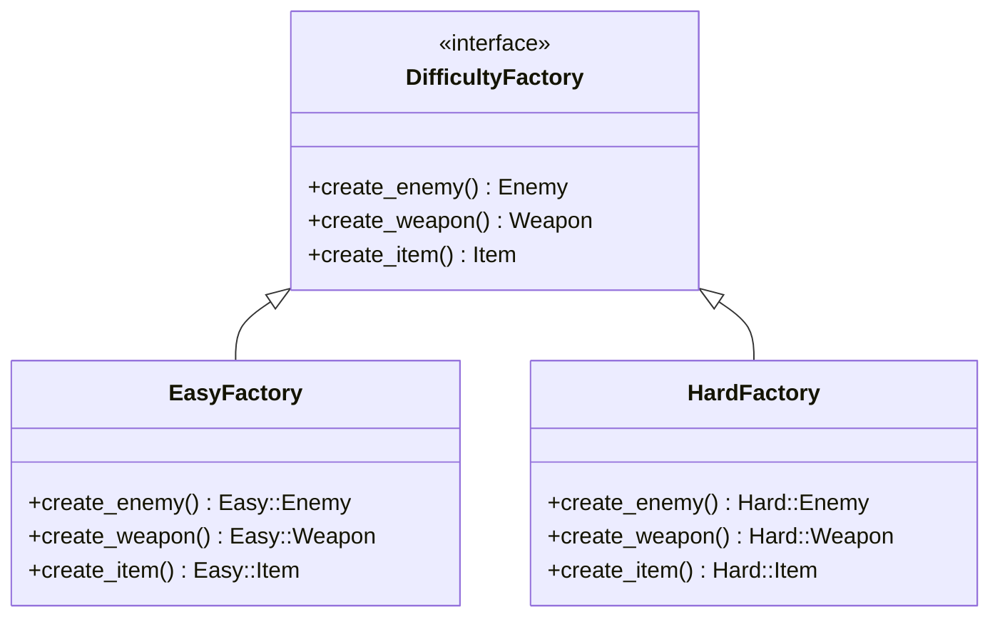

## プロローグ：緊急往診

珍しく日中の呼び出しだった。

「先生、往診依頼です」

助手がスマートフォンを差し出す。画面にはゲーム会社のロゴと、切迫したメッセージが表示されていた。

**「ローグライクの難易度システムが崩壊。リリースまで1週間。修正不能。至急来てほしい」**

私はコートを手に取った。

「行くか」

「私も行きます」

助手が慌てて上着を羽織る。わざわざついてくるとは——私を一人にしたくないのだろうか。それとも、私と一緒にいたいのか。

「……勝手にしろ」

タクシーに乗り込みながら、私は送られてきたスクリーンショットを見た。ユーザーからのバグ報告。

**「Easyモードなのにドラゴンが出る」**  
**「スライムが炎の刀を持っている」**  
**「難易度を変えてもドロップアイテムが変わらない」**

製品ファミリーの不整合。最悪のパターンだ。

---

## 第1章：現場検証

ゲーム会社のオフィスは戦場だった。

モニターには赤いエラーログ。プログラマーたちは青い顔でキーボードを叩いている。その中心で、一人の男が腕を組んで立っていた。

「来てくれたか、ドクター」

がっしりした体格。自信に満ちた目。だが、その奥に焦りが見える。

「リードプログラマーの田中です。ローグライクの難易度システムを担当してます」

「コードを見せろ」

田中氏がモニターを指差した。

```perl
package GameEngine {
    use Moo;
    
    has difficulty => (is => 'ro', required => 1);
    
    sub create_enemy ($self) {
        if ($self->difficulty eq 'easy') {
            return EasyEnemy->new();
        } elsif ($self->difficulty eq 'normal') {
            return NormalEnemy->new();
        } elsif ($self->difficulty eq 'hard') {
            return HardEnemy->new();
        }
        die "Unknown difficulty";
    }
    
    sub create_weapon ($self) {
        if ($self->difficulty eq 'easy') {
            return EasyWeapon->new();
        } elsif ($self->difficulty eq 'normal') {
            return NormalWeapon->new();
        } elsif ($self->difficulty eq 'hard') {
            return HardWeapon->new();
        }
        die "Unknown difficulty";
    }
    
    sub create_item ($self) {
        if ($self->difficulty eq 'easy') {
            return EasyItem->new();
        } elsif ($self->difficulty eq 'normal') {
            return NormalItem->new();
        } elsif ($self->difficulty eq 'hard') {
            return HardItem->new();
        }
        die "Unknown difficulty";
    }
}
```

「俺の設計だ」田中氏が胸を張った。「シンプルで分かりやすいだろう？」

「お前がこれを書いたのか」

「ああ。難易度ごとにif-elseで分岐する。教科書通りだ」

私は田中氏の目を見た。

「重症」

---

## 第2章：隠された病巣

田中氏の顔色が変わった。

「何がだ？　ちゃんと動いてるだろう」

「動いていない。だからユーザーからバグ報告が来ている」

助手が横から口を挟んだ。

「田中さん、ちょっとこのコードを見てもらえますか？」

彼女がモニターの別のファイルを開く。

```perl
# dungeon_generator.pl (別のファイル)
sub generate_dungeon_floor ($difficulty) {
    my $boss = HardEnemy->new();   # 本当は $difficulty を見るべき
    my $treasure = EasyItem->new(); # コピペミス
    return { boss => $boss, treasure => $treasure };
}

# battle_system.pl (また別のファイル)  
sub prepare_battle ($difficulty) {
    my $enemy = NormalEnemy->new(); # 直接生成
    my $weapon = player_weapon();   # これは正しい
    return { enemy => $enemy, weapon => $weapon };
}
```

田中氏の顔が青ざめた。

「これは……俺が書いたんじゃない」

「そうだろう。しかし、お前の設計が**他のプログラマーに具体クラスを直接newさせる**ことを許している」

私はホワイトボードに病名を書いた。

| 症状 | 発生箇所 | 深刻度 |
|------|----------|--------|
| 具体クラス直接生成症 | コード全体に散在 | 重症 |
| 製品ファミリー不整合症 | 難易度とオブジェクトの不一致 | 致命的 |
| 生成ロジック分散症 | 複数ファイルに分散 | 中症 |

「つまりですね」助手が田中氏に向き直った。「GameEngineを経由せずに`HardEnemy->new()`と書けてしまう時点で、設計として破綻しているんです」

「誰かが間違えれば、EasyモードにHard敵が出る。これが**製品ファミリー不整合症**」

田中氏は黙り込んだ。

---

## 第3章：処方箋の提示

「治療法はある」

私はペンを取った。

「Abstract Factory」

「アブストラクト……何だと？」

「製品ファミリーを一括で生成し、**組み合わせの整合性を構造的に保証する**パターン」



「EasyFactoryからはEasy製品しか生まれない。Hard製品が混入する**余地がない**」

田中氏が食い入るようにホワイトボードを見つめた。

「つまり……`HardEnemy->new()`を直接書けなくする、ということか？」

「そうだ。生成はすべてFactory経由。Factoryを差し替えれば、**1行で**難易度が切り替わる」

---

## 第4章：緊急手術

「手術を始める」

私はキーボードを借りた。

### 製品ロールの定義

```perl
package Enemy::Role {
    use Moo::Role;
    has name => (is => 'ro', required => 1);
    has hp   => (is => 'ro', required => 1);
    requires 'attack_power';
}

package Weapon::Role {
    use Moo::Role;
    has name => (is => 'ro', required => 1);
    has atk  => (is => 'ro', required => 1);
}

package Item::Role {
    use Moo::Role;
    has name   => (is => 'ro', required => 1);
    has effect => (is => 'ro', required => 1);
}
```

### 製品ファミリーの実装

```perl
package Easy::Enemy {
    use Moo;
    with 'Enemy::Role';
    has '+name' => (default => 'スライム');
    has '+hp'   => (default => 30);
    sub attack_power { 5 }
}

package Easy::Weapon {
    use Moo;
    with 'Weapon::Role';
    has '+name' => (default => '木の剣');
    has '+atk'  => (default => 10);
}

package Easy::Item {
    use Moo;
    with 'Item::Role';
    has '+name'   => (default => '薬草');
    has '+effect' => (default => '20回復');
}
```

### Abstract Factoryロール

```perl
package DifficultyFactory::Role {
    use Moo::Role;
    requires qw(create_enemy create_weapon create_item difficulty_name);
}
```

### 具象Factory

```perl
package EasyFactory {
    use Moo;
    with 'DifficultyFactory::Role';
    
    sub difficulty_name { 'EASY' }
    sub create_enemy  { Easy::Enemy->new()  }
    sub create_weapon { Easy::Weapon->new() }
    sub create_item   { Easy::Item->new()   }
}

package HardFactory {
    use Moo;
    with 'DifficultyFactory::Role';
    
    sub difficulty_name { 'HARD' }
    sub create_enemy  { Hard::Enemy->new()  }
    sub create_weapon { Hard::Weapon->new() }
    sub create_item   { Hard::Item->new()   }
}
```

### 新しいGameEngine

```perl
package GameEngine {
    use Moo;
    
    has factory => (
        is       => 'ro',
        required => 1,
        isa      => sub {
            die "DifficultyFactory::Role required"
                unless $_[0]->does('DifficultyFactory::Role');
        },
    );
    
    sub create_enemy  ($self) { $self->factory->create_enemy  }
    sub create_weapon ($self) { $self->factory->create_weapon }
    sub create_item   ($self) { $self->factory->create_item   }
}
```

田中氏が息を呑んだ。

「if-elseが……消えた」

「難易度切り替えはこうなる」

```perl
# Easyモード
my $game = GameEngine->new(factory => EasyFactory->new());

# Hardモード（Factoryを差し替えるだけ）
my $game = GameEngine->new(factory => HardFactory->new());
```

---

## 第5章：術後検証

「他のファイルはどうする？」田中氏が聞いた。「dungeon_generator.plとか」

「Factory経由に書き換える。そうすれば**直接newできなくなる**」

```perl
# dungeon_generator.pl (修正後)
sub generate_dungeon_floor ($factory) {
    my $boss = $factory->create_enemy();     # Factory経由
    my $treasure = $factory->create_item();  # Factory経由
    return { boss => $boss, treasure => $treasure };
}
```

「これで`HardEnemy->new()`と書こうとしても——」

「コードレビューで弾く。Factoryを使わない生成は禁止というルールを徹底する」

助手がノートに何か書いている。私の仕事ぶりを記録しているのだろうか。彼女はよく私を観察している気がする。意識しているのか。

「……何を書いている」

「えっ？　あ、いえ、先生のお話をメモしてるだけですよ」

彼女は慌てて視線を逸らした。やはり——

「田中さん」助手が話題を変えた。「新しい難易度を追加するときはどうなると思いますか？」

田中氏は少し考えて答えた。

「……Factoryを1つ追加するだけ、か？」

「正解」

---

## 第6章：拡張性の確認

「試してみろ」

田中氏がキーボードに向かった。

```perl
# Nightmare難易度を追加
package Nightmare::Enemy {
    use Moo;
    with 'Enemy::Role';
    has '+name' => (default => 'カオスドラゴン');
    has '+hp'   => (default => 500);
    sub attack_power { 100 }
}

package Nightmare::Weapon {
    use Moo;
    with 'Weapon::Role';
    has '+name' => (default => '神殺しの剣');
    has '+atk'  => (default => 150);
}

package Nightmare::Item {
    use Moo;
    with 'Item::Role';
    has '+name'   => (default => '賢者の石');
    has '+effect' => (default => '全回復+復活');
}

package NightmareFactory {
    use Moo;
    with 'DifficultyFactory::Role';
    
    sub difficulty_name { 'NIGHTMARE' }
    sub create_enemy  { Nightmare::Enemy->new()  }
    sub create_weapon { Nightmare::Weapon->new() }
    sub create_item   { Nightmare::Item->new()   }
}
```

「GameEngineには……」

「一切触れていない」

田中氏の目が輝いた。

「Open-Closed Principleか！　拡張に開いて、修正に閉じている！」

```text
=== NIGHTMARE モード ===
敵: カオスドラゴン (HP:500)
武器: 神殺しの剣 (ATK:150)
回復: 賢者の石 (全回復+復活)
```

---

## 第7章：退院指導

私は処方箋をまとめた。

### Before/After比較

| 指標 | Before | After |
|------|--------|-------|
| 難易度切り替え時の修正箇所 | 100+箇所 | 1箇所 |
| 製品ファミリー不整合 | 発生可能 | 構造上不可能 |
| if/else数 | 9個 | 0個 |
| 新難易度追加工数 | 50行+既存修正 | 10行1ファイル |

### 処方上の注意

「ただし」

私は最後に付け加えた。

| 注意点 | 詳細 |
|--------|------|
| クラス数増加 | ファミリー数 × 製品種類数のクラスが必要 |
| 新製品種追加は重い | 例えば「防具」を追加すると全Factoryに改修が発生 |
| 過剰適用禁止 | 製品が1種類ならFactory Methodで十分 |

田中氏が頭を下げた。

「ありがとう、ドクター。リリースに間に合いそうだ」

「感謝は、このコードに」

---

## エピローグ：帰路

タクシーの中で、助手が呟いた。

「先生、今日の往診は珍しかったですね」

「出向くことも必要だ。現場でしかわからないことがある」

「……先生が出向いてくれたこと、田中さん喜んでましたよ」

私は窓の外を見た。夕暮れの街並みが流れていく。

「先生」

「何だ」

「私が一緒に来た理由、わかりますか？」

心臓が跳ねた。やはり彼女は——

「田中さんの会社、お母さんの常連さんがIT部門にいるんです。昔ネイルやってた頃の。ちょっと様子見たくて」

「……そうか」

私は視線を逸らした。

窓に映る自分の顔が、少しだけ赤く見えた気がした。

---

## 処方箋まとめ

### Abstract Factoryパターンの適用基準

| 症状 | 適用すべき | 経過観察 |
|------|-----------|----------|
| 製品が複数種類ある | ✓ | |
| 製品間の組み合わせ整合性が重要 | ✓ | |
| ファミリーが今後増える可能性 | ✓ | |
| 製品が1種類だけ | | ✓（Factory Method推奨） |
| 製品種が頻繁に増える | | ✓（全Factory改修リスク） |

### 処方の手順

1. 製品ロール（インターフェース）を定義
2. 製品ファミリーごとに具象製品クラスを実装
3. Abstract Factoryロールを定義
4. ファミリーごとに具象Factoryを実装
5. クライアントにFactoryを依存注入

---

**次回予告：コードドクター〜Observer依存症の治療**

「イベントが発生するたびにループで全オブジェクトに通知？……重症だ」
