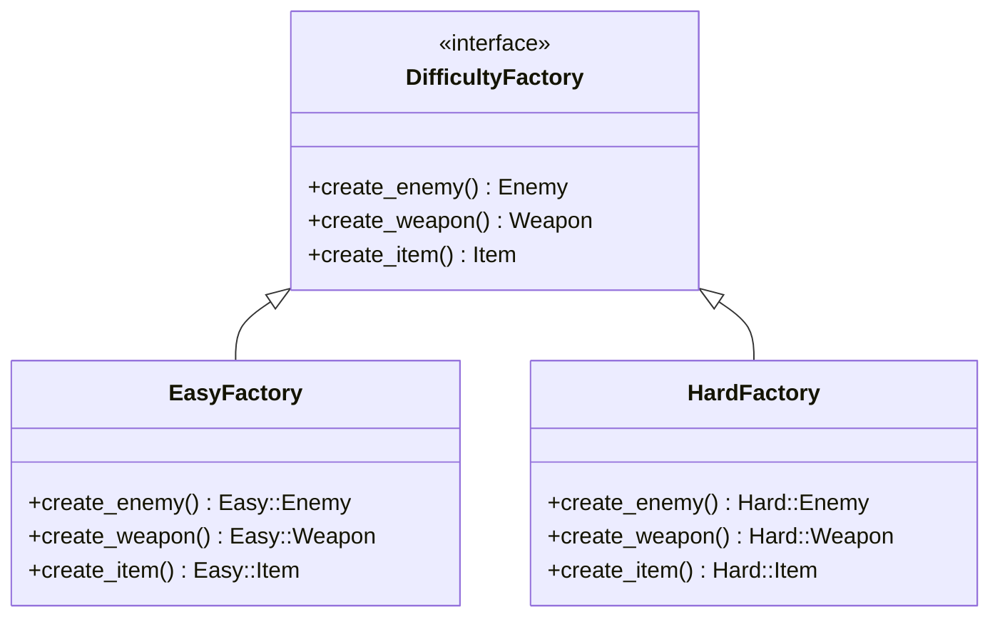

## 往診

リリースまであと1週間。私のデスマーチは、絶望的なバグ報告で彩られていた。

**「Easyモードなのにドラゴン（Hard敵）が出る」**
**「スライムが炎の刀（Hard武器）を持っている」**
**「難易度を変えてもドロップアイテムが変わらない」**

私はタナカ。このローグライクゲームのリードプログラマーだ。「シンプルで分かりやすい設計」を目指してif文で分岐を書いたはずが、気づけばコードは複雑骨折を起こしていた。

「もう……無理だ」

修正しても修正しても、別の場所で不整合が起きる。徹夜続きの頭が霞む。
噂に聞いた「コードドクター」の連絡先を、震える指で押したのはその時だった。

「……往診をお願いします。緊急です」

1時間後、オフィスのドアが開いた。

現れたのは、黒いコートを羽織った無口な男と、大きな救急箱を持った女性だった。

---

## 触診

「ここね、うわぁ……空気が淀んでる」

女性――助手が、まるで剥げかけたネイルを見るように眉をひそめた。
一方、ドクターと呼ばれた男は、無言で私のPCに向かう。その威圧感に、私は固唾をのむ。

「こ、これが問題のコードです」

ドクターはモニターを凝視する。その瞳は、コードの行間にある闇を見透かすようだ。

```perl
package GameEngine {
    use Moo;
    
    has difficulty => (is => 'ro', required => 1);
    
    sub create_enemy ($self) {
        if ($self->difficulty eq 'easy') {
            return EasyEnemy->new();
        } elsif ($self->difficulty eq 'normal') {
            return NormalEnemy->new();
        } elsif ($self->difficulty eq 'hard') {
            return HardEnemy->new();
        }
        die "Unknown difficulty";
    }
    
    sub create_weapon ($self) {
        if ($self->difficulty eq 'easy') {
            return EasyWeapon->new();
        } elsif ($self->difficulty eq 'normal') {
            return NormalWeapon->new();
        } elsif ($self->difficulty eq 'hard') {
            return HardWeapon->new();
        }
        die "Unknown difficulty";
    }
    
    # ... create_item も同様のif分岐 ...
}
```

沈黙が続く。私が耐えきれず口を開こうとしたその時、ドクターが短く呟いた。

「……雑音 (Noise)。」

「え？」

すかさず助手が横から解説する。

「『条件分岐のノイズが多すぎて、本質が見えない』と仰っています。タナカさん、これ、毎回if文で判断してるんですか？ まるで指一本一本に違う色のマニキュアを塗ろうとして、全部混ざって汚くなっちゃったみたい」

「い、いや、単純な分岐の方が分かりやすいと思って……」

ドクターは聞く耳を持たず、別のファイルを開いた。

```perl
# dungeon_generator.pl (別のファイル)
sub generate_dungeon_floor ($difficulty) {
    # コピペミスでHardEnemyが固定されている
    my $boss = HardEnemy->new();   
    my $treasure = EasyItem->new(); 
    return { boss => $boss, treasure => $treasure };
}
```

ドクターの目が鋭くなった。

「……混合 (Mix)。」

「あっ、それはまた別の担当者が書いたやつで……！」

ドクターは私を一瞥もせず、静かに宣告した。

「重症 (Critical)。」

---

## 画像診断

ドクターはホワイトボードに向かい、流れるような筆致で病名を書いた。

**「製品ファミリー不整合症候群」**

「説明しましょう」

助手が指示棒を取り出した。よく見ると、それはネイル用のプッシャーだ。

「タナカさんのコードには、致命的な欠陥があります。 **『具体的なクラス名（EasyEnemyなど）』を、コードのあちこちで直接 `new` してしまっている** ことです」

「newしちゃいけないんですか？」

「ええ。直接 `new` するということは、その場所に『どのクラスを使うか』という判断ロジック（if文）が必要になるということです。その判断が100箇所に散らばっていたら？」

「100箇所すべてで、if文を間違えないように書かないといけない……」

「その通りです。そして今回、見事にマニキュアを塗り間違えましたね。EasyモードなのにHardの敵が出たりするのは、 **関連し合う製品（敵・武器・アイテム）の統一感（ファミリー）** が保証されていないからです」

ドクターが、ボソリと言った。

「……汚染。」

「はい、ドクターの仰る通りです。『Easyの敵』には『Easyの武器』を持たせなきゃいけないのに、誰かがうっかり『Hardの武器』をnewしてしまう。それを防ぐ強制力が、今の設計にはありません」

私は膝から崩れ落ちそうになった。

「じゃあ、全部のif文をチェックして回るしか……」

「いいえ」ドクターが遮った。「根絶 (Eradication)。」

---

## 処方箋

ドクターがホワイトボードに新たな図を描き始めた。

**「Abstract Factory」**



「これは……？」

「工場（Factory）です」助手がニッコリと笑う。「バラバラに製品を作るんじゃなくて、『Easy製品一式を作る工場』と『Hard製品一式を作る工場』を用意するんです。有名ブランドのコフレセットを買えば、色も雰囲気も統一されてるでしょ？ あれと同じです」

ドクターが図の `EasyFactory` を指差す。

「……純粋 (Pure)。」

「なるほど！ 工場ごと切り替えてしまえば、Hardの敵が混ざるなんてことは……」

「……不可能 (Impossible)。」

ドクターの言葉には、絶対的な響きがあった。

---

## 外科手術

「オペ (Operation)。」

ドクターが私のキーボードを叩き始めた。その速度は異様だった。まるで指先がキーを見ずに踊っているようだ。

### 手順1: 製品の規格化（Roleの定義）

「まずは爪の形を整える下準備です」助手が解説する。「製品たちが共通して持つべき特徴を定義します」

```perl
package Enemy::Role {
    use Moo::Role;
    has name => (is => 'ro', required => 1);
    has hp   => (is => 'ro', required => 1);
    requires 'attack_power';
}

# Weapon::Role, Item::Role も同様に定義
```

この時、ドクターの手がふと止まった。私は咄嗟に、手元にあったアイスコーヒーを差し出した。
「あ、どうぞ。喉渇きますよね」

ドクターは一瞬動きを止め、コーヒーを受け取る前に、なぜか手櫛で髪を整え、ふっ、と鼻で笑った。
まるで「俺の実力に見惚れたか」とでも言いたげな、妙に満足げな表情だ。

（……え？ 何今の？）

私が困惑していると、助手は何事もなかったかのように私の手からコーヒーを取り、ドクターのデスクの端に置いた。
「ドクター、続きを」
「……あぁ。」
ドクターは少し気まずそうに、しかしすぐに鋭い目つきに戻ってキーボードを叩き始めた。

### 手順2: 専門工場の建設（Factoryの実装）

```perl
# --- 抽象工場（規格） ---
package DifficultyFactory::Role {
    use Moo::Role;
    requires qw(create_enemy create_weapon create_item difficulty_name);
}

# --- Easy専門工場 ---
package EasyFactory {
    use Moo;
    with 'DifficultyFactory::Role';
    
    sub difficulty_name { 'EASY' }
    # ここが重要：Easyシリーズしかnewしない！
    sub create_enemy  { Easy::Enemy->new()  }
    sub create_weapon { Easy::Weapon->new() }
    sub create_item   { Easy::Item->new()   }
}

# --- Hard専門工場 ---
package HardFactory {
    use Moo;
    with 'DifficultyFactory::Role';
    
    sub difficulty_name { 'HARD' }
    sub create_enemy  { Hard::Enemy->new()  }
    sub create_weapon { Hard::Weapon->new() }
    sub create_item   { Hard::Item->new()   }
}
```

「見てください」助手が指差す。「EasyFactoryの中には、Easy製品しかありません。これなら、新人がどう頑張ってもHard製品を混入させることはできませんよね？」

### 手順3: クライアントの治療（GameEngineの修正）

「そして、GameEngineからあの醜いif文を除去します」

```perl
package GameEngine {
    use Moo;
    
    # 難易度文字列ではなく、工場そのものを受け取る
    has factory => (
        is       => 'ro',
        required => 1,
        isa      => sub {
            die "DifficultyFactory::Role required"
                unless $_[0]->does('DifficultyFactory::Role');
        },
    );
    
    # 委譲するだけ。if文は消滅した。
    sub create_enemy  ($self) { $self->factory->create_enemy  }
    sub create_weapon ($self) { $self->factory->create_weapon }
    sub create_item   ($self) { $self->factory->create_item   }
}
```

ドクターがエンターキーを強く叩いた。

「……摘出 (Extraction)。」

---

## 術後経過

私は呆然と画面を見つめた。あのスパゲッティのように絡まっていたif文の山が、跡形もなく消えている。

「使い方はこうなります」助手がさらさらとコードを書く。

```perl
# Easyモードで開始
my $game_easy = GameEngine->new(factory => EasyFactory->new());

# Hardモードで開始（工場を差し替えるだけ）
my $game_hard = GameEngine->new(factory => HardFactory->new());
```

「これだけ……？ これだけで、敵も武器もアイテムも、全部正しく切り替わるんですか？」

「ええ。Factoryという『一式セット』を渡す契約にしたので、個々の整合性を気にする必要はもうありません」

ドクターが、私の散らかったデスクにあった書きかけの仕様書――「Nightmareモード追加予定」というメモ――に目を留めた。

「……拡張 (Extension)。」

「あ、はい。でも今のコードじゃ無理だと諦めてて……」

「……試行を (Try)。」

ドクターに促され、私は恐る恐るキーボードに触れた。Factoryを一つ追加してみる。

```perl
package NightmareFactory {
    use Moo;
    with 'DifficultyFactory::Role';
    # Nightmareシリーズを返すだけ
    sub create_enemy  { Nightmare::Enemy->new()  }
    # ...
}
```

GameEngine側には **1行も触れる必要がなかった** 。ただ新しい工場を作り、それを渡すだけ。

「すごい……！ 既存コードを壊す恐怖がない！」

「……OCP。」

ドクターが短く言った。私が首を傾げると、助手が補足する。

「 **Open-Closed Principle（開放閉鎖の原則）** です。機能の追加には開かれていて（＝Factoryを足せる）、修正には閉じている（＝GameEngineを直す必要がない）。ジェルネイルの上からトップコートを塗り直すみたいに、土台を傷つけずに輝きを足せるんです」

ドクターは満足げに頷くと、私の肩をポンと叩いた。……叩いたというより、手に持っていたゴミ（if文の残骸？）を払ったような動作だったが、表情は晴れやかだった。

---

## 退院指導

ドクターは帰り支度を始めた。

「待ってください！ お礼は……！」

私が財布を取り出そうとすると、助手が優しく制した。

「お金は結構です。その代わり……」

ドクターが背中越しに言った。

「……コミットを (Commit)。」

「え？」

「 **今後、具体クラスの `new` を直接書かないこと** 。全ての生成はFactoryを通すこと。そのルールをチームに徹底させること。それがドクターへの報酬です」

私は背筋を伸ばし、強く頷いた。

「はい！ 約束します！」

二人が去った後のオフィスで、私は生まれ変わったコードを見つめていた。
静かだ。ログのエラー通知音も止んだ。

画面上のテスト結果が、すべて緑色（PASS）に変わった。
私は深く息を吐き、呟いた。

「感謝は、このコードに」

……あれ？ これ、誰かの口癖だったかな。

---

## 処方箋まとめ

### Abstract Factoryパターンの適用基準

| 症状 | 適用すべき | 経過観察 |
|------|-----------|----------|
| 製品が複数種類ある（敵、武器、アイテム etc.） | ✓ | |
| **製品間の組み合わせ整合性** が重要 | ✓ | |
| ファミリー（難易度、OS、スキン等）が増える可能性がある | ✓ | |
| 製品が1種類だけ | | ✓（Factory Method推奨） |
| 製品種自体が頻繁に増える（防具、魔法、乗り物...） | | ✓（全Factory改修リスク大） |

### 治療のステップ
1.  **製品ロール（インターフェース）を定義**: 何を作るべきか明確にする。
2.  **Abstract Factoryロールを定義**: 工場が満たすべき契約を決める。
3.  **具体的な工場（Concrete Factory）を実装**: ファミリーごとの専用工場を作る。
4.  **クライアントに工場を注入**: `new` を直接呼ばず、工場経由で生成する。
