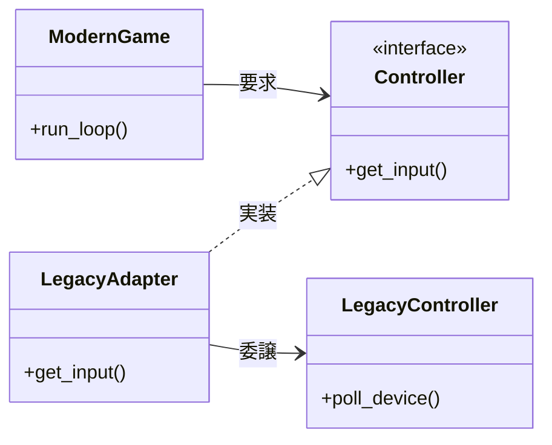

「先生！ 急患です！」

深夜のオフィス街。かつてネイルサロンだった看板を黒く塗りつぶした「コード診療所」のドアを、私は肩で押し開けた。
手には、実家の押し入れから発掘されたプラスチックの塊――変色した「伝説のコントローラー」が握りしめられている。

「こ、これが……最新のゲームエンジンで動かないんです！ プラグの形状が……ビット配列が……どうしても合わないんです！」

私はネイル施術用のリクライニングチェアに崩れ落ちた。
徹夜続きで焦点の定まらない視線の先で、白衣の男――コードドクターが、無言でカルテ（ソースコード）を開く。
その隣では、ナース服の助手が慣れた手つきでアロマの香るおしぼりを差し出してくれた。

「ビットが、ビットが合わない……ドライバも書けない……」

私のうわ言を聞きながら、ドクターがディスプレイを睨む。
青白いUVライトの光が、彼の鋭い横顔を照らし出した。

「……『インターフェース不適合症』」

低く、短いその一言が、静寂を切り裂いた。

「はい、そのようですね」
助手がにっこりと微笑み、私に向き直る。
「ドクターはこう仰っています。『使いたいクラスと、必要なインターフェースが一致していない』と。よくある接続トラブルですので、ご安心ください」

「先生、これは……治るんですか？」

ドクターは私を見ることなく、白衣を翻してホワイトボードに向かった。

「手術」

キュキュッ、とマーカーが走る。

「**Adapter**」

---

## 問診：押し入れからの来訪者

### 伝説のコントローラー

私が持ち込んだコードは、時代を感じさせるビット演算の塊だった。

```perl
# --- 伝説のコントローラー（レガシー） ---
package LegacyController {
    use Moo;
    
    # 0x01: Aボタン(攻撃)
    # 0x02: Bボタン(ジャンプ)
    sub poll_device {
        my ($self) = @_;
        # シミュレーション用にランダムな入力を返す
        # 実機ではデバイスドライバを叩くような処理
        return 0x02; 
    }
}
```

「シンプル……いえ、無骨なコードですね」
助手がモニターを磨きながら言う。

「生データ」
ドクターがポツリと漏らす。

「ええ。ドクターの仰るとおり『生のビット列をそのまま返している』状態です。融通が利きません」

一方、私が開発中の最新ゲームエンジンは、ネイルアートのように洗練されたインターフェースを要求していた。

```perl
# --- 1. インターフェース定義 ---
package Controller {
    use Moo::Role;
    requires 'get_input';
}
```

「`Controller` ロール。つまり `get_input` メソッドを持ち、構造化されたデータを返すオブジェクトしか受け付けない仕様です」
助手が解説してくれる。「ですが、お持ちの `LegacyController` にあるのは `poll_device` だけ。これでは会話が成立しません。まるで、日本語しか話せない観光客と、英語しか話せない店員さんのようです」

---

## 診断：無理やりな接続

### 動く：最初の実装

私は震える手で、ゲームエンジンに直接繋ごうとした痕跡を見せた。

```perl
# --- 4. メイン処理（問題あり） ---
package main;

# 接続しようとするが...
my $legacy_pad = LegacyController->new;

# エラー: ModernGameはControllerロールを持つオブジェクトを期待している
# my $game = ModernGame->new(controller => $legacy_pad); 
```

### 破綻：拒絶反応

「コンパイルすら通りません……！ 無理やり押し込もうとすると、型エラーで弾かれるんです」
「当然」

ドクターの一言は冷徹だった。私は縋るように提案する。
「じゃあ、`LegacyController` を書き換えて、`Controller` ロールを実装すれば……この古いコードの方をいじって……」

「**愚行**」

ドクターの放った言葉が、鋭いメスのように空気を裂いた。私はびくりと肩を震わせる。

「あの、患者さん」
助手が慌ててフォローに入る。「ドクターは怒っているわけではないんです。ただ、『**レガシー統合困難症**を併発させる気か』と心配していて……あ、いえ、少し怒ってるかもしれません」

「既存コードへの変更」
ドクターはモニターを指さした。

「はい、つまりこういうことです」助手が通訳を続ける。「古いコードは既にテスト済みで、動作実績があります。下手に書き換えれば、他のシステムで副作用が出るかもしれません。ドクターは『自分を変えるな。相手も変えるな』と仰っています」

「じゃあ、どうすれば……自分も相手も変えずに、どうやって繋ぐんですか？」

「間」
ドクターはホワイトボードのマーカーを取った。

「変換器」

---

## 手術：Adapterという名の変換プラグ

### 完成：パターン導入

キュキュッ、とマーカーの音が響く。
書き上がったのは **Adapterパターン** のクラス図だ。



「`LegacyAdapter`……？」

「新しいクラスですね」助手が図を指し示す。「このクラスが『通訳』になります。2つの顔を持つんです」

1.  **外向きの顔**: `Controller` ロールを実装し、最新ゲームエンジンとお話できる。
2.  **内向きの顔**: `LegacyController` を持ち、そのメソッドを知っている。

「実装」

ドクターがキーボードを叩き始めた。その速さは、まるでピアノの速弾きのようだ。

```perl
# --- アダプター（今回の処方箋） ---
package LegacyAdapter {
    use Moo;
    with 'Controller'; # インターフェース適合
    
    # 委譲先（Adaptee）を保持
    has adaptee => (
        is => 'ro',
        required => 1,
    );
    
    sub get_input {
        my ($self) = @_;
        
        # 1. レガシーAPIを呼び出す（ここは古い言葉で話す）
        my $raw_data = $self->adaptee->poll_device;
        
        # 2. 最新APIに変換する（Adapterの責務）
        if ($raw_data & 0x02) {
            return { action => 'jump' }; # ジャンプ信号に変換！
        } elsif ($raw_data & 0x01) {
            return { action => 'attack' }; # 攻撃信号に変換！
        } else {
            return { action => 'wait' };
        }
    }
}
```

「`get_input` の中で `poll_device` を呼んでいます」
助手が画面を覗き込みながら解説する。「生のビットデータ（`0x02`）を、最新エンジンが理解できる `{ action => 'jump' }` に変換する。これがアダプターの仕事です」

「なるほど……！ `LegacyController` 自体には指一本触れていないんですね！」

### 術後の経過

「接続」

```perl
# --- 5. メイン処理（解決版） ---
package main;

# 1. まずレガシーコントローラーを用意（Adaptee）
my $legacy_pad = LegacyController->new;

# 2. アダプターを噛ませる
my $adapter = LegacyAdapter->new(adaptee => $legacy_pad);

# 3. ゲームエンジンにはアダプターを渡す
# （エンジンから見れば、これは立派な "Controller" だ）
my $game = ModernGame->new(controller => $adapter);

print "接続成功: ";
$game->run_loop;
```

実行結果が表示される。

```text
接続成功: ヒーローはジャンプした！
```

「う、動いた……！ 伝説のコントローラーで、最新のキャラがジャンプしました！」
私の顔色は、徹夜明けの土気色から健康的な薔薇色に変わっていくのが自分でもわかった。

「**Object Adapter**」

「継承ではなく『委譲』を使うパターンです」と助手。「元のクラスを汚さずに、新しいインターフェースに適合させる。これがドクターのメス捌きです」

---

## 退院指導：乱用は禁物

手術は成功した。
ドクターは私に向き直り、静かに告げる。

「乱用厳禁」

「えっ？ こんなに便利なのに、使っちゃダメなんですか？」

「設計不備」

助手がすかさず補足する。
「最初から設計がしっかりしていれば、Adapterなんて不要だと申しております。これはあくまで『不整合を解消するための緊急措置』あるいは『再利用のための接着剤』。新品同士のコードを繋ぐのにこれが必要なら、それは設計が腐っている証拠だと」

> [!IMPORTANT]
> **Adapterの使いどころ**
> - **既存クラスの再利用**: ソースコードがない、あるいは修正したくないクラスを利用する場合。
> - **インターフェースの統一**: バラバラなクラス群を、一つの共通インターフェースで扱いたい場合。

「感謝は、このコードに」

ドクターが決め台詞を吐く。私は深々と頭を下げた。
「ありがとうございます！ これで伝説が蘇ります！」

---

## エピローグ

支払いを済ませ（通貨はバグ報告書だった）、帰ろうとしたときだ。
クリニックの隅で、助手が困った顔をしているのが見えた。
手には海外製のヘアアイロンを持っているようだ。

「あれ……コンセントの形状が合いません。海外製のメーカーだから……」

彼女はゴソゴソと引き出しを漁り、一つの変換プラグを取り出した。

「みつけました！ **変換プラグ（アダプター）**です。これがないと、熱い想い（電気）が伝わりませんから」

カチリ、とプラグがハマる音が響く。
私は思わず立ち止まり、ドクターの顔を盗み見た。
彼は無表情でコーヒーを啜っている。

（熱い想い……？）

助手の言葉は、単なる電気の話なのだろうか？
「変換しないと伝わらない」というのは、彼女からドクターへの、遠回しな……いや、かなり直接的なラブコールなのでは！？
今の「幼馴染」というインターフェースでは届かない想いを、「恋人」というインターフェースに変換したいというメタファー！？

「ドクター！？」
私は思わず叫んでいた。「今の、今の言葉の意味、わかってますか！？」

ドクターは私の剣幕に眉を少しだけ動かし、カップを置いた。

「……電圧」

「はい？」

「形状が合っても、電圧（ボルテージ）が違うと爆発する。……注意が必要だ」

彼はそう言って、またコーヒーに口をつけた。

（だ、ダメだこの人……！ 物理層の話しかしてない……！）

私は天を仰いだ。
乙女心のインターフェース仕様書は、どこのCPANにもアップロードされていないらしい。
このクリニックには、まだしばらく通うことになりそうだ。

（次回、Facadeパターンへ続く）

---

### 今回の処方箋（まとめ）

| 項目 | 内容 |
|---|---|
| **症状** | **インターフェース不適合症**、レガシー統合困難症 |
| **治療法** | **Adapterパターン** |
| **効果** | 既存クラスを修正せずに新しいインターフェースに適合させる |
| **副作用** | クラス数が増加する（小さな変換クラスが増える） |
| **用法** | 委譲を用いた Object Adapter が一般的で安全 |

### 次回予告

次回は、スマートホームの複雑怪奇なAPI地獄に迷い込んだ開発者を救出する **Facadeパターン** の緊急手術を行います。お楽しみに。
