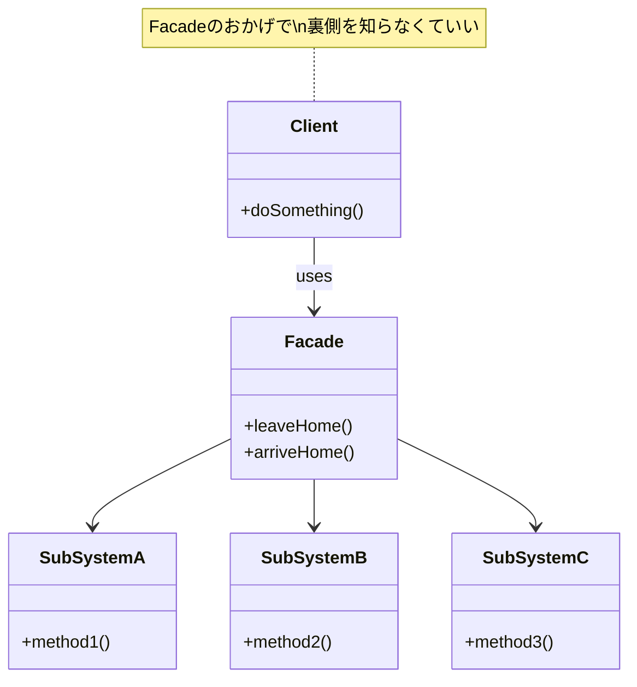

---
categories:
  - 開発
  - デザインパターン
date: 2026-02-16T00:52:11+09:00
draft: true
epoch: 1771170731
image: /favicon.png
iso8601: 2026-02-16T00:52:11+09:00
tags:
  - code-doctor
  - design-patterns
  - facade-pattern
  - perl
  - refactoring
title: コードドクター〜スマートホームAPI地獄緊急手術（Facade）
---

深夜の街に、パトレイバーのサイレンのような不協和音が響き渡る。
私のクリニック「コード診療所」の扉が、荒々しく叩かれた。

「先生、急患です！ スマートホームアプリの開発者さんが、APIの海で溺れかけています！」

助手のナースの声が緊迫している。
私は読みかけの『GoF本』を閉じ、白衣の袖をまくった。

「…通せ」

診察室に運び込まれてきたのは、目の下に深い隈を作ったエンジニアだった。
彼はうわ言のように繰り返している。

「照明のAPIを叩いて…次はエアコンのモードを設定して…エラーハンドリングをして…鍵をかけて…ぐふっ」

私は彼のPCの画面（コード）を覗き込んだ。
そこには、見るも無惨な「スパゲッティ状態」のコードが広がっていた。

<!--more-->

## 診断：サブシステム露出過多症

「これはひどい」

私は思わず呟いた。
患者のコードは、スマートホームを制御するためのUI層（ユーザーインターフェース）のコードだ。
しかし、その中身はデバイス制御の低レベルなAPI呼び出しで埋め尽くされている。

```perl
# --- 悪いコードの例（Before） ---

sub on_leave_button_click {
    my $self = shift;
    print "\n=== 外出ボタンが押されました ===\n";

    # 1. 照明を消す
    # クライアントが「デバイスの詳細」を知りすぎている
    $self->light->turn_off;

    # 2. エアコンを消す
    # 手順がひとつでも抜けるとバグになる
    $self->ac->off;

    # 3. 鍵をかける
    $self->lock->lock;

    print "=> 外出モード完了（手順が複雑すぎる...）\n";
}
```

「先生、これは…？」

助手が不安そうに私の顔を見る。

「**サブシステム露出過多症**だ。UI層が、照明やエアコンといった『臓器（サブシステム）』血管で直結してしまっている」

「サブシステム…露出…過多？ つまり、どういうことですか？」
助手はいつものように、患者にもわかる言葉への翻訳を求めてくる。

「客がレストランの厨房に入り込んで、自分で肉を焼き、野菜を切り、皿を洗っているような状態だ。客（UI）は『美味しい料理（機能）』が欲しいだけなのに、調理工程（API操作）の全てを自分でやらされている」

「ああ、それは大変…。だから、新しいメニュー（機能）が増えるたびに、お客さんが新しい調理法を覚えなきゃいけないんですね」

患者が弱々しく頷く。
「そうなんです…。『おやすみモード』を追加しようとしたら、また照明と鍵と今度は加湿器のAPI仕様書を全部読んで、一からコードを書けと言われて…もう限界です」

私はカルテに素早くペンを走らせた。

「UI層とサブシステムの**密結合**。そしてロジックの**分散**。このままでは、デバイスへの仕様変更があるたびに、アプリ中の全画面が修正対象になるだろう」

問題は明白だ。
1. **複雑さの露出**: クライアントが多数のクラス (`Device::Light`, `Device::AirConditioner` etc.) を直接扱っている。
2. **手順の重複**: 「外出時」に行う一連の手順が、あちこちにコピペされている可能性が高い。
3. **変更への脆弱性**: デバイスのメソッド名が変わったら、全滅する。

## 処方箋：Facade（窓口）パターン

「直ちに手術が必要だ。**Facade（ファサード）パターン**を適用する」

私は棚から新しい設計図（クラス図）を取り出した。

「ふぁさーど…？」
患者が聞き慣れない単語に首を傾げる。

「フランス語で『建物の正面』や『窓口』を意味する言葉です」
助手が優しく解説する。
「複雑なシステムの前に、シンプルな『窓口』を一つ置いてあげるんです。お客さん（UI）はその窓口にお願いするだけで、裏側の複雑なことは全部窓口係がやってくれるようになりますよ」

「つまり…『執事』を雇うということだ」
私は補足した。

「執事？」

「そうだ。お前は今まで、自分で照明を消し、エアコンを切り、鍵を掛けていた。だがこれからは、執事に『行ってきます』と一言告げるだけでいい。あとは執事が全てよしなに計らってくれる」

今回の手術の目的は以下の通りだ。

1. **シンプルな窓口の設置**: `SmartHomeFacade` クラスを作成する。
2. **複雑さの隠蔽**: 複数のデバイス操作を Facade 内部に閉じ込める。
3. **結合度の低減**: UI は Facade だけを知っていれば良くなる。



## 手術執刀：執事の雇用

「メス。…いや、エディタだ」

私はキーボードに向かい、まずは「執事」となるクラスを定義し始めた。

### Step 1: Facadeクラスの定義

「まずは、バラバラだったデバイス達を統括するマネージャーを用意する」

```perl
package SmartHomeFacade {
    use Moo;

    # サブシステム（デバイス）を内部に持つ
    # クライアントからは隠蔽される
    has light => (is => 'ro', default => sub { Device::Light->new });
    has ac    => (is => 'ro', default => sub { Device::AirConditioner->new });
    has lock  => (is => 'ro', default => sub { Device::SmartLock->new });

    # ...メソッドの定義へ続く
}
```

「これで、デバイスのインスタンス管理は彼の仕事になった」

### Step 2: 複雑なシーケンスの隠蔽

「次に、患者を苦しめていた『外出時の儀式』を、このクラスに移殖する」

```perl
    # 外部に提供するシンプルなインターフェース

    sub leave_home {
        my $self = shift;
        print "--- Facade: 外出シーケンス開始 ---\n";
        
        # 複雑な手順はFacadeが引き受ける
        # 順番やエラー処理もここで一元管理できる
        $self->light->turn_off;
        $self->ac->off;
        $self->lock->lock;
        
        print "--- Facade: 外出準備完了 ---\n";
    }

    sub arrive_home {
        my $self = shift;
        print "--- Facade: 帰宅シーケンス開始 ---\n";
        
        # 帰宅時は逆に、快適な状態を作る
        $self->lock->unlock;
        $self->light->turn_on;
        $self->light->set_brightness(100);
        $self->ac->on; # エアコンも自動で
        $self->ac->set_mode('warm');
        $self->ac->set_temp(24);
        
        print "--- Facade: おかえりなさい ---\n";
    }
```

「わあ、具体的ですね！」
助手目を見張る。「これなら、『冬の帰宅モード』とか『夏の帰宅モード』とか、季節ごとの細かい調整もこの中だけで完結できそうです」

「その通り。UI側は『帰宅した』という事実だけを伝えればいい。中がどうなっているかは知る必要がない」

### Step 3: クライアントコードの縫合

「最後に、UI側のコードを修正する。ここが一番の激痛（リファクタリング）ポイントだが…耐えてくれ」

私は患者のコードを容赦なく削除し、たった数行に書き換えた。

```perl
# --- 良いコード（After） ---

package SmartHomeApp {
    use Moo;

    # 依存するのはFacadeのみ！デバイスのことは知らなくていい
    has home_api => (is => 'ro', default => sub { SmartHomeFacade->new });

    sub on_leave_button_click {
        my $self = shift;
        print "\n=== 外出ボタンが押されました ===\n";
        
        # たった1行！
        # 「行ってきます」と告げるだけ
        $self->home_api->leave_home;
        
        print "=> UI処理完了\n";
    }
}
```

## 術後経過：疎結合による快復

コンパイルが通り、テストが走る。
`1..4 ok`。オールグリーンだ。

「嘘みたいだ…」
患者が呟く。「あんなにごちゃごちゃしていたコードが、こんなにスッキリするなんて」

「これが『疎結合』の効果です」
助手が温かいコーヒーを患者に手渡す。「あなたのアプリ（UI）と、デバイスたちの間に距離ができたことで、お互いが自由に動けるようになったんですよ」

### 治療の成果

1. **可読性の向上**: UIコードが「何をしているか（What）」だけを記述するようになり、「どうやるか（How）」が消えた。
2. **変更容易性**: もし新しいスマートデバイスを追加したくなっても、修正するのは `SmartHomeFacade` クラス一箇所だけで済む。
3. **再利用性**: 他の画面（ウィジェットや音声操作など）からも、この `leave_home` メソッドを呼ぶだけで同じ機能が使える。

## 退院指導：その窓口を「神」にするな

「ありがとう先生！ これならいくらでも機能追加できそうです！」
患者は元気よく立ち上がった。

私は釘を刺しておかねばならない。

「待て。ひとつだけ忠告がある」

「はい？」

「Facadeを作りすぎると、今度はFacade自体が巨大化し、何でも知っている**『神クラス（God Class）』**になってしまう危険性がある」

「神クラス…？」

「執事に仕事をさせすぎるな、ということだ。もし機能が増えすぎて Facade が太りすぎたら、オーディオ担当のFacade、セキュリティ担当のFacadeというふうに、窓口を分割することを検討しろ」

「それと」私は付け加えた。「Facade はあくまで『便利な窓口』だ。もし、ドライバーの細かい設定の微調整など、高度な機能が必要な場合は、Facade を通さずにサブシステムを直接叩くことを禁止してはいけない。Facade は『簡易化』のためであり、『制限』のためではないからな」

「はい、肝に銘じます！」
患者は深々と頭を下げ、軽やかな足取りで帰っていった。
きっと今夜は、彼自身の「おやすみモード」も正常に動作することだろう。

## エピローグ

静寂が戻った診療所。
助手がコーヒーのカップを片付けている。

「ふう、今夜もいい手術でしたね、先生」

「ああ。…だが」
私はふと気配を感じて振り返る。
助手が、空になった私のマグカップを手に取り、少し悲しげな目で見つめていた。

「…先生の『複雑さ』は、私が直接翻訳しないと誰も理解できませんから。Facadeで隠すよりも、私が手作業で捌くしかありませんね」
彼女はそう呟くと、やれやれといった表情で給湯室へ消えていった。

（…？ 私を独占したいという意味か？ 手作業で…？）

彼女が何を言わんとしているのか、私にはさっぱりわからなかった。
女心というサブシステムの仕様書は、どこのリファレンスにも載っていないのだから。

「感謝は、このコードに」

私は誰にともなくそう呟き、再び『GoF本』を開いた。

---

> **Design Pattern Keyword**
>
> **Facade Pattern**: 複雑なサブシステム一式に対し、統合されたインターフェースを提供する。システム間の結合度を下げ、使いやすくする「窓口」の役割を果たす。

