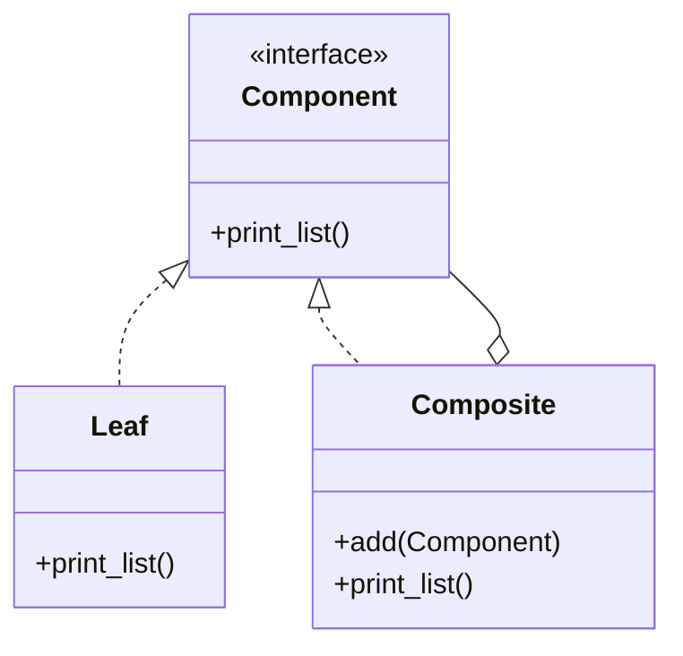

## 導入：深夜の来訪者

深夜2時。コード診療所のドアが激しく叩かれた。

「先生！ 助けてください！ フォルダの深さが…深さがわからなくて！」

飛び込んできたのは、Webサービス企業でサーバサイドエンジニアをしているカスミだ。徹夜続きなのだろう、目の下の隈が濃い。彼女は震える手でラップトップをカウンターに置いた。

カウンターの奥では、白衣を纏った男――**コードドクター**が、無言でモニターを見つめていた。彼の指はキーボードの上で止まっている。

「落ち着いてください、カスミさん」

私の声に、カスミはハッと顔を上げた。私はこの診療所のナース（助手）。かつてネイルサロンだったこの場所で、今はコードの不調を訴える迷えるプログラマたちを迎えている。

「ここ、見てください…ファイルシステムを表示するだけの機能なんですけど…」

カスミが指差した画面には、条件分岐の嵐が吹き荒れていた。

## Phase 1: 緊急搬送（現状の確認）

### 主訴：終わらないif文と再帰

「最初はよかったんです。でも、フォルダの中にフォルダが入って、そのまた中にファイルがあって…それを全部表示しようとしたら、コードがこんなことに！」

```perl
#!/usr/bin/env perl
use v5.36;
use warnings;

# --- 症状: 部分-全体表現不統一症 ---
# ファイルとフォルダを別々のものとして扱っているため、
# 利用側（クライアント）で型チェックと分岐が必要になっている。

# ファイルクラス（葉）
package MyFile {
    use Moo;
    has name => (is => 'ro', required => 1);
}

# フォルダクラス（枝）
package MyFolder {
    use Moo;
    has name => (is => 'ro', required => 1);
    has items => (is => 'rw', default => sub { [] });

    sub add {
        my ($self, $item) = @_;
        push @{$self->items}, $item;
    }
}

package main;

# ファイルシステムの構築
my $root = MyFolder->new(name => 'root');
my $bin  = MyFolder->new(name => 'bin');
my $tmp  = MyFolder->new(name => 'tmp');
my $usr  = MyFolder->new(name => 'usr');

$root->add($bin);
$root->add($tmp);
$root->add($usr);

$bin->add(MyFile->new(name => 'vi'));
$bin->add(MyFile->new(name => 'latex'));

$usr->add(MyFile->new(name => 'nobu'));

# 複雑な再帰処理（ここが問題！）
sub print_structure {
    my ($item, $level) = @_;
    $level //= 0;
    my $indent = "  " x $level;

    # 型によって処理を分岐させている
    if ($item->isa('MyFile')) {
        say "$indent- " . $item->name;
    }
    elsif ($item->isa('MyFolder')) {
        say "$indent+ " . $item->name;
        
        # フォルダなら中身をループして再帰呼び出し
        foreach my $child (@{$item->items}) {
            print_structure($child, $level + 1);
        }
    }
    else {
        warn "Unknown item type";
    }
}

say "--- Before: if文による分岐 ---";
print_structure($root);
```

「`isa` で型をチェックして、フォルダならループして、ファイルなら表示して…。新しい種類のエントリ、例えば『ショートカット』とかを追加しようとしたら、また `elsif` を追加しなきゃいけないんです」

カスミは頭を抱えた。

ドクターが、ゆっくりと椅子を回転させてこちらを向いた。その鋭い視線が、モニターのコードを射抜く。

「……区別しすぎだ」

低い声。それだけ言って、ドクターは再びモニターに向き直った。

「えっ？ 区別…？」カスミが戸惑う。

私はすかさず補足する。「先生はこう仰ってます。『**部分-全体表現不統一症**』だと。つまり、ファイル（葉）とフォルダ（枝）を、全く別の生き物として扱いすぎているのが原因です」

## Phase 2: 精密検査（Compositeパターンの処方）

ドクターがホワイトボードにマーカーを走らせる。

「同一視しろ」

そこに描かれたのは、シンプルなクラス図だった。



「これは…？」

「**Compositeパターン**です」私は解説を続ける。「カスミさんのコードの問題点は、使う側（クライアント）が『今扱っているのがファイルなのかフォルダなのか』を気にしすぎていることです。でも、利用者から見れば、どちらも『ファイルシステムのエントリ』ですよね？」

「あ…確かに。エクスプローラーで見れば、アイコンが違うくらいで…」

「そうです。だから、共通のインターフェースを持たせて、**中身が何であれ同じように扱える**ようにするんです。これを『再帰的構造の同一視』と呼びます」

ドクターが無言でキーボードを引き寄せた。手術の開始だ。

## Phase 3: 外科手術（実装）

「まずは共通の契約書を作る」

ドクターの指が高速で動き、Perlのモジュールが生成されていく。

### Step 1: 共通インターフェースの定義

```perl
# 共通インターフェース（Component）
package FileSystemEntry {
    use Moo::Role;
    requires 'print_list';
}
```

「これが『Component』です。ファイルもフォルダも、このロール（役割）を持つことにします」

### Step 2: 葉（Leaf）の実装

```perl
# ファイルクラス（Leaf）
package MyFile {
    use Moo;
    with 'FileSystemEntry';
    
    has name => (is => 'ro', required => 1);

    sub print_list {
        my ($self, $level) = @_;
        $level //= 0;
        my $indent = "  " x $level;
        # 自分自身の表示だけに関心を持つ
        say "$indent- " . $self->name;
    }
}
```

「ファイルクラスは、単に自分の名前を表示するだけ。シンプルですね」

### Step 3: 枝（Composite）の実装

「次はフォルダだ。ここが肝心だ」ドクターが呟く。

```perl
# フォルダクラス（Composite）
package MyFolder {
    use Moo;
    with 'FileSystemEntry';
    
    has name => (is => 'ro', required => 1);
    has items => (is => 'rw', default => sub { [] });

    sub add {
        my ($self, $item) = @_;
        # 何が入ってくるかは気にしない。FileSystemEntryなら何でもいい
        push @{$self->items}, $item;
    }

    sub print_list {
        my ($self, $level) = @_;
        $level //= 0;
        my $indent = "  " x $level;
        say "$indent+ " . $self->name;

        # 自分自身が「どう再帰するか」を知っている
        # クライアントコードから再帰ロジックを奪い取った
        foreach my $child (@{$self->items}) {
            $child->print_list($level + 1);
        }
    }
}
```

カスミが画面を食い入るように見つめる。「フォルダクラスの中に、ループ処理が入りましたね…？」

「そうです。ここがポイントです」私は身を乗り出した。「これまでは、**使う側**が『フォルダならループする』と判断していました。でもCompositeパターンでは、**フォルダ自身**が『自分は中身を持っているから、それらにも処理を依頼する』という責任を持ちます。再帰のロジックを、クラスの中に隠蔽（カプセル化）してしまったんです」

### Step 4: クライアントコードの修正（退院）

「仕上げだ」

ドクターが、カスミが書いた長いサブルーチンを容赦なく消去していく。

```perl
package main;

# （データの構築部分は同じ）
my $root = MyFolder->new(name => 'root');
# ... 省略 ...

say "--- After: Compositeパターンによる同一視 ---";

# クライアントコードはこれだけ！条件分岐消滅！
$root->print_list();
```

「えっ…これだけ？」カスミが絶句した。「あの `if` も `elsif` も、再帰呼び出しの関数も…？」

「全部消えました」私は微笑んだ。「`$root` がフォルダであることを知っているのは `$root` 自身だけ。使う側は、ただ『表示してくれ』と頼むだけです。それがファイルなら名前を表示して終わり、フォルダなら中身にも伝言を回してくれる。自動的に」

### 全体のコード

```perl
#!/usr/bin/env perl
use v5.36;
use warnings;

# --- 処方: Compositeパターン ---
# 枝（フォルダ）と葉（ファイル）を同一視する共通インターフェースを導入。
# 再帰構造をクラス内部に隠蔽する。

# 共通インターフェース（Component）
package FileSystemEntry {
    use Moo::Role;
    requires 'print_list';
}

# ファイルクラス（Leaf）
package MyFile {
    use Moo;
    with 'FileSystemEntry';
    
    has name => (is => 'ro', required => 1);

    sub print_list {
        my ($self, $level) = @_;
        $level //= 0;
        my $indent = "  " x $level;
        say "$indent- " . $self->name;
    }
}

# フォルダクラス（Composite）
package MyFolder {
    use Moo;
    with 'FileSystemEntry';
    
    has name => (is => 'ro', required => 1);
    has items => (is => 'rw', default => sub { [] });

    sub add {
        my ($self, $item) = @_;
        # 本当はここで型チェック（FileSystemEntryを実装しているか）推奨
        push @{$self->items}, $item;
    }

    sub print_list {
        my ($self, $level) = @_;
        $level //= 0;
        my $indent = "  " x $level;
        say "$indent+ " . $self->name;

        # 自分自身が「どう再帰するか」を知っている
        foreach my $child (@{$self->items}) {
            $child->print_list($level + 1);
        }
    }
}

package main;

# ファイルシステムの構築（構築部分は変わらない）
my $root = MyFolder->new(name => 'root');
my $bin  = MyFolder->new(name => 'bin');
my $tmp  = MyFolder->new(name => 'tmp');
my $usr  = MyFolder->new(name => 'usr');

$root->add($bin);
$root->add($tmp);
$root->add($usr);

$bin->add(MyFile->new(name => 'vi'));
$bin->add(MyFile->new(name => 'latex'));

$usr->add(MyFile->new(name => 'nobu'));

say "--- After: Compositeパターンによる同一視 ---";
# クライアントコードはこれだけ！条件分岐消滅！
$root->print_list();
```

## Phase 4: 術後経過（まとめ）

「すごい…まるで魔法みたいです」カスミの顔色が、みるみる明るくなっていく。「これなら、新しいエントリタイプを追加しても…」

「クライアントコード（呼び出し側）を修正する必要はありません。新しいクラスを作って、`print_list` を実装するだけです」

「**Open/Closed原則（開放閉鎖の原則）**も守られている、ということですね！」

ドクターが、ふと手を止めた。「……ただし」

「え？」

「共通化しすぎるな。葉に無意味なメソッドを持たせるな」

ドクターの言葉を私が翻訳する。「そうなんです。なんでもかんでも同一視しようとして、例えばファイルクラスに `add` メソッドを持たせて、呼び出すとエラーになる…みたいな実装は避けるべきです。それは『リスコフの置換原則』に反する可能性があります。今回は『表示する』という共通操作だけに絞ったのが正解です」

カスミは深く頷いた。「わかりました。透明性は大事だけど、無理やり一緒にしないように気をつけます」

### 今回の処方箋：Compositeパターン

| 役割 | 説明 | 今回の例 |
|------|------|----------|
| **Component** | 全ての要素の共通インターフェース | `FileSystemEntry` |
| **Leaf** | 葉を表すクラス。中身を持たない | `MyFile` |
| **Composite** | 枝を表すクラス。子要素を持つ | `MyFolder` |

> [!TIP]
> Compositeパターンは、ツリー構造を扱う際の「条件分岐地獄」を解消する特効薬です。
> 「全体（Composite）」と「部分（Leaf）」を同一視することで、再帰処理をスッキリ記述できます。

## エピローグ

「ありがとうございました！ これで深い森も怖くありません！」

カスミは軽やかな足取りで診療所を出て行った。外はもう明け方。鳥のさえずりが聞こえる。

「ふぅ、一件落着ですね」

私は淹れたてのホットミルクをドクターのデスクに置いた。「先生、お疲れ様です。たまには甘いものもどうですか？」

ドクターは無言でマグカップを手に取り、一口飲んだ。

「……熱い」

「えっ、すみません！ 猫舌でしたっけ…？」私が慌てて覗き込むと、ドクターはわずかに顔を逸らしたように見えた。

（あ…もしかして、私の気遣いに照れてる…？）

そう思うと、なんだか私まで顔が熱くなってきた。
コード診療所の夜明けは、今日も少しだけ温かい。
