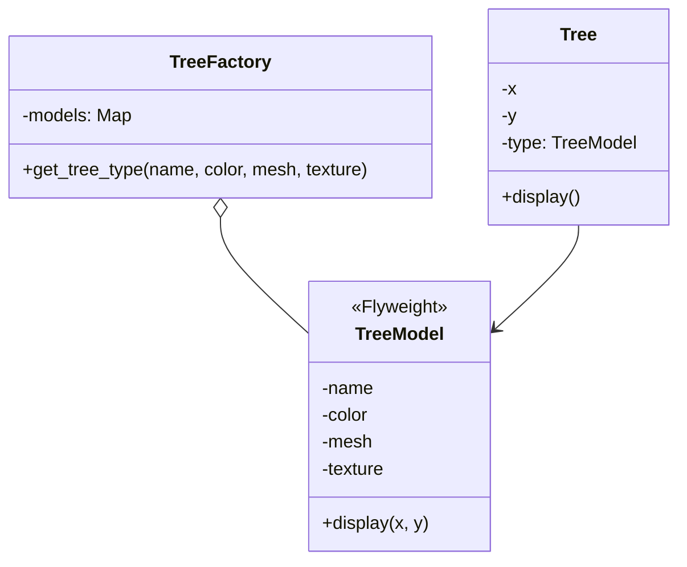

「先生、大変です！患者さんが……患者さんが、森に押しつぶされそうです！」

助手の切羽詰まった声が、薄暗い診療所に響いた。
運び込まれたのは、ゲーム開発者のレオ。
目の下には深い隈があり、抱えたノートPCからはファンの悲鳴が聞こえる。

「……重症だな」

ドクターはモニターを一瞥し、短く言った。

## 問診：100万本の森とメモリの悲鳴

レオは震える指で画面を指差した。

「先生……オープンワールドのゲームを作っているんです。美しい森を作ろうと思って、木を1万本植えたら、ロード中にメモリが溢れて……OSごと落ちるんです」

「見せろ。コードを」

### 触診：インスタンス増殖症のコード

レオの書いた、一本の「木」を表現するクラスはこうなっていた。

```perl
package Tree {
    use Moo;

    # 外部状態（座標）
    has x => (is => 'ro', required => 1);
    has y => (is => 'ro', required => 1);

    # 本来は「共有可能」なはずのデータが、インスタンスごとに保持されている
    has name    => (is => 'ro', default => 'Cedar');
    has color   => (is => 'ro', default => 'Green');
    has mesh    => (is => 'ro', default => sub { "Heavy Mesh Data ..." });
    has texture => (is => 'ro', default => sub { "Heavy Texture Data ..." });

    sub display {
        my $self = shift;
        # 描画処理...
    }
}
```

ドクターは無言でデバッグ出力を叩き出した。

```text
--- 診断: インスタンス増殖症のシミュレーション ---
木の一本あたりのサイズ (shallow): 490 bytes
木の一本あたりの合計サイズ (deep): 2746 bytes
1000 本の合計推定サイズ: 2,545,768 bytes
```

「……肥大化。無駄の極み」

「えっ、無駄って……木には名前も形も必要じゃないですか！」

助手がレオの肩を叩き、優しくフォローする。

「レオさん、先生が仰りたいのは、**『全ての木が同じデータを持つ必要はない』**ということです。1万本の杉の木があっても、その『形（メッシュ）』や『表面（テクスチャ）』は、実は全部同じものを使えますよね？」

「あ……そうか。座標（X, Y）だけが一本一本違うんだ」

## 診断：インスタンス増殖症

ドクターはホワイトボードに素早く文字を走らせた。

1. **インスタンス増殖症**: 数万個の小規模オブジェクトがメモリを圧迫。
2. **冗長状態肥大化**: 同一データ（内部状態）を個別に保持。
3. **初期化遅延**: 重複データの読み込みによるロード時間の悪化。

「処置は？」助手が問う。

「**Flyweight**。共有と分離」

「つまりですね、オブジェクトを『共有できる不変な部分（内部状態）』と『一本ごとに異なる部分（外部状態）』に分ける手術を行います」

## 手術：Flyweight パターンによる軽量化

### 処方箋：不変な状態の抽出

まず、共有可能なデータを `TreeModel` として切り出す。

```perl
# Flyweight クラス: 内部状態（Intrinsic State）を保持
package TreeModel {
    use Moo;
    has name    => (is => 'ro', required => 1);
    has color   => (is => 'ro', required => 1);
    has mesh    => (is => 'ro', required => 1);
    has texture => (is => 'ro', required => 1);

    sub display {
        my ($self, $x, $y) = @_;
        # 内部状態（自分）と外部状態（引数の座標）を使って描画
    }
}
```

### 集中治療：Factory による共有管理

次に、同じモデルを二度作らないための「工場（Factory）」を設置する。

```perl
package TreeFactory {
    use Moo;
    has _models => (is => 'ro', default => sub { {} });

    sub get_tree_type {
        my ($self, $name, $color, $mesh, $texture) = @_;
        
        my $key = "$name-$color";
        if (!exists $self->_models->{$key}) {
            $self->_models->{$key} = TreeModel->new(
                name => $name, color => $color, ...
            );
        }
        return $self->_models->{$key};
    }
}
```

### 最終調整：軽量な Tree クラス

最後に、実際の「木」は座標とモデルへの参照だけを持つようにリファクタリングする。

```perl
package Tree {
    use Moo;
    has x    => (is => 'ro', required => 1);
    has y    => (is => 'ro', required => 1);
    has type => (is => 'ro', required => 1); # TreeModel への参照

    sub display {
        my $self = shift;
        $self->type->display($self->x, $self->y);
    }
}
```

## 術後経過：100万本の森が呼吸を始めた

手術を終え、レオが再びゲームを起動した。

```text
--- 処置: Flyweightパターンによるメモリ最適化 ---
木の一本あたりのサイズ (shallow): 300 bytes
共有モデルの数: 1
1000 本の合計推定サイズ: 302,058 bytes
```

「先生！ メモリ使用量が1/8以下になりました！ 1万本どころか、100万本植えてもサクサク動きます！」

レオの顔に、ようやく生気が戻った。

「感謝は、このコードに」

ドクターは背を向け、使い込まれたキーボードに向き直った。

## 退院指導：共有の代償

助手が、帰宅するレオに一通の封筒を渡した。

「レオさん、これが今回の退院指導です。Flyweightパターンは強力ですが、いくつか注意点がありますよ」

1. **状態の分離**: どのデータが『共有可能（不変）』で、どのデータが『固有（可変）』かを見極める必要があります。
2. **複雑さの増加**: 以前のように `obj->display()` と呼ぶだけではなく、Factoryを通したり、メソッドにコンテキストを渡したりする手間が増えます。
3. **CPUとのトレードオフ**: メモリは減りますが、Factoryでの検索や、参照の解決にわずかなCPUパワーを消費します。

「でも、今回の森のように、**『大量の小さなオブジェクトが共通点を持っている』**場合には、最高の結果をもたらしてくれます」

## エピローグ

夜が更けた診療所。
助手が淹れたてのコーヒーをドクターのデスクに置いた。

「先生、お疲れ様です。レオさん、あんなに喜んで……次の新作ゲームのクレジットに先生の名前を載せるって言ってましたよ」

「……不要だ。コードが綺麗なら、それでいい」

ドクターはコーヒーを啜り、ふと助手の指先を見た。
丁寧に整えられた、清潔な爪。

（……新作のクレジットか。彼女と一緒に、レイトショーでも観に行くべきだろうか。いや、彼女のあのアピールは……きっと、私に映画のチケットを買わせるための高度な戦略に違いない……）

「先生？ 何か私の顔についてますか？」

「……何でもない。次の患者を」

助手の何気ない気遣いを、ドクターは今日も重厚なパターンとして深読みし続けていた。

---

### 今回の処方箋

| パターン | 役割 | 適応症状 |
| :--- | :--- | :--- |
| **Flyweight** | 共有による軽量化 | インスタンス増殖、冗長データ |

**Flyweightパターンの構造（Mermaid）**


