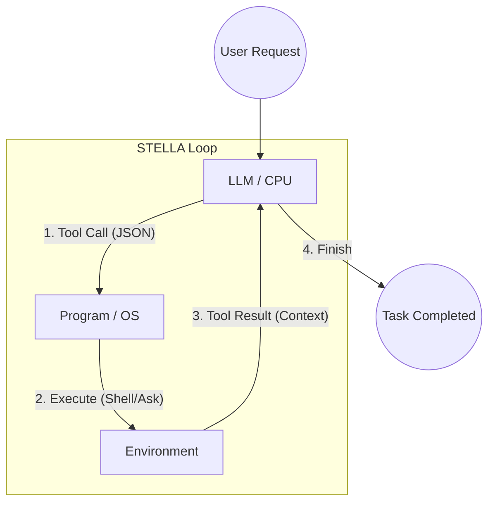

---
categories:
  - tech
date: 2026-02-28T16:05:19+09:00
draft: false
epoch: 1772262319
image: /public_images/2026/1772262319-image.jpg
iso8601: 2026-02-28T16:05:19+09:00
tags:
  - ai
  - llm
  - agent
title: LLMを「待機」させる：自律型エージェントSTELLA誕生の裏側と、僕がAIのモックになった日
---

自律型エージェントの開発は、まるで「知能」という掴みどころのない霧の中を歩いているような感覚だ。

もともと僕は、`deba`（Developer's Evolving Brain Agent）という CLI アプリを開発していた。当初の構想は、**Claude Opus 4.6** のような最高峰のモデルを「ワーカー」として使い、1 回のリクエストで複雑な処理を完遂させること。しかし、現実は違った。

タスク分解に指示を出し、タスクの実行ごとに指示を出し、という「1+N」から抜け出せない。1 リクエストで多くの処理をこなしてくれるはずの高級モデルが、ただの「高性能なチャット相手」に留まっている。この「宝の持ち腐れ」感にモヤモヤした気持ちを抱えていた。

「もっと、自律的に動いてほしい。1 回の命令で、最後までやり遂げてほしいんだ」

そんな悩みを AI にぶつけた時、返ってきた答えは、僕の設計思想を根本から揺るがすものだった。

「高級モデルを、ずっと待機させておけばいいんじゃないですか？」

……目から鱗が落ちる、というのはまさにこのことだった。

## 衝撃：「高級モデルを待機させればいいんじゃない？」

それまでの僕にとって、LLM というのは「何かを投げれば、何かが返ってくる」という一発回答型のチャットボットのような存在だった。
だからこそ、長い時間セッションを維持し、モデルを「待機」させるという発想が全くなかった。

背景には、最近の LLM サービスの「リクエスト制限」という現実的な問題もあった。
例えば GitHub Copilot は1回のフォーム送信が、1回のプレミアムリクエストとして計算される。挨拶をしても、1時間の重労働をさせても同じ1回だ。
ならば、**Claude Opus 4.6** のような最強の知能にチケットを1枚渡し、1時間みっちり働いてもらえばいい。

「待たせる、なんてそんな贅沢な使い方ができるのか？」
「はい。1つのセッションを維持し続ければ、それは『1回のリクエスト』のまま、何度も対話（ターン）を重ねられるんです」

「人間に聞かなければならないことがあれば、`ask_user` というツールを自分から呼び出せばいい」

さらなる衝撃は、AI が提案した「ツール」という概念だった。いや、ツールという概念は知っているつもりだったが、そんな簡単に作れるものだったのか？

なるほど、それなら自律的に動ける。
でも、そんな魔法のような仕組みを、どうやって？
頭ではわかっても、実感が追いつかない。

「それなら、プロトタイプを作ってみましょう。まずは LLM を使わずに、**あなたが LLM の役（モック）をやるプログラム**から」

……それが、奇妙な体験の始まりだった。

## 実験：人間がLLMの「モック」になった日

AI が書いたプロトタイプは、非常にシンプルだった。
実行すると、プログラムが僕に「思考内容」と「ツール名」を含んだ特定の形式の JSON を入力するよう促してくる。

最初は、わけもわからず例として生成された JSON をコピー＆ペーストして、コンソールに貼り付けるだけの作業を繰り返していた。

```json
{
  "thought": "ファイル一覧を確認して、README.md を読み込む必要があります。",
  "tool": "run_shell",
  "parameters": { "command": "ls -a && cat README.md" }
}
```

言われるがままに入力する。すると、プログラムが指定したシェルコマンドを目の前で実行し、その結果（ファイルの一覧や中身）を再び僕に突き返してくる。

「これが実行結果です。次は何をしますか？」

僕は、また次の JSON をひねり出して貼り付ける……。
はじめの数回は、何が起きているのかさえ、よく理解できていなかった。
そのプログラムは、シェルのように僕の入力を待っている。
入力するのは、シェルとして使うには面倒すぎるJSON。

僕は今、何をしているんだろう？

## 覚醒：JSONの向こう側に「自律」を見た瞬間

だが、ある瞬間に点と線が繋がった。
「LLM のモック」という言葉の意味が、ようやく実感を伴って僕の中に流れ込んできたのだ。

「あ、そうか。モックか。僕が今やっているこの『JSON を入力する』という作業は、 LLM がやっていることなのか」

考えてみれば、人工知能のモックに、普通の知能を使うのは贅沢だけど、そうすることでようやく腑に落ちた。

プログラムも、人間の代わりに機械に定型的なことをやらせるために書いている。
最近の人工知能は、特にプログラムに関して言えば、人間に近い（知識量は圧倒的に超えている）コードが書ける。シェルの使い方は芸術レベルだ。（よく間違えるけど）

で、このプログラムは、人間の代わりに人工知能が使えるシェルになっている。実際にはJSONの中に使いたいツールが書けるので、OSみたいなものになっている。
LLM はそのOSに対して、ツール（run_shell）を使い、プログラムはそれを実際のシェルに入力する。
このループが、タスクを完遂する「自律した CPU」になる。
そして、やることがなくなったら指示通り ask_user をOSに送ってレスポンスを待つ。

この `while(true)` ループの構造こそが、エージェントを自律させるための「器」なのだ。

人工知能をモックしている僕が打ち込んだ JSON をパースして、本当に目の前でシェルが動き、ファイルが書き換えられていく。
その結果を見て、また次の思考を入力する。
このサイクルを回すだけで、プログラムは魔法でもなんでもなく、確実に「前へ進む知能」へと変貌を遂げた。

「これなら、いける。自律型エージェントの最小コアが、ここにある」

暗闇の中で、ようやく進むべき方向を示す「星」が見えた気がした。
これが、STELLA 誕生の瞬間だった。


## 実装：STELLAのアーキテクチャ（制御の反転）

こうして誕生したのが、**STELLA (Stateful Turn-based Execution & LLM Loop Architecture)** だ。

その構造は、驚くほどシンプルだ。主要なロジックは、たった 1 つの `while(true)` ループの中に集約されている。

### 制御の反転（Inversion of Control）



1.  **Input**: ユーザーからの最初の指示、あるいは「前回のツールの実行結果」を LLM に渡す。
2.  **Think & Output**: LLM が「思考」し、次の「ツール実行」を JSON で出力する。
3.  **Execute**: プログラム（OS）が JSON をパースし、シェル実行やユーザーへの質問を行い、その結果を取得する。
4.  **Loop**: 取得した結果を再び「Input」として LLM に投げ返す。

このサイクルを、LLM が「完了（`finish`）」と判断するまで繰り返す。

まさに **Inversion of Control（制御の反転）**。プログラムが LLM を呼び出すのではなく、LLM がプログラム（ツール）を呼び出し、自らの判断でタスクを進めていく。

## 結び：暗闇を照らす「星」

STELLA という名前は、ラテン語で「星」を意味する。

もともと DEBA（発音はディーバ(DIVA) = 歌姫）として開発していた系譜を受け継ぎつつ、さらに自律性を高めた次世代機。
自律型エージェントの開発は、まだ手探りの状態だ。何ができるのか、どう実装すればいいのか、正解は見えていない。そんな暗闇（不確実な LLM の出力）の中で、プログラムによる確実なループ制御が、タスクを完遂へと導く「道しるべ」になる。そんな願いを込めて名付けた。

フレームワークを使わず、200行もない TypeScript で「知能のループ」を作り上げたこのプロジェクトは、僕にとって単なるツール以上の価値がある。
それは、AI とプログラムの新しい関係性を示す「雛形」だ。

「この星が、誰かの自律型エージェント開発の夜明けを照らす道しるべとなりますように」

- **STELLA Repository**: [https://github.com/nqounet/stella](https://github.com/nqounet/stella)

STELLA のリポジトリは、GitHub で公開している。
もし、あなたが「知能のループ」をその手で感じてみたいなら、ぜひ一度動かしてみてほしい。
そこには、僕が体験した「あの瞬間」の驚きが待っているはずだ。
