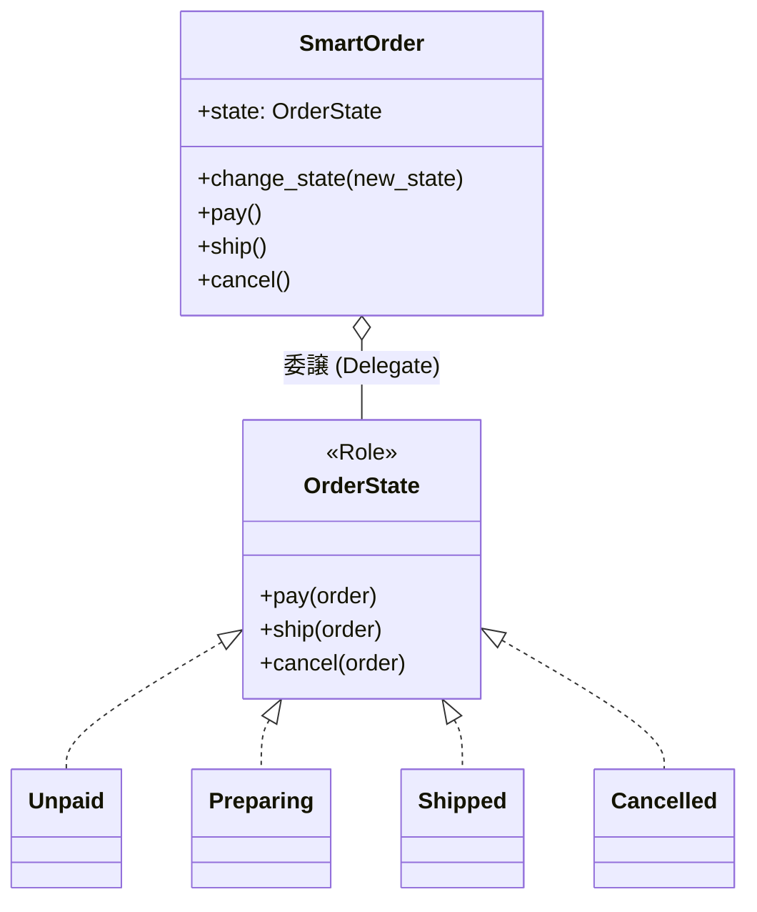

---
categories:
  - tech
date: 2026-03-09T07:07:05+09:00
description: 巨大な状態分岐の妖怪「Type Code」に悩まされるカイト。ステータスコードという単なる数字を、コード探偵ロックがStateパターンで「本物の役者」へと昇華させる！
draft: false
epoch: 1773007625
image: /public_images/2026/code-detective-state-type-code/header.webp
iso8601: 2026-03-09T07:07:05+09:00
tags:
  - perl
  - moo
  - design-pattern
  - state
  - type-code
  - refactoring
  - code-detective
title: コード探偵ロックの事件簿【State】顔のない変装犯〜ステータスコードの呪い〜
---

「顔のない変装犯による、システムの暗殺計画です」

入社3年目のバックエンドエンジニアである私は、「レガシー・コード・インベスティゲーション（LCI）」のドアを叩くなり、そう切り出した。

雑居ビルの2階。デスクトップPCの排熱とエナジードリンクの甘ったるい香りが充満するこの部屋の主は、期待通りに眉をピクリと動かした。

「ほう。面白そうな表現じゃないか」

自称コード探偵・ロック。季節外れのヨレヨレのトレンチコートを纏った男は、回転椅子をくるりと回して私の方へ向き直った。

「私の名前はカイト。ECサイトのバックエンドを担当しています。前任者が残したコードなんですが、注文のステータスが0、1、2、3という『ただの数字』で管理されているんです。その数字が、システムのあちこちで顔（振る舞い）を変えて悪さをしています」

「なるほど、Type Code（ステータスコードへの執着）というやつだね」ロックは面白そうに顎を撫でた。「さあワトソン君。その変装犯の顔を、現場（サーバー）で見せてもらうとしよう」

あの、私はカイトなんですが……。しかし、この探偵に常識が通じないことは噂で聞いていたので、私は黙ってノートPCを開いた。

---

## 現場検証：顔のない変装犯

「これが問題の `Order` クラスです」

私はため息をつきながら画面を指差した。「注文の支払い、発送、キャンセル……あらゆる処理が、巨大な `if - elsif` の塊になっています」

```perl
package Order {
    use Moo;

    # 0: Unpaid (未決済), 1: Preparing (準備中), 2: Shipped (発送済), 3: Cancelled (キャンセル)
    has status => (
        is      => 'rw',
        default => 0,
    );

    has output => (
        is      => 'ro',
        default => sub { [] },
    );

    sub pay ($self) {
        if ($self->status == 0) {
            push @{$self->output}, "Order paid.";
            $self->status(1); # 準備中へ
        }
        elsif ($self->status == 1) {
            push @{$self->output}, "Already paid.";
        }
        elsif ($self->status == 2) {
            push @{$self->output}, "Already shipped.";
        }
        elsif ($self->status == 3) {
            push @{$self->output}, "Cannot pay: Order is cancelled.";
        }
    }

    sub ship ($self) {
        if ($self->status == 0) {
            push @{$self->output}, "Cannot ship: Not paid yet.";
        }
        elsif ($self->status == 1) {
            push @{$self->output}, "Order shipped.";
            $self->status(2); # 発送済へ
        }
        elsif ($self->status == 2) {
            push @{$self->output}, "Already shipped.";
        }
        elsif ($self->status == 3) {
            push @{$self->output}, "Cannot ship: Order is cancelled.";
        }
    }

    # ... cancel メソッドも同様の巨大な分岐が続く ...
}
```

「本当にひどい有様です」私は訴えかけた。「最近『発送済みからはキャンセル不可、でも準備中なら返金キャンセル可能』という仕様が追加されて、さらに条件がスパゲティ化しました。先日なんて、発送済みのはずなのにキャンセル処理が通ってしまって……」

ロックはモニターを見つめ、エナジードリンクをストローで啜った。ズズズ、という下品な音が響く。

「ワトソン君。君が『顔のない変装犯』と呼んだ理由がよくわかる。この `$status` というプロパティには、**状態を表す数字が入っているだけで、そこには振る舞い（知識）が一つも宿っていない**」

「数字なんだから……当然ですよね？」

「そう。だから呼び出し側である `pay` や `ship` が、『もしお前が1ならこう動け、2ならこう動け』といちいち命令しなければならない。これは『状態』という概念に対する、オブジェクト指向的な敗北だよ」

ロックの指がキーボードの上で構えを取った。

「ただの数字に過ぎない彼らを、自ら考え、自ら動く『本物の役者』へと昇華させてみせよう」

---

## 推理披露：本物の役者への昇華

### 1. 役者のオーディション（Roleの定義）

「まずは、すべての状態が守るべき『約束事』を定義するんだ。どんな状態であろうと、支払い・発送・キャンセルの要求には応えなければならないからね」

```perl
# ------------------------------
# 1. 状態の共通インターフェース (Role)
# ------------------------------
package OrderState::Role {
    use Moo::Role;
    requires 'pay';
    requires 'ship';
    requires 'cancel';
}
```

### 2. 状態の具象化（Concrete State の実装）

「次に、あの不吉な数字の塊を、独立した一つのクラス（役者）として切り分ける」ロックは迷いのない手つきでコードを打ち込んでいく。

「たとえば『未決済（Unpaid）』という状態は、支払いには応じるが、発送には応じられない。彼自身がそのルールを知っているんだ」

```perl
# ------------------------------
# 2. 具体的な状態(State)群
# ------------------------------

# 0だったもの: 未決済 (Unpaid)
package OrderState::Unpaid {
    use Moo;
    with 'OrderState::Role';

    sub pay ($self, $order) {
        push @{$order->output}, "Order paid.";
        # 支払いが完了したので、自ら「準備中」状態へ遷移させる
        $order->change_state(OrderState::Preparing->new);
    }
    sub ship ($self, $order) {
        push @{$order->output}, "Cannot ship: Not paid yet.";
    }
    sub cancel ($self, $order) {
        push @{$order->output}, "Order cancelled.";
        $order->change_state(OrderState::Cancelled->new);
    }
}
```

「同じように『準備中』や『発送済』もクラス化する。驚くべきことに、これらのクラスの中には `if` 文が存在しない。なぜなら『自分は未決済である』という大前提の上のコードだからだ」

```perl
# 1だったもの: 準備中 (Preparing)
package OrderState::Preparing {
    use Moo;
    with 'OrderState::Role';

    sub pay ($self, $order) {
        push @{$order->output}, "Already paid.";
    }
    sub ship ($self, $order) {
        push @{$order->output}, "Order shipped.";
        $order->change_state(OrderState::Shipped->new);
    }
    sub cancel ($self, $order) {
        push @{$order->output}, "Order cancelled and refunded.";
        $order->change_state(OrderState::Cancelled->new);
    }
}

# 2だったもの: 発送済 (Shipped)
# (省略: ship済みなので、cancelされたら "Cannot cancel" を返すコード)
```

### 3. メインロジック（Context）の解放

「これで役者は揃った。最後に、主役である `Order` クラスに彼らを迎え入れよう。驚かないでくれたまえよ、ワトソン君」

```perl
# ------------------------------
# 3. Context（メインロジック）
# ------------------------------
package SmartOrder {
    use Moo;

    # ステータス(数字)の代わりに「状態オブジェクト」を保持する
    has state => (
        is      => 'rw',
        default => sub { OrderState::Unpaid->new },
    );

    has output => (
        is      => 'ro',
        default => sub { [] },
    );

    # 状態の変更を内部で許可するメソッド
    sub change_state ($self, $new_state) {
        $self->state($new_state);
    }

    # 各アクションは、現在の状態オブジェクトに「委譲」するだけ
    sub pay ($self) {
        $self->state->pay($self);
        return $self;
    }

    sub ship ($self) {
        $self->state->ship($self);
        return $self;
    }

    sub cancel ($self) {
        $self->state->cancel($self);
        return $self;
    }
}
```

言葉が出なかった。
あの禍々しい `if - elsif` の連鎖が、跡形もなく消え去っている。



「`SmartOrder` は今、自分がどういう状態にいるのかを知りもしない。『支払い（pay）』が呼ばれたら、現在自分が持っている `$state` クラスにそのまま丸投げ（委譲）するだけだ。数字による変装を脱ぎ捨て、本物のオブジェクトが判断を下す。これが **Stateパターン** による解決だよ」

---

## 事件の終わり：消えた数字たち

テストコードを走らせると、すべてがグリーン（成功）となり、期待通りに動作した。

「すごい……！ あの複雑だった『発送済みならキャンセル不可、準備中なら返金処理』というビジネスルールが、それぞれの状態クラスの中に綺麗に閉じ込められています」

数字がシステム全体に漏れ出していたときは、どこかに修正漏れがあれば即バグに直結した。しかし今なら、「発送済みの場合の振る舞い」を変えたければ、`OrderState::Shipped` クラスの中だけを見ればいい。安全圏だ。

「初歩的なことだよ、ワトソン君」

ロックは満足そうに伸びをした。

「数字というただの記号に、システムの判断を委ねてはいけない。状態というのは本来、それ自体が振る舞いを持つ立派な『モノ（オブジェクト）』なのだからね」

「確かに。これならもう、見えない暗殺者に怯える必要も……あ、私はカイトですけど」

「さて、報酬の話をしようか。あの巨大な `if` ブロックの行数と同じグラム数の特上ステーキ肉なんてどうだい？ 焼き加減はもちろん、私の状態（State）に合わせてミディアム・レアに変化させてくれたまえよ」

私はため息をついた。彼の傲慢な態度という「状態」は、どうデザインパターンを適用しても切り口が見つかりそうにない。

それでも、綺麗になったディレクトリを見つめる私の心は、晴れやかだった。

---

## 探偵の調査報告書

| 容疑（アンチパターン） | 真実（パターン） | 証拠（効果） |
| :--- | :--- | :--- |
| Type Code（マジックナンバーによる状態分岐）。0,1,2 といった数字で状態を表し、システム中の至る所に `if ($status == X)` の分岐を散乱させる。 | State パターン。状態そのものを個別のクラスとして抽出し、判断と振る舞いを「状態オブジェクト」に委譲する設計方式。 | 状態に応じた巨大な分岐（if/switch）が消滅。新しい状態の追加や、特定の状態のルール変更が他の状態に影響を与えず安全に行える（オープン・クローズドの原則）。 |

### 推理のステップ

1. **Role の定義**: すべての「状態」が持つべき振る舞い（メソッド）の共通インターフェースを定義する。
2. **State 群の実装**: 状態ごとに独立したクラス（`Unpaid`, `Preparing` など）を作り、その状態特有の振る舞いと「次の状態への遷移ルール」を記述する。
3. **Context からの委譲**: メインの管理クラス（今回は `Order`）から数字や分岐を排除し、現在の `$state` オブジェクトに対して単にメソッドの実行を委譲（Delegate）する形に書き換える。

### ロックより

ワトソン君。君の先輩が残した「数字の妖怪」たちは、確かに恐ろしげな顔をしていた。
しかし、彼らの正体は単なる記号の集まりに過ぎない。コードにおいて、ただの数字は何も考えてくれないし、誰も助けてはくれない。

本当に複雑なルールの海を渡るなら、状態自身に「あなたはどう振る舞うべきですか？」と尋ねる設計（教えてもらうのではなく、振る舞いそのものを内包させる設計）を心がけたまえ。

さて、私のエナジードリンクも空（EmptyState）のようだ。補充に移行（change_state）するとしよう。次の事件が私を呼んでいる。
