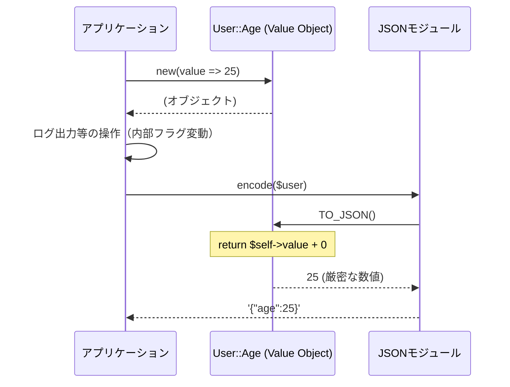

---
categories:
  - tech
date: 2026-03-10T07:07:05+09:00
description: JSON出力時の型が勝手に変わる！？ Perlのレガシーコードで頻発するPrimitive Obsession（プリミティブ型への執着）と、Value Objectを用いたカプセル化による鮮やかな解決劇。
draft: false
epoch: 1773094025
image: /public_images/2026/code-detective-value-object-primitive-obsession/header.webp
iso8601: 2026-03-10T07:07:05+09:00
tags:
  - design-pattern
  - perl
  - moo
  - value-object
  - primitive-obsession
  - refactoring
  - code-detective
title: コード探偵ロックの事件簿【Value Object】偽造された身分証〜変数が型を失う日〜
---

「そもそも、なんで変数の型が勝手に変わるんですか！？ 他の言語じゃありえないのに！」

私の叫び声は、雑居ビルの一室に響き渡った。
ここは「レガシー・コード・インベスティゲーション（LCI）」。熱暴走ギリギリのPCの排熱と、飲みかけのエナジードリンクの香りが充満する怪しげな探偵事務所だ。
私は最近、型に厳密な別システムへのAPI連携（JSON出力）を担当することになった中堅エンジニア。だが、この数日、原因不明のエラーに完全に心を折られかけていた。

「落ち着きたまえ、ワトソン君」

奥の回転椅子から、時代錯誤なツイードのジャケットを着た男――コード探偵ロックが、ゆっくりとこちらを向いた。手には、キーボードの『Enter』キーだけをやたらと強く叩き抜いた痕跡がある使い込まれたHHKBが握られている。

「君の主張は分かった。だが、変数は勝手に変わったりなどしない。君たちが彼らを『裸のまま街（システム）を歩かせている』から、見知らぬ誰かに帽子を被らされたり、靴を履かされたりして、元の姿が分からなくなっているだけなのだよ」

ロックはニヤリと笑った。

「今日は、その『偽造された身分証（Primitive Obsession）』の正体を暴き、彼らに絶対脱げない『制服』を着せてやろうじゃないか」

## I. 現場検証：コードの指紋


「まずは現状のコード（現場）を見せてもらおうか。ホシはどのようにして、その姿を変えているのかな？」

私はノートPCを開き、問題のコードをロックに見せた。
ただのユーザーデータをJSONにエンコードして出力するだけの、ごく平均的なPerlのコードだ。

```perl
package LegacyUser;

use strict;
use warnings;
use JSON::MaybeXS;

sub generate_json {
    # 実際はDBなどから取得するが、ここではハッシュリファレンスとして定義
    my $user = {
        id    => 12345,         # DB等でauto_incrementの数値として取得されることが多いが...
        age   => '25',          # DBドライバによっては文字列として取得される
        phone => '09012345678', # 電話番号はゼロから始まるため文字列
    };

    # 何らかの処理で数値として扱われると、Perl内部で数値フラグが立つ
    $user->{age} += 1;

    # id（数値）を文字列結合すると、文字列フラグが立ち、数値フラグよりも優先されることがある
    my $log_msg = "User ID: " . $user->{id};

    # JSONにシリアライズ
    # JSONモジュールは内部フラグを見て型を決めるため、
    # 直前の処理によって型の推論結果が変わってしまう
    my $json = encode_json($user);
    
    return $json;
}

1;
```

「連携先からは、『日によって年齢が文字列になってる』とか『電話番号が数値になっていて先頭の0が消えてる』って怒られるんです。ログ出力のために文字列結合しただけなのに、なんでJSONの出力結果まで変わっちゃうんですか！」

ロックは満足げに頷いた。

「初歩的なにおい（コードスメル）だよ、ワトソン君。Perlのスカラー変数（`$var`）は、ただの『箱』だ。文字列を入れれば文字列になり、計算すれば数値になる。ここまでは君も知っているだろう？」

「ええ、便利ですよね」

「だが、それがJSONモジュールのような厳格な審査官（シリアライザ）の前に出た時、事件は起きる。箱の中身が『最後にどう扱われたか（内部フラグ：IV/NV/PV）』によって、出力される型が決まってしまうからだ」

ロックは立ち上がり、ホワイトボードに書き殴った。

「君のコードの変数は、言うなれば『誰でも手書きできる紙切れの身分証』だ。どこかで誰かが `+ 1` しただけで『私は数値です』という顔になり、`.` で文字列結合された瞬間に『私は文字列です』と言い張る。これこそが、Primitive Obsession（プリミティブ型への執着）が引き起こす悲劇さ」

なるほど。変なところで型が変わる原因は、私が良かれと思って組み込んでいたログ出力や、ちょっとした計算のせいだったのか……。


## II. 推理披露：鮮やかなリファクタリング


「じゃあ、どうすればいいんですか？ 出力する直前に全部 `+ 0` したり `"" .` したりして、強制的に型を合わせる（キャストする）ハックでも入れます？」

「馬鹿なことを言うもんじゃない！ そんな場当たり的な対処は、絆創膏の上から絆創膏を貼るようなものだ」

ロックは呆れたようにため息をついた。

「彼らに、絶対に脱げない、偽造不可能な「制服（Value Object）」を着せるんだ。そうすれば、どこをどう歩こうが、審査官には正しい姿として認識される」

ロックの手が、猛烈な勢いでHHKBを叩き始めた。

### Value Object の定義（制服の作成）

「まずは年齢（Age）と電話番号（PhoneNumber）、そしてIDのための専用クラス（VO）を作る。今回は `Moo` の力を借りよう」

```perl
# lib/User/Age.pm
package User::Age;
use Moo;
use Types::Standard qw(Int);

has value => (
    is       => 'ro',
    isa      => Int,
    required => 1,
);

sub BUILD {
    my ($self) = @_;
    die "Age must be positive" if $self->value < 0;
}

# JSON::MaybeXS (convert_blessed) などで呼ばれる
sub TO_JSON {
    my ($self) = @_;
    return $self->value + 0; # 確実に数値として出力
}
1;
```

```perl
# lib/User/PhoneNumber.pm
package User::PhoneNumber;
use Moo;
use Types::Standard qw(Str);

has value => (
    is       => 'ro',
    isa      => Str,
    required => 1,
);

sub BUILD {
    my ($self) = @_;
    die "Invalid phone number" unless $self->value =~ /^\d{10,11}$/;
}

sub TO_JSON {
    my ($self) = @_;
    return "" . $self->value; # 確実に文字列として出力
}
1;
```

「ただの文字列や数値を保持するためだけのクラスですか？ なんだか大げさな気もしますが……」

私が首を傾げると、ロックはチッチッと指を振った。

「大げさなものか。このクラスには2つの重要な責務がカプセル化されている。1つ目は `BUILD` による生成時のバリデーション（身元保証）。マイナスの年齢や不正な電話番号は、そもそもこのシステムに存在できなくなる。
そして2つ目。これが今回の事件の切り札、`TO_JSON` メソッドだ」

### コンテキストの簡略化と安定化

ロックはさらにコードを書き換え、元の処理を置き換えた。

```perl
# lib/RefactoredUser.pm
package RefactoredUser;

use strict;
use warnings;
use JSON::MaybeXS;
use User::Id;
use User::Age;
use User::PhoneNumber;

sub generate_json {
    # 1. オブジェクトとして生成（この瞬間にバリデーションも完了する）
    my $user = {
        id    => User::Id->new(value => 12345),
        age   => User::Age->new(value => 25),
        phone => User::PhoneNumber->new(value => '09012345678'),
    };

    # 2. 値として取り出すことはできても、オブジェクト自体は不変（Immutable）
    my $log_msg = "User ID: " . $user->{id}->value;

    # 3. JSON化時に convert_blessed を有効にする
    my $coder = JSON::MaybeXS->new(convert_blessed => 1);
    
    # オブジェクトのTO_JSONが呼ばれ、設計者が意図した通りの型で確実に出力される
    my $json = $coder->encode($user);
    
    return $json;
}

1;
```

「JSONモジュールに `convert_blessed` オプションを渡すと、モジュールはオブジェクトに対して `TO_JSON` メソッドを呼び出し、その戻り値をシリアライズの対象にする。
この `TO_JSON` の中で `+ 0`（数値強制）や `"" .`（文字列強制）を行えば、途中で誰が文字列結合しようが計算しようが、**出力される瞬間の型は、そのクラス自身が責任を持って保証する**というわけだ」




## III. 解決：事件の終わり

私は息を呑んだ。

たかが文字列一つ、数値一つをクラスにするなんて「大げさ」だと思っていた。
しかし、至る所に散らばっていた「型を合わせるためのハック」や「同じ正規表現での重複したバリデーション」が、すべて1つの小さなクラス（Value Object）に綺麗に収まっているのを見せつけられ、それまでの自分の考えがいかに浅はかだったかを思い知った。

どこでどう使われようとも、その変数は「自分は数値の年齢だ」「自分は文字列の電話番号だ」という絶対的なアイデンティティを保ち続ける。もう他のシステムが異常終了する恐怖に怯える必要はないのだ。

「プリミティブ型は便利だが、それは無法地帯の便利さだよ。意味のあるデータには、意味のある名前を与え給え」

ロックが冷めたエナジードリンクを飲み干し、キザな台詞で事件を締めくくった。

「……なるほど。そういうことだったんですね！」

私の胸に、遅れてきた雷のようなインスピレーションが落ちた。
そうだ。生のデータがこれほどまでに脆弱で扱いづらいものならば、逆に言えば、すべてのデータに強固な『制服』を着せてしまえばいい。システム内のすべての変数が、自分自身の正しさを保証してくれる世界——それこそが、バグのない完璧なユートピアではないか！
生来の几帳面さが、パズルの最後のピースがはまったことで大爆発を起こした。

「つまり、ユーザー情報を構成するこの『名前』も、この『フラグ』も、『備考欄』も……！ 全部 Value Object のクラスを作っちゃえば、もう絶対にバグらない完璧なシステムになりますね！！ さっそく100個くらいクラス作ってきます！！」

勢いよく立ち上がり、目を輝かせる私を見て、ロックは深く頭を抱えて呻いた。

「……極端から極端へ走るのは君の悪い癖だ、ワトソン君。何事にも限度というものがある。すべての路地裏に信号機を立てる必要はないのだよ……」


---

## 探偵の調査報告書

| 容疑（アンチパターン） | 真実（パターン） | 証拠（効果） |
| :--- | :--- | :--- |
| Primitive Obsession（プリミティブ型への執着） 重要な概念（年齢・電話番号など）を単なる基本型（文字列や数値）のまま扱い、システム中に型変換やバリデーションのロジックを散在させてしまう状態。 | Value Object（値オブジェクト） 独自の概念を専用のクラスとして定義し、データに対する制約や出力時の振る舞いをカプセル化する設計。一度生成されると変更できない不変性を持つ。 | 型の意図せぬ変動を防ぎ、不正な値の混入をブロックする。また、JSONシリアライズ時のフォーマット崩れなどをクラス内部に隠蔽し、システム全体の堅牢性を高める。 |

### 推理のステップ

1. **ドメインの概念を見つけ出す**: 「ただの文字列」「ただの数値」ではなく、それがシステム上で「電話番号」なのか「年齢」なのかを見極める。
2. **専用のクラス（VO）を定義する**: `Moo` などを用いてクラス化し、生成（`BUILD`）時に厳格なバリデーションを行う。
3. **振る舞いをカプセル化し、不変にする**: `TO_JSON` のような特定の出力フォーマットに対する振る舞いや、値の比較ロジックをクラス内に閉じ込める。外部から値が上書きされないよう、アトリビュートは Read-Only（`ro`）にする。

### ロックより

今回は「JSON出力時の型のブレ」という、Perl特有とも言える泥臭い事件にお目にかかれて実に楽しかったよ。
Value ObjectはGoFのデザインパターンというわけではないが、ドメイン駆動設計（DDD）などにおいて極めて強力な「におい消し」となるアイテムだ。

だが忘れないでくれたまえ。何でもかんでもクラス化すればいいというものではない。「その概念が、システム内で独立した振る舞いや制約を持つべきか」を見極めることこそが、真の探偵（プログラマー）の仕事なのだから。

次なる「コードのにおい」が漂う時まで、しばしのお別れだ。
