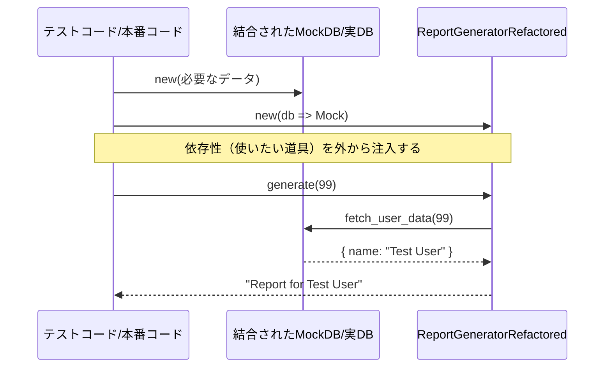

---
categories:
  - tech
date: 2026-03-12T07:07:05+09:00
description: 便利すぎる「どこからでも呼べるクラス（Singleton）」が引き起こすデータの混線バグ。Dependency Injection（DI）を用いてグローバルな状態を安全に引き剥がす鮮やかな解決劇。
draft: false
epoch: 1773266825
image: /public_images/2026/code-detective-singleton/header.webp
iso8601: 2026-03-12T07:07:05+09:00
tags:
  - design-pattern
  - perl
  - moo
  - singleton
  - dependency-injection
  - anti-pattern
  - refactoring
  - code-detective
title: コード探偵ロックの事件簿【Singleton／DI】便利すぎる万能薬の副作用〜消えた証拠〜
---

「ロックさん！ 夜間バッチを並列で動かしたら全員のレポートデータが完全に混ざりました！ テスト環境で動かしていたはずの処理が、本番のデータベースを書き換えてるんです！」

私の悲痛な叫び声が、ホコリとコーヒーの匂いが混ざり合う「レガシー・コード・インベスティゲーション（LCI）」の事務所に響き渡った。

私は真面目さと几帳面さだけが取り柄の中堅運用エンジニア。最近、前任者が「超絶便利だから」と言って残していったシステムの保守を引き継いだばかりだが、謎のデータ消失とホラー現象に怯える日々を過ごしている。

「落ち着きたまえ、ワトソン君」

奥の回転椅子から、時代遅れのツイードのジャケットを着た男――コード探偵ロックが、キーボードの『Enter』キーだけをやたらと強く叩き抜いた痕跡がある使い込まれたHHKBから手を離し、ゆっくりとこちらを向いた。

「君の言う『本番のデータベースを書き換えた』犯人は、外部からのサイバー攻撃でもなければ、謎のポルターガイストでもない。君たち自身が、コードのあちこちに『どこにでも繋がっている秘密のドア』を作ってしまったからだよ」

「秘密のドア……？ ですが、前任者は『どこからでも呼べる万能のクラス』だって自慢していましたよ！ あれがないと今やもうシステムがまともに動かないのに！」

ロックは呆れたように小さくため息をつき、ニヤリと片方の口角を上げた。

「万能薬ほど、副作用（サイドエフェクト）が強いものはないのだよ。今日はその『ガラの悪いグローバル変数』に引導を渡してやろうじゃないか」

## I. 現場検証：コードの指紋


「まずは現状のコード（現場）を見せてもらおうか。ホシはどのようにして、その姿を隠しているのかな？」

私は震える手でノートPCを開き、システムの中核を成すレポート生成クラスのコードをロックに見せた。

```perl
package MyCompany::ReportGeneratorLegacy;
use strict;
use warnings;
use MyCompany::Database; # 前任者が残した超絶便利Singletonクラス

sub new { bless {}, shift }

sub generate {
    my ($self, $user_id) = @_;
    
    # クラスの内部で直接インスタンスを取得している
    # （呼び出し元からはこの依存関係が見えない！）
    my $db = MyCompany::Database->get_instance();
    my $data = $db->fetch_user_data($user_id);
    
    return "Report for $data->{name}";
}

1;
```

「これの何が悪いんですか？ `MyCompany::Database->get_instance()` を呼べば、どこからでもキャッシュされた同じDB接続使い回せるんですよ。毎回接続し直さなくていいから効率的じゃないですか！」

ロックは鋭い視線を画面に向け、首を横に振った。

「初歩的なにおい（コードスメル）だよ、ワトソン君。『どこからでも同じものを呼べる』ということは、『どこからでも同じものの状態を**書き換えられるし、影響を受ける**』ということだ」

「書き換えられる……？」

「その `MyCompany::Database` クラスの中身を見てみ給え」

慌てて前任者が実装したDBクラスの中身を開くと、そこには怪しいメソッドが一つ生えていた。

```perl
package MyCompany::Database;
use strict;
use warnings;

my $INSTANCE;

sub get_instance {
    my $class = shift;
    # 一度作られたら、ずっと同じインスタンス（状態）を返す
    $INSTANCE ||= bless { data => {} }, $class;
    return $INSTANCE;
}

sub fetch_user_data { ... }

# 問題の箇所：誰でも自由に内部状態を書き換えられてしまう！
sub overwrite_data {
    my ($self, $bad_data) = @_;
    $self->{data} = $bad_data;
}

1;
```

「並列で動いている別のバッチ処理や、あるいは行儀の悪いテストコードが、この `overwrite_data` （あるいはプロパティの直接操作）を行ったらどうなる？ このシステム全体にたった1つしか存在しないインスタンスが汚染される。
すると、全く独立して動いているはずの `ReportGenerator` までが、その汚染されたデータを読み込んでしまうのだよ」

私は息を呑んだ。
確かに、テスト間で互いに影響を及ぼし合ったり、並列バッチでユーザー情報が入れ替わったりする現象の辻褄が完全に合う。

「つまり、こいつは優れた設計手法（Singleton・シングルトン）でも何でもない。ただオブジェクト指向の皮を被った、単なる『**ガラの悪いグローバル変数**』だったわけか……！」


## II. 推理披露：鮮やかなリファクタリング


「じゃあ、どうすればいいんですか？ この `get_instance()` を使わずに毎回 `new` したら、DB接続が溢れてシステムがパンクしちゃいます！」

「誰も毎回 `new` しろとは言っていない。自分が使う道具を、クラスの『隠し扉』から勝手に持ち出すのをやめろと言っているのだ」

ロックの手が、小気味良いタイピング音と共にコードを書き換え始めた。

### Dependency Injection（依存性の注入）への移行

「必要な道具は、外から『堂々と』受け取るんだ。今回は `Moo` の力を借りて、依存関係をコンストラクタで明示的に定義する」

```perl
package MyCompany::ReportGeneratorRefactored;
use Moo;

# データベース接続は外から受け取る（依存性の注入）
has db => (
    is       => 'ro',
    required => 1, # 必ず外部から渡すことを強制する
);

sub generate {
    my ($self, $user_id) = @_;
    
    # コンストラクタで渡されたDBオブジェクトを利用する
    # このメソッドは、DBが「本物」か「モック」かを全く気にしなくて良い
    my $data = $self->db->fetch_user_data($user_id);
    
    return "Report for $data->{name}";
}

1;
```

あっという間に直されたコードを見て、私は眉をひそめた。

「たったこれだけですか？ 確かにクラスの中で `get_instance()` を呼ぶのはやめましたけど……代わりに呼ぶ側（使う側）がいちいちオブジェクトを渡してやらなきゃいけなくて、面倒になるだけじゃ？」

「そう、その『面倒』こそが責任の所在なのだよ」

ロックは自信ありげに、呼び出し元となるテストコードを書き始めた。

### 本物と偽物（モック）の入れ替え

```perl
# 完全に隔離された状態を持つテスト用（モック）のDBクラス
package MockDatabase;
use Moo;

has mock_data => (
    is      => 'ro',
    default => sub { {} },
);

sub fetch_user_data {
    my ($self, $user_id) = @_;
    return $self->mock_data->{$user_id};
}
1;

# --- ここからテストコード ---

# テスト1: 完全に独立したMockDBを渡す（テスト用）
my $mock_db = MockDatabase->new(mock_data => { 99 => { name => "Test User" } });

# ジェネレータに「モックDB」を注入する！
my $generator = MyCompany::ReportGeneratorRefactored->new(db => $mock_db);

print $generator->generate(99); 
# => "Report for Test User" （本番システムには一切触れない）
```

「すごい……！ `ReportGenerator` の中身を一言も書き換えないまま、外から渡すものを変えるだけで、テスト環境用のDBにすり替えることができた！」

「その通りだ。クラス内部でSingletonを呼ぶ（Pull・引っ張り込む）のではなく、外部から渡す（Push・注入する）。これが **Dependency Injection（依存性の注入）** だ」




## III. 解決：事件の終わり

私は歓喜した。長年私を苦しめていた「別のバッチ処理にお漏らしされるホラー現象」は、これでもう永遠にサヨナラだ。

「これなら絶対安全ですね！ 外から渡されたものしか使えないなら、誰かが見えない裏口からデータを書き換える心配もありません！」

「部品同士の『結合度』を下げるということだよ。必要な道具は、隠れて持ち込むのではなく、堂々と玄関（コンストラクタ）から受け取りたまえ。それが信頼されるコードの作法だ」

ロックがドヤ顔でキザな台詞を吐き捨てた。
しかし、その声はほとんど私の耳には入っていなかった。

私のなかの几帳面レーダーが、かつてないほどの激しい警告音を鳴らし始めていたからだ。

「……なるほど。ということは、この『現在時刻』を取得している謎の関数も、この『文字列をフォーマット』しているだけの関数も、中で勝手にOSの時間やロケールを読み取っているから危険なんですね！ すべて外から渡してあげなきゃ！」

「……ん？ まあ、時刻に依存する処理なら `Clock` オブジェクトを渡すのは悪くないが……」

「よし！ じゃあ、ただ現在時刻をログに出力するだけの処理のために、`LoggerFactory` クラスと `TimeProviderInterface` クラスと `StringFormatterInterface` クラスを作って、それを生成するための `DIContainerBuilder` を構築して、それぞれにコンストラクタインジェクションするように全部書き直してきますね！」

「……！」

私はHHKBを叩きまくるロックを押し退け、一心不乱にコードを書き始めた。
たった1行の「現在時刻を出力する」関数を呼び出すために、10層にも重なるインターフェースとFactoryの迷路を組み上げながら。

背後でロックが、深く頭を抱え、絶望に満ちた声を漏らした。

「……ただいまの時刻を知るために、時計職人の生い立ちとカレンダーの起源から、私にいちいち説明させるつもりか……」

極端から極端へ走る私の悪い癖は、今日も絶好調だった。


---

## 探偵の調査報告書

| 容疑（アンチパターン） | Singletonの誤用・グローバル変数化（Ambient Context） |
| :--- | :--- |
| **真実（パターン）** | Dependency Injection（依存性の注入） |
| **証拠（効果）** | 暗黙の依存の排除、テスタビリティの担保、副作用の局所化 |

### 推理のステップ

1. **暗黙の依存を洗い出す**: クラスの中で `Config::getInstance()` や直接 `new` している外部リソース（DB、APIクライアント、時間等）を見つける。そこがテスト不能になる一番の元凶だ。
2. **コンストラクタで受け取るように変更**: その依存を自前で確保するのをやめ、コンストラクタの引数（アトリビュート）として定義し直す。
3. **利用側が責任を持つ**: 呼び出す側のプログラムが、責任を持って適切なオブジェクト（本番用なら実DB、テスト用ならモックDB）を生成し、注入（Inject）する。

### ロックより

今回は「どこからでも呼べるものは、どこからでも壊せる」という、極めて古典的な惨劇の現場だったね。
Singletonパターン時代が悪いわけではない。だが、それを**『インスタンスを引き回すのをサボるための便利なグローバル変数』**として使った瞬間、コードはその命脈を絶たれるのだ。

解決策であるDependency Injection（DI）は魔法のように聞こえるが、結局のところ**「自分で勝手に取ってくるな、外から渡してもらえ」**という単純な規律に過ぎない。

だが気をつけてくれたまえ。ワトソン君のように、何でもかんでもインターフェース化し、疎結合を追い求めすぎると、「一体誰が本当に仕事をしているのか分からない」過剰な抽象化の迷路が出来上がる。設計とは常にトレードオフだ。コードを読むための地図が、迷路そのものになっては本末転倒なのだから。

次なる「コードのにおい」が漂う時まで、しばしのお別れだ。
