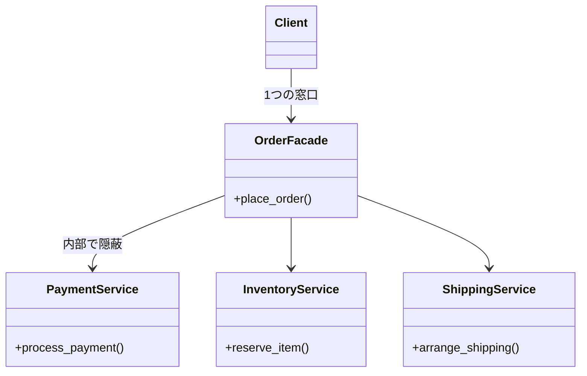

---
categories:
  - tech
date: 2026-03-14T07:07:05+09:00
description: すべてを直接操作しようとする野心的なコントローラーに苦しむワトソン君。コード探偵ロックがFacadeパターンで複雑な配線を隠蔽（カプセル化）する！
draft: false
epoch: 1773439625
image: /public_images/2026/code-detective-facade-god-class/header.webp
iso8601: 2026-03-14T07:07:05+09:00
tags:
  - perl
  - moo
  - design-pattern
  - facade
  - god-class
  - refactoring
  - code-detective
title: コード探偵ロックの事件簿【Facade】崩壊寸前のワンマン体制〜絡みつくサブシステムの森〜
toc: true
---

あの日、雑居ビルの2階にある「レガシー・コード・インベスティゲーション（LCI）」のドアを叩いてからというもの、私はあのエナジードリンク中毒の自称コード探偵・ロックから、勝手に彼の「助手（ワトソン君）」として認定されるようになっていた。

とはいえ、今日は貴重な休日だ。私は優雅にカフェで技術書を開き、平穏な午後を過ごす……はずだった。

「お前いま暇だろ！ システムが息をしてないんだ、ちょっと手伝え！！」

首根っこを掴まれるような勢いで現れたのは、前職の先輩だった。彼は現在、とある自動配送ロボットの受注システムのPM（プロジェクトマネージャー）をやっているオラオラ系の豪腕だ。

「えっ、ちょ、先輩！？ 今日は休み……」
「いいから来い！ ついでに、お前が最近よく出入りしてるっていう『あの怪しい探偵』の兄ちゃんにも連絡しろ！」

なんでバレているんだろうか。私は紅茶を飲み切る間もなく、ノートPCごと腕を引かれ、別のビルのプロジェクトルームへと強制連行された。

---

## 現場検証：絡みつくサブシステムの森

連行された現場は、エナジードリンクの空き缶と怒号が飛び交う戦場だった。リリースを目前に控えた受注・配送システムで、1つの仕様変更が引き金となってありとあらゆるエラーが連鎖しているらしい。

ノートPCを開き、私は問題のコアだと指摘された `GodManager.pm` のコードを覗き込んだ。

```perl
package GodManager;
use v5.34;
use Moo;
use Subsystems; # 決済、在庫、配送、通知など全サブシステム

# 神クラス（あるいは密結合の温床となるクラス）
sub place_order ($self, $item_id, $quantity, $email, $address, $amount) {
    # 決済、在庫、配送、通知... 何でもかんでも知見を持っている
    my $payment_svc = PaymentService->new;
    my $inventory_svc = InventoryService->new;
    my $shipping_svc = ShippingService->new;
    my $notification_svc = NotificationService->new;

    # 1. 在庫の確保
    eval { $inventory_svc->reserve_item($item_id, $quantity); };
    if ($@) { warn "Failed to reserve item: $@"; return 0; }

    # 2. 決済の処理
    eval { $payment_svc->process_payment($amount); };
    if ($@) { warn "Payment failed: $@"; return 0; }
    
    # 3. 配送の手配
    eval { $shipping_svc->arrange_shipping($item_id, $address); };
    if ($@) { warn "Shipping arrangement failed: $@"; return 0; }

    # 4. 領収書の送信
    eval { $notification_svc->send_receipt($email, $amount); };

    return 1;
}
```

「俺が全部把握して、俺が直接指示を出すのが最速だろ！」
豪腕PMの先輩は息巻いているが、私はこのコードを見た瞬間に強烈な既視感を覚えた。

以前、ロックの事務所に初めて駆け込んだ時に見てもらった、あの禍々しいコードにそっくりなのだ。たった1つのメソッドが、何から何まで知りすぎている典型的な「神オブジェクト（God Class）」。

そこに、私が無理やり呼び出したヨレヨレのトレンチコートの男がふらりと現れた。

「……なるほど。相変わらず君の周辺はキツい『におい』がするね、ワトソン君」

自称コード探偵のロックだ。休日呼び出しの不機嫌さを微塵も見せず、むしろこの泥沼のような現場に目を輝かせている。

「すみません、厄介事をお持ち帰り(?)してしまって……。あの時と同じ神オブジェクトですよね。なら、またStrategyパターンで振る舞いを切り離して……」
「そう単純じゃない」

ロックは私の言葉を遮り、モニターを指差した。

「前の事件は『巨大な分岐（if-else）』が問題だったが、今回は違う。このクラスは分岐ではなく『複雑すぎる配線』に苦しんでいるんだ。すべてのサブシステム（決済、在庫、配送）の仕様変更を、このたった1つの窓口がダイレクトに被弾する状態になっている」

先輩が横から口を挟んだ。
「ああ、そうだ。外部APIの都合で決済（Payment）の呼び出し順をちょっと変えたら、配送（Shipping）側に変なエラーが出るようになって、もう手がつけられねえんだよ！」

「だろうね。君はレストランのオーナーでありながら、厨房に入って調理し、自ら配膳し、レジ打ちまでやろうとしている。そのうち転んで皿を割るのは目に見えているさ」

ロックのキザな物言いに先輩がキレかかったが、ロックは意に介さずキーボードを叩き始めた。

---

## 推理披露：窓口の設立とTMTOWTDI

「TMTOWTDI（やり方はひとつじゃない）。私たちPerlプログラマーが愛する言葉だ。同じ『神クラス』という病理でも、症状が違えば処方箋も変わる」

ロックは画面上に新しいファイル `OrderFacade.pm` を立ち上げた。

「利用者にすべての配線を操作させる必要はない。裏の複雑なやり取りはカプセルの中に隠して、『ボタン一つの窓口』だけを見せればいい」

### 窓口（Facade）の設立

「まず、彼が直接触っていた『専門家（サブシステム）たち』を、1つの新しいクラス（Facade）の裏側に隠蔽する」

```perl
package OrderFacade;
use v5.34;
use Moo;
use Subsystems;

# サブシステム群を保持する
has 'payment_svc' => (is => 'ro', default => sub { PaymentService->new });
has 'inventory_svc' => (is => 'ro', default => sub { InventoryService->new });
has 'shipping_svc' => (is => 'ro', default => sub { ShippingService->new });
has 'notification_svc' => (is => 'ro', default => sub { NotificationService->new });

# 単一のシンプルな窓口を提供する
sub place_order ($self, $item_id, $quantity, $email, $address, $amount) {
    say "=== Start Order Processing via Facade ===";

    eval { $self->inventory_svc->reserve_item($item_id, $quantity); };
    return 0 if $@;

    eval { $self->payment_svc->process_payment($amount); };
    return 0 if $@;

    eval { $self->shipping_svc->arrange_shipping($item_id, $address); };
    return 0 if $@;

    eval { $self->notification_svc->send_receipt($email, $amount); };

    return 1;
}
```

「……いや、待ってください。やってることは元の `GodManager` とほとんど同じじゃないですか？」
私は思わずツッコミを入れた。

「その通りだ、ワトソン君。Facade自身は賢い処理を何もしていない。ただ**『面倒な順番や複雑な呼び出しを、代わりに請け負ってくれるだけの受付係』**なんだよ」

### クライアント側の劇的な変化

ロックはそのまま、元の呼び出し元（クライアント側）のコードを修正した。

```perl
# --- リファクタリング後 ---
use OrderFacade;

my $facade = OrderFacade->new;

# クライアントは、たった1つのメソッドを呼ぶだけで済む
my $result = $facade->place_order(
    'ITEM-001', 2, 'test@example.com', 'Tokyo, Japan', 5000
);

if ($result) {
    say "注文完了！";
} else {
    say "注文失敗...";
}
```

「あっ……！」

私は気づいた。
これまでは、先輩や他のプログラマーが注文処理を呼び出すたびに、決済や在庫の仕組み（ドメイン知識）を正確に知っている必要があった。呼び出し元がサブシステムの「配線」を意識しなければならなかったのだ。

「Facade（建物の正面）という名の通りだ。クライアントは『注文窓口』という看板（インターフェース）だけを見てボタンを押す。裏で決済と在庫がどんな順序で通信しているかなど、知る必要はない」



「もしまた外部APIの仕様が変わって『決済の前に事前チェックが必要』になったとしても、修正するのはこのFacadeの中だけだ。君たちクライアント側のコードは、もう金輪際、1行も書き換える必要はない」

---

## 事件の終わり：平和なビルド

ロックによって設置された窓口（Facade）を通すと、魔法のようにエラーの連鎖が収まった。呼び出し順による依存関係のエラーはFacadeの中だけで完結し、テストスクリプトは見事にオールグリーンを叩き出した。

「マジかよ……たったこれだけで動くのか？」
先輩は、すっかりスッキリしたメインスクリプトを見て唖然としている。

「どうやら、オラオラ系のワンマン体制もこれにて終結のようだね」
ロックは満足げに、現場のエナジードリンクを勝手に開けて飲み干した。

「おい、待て探偵！ 報酬はどうすれば……」
「そうだな。私の『Facade』が守ってやる貴重な休日と同じ価値の、とびきり美味いコーヒーでも淹れてもらおうか」

帰り道、私はロックに尋ねた。
「Facadeパターン……やっていることは単純なラップ（包み込み）なのに、システム全体がものすごく見通し良くなるんですね」

「初歩的なことだよ、ワトソン君。複雑さを消せなくても、見えない箱に隠すことはできる。それは単なるフタじゃない、システムの平和を守るための強固な防壁（ファサード）なんだ」

私は大きく頷いた。
（……でも、僕の休日を守る防壁も作ってほしかったな）
と、心の中で呟きながら。

---

## 探偵の調査報告書

| 容疑（アンチパターン） | 真実（パターン） | 証拠（効果） |
| :--- | :--- | :--- |
| 神オブジェクト（God Class）等による密結合。1つのクラス（や呼び出し元）が複数のサブシステムを直接操作し、複雑な依存関係の森に陥っている状態。 | Facade パターン。複雑に絡み合ったサブシステム群の前に、単一のシンプルな「窓口（Facade）」クラスを配置する設計方式。 | クライアント側から「サブシステムを意識する複雑さ」が消滅する。サブシステムの構成や呼び出し順が変更されても、影響範囲はFacade内だけにとどまる。 |

### 推理のステップ

1. サブシステムの整理: まず、どの処理がどの専門家（サブシステム）の役割なのかを整理する。
2. Facadeクラスの設立: それらのサブシステムを内部に保持し、処理を統合・代行するクラスを作成する。
3. シンプルな窓口の解放: Facadeに、クライアントが本当にやりたいこと（例: `place_order`）だけをメソッドとして提供し、内部で複雑な呼び出しを完結させる。

### ロックより

君の知り合いのPMは、すべてを自分で抱え込まないと気が済まないタチだったようだね、ワトソン君。
「俺が全部やるのが手っ取り早い」……現場でよく聞く言葉だが、それがいかに儚い砂上の楼閣か、今回で身にしみただろう。
複雑さを隠蔽する勇気。これこそが、アーキテクチャを堅牢に保つための第一歩なのさ。
さて、次はどんな手強い『におい』が私を待っているのかな。
