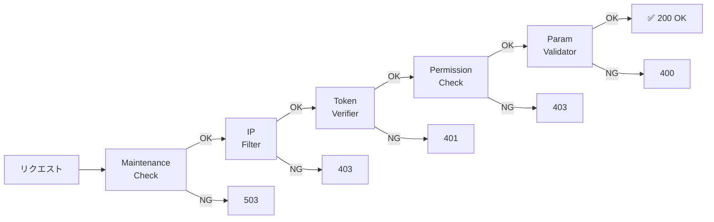

---
categories:
  - tech
date: 2026-03-16T07:07:05+09:00
description: すべてのセキュリティチェックを1つのメソッドに詰め込んだGod Controller。コード探偵ロックがChain of Responsibilityパターンで、独裁的な門番を複数の関所に分離する！
draft: false
epoch: 1773612425
image: /public_images/2026/code-detective-chain-of-responsibility-god-controller/header.webp
iso8601: 2026-03-16T07:07:05+09:00
tags:
  - design-pattern
  - perl
  - moo
  - chain-of-responsibility
  - god-controller
  - refactoring
  - code-detective
title: コード探偵ロックの事件簿【Chain of Responsibility】横暴な門番たち〜肥大化した検問所の解体〜
toc: true
---

最近、私は確信しつつある。この街の「コードの事件」は、すべて私のもとへ流れ着くように運命づけられているのだと。

金曜日の夕方。「レガシー・コード・インベスティゲーション（LCI）」の事務所で、私はロックの散らかしたエナジードリンクの空き缶を片付けていた。なぜ私がこんなことをしているのか。それは、前回の事件のお礼にと持ってきたピザの箱がまだデスクの上に積まれていて、新しい缶の置き場がなくなっていたからだ。

そのとき、事務所のドアが勢いよく開いた。

「あの……コードを調べてくれるって聞いたんですけど……」

息を切らせて飛び込んできたのは、ショートカットの若い女性だった。ノートPCを胸に抱え、目の下にはうっすらとクマが浮かんでいる。

ロックはトリプルモニターから視線を上げ、鼻をひくつかせた。

「……ほう。これはまた濃厚な『におい』だ。セキュリティ系のコードスメルが3種類、いや4種類は混ざっているね」

「え、においって……」

「気にしないでください。この人の癖です」

私は慌てて来客用の椅子を引いた。自己紹介によると、彼女の名前はミカ。スタートアップ企業でAPIゲートウェイを担当しているバックエンドエンジニアだそうだ。

「昨日、認証トークンの有効期限を30分から1時間に変更しただけなんです。たったそれだけなのに……」

ミカの声が震えた。

「公開中の全APIが、認証エラーで落ちました」

---

## 現場検証：肥大化した門番

ミカがノートPCを開き、問題のコードを映し出した。`ApiController.pm` ——APIへのリクエストを受け取り、セキュリティチェックを通して処理を振り分ける、いわばシステムの「正門」だ。

```perl
package ApiController;
use v5.34;
use Moo;

# God Controller - すべてのセキュリティチェックを1つのメソッドに抱え込んでいる
sub dispatch ($self, $request) {
    my $ip     = $request->{ip}     // '';
    my $token  = $request->{token}  // '';
    my $role   = $request->{role}   // '';
    my $path   = $request->{path}   // '';
    my $params = $request->{params} // {};

    # 1. メンテナンスチェック
    if ($self->_is_maintenance_mode()) {
        return { status => 503, body => 'Service Unavailable: Maintenance' };
    }

    # 2. IP制限チェック
    my @blocked_ips = ('192.168.0.100', '10.0.0.99');
    if (grep { $_ eq $ip } @blocked_ips) {
        return { status => 403, body => "Forbidden: IP $ip is blocked" };
    }

    # 3. 認証トークンの検証
    if (!$token || $token ne 'valid-token-abc') {
        return { status => 401, body => 'Unauthorized: Invalid token' };
    }

    # 4. パーミッション（権限）チェック
    if ($path =~ m{^/admin} && $role ne 'admin') {
        return { status => 403, body => 'Forbidden: Admin access required' };
    }

    # 5. パラメータのバリデーション
    if ($path eq '/api/orders' && !$params->{item_id}) {
        return { status => 400, body => 'Bad Request: item_id is required' };
    }

    # --- ようやく本来の処理 ---
    return { status => 200, body => "OK: Processed $path" };
}
```

私は画面を見て、すぐに問題の根深さを理解した。IP制限、トークン検証、権限チェック、パラメータ検証……本来まったく別の責務であるはずのロジックが、たった1つの `dispatch` メソッドの中に全部押し込まれている。

「認証トークンの条件を変えたら、なぜか権限チェックのほうにも影響が出て……どこが壊れたのか、もう追えないんです」

ミカは途方に暮れた顔をしている。

ロックはゆっくりと立ち上がり、モニターに映るコードを指でなぞった。

「入国審査だね、これは」

「入国審査……？」

「空港の入国審査で、たった1人の審査官がパスポートの確認、ビザの審査、税関チェック、荷物検査、さらには検疫まで全部自分でやろうとしたらどうなる？」

「そりゃ、列がパンクしますよね……」

「それだけじゃない。もしその審査官が病気で倒れたら、空港全体が麻痺する。彼が1つの判定基準を間違えたら、無関係な全旅行者が巻き添えを食らう。まさに今、君のシステムで起きていることだ」

ロックはエナジードリンクの缶を掲げた。

「このクラスは『門番（Controller）』を名乗っているが、実態は違う。すべての権限を独り占めして横暴に振る舞う、**肥大化した独裁者（God Controller）**だよ」

---

## 推理披露：関所の連鎖

「じゃあ、どうすればいいんですか？ `dispatch` メソッドをif文ごとに分割して、個別のメソッドに切り出せば……」

私がそう提案すると、ロックは首を振った。

「メソッドに分けただけでは、呼び出す側（dispatch）が各メソッドの存在と順序を知っていなければならない。独裁者が部下に仕事を振っただけで、指揮系統は変わらないままだ」

ロックの指がキーボードの上で踊り始めた。

「必要なのは、独裁者を『解雇』して、それぞれ単一の責務だけを持つ小さな『関所（Handler）』を設置することだ。そして、関所同士を『鎖（Chain）』のようにつなぐ」

### Handler Role の定義

「まず、すべての関所が守るべき『約束事（Role）』を定める」

```perl
package Handler::Role {
    use Moo::Role;

    has 'next_handler' => (is => 'rw', default => sub { undef });

    # チェーンを構築するヘルパーメソッド
    sub set_next ($self, $handler) {
        $self->next_handler($handler);
        return $handler; # メソッドチェーン可能
    }

    # デフォルトの handle: 次のhandlerへ委譲
    sub handle ($self, $request) {
        if ($self->next_handler) {
            return $self->next_handler->handle($request);
        }
        # チェーン末端: すべてのチェックを通過した
        return { status => 200, body => "OK: Processed $request->{path}" };
    }
}
```

「`next_handler` ……次の関所、ということですか？」ミカが訊ねた。

「その通り。各関所は『自分の検査項目だけ』を確認する。問題がなければ、黙って次の関所へ旅行者（リクエスト）を送り出すんだ」

### 各関所の設立

「さて、あの巨大なifの塊を、それぞれ独立した関所に分離しよう」

```perl
package Handler::IpFilter {
    use Moo;
    with 'Handler::Role';

    has 'blocked_ips' => (
        is => 'ro', default => sub { ['192.168.0.100', '10.0.0.99'] }
    );

    sub handle ($self, $request) {
        my $ip = $request->{ip} // '';
        if (grep { $_ eq $ip } @{$self->blocked_ips}) {
            return { status => 403, body => "Forbidden: IP $ip is blocked" };
        }
        # 問題なければ次の関所へ
        return $self->next_handler
            ? $self->next_handler->handle($request)
            : { status => 200, body => "OK: Processed $request->{path}" };
    }
}

package Handler::TokenVerifier {
    use Moo;
    with 'Handler::Role';

    has 'valid_token' => (is => 'ro', default => sub { 'valid-token-abc' });

    sub handle ($self, $request) {
        my $token = $request->{token} // '';
        if (!$token || $token ne $self->valid_token) {
            return { status => 401, body => 'Unauthorized: Invalid token' };
        }
        return $self->next_handler
            ? $self->next_handler->handle($request)
            : { status => 200, body => "OK: Processed $request->{path}" };
    }
}

package Handler::PermissionCheck {
    use Moo;
    with 'Handler::Role';

    sub handle ($self, $request) {
        my $path = $request->{path} // '';
        my $role = $request->{role} // '';
        if ($path =~ m{^/admin} && $role ne 'admin') {
            return { status => 403, body => 'Forbidden: Admin access required' };
        }
        return $self->next_handler
            ? $self->next_handler->handle($request)
            : { status => 200, body => "OK: Processed $request->{path}" };
    }
}
```

「あ……1つの `dispatch` に詰まっていたif文が、それぞれ独立したクラスになっている……！」

ミカが声を上げた。私も見ていて分かった。元のif文の塊が、各Handlerの `handle` メソッドとして切り出されている。だが、まだ疑問が残る。

「でもロックさん、これだとバラバラのクラスがあるだけです。どうやって順番に実行するんですか？」

### 鎖の構築

「いい質問だ、ワトソン君。ここからが『Chain of Responsibility』の真骨頂だよ」

ロックはもう1つ、`Pipeline` クラスを書き上げた。

```perl
package Pipeline {
    use Moo;

    has 'first' => (is => 'rw');

    sub build ($self, @handlers) {
        return undef unless @handlers;
        $self->first($handlers[0]);
        for my $i (0 .. $#handlers - 1) {
            $handlers[$i]->set_next($handlers[$i + 1]);
        }
        return $self;
    }

    sub process ($self, $request) {
        return $self->first->handle($request);
    }
}
```

「これで、ハンドラーを好きな順番で鎖のように連結できる」

```perl
# 標準チェーン（全関所装備）
my $pipeline = Pipeline->new;
$pipeline->build(
    Handler::MaintenanceCheck->new,
    Handler::IpFilter->new,
    Handler::TokenVerifier->new,
    Handler::PermissionCheck->new,
    Handler::ParamValidator->new,
);

my $result = $pipeline->process($request);
```



「リクエストは最初の関所（MaintenanceCheck）に入り、検査に合格すれば次の関所（IpFilter）へ送られる。どこかでNGになれば、その場で弾かれてエラーが返る。すべての関所を通過できた者だけが、最終目的地に辿り着けるというわけさ」

「空港のセキュリティチェックみたい……！」ミカが目を輝かせた。

「まさにその通りだ。そしてここからが一番大事な点だ」

ロックはニヤリと笑った。

### 鎖の組み替え

「もし、特定のAPIだけIP制限を外したいなら？」

```perl
# IP制限なしチェーン（特定APIだけIP制限をスキップ）
my $open_pipeline = Pipeline->new;
$open_pipeline->build(
    Handler::MaintenanceCheck->new,
    # Handler::IpFilter をスキップ！
    Handler::TokenVerifier->new,
    Handler::PermissionCheck->new,
);

# ブロック対象のIPでもアクセスできる！
my $result = $open_pipeline->process({
    ip    => '192.168.0.100',
    token => 'valid-token-abc',
    role  => 'user',
    path  => '/api/public',
});
# => { status => 200, body => 'OK: Processed /api/public' }
```

「えっ……！ チェーンから `IpFilter` を外すだけで、IP制限なしのルートが作れるんですか！？」

「その通り。元の God Controller では、IP制限を外すには `dispatch` メソッドのif文の中を慎重にいじる必要があった。他のチェックを壊さないよう、おっかなびっくりコードを書き換える必要があったはずだ」

ミカは大きく頷いた。まさにそれで苦しんでいたのだ。

「Chain of Responsibility では、関所を足すのも外すのも、鎖のパーツを付け替えるだけ。既存のHandlerのコードには、**1行たりとも触れる必要がない**」

---

## 事件の終わり：検問所の解体

テストスクリプトを実行すると、コンソールに結果が流れた。

```
ok 1 - 正常リクエストは200
ok 2 - ブロックIPは403
ok 3 - 無効トークンは401
ok 4 - 管理者権限不足は403
ok 5 - パラメータ不足は400
ok 6 - IP制限スキップで200（ブロックIPでもOK）
ok 7 - メンテナンスモードで503
```

オールグリーン。

「すごい……全テストがパスしてます。あのゴチャゴチャだったdispatchメソッドが、こんなにスッキリ……」

ミカは信じられないという顔で画面を見つめている。

「もうIP制限を変更しても、トークン検証が壊れることはないのですか？」

「もちろんだ。各関所は自分の担当しか知らない。IPの関所がトークンの関所に口を出すことも、その逆もあり得ない。独裁者がいなくなった今、各関所は自分の職務に集中できるというわけさ」

ロックは満足げに椅子の背にもたれた。

「さらに言えば、将来『レートリミット（アクセス頻度制限）』や『リクエストログ記録』といった新しい関所が必要になった場合も、新しいHandlerクラスを1つ作ってチェーンに差し込むだけだ。既存のコードは一切変更しなくていい」

「門番の権力は、分割してこそ平和が保たれる……ということですね」

私がそう言うと、ロックは珍しく感心したような顔をした。

「ほう。たまには気の利いたことを言うじゃないか、ワトソン君」

「えっ、私ワトソン君じゃ——」

「さて、ミカ君。依頼料の話だが」

ロックはミカのほうを向いた。

「このチェーンのように途絶えることのない、コーヒーのサブスクリプションを1か月分いただこうか。もちろん、チェーンの途中にデカフェの関所を挟むのは禁止だ」

ミカは笑いながら、スマホでコーヒーショップのアプリを開いていた。

帰り道、私はロックに尋ねた。

「Chain of Responsibility って、やっていることは if 文を分割しただけとも言えますよね。それがこんなに効果的だなんて」

「初歩的なことだよ、ワトソン君。1本の太い鎖は折れたら終わりだが、細い鎖をつなげば、1つが壊れても付け替えればいい。ソフトウェア設計とは、壊れ方をコントロールする技術なのさ」

（……なるほど。じゃあ僕とロックの関係も、壊れやすい1本の太い鎖なのかな。いや、勝手につながれた鎖か）

と、心の中で呟きながら、私は事務所への帰路についた。

---

## 探偵の調査報告書

| 容疑（アンチパターン） | 真実（パターン） | 証拠（効果） |
| :--- | :--- | :--- |
| God Controller。1つのメソッドがIP制限・認証・権限チェック・バリデーション等、責務の異なるロジックをすべて抱え込み、巨大なif文のネストになっている状態。1箇所の変更が全APIに波及する。 | Chain of Responsibility パターン。各チェック処理を独立した「Handler」クラスに切り出し、Handlerの鎖（チェーン）をつないでリクエストを順番に通していく設計方式。 | 各Handlerは自分の責務（IP制限、認証等）だけに集中する。Handlerの追加・削除・順序変更はチェーンの組み替えだけで完結し、既存Handlerのコードには触れない。APIごとに異なるチェーンを構成することも容易。 |

### 推理のステップ

1. **Handler Roleの定義**: `next_handler`（次の関所）への参照と `handle`（検査メソッド）を持つRoleを作成し、すべてのHandlerに共通のインターフェースを与える。
2. **Handlerの分離**: God Controllerの各if文ブロックを、それぞれ独立したHandlerクラス（IpFilter, TokenVerifier, PermissionCheck等）として切り出す。
3. **チェーンの構築**: Handlerを順番につなぎ、リクエストが先頭から末端まで流れるパイプラインを構成する。
4. **柔軟なルーティング**: APIごとに異なるHandlerチェーンを組み立てることで、特定のAPIだけIP制限をスキップする等の柔軟な制御を実現する。

### ロックより

ワトソン君。あの門番は、すべてを自分で管理してこそ安全だと信じていたようだが、それは幻想に過ぎなかったね。
権力の集中はコードにおいても危険だ。1つのメソッドがすべてを知り、すべてを裁くような設計は、いつか必ず自らの重みで崩壊する。
Chain of Responsibility――責任の連鎖。各関所が自分の職務だけに忠実であること。それこそが、システム全体の堅牢性を担保する。
さて、次はどんな横暴な独裁者が私の前に引きずり出されるのかな。
