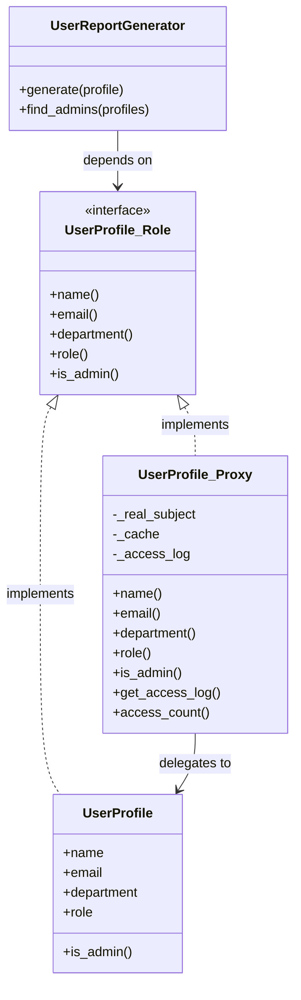

---
categories:
  - tech
date: 2026-03-17T07:07:05+09:00
description: 他クラスの内部ハッシュに直接手を突っ込むInappropriate Intimacy。コード探偵ロックがProxyパターンで、正規の代理人を立てて不法侵入を防ぐ！
draft: false
epoch: 1773698825
image: /public_images/2026/code-detective-proxy-inappropriate-intimacy/header.webp
iso8601: 2026-03-17T07:07:05+09:00
tags:
  - design-pattern
  - perl
  - moo
  - proxy
  - inappropriate-intimacy
  - refactoring
  - code-detective
title: コード探偵ロックの事件簿【Proxy】覗き見る影の代理人〜禁じられた内部への侵入〜
toc: true
---

僕は盗人だった——少なくとも、ロックさんにそう告げられるまでは。

いや、正確に言えば「盗人」という自覚すらなかった。他人の家に堂々と上がり込み、冷蔵庫を開けて中身を漁り、それが当然の権利だと思い込んでいた。そんな自分の愚かさに気づいたのは、つい先週のことだ。

僕の名前はユウキ。社内ERPシステムのバックエンドを担当して3年目になる。今日、僕は雑居ビルの2階にある「レガシー・コード・インベスティゲーション（LCI）」のドアを叩いた。手元の社用ノートPCが、今の僕にとっての唯一の手がかりだった。

事務所の中は相変わらず——いや、「相変わらず」は変だ。僕は今日が初めてだ。だが、先輩から聞いていた通り、デスクの上にはエナジードリンクの空き缶がピラミッド状に積み上がり、トリプルモニターが異様な光を放っている。その奥に、季節外れのトレンチコートを羽織った男が座っていた。

「……ほう」

男——自称コード探偵ロックは、僕を一瞥すると鼻をひくつかせた。

「濃厚なにおいだね。カプセル化の崩壊臭……いや、もっと根深い。これは不法侵入のにおいだ」

「あの、まだ何も説明してないんですけど……」

「説明は不要さ。君の目の下のクマが、少なくとも3日間は `git blame` を睨み続けていたことを物語っている。で、盗んだのは何かね？」

僕は一瞬たじろいだ。だが、もう後には引けない。ノートPCを差し出しながら、正直に告白した。

「僕は……他のチームのクラスの内部データに、直接手を突っ込んでいました」

---

## 現場検証：不法侵入の痕跡

ロックが僕のノートPCを受け取り、画面を覗き込んだ。問題のコードは `UserReportGenerator`——ユーザー情報からレポートを生成するモジュールだ。

```perl
package UserProfile;
use Moo;

# 内部データ（本来は外部から直接触るべきではない）
has '_data' => (
    is      => 'ro',
    default => sub {
        { name => '', email => '', department => '', role => '' }
    },
);

sub BUILD {
    my ($self, $args) = @_;
    my $data = $self->_data;
    $data->{name}       = $args->{name}       // '';
    $data->{email}      = $args->{email}      // '';
    $data->{department} = $args->{department} // '';
    $data->{role}       = $args->{role}       // '';
}
```

「この `UserProfile` は別チームが管理するクラスです。ユーザーの名前やメールアドレスなど、プロフィール情報を内部のハッシュ `_data` に保持しています」

ロックは無言で頷き、次のファイルをスクロールした。

```perl
package UserReportGenerator;
use Moo;

# 💥 Inappropriate Intimacy: 他クラスの内部ハッシュに直接アクセス！
sub generate {
    my ($self, $profile) = @_;
    # _data の内部構造を「知っている」前提でアクセスしている
    my $data = $profile->_data;

    my $name  = $data->{name};
    my $email = $data->{email};
    my $dept  = $data->{department};
    my $role  = $data->{role};

    return <<"REPORT";
=== ユーザーレポート ===
名前: $name
メール: $email
部署: $dept
役職: $role
=======================
REPORT
}

# 💥 内部キーに依存した検索ロジック
sub find_admins {
    my ($self, @profiles) = @_;
    my @admins;
    for my $profile (@profiles) {
        # 内部ハッシュの 'role' キーに直接アクセス
        if ($profile->_data->{role} eq 'admin') {
            push @admins, $profile->_data->{name};
        }
    }
    return @admins;
}
```

「見えたよ、ワトソン君」

ロックの声が、わずかに硬くなった。

「`$profile->_data->{name}` ……君は `UserProfile` の持つ `_data` という内部ハッシュのキー構造を、丸ごと暗記した上でアクセスしている。これがどういう意味か分かるかね？」

「あ、えっと……内部構造が変わったら壊れる……？」

「壊れる、だけじゃない」

ロックは椅子から立ち上がった。珍しく、その表情には笑みがなかった。

「**他人のprivateに手を出すのは、紳士にとって最も恥ずべき行為だよ、ワトソン君**。これはコードスメルの中でも特に悪質な **Inappropriate Intimacy（不適切な親密さ）** と呼ばれるにおいだ」

「不適切な……親密さ……」

「考えてみたまえ。君は他人の家に合鍵で入り込み、冷蔵庫を勝手に開けて中身を漁っていた。家主が台所の配置を変えた途端、『冷蔵庫がない！』と騒いでいるようなものだ。合鍵を持っていること自体が問題なのに」

僕は黙り込んだ。まさにその通りだったからだ。先週、`UserProfile` を管理するチームが内部の `_data` 構造をリファクタリングした。キー名が変更されただけで、僕のレポート生成APIは全滅した。

---

## 推理披露：代理人の設立

「じゃあ、どうすればいいんですか……？ `_data` に直接触らないように、全部アクセサメソッド経由にすればいいんでしょうか」

「それは第一歩に過ぎない。もっと根本的な解決策がある」

ロックはキーボードに向かい、まず `UserProfile` を書き直した。

### RealSubject（実体）の再設計

```perl
package UserProfile;
use Moo;

has 'name'       => (is => 'ro', required => 1);
has 'email'      => (is => 'ro', required => 1);
has 'department' => (is => 'ro', required => 1);
has 'role'       => (is => 'ro', required => 1);

sub is_admin {
    my ($self) = @_;
    return $self->role eq 'admin';
}
```

「まず、内部ハッシュ `_data` は廃止して、きちんとしたアクセサ属性に置き換える。これで家主の家は、正面玄関からしか入れなくなった」

「なるほど。でも、それだけなら単なるリファクタリングですよね？」

「そうだ。ここからが本番さ」

### 共通インターフェース（Role）の制定

ロックは新たなファイルを開いた。

```perl
package UserProfile::Role;
use Moo::Role;

requires 'name';
requires 'email';
requires 'department';
requires 'role';
requires 'is_admin';
```

「これは『約束事（Role）』だ。`UserProfile` に話しかけたい者は、全員このインターフェースを通じて会話する。直接ドアを蹴破ることは、もうできない」

### Proxy（代理人）の召喚

「そして、ここからが今回の推理の核心だ」

ロックの指が加速した。

```perl
package UserProfile::Proxy;
use Moo;
with 'UserProfile::Role';

has '_real_subject' => (
    is => 'ro', required => 1, init_arg => 'real_subject'
);
has '_access_log' => (is => 'rw', default => sub { [] });
has '_cache'      => (is => 'rw', default => sub { {} });

sub _log_access {
    my ($self, $field) = @_;
    push @{$self->_access_log}, {
        field     => $field,
        timestamp => time(),
    };
}

sub _cached_or_fetch {
    my ($self, $field) = @_;
    unless (exists $self->_cache->{$field}) {
        $self->_cache->{$field} = $self->_real_subject->$field();
    }
    $self->_log_access($field);
    return $self->_cache->{$field};
}

# UserProfile と同じインターフェース
sub name       { my ($self) = @_; $self->_cached_or_fetch('name') }
sub email      { my ($self) = @_; $self->_cached_or_fetch('email') }
sub department { my ($self) = @_; $self->_cached_or_fetch('department') }
sub role       { my ($self) = @_; $self->_cached_or_fetch('role') }

sub is_admin {
    my ($self) = @_;
    $self->_log_access('is_admin');
    return $self->_real_subject->is_admin;
}

# Proxy 固有の機能
sub get_access_log { my ($self) = @_; return @{$self->_access_log} }
sub access_count   { my ($self) = @_; return scalar @{$self->_access_log} }
```

「`UserProfile::Proxy` ……代理人……？」

「その通り。この代理人は `UserProfile` の本人とまったく同じインターフェースを持つ。`name`, `email`, `department`, `role`——すべて同じメソッドで呼べる。だが、内部では本物の `UserProfile`（RealSubject）を包んでいるだけだ」

僕は画面を見つめた。Proxyは `_real_subject` として本物のUserProfileを持ち、各メソッドが呼ばれるたびに本体の同名メソッドを呼び出している。

「つまり……クライアント（使う側）からは、本物と代理人の区別がつかない？」

「ご名答。そしてこの代理人には、本体にはない特別な能力が2つある」

ロックはモニターの該当箇所を指差した。

「1つ目はキャッシュ。一度取得した値は `_cache` に保存し、次回以降はRealSubjectに問い合わせることなく即座に返す。2つ目はアクセスログ。誰がいつどのフィールドにアクセスしたかを `_access_log` に記録する」

「キャッシュとログが勝手についてくる……！」

「Mooの `handles` 機能を使えば、単に全メソッドを本体に丸投げするだけのダミーなら1行で作れる。だが、今回わざわざ各メソッドを手書きして罠を張ったのは、代理人にこの『独自の仕事』をさせるためさ。しかも、本物の `UserProfile`（RealSubject）は、自分が代理人に覆われていることを一切知らない。これが Proxy パターン だ」

「ただし、ひとつだけ注意点がある」ロックは指を一本立てた。

「今回は `UserProfile` の属性がすべて読み取り専用（`ro`）だから無条件にキャッシュできる。もし内容が変わる（ミュータブルな）オブジェクトで同じことをやるなら、代理人に『いつ古いキャッシュを破棄するか』を教え込む必要がある。そうしないと、古い情報を返し続けるポンコツ代理人になってしまうからね」



### クライアント側の解放

「さて、最後にワトソン君のレポート生成コードを見てみよう」

```perl
package UserReportGenerator;
use Moo;

# インターフェースのみに依存（内部構造に一切触れない）
sub generate {
    my ($self, $profile) = @_;
    my $name  = $profile->name;
    my $email = $profile->email;
    my $dept  = $profile->department;
    my $role  = $profile->role;

    return <<"REPORT";
=== ユーザーレポート ===
名前: $name
メール: $email
部署: $dept
役職: $role
=======================
REPORT
}

sub find_admins {
    my ($self, @profiles) = @_;
    my @admins;
    for my $profile (@profiles) {
        if ($profile->is_admin) {
            push @admins, $profile->name;
        }
    }
    return @admins;
}
```

僕は目を見開いた。

「`_data` が……消えてる。`$profile->_data->{name}` が `$profile->name` になってる。たったこれだけ？」

「たったこれだけだ。そして何より重要なのは——」

ロックはエナジードリンクの缶を掲げた。

「このコードは、渡されたオブジェクトが本物の `UserProfile` なのか、それとも `UserProfile::Proxy` なのかを一切知らないし、一切気にしない。どちらでも同じように動く」

```perl
# 本物を直接渡してもいい
my $real = UserProfile->new(
    name => '田中太郎', email => 'tanaka@example.com',
    department => '開発部', role => 'admin',
);
$generator->generate($real);

# Proxy で包んで渡してもいい
my $proxy = UserProfile::Proxy->new(real_subject => $real);
$generator->generate($proxy);  # まったく同じ結果！
```

「本物でも代理人でも、同じレポートが出力される。でも代理人を使えば……」

「キャッシュもログも、タダでついてくる。本体のコードは1行たりとも変更不要だ」

---

## 事件の終わり：合鍵の返却

テストを実行すると、コンソールにグリーンの文字列が並んだ。

```
ok 1 - Proxy経由でレポートに名前が含まれる
ok 2 - Proxy経由でレポートにメールが含まれる
ok 3 - Proxy経由でレポートに部署が含まれる
ok 4 - Proxy経由でレポートに役職が含まれる
ok 5 - 管理者は1人
ok 6 - 管理者の名前が正しい
ok 7 - 初期状態ではアクセス回数は0
ok 8 - Proxy経由で正しい名前が取得できる
ok 9 - nameアクセス後は1回
ok 10 - キャッシュされた値は同じ
ok 11 - RealSubject でも同じインターフェースで動作
```

オールグリーン。

「すごい……もう `_data` なんて触る必要がない。しかも、管理チームが `UserProfile` の内部を好きなだけリファクタリングしても、アクセサの契約さえ守ればうちのコードは一切壊れない……！」

「それこそが、合鍵（直接参照）を返却して正面玄関（Proxy / アクセサ）から入る、ということだよ」

ロックは満足げに椅子の背にもたれた。

「Proxyは代理人だ。弁護士に例えるなら分かりやすいだろう。依頼人（RealSubject）の代わりに法廷（クライアント）に立ち、同じ口を利く。だが、弁護士は独自の判断で証拠の整理（キャッシュ）や対話の記録（ログ）を行うことができる。依頼人の私生活に立ち入ることなく、ね」

「代理人が守ってくれるから、僕たちは安心して窓口だけを見ていればいい……」

「さて、ワトソン君。依頼料だが」

ロックは僕のほうを向いた。

「合鍵なしでは直接入れない、完全予約制の寿司屋があるんだ。ランチ1回分、おごってもらおうか」

「……それはつまり、僕の財布の中身にインターフェース経由でアクセス許可を求めている、ということですか？」

「初歩的なことだよ、ワトソン君。紳士は他人の財布の中身を直接覗いたりはしないのさ。それに、あの店の電話口に出る女将さんは実に優秀な『代理人』でね。いつ・誰が予約したかのログを取り、常連の好みを完璧にキャッシュしている。おかげで奥の大将は、客の接待に煩わされることなく、ただひたすら寿司を握るという本来の仕事に専念できる」

（……結局、ロックさんの財布の代理人にされるのは変わらないんだけど）

と心の中で呟きながら、僕は優秀な代理人が待つ寿司屋の予約番号をスマホで調べ始めた。

---

## 探偵の調査報告書

| 容疑（アンチパターン） | 真実（パターン） | 証拠（効果） |
| :--- | :--- | :--- |
| Inappropriate Intimacy（不適切な親密さ）。他クラスの内部データ構造（`_data` ハッシュ）に直接アクセスし、その内部キー名やデータ配置に依存するコードが蔓延している状態。内部構造の変更で即座に全壊する。 | Proxy パターン。本物のオブジェクト（RealSubject）と同じインターフェースを持つ「代理人（Proxy）」を設置し、クライアントは代理人越しにのみアクセスする設計方式。 | クライアントはオブジェクトの内部構造に一切依存しなくなる。さらにProxy内にキャッシュ・アクセスログ・認可チェック等の横断的関心事を透過的に追加でき、RealSubject側のコードは完全に無変更で済む。 |

### 推理のステップ

1. **内部ハッシュの廃止**: `_data` ハッシュへの直接アクセスをやめ、`UserProfile` に正規のアクセサ属性（`name`, `email`, `department`, `role`）を定義する。
2. **共通インターフェース（Role）の制定**: RealSubjectとProxyが共有する `UserProfile::Role` を定義し、メソッドの契約を明示する。
3. **Proxyクラスの作成**: RealSubjectを内包し、同じインターフェースを実装する `UserProfile::Proxy` を作成。内部でキャッシュとアクセスログを追加する。
4. **クライアントの解放**: `UserReportGenerator` はインターフェースのみに依存し、RealSubjectもProxyも区別なく受け取れるようにする。

### ロックより

ワトソン君。他人の家に合鍵で侵入することを、君は「効率的なショートカット」だと思っていたようだね。
だが、ショートカットとは本来、正規のルートを知った上で選択するものだ。正規のルートすら設計していないものは、ただの不法侵入に過ぎない。

Proxy——代理人。それは本人の代わりに窓口に立ち、訪問者と本人の間に「礼儀正しい距離」を保つ存在だ。
この距離があるからこそ、本人は安心して自分の家（内部構造）を模様替えでき、訪問者は窓口の作法（インターフェース）さえ守れば何も困らない。

紳士とは、他人の内面に踏み込まない者のことだよ。コードにおいても、人間関係においても。
さて、次はどんな不届き者が合鍵を握りしめて私の前に現れるのかな。
