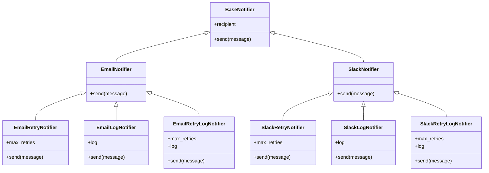
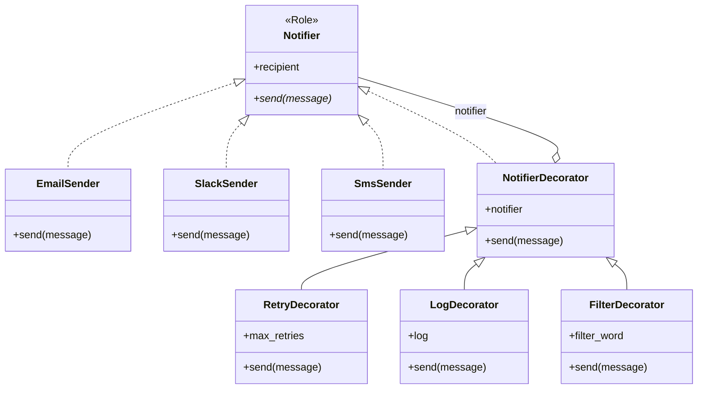

---
categories:
  - tech
date: 2026-03-23T07:07:05+09:00
description: 通知システムの保守を引き継いだら、サブクラスが30個以上。機能の組み合わせごとにクラスが爆発する地獄を、Decoratorパターンで「重ね着」に変えるコード探偵ロックの推理。
draft: false
epoch: 1774217225
image: /public_images/2026/code-detective-decorator/header.webp
iso8601: 2026-03-23T07:07:05+09:00
tags:
  - design-pattern
  - perl
  - moo
  - decorator
  - combinatorial-explosion
  - refactoring
  - code-detective
title: コード探偵ロックの事件簿【Decorator】二十面相のコード〜終わらない継承の連鎖〜
toc: true
---

「助けてください！ 通知システムのサブクラスが30個以上あって、もう1個も増やせないんです！」

私は佐伯。中堅SaaS企業でバックエンドを担当して5年になる。先月まではそれなりに自信もあった。通知システムの保守を引き継ぐまでは。

前任の山岸先輩は、退職前に分厚い引き継ぎ資料を残してくれた。そこには「通知機能を拡張するときは、既存クラスを継承して新しいサブクラスを作ること」と書かれていた。親切な指示だと思った。最初の1週間だけは。

メール通知。Slack通知。リトライ付きメール通知。ログ付きSlack通知。リトライ＋ログ付きメール通知。リトライ＋ログ付きSlack通知――。

サブクラスの一覧をExcelに書き出したとき、私は自分の目を疑った。30を超えていた。そして今朝、上司がにこやかに言った。

「佐伯さん、SMS通知も追加してもらえる？ 来週までに」

その瞬間、私の視界が暗くなった。SMS通知を追加するということは、既存の組み合わせの数だけ新しいサブクラスが必要になるということだ。私はノートPCを抱え、雑居ビルの薄暗い階段を駆け上がった。

「レガシー・コード・インベスティゲーション（LCI）」

ガラス扉の文字が目に入る。ドアを引くと、サーバーラックの排熱とエナジードリンクの甘い残り香が鼻を突いた。革張りの椅子にふんぞり返った男が、私のノートPCを一瞥してから顔を見た。

「おやおや。ずいぶん分厚い紙束だね、ワトソン君。容疑者リストかね？」

「佐伯です。容疑者じゃなくてサブクラスの一覧です。30個以上あるんです」

自称「コード探偵」のロックは紙束を受け取り、鼻を近づけてにおいを嗅ぐような仕草をした。何をしているのかは聞かないことにした。

「ふむ……この犯人は**変装の名人**だよ、ワトソン君。30の顔を持っているが、正体は一つだ」

## 現場検証：三十の仮面

「まず全貌を見せたまえ」

私はクラスの継承ツリーを開いた。



「見てください。`EmailRetryNotifier`、`EmailLogNotifier`、`EmailRetryLogNotifier`……メール側だけでこれです。Slack側にも全く同じ組み合わせがあって、リトライのロジックなんてコピペです」

ロックは椅子の背もたれに深く沈み込み、天井を見上げた。

「初歩的なにおいだよ、ワトソン君。犯人は**組み合わせ爆発**——継承の仮面を被り、分身を無限に増やす怪人だ」

**【Before】サブクラスが爆発した通知システム**

```perl
package BaseNotifier {
    use Moo;
    has recipient => ( is => 'ro', required => 1 );

    sub send ($self, $message) {
        die "send() must be overridden";
    }
}

package EmailNotifier {
    use Moo;
    extends 'BaseNotifier';

    sub send ($self, $message) {
        return "[Email to " . $self->recipient . "] $message";
    }
}

package SlackNotifier {
    use Moo;
    extends 'BaseNotifier';

    sub send ($self, $message) {
        return "[Slack to " . $self->recipient . "] $message";
    }
}
```

ここまではいい。問題はここからだ。

```perl
# Email + Retry
package EmailRetryNotifier {
    use Moo;
    extends 'EmailNotifier';

    has max_retries => ( is => 'ro', default => 3 );

    sub send ($self, $message) {
        my $result;
        for my $attempt (1 .. $self->max_retries) {
            $result = $self->SUPER::send($message);
            last if $result;
        }
        return "$result (retried up to " . $self->max_retries . " times)";
    }
}

# Email + Log
package EmailLogNotifier {
    use Moo;
    extends 'EmailNotifier';

    has log => ( is => 'rw', default => sub { [] } );

    sub send ($self, $message) {
        my $result = $self->SUPER::send($message);
        push @{$self->log}, "LOG: $result";
        return $result;
    }
}

# Email + Retry + Log（両方必要 → また新しいサブクラス！）
package EmailRetryLogNotifier {
    use Moo;
    extends 'EmailNotifier';

    has max_retries => ( is => 'ro', default => 3 );
    has log         => ( is => 'rw', default => sub { [] } );

    sub send ($self, $message) {
        my $result;
        for my $attempt (1 .. $self->max_retries) {
            $result = $self->SUPER::send($message);
            last if $result;
        }
        $result = "$result (retried up to " . $self->max_retries . " times)";
        push @{$self->log}, "LOG: $result";
        return $result;
    }
}
```

「そしてSlack側にも、まったく同じリトライとログのロジックがコピペされている」

```perl
# Slack + Retry（Emailと同じリトライロジックをコピペ！）
package SlackRetryNotifier {
    use Moo;
    extends 'SlackNotifier';

    has max_retries => ( is => 'ro', default => 3 );

    sub send ($self, $message) {
        my $result;
        for my $attempt (1 .. $self->max_retries) {
            $result = $self->SUPER::send($message);
            last if $result;
        }
        return "$result (retried up to " . $self->max_retries . " times)";
    }
}

# Slack + Retry + Log（もはやカオス）
package SlackRetryLogNotifier {
    use Moo;
    extends 'SlackNotifier';

    has max_retries => ( is => 'ro', default => 3 );
    has log         => ( is => 'rw', default => sub { [] } );

    sub send ($self, $message) {
        my $result;
        for my $attempt (1 .. $self->max_retries) {
            $result = $self->SUPER::send($message);
            last if $result;
        }
        $result = "$result (retried up to " . $self->max_retries . " times)";
        push @{$self->log}, "LOG: $result";
        return $result;
    }
}
```

「通知先2種 × 機能3パターンで、すでにサブクラスが6つ。ここにフィルタ機能を足すと2の4乗で……ここにSMS通知を追加したら……」

私は計算するのをやめた。

ロックは立ち上がり、ホワイトボードに数式を書いた。

「通知先N種 × 機能の組み合わせ2のM乗。通知先3種で機能が4つなら、最大で48クラス。君の先輩は**怪人四十八面相**を量産していたのだよ」

「先輩を悪く言わないでください……でも、どうすればいいんですか？ 継承以外に機能を追加する方法なんて……」

ロックは薄く笑った。

「**変装を剥がすのではない。重ね着の技法を教えてやるのさ**」

## 推理披露：重ね着の技法（Decorator）

「ワトソン君。君が着ているコートの上にマフラーを巻き、さらに帽子を被ったとしよう。コートもマフラーも帽子も、それぞれ独立した『装飾品』だ。コートを脱いでもマフラーは残る。帽子だけ外すこともできる」

「はあ……」

「だが今の君のコードは、『コート＋マフラー』専用の服を1着、『コート＋帽子』専用の服を1着、すべての組み合わせ分の一体型スーツを仕立てているのだよ。着替えるたびに全身を脱がなければならない」

言われてみれば、確かにそうだ。リトライとログを別々の「装飾品」として扱えれば、組み合わせごとに新しいクラスを作る必要はない。

「まず、共通のインターフェースを決める」

**【After】共通ロール（インターフェース）の定義**

```perl
package Notifier {
    use Moo::Role;
    requires 'send';
    has recipient => ( is => 'ro', required => 1 );
}
```

「Mooの `Role` だね。`send` メソッドを持つものはすべて `Notifier` として扱える。メール送信もSlack送信も、リトライもログも、全員がこの契約を守る」

**【After】基本の通知クラス（具象コンポーネント）**

```perl
package EmailSender {
    use Moo;
    with 'Notifier';

    sub send ($self, $message) {
        return "[Email to " . $self->recipient . "] $message";
    }
}

package SlackSender {
    use Moo;
    with 'Notifier';

    sub send ($self, $message) {
        return "[Slack to " . $self->recipient . "] $message";
    }
}

package SmsSender {
    use Moo;
    with 'Notifier';

    sub send ($self, $message) {
        return "[SMS to " . $self->recipient . "] $message";
    }
}
```

「SMS通知を追加するには `SmsSender` を1つ作るだけ。それだけだよ」

「え、本当にそれだけ……？」

「慌てるなワトソン君。ここからが本題だ」

ロックはホワイトボードに大きく「Decorator」と書いた。

**【After】Decorator基底クラスと具象Decorator**

```perl
# Decorator基底クラス
package NotifierDecorator {
    use Moo;
    with 'Notifier';

    has notifier => ( is => 'ro', required => 1 );

    has '+recipient' => ( required => 0, lazy => 1, default => sub ($self) {
        $self->notifier->recipient;
    });

    sub send ($self, $message) {
        return $self->notifier->send($message);
    }
}

# リトライ機能を追加するDecorator
package RetryDecorator {
    use Moo;
    extends 'NotifierDecorator';

    has max_retries => ( is => 'ro', default => 3 );

    sub send ($self, $message) {
        my $result;
        for my $attempt (1 .. $self->max_retries) {
            $result = $self->notifier->send($message);
            last if $result;
        }
        return "$result (retried up to " . $self->max_retries . " times)";
    }
}

# ログ記録を追加するDecorator
package LogDecorator {
    use Moo;
    extends 'NotifierDecorator';

    has log => ( is => 'rw', default => sub { [] } );

    sub send ($self, $message) {
        my $result = $self->notifier->send($message);
        push @{$self->log}, "LOG: $result";
        return $result;
    }
}

# フィルタリングを追加するDecorator
package FilterDecorator {
    use Moo;
    extends 'NotifierDecorator';

    has filter_word => ( is => 'ro', required => 1 );

    sub send ($self, $message) {
        if (index($message, $self->filter_word) >= 0) {
            return "[FILTERED] Message contained '" . $self->filter_word . "'";
        }
        return $self->notifier->send($message);
    }
}
```

私は画面を食い入るように見つめた。

「`NotifierDecorator` が内側に `notifier` を持っていて、`send` を呼ぶと内側に委譲する……。各Decoratorは、委譲の前後に自分の仕事だけ追加しているんですね」

「その通り。**証拠品を保護袋で包む**ようなものだ。中身はそのまま、外側の袋が機能を追加する。袋は何枚でも重ねられるし、どの順番でも構わない」



「そしてこれが、使う側のコードだ」

**【After】Decoratorを自由に組み合わせる**

```perl
# Email + Retry + Log（かつて EmailRetryLogNotifier だったもの）
my $notifier = LogDecorator->new(
    notifier => RetryDecorator->new(
        notifier => EmailSender->new(recipient => 'user@example.com'),
    ),
);
$notifier->send("サーバー障害が発生しました");

# SMS + Retry + Filter（新しいクラスは一切不要！）
my $sms = FilterDecorator->new(
    notifier    => RetryDecorator->new(
        notifier => SmsSender->new(recipient => '090-1234-5678'),
    ),
    filter_word => 'test',
);
$sms->send("本番アラート");
```

「30個のサブクラスが……基本3つとDecorator3つの、合計6つに？」

「すべての不吉な継承を排除して残ったものが、いかにシンプルであっても、それが真実（デザインパターン）なんだ」

## 解決：仮面の怪人の正体

ロックがテストを実行すると、ターミナルに整然とした結果が並んだ。

```bash
$ prove -v t/01_decorator.t
# Subtest: Problem: Combinatorial Explosion of Subclasses
    ok 1 - Basic notifiers work
    ok 2 - Email + Retry subclass
    ok 3 - Email + Log subclass
    ok 4 - Email + Retry + Log subclass (copy-paste hell)
    ok 5 - Slack + Retry subclass (duplicated retry logic)
    ok 6 - Slack + Retry + Log subclass (more duplication)
    ok 7 - PROBLEM: Adding SMS would require 4+ more subclasses
ok 1 - Problem: Combinatorial Explosion of Subclasses
# Subtest: Solution: Decorator Pattern
    ok 1 - Basic senders work
    ok 2 - RetryDecorator wraps any notifier
    ok 3 - LogDecorator wraps any notifier
    ok 4 - FilterDecorator blocks matching messages
    ok 5 - Decorators can be stacked freely
    ok 6 - Adding SMS requires only ONE new class
    ok 7 - Recipient is delegated from inner notifier
ok 2 - Solution: Decorator Pattern
All tests successful.
```

「Beforeではメールとリトライの組み合わせのためだけに専用クラスが必要だった。Afterでは `RetryDecorator` がメールにもSlackにもSMSにも使える。**一枚のマフラーがどのコートにも合う**のと同じことだ」

「すごい……。じゃあ、もしWebhook通知を追加しろって言われたら？」

「`WebhookSender` を1つ作るだけだ。既存のDecoratorはそのまま使える」

「1つ……だけ？」

私は思わず目頭が熱くなった。あの30個のサブクラスを前に、毎晩遅くまでコピペを繰り返していた自分が馬鹿みたいだ。

「報酬は……そうだな、このクラス階層の深さと同じミリリットル数のバーボンをいただこうか。いや待て、Beforeの継承ツリーの深さだぞ。Afterのほうを基準にされては、舌を湿らすことすらできん」

「先輩のコードをここまで見事に片付けてくれたんです。バーボンくらいお安い御用です！」

「ふむ。ワトソン君、最後に一つ」

ロックは人差し指を立てた。

「Decoratorは**実行時に自由に組み合わせたい場面**で威力を発揮する。だが、組み合わせが常に固定で変わらないのなら、わざわざDecoratorにする必要はない。怪人二十面相を捕まえたからといって、すべての市民に変装術を教える必要はないのだよ」

私はPCを閉じて立ち上がった。来週のSMS通知、もう怖くない。

---
## 探偵の調査報告書

| 容疑（アンチパターン） | 真実（パターン） | 証拠（効果） |
| :--- | :--- | :--- |
| 組み合わせ爆発（Combinatorial Explosion）。機能の組み合わせごとにサブクラスを作成し、通知先N × 機能2のM乗のクラスが乱立。同じロジックが複数のサブクラスにコピペされ、新しい通知先や機能の追加で爆発的にクラス数が増加する。 | Decorator パターン。共通インターフェース（Role）を通じて、基本の通知クラスに機能を「重ね着」のように動的に追加する設計方式。各機能を独立したDecoratorクラスに分離し、委譲によって自由に組み合わせる。 | クラス数が30以上から約6に削減。新しい通知先の追加は1クラスのみ。リトライ・ログ・フィルタの各ロジックが1箇所に集約され、コピペが完全に解消。 |

### 推理のステップ

1. **共通インターフェースを定義する**: すべての通知クラスとDecoratorが守るべき契約（`send` メソッド）をRoleとして定義する。
2. **基本コンポーネントを分離する**: メール送信、Slack送信など、純粋な通知機能だけを持つクラスを作る。「送る」以外の責務を持たせない。
3. **Decorator基底クラスを作る**: 内側に `notifier` を保持し、デフォルトでは委譲するだけの基底クラスを用意する。
4. **各機能をDecoratorとして実装する**: リトライ、ログ、フィルタなど、付加的な機能をそれぞれ独立したDecoratorクラスに切り出す。委譲の前後に自分の処理を挟む。
5. **利用側で自由に組み合わせる**: 必要なDecoratorを必要なだけネストして、実行時に通知パイプラインを構築する。

### ロックより

ワトソン君。継承は便利な道具だが、「機能の追加＝サブクラスの追加」という思い込みに縛られると、クラスは恐ろしい速度で増殖する。怪人二十面相の変装のように、見かけは違っても中身は同じコピペが何十体も並ぶことになる。

Decoratorは「重ね着」の発想だ。コートの上にマフラーを巻き、その上に帽子を被る。どれも独立した装飾品であり、自由に着脱できる。コート専用マフラーや、マフラー一体型帽子を仕立てる必要はないのだよ。

ただし、重ね着の順番が結果に影響する場合がある。フィルタの後にリトライするのか、リトライの後にフィルタするのかで挙動は変わる。自由には責任が伴う。それを忘れなければ、君の通知システムは何十通りの組み合わせにも、たった数枚の衣装で対応できるだろう。
