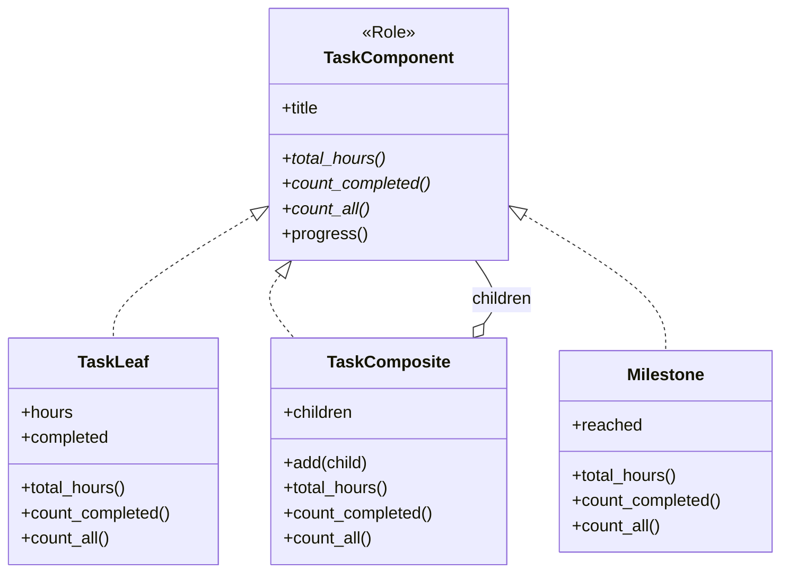

---
categories:
  - tech
date: 2026-03-24T07:07:05+09:00
description: タスク管理ツールにサブタスク機能を追加したら、進捗計算の関数すべてにif文が増殖。ツリー構造を統一する「Compositeパターン」で型チェック地獄を解消するコード探偵ロックの推理。
draft: false
epoch: 1774303625
image: /public_images/2026/code-detective-composite/header.webp
iso8601: 2026-03-24T07:07:05+09:00
tags:
  - design-pattern
  - perl
  - moo
  - composite
  - type-check-dispatch
  - refactoring
  - code-detective
title: コード探偵ロックの事件簿【Composite】地下組織の系譜図〜末端まで届かない指令〜
toc: true
---

「進捗率を出すだけの関数なのに、タスクの階層が深くなるとバグるんです。しかも今度、マイルストーン機能を追加しろって……」

私は高橋。中堅SIerでエンジニアを8年やっている。去年までは受託開発の現場をいくつも渡り歩いてきたが、半年前に自社プロダクトの開発チームに異動になった。社内PMツール「TaskFlow」の保守が、私の新しい仕事だ。

TaskFlowは元々フラットなタスクリストだった。タスクを作って、完了にチェックを入れて、進捗率が出る。それだけのシンプルなツールだった。ところが前任者が退職する直前に「サブタスク機能」を追加した。タスクの下に子タスクを作れるようになり、さらにユーザーから「サブタスクにもサブタスクを付けたい」という要望が来て、孫タスクにも対応した。

問題はそこからだ。進捗率を計算する関数。工数を合計する関数。完了数をカウントする関数。どの関数にも「これはタスクか？ タスクグループか？」を判定するif文が入っていて、階層が増えるたびにバグが出る。

そして今朝、プロダクトマネージャーが笑顔で言った。

「高橋さん、マイルストーン機能も追加してもらえますか？ 次のスプリントで」

マイルストーン。工数はゼロだが、完了/未完了の状態を持つ新しいノード。つまり、あのif文がすべての関数でもう1分岐増える。

私は嫌な予感を覚えながら、雑居ビルの階段を上がった。

「レガシー・コード・インベスティゲーション（LCI）」

ガラス扉を開けると、キーボードの打鍵音とエナジードリンクの甘い残り香。革張りの椅子に沈み込んだ男が、私の顔を見る前にモニターに映った何かを睨んでいた。

「……ふむ。ワトソン君、少し待ちたまえ。今この正規表現の犯人を追い詰めているところだ」

「高橋です。初めてなんですが……」

「初めてだろうと百回目だろうと、ここに来た者は皆ワトソン君だ。それで、今日の事件は？」

自称「コード探偵」のロックに、私はTaskFlowのコードを見せた。

## 現場検証：分断された指令系統

「まず全貌を見せたまえ」

私はタスクのデータ構造を開いた。

```perl
package Task {
    use Moo;
    has title     => ( is => 'ro', required => 1 );
    has hours     => ( is => 'ro', default => 0 );
    has completed => ( is => 'rw', default => 0 );
}

package TaskGroup {
    use Moo;
    has title    => ( is => 'ro', required => 1 );
    has children => ( is => 'ro', default => sub { [] } );

    sub add ($self, $child) {
        push @{$self->children}, $child;
    }
}
```

「ここまではいいんです。問題はここからで……」

私は工数集計や進捗率計算の関数を開いた。

```perl
sub total_hours ($node) {
    if (ref $node eq 'Task') {
        return $node->hours;
    } elsif (ref $node eq 'TaskGroup') {
        my $sum = 0;
        $sum += total_hours($_) for @{$node->children};
        return $sum;
    } else {
        die "Unknown node type: " . ref $node;
    }
}

sub count_completed ($node) {
    if (ref $node eq 'Task') {
        return $node->completed ? 1 : 0;
    } elsif (ref $node eq 'TaskGroup') {
        my $count = 0;
        $count += count_completed($_) for @{$node->children};
        return $count;
    } else {
        die "Unknown node type: " . ref $node;
    }
}

sub count_all ($node) {
    if (ref $node eq 'Task') {
        return 1;
    } elsif (ref $node eq 'TaskGroup') {
        my $count = 0;
        $count += count_all($_) for @{$node->children};
        return $count;
    } else {
        die "Unknown node type: " . ref $node;
    }
}

sub progress ($node) {
    my $total = count_all($node);
    return 0 unless $total;
    return count_completed($node) / $total * 100;
}
```

「見てください。`total_hours`、`count_completed`、`count_all`……全部同じ構造のif文です。`ref $node eq 'Task'` か `'TaskGroup'` かで分岐して、グループなら再帰する。ここにマイルストーンを追加したら、3つの関数すべてに `elsif` を足さないと……」

ロックは私の言葉を遮るように手を上げた。

「初歩的なにおいだよ、ワトソン君」

ロックは立ち上がり、ホワイトボードにツリー構造を描き始めた。

「この構造は**地下組織の系譜図**と同じだ。ボスの下に幹部がいて、幹部の下に構成員がいる。だが君のコードは、ボスに報告を求めるときと構成員に報告を求めるときで、**まったく別の手順書**を使っている」

「手順書……ですか？」

「そうだ。`ref` で相手の肩書きを確認し、肩書きごとに違う命令を出している。新しい役職——たとえば『連絡員（マイルストーン）』——が組織に加わったら、**すべての手順書を書き直す**必要がある。こんな組織は統率がとれていない」

ロックはツリーの各ノードに×印を付けていった。

「関数が3つで済んでいるうちはまだいい。だが表示処理やエクスポート機能が加われば、同じif文はさらに増殖する。そしてどこか1つの関数で `Milestone` を書き忘れれば——」

「実行時にクラッシュする……」

「**型チェックの散在**。これが今回の犯人だよ、ワトソン君」

## 推理披露：統一された命令系統（Composite）

「ワトソン君。よく統率された組織とは、どういうものだと思う？」

「えっと……命令系統が一本化されている、とか？」

「悪くない。もう一歩踏み込もう。**ボスも幹部も末端の構成員も、同じ命令に同じ形式で応答する**。ボスに『工数を報告せよ』と言えば、ボスは部下たちに同じ命令を伝え、集まった報告を集約して返す。末端の構成員は自分の工数をそのまま返す。**命令する側は、相手がボスか構成員かを知る必要がない**」

「相手が誰かを気にせず、同じ命令を出せる……」

「それがCompositeパターンだ。まず、全員が守る**掟**を定める」

**【After】共通の掟（TaskComponentロール）**

```perl
package TaskComponent {
    use Moo::Role;
    requires 'total_hours';
    requires 'count_completed';
    requires 'count_all';

    has title => ( is => 'ro', required => 1 );

    sub progress ($self) {
        my $total = $self->count_all;
        return 0 unless $total;
        return $self->count_completed / $total * 100;
    }
}
```

「`TaskComponent` は組織の**掟**だ。この掟に従う者は、必ず `total_hours`、`count_completed`、`count_all` に応答できなければならない。`progress` はこの3つから自動的に計算される——掟に組み込まれた共通ロジックだ」

「Moo::Role で共通のインターフェースを定義して、`progress` だけはデフォルト実装を持たせるんですね」

「次に、末端の構成員だ」

**【After】末端の構成員（TaskLeaf）**

```perl
package TaskLeaf {
    use Moo;
    with 'TaskComponent';

    has hours     => ( is => 'ro', default => 0 );
    has completed => ( is => 'rw', default => 0 );

    sub total_hours ($self) { $self->hours }
    sub count_completed ($self) { $self->completed ? 1 : 0 }
    sub count_all ($self) { 1 }
}
```

「末端はシンプルだ。自分の工数、自分の完了状態、自分は1人。それだけを報告する」

「Before の `if (ref $node eq 'Task')` の中身が、そのままメソッドになっただけ……？」

「その通り。では次に、**幹部**——子を持つノードだ」

**【After】幹部（TaskComposite）**

```perl
package TaskComposite {
    use Moo;
    with 'TaskComponent';

    has children => ( is => 'ro', default => sub { [] } );

    sub add ($self, $child) {
        push @{$self->children}, $child;
        return $self;
    }

    sub total_hours ($self) {
        my $sum = 0;
        $sum += $_->total_hours for @{$self->children};
        return $sum;
    }

    sub count_completed ($self) {
        my $count = 0;
        $count += $_->count_completed for @{$self->children};
        return $count;
    }

    sub count_all ($self) {
        my $count = 0;
        $count += $_->count_all for @{$self->children};
        return $count;
    }
}
```

「幹部は自分では作業しない。部下に同じ命令を伝え、返ってきた報告を集約する。そして重要なのは——**部下が末端の構成員でも、別の幹部でも、同じ方法で命令を出している**ということだ」

私は画面を見つめて、少しずつ理解が追いついてきた。

「`$_->total_hours` を呼んでいるだけで、相手が `TaskLeaf` なのか `TaskComposite` なのか、一切チェックしていない……！」

「よろしい。`ref` による身元確認は不要になった。全員が同じ掟に従っているからだ」

ロックはホワイトボードに新しい図を描いた。



「そして——ワトソン君が恐れていたマイルストーンの追加だ」

**【After】新たな構成員（Milestone）**

```perl
package Milestone {
    use Moo;
    with 'TaskComponent';

    has reached => ( is => 'rw', default => 0 );

    sub total_hours ($self) { 0 }
    sub count_completed ($self) { $self->reached ? 1 : 0 }
    sub count_all ($self) { 1 }
}
```

「……え、これだけですか？」

「これだけだ。`TaskComponent` の掟に従うクラスを1つ作る。既存のコードは一切変更しない。`TaskComposite` は子が何者であろうと `total_hours` を呼ぶだけだからね。マイルストーンだろうと、将来追加される『レビュー待ち』ノードだろうと同じだ」

「Before だったら、3つの関数すべてに `elsif (ref $node eq 'Milestone')` を追加して……」

「そして4つ目の関数でそれを忘れてバグを出す。**開放閉鎖原則**——拡張に対して開き、修正に対して閉じている。Compositeはそれを自然に実現する」

「使う側のコードも見せてもらえますか？」

**【After】組織を編成する**

```perl
# プロジェクト（ルート）
my $project = TaskComposite->new(title => 'Website Redesign');

# フェーズ1（サブグループ）
my $phase1 = TaskComposite->new(title => 'Design Phase');
$phase1->add(TaskLeaf->new(title => 'Wireframe',  hours => 8, completed => 1));
$phase1->add(TaskLeaf->new(title => 'Mockup',     hours => 16, completed => 1));
$phase1->add(TaskLeaf->new(title => 'Review',     hours => 4, completed => 0));

# フェーズ2（サブグループ + マイルストーン）
my $phase2 = TaskComposite->new(title => 'Implementation');
$phase2->add(TaskLeaf->new(title => 'Frontend',   hours => 40, completed => 0));
$phase2->add(TaskLeaf->new(title => 'Backend',    hours => 32, completed => 0));
$phase2->add(Milestone->new(title => 'Beta Release', reached => 0));

$project->add($phase1);
$project->add($phase2);

# どの階層に対しても同じメソッドを呼ぶだけ
$project->total_hours;   # => 100
$project->progress;      # => 28.57... (2/7 completed)
$phase1->progress;       # => 66.67... (2/3 completed)
```

「`$project->total_hours` も `$phase1->total_hours` も、同じメソッド呼び出し……。プロジェクト全体でもフェーズ単位でも、タスク単体でも、同じインターフェースで操作できるんですね」

「**組織のどの階層を切り取っても、同じ命令系統が通る**。ボスに聞いても幹部に聞いても末端に聞いても、報告の形式は変わらない。それがCompositeの本質だ」

## 解決：組織に秩序が戻る日

ロックがテストを実行すると、ターミナルに整然とした結果が並んだ。

```bash
$ prove -v t/01_example1.t
# Subtest: Problem: Type Checking Dispatch
    ok 1 - total_hours for single task
    ok 2 - count_completed for done task
    ok 3 - count_completed for pending task
    ok 4 - total_hours for group
    ok 5 - count_completed for group
    ok 6 - count_all for group
    ok 7 - progress for group
    ok 8 - total_hours for nested groups
    ok 9 - count_all for nested groups
    ok 10 - PROBLEM: new node type causes die
ok 1 - Problem: Type Checking Dispatch
# Subtest: Solution: Composite Pattern
    ok 1 - TaskLeaf total_hours
    ok 2 - TaskLeaf count_completed (done)
    ok 3 - TaskLeaf count_all
    ok 4 - TaskLeaf count_completed (pending)
    ok 5 - TaskComposite aggregates total_hours
    ok 6 - TaskComposite aggregates count_completed
    ok 7 - TaskComposite aggregates count_all
    ok 8 - progress calculated via Role
    ok 9 - deeply nested: total_hours
    ok 10 - deeply nested: count_all
    ok 11 - deeply nested: count_completed
    ok 12 - deeply nested: progress
    ok 13 - Milestone: total_hours is 0
    ok 14 - Milestone: counts as completed when reached
    ok 15 - Milestone: counts as 1 node
    ok 16 - Milestone integrates: count_all updated
    ok 17 - Milestone integrates: count_completed updated
    ok 18 - Milestone integrates: progress updated
    ok 19 - Milestone integrates: total_hours unchanged
ok 2 - Solution: Composite Pattern
All tests successful.
```

「Before ではテスト10を見てください。`Milestone` を渡した瞬間に `Unknown node type` で死んでいます。After では、`TaskComponent` の掟に従うだけで既存のツリーにそのまま組み込める」

「テスト16から19がすごいですね。Milestone をツリーに追加した後も、プロジェクト全体の集計が自然に更新されている……」

「当然だ。幹部が部下に命令を委譲し、部下がさらにその部下に委譲する。組織の深さに上限はない。これがCompositeの**再帰的な強さ**だ」

「感動しました……。これなら次に『レビュー待ち』ノードを追加しろって言われても、クラスを1つ書くだけですね」

ロックは椅子に深く沈み込み、エナジードリンクの缶を手に取った。

「報酬は——そうだな。この組織の階層の深さと同じ杯数のエスプレッソをいただこうか」

「3階層なので3杯ですね。Before の `if` のネスト数じゃなくて良かった……」

「ふん。ワトソン君、最後に一つ」

ロックは人差し指を立てた。

「Compositeは**ツリー構造を統一的に扱いたい場面**で威力を発揮する。だが、世の中のすべてのデータがツリーである必要はない。フラットなリストで十分なところに無理にCompositeを持ち込むのは、**2人しかいない部署に組織図を作る**ようなものだよ」

私はPCを閉じて立ち上がった。マイルストーン機能、次のスプリントで余裕で間に合う。

---

## 探偵の調査報告書

| 容疑（アンチパターン） | 真実（パターン） | 証拠（効果） |
| :--- | :--- | :--- |
| 型チェック分岐の散在（Type Check Dispatch）。ツリー構造の各ノードに対し `ref` で型を判定する if/elsif が操作の数だけコピペされる。新しいノード種の追加で全関数の修正が必要になり、1箇所でも書き忘れればランタイムエラー。 | Composite パターン。共通インターフェース（Role）を通じて「個」と「集合」を同一視し、ツリー構造を再帰的に操作する設計方式。リーフもコンポジットも同じメソッドに応答する。 | 型チェック if 文が全関数から完全に消滅。新しいノード種の追加はクラス1つで完了し、既存コードの修正はゼロ。ツリーの深さに制限なく動作。 |

### 推理のステップ

1. **共通インターフェースを定義する**: すべてのノードが守るべき契約（`total_hours`、`count_completed`、`count_all`）をRoleとして定義する。共通ロジック（`progress`）はRole内に実装する。
2. **リーフノードを実装する**: 個別のタスクは自分自身の値だけを返す、最もシンプルな実装にする。
3. **コンポジットノードを実装する**: 子を持つグループノードは、子に同じメソッドを委譲し、結果を集約する。子の具体的な型には一切依存しない。
4. **新しいノード種を追加する**: Roleを実装するクラスを1つ作るだけで、既存のツリーにそのまま組み込める。既存コードの修正は不要。

### ロックより

ワトソン君。`ref` による型チェックは、一見すると素朴で分かりやすい手法に見える。だがそれは、組織の全員に顔写真付きの名札を確認してから別々の手順書で対応するようなものだ。構成員が増えるたびに手順書が膨れ上がり、一人でも確認を忘れれば組織は崩壊する。

Compositeは「掟」の統一だ。ボスも幹部も末端も、同じ命令に同じ形式で応答する。命令する側は、相手が一人の構成員か百人を束ねる幹部かを知る必要がない。この無関心こそが、組織の柔軟さを生む。

ただし、ツリーの全ノードに無理やり同じインターフェースを課すと、リーフに不自然なメソッド（`add` や `children` など）が生まれることがある。掟は必要最小限にとどめたまえ。過剰な統制もまた、組織を硬直させるのだからね。
