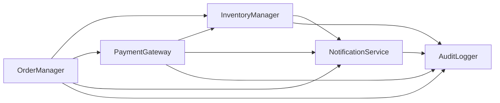
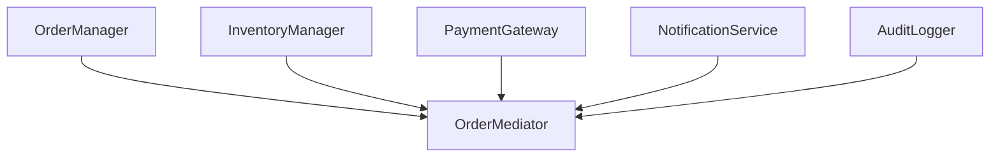

---
categories:
  - tech
date: 2026-03-25T07:07:05+09:00
description: ECサイトのバックエンド5モジュールが互いに直接参照し合い、1箇所の変更で全体が崩壊。クーポン機能追加の悪夢を「Mediatorパターン」で司令塔に集約するコード探偵ロックの推理。
draft: true
epoch: 1774390025
image: /public_images/2026/code-detective-mediator/header.webp
iso8601: 2026-03-25T07:07:05+09:00
tags:
  - design-pattern
  - perl
  - moo
  - mediator
  - spaghetti-coupling
  - refactoring
  - code-detective
title: コード探偵ロックの事件簿【Mediator】蜘蛛の巣会議〜糸を引く者は誰か〜
toc: true
---

「どのファイルを触っても、他の全部が壊れるんです。もう、コードのどこにも安全な場所がない」

ワシは森田。アパレルEC「ThreadStyle」のバックエンドエンジニアじゃ。経験5年、28歳。ThreadStyleの初期メンバーで、バックエンドはワシが一人で書き始めた。

最初は単純だったんじゃよ。注文が来たら在庫を引き当てて、決済して、メールを飛ばす。小さなスクリプトみたいなもんじゃった。ところがサービスが成長して、処理が増え、モジュールを分割して——気づいたら5つのモジュールが、互いに直接参照し合う蜘蛛の巣になっておった。

受注管理、在庫管理、決済ゲートウェイ、通知サービス、監査ログ。どれを触っても他の4つが震える。

そして今朝、CTOがSlackでこう言いおった。

「森田くん、来月のセールに合わせてクーポン機能追加してほしいんだけど。2週間で行ける？」

クーポンエンジン。注文時に割引を適用し、在庫側で割引率を計算し、決済額を調整し、通知に割引情報を含め、監査ログに記録する。つまり、今ある5つのモジュール全部に手を入れる必要がある。さらに5つのモジュール全部からクーポンエンジンへの参照を追加して、クーポンエンジンから5つのモジュールへの参照も——。

ワシは「検討します」とだけ返し、昼休みに雑居ビルの階段を上がった。

「レガシー・コード・インベスティゲーション（LCI）」

ドアを開けると、キーボードの打鍵音とエナジードリンクの甘い残り香。デスクトップPCの排熱でやけに暖かい室内に、飲みかけの缶が散乱しておる。革張りの椅子の男は、三枚のモニターに映るコードを眺めておった。

「……ワトソン君。3分だけ待ちたまえ。今、微かなにおいを追っている」

「森田です。初めてなんじゃが……」

「初めてだろうと百回目だろうと、ここでは皆ワトソン君だ。さあ、今日の事件を聞こう」

ワトソン君って誰じゃ。まあいい。ワシはノートPCを開き、ThreadStyleのバックエンド構成を見せた。

## 現場検証：5匹の蜘蛛が織る巣

「まず全体像を見せたまえ」

ワシは受注管理モジュールを開いた。

```perl
package OrderManager {
    use Moo;

    has inventory    => ( is => 'rw' );
    has payment      => ( is => 'rw' );
    has notification => ( is => 'rw' );
    has audit        => ( is => 'rw' );

    sub place_order ($self, $order) {
        $self->inventory->reserve($order);
        $self->payment->charge($order);
        $self->notification->notify("注文確定: $order->{id}");
        $self->audit->log('order_placed', $order);
    }
}
```

「受注管理だけで他のモジュールを4つも参照しとります。在庫、決済、通知、ログ。じゃが問題は、これだけじゃなくて——」

ワシは他のモジュールも見せた。

```perl
package PaymentGateway {
    use Moo;

    has inventory    => ( is => 'rw' );
    has notification => ( is => 'rw' );
    has audit        => ( is => 'rw' );

    sub charge ($self, $order) {
        my $success = $self->_process_payment($order);
        if (!$success) {
            $self->inventory->release($order);
            $self->notification->notify("決済失敗: $order->{id}");
        }
        $self->audit->log('payment_processed',
            { order => $order, success => $success });
        return $success;
    }

    sub _process_payment ($self, $order) { 1 }  # 簡略化
}

package InventoryManager {
    use Moo;

    has notification => ( is => 'rw' );
    has audit        => ( is => 'rw' );

    sub reserve ($self, $order) {
        # ... 在庫引き当て処理 ...
        if ($self->_is_low_stock($order->{item_id})) {
            $self->notification->notify("在庫残少: $order->{item_id}");
            $self->audit->log('low_stock', $order);
        }
    }

    sub release ($self, $order) {
        # ... 在庫戻し処理 ...
        $self->audit->log('stock_released', $order);
    }

    sub _is_low_stock ($self, $item_id) { 0 }  # 簡略化
}

package NotificationService {
    use Moo;

    has audit => ( is => 'rw' );

    sub notify ($self, $message) {
        # ... メール/Slack送信 ...
        $self->audit->log('notification_sent', { message => $message });
    }
}

package AuditLogger {
    use Moo;

    sub log ($self, $event, $data) {
        # ... ログ記録 ...
    }
}
```

「見てくだされ。決済が在庫と通知とログを参照し、在庫が通知とログを参照し、通知がログを参照しとる。全部が全部に繋がっとるんじゃ」

ロックはホワイトボードにモジュール名を書き、矢印を引き始めた。



「10本。5つのモジュールから10本の直接依存線が伸びている」

ロックは一歩下がって全体を眺めた。

「見事な蜘蛛の巣だ。だが問題は、蜘蛛が5匹もいることだよ、ワトソン君」

「蜘蛛が5匹……？」

「蜘蛛の巣の中心には1匹の蜘蛛がいて、全ての糸の振動を感じ取る。だがこのシステムでは5匹の蜘蛛が全員、互いの巣に糸を張り合っている。誰が糸を引いているのか分からない」

ロックは初期化コードも見せろと言った。ワシはうなだれながらそれを開いた。

```perl
# 初期化の地獄
my $audit        = AuditLogger->new;
my $notification = NotificationService->new;
my $inventory    = InventoryManager->new;
my $payment      = PaymentGateway->new;
my $order_mgr    = OrderManager->new;

# 後付けで全参照を注入（rw にせざるを得ない）
$notification->audit($audit);

$inventory->notification($notification);
$inventory->audit($audit);

$payment->inventory($inventory);
$payment->notification($notification);
$payment->audit($audit);

$order_mgr->inventory($inventory);
$order_mgr->payment($payment);
$order_mgr->notification($notification);
$order_mgr->audit($audit);
```

「これ、最初に全部 `rw` にしとるんじゃ。`required` にすると循環参照で初期化できんかったもんで……」

「不変であるべきものを可変にしている。設計の敗北だな」ロックは矢印を指した。「ここにクーポンエンジンを追加するとどうなる？」

「えっと、CouponEngine は在庫の割引率を見て、決済額を調整して、通知に割引情報を含めて、ログに記録するんで——OrderManager にクーポン参照を追加、PaymentGateway にも、InventoryManager にも、NotificationService にも……」

「つまり既存の4つのモジュール全てに手を入れる。さらにクーポンエンジン自身も他の4つを参照する。依存線は10本から——」

「15本に……」

「スパゲッティ結合。これが今回の犯人だよ、ワトソン君。モジュールが増えるたびに依存線が二次関数的に増殖し、やがて誰も手を出せなくなる」

なるほど、ワシのコードが犯人呼ばわりされるのは癪じゃが、否定できんのが辛いところじゃ。

## 推理披露：蜘蛛の巣の中心（Mediator）

「ワトソン君。蜘蛛の巣が美しいのは、なぜだと思う？」

「え……放射状に広がっとるから、ですかの？」

「そうだ。中心が1つあり、全ての糸がそこを通る。糸が振動すれば、中心の蜘蛛がそれを感じ取り、適切な方向へ信号を伝える。君のシステムに足りないのは、この中心——すなわち仲介者だ」

「仲介者……」

「まず、全員が従うルールを定める。各モジュールは仲介者を通じてのみ他のモジュールと通信する」

【After】共通のルール（Colleague ロール）

```perl
package Colleague {
    use Moo::Role;

    has mediator => ( is => 'rw', weak_ref => 1 );

    sub send_event ($self, $event, $data) {
        $self->mediator->relay($event, $self, $data);
    }
}
```

「`Colleague` ロールは、全モジュールに共通の約束事だ。各モジュールは `mediator` への参照だけを持ち、何かあれば `send_event` で仲介者に伝える。他のモジュールの存在を知る必要はない」

「他のモジュールへの `has` が全部消える……？」

ワシは耳を疑った。あの `has inventory =>` や `has payment =>` の山が消えるというのか。

「次に、蜘蛛の巣の中心——仲介者だ」

【After】蜘蛛の巣の中心（OrderMediator）

```perl
package OrderMediator {
    use Moo;

    has colleagues => ( is => 'ro', default => sub { {} } );

    sub register ($self, $name, $colleague) {
        $self->colleagues->{$name} = $colleague;
        $colleague->mediator($self);
        return $self;
    }

    sub relay ($self, $event, $sender, $data) {
        my $c = $self->colleagues;

        if ($event eq 'order_placed') {
            $c->{coupon}->apply($data)
                if $c->{coupon} && $data->{coupon_code};
            $c->{inventory}->reserve($data);
            $c->{payment}->charge($data);
            $c->{notification}->notify("注文確定: $data->{id}");
            $c->{audit}->log('order_placed', $data);
        }
        elsif ($event eq 'low_stock') {
            $c->{notification}->notify("在庫残少: $data->{item_id}");
            $c->{audit}->log('low_stock', $data);
        }
        elsif ($event eq 'payment_failed') {
            $c->{inventory}->release($data);
            $c->{notification}->notify("決済失敗: $data->{id}");
            $c->{audit}->log('payment_failed', $data);
        }
        elsif ($event eq 'coupon_applied') {
            $c->{notification}->notify(
                "クーポン適用: $data->{coupon_code}");
            $c->{audit}->log('coupon_applied', $data);
        }
    }
}
```

「`OrderMediator` がすべての連携ロジックを一手に引き受ける。誰が誰に何を伝えるかは、すべてここに集約される。各モジュールはイベントを発火するだけで、その先のことは関知しない」

「Before じゃと OrderManager に書いてあった `$self->inventory->reserve(...)` が、Mediator に移動した……というわけか」

「その通り。では各モジュールがどう変わるか見てみよう」

【After】身軽になったモジュールたち

```perl
package OrderManager {
    use Moo;
    with 'Colleague';

    sub place_order ($self, $order) {
        $self->send_event('order_placed', $order);
    }
}

package PaymentGateway {
    use Moo;
    with 'Colleague';

    sub charge ($self, $order) {
        my $success = $self->_process_payment($order);
        if (!$success) {
            $self->send_event('payment_failed', $order);
        }
        return $success;
    }

    sub _process_payment ($self, $order) { 1 }
}

package InventoryManager {
    use Moo;
    with 'Colleague';

    sub reserve ($self, $order) {
        # ... 在庫引き当て処理 ...
        if ($self->_is_low_stock($order->{item_id})) {
            $self->send_event('low_stock', $order);
        }
    }

    sub release ($self, $order) {
        # ... 在庫戻し処理 ...
    }

    sub _is_low_stock ($self, $item_id) { 0 }
}

package NotificationService {
    use Moo;
    with 'Colleague';

    sub notify ($self, $message) {
        # ... メール/Slack送信 ...
    }
}

package AuditLogger {
    use Moo;
    with 'Colleague';

    sub log ($self, $event, $data) {
        # ... ログ記録 ...
    }
}
```

ワシは画面を見つめた。各モジュールから `has inventory =>` や `has payment =>` が全て消えておる。残っておるのは `with 'Colleague'` だけじゃ。

「OrderManager の `place_order` を見てくだされ。Before では4行かけて在庫引き当て、決済、通知、ログを呼んでおった。今は `send_event` の1行だけ……」

「各モジュールは自分の仕事だけを知っていればいい。連携のことは仲介者に任せる。これが単一責任というものだ」

ロックはホワイトボードに新しい図を描いた。



「蜘蛛の巣から星形に変わった。全ての糸は中心を通る。依存線は10本から5本——各モジュールから仲介者への1本ずつだ」

「初期化も見せてくれんかの？」

「当然だ」

【After】明快な初期化

```perl
my $mediator = OrderMediator->new;

$mediator->register(order        => OrderManager->new)
         ->register(inventory    => InventoryManager->new)
         ->register(payment      => PaymentGateway->new)
         ->register(notification => NotificationService->new)
         ->register(audit        => AuditLogger->new);

# 注文を処理
my $order = {
    id => 'TS-2026-0325', item_id => 'HOODIE-BK-L', quantity => 1,
};
$mediator->colleagues->{order}->place_order($order);
```

「Before の後付け `->audit($audit)` 地獄が、`register` チェーンの数行に。全モジュールの参照が `required` ではなく `rw` じゃったあの妥協も不要になったわけか」

「そういうことだ。そして——ワトソン君が恐れていたクーポンエンジンの追加だ」

【After】クーポンエンジンの追加

```perl
package CouponEngine {
    use Moo;
    with 'Colleague';

    sub apply ($self, $order) {
        if (my $code = $order->{coupon_code}) {
            $order->{discount} = $self->_calculate_discount($code);
            $self->send_event('coupon_applied', $order);
        }
    }

    sub _calculate_discount ($self, $code) { 500 }  # 簡略化
}
```

```perl
# Mediator に登録するだけ
$mediator->register(coupon => CouponEngine->new);
```

「……え、既存の OrderManager、PaymentGateway、InventoryManager は一切変更なしじゃと？」

「一切なしだ。CouponEngine は `Colleague` ロールを持ち、Mediator に登録される。連携ロジックは Mediator の `relay` に追加するだけ。既存モジュールは自分にクーポンなど存在することすら知らない」

ワシは唸った。Before じゃったら、5つのモジュール全部に `has coupon =>` を追加して、初期化コードに5行追加して、各モジュールの処理にクーポン判定を埋め込んで……。あの悪夢はもう過去のものというわけか。

## 解決：星形に生まれ変わった巣

ロックがテストを実行すると、ターミナルに結果が並んだ。

```bash
$ prove -v t/mediator.t
# Subtest: Before: Spaghetti Coupling
    ok 1 - OrderManager can place_order
    ok 2 - PaymentGateway references InventoryManager directly
    ok 3 - InventoryManager references NotificationService directly
    ok 4 - NotificationService references AuditLogger directly
    ok 5 - Adding CouponEngine requires modifying ALL existing modules
ok 1 - Before: Spaghetti Coupling
# Subtest: After: Mediator Pattern
    ok 1 - OrderManager has no direct module references
    ok 2 - PaymentGateway has no direct module references
    ok 3 - InventoryManager has no direct module references
    ok 4 - NotificationService has no direct module references
    ok 5 - All 5 modules registered with Mediator
    ok 6 - order_placed event triggers notification
    ok 7 - order_placed event triggers audit log
    ok 8 - Notification contains order confirmation
    ok 9 - payment_failed event triggers rollback notification
    ok 10 - CouponEngine added without modifying existing modules
    ok 11 - Coupon discount applied correctly
    ok 12 - coupon_applied event triggers notification
    ok 13 - coupon_applied event triggers audit log
ok 2 - After: Mediator Pattern
All tests successful.
```

「Before のテスト2〜4を見たまえ。各モジュールが他のモジュールを直接参照している証拠だ。After のテスト1〜4——どのモジュールにも直接参照がない。テスト10、CouponEngine の追加で既存モジュールは一切触っていない。テスト11〜13、クーポンのイベントも正しく流れている」

「依存線が10本から5本に。新しいモジュールを追加しても、既存コードに触らんで済む。蜘蛛の巣が、星形に——」

「**蜘蛛の巣に中心が生まれた**。すべての振動は中心を通じて、正しい方向に伝えられる。これがMediatorパターンだ」

ワシはPCを閉じかけたが、ロックが手を上げた。

「報酬は——そうだな。依存線の削減率と同じパーセンテージのクーポンをいただこうか。50%オフだ」

「それ、CTOに怒られるやつじゃな……」

ロックは人差し指を立てた。

「最後に一つ。Mediator はスパゲッティ結合を星形に変える強力な手法だ。だが、全ての連携ロジックを仲介者に詰め込みすぎると、今度は仲介者自身が神オブジェクトになる。蜘蛛の巣の中心にいる蜘蛛が太りすぎれば、巣は再び崩壊するよ」

「仲介者が肥大化したら、どうすればええんじゃ？」

「イベントハンドラをクラスに分離するか、ドメインごとに仲介者を分割する。中心は軽くあるべきだ。それを忘れなければ、糸は美しく張り続けるだろう」

ワシはLCIを出て、CTOへの返信を書いた。「クーポン機能、1週間で行けます」

---

## 探偵の調査報告書

| 容疑（アンチパターン） | 真実（パターン） | 証拠（効果） |
| :--- | :--- | :--- |
| Spaghetti Coupling（スパゲッティ結合）。5つのモジュールが互いに直接参照し合い、10本の依存線が蜘蛛の巣状に絡み合う。新モジュール追加で既存の全モジュールの修正が必要になり、影響範囲が予測不能。 | Mediator パターン。モジュール間の通信を1つの仲介者オブジェクトに集約し、各モジュールは仲介者のみを参照する。N×NをN×1のスター型に変換。 | 依存線が10本から5本に削減。新モジュール（CouponEngine）追加で既存コードの修正がゼロ。1モジュールの変更影響がMediatorに局所化。初期化コードが後付け参照注入からregisterチェーンに簡素化。 |

### 推理のステップ

1. Colleague ロールを定義する: 全モジュールが守るべき契約——`mediator` への参照と `send_event` メソッド——をRoleとして定義する。他モジュールへの直接参照を全て削除する。
2. Mediator を実装する: 全モジュールを `register` で登録し、`relay` メソッドでイベントに応じた連携ロジックを一元管理する。
3. 各モジュールをリファクタリングする: 他モジュールへの直接呼び出しを `send_event` に置き換える。各モジュールは自分の責務だけを遂行する。
4. 新モジュールを追加する: `Colleague` ロールを適用してMediatorに登録し、`relay` にイベントハンドラを追加するだけ。既存モジュールは一切変更しない。

### ロックより

ワトソン君。モジュール同士が直接参照し合うのは、一見すると素朴で効率的に見える。だがそれは、全員が全員の携帯番号を知っている組織と同じだ。3人なら3本の電話線で済む。5人なら10本。10人なら45本。人数が増えるたびに通信網は二次関数的に複雑化し、やがて誰が誰に何を伝えたか追跡不能になる。

Mediatorは「交換手」の配置だ。全員が交換手にだけ電話をかけ、交換手が適切な相手に繋ぐ。新しいメンバーが加わっても、交換手に番号を登録するだけで既存メンバーの電話帳は変わらない。ただし、交換手にすべてを任せすぎると、交換手自身がボトルネックになる。イベントの種類が数十に膨れ上がったら、それは仲介者を分割するサインだ。蜘蛛の巣の中心は、軽く、しなやかでなければならない。
