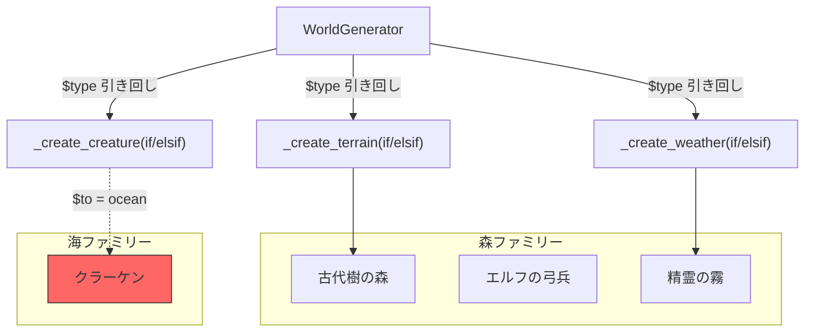
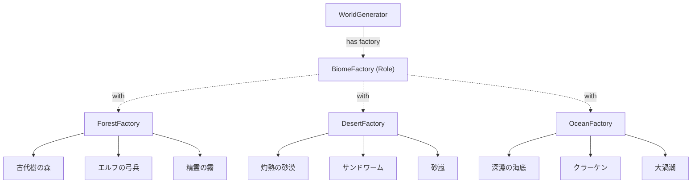

---
categories:
  - tech
date: 2026-03-26T07:07:05+09:00
description: オープンワールドRPGの世界生成で砂漠にクラーケン、森に砂嵐——バイオームごとの地形・生物・天候がバラバラに生成される不整合バグを「Abstract Factoryパターン」でファミリー単位の生成に統一するコード探偵ロックの推理。
draft: true
epoch: 1774476425
image: /public_images/2026/code-detective-abstract-factory/header.webp
iso8601: 2026-03-26T07:07:05+09:00
tags:
  - design-pattern
  - perl
  - moo
  - abstract-factory
  - mismatched-product-family
  - refactoring
  - code-detective
title: コード探偵ロックの事件簿【Abstract Factory】混沌の箱庭〜血統を守らぬ創造主〜
toc: true
---

「砂漠にクラーケンが出るんです。森では砂嵐が吹いて、海底にサボテンが生えてて……プレイヤーからの報告が止まらなくて」

僕は神崎。ゲーム会社「Arclight Studios」のサーバーサイドエンジニアだ。経験4年、26歳。うちの看板タイトル「Elysium Online」のプロシージャル世界生成を担当している。

最初は3つのバイオーム——森、砂漠、海——だけだった。地形を作って、生物を配置して、天候を設定する。シンプルなスクリプトで十分だった。

ところがサービスが成長して、バイオームが増え、プランナーから「バイオーム間の遷移ゾーンも作ってくれ」と言われて——気づいたら、世界がおかしくなっていた。

森の中をサンドワームが泳ぎ、砂漠の上空に渦潮が渦巻き、海底でエルフが弓を引いている。

そして今朝、ディレクターがSlackでこう言った。

「神崎くん、次のアプデで火山バイオーム追加ね。2週間で」

火山。新しい地形、新しいモンスター、新しい天候。つまり、あの地獄のif文を3つのメソッド全部に追加して、遷移ゾーンのバグもさらに増えて——。

僕は「検討します」とだけ返し、昼休みに雑居ビルの階段を上がった。

「レガシー・コード・インベスティゲーション（LCI）」

ドアを開けると、三枚のモニターに異世界のマップらしきものが映っていた。デスクトップPCの排熱で妙に暖かい室内。飲みかけのエナジードリンク缶が散乱している。革張りの椅子の男は缶を傾けながら、地図上の何かを凝視していた。

「……ほう。珍しいクライアントだな。ゲームの世界からお越しか」

「あの、初めてなんですが——」

「初めてだろうと百回目だろうと、ここでは皆ワトソン君だ。さあ、今日の事件を聞こう」

僕はノートPCを開き、Elysium Onlineの世界生成コードを見せた。

## 現場検証：壊れた箱庭

「まず全体像を見せたまえ」

僕は世界生成の中核モジュールを開いた。

```perl
package WorldGenerator {
    use Moo;

    sub generate_zone ($self, $biome) {
        my $terrain  = $self->_create_terrain($biome);
        my $creature = $self->_create_creature($biome);
        my $weather  = $self->_create_weather($biome);

        return {
            terrain  => $terrain,
            creature => $creature,
            weather  => $weather,
        };
    }

    sub _create_terrain ($self, $type) {
        if ($type eq 'forest') {
            return { name => '古代樹の森', ground => '苔むした腐葉土',
                     obstacle => '巨木の根' };
        }
        elsif ($type eq 'desert') {
            return { name => '灼熱の砂漠', ground => '流砂',
                     obstacle => 'サボテンの壁' };
        }
        elsif ($type eq 'ocean') {
            return { name => '深淵の海底', ground => '珊瑚礁',
                     obstacle => '海溝の裂け目' };
        }
        else { die "Unknown biome: $type" }
    }

    sub _create_creature ($self, $type) {
        if ($type eq 'forest') {
            return { name => 'エルフの弓兵', hp => 80,
                     attack => '精霊の矢' };
        }
        elsif ($type eq 'desert') {
            return { name => 'サンドワーム', hp => 200,
                     attack => '地中突進' };
        }
        elsif ($type eq 'ocean') {
            return { name => 'クラーケン', hp => 300,
                     attack => '触手の嵐' };
        }
        else { die "Unknown biome: $type" }
    }

    sub _create_weather ($self, $type) {
        if ($type eq 'forest') {
            return { name => '精霊の霧', visibility => 0.6,
                     damage => 0 };
        }
        elsif ($type eq 'desert') {
            return { name => '砂嵐', visibility => 0.2,
                     damage => 5 };
        }
        elsif ($type eq 'ocean') {
            return { name => '大渦潮', visibility => 0.4,
                     damage => 10 };
        }
        else { die "Unknown biome: $type" }
    }
}
```

「3つのメソッドが全部同じ構造です。`$type` で分岐して、それぞれのバイオームに合った地形・生物・天候を返す。でも問題は——」

「3つのメソッドが独立していることだろう？」ロックが先に言った。

「え、はい。地形は地形、生物は生物、天候は天候で、バラバラに生成しています。同じ `$type` を渡してるから普通は揃うんですが……」

「普通は、な。では普通でなくなった瞬間を見せたまえ」

僕はうなだれながら、遷移ゾーン生成のコードを開いた。

```perl
# バイオーム間の遷移ゾーン生成（バグ混入）
sub generate_transition ($self, $from, $to) {
    my $terrain  = $self->_create_terrain($from);
    my $creature = $self->_create_creature($to);    # ← ここ！
    my $weather  = $self->_create_weather($from);

    return {
        terrain  => $terrain,
        creature => $creature,
        weather  => $weather,
    };
}
```

「遷移ゾーンは2つのバイオームの要素を混ぜるつもりだったんです。でも、誰がどの引数を渡すかはプログラマの記憶頼みで……」

「結果、森の地形に海の生物が配置された。砂漠にクラーケン、深海に砂嵐——すべてはここから生まれた」

ロックはホワイトボードに図を描き始めた。



「森の地形と霧の中に、海のクラーケンが立っている。ファミリーが壊れているんだ」

「ファミリー……？」

「世界の生き物には血統がある、ワトソン君。森のエルフは森の霧雨の中でこそ美しく、砂漠のサンドワームは砂嵐の中でこそ恐ろしい。地形・生物・天候は同じ血統に属する一族であるべきだ。ところが君のコードでは、3つの生成メソッドが独立しているから、血統の異なる者同士を混ぜ合わせることができてしまう」

「確かに、`_create_terrain` と `_create_creature` に別々の `$type` を渡しても、コンパイラは何も文句を言わない……」

「そしてもう一つの問題。火山バイオームを追加するとどうなる？」

「3つのメソッド全部に `elsif ($type eq 'volcano')` を追加します。遷移ゾーンのテストケースも増えて……」

「すべてのif文に手を入れる。そして手を入れるたびに、新たな血統汚染のリスクが生まれる。これが今回の犯人だ——Mismatched Product Family（製品ファミリー不一致）。関連するオブジェクト群を個別に生成するがゆえに、異なるファミリーの部品が混在する」

## 推理披露：血統を守る工場（Abstract Factory）

「ワトソン君。品種の純血を守る方法を知っているかね？」

「品種……ブリーダーが血統書を管理する、とか？」

「その通り。一つの血統に属する者は、一つの工場から送り出す。工場が血統書の役割を果たし、異なる血統の混入を構造的に不可能にする」

「工場……Factory Methodとは違うんですか？ 前に聞いたことがあって」

「Factory Methodは単一の製品の生成をサブクラスに委ねる。だがAbstract Factoryは違う。製品ファミリー全体——地形も生物も天候も——を一つの工場で生成する。一族をまとめて送り出すのさ」

ロックはキーボードを叩き始めた。

【After】製品クラスの定義

```perl
package Terrain {
    use Moo;
    has name     => ( is => 'ro', required => 1 );
    has ground   => ( is => 'ro', required => 1 );
    has obstacle => ( is => 'ro', required => 1 );
}

package Creature {
    use Moo;
    has name   => ( is => 'ro', required => 1 );
    has hp     => ( is => 'ro', required => 1 );
    has attack => ( is => 'ro', required => 1 );
}

package Weather {
    use Moo;
    has name       => ( is => 'ro', required => 1 );
    has visibility => ( is => 'ro', required => 1 );
    has damage     => ( is => 'ro', required => 1 );
}
```

「まず、地形・生物・天候をそれぞれ `required` な属性を持つクラスにする。ハッシュリファレンスではなく、型付きのオブジェクトだ。不完全な生成を防ぐ」

【After】血統書（BiomeFactory ロール）

```perl
package BiomeFactory {
    use Moo::Role;

    requires 'create_terrain';
    requires 'create_creature';
    requires 'create_weather';
}
```

「`BiomeFactory` ロールは、全てのバイオーム工場が守るべき契約だ。地形・生物・天候——この3つをセットで生成する責務を負う。1つだけ作ることも、別のファミリーから借りてくることもできない」

【After】各血統の工場

```perl
package ForestFactory {
    use Moo;
    with 'BiomeFactory';

    sub create_terrain ($self) {
        Terrain->new(
            name => '古代樹の森', ground => '苔むした腐葉土',
            obstacle => '巨木の根',
        );
    }

    sub create_creature ($self) {
        Creature->new(
            name => 'エルフの弓兵', hp => 80, attack => '精霊の矢',
        );
    }

    sub create_weather ($self) {
        Weather->new(
            name => '精霊の霧', visibility => 0.6, damage => 0,
        );
    }
}

package DesertFactory {
    use Moo;
    with 'BiomeFactory';

    sub create_terrain ($self) {
        Terrain->new(
            name => '灼熱の砂漠', ground => '流砂',
            obstacle => 'サボテンの壁',
        );
    }

    sub create_creature ($self) {
        Creature->new(
            name => 'サンドワーム', hp => 200, attack => '地中突進',
        );
    }

    sub create_weather ($self) {
        Weather->new(
            name => '砂嵐', visibility => 0.2, damage => 5,
        );
    }
}

package OceanFactory {
    use Moo;
    with 'BiomeFactory';

    sub create_terrain ($self) {
        Terrain->new(
            name => '深淵の海底', ground => '珊瑚礁',
            obstacle => '海溝の裂け目',
        );
    }

    sub create_creature ($self) {
        Creature->new(
            name => 'クラーケン', hp => 300, attack => '触手の嵐',
        );
    }

    sub create_weather ($self) {
        Weather->new(
            name => '大渦潮', visibility => 0.4, damage => 10,
        );
    }
}
```

「`ForestFactory` は森の地形・森の生物・森の天候だけを生成する。`OceanFactory` は海のものだけ。**工場を選んだ時点で、ファミリーが確定する**。異なる血統の混入は、構造的に起こり得ない」

「でも、WorldGenerator はどう変わるんですか？」

【After】ファクトリーに委ねる世界生成

```perl
package WorldGenerator {
    use Moo;

    has factory => ( is => 'ro', required => 1 );

    sub generate ($self) {
        return {
            terrain  => $self->factory->create_terrain,
            creature => $self->factory->create_creature,
            weather  => $self->factory->create_weather,
        };
    }
}
```

僕は画面を見つめた。Before では `$type` を3つのメソッドに引き回していた if/elsif の壁が、すべて消えている。

「WorldGenerator はもう `$type` を知らない。知る必要がない。どのファクトリーを受け取ったかだけで、すべてが決まる」

「Before だと `generate_transition` で `$from` と `$to` を間違えてクラーケンが森に出ていた……。今の構造だと、ファクトリーを渡す時点でファミリーが決まるから、混ぜようがない」

「その通りだ」

ロックはホワイトボードに新しい図を描いた。



「WorldGenerator は BiomeFactory ロールだけに依存する。どの具体工場が来るかは知らない。そして各工場は自分の血統だけを送り出す。これが血統書のある世界だ」

「初期化はどうなりますか？」

```perl
# 森ゾーンの生成
my $forest_gen = WorldGenerator->new(factory => ForestFactory->new);
my $forest_zone = $forest_gen->generate;
# => terrain: 古代樹の森, creature: エルフの弓兵, weather: 精霊の霧

# 砂漠ゾーンの生成
my $desert_gen = WorldGenerator->new(factory => DesertFactory->new);
my $desert_zone = $desert_gen->generate;
# => terrain: 灼熱の砂漠, creature: サンドワーム, weather: 砂嵐
```

「Before の `generate_zone('forest')` が `WorldGenerator->new(factory => ForestFactory->new)->generate` に変わった。長くなったように見えるが、ファクトリーを受け取った時点で血統が保証される。呼び出し側が `$type` を間違える余地がない」

「そして——ワトソン君が恐れていた火山バイオームの追加だ」

【After】火山の血統——VolcanoFactory

```perl
package VolcanoFactory {
    use Moo;
    with 'BiomeFactory';

    sub create_terrain ($self) {
        Terrain->new(
            name => '溶岩の大地', ground => '黒曜石',
            obstacle => '噴火口',
        );
    }

    sub create_creature ($self) {
        Creature->new(
            name => 'サラマンダー', hp => 250, attack => '火炎ブレス',
        );
    }

    sub create_weather ($self) {
        Weather->new(
            name => '火山灰の雨', visibility => 0.3, damage => 8,
        );
    }
}
```

```perl
# 火山ゾーンの生成——既存コードは一切変更なし
my $volcano_gen = WorldGenerator->new(factory => VolcanoFactory->new);
my $volcano_zone = $volcano_gen->generate;
```

「……え、ForestFactory も DesertFactory も OceanFactory も WorldGenerator も何も触ってないですか？」

「一切触っていない。`VolcanoFactory` は `BiomeFactory` ロールを満たしているから、WorldGenerator はそのまま受け入れる。新しい血統を追加しても、既存の血統には一切影響しない」

「Before だったら、3つのメソッド全部に `elsif ($type eq 'volcano')` を追加して、遷移ゾーンのテストケースも追加して……」

「その恐怖はもう過去のものだ」

## 解決：血統書のある世界

ロックがテストを実行すると、ターミナルに結果が並んだ。

```bash
$ prove -v t/abstract_factory.t
# Subtest: Before: Mismatched Product Family
    ok 1 - forest zone: terrain OK
    ok 2 - forest zone: creature OK
    ok 3 - forest zone: weather OK
    ok 4 - transition: terrain from forest
    ok 5 - BUG: creature from ocean in forest terrain!
    ok 6 - transition: weather from forest
    ok 7 - Adding volcano requires modifying 3 methods
ok 1 - Before: Mismatched Product Family
# Subtest: After: Abstract Factory Pattern
    ok 1 - ForestFactory: terrain
    ok 2 - ForestFactory: creature
    ok 3 - ForestFactory: weather
    ok 4 - DesertFactory: terrain
    ok 5 - DesertFactory: creature
    ok 6 - OceanFactory: creature
    ok 7 - Products are proper objects
    ok 8 - Creature is proper object
    ok 9 - VolcanoFactory: terrain
    ok 10 - VolcanoFactory: creature
    ok 11 - VolcanoFactory: weather
    ok 12 - ForestFactory works with WorldGenerator
    ok 13 - DesertFactory works with WorldGenerator
    ok 14 - OceanFactory works with WorldGenerator
    ok 15 - VolcanoFactory works with WorldGenerator
ok 2 - After: Abstract Factory Pattern
All tests successful.
```

「Before のテスト5を見たまえ。遷移ゾーンで森の地形に海のクラーケンが混入している。After のテスト7〜8——製品はハッシュではなく型付きオブジェクトだ。テスト9〜11、火山ファミリーが正しく生成されている。テスト12〜15、どのファクトリーでもWorldGeneratorは動く」

「砂漠にクラーケンが出る世界は、もう終わりだ……」

「血統書が世界を守る。一族は一族として生まれ、異なる血が混じることはない。これがAbstract Factoryパターンだ」

僕はPCを閉じかけたが、ロックが手を上げた。

「報酬は——そうだな。Elysium Online の限定マウント『黒曜石のドラゴン』をいただこうか。火山バイオーム初クリア報酬のやつだ」

「それ、まだ実装してないんですけど……」

ロックは人差し指を立てた。

「最後に一つ。Abstract Factoryはファミリーの一貫性を守る強力な手法だ。新しいバイオーム——つまり新しいファミリーの追加は容易い。だが新しい製品種の追加は重い。たとえば全バイオームに『BGM』を追加したくなったら、`BiomeFactory` ロールに `create_bgm` を追加し、既存の全ファクトリーに実装を強いることになる」

「全ファクトリーに……」

「ファミリーの数が増えるのは得意だが、ファミリーの中身が増えるのは苦手。血統を増やすのは容易いが、血統の定義を変えるのは重い。それを忘れなければ、君の箱庭は美しく保たれるだろう」

僕はLCIを出て、ディレクターへの返信を書いた。「火山バイオーム、1週間で行けます」

---

## 探偵の調査報告書

| 容疑（アンチパターン） | 真実（パターン） | 証拠（効果） |
| :--- | :--- | :--- |
| Mismatched Product Family（製品ファミリー不一致）。関連するオブジェクト群（地形・生物・天候）を個別のメソッドで生成し、`$type` 引数の引き回しに依存。呼び出し側の引数ミスで異なるファミリーの混在が発生し、世界の整合性が崩壊。 | Abstract Factory パターン。製品ファミリー全体を1つのファクトリーで生成し、ファクトリーを選んだ時点でファミリーの一貫性が保証される。WorldGenerator は具体ファクトリーを知らず、BiomeFactory ロールにのみ依存。 | ファミリー不一致が構造的に不可能に。新バイオーム追加で既存コード修正ゼロ。if/elsif 分岐が全メソッドから完全に消滅。製品がハッシュから型付きオブジェクト（Terrain/Creature/Weather）に昇格し、不完全な生成を防止。 |

### 推理のステップ

1. 製品クラスを定義する: 地形（Terrain）・生物（Creature）・天候（Weather）をそれぞれ `required` な属性を持つ独立したクラスとして定義する。ハッシュリファレンスからの卒業。
2. Abstract Factory ロールを定義する: `BiomeFactory` ロールで `create_terrain` / `create_creature` / `create_weather` の3メソッドを `requires` として宣言する。ファミリーの契約を明示する。
3. Concrete Factory を実装する: `ForestFactory` / `DesertFactory` / `OceanFactory` の各ファクトリーが `BiomeFactory` ロールを消費し、自分の血統に属する製品だけを生成する。
4. WorldGenerator をファクトリーに依存させる: `has factory` でファクトリーを受け取り、`generate` メソッドではファクトリー経由で全製品を生成する。`$type` の引き回しを完全に排除する。
5. 新ファミリーを追加する: `VolcanoFactory` のように新しいファクトリーを1つ追加するだけ。既存のファクトリーもWorldGeneratorも一切変更しない。

### ロックより

ワトソン君。Factory Methodは1種類の製品を子クラスに委ねる手法だった。Abstract Factoryはその発展形——製品ファミリー全体を1つの工場に委ねる。地形だけ、生物だけではない。地形も生物も天候も——血を同じくする者たちを、一つの血統として送り出す。

この手法の強みは「ファミリーの追加が軽いこと」だ。新しいバイオームを追加するとき、既存の工場には指一本触れない。だがその裏返しとして、「ファミリーの定義変更は重い」。全バイオームにBGMを追加しようとすれば、全工場の改修が必要になる。

だから適用するなら、まず自問したまえ。「増えるのはファミリーの種類か、それともファミリーの中身か」。種類が増えるならAbstract Factory。中身が増えるなら、別の手法を探るべきだ。血統書は、血統の定義が安定しているからこそ価値を持つのだから。
