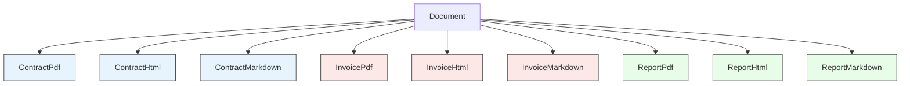
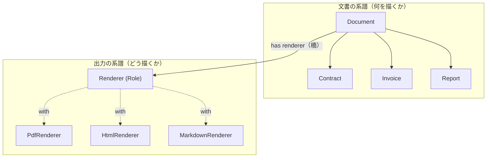

---
categories:
  - tech
date: 2026-03-27T07:07:05+09:00
description: 法務SaaSのドキュメント生成で、文書の種類×出力形式の組み合わせごとにクラスを作った結果、9クラスが爆発的に増殖。コピペバグで提案書に消費税欄が出現する惨事を「Bridgeパターン」で二つの系譜に分離するコード探偵ロックの推理。
draft: true
epoch: 1774562825
image: /public_images/2026/code-detective-bridge/header.webp
iso8601: 2026-03-27T07:07:05+09:00
tags:
  - design-pattern
  - perl
  - moo
  - bridge
  - cartesian-product-explosion
  - refactoring
  - code-detective
title: コード探偵ロックの事件簿【Bridge】交差する二つの系譜〜掛け算の呪いを解く架け橋〜
toc: true
---

「提案書に消費税の欄が出てるって、クライアントから電話が来まして……」

僕は水島。法務SaaS「DocForge」のバックエンドエンジニアだ。経験6年、30歳。DocForgeは企業向けの文書管理プラットフォームで、契約書・請求書・報告書をワンクリックで生成できるのがウリだ。

最初は契約書をPDFで出すだけだった。それがHTML出力に対応し、Markdown出力に対応し、請求書が加わり、報告書が加わり——気づいたら、文書の種類と出力形式の**掛け算**でクラスが増殖していた。

`ContractPdf`, `ContractHtml`, `ContractMarkdown`, `InvoicePdf`, `InvoiceHtml`, `InvoiceMarkdown`, `ReportPdf`, `ReportHtml`, `ReportMarkdown`。**3×3 = 9クラス**。

そして先月、営業チームから「提案書も出せるようにしてくれ」と言われた。提案書をPDF・HTML・Markdownで出力するには、3クラス追加。合計12。さらにクライアントから「Word形式でも欲しい」と言われたら、全文書分で4クラス追加。合計16。

「もう名前を考えるだけで疲れるんです。`ProposalMarkdown` とか `ReportWord` とか……」

だが本当の地獄はクラスの数じゃなかった。

提案書のPDFクラスを急いで作ったとき、僕は `InvoicePdf` をコピペして書き換えた。ところが請求書固有の**消費税計算ロジック**を消し忘れて、提案書に「消費税: ¥50,000」「合計: ¥550,000」と表示されてしまった。概算見積もりのつもりが、まるで請求書のような体裁になって——クライアントが「もう契約するんですか？」と困惑の電話をかけてきたのだ。

僕は昼休みに雑居ビルの階段を上がった。

「レガシー・コード・インベスティゲーション（LCI）」

ドアを開けると、コーヒーミルの香ばしい匂いが漂っていた。デスクトップPCの排熱で妙に暖かい室内に、飲みかけのエナジードリンク缶が散乱している。革張りの椅子の男は、手挽きミルでゆっくりと豆を挽いていた。

「……ワトソン君。コーヒーを一杯入れ終わるまで待ちたまえ。急ぐ事件ほど、最初の一杯が大切だ」

「水島です。提案書に消費税が出てしまって——」

「なるほど、においがするな。コーヒーではなく、コードの。さあ、事件を聞こう」

僕はノートPCを開き、DocForgeのドキュメント生成コードを見せた。

## 現場検証：掛け算で増殖する亡霊

「まず全体像を見せたまえ」

僕はクラスの一覧を見せた。9つのクラスのうち、代表的なものを開いた。

```perl
package ContractPdf {
    use Moo;
    has content => ( is => 'ro', required => 1 );

    sub render ($self) {
        my $c = $self->content;
        my $out = "[PDF] === 契約書 ===\n";
        $out .= "甲: $c->{party_a}\n";
        $out .= "乙: $c->{party_b}\n";
        $out .= join("\n", map { "第${_}条: $c->{clauses}[$_ - 1]" }
                               1 .. scalar $c->{clauses}->@*) . "\n";
        $out .= "[署名欄] ___________\n";
        return $out;
    }
}

package ContractHtml {
    use Moo;
    has content => ( is => 'ro', required => 1 );

    sub render ($self) {
        my $c = $self->content;
        my $clauses = join('', map { "<li>$_</li>" } $c->{clauses}->@*);
        my $out = "<h1>契約書</h1>\n";
        $out .= "<p>甲: $c->{party_a}</p>\n";
        $out .= "<p>乙: $c->{party_b}</p>\n";
        $out .= "<ol>$clauses</ol>\n";
        $out .= "<div class='signature'>署名欄</div>\n";
        return $out;
    }
}

package InvoicePdf {
    use Moo;
    has content => ( is => 'ro', required => 1 );

    sub render ($self) {
        my $c = $self->content;
        my $tax   = int($c->{amount} * 0.1);
        my $total = $c->{amount} + $tax;
        my $out = "[PDF] === 請求書 ===\n";
        $out .= "請求先: $c->{client}\n";
        $out .= "小計: ¥$c->{amount}\n";
        $out .= "消費税(10%): ¥$tax\n";
        $out .= "合計: ¥$total\n";
        return $out;
    }
}

# ... さらに InvoiceHtml, InvoiceMarkdown, ContractMarkdown,
#     ReportPdf, ReportHtml, ReportMarkdown ...
# 全部で 3×3 = 9クラス
```

「3つの文書 × 3つの出力形式で9クラス。見ての通り、`has content` と `sub render` の構造は全クラスで同じです。違うのは中身だけで——」

「**中身が二重に変動している**」ロックが指を立てた。「ContractPdf と ContractHtml は、同じ契約書の**出力形式が違う**。ContractPdf と InvoicePdf は、同じPDFの**文書の種類が違う**。つまり、このクラス群は**二つの軸**で変動している」

「二つの軸……」

「文書の種類と出力形式。この**二つの系譜を一つの継承ツリーに押し込めた**結果、クラス数が掛け算で爆発したのさ。そして爆発の真の恐ろしさは数ではない——**コピペだ**」

「はい、まさにそれで……」

僕は問題のコードを開いた。

```perl
# ProposalPdf を追加 — InvoicePdf からコピペ（バグ混入）
package ProposalPdf {
    use Moo;
    has content => ( is => 'ro', required => 1 );

    sub render ($self) {
        my $c = $self->content;
        my $tax   = int($c->{amount} * 0.1);  # ← 請求書から混入！
        my $total = $c->{amount} + $tax;
        my $out = "[PDF] === ご提案書 ===\n";
        $out .= "提案先: $c->{client}\n";
        $out .= "概算費用: ¥$c->{amount}\n";
        $out .= "消費税(10%): ¥$tax\n";       # ← 提案書に消費税欄！
        $out .= "合計: ¥$total\n";
        return $out;
    }
}
```

「`InvoicePdf` をコピーして `ProposalPdf` を作ったんです。タイトルは変えたんですが、消費税の計算ロジックを消し忘れて……」

ロックはホワイトボードにクラスの家系図を描いた。



「9人の亡霊だ。色でグループ分けすると、**文書の種類による系譜**が浮かび上がる。だが同時に、PDF同士・HTML同士・Markdown同士にも**出力形式の系譜**がある。一つの家系図に**二つの系譜が交差**している」

「提案書を追加すると3クラス。Word出力を追加するとさらに4クラス。クラス数は——」

「**掛け算**だ。4文書 × 4形式 = 16。5 × 5 = 25。10 × 10 = **100**。そしてコピペによるバグ混入のリスクも掛け算で増える。これが**Cartesian Product Explosion（直積クラス爆発）**——今回の犯人だよ、ワトソン君」

## 推理披露：二つの系譜を架ける橋（Bridge）

「ワトソン君。二つの名家が婚姻で組み合わさるとどうなる？」

「子孫が……増える？」

「**掛け算で増える**。A家の3人とB家の3人が全組み合わせで婚姻すれば、9つの家系が生まれる。だがそれは愚かな政略だ。**二つの系譜を分け、橋を架ける**。それぞれが独立に血統を伸ばしながら、橋の上で手を取り合えばいい」

「橋……？」

「まず、出力形式の系譜を**独立した一族**として切り出す」

**【After】出力形式の系譜（Renderer ロール）**

```perl
package Renderer {
    use Moo::Role;

    requires 'render_title';
    requires 'render_field';
    requires 'render_list';
    requires 'render_signature';
}

package PdfRenderer {
    use Moo;
    with 'Renderer';

    sub render_title ($self, $title)          { "[PDF] === $title ===\n" }
    sub render_field ($self, $label, $value)  { "$label: $value\n" }
    sub render_list  ($self, $items)          {
        join("\n", map { "  ・$_" } @$items) . "\n";
    }
    sub render_signature ($self)              { "[署名欄] ___________\n" }
}

package HtmlRenderer {
    use Moo;
    with 'Renderer';

    sub render_title ($self, $title)          { "<h1>$title</h1>\n" }
    sub render_field ($self, $label, $value)  { "<p>$label: $value</p>\n" }
    sub render_list  ($self, $items)          {
        "<ol>" . join('', map { "<li>$_</li>" } @$items) . "</ol>\n";
    }
    sub render_signature ($self)              {
        "<div class='signature'>署名欄</div>\n";
    }
}

package MarkdownRenderer {
    use Moo;
    with 'Renderer';

    sub render_title ($self, $title)          { "# $title\n\n" }
    sub render_field ($self, $label, $value)  { "**$label**: $value\n\n" }
    sub render_list  ($self, $items)          {
        join("\n", map { "1. $_" } @$items) . "\n\n";
    }
    sub render_signature ($self)              { "---\n署名: ___________\n" }
}
```

「`Renderer` ロールが出力形式の系譜の**血統書**だ。タイトルの描き方、フィールドの描き方、リストの描き方——**どう描くか**を知っている。だが**何を描くか**は知らない」

「**何を描くか**は文書の種類が決める、ということですか？」

「その通り。次に文書の系譜だ」

**【After】文書の系譜（Document とその子孫）**

```perl
package Document {
    use Moo;

    has renderer => ( is => 'ro', required => 1 );
    has content  => ( is => 'ro', required => 1 );

    sub render ($self) { die "Subclass must implement render" }
}

package Contract {
    use Moo;
    extends 'Document';

    sub render ($self) {
        my ($r, $c) = ($self->renderer, $self->content);
        my $out = $r->render_title('契約書');
        $out .= $r->render_field('甲', $c->{party_a});
        $out .= $r->render_field('乙', $c->{party_b});
        $out .= $r->render_list($c->{clauses});
        $out .= $r->render_signature;
        return $out;
    }
}

package Invoice {
    use Moo;
    extends 'Document';

    sub render ($self) {
        my ($r, $c) = ($self->renderer, $self->content);
        my $tax   = int($c->{amount} * 0.1);
        my $total = $c->{amount} + $tax;
        my $out = $r->render_title('請求書');
        $out .= $r->render_field('請求先', $c->{client});
        $out .= $r->render_field('小計', "¥$c->{amount}");
        $out .= $r->render_field('消費税(10%)', "¥$tax");
        $out .= $r->render_field('合計', "¥$total");
        return $out;
    }
}

package Report {
    use Moo;
    extends 'Document';

    sub render ($self) {
        my ($r, $c) = ($self->renderer, $self->content);
        my $out = $r->render_title($c->{title});
        $out .= $r->render_field('期間', $c->{period});
        $out .= $r->render_list($c->{findings});
        return $out;
    }
}
```

僕は画面を見つめた。`Contract` の `render` メソッドは、**何を描くか**（契約書の甲・乙・条項・署名欄）だけを知っている。**どう描くか**は `$self->renderer` に任せている。

「Before の `ContractPdf` では、**何を描くか**と**どう描くか**が一つのクラスに混在していた。今は分離されている。契約書のビジネスロジック——条項の列挙や署名欄——は `Contract` に。PDFのフォーマット——ヘッダーの書式やリストの描画——は `PdfRenderer` に」

「そして二つの系譜を繋ぐのが `has renderer`——**橋**だ」

ロックはホワイトボードに新しい図を描いた。



「左に文書の系譜、右に出力の系譜。二つの独立した家系が、`has renderer` という**架け橋**で結ばれている。この橋のおかげで、どちらの系譜も**独立に子孫を増やせる**」

「Before は9クラス。After は 3 + 3 = **6クラス**……」

「**掛け算が足し算に変わった**。これが Bridge パターンの本質だ」

「では——提案書の追加は？」

**【After】提案書の追加——文書の系譜だけ伸ばす**

```perl
package Proposal {
    use Moo;
    extends 'Document';

    sub render ($self) {
        my ($r, $c) = ($self->renderer, $self->content);
        my $out = $r->render_title('ご提案書');
        $out .= $r->render_field('提案先', $c->{client});
        $out .= $r->render_field('概算費用', "¥$c->{amount}");
        $out .= $r->render_list($c->{benefits});
        return $out;
    }
}
```

「……消費税の計算がない」

「**ないのが正しい**。`Proposal` は `Invoice` をコピペして作ったのではない。`Document` を継承して、提案書に必要なフィールドだけを記述した。消費税は請求書の責務であり、提案書には存在しない。コピペバグの入り込む余地がないのさ」

「しかも PdfRenderer、HtmlRenderer、MarkdownRenderer は**一切変更なし**で、提案書を3形式で出力できる……！」

```perl
# 提案書をPDFで
my $proposal_pdf = Proposal->new(
    renderer => PdfRenderer->new,
    content  => {
        client   => '株式会社X',
        amount   => 500000,
        benefits => ['工数削減', '品質向上'],
    },
);
print $proposal_pdf->render;

# 同じ提案書をHTMLで — レンダラーを差し替えるだけ
my $proposal_html = Proposal->new(
    renderer => HtmlRenderer->new,
    content  => {
        client   => '株式会社X',
        amount   => 500000,
        benefits => ['工数削減', '品質向上'],
    },
);
print $proposal_html->render;
```

「逆も同じだ。Word出力を追加するなら——」

**【After】Word出力の追加——出力の系譜だけ伸ばす**

```perl
package WordRenderer {
    use Moo;
    with 'Renderer';

    sub render_title ($self, $title)          { "[DOCX] $title\n" }
    sub render_field ($self, $label, $value)  { "  $label\t$value\n" }
    sub render_list  ($self, $items)          {
        join("\n", map { "  □ $_" } @$items) . "\n";
    }
    sub render_signature ($self)              {
        "  [電子署名] ___________\n";
    }
}
```

「`WordRenderer` を1つ追加するだけ。Contract、Invoice、Report、Proposal——**全文書がWord出力に対応する**。文書側のクラスは一切触らない」

「Before なら、ContractWord、InvoiceWord、ReportWord、ProposalWord の4クラスを追加していた。今は1クラス……」

「4文書 × 4形式 = 16組み合わせを、**4 + 4 = 8クラス**で実現している。もし10文書 × 10形式になっても、100クラスではなく**20クラス**で済む。**掛け算の呪い**は、**足し算の祝福**に変わった」

## 解決：足し算の世界

ロックがテストを実行すると、ターミナルに結果が並んだ。

```bash
$ prove -v t/bridge.t
# Subtest: Before: Cartesian Product Explosion
    ok 1 - ContractPdf renders correctly
    ok 2 - InvoicePdf renders with tax
    ok 3 - 9 classes needed for 3 types x 3 formats
    ok 4 - BUG: ProposalPdf has invoice tax logic (COPY-PASTE BUG!)
    ok 5 - Adding Word format requires 4 new classes
ok 1 - Before: Cartesian Product Explosion
# Subtest: After: Bridge Pattern
    ok 1 - Contract + PdfRenderer renders correctly
    ok 2 - Contract + HtmlRenderer renders correctly
    ok 3 - Contract + MarkdownRenderer renders correctly
    ok 4 - Invoice + PdfRenderer includes tax calculation
    ok 5 - Report + HtmlRenderer renders findings as list
    ok 6 - Proposal added without touching any Renderer
    ok 7 - Proposal has no tax logic (no copy-paste contamination)
    ok 8 - WordRenderer added without touching any Document
    ok 9 - Contract + WordRenderer works immediately
    ok 10 - 4 documents x 4 formats = 16 combos
    ok 11 - Only 8 classes needed (4+4, not 4x4=16)
ok 2 - After: Bridge Pattern
All tests successful.
```

「Before のテスト4を見たまえ。ProposalPdf に請求書の消費税ロジックが混入している。After のテスト7——提案書にはコピペ汚染がない。テスト10〜11、16の組み合わせを**たった8クラス**で実現している」

「掛け算の呪いが解けた……」

「**二つの系譜が橋で結ばれた**。文書の系譜は文書の子孫を増やし、出力の系譜は出力の子孫を増やす。互いの領分を侵さず、橋の上で協力する」

僕はPCを閉じかけたが、ロックが手を上げた。

「報酬は——そうだな。DocForge の永年無料プランをいただこうか。探偵にも契約書が必要な場面はあるのでね」

「営業に聞いてみます……」

ロックは人差し指を立てた。

「最後に一つ。Bridge パターンは**二つの軸が独立に変動する**場合に威力を発揮する。だが文書の種類と出力形式が**密結合**——たとえば特定の文書が特定の形式でしか出力できない——なら、橋は不要な複雑さを生む。Strategy パターンと似て見えるが、違いは明確だ。Strategy は**一方の軸だけが変動する**。Bridge は**両方の軸が変動し、両方にサブクラスがある**。二つの系譜が見えたときだけ、橋を架けるべきだ」

「一つの軸しか変動しないなら——」

「Strategy で十分だ。橋は**二つの系譜があるからこそ意味がある**。それを忘れなければ、掛け算の呪いに怯えることはないだろう」

僕はLCIを出て、営業チームへの返信を書いた。「提案書とWord出力、今週中に対応できます」

---

## 探偵の調査報告書

| 容疑（アンチパターン） | 真実（パターン） | 証拠（効果） |
| :--- | :--- | :--- |
| Cartesian Product Explosion（直積クラス爆発）。文書の種類と出力形式という二つの独立した変動軸を一つの継承ツリーに押し込め、N×Mのクラスが爆発的に増殖。コピペによるバグ混入リスクも掛け算で増大し、提案書に請求書のロジックが混入する事故が発生。 | Bridge パターン。抽象（文書の種類）と実装（出力形式）を分離し、`has renderer` で橋を架ける。文書は「何を描くか」を、レンダラーは「どう描くか」を担当し、両者が独立に拡張可能。N×MをN+Mに変換する構造パターン。 | クラス数が9（3×3）から6（3+3）に削減。新文書の追加で出力側は修正ゼロ、新出力形式の追加で文書側は修正ゼロ。コピペの必要がなくなりバグ混入リスクが消滅。4×4=16組み合わせを8クラスで実現。 |

### 推理のステップ

1. **二つの変動軸を特定する**: クラス名に二つの要素（文書種×出力形式）が含まれていたら、直積爆発のにおい。「何が変わるか」を二つの次元に分解する。
2. **実装（Renderer）をロールとして切り出す**: 出力形式に共通するインターフェース（`render_title`, `render_field`, `render_list`, `render_signature`）を `Renderer` ロールで定義し、各形式を独立したクラスにする。
3. **抽象（Document）に橋を架ける**: `has renderer` で実装への参照を持ち、文書のビジネスロジック内でレンダラーのメソッドを呼び出す。文書は**何を描くか**だけを知り、**どう描くか**はレンダラーに委ねる。
4. **両方の系譜を独立に拡張する**: 新しい文書（Proposal）は文書の系譜だけ伸ばし、新しい出力形式（WordRenderer）は出力の系譜だけ伸ばす。掛け算だったクラス増加が足し算になる。

### ロックより

ワトソン君。クラス名に二つの要素が含まれていたら——`ContractPdf`、`InvoiceHtml`——それは二つの系譜が交差しているサインだ。一つの家系図に押し込められた二つの名家は、子孫が掛け算で増えるしかない。3×3は9。10×10は100。クラス名を考えるだけで日が暮れるだろう。

Bridge パターンは、この交差を解く。二つの系譜を分離し、橋を架ける。「何を描くか」を知る文書の系譜と、「どう描くか」を知る出力の系譜。それぞれが独立に子孫を増やし、橋の上で手を取り合う。掛け算は足し算に変わり、100クラスは20クラスになる。

ただし、二つの軸が密結合で——たとえば特定の文書が特定の形式でしか出力できないなら、橋は過剰な構造物だ。橋を架ける前に、本当に二つの独立した系譜が存在するか見極めたまえ。独立した変動軸が見えたときだけ、橋は美しく機能するのだから。
