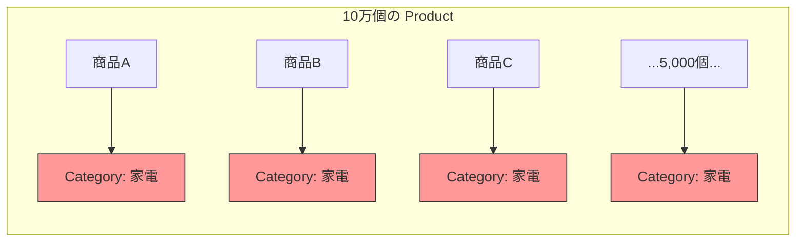
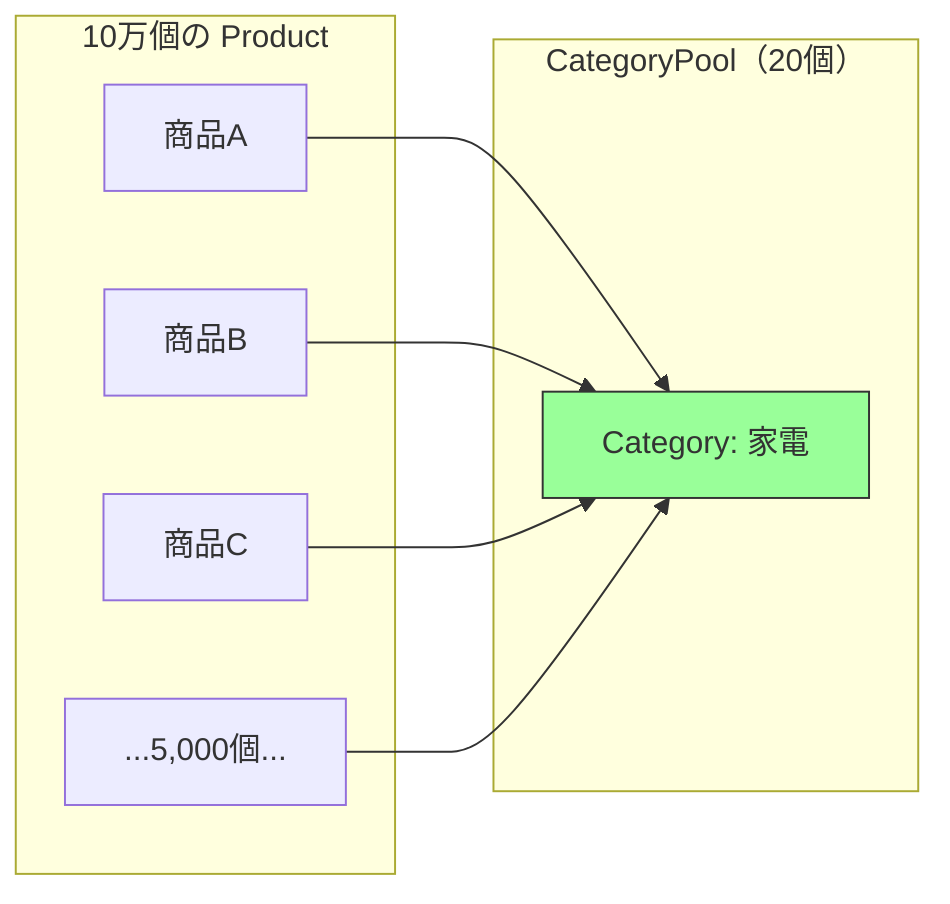

---
categories:
  - tech
date: 2026-03-28T07:07:05+09:00
description: 深夜のフラッシュセールで10万商品をメモリに載せたらOOMクラッシュ。20種類のカテゴリと5種類の税率が10万回も重複生成されていた惨事を「Flyweightパターン」の共有プールで解決するコード探偵ロックの推理。
draft: false
epoch: 1774649225
image: /public_images/2026/code-detective-flyweight/header.webp
iso8601: 2026-03-28T07:07:05+09:00
tags:
  - design-pattern
  - perl
  - moo
  - flyweight
  - duplicated-intrinsic-state
  - refactoring
  - code-detective
title: コード探偵ロックの事件簿【Flyweight】十万体の分身術〜共有すべき素顔の秘密〜
toc: true
---

深夜3時5分、QuickBuy のフラッシュセールは止まりました。

商品ロードが終わった直後、Perl のプロセスが `Out of Memory` で落ちたのです。商品ロード前は 200MB だったメモリ使用量が、わずか数秒で 2.4GB まで跳ね上がっていました。サーバーの上限は 2GB。開始5分で障害、推定売上損失は 5 千万円。数字だけ見れば十分に事故ですが、僕にはもう一つ理解できないことがありました。

10万件の商品で 2.4GB。単純計算で 1 商品あたり約 24KB です。けれど商品が持っているのは、名前、価格、在庫、カテゴリ、税率くらいです。そんなに重くなるはずがない。

僕は加藤。EC プラットフォーム「QuickBuy」のバックエンドエンジニアです。今回のセールでは「全商品をメモリに載せて、在庫と価格をリアルタイムに突き合わせたい」という要件を、そのまま正面から実装しました。10万件くらいなら何とかなるだろう。そう見積もったのが間違いでした。

翌日の午後、メモリダンプとログを抱えて LCI を訪ねました。ロックさんは机の上の空き缶を寄せ、僕が差し出したグラフを一目見て言いました。

「商品そのものより、付属品を複製しているね」

初対面の相手としては十分に不可解でしたが、少なくとも話はコードの中身から始まりました。僕としては、その時点でかなり助かっていました。

## 現場検証：10万件の中で何が膨らんだのか

「まずはクラス定義を見よう。メモリは嘘をつかない」

僕は Product 周辺のコードを開きました。

```perl
package Category {
    use Moo;

    has name       => ( is => 'ro', required => 1 );
    has icon       => ( is => 'ro', required => 1 );
    has sort_order => ( is => 'ro', required => 1 );
    has display_rules => ( is => 'ro', default => sub { {
        columns    => 4,
        show_badge => 1,
        theme      => 'default',
    } } );
}

package TaxRule {
    use Moo;

    has name   => ( is => 'ro', required => 1 );
    has rate   => ( is => 'ro', required => 1 );
    has type   => ( is => 'ro', required => 1 );
    has description => ( is => 'ro', default => '' );
}

package Product {
    use Moo;

    has name     => ( is => 'ro', required => 1 );
    has price    => ( is => 'ro', required => 1 );
    has stock    => ( is => 'rw', default  => 0 );
    has category => ( is => 'ro', required => 1 );  # Category オブジェクト
    has tax_rule => ( is => 'ro', required => 1 );  # TaxRule オブジェクト
}
```

ロックさんは軽くうなずきました。

「設計そのものは素直だ。問題は、これを10万件どう組み立てたかだろう」

そこで、セール用に追加したロード処理を見せました。

```perl
# フラッシュセール用：全商品をメモリにロード
my @products;

for my $row (@db_rows) {    # 10万行
    push @products, Product->new(
        name     => $row->{name},
        price    => $row->{price},
        stock    => $row->{stock},
        category => Category->new(
            name       => $row->{category_name},
            icon       => $row->{category_icon},
            sort_order => $row->{category_sort},
        ),
        tax_rule => TaxRule->new(
            name => $row->{tax_name},
            rate => $row->{tax_rate},
            type => $row->{tax_type},
        ),
    );
}
```

ロックさんはその場で紙に数字を書き始めました。

「ここだ。ループの内側で `Category->new` と `TaxRule->new` を毎回呼んでいる。商品が10万件なら、Category も 10 万個、TaxRule も 10 万個できる」

「でも、DB の行にはカテゴリ名も税率も入っています。そこから素直に組み立てただけです」

「では確認しよう。QuickBuy のカテゴリは何種類ある？」

「えっと……家電、食品、ファッション、書籍、スポーツ……全部で20種類です」

「税率の種類は？」

「標準税率10%、軽減税率8%、非課税、輸出免税、経過措置——5種類です」

「それなら、商品が10万件あってもカテゴリの実体は 20 種類、税率ルールは 5 種類で足りる。ところが今のコードは、その20種類と5種類を毎回作り直している。商品名や在庫のように個別であるべき値と、共有できる値が同じ箱に入っているんだ」

「つまり、商品ごとに違うものだけを持てばよかったのに、共通のカテゴリ情報まで抱え込ませていたんですね」

「その通り。商品を増やしたつもりが、同じ付属品まで増やしていたわけだ」



「赤いノードは全部ほぼ同じ中身だ。違う個体として持つ意味がない」

ロックさんは図の余白に二つの言葉を書きました。

- 内部状態: 全インスタンスで共有できる不変データ
- 外部状態: インスタンスごとに異なるデータ

「カテゴリ名、アイコン、表示ルール、税率。これは内部状態だ。商品名、価格、在庫は外部状態だ。今の設計では内部状態まで商品ごとに複製されている。これが Duplicated Intrinsic State、つまり内部状態の重複だ」

「内部状態だけ外に出して共有すれば、商品は軽くなるということですか」

「そうだ。10万件が重いのではない。共有できるものまで10万回 `new` しているのが重いんだ」

## 推理：共有すべきものを共有する

「対策は単純だ。内部状態だけ別管理にして、必要なときに参照させればいい」

ロックさんは僕のノートPCを手元に寄せて、まずプールを切り出しました。

【After】共有プール（CategoryPool / TaxRulePool）

```perl
package CategoryPool {
    use Moo;

    has _cache => ( is => 'ro', default => sub { {} } );

    sub get ($self, %args) {
        my $key = $args{name};
        $self->_cache->{$key} //= Category->new(%args);
        return $self->_cache->{$key};
    }

    sub count ($self) { scalar keys $self->_cache->%* }
}

package TaxRulePool {
    use Moo;

    has _cache => ( is => 'ro', default => sub { {} } );

    sub get ($self, %args) {
        my $key = $args{name};
        $self->_cache->{$key} //= TaxRule->new(%args);
        return $self->_cache->{$key};
    }

    sub count ($self) { scalar keys $self->_cache->%* }
}
```

「`get` は、同じキーのオブジェクトがなければ一度だけ作り、以降は同じものを返す。ここで重要なのは、Category や TaxRule 自体の API を変えていないことだ。共有の責務をプール側に閉じ込めている」

「ということは、`Product` 側はカテゴリの作り方を知らなくていいんですね。必要なものを受け取るだけで済む」

「そうだ。共有の都合をドメイン本体に漏らさない。それも大事な設計だ」

次に、商品ロードをプール経由に直しました。

【After】プールを使った商品ロード

```perl
my $cat_pool = CategoryPool->new;
my $tax_pool = TaxRulePool->new;

my @products;

for my $row (@db_rows) {    # 10万行
    push @products, Product->new(
        name     => $row->{name},
        price    => $row->{price},
        stock    => $row->{stock},
        category => $cat_pool->get(
            name       => $row->{category_name},
            icon       => $row->{category_icon},
            sort_order => $row->{category_sort},
        ),
        tax_rule => $tax_pool->get(
            name => $row->{tax_name},
            rate => $row->{tax_rate},
            type => $row->{tax_type},
        ),
    );
}
```

「見た目の差分は小さい。だが意味は大きい。ループのたびに新しい内部状態を作るのではなく、既存の内部状態を再利用するようになった」

```perl
# プールの中身を確認
print "カテゴリ数: " . $cat_pool->count . "\n";    # 20（10万ではなく！）
print "税率ルール数: " . $tax_pool->count . "\n";  # 5（10万ではなく！）
```

「でも、本当に同じオブジェクトなんですか。値が同じなだけではなくて」

「確認してみよう。疑うのは健全だ」

```perl
# 「家電」カテゴリの商品を2つ取得
my @electronics = grep { $_->category->name eq '家電' } @products;

# 同一オブジェクトかどうか確認（リファレンスの比較）
if ($electronics[0]->category == $electronics[1]->category) {
    print "同一オブジェクト！\n";    # ← こちらが出力される
}
else {
    print "別オブジェクト\n";
}
```

「`==` で同じになるなら、本当に共有されていますね」

「そういうことだ。見た目が同じなのではなく、同じ実体を見ている」



「これが Flyweight パターンだ」とロックさんは言いました。「共有可能な内部状態を、外部状態から切り離して再利用する。大げさな仕掛けではない。オブジェクトの数え方を正しくするだけだ」

「カテゴリが 10 万個から 20 個、税率が 10 万個から 5 個……。内部状態だけ見れば、別物みたいな差ですね」

「商品固有のデータは残る。それでも共有できる部分だけで、十分に壁を崩せる」

## 検証結果：2.4GB から 240MB へ

ロックさんは最終的に、再現用のテスト結果を並べてくれました。

```bash
$ prove -v t/flyweight.t
# Subtest: Before: Duplicated Intrinsic State
    ok 1 - 100,000 products loaded
    ok 2 - 100,000 Category objects created (duplicated!)
    ok 3 - 100,000 TaxRule objects created (duplicated!)
    ok 4 - Two products in same category have DIFFERENT Category objects
    ok 5 - Memory usage: ~2.4GB (OOM risk)
ok 1 - Before: Duplicated Intrinsic State
# Subtest: After: Flyweight Pattern
    ok 1 - 100,000 products loaded
    ok 2 - Only 20 Category objects in pool
    ok 3 - Only 5 TaxRule objects in pool
    ok 4 - Two products in same category share the SAME object
    ok 5 - Memory usage: ~240MB (safe)
    ok 6 - Category data is identical regardless of access path
    ok 7 - Adding 'オーガニック' category creates only 1 new object
    ok 8 - Pool count after new category: 21
ok 2 - After: Flyweight Pattern
All tests successful.
```

「新しいカテゴリを足しても、増えるのは 1 個だけなんですね」

「共有の単位がカテゴリだからね。商品数ではなく、種類数で増える」

何より大きかったのは、メモリ使用量が約 2.4GB から約 240MB まで落ちたことでした。問題の本質が「商品数」ではなく「重複した内部状態」だったと、ようやく腹落ちしました。

そのあとロックさんは、締めのように一つだけ注意点を添えました。

「Flyweight は共有した内部状態を変更しないと約束できるときだけ効く。もし『同じ家電カテゴリでも、この商品だけ表示ルールを変えたい』という要件があるなら、それは共有オブジェクトに持たせるべきではない。外部状態として分離するか、共有そのものをやめるべきだ」

この話が重要でした。共有は魔法ではありません。不変であるから共有できる。不変でないなら、共有はむしろ事故の入口になります。

LCI を出たあと、僕は CTO への報告にこう書きました。原因はメモリ不足ではなく、共有可能データの複製。対策は Flyweight による内部状態の共有。次のセールでは、同じ失敗は繰り返さないはずです。

---

## 探偵の調査報告書

| 容疑（アンチパターン） | 真実（パターン） | 証拠（効果） |
| :--- | :--- | :--- |
| Duplicated Intrinsic State（内部状態の重複）。10万個のオブジェクトが、20種類のカテゴリと5種類の税率のデータをそれぞれ個別に保持。本来25個で済む共有データが20万個に膨張し、メモリを2.4GB消費してOOMクラッシュを引き起こした。 | Flyweight パターン。不変の共有データ（内部状態）をプールで一元管理し、各オブジェクトはプールへの参照だけを保持する。10万個のオブジェクトが25個の共有インスタンスを参照し、メモリ使用量を99.99%削減。 | メモリ使用量が2.4GBから約240MBに削減。Category オブジェクトが10万個→20個、TaxRule オブジェクトが10万個→5個に。新カテゴリ追加はプールに1個増えるだけ。ロード処理の変更は `new` を `pool->get` に差し替えるだけで、呼び出し側の構造変更は不要。 |

### 推理のステップ

1. 内部状態と外部状態を分ける: 全商品で共有できる不変データと、商品ごとに異なるデータを切り分ける
2. 共有プールを用意する: 同じキーなら同じオブジェクトを返す `get` を実装する
3. 生成箇所だけ差し替える: `new` を直接呼ばず、プール経由で内部状態を取得する
4. 参照共有をテストする: 同じカテゴリの商品が同じオブジェクトを参照していることを確認する
5. 不変性を確認する: 共有オブジェクトを書き換える要件がないかを最後に点検する

### ロックより

オブジェクトを細かく分けること自体は悪くありません。問題は、同じ中身を大量に複製しているのに、それを個別の実体として抱え続けることです。

Flyweight パターンは派手な技巧ではなく、共有してよいものを見極める整理術です。内部状態が不変なら共有する。可変なら共有しない。この判断を誤らなければ、メモリ使用量だけでなく、設計の見通しもかなり改善します。
