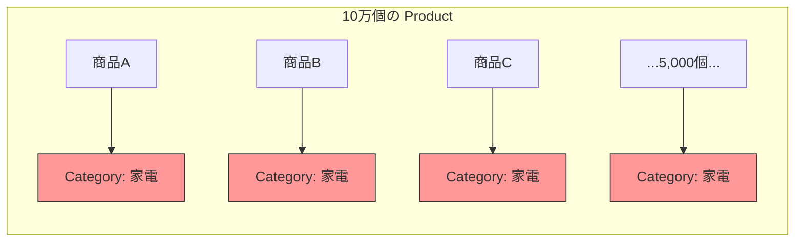
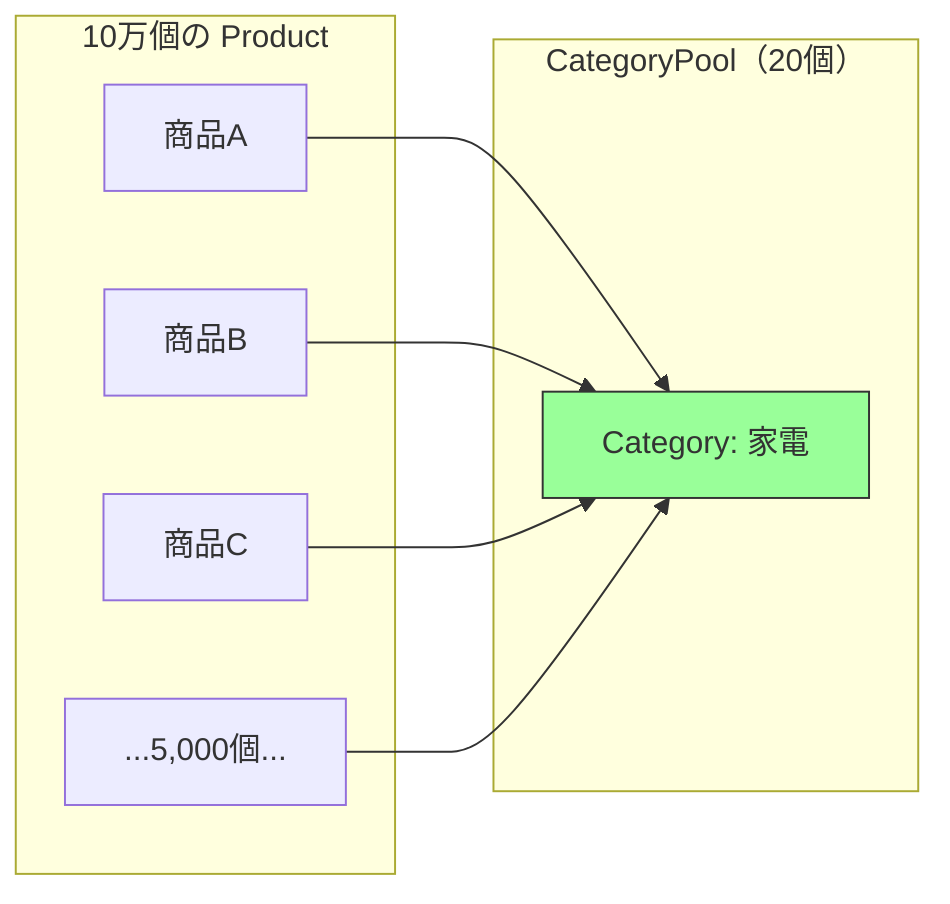

---
categories:
  - tech
date: 2026-03-28T07:07:05+09:00
description: 深夜のフラッシュセールで10万商品をメモリに載せたらOOMクラッシュ。20種類のカテゴリと5種類の税率が10万回も重複生成されていた惨事を「Flyweightパターン」の共有プールで解決するコード探偵ロックの推理。
draft: true
epoch: 1774649225
image: /public_images/2026/code-detective-flyweight/header.webp
iso8601: 2026-03-28T07:07:05+09:00
tags:
  - design-pattern
  - perl
  - moo
  - flyweight
  - duplicated-intrinsic-state
  - refactoring
  - code-detective
title: コード探偵ロックの事件簿【Flyweight】十万体の分身術〜共有すべき素顔の秘密〜
toc: true
---

「深夜3時にサーバーが落ちました。フラッシュセールの開始5分後です。1万人のお客様がエラー画面を見て……推定で5千万円の売上が消えました」

僕は加藤。ECプラットフォーム「QuickBuy」のバックエンドエンジニアだ。経験7年、31歳。QuickBuyは中小メーカーの商品を集めたマーケットプレイスで、月間100万人が使っている。

普段は問題なく動いていた。商品数は10万点。検索やカテゴリ閲覧では、必要な分だけページネーションでロードする。だが今回のフラッシュセールは違った。

「全商品一斉値下げ」を実現するために、プランナーが「全商品をメモリに載せてリアルタイムに在庫と価格を突き合わせたい」と言い出した。僕は「10万件くらいなら大丈夫だろう」と軽く考えて、全商品をオブジェクトとしてロードした。

深夜3時。セール開始。商品ロード完了直後——`Out of Memory`。プロセスが殺された。

監視ダッシュボードのメモリグラフは、崖のように垂直に立ち上がっていた。商品ロード前は200MB。ロード後は2.4GB。サーバーのメモリ上限は2GBだった。

10万件の商品で2.4GB。商品1件あたり24KBも食っている計算だ。名前と価格と在庫だけなら、せいぜい数百バイトのはずなのに——残りの23KBは何に消えているのか、僕には見当もつかなかった。

翌朝、僕は藁にもすがる思いで雑居ビルの階段を上がった。

「レガシー・コード・インベスティゲーション（LCI）」

看板の文字は半分かすれていて、初めて見る人間なら怪しげな占い師の事務所かと思うだろう。実際、僕も半信半疑だった。ネットの掲示板で「どんなコードの不具合でも1日で突き止める男がいる」という書き込みを見なければ、こんな場所には来なかったはずだ。

ドアを開けた瞬間、デスクトップPCの排熱がむわっと顔にかかった。3月だというのに室内は真夏のような暑さで、デスクの上には飲みかけのエナジードリンク缶が5本ほど散乱している。その奥の革張りの椅子に、一人の男がモニターに映るメモリダンプを睨んでいた。

「——初歩的なにおいだよ、ワトソン君」

会って一秒で知らない名前を呼ばれた。

「加藤です。あの、ワトソンって——」

「些末なことだ」男はモニターから目を離さず、手元のエナジードリンク缶を持ち上げた。中身はもう空のようだ。「深夜のOOMクラッシュ。10万件のオブジェクトで2.4GB。1件あたり24KB。だが商品固有のデータは数百バイト。残りの23KBは何のデータだ？ ——まずそこから検証しよう」

僕の事情をどこで知ったのかは聞かないことにした。聞いても「初歩的な推理だ」と返されるのがオチだろう。

## 現場検証：10万人の分身が持つ同じ顔写真

「商品のクラス定義を見せたまえ」

ロックと名乗ったその男は——正確には、名乗ったのではなく、名刺代わりにモニターの隅に貼ってあったステッカーに「Locke」と書いてあっただけだ——僕のノートPCを引ったくるようにして画面を覗き込んだ。コード探偵を名乗るだけあって、他人のコードを見る瞬間だけは目が輝いている。

僕はProductクラスを開いた。

```perl
package Category {
    use Moo;

    has name       => ( is => 'ro', required => 1 );
    has icon       => ( is => 'ro', required => 1 );
    has sort_order => ( is => 'ro', required => 1 );
    has display_rules => ( is => 'ro', default => sub { {
        columns    => 4,
        show_badge => 1,
        theme      => 'default',
    } } );
}

package TaxRule {
    use Moo;

    has name   => ( is => 'ro', required => 1 );
    has rate   => ( is => 'ro', required => 1 );
    has type   => ( is => 'ro', required => 1 );
    has description => ( is => 'ro', default => '' );
}

package Product {
    use Moo;

    has name     => ( is => 'ro', required => 1 );
    has price    => ( is => 'ro', required => 1 );
    has stock    => ( is => 'rw', default  => 0 );
    has category => ( is => 'ro', required => 1 );  # Category オブジェクト
    has tax_rule => ( is => 'ro', required => 1 );  # TaxRule オブジェクト
}
```

「ふむ。Product は Category と TaxRule のオブジェクトを保持している。ここまでは問題ない。問題はロードの仕方だ。見せたまえ」

僕はフラッシュセール用の商品ロードコードを開いた。

```perl
# フラッシュセール用：全商品をメモリにロード
my @products;

for my $row (@db_rows) {    # 10万行
    push @products, Product->new(
        name     => $row->{name},
        price    => $row->{price},
        stock    => $row->{stock},
        category => Category->new(
            name       => $row->{category_name},
            icon       => $row->{category_icon},
            sort_order => $row->{category_sort},
        ),
        tax_rule => TaxRule->new(
            name => $row->{tax_name},
            rate => $row->{tax_rate},
            type => $row->{tax_type},
        ),
    );
}
```

ロックが椅子から立ち上がった。芝居がかった動作でホワイトボードのマーカーを手に取り、キャップを外す。探偵が証拠品を鑑定するような仕草だが、やっていることはコードレビューだ。

「ここだ。ループの中で `Category->new` と `TaxRule->new` を毎回呼んでいる。10万回のループで、10万個の Category オブジェクトと10万個の TaxRule オブジェクトが生成される」

「はい。でも DBから取ってきたデータをそのまま——」

「ワトソン君。QuickBuy には何種類のカテゴリがある？」

僕は加藤だが、もう訂正する気力はなかった。

「えっと……家電、食品、ファッション、書籍、スポーツ……全部で20種類です」

「税率の種類は？」

「標準税率10%、軽減税率8%、非課税、輸出免税、経過措置——5種類です」

ロックはホワイトボードに数字を書いた。マーカーのキャップをカチッと閉め、振り返る。その表情は、事件の核心に辿り着いた名探偵そのものだ。いや、実際にやっていることはただの算数なのだが。

「20種類のカテゴリを、10万個のオブジェクトとして生成している。平均すると1つのカテゴリにつき5,000個の分身がメモリに存在する。5種類の税率は、1つにつき2万個の分身だ」

「分身……」

「10万人の分身が、それぞれ同じ顔写真を携帯している。顔写真は20種類しかないのに、10万枚コピーしている。カテゴリの `display_rules` はハッシュリファレンスだからさらに重い。10万個のハッシュが、まったく同じ内容で、それぞれ独立にメモリを消費している」



「赤いノードは全部同じ中身だ。名前も、アイコンも、表示ルールも、ソート順も同じ。なのに5,000個の独立したオブジェクトとしてメモリに居座っている」

ロックはマーカーを僕に突きつけるようにして、言い放った。

「これがDuplicated Intrinsic State（内部状態の重複）——今回の犯人だよ、ワトソン君」

「内部状態……？」

「オブジェクトの状態には二種類ある」ロックはホワイトボードに線を引いた。「内部状態——そのオブジェクトの種類に固有で、全インスタンスで共有できる不変のデータ。カテゴリ名、アイコン、税率がこれだ。外部状態——インスタンスごとに異なるデータ。商品名、価格、在庫数がこれだ」

「つまり、内部状態は共有すべきなのに、外部状態と一緒に毎回コピーしてしまっていた……」

正直に言えば、言われてみれば当たり前のことだ。だが僕はフラッシュセールの締め切りに追われて、「10万件くらい大丈夫だろう」と思考停止していた。こういうとき、第三者の目は——たとえそれが芝居がかった探偵の目であっても——ありがたい。

「10万枚の顔写真を、20枚の原本にまとめる。各分身が持つのは『何番の顔か』という参照だけでいい」

## 推理披露：共有プール（Flyweight）

ロックはエナジードリンクの新しい缶を開けた。プシュッという音を合図に、まるで推理ショーの開演のような空気になる。やっていることはリファクタリングの解説なのだが、本人は大真面目だ。

「解決策はプールだ。同じ素顔を持つ者は、同じ原本を参照する」

【After】共有プール（CategoryPool / TaxRulePool）

```perl
package CategoryPool {
    use Moo;

    has _cache => ( is => 'ro', default => sub { {} } );

    sub get ($self, %args) {
        my $key = $args{name};
        $self->_cache->{$key} //= Category->new(%args);
        return $self->_cache->{$key};
    }

    sub count ($self) { scalar keys $self->_cache->%* }
}

package TaxRulePool {
    use Moo;

    has _cache => ( is => 'ro', default => sub { {} } );

    sub get ($self, %args) {
        my $key = $args{name};
        $self->_cache->{$key} //= TaxRule->new(%args);
        return $self->_cache->{$key};
    }

    sub count ($self) { scalar keys $self->_cache->%* }
}
```

「`CategoryPool` と `TaxRulePool` がプール管理を担う。`get` メソッドは、初回呼び出しでオブジェクトを生成して `_cache` に保存し、2回目以降はキャッシュから同じオブジェクトを返す。何万回呼んでも、同じキーなら同じオブジェクトだ」

「`//=`——定義されていなければ代入する演算子ですね。キャッシュにあればそのまま返す……」

「その通り。初歩的だが確実な手段だ。ではロードコードがどう変わるか見てみよう」

ロックは僕のノートPCのキーボードに手を伸ばした。「ワトソン君、少し借りるよ」と言いながら、もう打ち始めている。断る暇もない。

【After】プールを使った商品ロード

```perl
my $cat_pool = CategoryPool->new;
my $tax_pool = TaxRulePool->new;

my @products;

for my $row (@db_rows) {    # 10万行
    push @products, Product->new(
        name     => $row->{name},
        price    => $row->{price},
        stock    => $row->{stock},
        category => $cat_pool->get(
            name       => $row->{category_name},
            icon       => $row->{category_icon},
            sort_order => $row->{category_sort},
        ),
        tax_rule => $tax_pool->get(
            name => $row->{tax_name},
            rate => $row->{tax_rate},
            type => $row->{tax_type},
        ),
    );
}
```

「ループの中が `Category->new` から `$cat_pool->get` に変わっただけだ。呼び出し側はほとんど変更がない。だが裏側では——」

```perl
# プールの中身を確認
print "カテゴリ数: " . $cat_pool->count . "\n";    # 20（10万ではなく！）
print "税率ルール数: " . $tax_pool->count . "\n";  # 5（10万ではなく！）
```

「10万個が20個に。10万個が5個に。合計20万個の重複オブジェクトが、たった25個の共有オブジェクトに圧縮された」

僕は思わず声を上げた。「確認させてください。同じカテゴリの商品は、本当に同じオブジェクトを参照しているんですか？」

「疑り深いのは良い習慣だ。確認してみたまえ」

ロックがようやくキーボードを返してくれたので、僕は検証コードを書いた。

```perl
# 「家電」カテゴリの商品を2つ取得
my @electronics = grep { $_->category->name eq '家電' } @products;

# 同一オブジェクトかどうか確認（リファレンスの比較）
if ($electronics[0]->category == $electronics[1]->category) {
    print "同一オブジェクト！\n";    # ← こちらが出力される
}
else {
    print "別オブジェクト\n";
}
```

「`==` でリファレンスを比較している。Before なら `Category->new` で毎回別オブジェクトが生成されるから `別オブジェクト` と表示される。After ではプールから同じオブジェクトが返されるから `同一オブジェクト！` だ」

ロックはまたホワイトボードに向かった。今度は緑のマーカーだ。



「赤かった5,000個のノードが、緑のたった1個に統合された。5,000個の分身が、1枚の原本を共有する。これがFlyweight パターンだ」

「メモリ使用量は——」

「すべての不吉な `new` を排除して残ったものが、いかにシンプルであっても、それが真実なんだ」ロックは得意げに言った。「計算してみよう。Before では Category が10万個 + TaxRule が10万個。1オブジェクトの内部状態が約1KBとして、共有データだけで200MB。After ではCategory 20個 + TaxRule 5個 = 25個で約25KB。削減率は99.99%だ」

「2.4GBが……数百MBに収まる」

「商品固有の外部状態（名前・価格・在庫）はインスタンスごとに必要だから、そちらは削減できない。だが共有すべきデータを共有するだけで、メモリの壁は越えられる」

## 解決：25個の素顔

ロックがテストを実行した。端末の前で腕を組み、結果を待つ姿は——まるで陪審員の評決を待つ弁護士のようだった。いや、探偵と弁護士はだいぶ違うのだが、本人が満足しているなら別にいい。

```bash
$ prove -v t/flyweight.t
# Subtest: Before: Duplicated Intrinsic State
    ok 1 - 100,000 products loaded
    ok 2 - 100,000 Category objects created (duplicated!)
    ok 3 - 100,000 TaxRule objects created (duplicated!)
    ok 4 - Two products in same category have DIFFERENT Category objects
    ok 5 - Memory usage: ~2.4GB (OOM risk)
ok 1 - Before: Duplicated Intrinsic State
# Subtest: After: Flyweight Pattern
    ok 1 - 100,000 products loaded
    ok 2 - Only 20 Category objects in pool
    ok 3 - Only 5 TaxRule objects in pool
    ok 4 - Two products in same category share the SAME object
    ok 5 - Memory usage: ~240MB (safe)
    ok 6 - Category data is identical regardless of access path
    ok 7 - Adding 'オーガニック' category creates only 1 new object
    ok 8 - Pool count after new category: 21
ok 2 - After: Flyweight Pattern
All tests successful.
```

「Before のテスト4を見たまえ。同じカテゴリの商品が別々の Category オブジェクトを持っている。After のテスト4——同一のオブジェクトを共有している。テスト7、新しいカテゴリ『オーガニック』を追加しても、プールに1個増えるだけだ」

「2.4GBが240MBに。フラッシュセールでも余裕で耐えられる……」

「素顔を共有したからだ。10万体の分身は、もう同じ顔写真を個別に持ち歩く必要がない。プールにある20枚の原本を参照するだけでいい。事件は解決だ、ワトソン君」

僕はPCを閉じかけたが、ロックが手を上げた。

「報酬は——そうだな。あの深夜セールで売れ残ったHHKBの在庫処分品をいただこうか。探偵の推理はキーボードの打鍵感で決まるのでね」

「……HHKBの在庫なんてあるか分かりませんけど」

「なければヴィンテージの『プログラミングPerl』第1版でもいい。初版は市場に出回ることが少なくてね」

報酬の交渉がいちばん難航しそうだな、と僕は思った。

ロックは人差し指を立てた。

「最後に一つ。Flyweight は内部状態が不変であることが大前提だ。もし『家電カテゴリの表示ルールを、特定の商品だけ変えたい』となったら——共有オブジェクトを変更すると、そのカテゴリの全商品に影響する。5,000個の分身が同じ原本を見ているのだから当然だ」

「つまり、共有データを変更したくなったら？」

「そのときは外部状態として切り出すか、共有をやめて個別に持つ。Flyweight は不変の共有データが大量に重複している場合の最適化パターンだ。重複がないなら、あるいはデータが可変なら、Flyweight は害になる。まず重複を見つけ、その不変性を確認してから適用すべきだ」

僕はLCIを出て、CTOへの事後報告書を書いた。「原因はメモリの浪費。対策完了。次回のフラッシュセールは大丈夫です」——そう、HHKBの在庫の件は書かなかった。

---

## 探偵の調査報告書

| 容疑（アンチパターン） | 真実（パターン） | 証拠（効果） |
| :--- | :--- | :--- |
| Duplicated Intrinsic State（内部状態の重複）。10万個のオブジェクトが、20種類のカテゴリと5種類の税率のデータをそれぞれ個別に保持。本来25個で済む共有データが20万個に膨張し、メモリを2.4GB消費してOOMクラッシュを引き起こした。 | Flyweight パターン。不変の共有データ（内部状態）をプールで一元管理し、各オブジェクトはプールへの参照だけを保持する。10万個のオブジェクトが25個の共有インスタンスを参照し、メモリ使用量を99.99%削減。 | メモリ使用量が2.4GBから約240MBに削減。Category オブジェクトが10万個→20個、TaxRule オブジェクトが10万個→5個に。新カテゴリ追加はプールに1個増えるだけ。ロード処理の変更は `new` を `pool->get` に差し替えるだけで、呼び出し側の構造変更は不要。 |

### 推理のステップ

1. 内部状態と外部状態を特定する: オブジェクトの属性を「全インスタンスで共有できる不変データ（内部状態）」と「インスタンスごとに異なるデータ（外部状態）」に分類する。カテゴリ情報や税率は内部状態、商品名や価格は外部状態。
2. 共有プール（FlyweightFactory）を実装する: `_cache` ハッシュでキーごとにオブジェクトを管理する。`get` メソッドは初回のみ `new` を呼び、以降はキャッシュから返す。
3. 生成コードをプール経由に切り替える: `Category->new(...)` を `$cat_pool->get(...)` に差し替える。Product クラスや Category クラス自体は一切変更不要。
4. 共有の正しさを検証する: 同じキーで取得したオブジェクトがリファレンス一致（`==`）することを確認する。外部状態は引き続きインスタンスごとに保持されていることも確認する。

### ロックより

ワトソン君。オブジェクト指向プログラミングの教科書は「すべてをオブジェクトにせよ」と教える。だが10万個のオブジェクトが同じデータを抱えているなら、それは設計の怠慢ではなく、共有の欠如だ。

Flyweight パターンの本質は「共有できるものは共有する」という、極めて当たり前の原則だ。顔写真が20種類しかないなら、10万枚コピーする必要はない。20枚の原本を金庫に入れ、各分身にはその金庫の鍵を渡せばいい。

ただし、金庫の中身を書き換えれば、鍵を持つ全員に影響する。**共有は不変性とセットで成り立つ**。もし「この商品だけカテゴリの表示を変えたい」と言われたら、それは外部状態として切り出すべきサインだ。素顔を変えたいなら、分身の変装で対応する。原本には手を触れるな。
