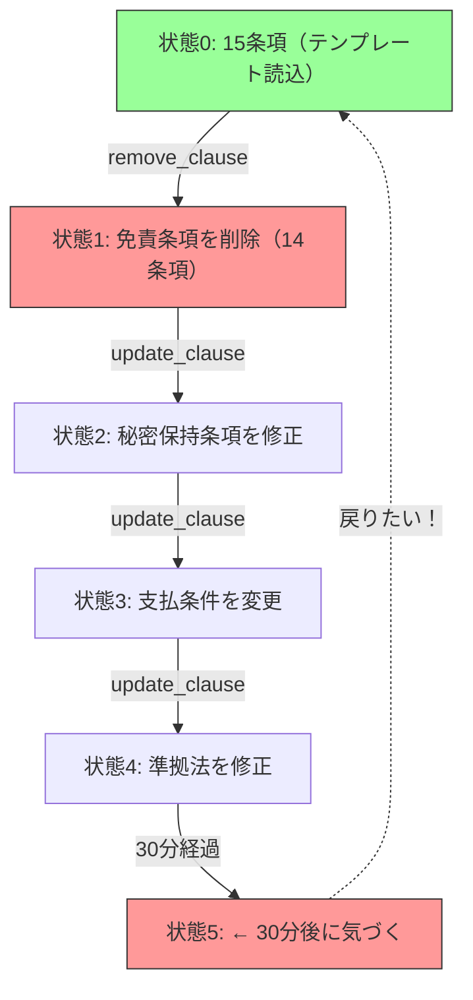
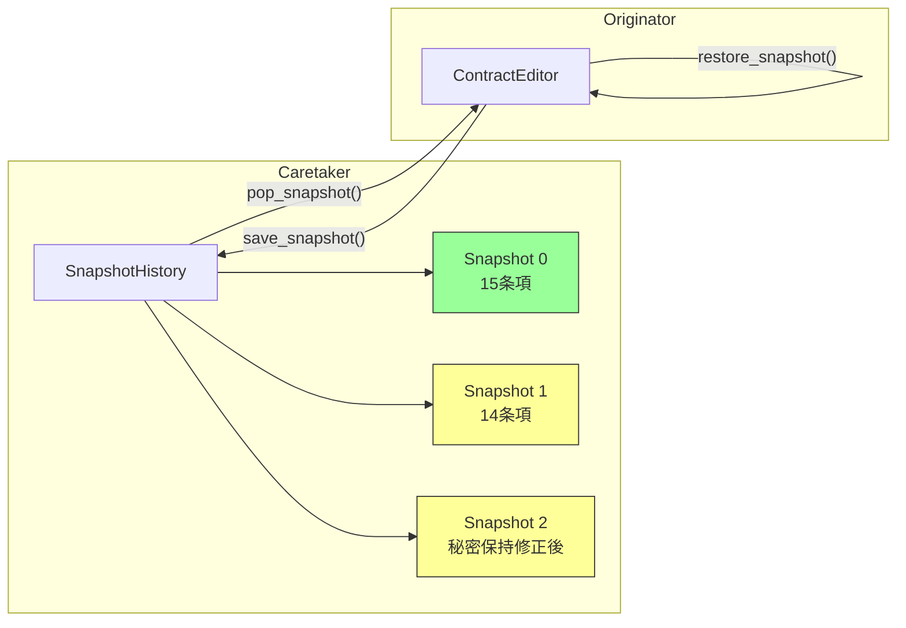

---
categories:
  - tech
date: 2026-03-29T07:07:05+09:00
description: 契約書起草SaaSで免責条項を消した若手弁護士。構造化データは復元できず2000万円の損害が発生。状態をカプセル化して保存するMementoパターンでコード探偵ロックが時間を巻き戻す。
draft: false
epoch: 1774735625
image: /public_images/2026/code-detective-memento/header.webp
iso8601: 2026-03-29T07:07:05+09:00
tags:
  - design-pattern
  - perl
  - moo
  - memento
  - destructive-state-mutation
  - refactoring
  - code-detective
title: コード探偵ロックの事件簿【Memento】失われた条項の記憶〜状態を封じるタイムカプセル〜
toc: true
---

「Ctrl+Z を 47 回押しました。文字は戻りました。でも、契約書そのものは戻らなかったんです」

僕は三村。リーガルテック・スタートアップ「ClauseForge」のバックエンドエンジニアです。ClauseForge は、中堅法律事務所向けの契約書起草 SaaS で、弁護士がテンプレートから条項を組み立て、並べ替え、修正しながら契約書を仕上げます。

問題が起きたのは、先週金曜の夕方でした。新人弁護士の田中さんが、3 億円規模の業務委託契約書を編集していました。テンプレートから 15 個の条項を読み込み、免責条項を直している最中に、誤って「条項削除」を押したのです。

消えたのは第 12 条でした。田中さんは気づかないまま、残りの 30 分で秘密保持条項の範囲を広げ、支払条件を直し、準拠法も調整しました。上司レビューに出して初めて「免責条項がない」と判明し、そこで Ctrl+Z が連打されました。

テキストフィールドの文字列は戻りました。けれど条項の一覧には、削除された第 12 条が帰ってきませんでした。ClauseForge にはテキストの Undo はあっても、条項の追加・削除・並べ替えという構造化データの状態遷移を戻す仕組みがなかったのです。

その契約書は免責条項が抜けたまま締結されました。3 か月後にトラブルが起き、ClauseForge には 2000 万円の損害賠償請求が来ました。CTO からは原因説明と再発防止策を週内にまとめろと言われ、最後に一言だけ付け足されました。

「整理しきれないなら、LCI に行け。名前は変だが腕は確かだ」

LCI の名前だけは、その一言で初めて知りました。

翌週の月曜、ログと再現手順を持ってその事務所を訪ねました。ロックさんは机の端に積まれた契約書の見本と技術書の間から僕の資料を受け取り、最初のページだけ見て言いました。

「消えたのは文章ではなく、状態だね」

噂どおり、挨拶より結論が先に来る人らしいと、その瞬間に分かりました。

## 現場検証：消えた条項はどこで失われたのか

「まずは、条項を持っている側のコードを見よう」

僕は ContractEditor クラスを開きました。

```perl
package Clause {
    use Moo;

    has id      => ( is => 'ro', required => 1 );
    has title   => ( is => 'rw', required => 1 );
    has body    => ( is => 'rw', required => 1 );
    has article => ( is => 'rw', required => 1 );  # 第○条
}

package ContractEditor {
    use Moo;
    use Types::Standard qw( ArrayRef InstanceOf Str );

    has title   => ( is => 'rw', default => '無題の契約書' );
    has clauses => (
        is      => 'rw',
        isa     => ArrayRef[InstanceOf['Clause']],
        default => sub { [] },
    );

    sub add_clause ($self, $clause) {
        push $self->clauses->@*, $clause;
        $self->_renumber();
    }

    sub remove_clause ($self, $id) {
        $self->clauses([ grep { $_->id ne $id } $self->clauses->@* ]);
        $self->_renumber();
    }

    sub update_clause ($self, $id, %changes) {
        for my $c ($self->clauses->@*) {
            next unless $c->id eq $id;
            $c->title($changes{title}) if exists $changes{title};
            $c->body($changes{body})   if exists $changes{body};
        }
    }

    sub move_clause ($self, $id, $new_pos) {
        my @list = $self->clauses->@*;
        my ($idx) = grep { $list[$_]->id eq $id } 0..$#list;
        return unless defined $idx;
        my ($item) = splice @list, $idx, 1;
        splice @list, $new_pos, 0, $item;
        $self->clauses(\@list);
        $self->_renumber();
    }

    sub _renumber ($self) {
        my $n = 1;
        $_->article("第${n}条") && $n++ for $self->clauses->@*;
    }
}
```

ロックさんは数行読むごとに指を止め、変更メソッドだけを順に確認しました。

「`remove_clause` は配列を作り直して上書きしている。`update_clause` は条項オブジェクトを直接変更している。`move_clause` も同じだ。どの操作も、変更前の状態を残していない」

「削除前の条項を、どこか別に逃がしているわけでもないんですね」

「ない。だから消した瞬間に痕跡が切れる。編集のたびに現在だけが残る設計だ」



「必要だったのは、状態 0 の控えだ」とロックさんは言いました。「あの時点の契約書全体を保存していれば、そこまで戻れた」

そこで僕は、以前に見た別のやり方を思い出しました。

「Undo なら、Command パターンでやる方法もありますよね。操作を覚えて逆実行するやつです」

「ある」とロックさんはうなずきました。「ただ今回は、削除、本文編集、並べ替え、条番号の振り直しが混ざっている。操作ごとに正確な逆操作を積み上げるより、状態そのものを保存したほうが素直だ」

「つまり、何をしたかより、その時どうなっていたかを残すんですね」

「そうだ。今回の優先順位は操作履歴より、契約書全体の復元だ」

## 対策：状態を封じて戻す

「Memento で行こう。今の状態をタイムカプセルにして預ける」

ロックさんは役割を三つに分けて説明しました。

- Originator（生成者）: `ContractEditor`——自分の状態をスナップショットに書き出し、スナップショットから復元できる
- Memento（記念品）: `ContractSnapshot`——状態を封じたタイムカプセル。中身は外部から触れない
- Caretaker（管理人）: `SnapshotHistory`——タイムカプセルの保管庫。いつ・どの状態を保存したかを管理する

「管理人は、中身を知らなくていいんですか」

「いい。いつ保存したか、どれを返すかだけ分かれば十分だ。中身まで知り始めると責務が濁る」

【After】Memento（ContractSnapshot）

```perl
package ContractSnapshot {
    use Moo;
    use Storable qw( dclone );

    has _state => ( is => 'ro', required => 1 );
    has _label => ( is => 'ro', default => '' );
    has _timestamp => (
        is      => 'ro',
        default => sub { time() },
    );

    sub label     ($self) { $self->_label }
    sub timestamp ($self) { $self->_timestamp }

    # _state への直接アクセスは Originator だけに許す設計意図。
    # Perl には private がないため、命名規約（_プレフィクス）で表現。
    sub _get_state ($self) { dclone($self->_state) }
}
```

「普通の代入では駄目ですか」

「駄目だ。参照だけ共有したら、今の編集が保存した過去まで書き換えてしまう。だから `dclone` で深く複製する」

【After】Originator（ContractEditor に save / restore を追加）

```perl
package ContractEditor {
    use Moo;
    use Storable qw( dclone );
    use Types::Standard qw( ArrayRef InstanceOf );

    has title   => ( is => 'rw', default => '無題の契約書' );
    has clauses => (
        is      => 'rw',
        isa     => ArrayRef[InstanceOf['Clause']],
        default => sub { [] },
    );

    # ---- 既存の操作メソッド（変更なし）----
    sub add_clause ($self, $clause) {
        push $self->clauses->@*, $clause;
        $self->_renumber();
    }

    sub remove_clause ($self, $id) {
        $self->clauses([ grep { $_->id ne $id } $self->clauses->@* ]);
        $self->_renumber();
    }

    sub update_clause ($self, $id, %changes) {
        for my $c ($self->clauses->@*) {
            next unless $c->id eq $id;
            $c->title($changes{title}) if exists $changes{title};
            $c->body($changes{body})   if exists $changes{body};
        }
    }

    sub move_clause ($self, $id, $new_pos) {
        my @list = $self->clauses->@*;
        my ($idx) = grep { $list[$_]->id eq $id } 0..$#list;
        return unless defined $idx;
        my ($item) = splice @list, $idx, 1;
        splice @list, $new_pos, 0, $item;
        $self->clauses(\@list);
        $self->_renumber();
    }

    sub _renumber ($self) {
        my $n = 1;
        $_->article("第${n}条") && $n++ for $self->clauses->@*;
    }

    # ---- Memento 対応（追加）----
    sub save_snapshot ($self, $label = '') {
        return ContractSnapshot->new(
            _state => dclone({
                title   => $self->title,
                clauses => $self->clauses,
            }),
            _label => $label,
        );
    }

    sub restore_snapshot ($self, $snapshot) {
        my $state = $snapshot->_get_state();
        $self->title($state->{title});
        $self->clauses($state->{clauses});
    }
}
```

「既存の `add_clause` や `remove_clause` は触らなくていいんですね」

「そこが利点だ。編集ロジックは編集ロジックのままにして、保存と復元だけを足せばいい」

履歴側も、役割を絞って作りました。

【After】Caretaker（SnapshotHistory）

```perl
package SnapshotHistory {
    use Moo;
    use Types::Standard qw( ArrayRef InstanceOf Int );

    has _snapshots => (
        is      => 'ro',
        isa     => ArrayRef[InstanceOf['ContractSnapshot']],
        default => sub { [] },
    );
    has max_size => ( is => 'ro', default => 50 );

    sub push_snapshot ($self, $snapshot) {
        push $self->_snapshots->@*, $snapshot;
        # 上限を超えたら古いものから削除
        if (scalar $self->_snapshots->@* > $self->max_size) {
            shift $self->_snapshots->@*;
        }
    }

    sub discard_latest ($self) {
        return pop $self->_snapshots->@*;
    }

    sub latest_snapshot ($self) {
        return $self->_snapshots->[-1];
    }

    sub count ($self) { scalar $self->_snapshots->@* }

    sub list_labels ($self) {
        return [ map {
            { label => $_->label, timestamp => $_->timestamp }
        } $self->_snapshots->@* ];
    }
}
```

「`SnapshotHistory` はタイムカプセルの保管庫だ。中身を覗いたり改変したりはしない。ただ積み上げて、求められたら最新のものを返す。`max_size` でメモリの上限も制御する。50世代あれば、大抵の作業には十分だ」

ロックさんは新しい図を描いた。ホワイトボードのスペースが足りなくなり、さっき描いたタイムラインの横に無理やり詰め込んでいる。



「最新を捨てて、残った最後の安全地点を取るわけですね」

「その通り。履歴は中身を解釈しない。ただ順番を守って預かるだけだ」

実際の利用コードはこうなります。

```perl
# 利用コード
my $editor  = ContractEditor->new(title => '業務委託契約書');
my $history = SnapshotHistory->new;

# テンプレートから15条項をロード
for my $tmpl (@template_clauses) {
    $editor->add_clause(Clause->new(%$tmpl));
}
$history->push_snapshot($editor->save_snapshot('テンプレート読込'));

# 田中弁護士: 免責条項（clause-12）を誤って削除
$editor->remove_clause('clause-12');
$history->push_snapshot($editor->save_snapshot('免責条項削除'));

# 30分間の編集作業...
$editor->update_clause('clause-08', body => '秘密保持の範囲を拡張...');
$history->push_snapshot($editor->save_snapshot('秘密保持修正'));

$editor->update_clause('clause-10', body => '支払条件を月末締め翌月払いに...');
$history->push_snapshot($editor->save_snapshot('支払条件変更'));

# 30分後:「免責条項がない！」
# テンプレート読込直後の状態に戻す
$history->discard_latest() for 1..3;   # 編集後の3世代を捨てる
my $safe_point = $history->latest_snapshot();  # テンプレート読込 ← ここ！

$editor->restore_snapshot($safe_point);
# → 15条項が完全に復元される
```

「つまり、部分的な Undo ではなく、チェックポイント復帰なんですね」

「そうだ。今回守りたいのは契約書全体の整合性だ。失われた一条だけを都合よく差し戻すより、壊れる前の完全な状態に戻すほうが安全だ」

## 検証：過去の状態を本当に取り戻せるか

ロックさんは再現テストを実行して、Before と After の差を並べました。

```bash
$ prove -v t/memento.t
# Subtest: Before: Destructive State Mutation
    ok 1 - Contract loaded with 15 clauses
    ok 2 - Clause 'clause-12' (免責条項) removed
    ok 3 - Contract now has 14 clauses
    ok 4 - After 30 minutes of edits, still 14 clauses
    ok 5 - No way to restore clause-12 -- data is lost forever
ok 1 - Before: Destructive State Mutation
# Subtest: After: Memento Pattern
    ok 1 - Contract loaded with 15 clauses
    ok 2 - Snapshot saved: 'テンプレート読込' (history count: 1)
    ok 3 - Clause 'clause-12' removed, now 14 clauses
    ok 4 - Snapshot saved: '免責条項削除' (history count: 2)
    ok 5 - 秘密保持条項 updated, snapshot saved (history count: 3)
    ok 6 - 支払条件 updated, snapshot saved (history count: 4)
    ok 7 - Discarded 3 newer snapshots, restored 'テンプレート読込'
    ok 8 - Contract restored to 15 clauses
    ok 9 - Clause 'clause-12' (免責条項) is back!
    ok 10 - Restored clause body matches original
    ok 11 - Original snapshot is still intact after restore (immutable)
    ok 12 - Max history size (50) prevents unbounded memory growth
ok 2 - After: Memento Pattern
All tests successful.
```

「本文まで一致しているなら、見た目だけ戻ったわけではないんですね」

「そうだ。構造も内容も、保存した時点のまま戻っている」

「Ctrl+Z が守っていたのは、入力中の文字だけだったんですね」

「そういうことだ。構造化データの記憶は、アプリケーション側が自分で持たなければならない」

最後にロックさんは、実装上の注意だけを短く残しました。

「Memento は状態を丸ごと保存する。だから状態が大きければ、履歴も重くなる。100 条項の契約書を 50 世代持てば、それなりのメモリを使う。まずは `max_size` で上限を切る。それで足りなければ差分保存や外部ストレージを考えればいい」

この順番が大事でした。まず戻せることを保証する。効率化は、そのあとです。

LCI を出た帰り道で、僕は CTO 向けの報告を頭の中で組み立てていました。原因は構造データに対する Undo 不在。対策は編集対象の状態をスナップショットとして保存し、必要な時点へ復元できるようにすること。少なくとも、同じ種類の事故はこれで止められます。

---

## 探偵の調査報告書

| 容疑（アンチパターン） | 真実（パターン） | 証拠（効果） |
| :--- | :--- | :--- |
| Destructive State Mutation（破壊的状態変更）。条項の追加・削除・修正がすべて破壊的な上書きで、変更前の状態がどこにも保存されない。誤操作から30分後に気づいても復元不可能で、免責条項の欠落により2000万円の損害が発生。 | Memento パターン。操作前の状態を丸ごとスナップショット（タイムカプセル）として保存し、任意の時点の状態に復元できるようにする。Originator が自分の状態を Memento に封じ、Caretaker が Memento の保管庫を管理する三者構成。 | 任意の時点への状態復元が可能に。既存の操作メソッド（add/remove/update/move）は一切変更不要。`save_snapshot` と `restore_snapshot` の2メソッド追加のみ。`dclone` による深いコピーでスナップショットの不変性を保証。`max_size` でメモリ消費を制御。 |

### 推理のステップ

1. 破壊的変更を見つける: 削除・更新・並べ替えがすべて上書きで行われており、変更前の状態が残っていない箇所を特定する
2. 状態を丸ごと保存する: `dclone` で現在の状態をスナップショット化し、外部からは中身を直接触れない形で封じる
3. 編集対象に save/restore を足す: 既存の編集ロジックは変えず、保存と復元の入口だけを追加する
4. 履歴を別オブジェクトで管理する: 世代数の制限や安全地点の選択を Caretaker 側に寄せる
5. どこまで戻すかを運用で決める: 直前に戻すのか、安定したチェックポイントに戻すのかを要件として定義する

### ロックより

Command パターンが向いているのは、操作が明確で、その逆操作も定義しやすいときです。Memento パターンが向いているのは、個々の操作より、ある時点の全体状態を安全に戻したいときです。

Memento の本質は、状態の履歴をカプセル化したまま外に預けることにあります。復元したいのは解釈ではなく、その時点の事実そのものです。

ただし、スナップショットは保管コストを伴います。保存頻度、保持世代数、復元粒度のどこに線を引くかは、実装の好みではなく運用要件で決めるべきです。
