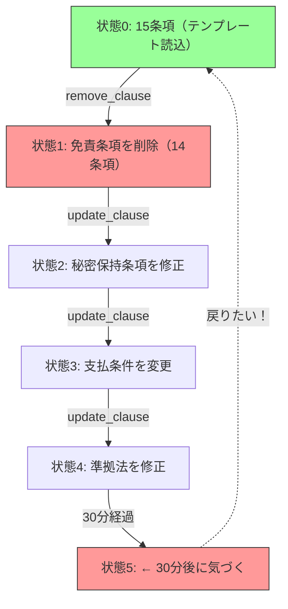
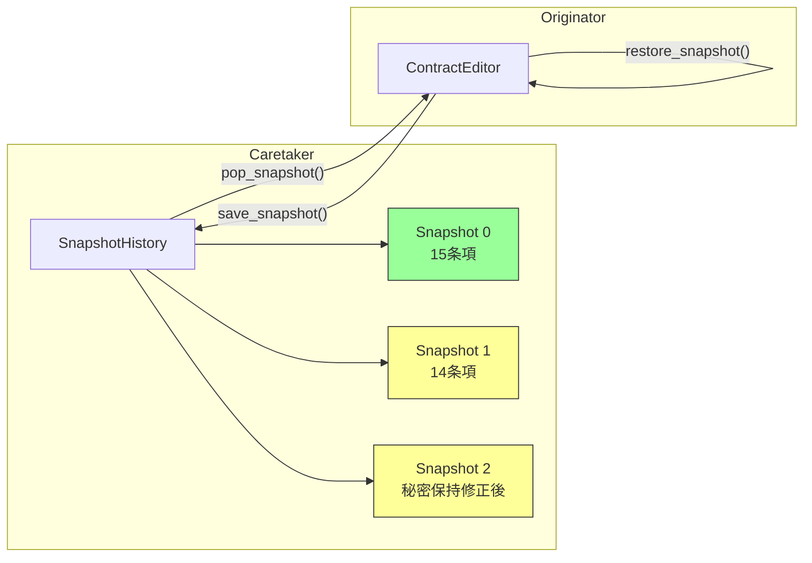

---
categories:
  - tech
date: 2026-03-29T07:07:05+09:00
description: 契約書起草SaaSで免責条項を消した若手弁護士。構造化データは復元できず2000万円の損害が発生。状態をカプセル化して保存するMementoパターンでコード探偵ロックが時間を巻き戻す。
draft: false
epoch: 1774735625
image: /public_images/2026/code-detective-memento/header.webp
iso8601: 2026-03-29T07:07:05+09:00
tags:
  - design-pattern
  - perl
  - moo
  - memento
  - destructive-state-mutation
  - refactoring
  - code-detective
title: コード探偵ロックの事件簿【Memento】失われた条項の記憶〜状態を封じるタイムカプセル〜
toc: true
---

「Ctrl+Z を47回押しました。テキストエディタの文字は戻りました。でも……構造化された条項データは、何も戻らなかったんです」

僕は三村。リーガルテック・スタートアップ「ClauseForge」のバックエンドエンジニアだ。経験4年、28歳。ClauseForgeは中堅法律事務所向けの契約書起草SaaSで、弁護士がテンプレートから契約書を組み立て、条項を追加・削除・並べ替えしながら最終稿を仕上げるツールだ。

事故は先週の金曜日に起きた。

新人弁護士の田中さんが、3億円の業務委託契約書を起草していた。テンプレートから15個の条項をロードし、免責条項（第12条）を編集中に誤って「条項削除」ボタンを押した。免責条項が消えた。田中さんはそのまま30分間、残りの条項を修正し続けた。秘密保持条項の範囲を拡張し、支払条件を変更し、準拠法を修正した。

30分後、上司に見せたところ「免責条項がないぞ」と指摘された。田中さんは慌ててCtrl+Zを連打した。テキストフィールドの文字は戻った。だが画面上の条項リストは——15個のまま。削除された第12条は戻ってこなかった。

テキストエディタのUndo履歴とは別に、条項の構造データ——追加、削除、順序変更——を記録する仕組みが、まったくなかったのだ。

免責条項なしで契約書が締結され、3ヶ月後にトラブルが発生。免責条項があれば免れた損害賠償2000万円を、クライアントの法律事務所がClauseForgeに請求してきた。

翌週の月曜日、僕は重い足取りで雑居ビルの階段を上がった。

「レガシー・コード・インベスティゲーション（LCI）」

看板の「レガシー」の文字が微妙にかすれていて、「ガシー・コード・インベスティゲーション」に見えなくもない。いったい何の事務所なのか、初見では判別不能だ。

ドアを開けた瞬間、デスクトップPCの排熱がこもった生温い空気が顔を撫でた。デスクの上にはエナジードリンクの空き缶が無造作に並んでおり、その合間にメカニカルキーボードが2台、なぜか分解された状態で転がっている。革張りの椅子の男は、モニターに映る何かのメモリダンプを睨みながら、新しいエナジードリンク缶のプルタブを引いた。

「——初歩的なにおいだよ、ワトソン君」

僕の名前は三村だが、この男にとっては来客はすべて「ワトソン君」らしい。

「三村です。契約書のSaaSで、条項データが——」

「Ctrl+Zが効かなかった事件だな。問題はテキストではなく構造データだ。条項の追加・削除・並べ替えというオブジェクトの状態変更に、巻き戻しの仕組みがない」

僕がまだ事情を説明し終わる前に、ロックと名乗る男——正確には名乗ったわけではなく、椅子の背もたれに「Locke」とマーカーで直書きされていた——は事件の核心を言い当てた。どこで情報を得たのかは謎だが、聞いたところで「初歩的な推理だ」と返されるのがオチだろう。

「まず現場を見せたまえ」

## 現場検証：記録なき破壊

ロックは僕のノートPCを引き寄せた。「借りるよ、ワトソン君」と言いながら、もう画面を覗き込んでいる。許可を求める気はないらしい。

「条項を管理するクラスを見せてくれたまえ」

僕はContractEditorクラスを開いた。

```perl
package Clause {
    use Moo;

    has id      => ( is => 'ro', required => 1 );
    has title   => ( is => 'rw', required => 1 );
    has body    => ( is => 'rw', required => 1 );
    has article => ( is => 'rw', required => 1 );  # 第○条
}

package ContractEditor {
    use Moo;
    use Types::Standard qw( ArrayRef InstanceOf Str );

    has title   => ( is => 'rw', default => '無題の契約書' );
    has clauses => (
        is      => 'rw',
        isa     => ArrayRef[InstanceOf['Clause']],
        default => sub { [] },
    );

    sub add_clause ($self, $clause) {
        push $self->clauses->@*, $clause;
        $self->_renumber();
    }

    sub remove_clause ($self, $id) {
        $self->clauses([ grep { $_->id ne $id } $self->clauses->@* ]);
        $self->_renumber();
    }

    sub update_clause ($self, $id, %changes) {
        for my $c ($self->clauses->@*) {
            next unless $c->id eq $id;
            $c->title($changes{title}) if exists $changes{title};
            $c->body($changes{body})   if exists $changes{body};
        }
    }

    sub move_clause ($self, $id, $new_pos) {
        my @list = $self->clauses->@*;
        my ($idx) = grep { $list[$_]->id eq $id } 0..$#list;
        return unless defined $idx;
        my ($item) = splice @list, $idx, 1;
        splice @list, $new_pos, 0, $item;
        $self->clauses(\@list);
        $self->_renumber();
    }

    sub _renumber ($self) {
        my $n = 1;
        $_->article("第${n}条") && $n++ for $self->clauses->@*;
    }
}
```

ロックはエナジードリンクを一口飲み、画面に顔を近づけた。まるで犯行現場の血痕を虫眼鏡で調べる探偵のようだが、やっていることはコードリーディングだ。

「`remove_clause` を見たまえ。`grep` で該当IDを除外して、配列を上書きしている。削除された条項のデータは即座に消失する。どこにも保存されない」

「はい。削除したら戻せません……」

「`update_clause` も同様だ。`title` や `body` を直接書き換えている。変更前の値はどこにも記録されていない。`move_clause` も並び順を上書きする。すべての操作が破壊的だ」

ロックは立ち上がり、芝居がかった足取りでホワイトボードに向かった。マーカーのキャップを外す動作がいちいち大仰だ。探偵が事件のタイムラインを整理するシーンを再現しているつもりなのだろうが、やっていることはUMLのアクティビティ図に近い。



「状態0の時点——15条項が揃った状態のスナップショットがあれば、いつでもそこに戻れた。だがスナップショットを取っていなかった」

ロックはマーカーで図の「状態0」を力強く丸で囲んだ。

「これがDestructive State Mutation（破壊的状態変更）——今回の犯人だよ、ワトソン君」

「あの、一つ聞いていいですか」僕は手を挙げた。「以前、Command パターンでUndoを実現するやり方を見たことがあるんです。各操作に `execute` と `undo` を持たせる方法で——」

「おや、なかなか勉強しているじゃないか」ロックは少し意外そうに僕を見た。それでもすぐに首を横に振る。

「いい質問だ。Command パターンは『何をしたか』を記録する。『条項Xを削除した』『条項Yのタイトルを変更した』という操作を覚えておいて、逆操作で巻き戻す。だが今回のケースでは、30分間に何十回もの編集操作が入り混じっている。各操作の逆操作を正確に定義するのは骨が折れるし、操作の組み合わせで副作用が生じる場合もある」

「では、どうすれば？」

ロックはホワイトボードに「操作」と書いて×印をつけ、その横に「状態」と書いて丸をつけた。

「『どうだったか』を記録する。操作ではなく、状態そのものを丸ごとスナップショットとして保存する。状態0、状態1、状態2……と、タイムカプセルに封じ込めていく。戻りたくなったら、任意のタイムカプセルを開けて中身をそっくり復元すればいい」

## 推理披露：状態のタイムカプセル（Memento）

ロックは新しいエナジードリンク缶を開けた。さっきの缶はもう空き缶の列に加わっている。これで本日3本目だ。カフェイン量が心配になるが、本人は「推理に必要な燃料」と呼んでいるので口出しはしないことにした。

「解決策は3つの役者で構成される。これは舞台劇のキャスティングと同じだ」

ロックはホワイトボードに3つの箱を書いた。

- Originator（生成者）: `ContractEditor`——自分の状態をスナップショットに書き出し、スナップショットから復元できる
- Memento（記念品）: `ContractSnapshot`——状態を封じたタイムカプセル。中身は外部から触れない
- Caretaker（管理人）: `SnapshotHistory`——タイムカプセルの保管庫。いつ・どの状態を保存したかを管理する

「Originator は記憶を預ける者。Memento は記憶そのもの。Caretaker は記憶の金庫番。金庫番は中身を覗いてはならない——ただ保管して返すだけだ」

たとえ話が好きな男だ。コードの説明をするのにいちいち探偵小説の比喩を持ち出さなくてもいい気がするが、分かりやすいのは認めざるを得ない。

【After】Memento（ContractSnapshot）

```perl
package ContractSnapshot {
    use Moo;
    use Storable qw( dclone );

    has _state => ( is => 'ro', required => 1 );
    has _label => ( is => 'ro', default => '' );
    has _timestamp => (
        is      => 'ro',
        default => sub { time() },
    );

    sub label     ($self) { $self->_label }
    sub timestamp ($self) { $self->_timestamp }

    # _state への直接アクセスは Originator だけに許す設計意図。
    # Perl には private がないため、命名規約（_プレフィクス）で表現。
    sub _get_state ($self) { dclone($self->_state) }
}
```

「`ContractSnapshot` がタイムカプセルだ。`_state` に状態のディープコピーを保持する。`_get_state` は `dclone` でさらにコピーを返す——復元時にスナップショット自体が汚染されないようにするためだ。外部からは `label` と `timestamp` だけが見える。中身は開けられない」

「`dclone` は Storable モジュールの……」

「深いコピーを作る関数だ。配列リファレンスの中にオブジェクトが入っている場合、単なる代入では参照のコピーにしかならない。`dclone` なら、オブジェクトの中身まで再帰的に複製する。本物のタイムカプセルは、開けたときに中身が変質していてはならないからね」

また比喩だ。でも `dclone` の必要性は直感的に理解できた。

【After】Originator（ContractEditor に save / restore を追加）

```perl
package ContractEditor {
    use Moo;
    use Storable qw( dclone );
    use Types::Standard qw( ArrayRef InstanceOf );

    has title   => ( is => 'rw', default => '無題の契約書' );
    has clauses => (
        is      => 'rw',
        isa     => ArrayRef[InstanceOf['Clause']],
        default => sub { [] },
    );

    # ---- 既存の操作メソッド（変更なし）----
    sub add_clause ($self, $clause) {
        push $self->clauses->@*, $clause;
        $self->_renumber();
    }

    sub remove_clause ($self, $id) {
        $self->clauses([ grep { $_->id ne $id } $self->clauses->@* ]);
        $self->_renumber();
    }

    sub update_clause ($self, $id, %changes) {
        for my $c ($self->clauses->@*) {
            next unless $c->id eq $id;
            $c->title($changes{title}) if exists $changes{title};
            $c->body($changes{body})   if exists $changes{body};
        }
    }

    sub move_clause ($self, $id, $new_pos) {
        my @list = $self->clauses->@*;
        my ($idx) = grep { $list[$_]->id eq $id } 0..$#list;
        return unless defined $idx;
        my ($item) = splice @list, $idx, 1;
        splice @list, $new_pos, 0, $item;
        $self->clauses(\@list);
        $self->_renumber();
    }

    sub _renumber ($self) {
        my $n = 1;
        $_->article("第${n}条") && $n++ for $self->clauses->@*;
    }

    # ---- Memento 対応（追加）----
    sub save_snapshot ($self, $label = '') {
        return ContractSnapshot->new(
            _state => dclone({
                title   => $self->title,
                clauses => $self->clauses,
            }),
            _label => $label,
        );
    }

    sub restore_snapshot ($self, $snapshot) {
        my $state = $snapshot->_get_state();
        $self->title($state->{title});
        $self->clauses($state->{clauses});
    }
}
```

「`save_snapshot` は自分の状態を丸ごとディープコピーして `ContractSnapshot` に封じる。`restore_snapshot` はスナップショットから状態を取り出して自分に上書きする」

ロックは画面の既存メソッド部分を指差した。

「注目すべきは、既存の操作メソッドに一切手を加えていないことだ。`add_clause`、`remove_clause`、`update_clause`、`move_clause`——すべてそのまま。追加したのは `save_snapshot` と `restore_snapshot` の2つだけ」

「既存コードへの影響がほぼゼロ……それは助かります」

「それが Memento の利点だ。では管理人を作ろう。ワトソン君、キーボードを借りるよ」

借りるよ、と言いながらもう打ち始めている。僕のノートPCは完全にロックに占拠されていた。

【After】Caretaker（SnapshotHistory）

```perl
package SnapshotHistory {
    use Moo;
    use Types::Standard qw( ArrayRef InstanceOf Int );

    has _snapshots => (
        is      => 'ro',
        isa     => ArrayRef[InstanceOf['ContractSnapshot']],
        default => sub { [] },
    );
    has max_size => ( is => 'ro', default => 50 );

    sub push_snapshot ($self, $snapshot) {
        push $self->_snapshots->@*, $snapshot;
        # 上限を超えたら古いものから削除
        if (scalar $self->_snapshots->@* > $self->max_size) {
            shift $self->_snapshots->@*;
        }
    }

    sub pop_snapshot ($self) {
        return pop $self->_snapshots->@*;
    }

    sub count ($self) { scalar $self->_snapshots->@* }

    sub list_labels ($self) {
        return [ map {
            { label => $_->label, timestamp => $_->timestamp }
        } $self->_snapshots->@* ];
    }
}
```

「`SnapshotHistory` はタイムカプセルの保管庫だ。中身を覗いたり改変したりはしない。ただ積み上げて、求められたら最新のものを返す。`max_size` でメモリの上限も制御する。50世代あれば、大抵の作業には十分だ」

ロックは新しい図を描いた。ホワイトボードのスペースが足りなくなり、さっき描いたタイムラインの横に無理やり詰め込んでいる。



「これで田中弁護士のケースはどうなるか。操作のたびにスナップショットを保存しておけば——」

```perl
# 利用コード
my $editor  = ContractEditor->new(title => '業務委託契約書');
my $history = SnapshotHistory->new;

# テンプレートから15条項をロード
for my $tmpl (@template_clauses) {
    $editor->add_clause(Clause->new(%$tmpl));
}
$history->push_snapshot($editor->save_snapshot('テンプレート読込'));

# 田中弁護士: 免責条項（clause-12）を誤って削除
$editor->remove_clause('clause-12');
$history->push_snapshot($editor->save_snapshot('免責条項削除'));

# 30分間の編集作業...
$editor->update_clause('clause-08', body => '秘密保持の範囲を拡張...');
$history->push_snapshot($editor->save_snapshot('秘密保持修正'));

$editor->update_clause('clause-10', body => '支払条件を月末締め翌月払いに...');
$history->push_snapshot($editor->save_snapshot('支払条件変更'));

# 30分後:「免責条項がない！」
# テンプレート読込直後の状態に戻す
$history->pop_snapshot();  # 支払条件変更
$history->pop_snapshot();  # 秘密保持修正
$history->pop_snapshot();  # 免責条項削除
my $safe_point = $history->pop_snapshot();  # テンプレート読込 ← ここ！

$editor->restore_snapshot($safe_point);
# → 15条項が完全に復元される
```

「4回 `pop_snapshot` すれば、テンプレート読込直後——15条項が揃った状態に完全に戻れる。Command パターンのように個々の逆操作を定義する必要はない。状態丸ごとを復元するだけだ」

「でも、30分間の他の編集——秘密保持や支払条件の変更——も巻き戻ってしまいますよね？」

「その通り。Memento は全状態を復元する。部分的な巻き戻しはできない。だからこそ、復元後に必要な修正を加え直す運用が前提だ。あるいは、スナップショットの粒度を細かくしておけば、より近い地点から再出発できる」

「完璧ではないにしても、2000万円の損害よりは30分の再編集のほうがずっとマシですね……」

「初歩的な費用対効果の計算だよ、ワトソン君」

## 解決：タイムカプセルの証明

ロックがテストを実行した。腕組みをして結果を待つ姿は、陪審員の評決を待つ弁護士のようだ。もっとも、探偵が弁護士の真似をする意味は分からないが、テスト結果が出るまでの沈黙が妙に緊張感がある。

```bash
$ prove -v t/memento.t
# Subtest: Before: Destructive State Mutation
    ok 1 - Contract loaded with 15 clauses
    ok 2 - Clause 'clause-12' (免責条項) removed
    ok 3 - Contract now has 14 clauses
    ok 4 - After 30 minutes of edits, still 14 clauses
    ok 5 - No way to restore clause-12 -- data is lost forever
ok 1 - Before: Destructive State Mutation
# Subtest: After: Memento Pattern
    ok 1 - Contract loaded with 15 clauses
    ok 2 - Snapshot saved: 'テンプレート読込' (history count: 1)
    ok 3 - Clause 'clause-12' removed, now 14 clauses
    ok 4 - Snapshot saved: '免責条項削除' (history count: 2)
    ok 5 - 秘密保持条項 updated, snapshot saved (history count: 3)
    ok 6 - 支払条件 updated, snapshot saved (history count: 4)
    ok 7 - Popped 3 snapshots, restored 'テンプレート読込'
    ok 8 - Contract restored to 15 clauses
    ok 9 - Clause 'clause-12' (免責条項) is back!
    ok 10 - Restored clause body matches original
    ok 11 - Original snapshot is still intact after restore (immutable)
    ok 12 - Max history size (50) prevents unbounded memory growth
ok 2 - After: Memento Pattern
All tests successful.
```

「Before のテスト5を見たまえ——データが永久に失われる。After のテスト9——免責条項が完全に復元される。テスト10で本文の内容も一致している。そしてテスト11——復元に使ったスナップショット自体は汚染されていない。`dclone` による深いコピーのおかげだ」

「2000万円の損害が、`save_snapshot` 一行で防げた……」

「**タイムカプセルに封じておけば、いつでも掘り起こせる**。Ctrl+Z はテキストエディタの記憶だ。だが構造化データの記憶は、自分で設計しなければ誰も守ってくれない」

僕はPCを閉じかけたが、ロックが手を上げた。

「報酬は——そうだな。『Effective Perl Programming』の初版をいただこうか。1998年刊行の、あの緑色の表紙のやつだ。探偵の書棚に初版がないのは恥ずかしいことでね」

「……それ、まだ流通してるんですかね」

「見つからなければ、代わりにモンスターエナジーの限定フレーバーを1ダースでもいい。灰色の脳細胞——いや、探偵の推理回路にはカフェインが欠かせないのでね」

ポワロの決め台詞と混ざっている気がしたが、突っ込んだら長くなりそうなのでやめておいた。

ロックは人差し指を立てた。

「最後に一つ。Memento は状態の丸ごとコピーを保存する。つまり、状態が大きければスナップショットも大きくなる。条項が100個ある契約書を50世代保存すれば、メモリに5000個分の条項データが眠ることになる」

「メモリが心配なら？」

「`max_size` で世代数を制限するのは最低限の対策だ。さらに本格的にやるなら、差分だけを保存する方式や、古いスナップショットをディスクに退避する方式も考えられる。だがまずは完全なスナップショットで始めて、メモリが問題になったら最適化すべきだ。早すぎる最適化は、解決すべき問題を見えなくする——すべての不吉な `if` 構文を排除して残ったものが、いかにシンプルであっても、それが真実なんだ」

僕はLCIを出て、CTOへの事後報告書を書いた。「原因は構造データのUndo機構の欠如。Memento パターンによるスナップショット機能を実装します。対象は全エディタ操作。次回リリースに含めます」——『Effective Perl Programming』の初版については、触れなかった。

---

## 探偵の調査報告書

| 容疑（アンチパターン） | 真実（パターン） | 証拠（効果） |
| :--- | :--- | :--- |
| Destructive State Mutation（破壊的状態変更）。条項の追加・削除・修正がすべて破壊的な上書きで、変更前の状態がどこにも保存されない。誤操作から30分後に気づいても復元不可能で、免責条項の欠落により2000万円の損害が発生。 | Memento パターン。操作前の状態を丸ごとスナップショット（タイムカプセル）として保存し、任意の時点の状態に復元できるようにする。Originator が自分の状態を Memento に封じ、Caretaker が Memento の保管庫を管理する三者構成。 | 任意の時点への状態復元が可能に。既存の操作メソッド（add/remove/update/move）は一切変更不要。`save_snapshot` と `restore_snapshot` の2メソッド追加のみ。`dclone` による深いコピーでスナップショットの不変性を保証。`max_size` でメモリ消費を制御。 |

### 推理のステップ

1. 状態変更の破壊性を認識する: 各操作が変更前のデータを保存せず上書きしている箇所を特定する。`remove_clause` で配列を再生成、`update_clause` で属性を直接書き換え——いずれも元に戻す手段がない。
2. Memento（スナップショット）を設計する: 状態を丸ごと `dclone` でディープコピーし、外部からアクセスできない不透明なオブジェクトに封じる。ラベルとタイムスタンプだけを外部に公開する。
3. Originator に save/restore を追加する: `save_snapshot` で現在の状態を Memento に書き出し、`restore_snapshot` で Memento から状態を復元する。既存のビジネスロジックには一切手を加えない。
4. Caretaker でスナップショットを管理する: スタック構造で保管し、`max_size` で上限を設ける。Caretaker は Memento の中身を覗かない——保管と返却だけが仕事。

### ロックより

ワトソン君。Command パターンは「何をしたか」を記録する。Memento パターンは「どうだったか」を記録する。前者は操作の履歴、後者は状態の履歴だ。どちらも「元に戻す」を実現するが、アプローチがまったく異なる。

Memento の本質は「状態を外部に預けて、後で取り戻す」ことだ。タイムカプセルに今の自分を封じ込め、未来の自分がそれを掘り起こす。カプセルの中身は誰にも見せない。見せる必要がないからだ。復元に必要なのは中身そのものであって、中身の解釈ではない。

ただし、タイムカプセルは場所を取る。状態が巨大なオブジェクトなら、50個のスナップショットは50倍のメモリを意味する。保存の粒度と保持数のバランスは常に意識すべきだ。すべての操作前にスナップショットを取るのか、ユーザーが明示的に「保存」したときだけ取るのか——それはビジネス要件が決める。技術が決めるのではない。
