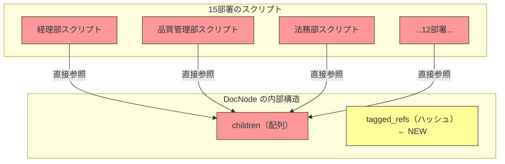
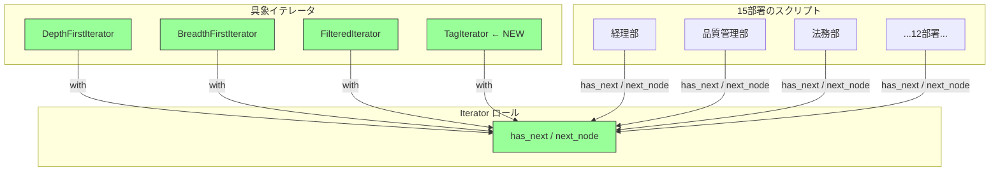

---
categories:
  - tech
date: 2026-03-30T07:07:05+09:00
description: 社内文書管理「DocVault」のフォルダツリーを直接触る走査コードが15部署にコピペ拡散。ツリー構造の変更で全スクリプトが壊れ業務停止に。内部構造を隠蔽し「歩き方」だけを公開するIteratorパターンで、コード探偵ロックが迷宮の出口を示す。
draft: true
epoch: 1774822025
image: /public_images/2026/code-detective-iterator/header.webp
iso8601: 2026-03-30T07:07:05+09:00
tags:
  - design-pattern
  - perl
  - moo
  - iterator
  - exposed-collection-internals
  - refactoring
  - code-detective
title: コード探偵ロックの事件簿【Iterator】迷宮のファイル棚〜内部構造を暴くな、歩き方を教えろ〜
toc: true
---

「月曜の朝、15部署から同時に『文書検索が動かない』と連絡が来ました。全部、同じ原因です。金曜にリリースした構造変更で……」

僕は宮本。従業員3000人のメーカー「タクミ精工」の社内IT部門でバックエンドを担当している。経験5年、29歳。社内文書管理システム「DocVault」は僕が3年前に構築した。部署ごとのフォルダにマニュアル、規程、議事録が格納されるツリー構造のシステムだ。

問題は、各部署が**独自のスクリプト**を書いていたことだ。

経理部は「期限切れ文書の一括削除スクリプト」を持っていた。品質管理部は「ISO文書の網羅性チェックスクリプト」を。法務部は「契約書の全文検索スクリプト」を。15部署が、それぞれDocVaultのフォルダツリーを直接走査するスクリプトを書いていた。

金曜日、僕はフォルダツリーにタグベース分類を追加した。フォルダの `children` 配列に加えて、`tagged_refs` というハッシュを追加し、タグで横断的に文書を参照できるようにした。たったそれだけの変更だった。

月曜の朝。15部署のスクリプトが**全滅**していた。

全部のスクリプトが `children` を直接触っている。再帰で `@{$node->children}` を回して、僕が `children` の構造を変えたから、全部壊れたのだ。

上司は溜息をついた。「外部の専門家に相談しろ。あの雑居ビルの——」

翌日、僕は重い足取りで階段を上がった。

「レガシー・コード・インベスティゲーション（LCI）」

この看板を見るのは初めてだったが、上司は以前ここに助けられたことがあるらしい。半信半疑でドアを開けると、デスクトップPCの排熱がこもった暑い空気と、エナジードリンクの甘ったるい匂いが鼻を突いた。デスクの上にはモンスターエナジーの空き缶がピラミッド状に積み上げられていて——いったい何日分なのか数えたくない。複数のモニターにはツリー構造の図が映し出されており、付箋だらけのホワイトボードの前に、革張りの椅子に座った男がいた。

「——初歩的なにおいだよ、ワトソン君。15部署のスクリプトが月曜の朝に一斉に壊れた。実に香ばしい事件だ」

僕の名前は宮本だが、この男にとっては来客の名前などどうでもいいらしい。

「宮本です。フォルダの `children` を——」

「犯人はもう見当がついている」ロックと名乗る——いや、名乗りすらしなかった。モニターの脇に貼られたステッカーに「Locke - Code Detective」と書いてあるだけだ。「**構造変更をした君**は犯人ではない。真犯人は、**構造を直接触らせた設計**のほうだ。まず現場を見せたまえ」

## 現場検証：丸見えの棚の中身

「フォルダノードのクラスを見せてくれたまえ」

ロックは僕のノートPCを指差した。「ワトソン君、画面をこちらに」と言いながら、PCごと自分の方に引き寄せる。もう慣れた——いや、初対面だが、この男に所有権の概念はないのだと瞬時に理解した。

僕はDocNodeクラスを開いた。

```perl
package DocNode {
    use Moo;
    use Types::Standard qw( ArrayRef InstanceOf Str );

    has name     => ( is => 'ro', required => 1 );
    has type     => ( is => 'ro', required => 1 );  # 'folder' or 'file'
    has children => (
        is      => 'rw',
        isa     => ArrayRef[InstanceOf['DocNode']],
        default => sub { [] },
    );

    sub add_child ($self, $child) {
        push $self->children->@*, $child;
    }
}
```

「ここまでは問題ない。問題は**使い方**だ。各部署のスクリプトを見せたまえ」

僕は3つのスクリプトを開いた。

```perl
# 経理部：期限切れ文書の一括検索（深さ優先）
sub find_expired ($node) {
    my @results;
    if ($node->type eq 'file' && is_expired($node)) {
        push @results, $node;
    }
    for my $child ($node->children->@*) {    # ← children を直接走査
        push @results, find_expired($child);  # ← 再帰も自前
    }
    return @results;
}

# 品質管理部：ISO文書の網羅性チェック（幅優先）
sub check_coverage ($root) {
    my @queue = ($root);
    my @iso_docs;
    while (my $node = shift @queue) {
        if ($node->type eq 'file' && $node->name =~ /^ISO/) {
            push @iso_docs, $node;
        }
        push @queue, $node->children->@*;    # ← children を直接キューに追加
    }
    return @iso_docs;
}

# 法務部：契約書の全文検索（深さ優先 + フォルダスキップ）
sub search_contracts ($node, $keyword) {
    my @results;
    for my $child ($node->children->@*) {    # ← children を直接走査
        if ($child->type eq 'folder') {
            push @results, search_contracts($child, $keyword);
        }
        elsif ($child->name =~ /契約書/ && contains($child, $keyword)) {
            push @results, $child;
        }
    }
    return @results;
}
```

ロックは椅子から立ち上がり、ホワイトボードの前に歩み出た。まるで法廷で証拠を提示する弁護士のような構えだが、やっていることはコードレビューの指摘だ。

「**3つとも `$node->children->@*` に直接アクセスしている**。経理部は深さ優先の再帰、品質管理部は幅優先のキュー、法務部は深さ優先にフォルダスキップを加えている。走査のアルゴリズムは違うが、**内部構造への依存は同じ**だ」

「はい。`children` が配列リファレンスであることを、全員が知っている前提で——」

「15部署×数本のスクリプト。すべてが `children` という**内部のデータ構造を直接覗いている**。棚の中身を勝手に漁っているのと同じだ。棚の持ち主が引き出しの配置を変えたら——」

ロックはホワイトボードにマーカーで図を描き始めた。マーカーのキャップを外すとき、わざとカチッと鳴らしてから書き始める。この芝居がかった演出は、もはや無意識なのだろうか。



「赤いノードが全部壊れた。15部署が `children` の配列構造に依存しているから、`children` を変更すると**全員が巻き添えになる**」

ロックはマーカーで図の中心を力強く叩いた。

「これが**Exposed Collection Internals（内部構造の露出）**——今回の犯人だよ、ワトソン君」

「内部構造の露出……」

「コレクションの中身——配列なのかハッシュなのか、要素の並び順は何か、子ノードの取得方法は何か——これらは**実装の詳細**だ。利用者が知るべきは『次の要素があるか』と『次の要素をくれ』だけでいい。棚の中身を直接漁るのではなく、**棚の歩き方を教える**べきだった」

正直なところ、言われてみれば当たり前のことだ。でも3年前の僕は「社内ツールだし、構造なんて変わらないだろう」と思っていた。15部署がスクリプトを書き始めたのも、`children` が見えていたからに他ならない。見えていれば、触る。人間の性だ。

## 推理披露：迷宮の案内人（Iterator）

ロックはエナジードリンクの新しい缶を開けた。ピラミッドに追加するための空き缶がまた1つ増える。推理ショーの開演を告げるかのように一口飲んでから、ホワイトボードに向き直った。

「解決策は**歩き方をオブジェクトにする**ことだ」

ロックはホワイトボードに2つのメソッドだけを書いた。

- `has_next` — 次の要素があるか？
- `next` — 次の要素をくれ

「この2つだけが公開インターフェースだ。利用者は `children` の存在すら知らなくていい。**迷宮の地図を渡すのではなく、案内人を雇う**のさ」

**【After】Iterator ロール**

```perl
package Iterator {
    use Moo::Role;

    requires 'has_next';
    requires 'next_node';
}
```

**【After】深さ優先イテレータ**

```perl
package DepthFirstIterator {
    use Moo;
    with 'Iterator';

    has _stack => ( is => 'ro', default => sub { [] } );

    sub BUILD ($self, $args) {
        push $self->_stack->@*, $args->{root} if $args->{root};
    }

    sub has_next ($self) {
        return scalar $self->_stack->@* > 0;
    }

    sub next_node ($self) {
        my $node = pop $self->_stack->@*;
        return undef unless $node;
        # children を逆順に積む（先頭の子が先に取り出されるように）
        push $self->_stack->@*, reverse $node->children->@*;
        return $node;
    }
}
```

「`DepthFirstIterator` はスタックを使って深さ優先走査を実現する。`children` にアクセスしているのは**イテレータの内部だけ**だ。利用者は `has_next` と `next_node` しか呼ばない」

「つまり、`children` の構造をどう変えても、このイテレータの中だけ直せば——」

「その通り。では幅優先も見たまえ」

**【After】幅優先イテレータ**

```perl
package BreadthFirstIterator {
    use Moo;
    with 'Iterator';

    has _queue => ( is => 'ro', default => sub { [] } );

    sub BUILD ($self, $args) {
        push $self->_queue->@*, $args->{root} if $args->{root};
    }

    sub has_next ($self) {
        return scalar $self->_queue->@* > 0;
    }

    sub next_node ($self) {
        my $node = shift $self->_queue->@*;
        return undef unless $node;
        push $self->_queue->@*, $node->children->@*;
        return $node;
    }
}
```

「深さ優先は `pop`（スタック）、幅優先は `shift`（キュー）。データ構造を変えるだけで走査順が変わる。どちらも外部インターフェースは同じ `has_next` / `next_node` だ」

「同じインターフェースなのに、歩き方が違う……」

「初歩的な多態性の話だよ、ワトソン君」

初歩的かどうかはさておき、分かりやすいのは確かだった。

**【After】フィルタ付きイテレータ（デコレータ）**

```perl
package FilteredIterator {
    use Moo;
    with 'Iterator';

    has _inner  => ( is => 'ro', required => 1 );
    has _filter => ( is => 'ro', required => 1 );  # コードリファレンス
    has _buffer => ( is => 'rw' );

    sub BUILD ($self, $) { $self->_advance() }

    sub _advance ($self) {
        while ($self->_inner->has_next) {
            my $node = $self->_inner->next_node;
            if ($self->_filter->($node)) {
                $self->_buffer($node);
                return;
            }
        }
        $self->_buffer(undef);
    }

    sub has_next ($self) { defined $self->_buffer }

    sub next_node ($self) {
        my $current = $self->_buffer;
        $self->_advance();
        return $current;
    }
}
```

「`FilteredIterator` は別のイテレータをラップして、条件に合う要素だけを返す。Decorator パターンとの組み合わせだ。深さ優先でフィルタ、幅優先でフィルタ——どちらも自在に組み合わせられる」

「あ、Decorator は以前の事件で——」

「その通り。パターンは単独で使うものではない。組み合わせてこそ力を発揮する。探偵のガジェットと同じでね」

ガジェット——この男はデザインパターンを探偵の七つ道具のように語る。大げさだとは思うが、実際にツールとして使いこなしているのだから、反論のしようがない。

**【After】DocNode にイテレータ生成メソッドを追加**

```perl
package DocNode {
    use Moo;
    use Types::Standard qw( ArrayRef InstanceOf );

    has name     => ( is => 'ro', required => 1 );
    has type     => ( is => 'ro', required => 1 );
    has children => (
        is      => 'rw',
        isa     => ArrayRef[InstanceOf['DocNode']],
        default => sub { [] },
    );

    sub add_child ($self, $child) {
        push $self->children->@*, $child;
    }

    # イテレータ生成（利用者は children を知らなくていい）
    sub create_iterator ($self, %opts) {
        my $type = $opts{type} // 'depth';
        my $iter;

        if ($type eq 'breadth') {
            $iter = BreadthFirstIterator->new(root => $self);
        }
        else {
            $iter = DepthFirstIterator->new(root => $self);
        }

        if ($opts{filter}) {
            $iter = FilteredIterator->new(
                _inner  => $iter,
                _filter => $opts{filter},
            );
        }

        return $iter;
    }
}
```

「`create_iterator` が**唯一の入口**だ。利用者は走査の種類とフィルタ条件を指定するだけで、`children` の構造を一切知る必要がない」

ロックは僕のPCのキーボードに手を伸ばした。「ワトソン君、少し打たせたまえ」と言いながら、各部署のスクリプトがどう変わるか示してみせた。

```perl
# 経理部：期限切れ文書の一括検索
my $iter = $root->create_iterator(
    type   => 'depth',
    filter => sub ($node) {
        $node->type eq 'file' && is_expired($node);
    },
);
my @expired;
while ($iter->has_next) {
    push @expired, $iter->next_node;
}

# 品質管理部：ISO文書の網羅性チェック
my $iter = $root->create_iterator(
    type   => 'breadth',
    filter => sub ($node) {
        $node->type eq 'file' && $node->name =~ /^ISO/;
    },
);
my @iso_docs;
while ($iter->has_next) {
    push @iso_docs, $iter->next_node;
}

# 法務部：契約書の全文検索
my $iter = $root->create_iterator(
    type   => 'depth',
    filter => sub ($node) {
        $node->type eq 'file'
        && $node->name =~ /契約書/
        && contains($node, $keyword);
    },
);
my @contracts;
while ($iter->has_next) {
    push @contracts, $iter->next_node;
}
```

「3つとも**同じパターン**だ。`create_iterator` でイテレータを取得し、`while` ループで `has_next` / `next_node`。`children` の文字は**一度も出てこない**」

僕は思わず声を上げた。「これなら、タグベース分類を追加しても——」

「その通り。見てみたまえ」

```perl
# タグベース走査のイテレータを追加
package TagIterator {
    use Moo;
    with 'Iterator';

    has _tags    => ( is => 'ro', required => 1 );  # 対象タグの配列
    has _nodes   => ( is => 'ro', default => sub { [] } );
    has _seen    => ( is => 'ro', default => sub { {} } );

    sub BUILD ($self, $args) {
        my $root = $args->{root};
        for my $tag ($self->_tags->@*) {
            for my $ref ($root->tagged_refs->{$tag}->@*) {
                next if $self->_seen->{$ref->name}++;
                push $self->_nodes->@*, $ref;
            }
        }
    }

    sub has_next ($self) { scalar $self->_nodes->@* > 0 }
    sub next_node ($self) { shift $self->_nodes->@* }
}
```

「新しい走査方法を追加しても、`Iterator` ロールを満たすクラスを1つ作るだけだ。既存の15部署のスクリプトには**一切触れない**。`create_iterator` に `type => 'tag'` を追加すれば、タグベースの走査も同じインターフェースで使える」



「赤かった15部署が、緑のインターフェースだけに依存するようになった。内部構造が変わっても、イテレータの中だけで吸収される。**棚の中身が変わっても、歩き方は変わらない**」

## 解決：迷宮に道標を

ロックがテストを実行した。腕を組んでターミナルの出力を見つめるその姿は、いつものように事件解決の瞬間を演出しているのだが、実際にはPerlのテストスイートが走っているだけだ。とはいえ、全テストが通る瞬間の緊張感は、僕にとっても本物だった。

```bash
$ prove -v t/iterator.t
# Subtest: Before: Exposed Collection Internals
    ok 1 - Direct children access works initially
    ok 2 - Depth-first manual recursion finds 8 files
    ok 3 - Breadth-first manual queue finds 8 files
    ok 4 - After structure change, direct access script BREAKS
    ok 5 - All 15 department scripts depend on internal structure
ok 1 - Before: Exposed Collection Internals
# Subtest: After: Iterator Pattern
    ok 1 - DepthFirstIterator finds 8 files
    ok 2 - BreadthFirstIterator finds 8 files
    ok 3 - Depth-first order: root visited before leaves
    ok 4 - Breadth-first order: siblings visited before children
    ok 5 - FilteredIterator with type=file returns only files (8)
    ok 6 - FilteredIterator with name filter returns matching docs (3)
    ok 7 - Composing filters: depth-first + file + name pattern
    ok 8 - After structure change, iterator still works
    ok 9 - TagIterator traverses by tag without touching children
    ok 10 - Adding new iterator type requires zero changes to callers
ok 2 - After: Iterator Pattern
All tests successful.
```

「Before のテスト4を見たまえ——構造変更でスクリプトが**壊れる**。After のテスト8——構造変更しても**イテレータが吸収する**。テスト9、タグベース走査も同じインターフェースで動作。テスト10、新しいイテレータを追加しても利用者のコードは変更不要」

「15部署のスクリプト修正は、`$node->children->@*` を `$root->create_iterator(...)` に差し替えるだけ……」

「しかも、その修正は**最後の修正**だ。今後どんな走査方法が追加されても、どんな内部構造の変更があっても、利用者のコードは二度と壊れない。**迷宮に案内人を置いたから**だ」

僕はPCを閉じかけたが、ロックが手を上げた。

「報酬は——そうだな。そのタクミ精工の社内システムで使っている旧型サーバーのキーボード、まだ残っているかね？ IBM Model M が倉庫に眠っていると聞いたことがある。あのバックリングスプリングの打鍵感は、現代のメンブレンでは再現できないのでね」

「……社内備品ですけど、廃棄予定なら持ち出せるかもしれません」

「廃棄とは勿体ない。名機を救出するのも探偵の仕事だ」

探偵の仕事の範囲がよく分からないが、キーボード1台で15部署が救われるなら安いものだ。

ロックは人差し指を立てた。

「最後に一つ。Iterator は**走査の抽象化**であって、コレクション自体の操作——追加、削除、変更——は範囲外だ。走査中にコレクションを変更すると、イテレータの状態が壊れる。いわゆる『走査中の変更問題』だ」

「走査中に要素を追加したら？」

「イテレータが見ているスタックやキューと、実際のツリーがずれる。**走査は読み取り専用**と割り切るべきだ。変更が必要なら、走査で対象を集めてから、走査の外で一括変更する。すべての不吉な `for` ループを排除して残ったものが、いかにシンプルであっても、それが真実なんだ。迷宮を歩きながら壁を動かしてはならない」

僕はLCIを出て、15部署への通知メールを書いた。「スクリプトの修正手順をお送りします。今回の修正が最後になります。今後、DocVaultの内部構造が変わっても、皆さんのスクリプトには影響しません」——IBM Model M の件は、総務部に別途メールした。

---

## 探偵の調査報告書

| 容疑（アンチパターン） | 真実（パターン） | 証拠（効果） |
| :--- | :--- | :--- |
| Exposed Collection Internals（内部構造の露出）。ツリー構造の `children` 配列を外部から直接走査し、15部署のスクリプトが内部構造に依存。構造変更（タグベース分類の追加）で全スクリプトが同時に壊れ、業務が停止した。 | Iterator パターン。走査ロジックをイテレータオブジェクトに封じ込め、`has_next` / `next_node` の統一インターフェースだけを公開する。内部構造の変更はイテレータの中で吸収され、利用者のコードには影響しない。 | 15部署のスクリプトが内部構造から完全に分離。深さ優先・幅優先・フィルタ付き・タグベースの4種類の走査を統一インターフェースで提供。新しい走査方法の追加は新クラス1つのみ。構造変更時の修正対象がイテレータ内部に限定され、利用者コードの変更はゼロに。 |

### 推理のステップ

1. **内部構造への直接アクセスを特定する**: `$node->children->@*` のように、コレクションの内部データ構造を直接参照している箇所を洗い出す。15部署のスクリプトすべてが同じ構造に依存していた。
2. **走査インターフェースを定義する**: `has_next` と `next_node` の2メソッドだけを持つ `Iterator` ロールを作る。利用者が知るべきはこの2つだけだ。
3. **具象イテレータを実装する**: 深さ優先（スタック）、幅優先（キュー）など、走査アルゴリズムごとにクラスを分ける。`children` へのアクセスはイテレータの内部に閉じ込める。
4. **フィルタをデコレータとして合成する**: `FilteredIterator` が任意のイテレータをラップし、条件に合う要素だけを返す。走査方法とフィルタ条件を自由に組み合わせられる。

### ロックより

ワトソン君。コレクションの利用者が知るべきは「次があるか」と「次をくれ」だけだ。棚が木製か金属か、引き出しが3段か5段か、中身がアルファベット順か日付順か——それは棚の持ち主が決めることであって、中身を探す人間が気にすることではない。

Iterator パターンの本質は「歩き方の統一」だ。深さ優先も幅優先もフィルタ付きも、外から見れば同じ `has_next` / `next_node` のループになる。走査アルゴリズムがオブジェクトになるから、新しい歩き方を追加するのも、既存の歩き方を組み合わせるのも、クラスを1つ書くだけで済む。

ただし、Iterator は**読み取り専用の案内人**だ。迷宮を歩きながら壁を動かしてはいけない。走査中にコレクションを変更すれば、案内人は道に迷う。対象を集めてから、走査の外で処理する。それがIterator との正しい付き合い方だ。
