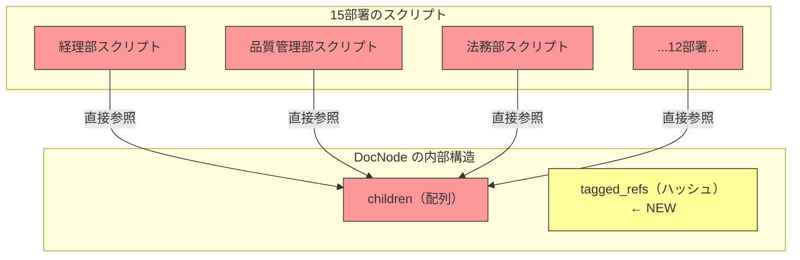
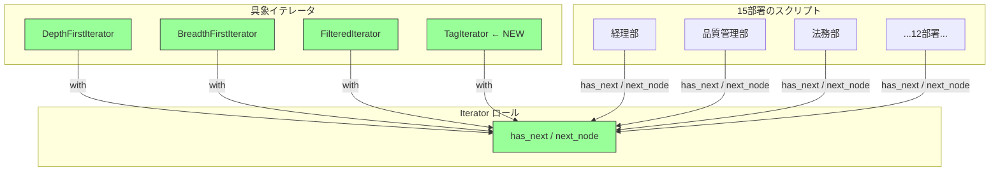

---
categories:
  - tech
date: 2026-03-30T07:07:05+09:00
description: 社内文書管理のフォルダツリーを直接触る走査コードが15部署にコピペ拡散。構造変更で全スクリプトが壊れ業務停止に。Iteratorパターンで内部構造を隠蔽しコード探偵ロックが迷宮の出口を示す。
draft: false
epoch: 1774822025
image: /public_images/2026/code-detective-iterator/header.webp
iso8601: 2026-03-30T07:07:05+09:00
tags:
  - design-pattern
  - perl
  - moo
  - iterator
  - exposed-collection-internals
  - refactoring
  - code-detective
title: コード探偵ロックの事件簿【Iterator】迷宮のファイル棚〜内部構造を暴くな、歩き方を教えろ〜
toc: true
---

会議室のホワイトボードには、私が朝から描き直しているDocVaultのフォルダツリーが広がっていた。赤マーカーの「BROKEN」の文字が15箇所。

私は宮本。従業員3000人のメーカー「タクミ精工」で情シスのチームリーダーをしている。35歳、この部門に来て10年になる。社内文書管理システム「DocVault」は3年前に私が設計した。部署ごとのフォルダにマニュアル、規程、議事録が格納されるツリー構造のシステムで、導入当初は好評だった。

好評すぎたのが問題だった。

経理部が「期限切れ文書の一括削除スクリプト」を作った。品質管理部が「ISO文書の網羅性チェックスクリプト」を作った。法務部が「契約書の全文検索スクリプト」を作った。いつの間にか15部署が、それぞれDocVaultのフォルダツリーを直接走査するスクリプトを書いていた。

先週の金曜、私はフォルダツリーにタグベース分類を追加した。フォルダの `children` 配列に加えて、`tagged_refs` というハッシュを追加し、タグで横断的に文書を参照できるようにした。利便性を上げるための機能追加だった。

今朝、15部署のスクリプトが全滅した。

全部のスクリプトが `children` を直接触っている。再帰で `@{$node->children}` を回して、私が `children` の構造を変えたから、全部壊れたのだ。

原因は分かっている。各部署に個別に直してもらうことも、私がまとめて直すこともできる。けれど同じ構造をまた晒せば、同じことが起きる。根本的な解決策を考える時間が、今の私にはなかった。

上司の高橋さんが会議室に顔を出した。「宮本さん、外部のコンサルタントを手配した。コードの設計に強い人らしい。もう着く頃だ」

コンサルタントか。正直なところ、15部署のスクリプトを直すだけなら自分でやったほうが早い。10年やってきた自負がある。けれど「二度と壊れない設計」となると、外の目が要るのかもしれない。

会議室のドアが開いた。入ってきた男は、ノートPCを小脇に抱え、もう片方の手にエナジードリンクの缶を持っていた。スーツではなくカジュアルな黒シャツ。コンサルタントにしては随分と砕けた格好だが、目だけは鋭い。ホワイトボードの図を一瞥し、赤い「BROKEN」の数を数えるように視線を走らせた。

「——15。きれいに割れたものだ」

挨拶もなしに数字から入る人は初めてだった。

「宮本です。状況を説明しますと——」

「ロックだ。状況は見れば分かる」そう言って、彼は私が描いたフォルダツリーの前に立った。「構造変更をした君が犯人ではない。君が変えたのは棚の中身だ。問題は、15人が棚の中身を直接漁っていたことにある」

高橋さんは「後は任せた」と言い残して去り、私はコンサルタントと二人きりになった。LCIという看板を掲げたコード専門の探偵だと、後から高橋さんのメールで知った。コンサルタントではなく探偵。変わった肩書きだが、少なくとも現場を見て即座に構造の問題を指摘する目は持っているらしい。

## 現場検証：丸見えの棚の中身

「フォルダノードのクラスを見せてくれたまえ」

ロックさんは私のノートPCの画面を覗き込み、「ワトソン君、ここに映してくれ」と会議室のモニターを指した。

「宮本です」

「そうだったかね」

訂正が届いた気配はなかった。私はDocNodeクラスを開いた。

```perl
package DocNode {
    use Moo;
    use Types::Standard qw( ArrayRef InstanceOf Str );

    has name     => ( is => 'ro', required => 1 );
    has type     => ( is => 'ro', required => 1 );  # 'folder' or 'file'
    has children => (
        is      => 'rw',
        isa     => ArrayRef[InstanceOf['DocNode']],
        default => sub { [] },
    );

    sub add_child ($self, $child) {
        push $self->children->@*, $child;
    }
}
```

「ここまでは問題ない。問題は使い方だ。各部署のスクリプトを見せたまえ」

私は3つの代表的なスクリプトを開いた。

```perl
# 経理部：期限切れ文書の一括検索（深さ優先）
sub find_expired ($node) {
    my @results;
    if ($node->type eq 'file' && is_expired($node)) {
        push @results, $node;
    }
    for my $child ($node->children->@*) {    # ← children を直接走査
        push @results, find_expired($child);  # ← 再帰も自前
    }
    return @results;
}

# 品質管理部：ISO文書の網羅性チェック（幅優先）
sub check_coverage ($root) {
    my @queue = ($root);
    my @iso_docs;
    while (my $node = shift @queue) {
        if ($node->type eq 'file' && $node->name =~ /^ISO/) {
            push @iso_docs, $node;
        }
        push @queue, $node->children->@*;    # ← children を直接キューに追加
    }
    return @iso_docs;
}

# 法務部：契約書の全文検索（深さ優先 + フォルダスキップ）
sub search_contracts ($node, $keyword) {
    my @results;
    for my $child ($node->children->@*) {    # ← children を直接走査
        if ($child->type eq 'folder') {
            push @results, search_contracts($child, $keyword);
        }
        elsif ($child->name =~ /契約書/ && contains($child, $keyword)) {
            push @results, $child;
        }
    }
    return @results;
}
```

ロックさんは会議室のホワイトボードに歩み寄った。私が朝から描いていたフォルダツリーの図を見ながら、赤マーカーを手に取る。

「3つとも `$node->children->@*` に直接アクセスしている。経理部は深さ優先の再帰、品質管理部は幅優先のキュー、法務部は深さ優先にフォルダスキップを加えている。走査のアルゴリズムは違うが、内部構造への依存は同じだ」

「それは把握しています。問題は、今から15部署分を直しても次の構造変更でまた壊れることで——」

「その通りだ。だから君は私を呼んだのだろう」

呼んだのは高橋さんだが、訂正する意味もなさそうだった。

「15部署×数本のスクリプト。すべてが `children` という内部のデータ構造を直接覗いている。棚の中身を勝手に漁っているのと同じだ。棚の持ち主が引き出しの配置を変えたら——」

ロックさんは私が描いたフォルダツリーの横に、新しい図を描き始めた。



「赤いノードが全部壊れた。15部署が `children` の配列構造に依存しているから、`children` を変更すると全員が巻き添えになる」

ロックさんはマーカーで図の中心を指した。

「これがExposed Collection Internals（内部構造の露出）——今回の容疑者だよ、ワトソン君」

またワトソン君だ。もう訂正する気力はない。

「内部構造の露出、ですか」

「コレクションの中身——配列なのかハッシュなのか、要素の並び順は何か、子ノードの取得方法は何か——これらは実装の詳細だ。利用者が知るべきは『次の要素があるか』と『次の要素をくれ』だけでいい。棚の中身を直接漁るのではなく、棚の歩き方を教えるべきだった」

分かる。言われてみれば、分かる。だが10年この仕事をしてきた経験からすると、「歩き方を教える」のは言うほど簡単ではない。

「それで、具体的にはどうするんですか。15部署がそれぞれ違う走査をしているんです。深さ優先もあれば幅優先もある。フィルタ条件もバラバラです。全部を1つのインターフェースで——」

「できる」

ロックさんは断言した。根拠も示さずに。この自信は何に裏打ちされているのだろう。

## 推理披露：迷宮の案内人（Iterator）

ロックさんはエナジードリンクの缶を会議室のテーブルに置き、ホワイトボードの新しい面に向き直った。

「解決策は歩き方をオブジェクトにすることだ」

ホワイトボードに2つのメソッドだけを書いた。

- `has_next` — 次の要素があるか？
- `next` — 次の要素をくれ

「この2つだけが公開インターフェースだ。利用者は `children` の存在すら知らなくていい。迷宮の地図を渡すのではなく、案内人を雇うのさ」

2つだけ。深さ優先も幅優先もフィルタも、たった2つのメソッドで？　疑わしいが、まずは聞いてみる。

【After】Iterator ロール

```perl
package Iterator {
    use Moo::Role;

    requires 'has_next';
    requires 'next_node';
}
```

【After】深さ優先イテレータ

```perl
package DepthFirstIterator {
    use Moo;
    with 'Iterator';

    has _stack => ( is => 'ro', default => sub { [] } );

    sub BUILD ($self, $args) {
        push $self->_stack->@*, $args->{root} if $args->{root};
    }

    sub has_next ($self) {
        return scalar $self->_stack->@* > 0;
    }

    sub next_node ($self) {
        my $node = pop $self->_stack->@*;
        return undef unless $node;
        # children を逆順に積む（先頭の子が先に取り出されるように）
        push $self->_stack->@*, reverse $node->children->@*;
        return $node;
    }
}
```

「`DepthFirstIterator` はスタックを使って深さ優先走査を実現する。`children` にアクセスしているのはイテレータの内部だけだ。利用者は `has_next` と `next_node` しか呼ばない」

「でも、`children` の構造が変わったらこのイテレータ自体も壊れますよね？」

「壊れる。だが直すのはこの1箇所だけだ。15部署のスクリプトは触らない」

1箇所。15箇所ではなく、1箇所。それだけで、反論の半分は消えた。

「では幅優先も見たまえ」

【After】幅優先イテレータ

```perl
package BreadthFirstIterator {
    use Moo;
    with 'Iterator';

    has _queue => ( is => 'ro', default => sub { [] } );

    sub BUILD ($self, $args) {
        push $self->_queue->@*, $args->{root} if $args->{root};
    }

    sub has_next ($self) {
        return scalar $self->_queue->@* > 0;
    }

    sub next_node ($self) {
        my $node = shift $self->_queue->@*;
        return undef unless $node;
        push $self->_queue->@*, $node->children->@*;
        return $node;
    }
}
```

「深さ優先は `pop`（スタック）、幅優先は `shift`（キュー）。データ構造を変えるだけで走査順が変わる。どちらも外部インターフェースは同じ `has_next` / `next_node` だ」

「待ってください。同じインターフェースなのに、歩き方が違う——これ、利用者側のコードは本当に同じ書き方で済むんですか？」

「多態性だよ、ワトソン君。呼び出し側が走査の種類を知らなくていい。それがインターフェースの力だ」

私はまだ疑っている部分があった。「でも、うちの部署はフィルタ条件がバラバラです。経理部は期限切れだけ、品質管理部はISO文書だけ。走査方法が同じでも、条件が違えば結局個別のコードが——」

「良い質問だ」

ロックさんが良い質問だと言ったのは、これが初めてだった。

【After】フィルタ付きイテレータ（デコレータ）

```perl
package FilteredIterator {
    use Moo;
    with 'Iterator';

    has _inner  => ( is => 'ro', required => 1 );
    has _filter => ( is => 'ro', required => 1 );  # コードリファレンス
    has _buffer => ( is => 'rw' );

    sub BUILD ($self, $) { $self->_advance() }

    sub _advance ($self) {
        while ($self->_inner->has_next) {
            my $node = $self->_inner->next_node;
            if ($self->_filter->($node)) {
                $self->_buffer($node);
                return;
            }
        }
        $self->_buffer(undef);
    }

    sub has_next ($self) { defined $self->_buffer }

    sub next_node ($self) {
        my $current = $self->_buffer;
        $self->_advance();
        return $current;
    }
}
```

「`FilteredIterator` は別のイテレータをラップして、条件に合う要素だけを返す。Decorator パターンとの組み合わせだ。深さ優先でフィルタ、幅優先でフィルタ——どちらも自在に組み合わせられる」

走査方法とフィルタが独立している。組み合わせが自由だということは、経理部の要件も品質管理部の要件も、同じ部品の組み合わせで表現できるのか。

「パターンは単独で使うものではない。組み合わせてこそ力を発揮する」

私の疑念は、少しずつ形を変えていた。「机上の空論」という疑いから、「本当にうちの現場で動くのか」という実装上の懸念に。

【After】DocNode にイテレータ生成メソッドを追加

```perl
package DocNode {
    use Moo;
    use Types::Standard qw( ArrayRef InstanceOf );

    has name     => ( is => 'ro', required => 1 );
    has type     => ( is => 'ro', required => 1 );
    has children => (
        is      => 'rw',
        isa     => ArrayRef[InstanceOf['DocNode']],
        default => sub { [] },
    );
    has tagged_refs => (
        is      => 'rw',
        default => sub { {} },
    );

    sub add_child ($self, $child) {
        push $self->children->@*, $child;
    }

    # イテレータ生成（利用者は children を知らなくていい）
    sub create_iterator ($self, %opts) {
        my $type = $opts{type} // 'depth';
        my $iter;

        if ($type eq 'breadth') {
            $iter = BreadthFirstIterator->new(root => $self);
        }
        else {
            $iter = DepthFirstIterator->new(root => $self);
        }

        if ($opts{filter}) {
            $iter = FilteredIterator->new(
                _inner  => $iter,
                _filter => $opts{filter},
            );
        }

        return $iter;
    }
}
```

「`create_iterator` が唯一の入口だ。利用者は走査の種類とフィルタ条件を指定するだけで、`children` の構造を一切知る必要がない」

「実際に15部署のスクリプトがどう変わるか、見せてもらえますか」

ロックさんは私のPCに手を伸ばした。「少し打たせてもらうよ、ワトソン君」

```perl
# 経理部：期限切れ文書の一括検索
my $iter = $root->create_iterator(
    type   => 'depth',
    filter => sub ($node) {
        $node->type eq 'file' && is_expired($node);
    },
);
my @expired;
while ($iter->has_next) {
    push @expired, $iter->next_node;
}

# 品質管理部：ISO文書の網羅性チェック
my $iter = $root->create_iterator(
    type   => 'breadth',
    filter => sub ($node) {
        $node->type eq 'file' && $node->name =~ /^ISO/;
    },
);
my @iso_docs;
while ($iter->has_next) {
    push @iso_docs, $iter->next_node;
}

# 法務部：契約書の全文検索
my $iter = $root->create_iterator(
    type   => 'depth',
    filter => sub ($node) {
        $node->type eq 'file'
        && $node->name =~ /契約書/
        && contains($node, $keyword);
    },
);
my @contracts;
while ($iter->has_next) {
    push @contracts, $iter->next_node;
}
```

「3つとも同じパターンだ。`create_iterator` でイテレータを取得し、`while` ループで `has_next` / `next_node`。`children` の文字は一度も出てこない」

私はコードを見比べた。経理部も品質管理部も法務部も、走査部分のコードが同じ形をしている。違うのはフィルタ条件だけだ。「これなら、私が先週追加したタグベース分類も——」

「対応できる。見てみたまえ」

```perl
# タグベース走査のイテレータを追加
package TagIterator {
    use Moo;
    with 'Iterator';

    has _tags    => ( is => 'ro', required => 1 );  # 対象タグの配列
    has _nodes   => ( is => 'ro', default => sub { [] } );
    has _seen    => ( is => 'ro', default => sub { {} } );

    sub BUILD ($self, $args) {
        my $root = $args->{root};
        for my $tag ($self->_tags->@*) {
            for my $ref ($root->tagged_refs->{$tag}->@*) {
                next if $self->_seen->{$ref->name}++;
                push $self->_nodes->@*, $ref;
            }
        }
    }

    sub has_next ($self) { scalar $self->_nodes->@* > 0 }
    sub next_node ($self) { shift $self->_nodes->@* }
}
```

「新しい走査方法を追加しても、`Iterator` ロールを満たすクラスを1つ作るだけだ。既存の15部署のスクリプトには一切触れない。`create_iterator` に `type => 'tag'` を追加すれば、タグベースの走査も同じインターフェースで使える」



「赤かった15部署が、緑のインターフェースだけに依存するようになった。内部構造が変わっても、イテレータの中だけで吸収される。**棚の中身が変わっても、歩き方は変わらない**」

私の疑念は、ここで完全に消えた。

## 解決：迷宮に道標を

「では、動かして見せよう」

ロックさんが私のPCでテストを実行した。会議室のモニターにターミナルの出力が映る。

```bash
$ prove -v t/iterator.t
# Subtest: Before: Exposed Collection Internals
    ok 1 - Direct children access works initially
    ok 2 - Depth-first manual recursion finds 8 files
    ok 3 - Breadth-first manual queue finds 8 files
    ok 4 - After structure change, direct access script BREAKS
    ok 5 - All 15 department scripts depend on internal structure
ok 1 - Before: Exposed Collection Internals
# Subtest: After: Iterator Pattern
    ok 1 - DepthFirstIterator finds 8 files
    ok 2 - BreadthFirstIterator finds 8 files
    ok 3 - Depth-first order: root visited before leaves
    ok 4 - Breadth-first order: siblings visited before children
    ok 5 - FilteredIterator with type=file returns only files (8)
    ok 6 - FilteredIterator with name filter returns matching docs (3)
    ok 7 - Composing filters: depth-first + file + name pattern
    ok 8 - After structure change, iterator still works
    ok 9 - TagIterator traverses by tag without touching children
    ok 10 - Adding new iterator type requires zero changes to callers
ok 2 - After: Iterator Pattern
All tests successful.
```

「Before のテスト4を見たまえ——構造変更でスクリプトが壊れる。After のテスト8——構造変更してもイテレータが吸収する。テスト9、タグベース走査も同じインターフェースで動作。テスト10、新しいイテレータを追加しても利用者のコードは変更不要」

テストが通る瞬間は、何度経験しても安堵する。だが今回の安堵は少し違った。「今回だけ通る」のではなく、「今後も壊れない構造になった」という手応えがあったからだ。

「15部署のスクリプト修正は、`$node->children->@*` を `$root->create_iterator(...)` に差し替えるだけですね」

「そうだ。しかもその修正は最後の修正だ。今後どんな走査方法が追加されても、どんな内部構造の変更があっても、利用者のコードは二度と壊れない」

私はすでに頭の中で修正手順書を書き始めていた。15部署に配るメール、差し替えのサンプルコード、テスト方法。けれどもう一つ、気になることがあった。

「一つ確認させてください。走査中にフォルダの追加や削除が起きたらどうなりますか。うちの文書管理は、業務時間中にファイルが増えることがあるんです」

ロックさんは少し間を置いた。今日の会話の中で、初めて即答しなかった。

「良い懸念だ。Iterator は走査の抽象化であって、コレクション自体の操作——追加、削除、変更——は範囲外だ。走査中にコレクションを変更すると、イテレータの状態が壊れる」

「つまり、走査中に誰かがフォルダを追加したら？」

「イテレータが見ているスタックやキューと、実際のツリーがずれる。走査は読み取り専用と割り切るべきだ。変更が必要なら、走査で対象を集めてから、走査の外で一括変更する」

「迷宮を歩きながら壁を動かしてはいけない、と」

「……その通りだ、ワトソン君」

ロックさんが一瞬、驚いた顔をしたのを私は見逃さなかった。自分の比喩を先に言われるとは思っていなかったのだろう。

会議が終わり、ロックさんは来たときと同じようにPCを小脇に抱えて立ち上がった。

「次に構造を変えるときは、呼ばれる前に自分で解決できるだろうね、ワトソン君」

それがこの人なりの褒め言葉なのだと、私は思うことにした。

ロックさんを会議室のドアまで見送り、私はそのまま自席に戻った。頭の中ではすでに次のことを考えていた。`create_iterator` に `type => 'tag'` を追加すれば、先週のタグベース分類もすぐに使える。そしてその先——たとえば全文検索インデックスを導入したときも、`SearchIterator` を1つ書けばいい。15部署のスクリプトはもう触らなくていい。

デスクのモニターを開きながら、15部署への通知メールを書き始めた。「スクリプトの修正手順をお送りします。今回の修正が最後になります。今後、DocVaultの内部構造が変わっても、皆さんのスクリプトには影響しません」

---

## 探偵の調査報告書

| 容疑（アンチパターン） | 真実（パターン） | 証拠（効果） |
| :--- | :--- | :--- |
| Exposed Collection Internals（内部構造の露出）。ツリー構造の `children` 配列を外部から直接走査し、15部署のスクリプトが内部構造に依存。構造変更（タグベース分類の追加）で全スクリプトが同時に壊れ、業務が停止した。 | Iterator パターン。走査ロジックをイテレータオブジェクトに封じ込め、`has_next` / `next_node` の統一インターフェースだけを公開する。内部構造の変更はイテレータの中で吸収され、利用者のコードには影響しない。 | 15部署のスクリプトが内部構造から完全に分離。深さ優先・幅優先・フィルタ付き・タグベースの4種類の走査を統一インターフェースで提供。新しい走査方法の追加は新クラス1つのみ。構造変更時の修正対象がイテレータ内部に限定され、利用者コードの変更はゼロに。 |

### 推理のステップ

1. 内部構造への直接アクセスを特定する: `$node->children->@*` のように、コレクションの内部データ構造を直接参照している箇所を洗い出す。15部署のスクリプトすべてが同じ構造に依存していた。
2. 走査インターフェースを定義する: `has_next` と `next_node` の2メソッドだけを持つ `Iterator` ロールを作る。利用者が知るべきはこの2つだけだ。
3. 具象イテレータを実装する: 深さ優先（スタック）、幅優先（キュー）など、走査アルゴリズムごとにクラスを分ける。`children` へのアクセスはイテレータの内部に閉じ込める。
4. フィルタをデコレータとして合成する: `FilteredIterator` が任意のイテレータをラップし、条件に合う要素だけを返す。走査方法とフィルタ条件を自由に組み合わせられる。

### ロックより

ワトソン君。コレクションの利用者が知るべきは「次があるか」と「次をくれ」だけだ。棚が木製か金属か、引き出しが3段か5段か、中身がアルファベット順か日付順か——それは棚の持ち主が決めることであって、中身を探す人間が気にすることではない。

Iterator パターンの本質は「歩き方の統一」だ。深さ優先も幅優先もフィルタ付きも、外から見れば同じ `has_next` / `next_node` のループになる。走査アルゴリズムがオブジェクトになるから、新しい歩き方を追加するのも、既存の歩き方を組み合わせるのも、クラスを1つ書くだけで済む。

ところで君は、私の比喩を先に言ってのけたね。あれは中々のものだった。次に迷宮を見つけたとき、案内人を置くべきだと判断できるなら——もう私の出番はないかもしれない。
