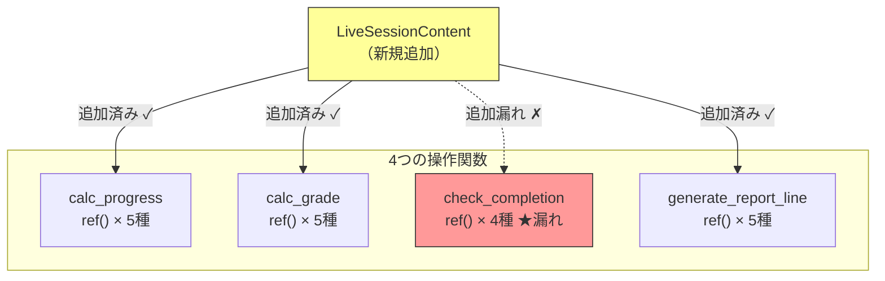
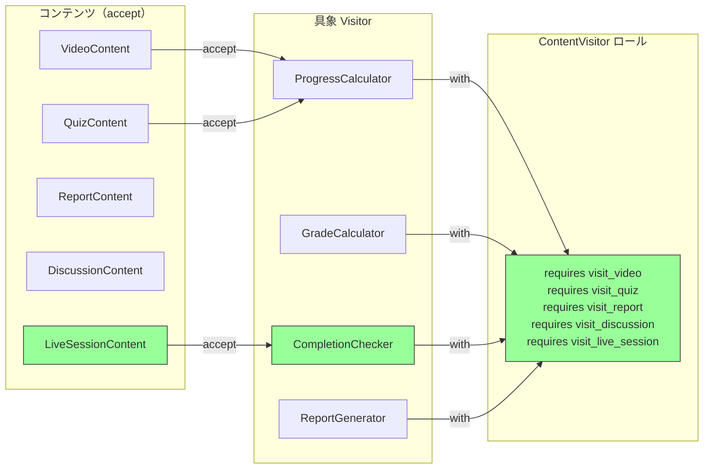

---
categories:
  - tech
date: 2026-03-31T07:07:05+09:00
description: LMSに新コンテンツ種別を追加したら、6箇所のref()分岐のうち1箇所で追加漏れ。未受講者200名に偽の修了証が発行される事故に。散在する型チェックをVisitorパターンのダブルディスパッチで一掃し、追加漏れを構造的に防ぐ。
draft: false
epoch: 1774908425
image: /public_images/2026/code-detective-visitor/header.webp
iso8601: 2026-03-31T07:07:05+09:00
tags:
  - design-pattern
  - perl
  - moo
  - visitor
  - scattered-type-checking
  - refactoring
  - code-detective
title: コード探偵ロックの事件簿【Visitor】偽りの修了証〜六箇所に潜む型チェックの亡霊〜
toc: true
---

電話が鳴ったのは、金曜の夕方だった。

「柴田さん。ライブセッションに出席していない社員に修了証が出ています。200名です」

メディカ製薬の研修管理者、中村さんの声は静かだった。怒鳴られたほうがまだよかった。静かな声のほうが、事の重大さが伝わる。

私は柴田。EdTechスタートアップ「LearnFlow」のバックエンドエンジニア、経験3年、27歳。LearnFlowは企業向けの研修LMS（学習管理システム）を提供していて、私はコンテンツ管理のバックエンドを担当している。

メディカ製薬は薬機法に基づくコンプライアンス研修をLearnFlowで運用していた。動画視聴、確認テスト、感想レポート、グループ討議——4種類のコンテンツをすべて修了した社員にだけ、修了証が自動発行される仕組みだ。先月、「ライブセッション」を追加したいという要望があり、私が実装を担当した。コンテンツクラスを1つ追加し、進捗計算、採点、レポート生成のコードに新しい分岐を書き足した。テストも通った。

1箇所だけ、書き忘れていた。

修了判定の関数。そこだけ、`LiveSessionContent` の分岐を追加していなかった。未知の型が来ると `else` 節でデフォルト修了扱いになるコードだった。製薬企業のコンプライアンス研修で偽の修了証——監査上の重大リスクだ。中村さんは契約解除をちらつかせている。

週末を挟んで、月曜の朝。社内のSlackで「バグの原因を特定してくれる変な探偵がいる」という噂を目にしたのは先週のことだ。普段なら相手にしないが、コード品質を見直したいという動機はあった。

「レガシー・コード・インベスティゲーション（LCI）」と検索して出てきた住所は、雑居ビルの一室だった。

ノックしてドアを開けると、複数のモニターにPDFが映し出されていた。よく見ると——修了証だ。複数のフォーマットの修了証が並んでいる。研修名、日付、受講者名、発行機関。レイアウトの違いを比較しているように見えた。

「修了証の研究ですか？」

モニターの前に座っていた男が、ゆっくりとこちらを向いた。

「フォーマットの研究だよ。どの発行機関の修了証も、構成要素は同じだ——受講者、研修、日付、判定。だが表現形式は全部違う。興味深いね。で、君の修了証は何人に出た？」

200名、と答えた。男は眉を上げた。

「200か。それで、何箇所の分岐がある？」

質問の意図が分からなかった。「分岐って、何の……」

「型チェックの分岐だよ。`ref()` を何箇所で使っている？」

話が早い。この男——モニターのベゼルに「Locke」のステッカーが貼ってある——は、修了証のバグの構造を見る前から、原因の形を知っているかのような口ぶりだった。

「コードを見せてもらえるかな、ワトソン君」

「柴田です」

「ワトソン君。コードを見せたまえ」

訂正は無駄だと分かった。200名の修了証のほうが、名前よりずっと重い。私はノートPCを開いた。

## 現場検証：六人の門番と偽の名簿

ロックは私のPCを引き寄せ、コードをスクロールし始めた。

しばらく沈黙が続いた。画面を追う目の動きだけが、この男が何かを読み取っていることを示していた。

「コンテンツのクラス定義を見ているんだね。5つか」

```perl
package VideoContent {
    use Moo;
    has id           => ( is => 'ro', required => 1 );
    has title        => ( is => 'ro', required => 1 );
    has duration_min => ( is => 'ro', required => 1 );
    has watched_min  => ( is => 'rw', default  => 0 );
}

package QuizContent {
    use Moo;
    has id              => ( is => 'ro', required => 1 );
    has title           => ( is => 'ro', required => 1 );
    has total_questions => ( is => 'ro', required => 1 );
    has correct_answers => ( is => 'rw', default  => 0 );
}

package ReportContent {
    use Moo;
    has id         => ( is => 'ro', required => 1 );
    has title      => ( is => 'ro', required => 1 );
    has submitted  => ( is => 'rw', default  => 0 );
    has word_count => ( is => 'rw', default  => 0 );
}

package DiscussionContent {
    use Moo;
    has id             => ( is => 'ro', required => 1 );
    has title          => ( is => 'ro', required => 1 );
    has post_count     => ( is => 'rw', default  => 0 );
    has required_posts => ( is => 'ro', default  => 3 );
}

package LiveSessionContent {
    use Moo;
    has id           => ( is => 'ro', required => 1 );
    has title        => ( is => 'ro', required => 1 );
    has attended     => ( is => 'rw', default  => 0 );
    has duration_min => ( is => 'ro', required => 1 );
}
```

「5つのクラスに問題はない。問題は操作のほうだ」

ロックは手を止めず、操作関数のコードまでスクロールした。そして人差し指でモニターを軽く叩き始めた。何かを数えている。

```perl
sub calc_progress ($content) {
    if (ref($content) eq 'VideoContent') {
        return int($content->watched_min / $content->duration_min * 100);
    }
    elsif (ref($content) eq 'QuizContent') {
        return int($content->correct_answers / $content->total_questions * 100);
    }
    elsif (ref($content) eq 'ReportContent') {
        return $content->submitted ? 100 : 0;
    }
    elsif (ref($content) eq 'DiscussionContent') {
        my $ratio = $content->post_count / $content->required_posts;
        return int(($ratio > 1 ? 1 : $ratio) * 100);
    }
    elsif (ref($content) eq 'LiveSessionContent') {
        return $content->attended ? 100 : 0;
    }
    else {
        die "Unknown content type: " . ref($content);
    }
}
```

「`calc_progress` に5つ。`calc_grade` にも5つ。`generate_report_line` にも5つ。`check_completion` に——」

ロックが画面を止めた。

「——4つ」

```perl
# ★ BUG: LiveSessionContent の分岐が漏れている！
sub check_completion ($content) {
    if (ref($content) eq 'VideoContent') {
        return calc_progress($content) >= 80 ? 1 : 0;
    }
    elsif (ref($content) eq 'QuizContent') {
        return calc_grade($content) eq 'pass' ? 1 : 0;
    }
    elsif (ref($content) eq 'ReportContent') {
        return $content->submitted ? 1 : 0;
    }
    elsif (ref($content) eq 'DiscussionContent') {
        return $content->post_count >= $content->required_posts ? 1 : 0;
    }
    # LiveSessionContent の分岐がない！
    else {
        return 1;  # ★ デフォルトで修了扱い
    }
}
```

「`else` で `return 1`。未知の型が来たら、無条件に修了扱いだ」

分かっている。と言いたかったが、声にならなかった。`die` にしておけば気づけたのに、`else` でデフォルト値を返してしまった。5箇所は正しく追加して、1箇所だけ漏れた。5箇所正しいからテストをすり抜けた。

ロックは椅子を少し引いて、モニターに映っていた修了証のPDFを指した。

「修了証には発行条件がある。すべてのコンテンツを修了していること。だが `check_completion` だけが `LiveSessionContent` を知らなかった。6人の門番が同じ来訪者リストを持っているのに、1人だけリストの更新を忘れている」



「散在する型チェック——Scattered Type Checking。4つの関数に `ref()` による型分岐が散らばっていて、合計で20箇所。新しいコンテンツ種別を追加するたびに、20箇所すべてを漏れなく更新しなければならない。これが今回の事件の構造だ」

「構造は分かります。でも、`ref()` で分岐する以外に方法がありますか？ Perlにはインターフェースの型チェックがないですし」

ロックはモニターの修了証PDFを閉じた。その下に、コードエディタの画面が現れた。

「尋問をやめればいい」

## 推理披露：訪問者の資格（Visitor）

「`ref()` は尋問だ。呼び出し側が相手に『お前は何者だ』と問い詰めている。逆にすればいい。相手に自分が何者かを名乗らせる」

ロックはエディタにコードを打ち始めた。

「解決策は3つの仕組みで構成される」

- **Visitor ロール**: すべてのコンテンツ種別に対する `visit_*` メソッドを `requires` で強制する
- **accept メソッド**: 各コンテンツクラスが「自分は何者か」を Visitor に名乗る
- **具象 Visitor**: 操作ごとに1クラス。全コンテンツ種別への対応が保証される

【After】Visitor ロール（ContentVisitor）

```perl
package ContentVisitor {
    use Moo::Role;

    requires 'visit_video';
    requires 'visit_quiz';
    requires 'visit_report';
    requires 'visit_discussion';
    requires 'visit_live_session';
}
```

「`ContentVisitor` ロールは5つの `requires` を持つ。このロールを `with` したクラスが、1つでも `visit_*` を実装し忘れたらエラーになる。`requires` は Moo::Role の契約だ」

「契約——つまり、`check_completion` に分岐を書き忘れたような事故を防ぐ？」

「防ぐも何も、クラスのロード時にPerlが止まる。コードが動く前にだ」

【After】各コンテンツクラスに accept メソッドを追加

```perl
package VideoContent {
    use Moo;
    has id           => ( is => 'ro', required => 1 );
    has title        => ( is => 'ro', required => 1 );
    has duration_min => ( is => 'ro', required => 1 );
    has watched_min  => ( is => 'rw', default  => 0 );

    sub accept ($self, $visitor) { $visitor->visit_video($self) }
}

package QuizContent {
    use Moo;
    has id              => ( is => 'ro', required => 1 );
    has title           => ( is => 'ro', required => 1 );
    has total_questions => ( is => 'ro', required => 1 );
    has correct_answers => ( is => 'rw', default  => 0 );

    sub accept ($self, $visitor) { $visitor->visit_quiz($self) }
}

package ReportContent {
    use Moo;
    has id         => ( is => 'ro', required => 1 );
    has title      => ( is => 'ro', required => 1 );
    has submitted  => ( is => 'rw', default  => 0 );
    has word_count => ( is => 'rw', default  => 0 );

    sub accept ($self, $visitor) { $visitor->visit_report($self) }
}

package DiscussionContent {
    use Moo;
    has id             => ( is => 'ro', required => 1 );
    has title          => ( is => 'ro', required => 1 );
    has post_count     => ( is => 'rw', default  => 0 );
    has required_posts => ( is => 'ro', default  => 3 );

    sub accept ($self, $visitor) { $visitor->visit_discussion($self) }
}

package LiveSessionContent {
    use Moo;
    has id           => ( is => 'ro', required => 1 );
    has title        => ( is => 'ro', required => 1 );
    has attended     => ( is => 'rw', default  => 0 );
    has duration_min => ( is => 'ro', required => 1 );

    sub accept ($self, $visitor) { $visitor->visit_live_session($self) }
}
```

「`accept` メソッドは1行だけ。`VideoContent` なら `$visitor->visit_video($self)` を呼ぶ。各クラスが自分の型を Visitor に通知している」

「待ってください」私は口を挟んだ。「結局、型で分岐していませんか？ `accept` の中で `visit_video` を呼ぶか `visit_quiz` を呼ぶかは、クラスごとに決まっている。`ref()` でやっていたことと何が違うんですか？」

ロックは手を止めて、こちらを見た。

「いい疑問だ。違いはここにある——`ref()` の分岐は**呼び出し側**が型を判定する。操作関数の中に "お前は Video か？ Quiz か？" という尋問が埋まっている。一方、`accept` は**オブジェクト自身**が型を通知する。呼び出し側は `$content->accept($visitor)` と書くだけで、どの `visit_*` が呼ばれるかを知らない」

「つまり……」

私は自分の事故を思い出しながら整理した。Before では `check_completion` の中に `ref()` の分岐を全種別分書く必要があった。4種類書いて、5種類目を忘れた。After では——

「After では、`check_completion` にあたる関数が `ref()` を持たない。代わりに各コンテンツが `accept` で自分を名乗る。呼び出し側には分岐が一切ない」

「それがダブルディスパッチだ。`$content->accept($visitor)` と呼ぶと、まず `$content` の型で `accept` が選ばれ、次に `accept` 内部で `$visitor` の型に応じた `visit_*` が呼ばれる。2段階の振り分けだ」

正直、一度聞いただけでは腑に落ちなかった。だが一つだけ確かなことがあった——操作関数の中から `ref()` が消えている。

【After】具象 Visitor（修了判定チェッカー）

```perl
package CompletionChecker {
    use Moo;
    with 'ContentVisitor';

    sub visit_video ($self, $v) {
        my $progress = ProgressCalculator->new->visit_video($v);
        return $progress >= 80 ? 1 : 0;
    }
    sub visit_quiz ($self, $q) {
        return GradeCalculator->new->visit_quiz($q) eq 'pass' ? 1 : 0;
    }
    sub visit_report ($self, $r) {
        return $r->submitted ? 1 : 0;
    }
    sub visit_discussion ($self, $d) {
        return $d->post_count >= $d->required_posts ? 1 : 0;
    }
    sub visit_live_session ($self, $ls) {
        return $ls->attended ? 1 : 0;
    }
}
```

「`CompletionChecker` は `with 'ContentVisitor'` を宣言している。もし `visit_live_session` を書き忘れたら——」

「Moo::Role の `requires` でエラーになる」

「それで200人の事故は防げるんですか？」

核心を聞いた。ロックの顔から芝居がかった表情が消えた。

「沈黙するバグと叫ぶエラー、どちらが200人を守れる？ Before の `else { return 1 }` は沈黙した。出席していない社員を黙って通した。After の `requires` は叫ぶ。`visit_live_session` を書き忘れたら、コードが動く前にPerlが止まる。200人に修了証が届く前に」

残りの Visitor クラスも見せてもらった。

```perl
package ProgressCalculator {
    use Moo;
    with 'ContentVisitor';

    sub visit_video ($self, $v) {
        return $v->duration_min > 0
            ? int($v->watched_min / $v->duration_min * 100) : 0;
    }
    sub visit_quiz ($self, $q) {
        return $q->total_questions > 0
            ? int($q->correct_answers / $q->total_questions * 100) : 0;
    }
    sub visit_report ($self, $r)     { $r->submitted ? 100 : 0 }
    sub visit_discussion ($self, $d) {
        my $ratio = $d->required_posts > 0
            ? $d->post_count / $d->required_posts : 0;
        return int(($ratio > 1 ? 1 : $ratio) * 100);
    }
    sub visit_live_session ($self, $ls) { $ls->attended ? 100 : 0 }
}

package GradeCalculator {
    use Moo;
    with 'ContentVisitor';

    sub visit_video ($self, $v) {
        return ProgressCalculator->new->visit_video($v) >= 80
            ? 'pass' : 'fail';
    }
    sub visit_quiz ($self, $q) {
        return $q->total_questions > 0
            && ($q->correct_answers / $q->total_questions) >= 0.7
            ? 'pass' : 'fail';
    }
    sub visit_report ($self, $r) {
        return $r->submitted && $r->word_count >= 200
            ? 'pass' : 'fail';
    }
    sub visit_discussion ($self, $d) {
        return $d->post_count >= $d->required_posts
            ? 'pass' : 'fail';
    }
    sub visit_live_session ($self, $ls) {
        return $ls->attended ? 'pass' : 'fail';
    }
}

package ReportGenerator {
    use Moo;
    with 'ContentVisitor';

    sub visit_video ($self, $v) {
        my $p = ProgressCalculator->new->visit_video($v);
        return sprintf("[Video] %s: %d%% watched", $v->title, $p);
    }
    sub visit_quiz ($self, $q) {
        return sprintf("[Quiz] %s: %d/%d correct",
            $q->title, $q->correct_answers, $q->total_questions);
    }
    sub visit_report ($self, $r) {
        return sprintf("[Report] %s: %s (%d words)",
            $r->title, ($r->submitted ? 'submitted' : 'pending'), $r->word_count);
    }
    sub visit_discussion ($self, $d) {
        return sprintf("[Discussion] %s: %d/%d posts",
            $d->title, $d->post_count, $d->required_posts);
    }
    sub visit_live_session ($self, $ls) {
        return sprintf("[Live] %s: %s",
            $ls->title, ($ls->attended ? 'attended' : 'absent'));
    }
}
```

「4つの操作が、4つの Visitor クラスに整理された。Before では4つの関数にそれぞれ `ref()` 分岐が散在していた——」



「`ref()` はどこにもない。散在していた6箇所の分岐が、Visitor ロールの `requires` 1箇所に集約された」

「新しい操作を追加するときは？」

「Visitor クラスを1つ作るだけだ。コンテンツクラスには触れない」

```perl
# 新しい操作の追加例
my @contents = ($video, $quiz, $report, $discussion, $live);

my $completion = CompletionChecker->new;
my @completed = grep { $_->accept($completion) } @contents;
# → 4件（ライブセッション未参加は正しく除外）
```

Before では `grep { check_completion($_) } @contents` で5件が返っていた——ライブセッション未参加なのに。After では正しく4件。

## 解決：正しき資格の証明

ロックがテストを実行した。

```bash
$ prove -v t/visitor.t
# Subtest: Before: Scattered Type Checking
    ok 1 - Video progress: 91%
    ok 2 - Live session progress: 0% (not attended)
    ok 3 - Live session grade: fail
    ok 4 - BUG: Unattended live session marked as COMPLETED
    ok 5 - Report correctly shows absent
    ok 6 - BUG: All 5 marked complete (live should be incomplete)
ok 1 - Before: Scattered Type Checking
# Subtest: After: Visitor Pattern
    ok 1 - Video progress via Visitor: 91%
    ok 2 - Live session progress via Visitor: 0%
    ok 3 - Quiz grade via Visitor: pass
    ok 4 - Live session grade via Visitor: fail
    ok 5 - FIX: Unattended live session correctly marked INCOMPLETE
    ok 6 - Video completion: complete (91% >= 80%)
    ok 7 - Report via Visitor shows absent
    ok 8 - FIX: Only 4 completed (live correctly excluded)
    ok 9 - Double dispatch: video calls visit_video
    ok 10 - Double dispatch: quiz calls visit_quiz
    ok 11 - New Visitor (DurationSummary) works without modifying content classes
ok 2 - After: Visitor Pattern
All tests successful.
```

`All tests successful.` の文字を見て、初めて息をついた。

Before のテスト4——未参加のライブセッションが修了扱いになっている。テスト6——5件全部が修了。これが200名の偽修了証の正体だ。After のテスト5——未参加は未修了。テスト8——修了は4件。テスト11——新しい Visitor を追加しても、コンテンツクラスは変更不要。

ただ、テストが通ったことと、200人の修了証を取り消す仕事は別だ。構造改善はこれからの事故を防ぐ。過去の事故は私が始末をつけなければならない。

ロックが口を開いた。

「一つ、警告がある」

「Visitor パターンはコンテンツの種類が安定しているときに力を発揮する。新しい操作を追加するのは簡単だ——Visitor クラスを1つ作るだけだから。だが新しいコンテンツ種別を追加したらどうなる？」

「`ContentVisitor` ロールに `requires` を追加して、全 Visitor に新しい `visit_*` メソッドを……全部直すことになりますね。4つの Visitor すべてに」

「そう。今回はコンテンツ種別が5つで安定しているから Visitor が有効だ。だが種別が頻繁に増えるなら、各コンテンツに操作メソッドを持たせる Strategy 的な構成のほうが適切な場合もある。どちらの軸が変化しやすいか。操作が増えやすいか、構造が増えやすいか。その見極めが、Visitor を使うか使わないかの分水嶺だよ、ワトソン君」

私はLCIを出た。帰りの電車で、メディカ製薬への報告書の下書きを書き始めた。

「原因：修了判定関数における新規コンテンツ種別の型分岐追加漏れ。対策：Visitor パターンによる構造改善を実施。型チェック分岐を `requires` による契約に集約し、実装漏れをクラスロード時に検出する仕組みを導入」

書いていて、手が止まった。技術的な対策は書ける。だが本質的な原因は「同じ分岐を6箇所に書かなければならない構造を放置していたこと」だ。`die` にしなかったことでも、テストが不足していたことでもない。同じ知識を複数箇所に散在させた時点で、漏れは時間の問題だった。

200名の修了証は取り消せる。構造は直せる。あの事務所の男が言ったことで一つだけ確かなのは——沈黙するバグより、叫ぶエラーのほうがいい、ということだ。

---

## 探偵の調査報告書

| 容疑（アンチパターン） | 真実（パターン） | 証拠（効果） |
| :--- | :--- | :--- |
| Scattered Type Checking（散在する型チェック）。4つの操作関数にそれぞれ `ref()` による5種別分岐が散在し、合計6箇所の型チェックが独立して存在。新コンテンツ種別「LiveSessionContent」の追加時に修了判定の1箇所で分岐追加が漏れ、未受講者200名に偽の修了証が発行された。 | Visitor パターン。操作ごとに Visitor クラスを作成し、各コンテンツクラスの `accept` メソッドによるダブルディスパッチで型分岐を解消。`ContentVisitor` ロールの `requires` が全コンテンツ種別への対応を強制し、追加漏れを構造的に防止。 | `ref()` 分岐6箇所が完全に消滅。新しい操作の追加は Visitor クラス1つの作成のみ。コンテンツクラスの変更は `accept` メソッド1行の追加のみ。`requires` により visit メソッドの実装漏れはクラスロード時にエラーとして検出。 |

### 推理のステップ

1. 散在する型チェックを特定する: `ref()` や `blessed()` による型分岐が複数の関数に繰り返し現れている箇所を洗い出す。同じ分岐パターンが4関数×5種別=20箇所に散在していた。
2. Visitor ロールを定義する: すべてのコンテンツ種別に対応する `visit_*` メソッドを `requires` で宣言する。これにより、実装漏れがロード時にエラーとして検出される。
3. 各コンテンツクラスに accept を追加する: `accept($visitor)` メソッドを1行だけ追加し、自分の型に対応する `visit_*` を呼び出す。これがダブルディスパッチの起点となる。
4. 操作ごとに具象 Visitor を実装する: `ProgressCalculator`、`GradeCalculator`、`CompletionChecker`、`ReportGenerator` の4クラスを作成。各クラスは `with 'ContentVisitor'` により全 `visit_*` の実装を強制される。

### ロックより

ワトソン君。`ref()` による型チェックは尋問だ。呼び出し側が「お前は誰だ」と問い詰める。尋問者が知らない顔が来たら——見逃す。それが200人の偽修了証だ。

Visitor は逆のアプローチを取る。オブジェクト自身に「私はこういう者です」と名乗らせる。名乗り方を知らない者は入口で止まる。止まるからこそ、気づける。

Visitor パターンの本質は「操作と構造の分離」だ。コンテンツという構造は変えず、操作だけを外から差し込む。新しい操作が必要になったら、新しい訪問者を招けばいい。構造に手を触れる必要はない。ただし——構造自体が変わるとき、新しい部屋が増えたときは、すべての訪問者にその部屋の訪問方法を教え直す必要がある。どちらの軸が変化しやすいか。その見極めが分水嶺だ。
