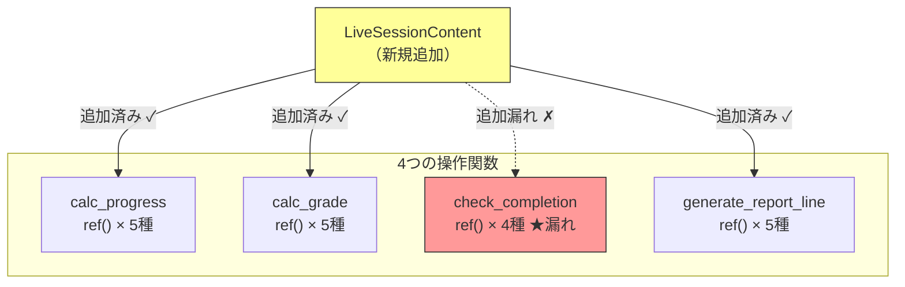
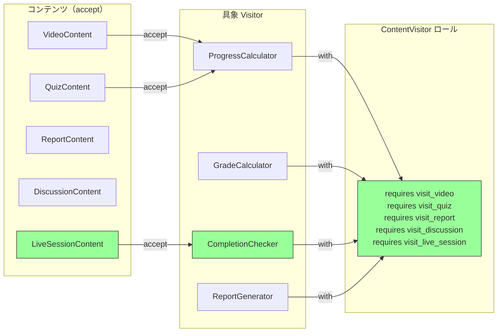

---
categories:
  - tech
date: 2026-03-31T07:07:05+09:00
description: LMSに新コンテンツ種別を追加したら、6箇所のref()分岐のうち1箇所で追加漏れ。未受講者200名に偽の修了証が発行される事故に。散在する型チェックをVisitorパターンのダブルディスパッチで一掃し、追加漏れを構造的に防ぐ。
draft: true
epoch: 1774908425
image: /public_images/2026/code-detective-visitor/header.webp
iso8601: 2026-03-31T07:07:05+09:00
tags:
  - design-pattern
  - perl
  - moo
  - visitor
  - scattered-type-checking
  - refactoring
  - code-detective
title: コード探偵ロックの事件簿【Visitor】偽りの修了証〜六箇所に潜む型チェックの亡霊〜
toc: true
---

「修了していない社員200名に、修了証が発行されました。製薬企業のコンプライアンス研修で、です」

私は柴田。EdTechスタートアップ「LearnFlow」のバックエンドエンジニアだ。経験3年、27歳。LearnFlowは企業向けの研修LMS（学習管理システム）を提供していて、私はコンテンツ管理のバックエンドを担当している。

クライアントの「メディカ製薬」は、薬機法に基づくコンプライアンス研修をLearnFlowで運用していた。研修は動画視聴、確認テスト、感想レポート、グループ討議の4種類のコンテンツで構成されている。すべてを修了した社員にだけ、修了証が自動発行される仕組みだ。

先月、メディカ製薬から「ライブセッション」を追加したいという要望があった。講師がリアルタイムで講義し、社員が出席する形式だ。私が実装を担当した。コンテンツクラスを1つ追加し、進捗計算、採点、レポート生成のコードに新しい分岐を書き足した。テストも通った。

——1箇所だけ、分岐を書き忘れていたことに気づいたのは、2週間後だった。

メディカ製薬の研修管理者から電話が来た。「ライブセッションに出席していない社員に修了証が出ています。200名です」

修了判定の関数——`check_completion`。そこだけ、`LiveSessionContent` の分岐を追加していなかった。未知の型が来ると `else` 節でデフォルト修了扱いになるコードだった。

製薬企業のコンプライアンス研修で偽の修了証は、監査上の重大リスクだ。メディカ製薬は契約解除をちらつかせている。

私は翌朝、藁にもすがる思いで雑居ビルの階段を上がった。

「レガシー・コード・インベスティゲーション（LCI）」

看板の下に小さく「※予約不要・守秘義務厳守」と書かれていたが、インクがかすれて「秘」の字が読めなかった。守秘義務は大丈夫なのだろうか。

ドアを開けると、デスクトップPCの排熱がこもった蒸し暑い空気が押し寄せた。デスクの上にはエナジードリンクの空き缶が散乱しており、その隙間からキーボードのキーキャップ——どうやらバラ売りのアルチザンキーキャップらしい——が数個、意味ありげに並べられている。複数のモニターにはコードが映し出されていて、その手前の革張りの椅子に座った男が、こちらを一瞥して口の端を上げた。

「……ワトソン君。修了していない者に修了証を与える——コードの世界の**卒業証書偽造**だね。なかなか重い罪だ」

会って一秒で「ワトソン君」呼ばわりだ。私の名前は柴田だが、訂正しても無駄な空気は入口で感じ取った。

「柴田です。LMSのコンテンツに新しい種別を追加したら——」

「6箇所の型チェックのうち1箇所で追加漏れ。5箇所は正しく動いていたから、テストをすり抜けた」ロックと名乗る男——正確には名刺の代わりにモニターのベゼルに「Locke」のステッカーが貼ってあるだけだが——は、私の説明を途中で遮った。「初歩的なにおいだよ、ワトソン君。まず現場を見せたまえ」

## 現場検証：六人の門番と偽の名簿

「コンテンツのクラス定義と、操作を行う関数を見せてくれたまえ」

ロックは私のノートPCを指差した。いや、指差したと思ったら、もう手を伸ばしてPCを引き寄せていた。「これだね？」と言いながら画面をスクロールし始める。探偵が証拠品を押収するような手つきだが、やっていることは他人のノートPCの無断操作だ。

私はコードを開いた——いや、ロックが開いた。

```perl
package VideoContent {
    use Moo;
    has id           => ( is => 'ro', required => 1 );
    has title        => ( is => 'ro', required => 1 );
    has duration_min => ( is => 'ro', required => 1 );
    has watched_min  => ( is => 'rw', default  => 0 );
}

package QuizContent {
    use Moo;
    has id              => ( is => 'ro', required => 1 );
    has title           => ( is => 'ro', required => 1 );
    has total_questions => ( is => 'ro', required => 1 );
    has correct_answers => ( is => 'rw', default  => 0 );
}

package ReportContent {
    use Moo;
    has id         => ( is => 'ro', required => 1 );
    has title      => ( is => 'ro', required => 1 );
    has submitted  => ( is => 'rw', default  => 0 );
    has word_count => ( is => 'rw', default  => 0 );
}

package DiscussionContent {
    use Moo;
    has id             => ( is => 'ro', required => 1 );
    has title          => ( is => 'ro', required => 1 );
    has post_count     => ( is => 'rw', default  => 0 );
    has required_posts => ( is => 'ro', default  => 3 );
}

package LiveSessionContent {
    use Moo;
    has id           => ( is => 'ro', required => 1 );
    has title        => ( is => 'ro', required => 1 );
    has attended     => ( is => 'rw', default  => 0 );
    has duration_min => ( is => 'ro', required => 1 );
}
```

「5つのコンテンツクラス。ここまでは問題ない。問題は**操作のほう**だ」

私は進捗計算と修了判定の関数を開いた。

```perl
sub calc_progress ($content) {
    if (ref($content) eq 'VideoContent') {
        return int($content->watched_min / $content->duration_min * 100);
    }
    elsif (ref($content) eq 'QuizContent') {
        return int($content->correct_answers / $content->total_questions * 100);
    }
    elsif (ref($content) eq 'ReportContent') {
        return $content->submitted ? 100 : 0;
    }
    elsif (ref($content) eq 'DiscussionContent') {
        my $ratio = $content->post_count / $content->required_posts;
        return int(($ratio > 1 ? 1 : $ratio) * 100);
    }
    elsif (ref($content) eq 'LiveSessionContent') {
        return $content->attended ? 100 : 0;
    }
    else {
        die "Unknown content type: " . ref($content);
    }
}
```

「`ref($content)` で型を判別して分岐している。`calc_progress` はこれでいい——`LiveSessionContent` の分岐もちゃんとある。同じ構造の関数が他にもあるんだね？」

「はい。`calc_grade`、`check_completion`、`generate_report_line`——合計4つの関数に、同じような `ref()` の分岐が入っています」

ロックは椅子から立ち上がり、ホワイトボードに向かった。マーカーのキャップを外すとき、カチッと音を鳴らす。この男は何をするにも芝居がかっている。事件現場に残された指紋を採取する鑑識官のようなポーズでコードを指差したが、やっていることはただの行カウントだ。

「つまり**6箇所**の型チェック分岐が、4つの関数に散らばっている。`LiveSessionContent` を追加したとき、この6箇所すべてに分岐を追加する必要があった」

「はい。5箇所は追加しました。でも——」

「`check_completion` だけ、漏れた」

ロックの声が低くなった。推理の核心に迫る名探偵の声色だが、事実上は単なるバグの指摘だ。

```perl
# ★ BUG: LiveSessionContent の分岐が漏れている！
sub check_completion ($content) {
    if (ref($content) eq 'VideoContent') {
        return calc_progress($content) >= 80 ? 1 : 0;
    }
    elsif (ref($content) eq 'QuizContent') {
        return calc_grade($content) eq 'pass' ? 1 : 0;
    }
    elsif (ref($content) eq 'ReportContent') {
        return $content->submitted ? 1 : 0;
    }
    elsif (ref($content) eq 'DiscussionContent') {
        return $content->post_count >= $content->required_posts ? 1 : 0;
    }
    # LiveSessionContent の分岐がない！
    else {
        return 1;  # ★ デフォルトで修了扱い
    }
}
```

「`else` 節で `return 1`——未知の型は**無条件で修了**。ライブセッションに出席していない社員も、ここを通って修了証を受け取った」

私は頭を抱えた。「`die` にしておけば気づいたのに、`else` でデフォルト値を返してしまったのが……」

ロックはホワイトボードに図を描いた。



「6箇所の門番が同じ名簿を持っている。新しい来訪者の顔写真を名簿に追加するとき、**6人全員の名簿を手作業で更新する必要がある**。1人でも更新を忘れれば、偽者が通過する」

ロックはマーカーで赤い `check_completion` を力強く丸で囲んだ。

「これが**Scattered Type Checking（散在する型チェック）**——今回の真犯人だよ、ワトソン君」

「でも、`ref()` で分岐する以外に方法がありますか？ Perlにはインターフェースの型チェックがないですし……」

「あるとも」ロックはマーカーをくるりと回した。こういう小道具使いが妙にうまい。「**自分が何者かを名乗らせる**んだ。門番が『お前は誰だ』と尋問するのではなく、来訪者自身が『私はこういう者です』と名乗り、門番はその名乗りに応じた対応をする。尋問ではなく、**自己申告**だ」

## 推理披露：訪問者の資格（Visitor）

ロックはエナジードリンクの新しい缶を開けた。プシュッという音が、推理ショーの開演ベルのように室内に響く。本人は大真面目に「さて、事件の解決に取り掛かろう」と言ったが、これからやることはリファクタリングである。

「解決策は**Visitor パターン**だ。3つの仕組みで構成される」

ロックはホワイトボードに書いた。

- **Visitor ロール**: すべてのコンテンツ種別に対する `visit_*` メソッドを `requires` で強制する
- **accept メソッド**: 各コンテンツクラスが「自分は何者か」を Visitor に名乗る
- **具象 Visitor**: 操作ごとに1クラス。全コンテンツ種別への対応が保証される

**【After】Visitor ロール（ContentVisitor）**

```perl
package ContentVisitor {
    use Moo::Role;

    requires 'visit_video';
    requires 'visit_quiz';
    requires 'visit_report';
    requires 'visit_discussion';
    requires 'visit_live_session';
}
```

「`ContentVisitor` ロールは5つの `requires` を持つ。このロールを `with` したクラスが、**1つでも `visit_*` を実装し忘れたら**——」

「エラーになる！」

「その通り。`requires` は Moo::Role の**契約**だ。6人の門番が手作業で名簿を更新するのではなく、**名簿の項目が事前に決まっていて、1つでも空欄があれば受理されない**仕組みだ」

「……それがあれば、私が `check_completion` に分岐を書き忘れても——」

「クラスのロード時にPerlが叫んでくれる。**沈黙するバグ**が**叫ぶエラー**に変わるのさ」

**【After】各コンテンツクラスに accept メソッドを追加**

```perl
package VideoContent {
    use Moo;
    has id           => ( is => 'ro', required => 1 );
    has title        => ( is => 'ro', required => 1 );
    has duration_min => ( is => 'ro', required => 1 );
    has watched_min  => ( is => 'rw', default  => 0 );

    sub accept ($self, $visitor) { $visitor->visit_video($self) }
}

package QuizContent {
    use Moo;
    has id              => ( is => 'ro', required => 1 );
    has title           => ( is => 'ro', required => 1 );
    has total_questions => ( is => 'ro', required => 1 );
    has correct_answers => ( is => 'rw', default  => 0 );

    sub accept ($self, $visitor) { $visitor->visit_quiz($self) }
}

package ReportContent {
    use Moo;
    has id         => ( is => 'ro', required => 1 );
    has title      => ( is => 'ro', required => 1 );
    has submitted  => ( is => 'rw', default  => 0 );
    has word_count => ( is => 'rw', default  => 0 );

    sub accept ($self, $visitor) { $visitor->visit_report($self) }
}

package DiscussionContent {
    use Moo;
    has id             => ( is => 'ro', required => 1 );
    has title          => ( is => 'ro', required => 1 );
    has post_count     => ( is => 'rw', default  => 0 );
    has required_posts => ( is => 'ro', default  => 3 );

    sub accept ($self, $visitor) { $visitor->visit_discussion($self) }
}

package LiveSessionContent {
    use Moo;
    has id           => ( is => 'ro', required => 1 );
    has title        => ( is => 'ro', required => 1 );
    has attended     => ( is => 'rw', default  => 0 );
    has duration_min => ( is => 'ro', required => 1 );

    sub accept ($self, $visitor) { $visitor->visit_live_session($self) }
}
```

「`accept` メソッドは1行だけだ。`VideoContent` なら `$visitor->visit_video($self)` を呼ぶ。`QuizContent` なら `$visitor->visit_quiz($self)`。**自分が何者かを Visitor に名乗っている**」

「でもこれ、結局は型で分岐しているのと同じでは？」

「いい質問だ、ワトソン君」ロックはマーカーで空中に円を描いた。探偵が推理を組み立てるときの癖なのだろうが、端から見ると指揮者のようだ。「違いはここだ——`ref()` による分岐は**呼び出し側が型を判定**する。`accept` は**オブジェクト自身が型を通知する**。この違いが**ダブルディスパッチ**だ」

「ダブル……？」

「`$content->accept($visitor)` と呼ぶと、まず `$content` の型で `accept` が選ばれ、次に `accept` 内部で `$visitor` の型に応じた `visit_*` が呼ばれる。2段階の振り分けだ。1段目はPerlのメソッドディスパッチが自動で行い、2段目は `accept` 内部のメソッド呼び出しが行う」

正直、一度では完全に理解できなかった。だが `ref()` で「お前は何者だ」と尋問するコードが消え、各オブジェクトが「私はVideoです」と名乗る構造になったことは分かった。

**【After】具象 Visitor（修了判定チェッカー）**

```perl
package CompletionChecker {
    use Moo;
    with 'ContentVisitor';

    sub visit_video ($self, $v) {
        my $progress = ProgressCalculator->new->visit_video($v);
        return $progress >= 80 ? 1 : 0;
    }
    sub visit_quiz ($self, $q) {
        return GradeCalculator->new->visit_quiz($q) eq 'pass' ? 1 : 0;
    }
    sub visit_report ($self, $r) {
        return $r->submitted ? 1 : 0;
    }
    sub visit_discussion ($self, $d) {
        return $d->post_count >= $d->required_posts ? 1 : 0;
    }
    sub visit_live_session ($self, $ls) {
        return $ls->attended ? 1 : 0;
    }
}
```

「`CompletionChecker` は `with 'ContentVisitor'` を宣言している。もし `visit_live_session` を書き忘れたら——」

「Moo::Role の `requires` でエラーになる。**コンパイル時に気づける**」

「そういうことだ。Before では `check_completion` の `else` 節にデフォルト値を書いてしまい、実行時にも気づかなかった。After では、Visitor ロールが**すべてのコンテンツ種別への対応を強制**する。書き忘れは許されない」

ロックは「ワトソン君、残りの Visitor も見たまえ」と言いながら、また私のキーボードを占拠した。もう抵抗する気力はない。

```perl
package ProgressCalculator {
    use Moo;
    with 'ContentVisitor';

    sub visit_video ($self, $v) {
        return $v->duration_min > 0
            ? int($v->watched_min / $v->duration_min * 100) : 0;
    }
    sub visit_quiz ($self, $q) {
        return $q->total_questions > 0
            ? int($q->correct_answers / $q->total_questions * 100) : 0;
    }
    sub visit_report ($self, $r)     { $r->submitted ? 100 : 0 }
    sub visit_discussion ($self, $d) {
        my $ratio = $d->required_posts > 0
            ? $d->post_count / $d->required_posts : 0;
        return int(($ratio > 1 ? 1 : $ratio) * 100);
    }
    sub visit_live_session ($self, $ls) { $ls->attended ? 100 : 0 }
}

package GradeCalculator {
    use Moo;
    with 'ContentVisitor';

    sub visit_video ($self, $v) {
        return ProgressCalculator->new->visit_video($v) >= 80
            ? 'pass' : 'fail';
    }
    sub visit_quiz ($self, $q) {
        return $q->total_questions > 0
            && ($q->correct_answers / $q->total_questions) >= 0.7
            ? 'pass' : 'fail';
    }
    sub visit_report ($self, $r) {
        return $r->submitted && $r->word_count >= 200
            ? 'pass' : 'fail';
    }
    sub visit_discussion ($self, $d) {
        return $d->post_count >= $d->required_posts
            ? 'pass' : 'fail';
    }
    sub visit_live_session ($self, $ls) {
        return $ls->attended ? 'pass' : 'fail';
    }
}

package ReportGenerator {
    use Moo;
    with 'ContentVisitor';

    sub visit_video ($self, $v) {
        my $p = ProgressCalculator->new->visit_video($v);
        return sprintf("[Video] %s: %d%% watched", $v->title, $p);
    }
    sub visit_quiz ($self, $q) {
        return sprintf("[Quiz] %s: %d/%d correct",
            $q->title, $q->correct_answers, $q->total_questions);
    }
    sub visit_report ($self, $r) {
        return sprintf("[Report] %s: %s (%d words)",
            $r->title, ($r->submitted ? 'submitted' : 'pending'), $r->word_count);
    }
    sub visit_discussion ($self, $d) {
        return sprintf("[Discussion] %s: %d/%d posts",
            $d->title, $d->post_count, $d->required_posts);
    }
    sub visit_live_session ($self, $ls) {
        return sprintf("[Live] %s: %s",
            $ls->title, ($ls->attended ? 'attended' : 'absent'));
    }
}
```

「4つの操作が、4つの Visitor クラスに整理された。Before では4つの関数にそれぞれ `ref()` 分岐が散在していた。After では——」



「`ref()` による型チェックはどこにもない。各コンテンツが `accept` で自分を名乗り、Visitor が適切なメソッドで応答する。**散在していた6箇所の分岐が、Visitor ロールの `requires` 1箇所に集約された**」

「しかも、新しい操作を追加するときは？」

「新しい Visitor クラスを1つ作るだけだ。コンテンツクラスには一切触れない。見てみたまえ」

```perl
# 新しい操作: 所要時間の集計
my @contents = ($video, $quiz, $report, $discussion, $live);

my $completion = CompletionChecker->new;
my @completed = grep { $_->accept($completion) } @contents;
# → 4件（ライブセッション未参加は正しく除外）
```

「Before では `grep { check_completion($_) } @contents` で5件が返ってきた——ライブセッション未参加なのに。After では `$_->accept($completion)` で正しく4件。**偽の修了証はもう発行されない**」

## 解決：正しき資格の証明

ロックがテストを実行した。腕を組んでターミナルを見つめるその姿は——事件の判決を待つ名探偵のつもりなのだろう。Perlのテストハーネスに「判決」はないのだが、`All tests successful.` の一文が出たときの満足げな表情は、確かに事件解決の瞬間だった。

```bash
$ prove -v t/visitor.t
# Subtest: Before: Scattered Type Checking
    ok 1 - Video progress: 91%
    ok 2 - Live session progress: 0% (not attended)
    ok 3 - Live session grade: fail
    ok 4 - BUG: Unattended live session marked as COMPLETED
    ok 5 - Report correctly shows absent
    ok 6 - BUG: All 5 marked complete (live should be incomplete)
ok 1 - Before: Scattered Type Checking
# Subtest: After: Visitor Pattern
    ok 1 - Video progress via Visitor: 91%
    ok 2 - Live session progress via Visitor: 0%
    ok 3 - Quiz grade via Visitor: pass
    ok 4 - Live session grade via Visitor: fail
    ok 5 - FIX: Unattended live session correctly marked INCOMPLETE
    ok 6 - Video completion: complete (91% >= 80%)
    ok 7 - Report via Visitor shows absent
    ok 8 - FIX: Only 4 completed (live correctly excluded)
    ok 9 - Double dispatch: video calls visit_video
    ok 10 - Double dispatch: quiz calls visit_quiz
    ok 11 - New Visitor (DurationSummary) works without modifying content classes
ok 2 - After: Visitor Pattern
All tests successful.
```

「Before のテスト4を見たまえ——未参加のライブセッションが**修了扱い**になっている。テスト6——5件全部が修了。After のテスト5——未参加は**正しく未修了**。テスト8——修了は4件だけ。テスト11——新しい Visitor `DurationSummary` を追加しても、コンテンツクラスは**一切変更不要**」

「200人の偽修了証が、`visit_live_session` の1メソッドで防げた……いえ、そもそも書き忘れたら `requires` でエラーになるから、**防がざるを得なかった**のか」

「そういうことだ。Before の `else { return 1 }` は**沈黙する爆弾**だった。After の `requires` は**叫ぶ警報**だ。どちらがいいかは明白だね、ワトソン君」

私はPCを閉じかけたが、ロックが手を上げた。

「報酬は——そうだな。『Higher-Order Perl』の初版をいただけると嬉しいのだが。Mark Jason Dominus の署名入りならなお良い。探偵の書棚にPerl の名著がないのは、ヴァイオリンケースに弓がないのと同じでね」

「……署名入りは難しいと思いますが」

「なければ、あのアルチザンキーキャップのショップのギフトカードでもいい。ESCキーのキャップが割れかけていてね」

デスクのキーキャップ・コレクションに目をやった。なるほど、あれは単なる散らかりではなく、コレクションだったのか。

ロックは人差し指を立てた。

「最後に一つ。Visitor パターンは**コンテンツの種類が安定しているとき**に最も力を発揮する。新しい操作を追加するのは簡単だ——Visitor クラスを1つ作るだけだから。だが新しいコンテンツ種別を追加したら？」

「`ContentVisitor` ロールに `requires` を追加して、全 Visitor に新しい `visit_*` メソッドを——」

「そう。**全 Visitor が影響を受ける**。4つの Visitor すべてを修正する必要がある。今回はコンテンツ種別が5つで安定しているから Visitor が有効だ。だがコンテンツ種別が頻繁に増えるなら、別のアプローチ——たとえば各コンテンツに操作メソッドを持たせる Strategy 的な設計——のほうが適切な場合もある。すべての不吉な `ref()` を排除して残ったものが、いかにオブジェクト指向的でなくとも、それが真実なんだ。**どちらの軸が変化しやすいか**を見極めることが肝要だよ」

私はLCIを出て、メディカ製薬への報告書を書いた。「原因は修了判定関数の型分岐追加漏れ。Visitor パターンによる構造改善を実施し、今後は新コンテンツ種別の追加漏れを構造的に防止します」——『Higher-Order Perl』の件は、Amazonで検索してからにしようと思った。

---

## 探偵の調査報告書

| 容疑（アンチパターン） | 真実（パターン） | 証拠（効果） |
| :--- | :--- | :--- |
| Scattered Type Checking（散在する型チェック）。4つの操作関数にそれぞれ `ref()` による5種別分岐が散在し、合計6箇所の型チェックが独立して存在。新コンテンツ種別「LiveSessionContent」の追加時に修了判定の1箇所で分岐追加が漏れ、未受講者200名に偽の修了証が発行された。 | Visitor パターン。操作ごとに Visitor クラスを作成し、各コンテンツクラスの `accept` メソッドによるダブルディスパッチで型分岐を解消。`ContentVisitor` ロールの `requires` が全コンテンツ種別への対応を強制し、追加漏れを構造的に防止。 | `ref()` 分岐6箇所が完全に消滅。新しい操作の追加は Visitor クラス1つの作成のみ。コンテンツクラスの変更は `accept` メソッド1行の追加のみ。`requires` により visit メソッドの実装漏れはクラスロード時にエラーとして検出。 |

### 推理のステップ

1. **散在する型チェックを特定する**: `ref()` や `blessed()` による型分岐が複数の関数に繰り返し現れている箇所を洗い出す。同じ分岐パターンが4関数×5種別=20箇所に散在していた。
2. **Visitor ロールを定義する**: すべてのコンテンツ種別に対応する `visit_*` メソッドを `requires` で宣言する。これにより、実装漏れがロード時にエラーとして検出される。
3. **各コンテンツクラスに accept を追加する**: `accept($visitor)` メソッドを1行だけ追加し、自分の型に対応する `visit_*` を呼び出す。これがダブルディスパッチの起点となる。
4. **操作ごとに具象 Visitor を実装する**: `ProgressCalculator`、`GradeCalculator`、`CompletionChecker`、`ReportGenerator` の4クラスを作成。各クラスは `with 'ContentVisitor'` により全 `visit_*` の実装を強制される。

### ロックより

ワトソン君。`ref()` は尋問だ。容疑者に「お前は誰だ」と問い詰める。だが Visitor は逆だ。容疑者自身に「私はこういう者です」と名乗らせる。尋問は尋問者の知識に依存する——知らない顔が来たら見逃す。自己申告は申告者自身の責任だ——名乗り方を知らない者は入口で止まる。

Visitor パターンの本質は「操作と構造の分離」だ。コンテンツという構造は変えず、操作だけを外から差し込む。新しい操作が必要になったら、新しい訪問者を招けばいい。構造に手を触れる必要はない。ただし、構造自体が変わるとき——新しい部屋が増えたとき——は、すべての訪問者にその部屋の訪問方法を教え直す必要がある。**どちらの軸が変化しやすいか**。その見極めが、Visitor を使うか使わないかの分水嶺だ。
