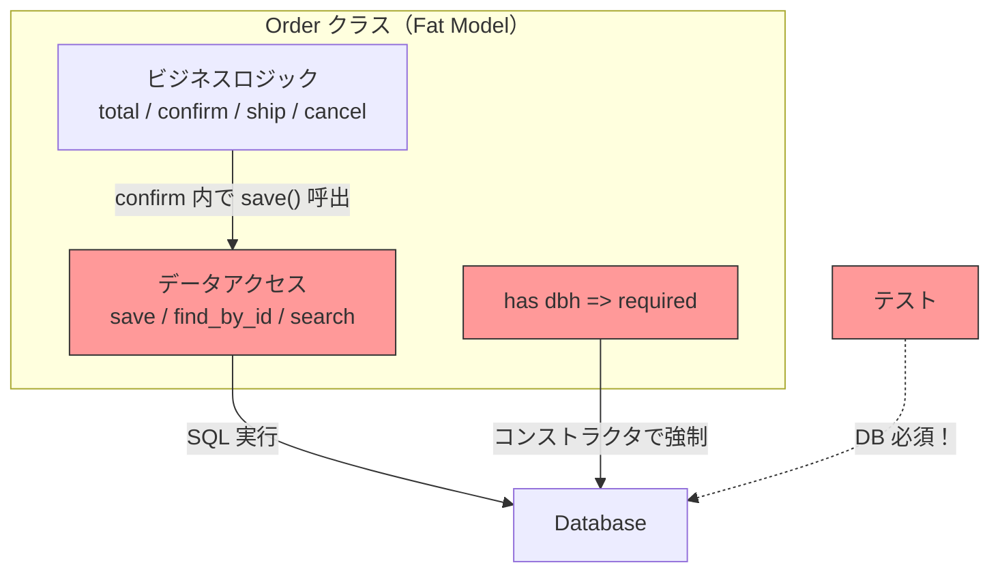
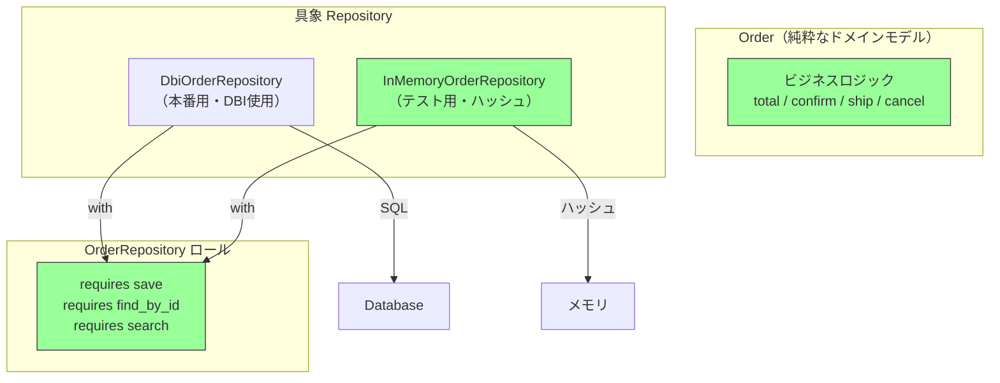

---
categories:
  - tech
date: 2026-04-01T07:07:05+09:00
description: 注文モデルにビジネスロジックとSQL直書きが同居しテスト毎にDB接続必須。30分のテストスイートをRepositoryパターンでデータアクセス層を分離し3秒に激減させるコード探偵の推理。
draft: false
epoch: 1774994825
image: /public_images/2026/code-detective-repository/header.webp
iso8601: 2026-04-01T07:07:05+09:00
tags:
  - design-pattern
  - perl
  - moo
  - repository
  - fat-model
  - refactoring
  - code-detective
title: コード探偵ロックの事件簿【Repository】肥大化した容疑者〜DBに縛られた証言〜
toc: true
---

CIダッシュボードが赤く染まったまま3日が過ぎた。

僕は中原。BtoB SaaS「OrderHub」のバックエンドエンジニアだ。経験6年、30歳。OrderHubは中小企業向けの受発注管理プラットフォームで、月間取引件数は50万件を超えている。CIが赤い間はPRをマージできない。マージできなければ次の機能開発に入れない。チームの3人がそれぞれブランチを抱えたまま手詰まりになっていた。

原因はわかっている。テストスイートが30分かかるのだ。CIのタイムアウトは20分。結果、テストは毎回途中で打ち切られる。

テストが遅い理由もわかっている。注文管理の `Order` クラスを3年前に僕が書いた。最初はシンプルだった。注文の作成、ステータス遷移、合計金額の計算。それだけのクラスだったが、3年間の機能追加でビジネスロジックだけでなく、`save`、`find_by_id`、`search` といったデータベースアクセスのメソッドが同居するようになった。SQLを直接書いて、DBIで実行している。テストのたびにテスト用DBを立ち上げなければならない。ステータスの遷移を確認するだけのテストに、30秒のDB起動を待つ。それが100ケース。30分。

先週、注文ステータスの遷移に新しいルールを追加したところ、既存のテストが5件壊れた。修正しようにもトライ&エラーが1日3回しかできない。僕は3ヶ月間この悪循環を見て見ぬふりをしてきたが、さすがに限界だった。

チームの高木さん——入社12年のシニアエンジニアで、僕が新人のころからコードレビューを見てもらっている人だ——がSlackで「テストの設計に詳しい奴がいるんだが、一度話してみるか？ 変わった男だけど腕は確かだ」と声をかけてきた。

「変わった」が何を意味するのかは聞かなかった。藁にもすがる思いとはこのことだ。

翌日の14時、会議室Bのドアが開いた。現れたのは、ノートPCを小脇に抱え、反対の手にエナジードリンクの缶を持った男だった。挨拶もなければ名刺もない。会議室の椅子に座るなり僕のPCの画面を覗き込み、「注文モデルを見せたまえ」と言った。

「あの、まず自己紹介を——」

「ロックだ。コード探偵をしている。それより君の `Order` クラスは何行ある？」

コード探偵。高木さんの言う「変わった男」というのは控えめな表現だったらしい。モニターの裏に「Locke - Code Detective」と印字されたステッカーが自分のPCに貼ってあるのが見えた。

「中原です。注文モデルのテストが——」

「ああ、わかっている、ワトソン君。テストが30分かかる件だろう」

「中原です」

## 現場検証：二重生活を送る容疑者

ロックさんは僕のPCの前に座った。「画面をこちらに」と言いながら、もう画面をスクロールし始めている。高木さんの紹介でなければ、この時点で会議室を出ていたと思う。

僕は `Order` クラスを開いた。

```perl
package Order {
    use Moo;
    use Carp qw( croak );

    has id       => ( is => 'rw' );
    has customer => ( is => 'ro', required => 1 );
    has items    => ( is => 'ro', required => 1 );  # [{ name, price, qty }]
    has status   => ( is => 'rw', default  => 'draft' );
    has dbh      => ( is => 'ro', required => 1 );   # ← DB接続が必須！

    # --- ビジネスロジック ---
    sub total ($self) {
        my $sum = 0;
        $sum += $_->{price} * $_->{qty} for $self->items->@*;
        return $sum;
    }

    sub confirm ($self) {
        croak "Cannot confirm: status is " . $self->status
            unless $self->status eq 'draft';
        $self->status('confirmed');
        $self->save();  # ← ビジネスロジックの中で直接 DB に書き込む
    }

    sub ship ($self) {
        croak "Cannot ship: status is " . $self->status
            unless $self->status eq 'confirmed';
        $self->status('shipped');
        $self->save();
    }

    sub cancel ($self) {
        croak "Cannot cancel: status is " . $self->status
            unless $self->status eq 'draft' || $self->status eq 'confirmed';
        $self->status('cancelled');
        $self->save();
    }

    # --- データアクセス（SQL直書き）---
    sub save ($self) {
        my $dbh = $self->dbh;
        if ($self->id) {
            $dbh->do(
                "UPDATE orders SET customer=?, status=?, items=? WHERE id=?",
                $self->customer, $self->status, _serialize_items($self->items), $self->id,
            );
        }
        else {
            $dbh->do(
                "INSERT INTO orders (customer, status, items) VALUES (?, ?, ?)",
                $self->customer, $self->status, _serialize_items($self->items),
            );
            $self->id($dbh->last_insert_id(undef, undef, 'orders', 'id'));
        }
    }

    sub find_by_id ($class, $dbh, $id) {
        my $row = $dbh->selectrow_hashref(
            "SELECT * FROM orders WHERE id = ?", undef, $id,
        );
        return undef unless $row;
        return $class->new(
            id => $row->{id}, customer => $row->{customer},
            items => $row->{items}, status => $row->{status}, dbh => $dbh,
        );
    }

    sub search ($class, $dbh, %criteria) {
        my $rows = $dbh->selectall_arrayref(
            "SELECT * FROM orders WHERE status = ?", { Slice => {} },
            $criteria{status} // 'draft',
        );
        return [ map {
            $class->new(
                id => $_->{id}, customer => $_->{customer},
                items => $_->{items}, status => $_->{status}, dbh => $dbh,
            )
        } @$rows ];
    }
}
```

ロックさんは会議室のホワイトボードに歩み寄った。マーカーを手に取り、ボードを縦に二分する線を引く。

「この容疑者は二重生活を送っている」

「容疑者？」

「Order クラスのことだよ、ワトソン君」

ここでロックさんの言う「ワトソン君」が僕のことだと気づく。訂正する気力は残っていなかった。

「左がビジネスロジック。`total`、`confirm`、`ship`、`cancel`。注文の振る舞いを定義する——これは Order の本来の仕事だ」ロックさんは左側に4つのメソッド名を書いた。「右がデータアクセス。`save`、`find_by_id`、`search`。SQLを組み立て、DBに問い合わせる——これは Order の仕事ではない」

「いや、待ってください」僕は口を挟んだ。自分で書いたコードだ。設計判断には理由がある。「`confirm` の中で `$self->save()` を呼んでいるのは、ステータスを変えたら即座にDBに反映したいからです。ステータスの不整合を防ぐためには、遷移と永続化を一体にするのが自然でしょう」

「自然、ね」ロックさんはマーカーで `confirm` と `save` の間に矢印を引いた。「では聞くが、`confirm` をテストしたいとき何が起きる？ `confirm` は `save` を呼ぶ。`save` は `$dbh` を使う。`$dbh` はデータベースの接続先だ。つまり君はステータスが `draft` から `confirmed` に変わるかどうかを確認したいだけなのに、データベースを立ち上げなければテストすら始められない」



「赤い部分を見たまえ。注文の合計金額を計算するだけのテストに、なぜデータベースが要る？ `has dbh => ( required => 1 )` が Order のコンストラクタに埋め込まれているからだ。`total` の計算にデータベースは何一つ関係しないのに、`Order->new` する時点で `$dbh` を渡さなければエラーになる」

僕は反論しようとして、やめた。実際に `total` のテストを書くとき、毎回 `FakeDbh` をでっち上げて `$dbh` に渡している。`total` はDBを一切触らないのに、だ。

「不整合の防止は大事だと思うんですが……」

「不整合の防止と、テスト不能は別の問題だ」ロックさんはマーカーのキャップを閉じた。「今、君のチームは何が起きている？ テストが30分かかるからテストを書かない。テストを書かないからバグが出る。バグが出るからリファクタリングしたい。でもテストがないからリファクタリングが怖い——この悪循環の起点が、この `has dbh => required` だ」

図星だった。3ヶ月間、僕が見て見ぬふりをしてきた悪循環を、この男は5分で言い当てた。

「この容疑者は知りすぎている。自分のビジネスルールだけでなく、自分がどのテーブルに保存されるか、どんなSQLで呼び出されるかまで知っている。Fat Model——肥大化したモデルだ」

## 推理披露：供述を分離せよ（Repository）

ロックさんはホワイトボードを消し、新しい図を描き始めた。

「この容疑者には弁護士を付ける」

「弁護士？」

「データアクセスを専門に扱う外部の存在だ。容疑者の供述——つまりデータの保存と取得は、すべて弁護士を通して行われる。容疑者自身はビジネスルールだけを語ればいい」

比喩が過剰だが、要は「データアクセスを別のクラスに分離しろ」ということだろう。

「まず Order から余計なものを全部外す」

【After】純粋なドメインモデル（DB依存なし）

```perl
package Order {
    use Moo;
    use Carp qw( croak );

    has id       => ( is => 'rw' );
    has customer => ( is => 'ro', required => 1 );
    has items    => ( is => 'ro', required => 1 );
    has status   => ( is => 'rw', default  => 'draft' );
    # dbh は不要！

    sub total ($self) {
        my $sum = 0;
        $sum += $_->{price} * $_->{qty} for $self->items->@*;
        return $sum;
    }

    sub confirm ($self) {
        croak "Cannot confirm: status is " . $self->status
            unless $self->status eq 'draft';
        $self->status('confirmed');
        # save() は呼ばない — 永続化は呼び出し側の責務
    }

    sub ship ($self) {
        croak "Cannot ship: status is " . $self->status
            unless $self->status eq 'confirmed';
        $self->status('shipped');
    }

    sub cancel ($self) {
        croak "Cannot cancel: status is " . $self->status
            unless $self->status eq 'draft' || $self->status eq 'confirmed';
        $self->status('cancelled');
    }
}
```

「`has dbh` が消えた。`confirm` の中の `$self->save()` も消えた。Order は自分のビジネスルールだけを知っている。どこに保存されるかは知らない。知る必要がない」

「ちょっと待ってください」僕は画面を見ながら言った。「`confirm` から `save` を外したら、アプリケーション側で `confirm` と `save` を別々に呼ぶことになりますよね。その間に例外が飛んだらどうなるんですか。ステータスは変わったのにDBには反映されていない——それこそ不整合では？」

「良い質問だ」ロックさんが少し前のめりになった。初めて僕を「使える助手」と認識したような表情だ。「トランザクションを管理するのはサービス層の仕事だ。`$order->confirm; $repo->save($order)` をトランザクションで囲む。Order は状態遷移だけに集中し、永続化の保証は外側が担う。責務がはっきりする」

「でも、保存や検索のコードはどこかに必要ですよね？」

「弁護士——Repository を作る」

【After】Repository ロール（インターフェース）

```perl
package OrderRepository {
    use Moo::Role;

    requires 'save';           # ($order) → $order (id付与済み)
    requires 'find_by_id';     # ($id)    → $order | undef
    requires 'search';         # (%criteria) → [$order, ...]
}
```

「`OrderRepository` ロールが弁護士の資格要件だ。`save`、`find_by_id`、`search`——この3つを実装できなければ、弁護士にはなれない。そして弁護士は2人用意する」

ロックさんはホワイトボードに2つの箱を書いた。

「1人目は本番用。DBI を使って実際のデータベースに問い合わせる」

【After】DbiOrderRepository（本番用）

```perl
package DbiOrderRepository {
    use Moo;
    with 'OrderRepository';

    has dbh => ( is => 'ro', required => 1 );

    sub save ($self, $order) {
        my $dbh = $self->dbh;
        if ($order->id) {
            $dbh->do(
                "UPDATE orders SET customer=?, status=?, items=? WHERE id=?",
                $order->customer, $order->status,
                _serialize($order->items), $order->id,
            );
        }
        else {
            $dbh->do(
                "INSERT INTO orders (customer, status, items) VALUES (?, ?, ?)",
                $order->customer, $order->status,
                _serialize($order->items),
            );
            $order->id($dbh->last_insert_id(undef, undef, 'orders', 'id'));
        }
        return $order;
    }

    sub find_by_id ($self, $id) {
        my $row = $self->dbh->selectrow_hashref(
            "SELECT * FROM orders WHERE id = ?", undef, $id,
        );
        return undef unless $row;
        return Order->new(
            id => $row->{id}, customer => $row->{customer},
            items => $row->{items}, status => $row->{status},
        );
    }

    sub search ($self, %criteria) {
        my $rows = $self->dbh->selectall_arrayref(
            "SELECT * FROM orders WHERE status = ?", { Slice => {} },
            $criteria{status} // 'draft',
        );
        return [ map {
            Order->new(
                id => $_->{id}, customer => $_->{customer},
                items => $_->{items}, status => $_->{status},
            )
        } @$rows ];
    }
}
```

「SQL は `DbiOrderRepository` の中に閉じ込められた。Order は SQL の存在すら知らない」

「それはわかります。でも結局、テストでは `DbiOrderRepository` を使うんですよね？ だとしたらテスト用のDBは依然として必要で——」

「だから2人目の弁護士を立てる」

ロックさんはホワイトボードの2つ目の箱を指した。

「本番用の弁護士はデータベースと話す。テスト用の弁護士はハッシュと話す。同じ資格を持った別人だ」

【After】InMemoryOrderRepository（テスト用）

```perl
package InMemoryOrderRepository {
    use Moo;
    with 'OrderRepository';

    has _store   => ( is => 'ro', default => sub { {} } );
    has _next_id => ( is => 'rw', default => 1 );

    sub save ($self, $order) {
        unless ($order->id) {
            $order->id($self->_next_id);
            $self->_next_id($self->_next_id + 1);
        }
        $self->_store->{$order->id} = {
            id       => $order->id,
            customer => $order->customer,
            items    => [ map { {%$_} } $order->items->@* ],
            status   => $order->status,
        };
        return $order;
    }

    sub find_by_id ($self, $id) {
        my $data = $self->_store->{$id};
        return undef unless $data;
        return Order->new(
            id       => $data->{id},
            customer => $data->{customer},
            items    => [ map { {%$_} } $data->{items}->@* ],
            status   => $data->{status},
        );
    }

    sub search ($self, %criteria) {
        my @results;
        for my $data (values $self->_store->%*) {
            if ($criteria{status}) {
                next unless $data->{status} eq $criteria{status};
            }
            push @results, Order->new(
                id       => $data->{id},
                customer => $data->{customer},
                items    => [ map { {%$_} } $data->{items}->@* ],
                status   => $data->{status},
            );
        }
        return \@results;
    }

    sub count ($self) { scalar keys $self->_store->%* }
}
```

「`InMemoryOrderRepository` はPerlのハッシュだけでデータを保持する。DBは不要。SQL も不要。テストでこれを使えば、データベース接続なしで保存・検索・取得ができる」

僕は少し考えた。Order と Repository が完全に別のクラスになった。Order は自分のビジネスルールだけを知っている。保存先がMySQLなのか、ハッシュなのか、ファイルなのかは知らない。Repository が `with 'OrderRepository'` で同じロールを実装している以上、呼び出し側からは区別がつかない——つまりテストと本番で差し替えるだけだ。

「使い方はこうなりますか」

```perl
# 本番コード
my $repo = DbiOrderRepository->new(dbh => $dbh);
my $order = Order->new(customer => '株式会社X', items => \@items);
$order->confirm();
$repo->save($order);

# テストコード — DB 不要！
my $repo = InMemoryOrderRepository->new;
my $order = Order->new(customer => 'テスト社', items => \@items);
$order->confirm();
$repo->save($order);

my $found = $repo->find_by_id($order->id);
```

「その通り」ロックさんが頷いた。「本番とテストでRepositoryを差し替えるだけだ。Order のコードは1行も変わらない」



「Before では Order の中にビジネスロジックとデータアクセスが一体化していた。After では完全に分離されている。Order は緑——テストにDBが要らない」

「一つ確認させてください」僕はまだ気になっていることがあった。「今のOrderHubには `Order->find_by_id` を直接呼んでいる箇所が40近くあります。それを全部 `$repo->find_by_id` に書き換えるんですよね。移行の工数はどれくらいかかりますか」

「呼び出し側の変更は機械的だ。`Order->find_by_id($dbh, $id)` を `$repo->find_by_id($id)` に置き換えるだけ。パターンが統一されているなら、正規表現の一括置換でほぼ片付く。厄介なのは `$repo` の生成場所を決めることだが、それはアプリケーションの初期化時に1箇所で行えばいい」

実際にやってみないとわからない部分はあるが、40箇所の単純な書き換えと、1箇所のリポジトリ初期化。30分のテストが数秒になる見返りとしては、十分に合う計算だ。

「Repository のインターフェースが増えてきたらどうなりますか。`search` の条件が複雑になって、メソッドが10個も20個もできたら——」

「そのときは Query Object パターンや Specification パターンで検索条件そのものをオブジェクト化する手がある。だがまずは `save`、`find_by_id`、`search` の3メソッドで始めるべきだ。弁護士を増やしすぎると、今度は弁護士団の管理に追われることになる」

## 解決：30分が3秒になった日

ロックさんがテストを実行した。ターミナルの出力を僕も横から見た。

```bash
$ prove -v t/repository.t
# Subtest: Before: Fat Model
    ok 1 - Total: 1000*5 + 2000*3 = 11000
    ok 2 - Status changed to confirmed
    ok 3 - save() was called inside confirm() — id assigned
    ok 4 - Cannot create Order without dbh — Fat Model problem
    ok 5 - find_by_id requires $dbh as argument
    ok 6 - Found order has correct status
    ok 7 - search requires $dbh as argument
    ok 8 - PROBLEM: Every test needs a DB handle, even for pure business logic
ok 1 - Before: Fat Model
# Subtest: After: Repository Pattern — Pure Business Logic (no DB)
    ok 1 - Total: 1000*5 + 2000*3 = 11000 (no DB needed)
    ok 2 - confirm() changes status without DB
    ok 3 - confirm() does NOT call save() — no side effects
    ok 4 - ship() changes status without DB
    ok 5 - Cannot cancel a shipped order
    ok 6 - confirmed order can be cancelled
    ok 7 - FIX: All business logic tests run WITHOUT any DB handle
ok 2 - After: Repository Pattern — Pure Business Logic (no DB)
# Subtest: After: Repository Pattern — InMemoryRepository
    ok 1 - save() assigns id via Repository
    ok 2 - Repository has 1 order
    ok 3 - find_by_id returns correct order
    ok 4 - Found order has correct status
    ok 5 - Status updated after save
    ok 6 - Repository has 2 orders
    ok 7 - search(status => draft) returns 1 order
    ok 8 - Draft order is テスト社
    ok 9 - search(status => confirmed) returns 1 order
    ok 10 - Confirmed order is 株式会社タクミ
ok 3 - After: Repository Pattern — InMemoryRepository
# Subtest: After: Repository Pattern — DbiOrderRepository (same interface)
    ok 1 - DbiOrderRepository assigns id
    ok 2 - DbiOrderRepository find_by_id works
    ok 3 - InMemoryOrderRepository implements OrderRepository role
    ok 4 - DbiOrderRepository implements OrderRepository role
    ok 5 - Both repositories share the same interface — swappable
ok 4 - After: Repository Pattern — DbiOrderRepository (same interface)
# Subtest: After: Repository Pattern — Testability comparison
    ok 1 - Business logic test: no setup required
    ok 2 - State transition test: no setup required
    ok 3 - FIX: Business logic tests need ZERO infrastructure
    ok 4 - FIX: Test suite runs in seconds, not 30 minutes
ok 5 - After: Repository Pattern — Testability comparison
All tests successful.
```

Before のテスト4——`dbh` なしでは Order を生成すらできない。After のテスト1〜3——DB なしでビジネスロジックが完全にテストできる。テスト3をもう一度見た。`confirm()` は `save()` を呼ばない。副作用がゼロだ。

テスト3と4——`InMemoryOrderRepository` と `DbiOrderRepository` は同じロールを実装している。インターフェースが同じだから、差し替えるだけで本番とテストを切り替えられる。

「30分が——」声が出た。

「3秒だ」

ロックさんはPCの画面を閉じ、エナジードリンクの缶を持って立ち上がった。

「一つだけ」背中越しに言った。「Repository に `confirm_and_save` というメソッドを生やしたくなったら、それは弁護士にビジネスの判断をさせているということだ。弁護士の仕事は書類の保管と返却だけでいい」

それだけ言うと、会議室を出ていった。

僕はしばらく `All tests successful.` の画面を眺めていた。3年前、まだOrderHubが小さかったころ、`Order` に `save` を書いたのは僕だ。それが間違いだったとは思わない。あのときはあれで回っていた。でも3年間の機能追加で、Order は自分のビジネスルールだけでなく、どのテーブルに住んでいるか、どんなSQLで呼ばれるかまで知ることになった。知りすぎた容疑者は黙秘する——確かにそうだ。DBがなければテストに応じないモデルは、黙秘しているのと同じだった。

チームのSlackを開いた。

「テストスイートの高速化、目処が立ちました。来週のスプリントで `Order` のリファクタリングに着手します。方針：ビジネスロジックとデータアクセスの分離。詳細は明日のスタンドアップで共有します」

送信ボタンを押してから、もう一つ書き足した。

「高木さん、紹介ありがとうございました。確かに変わった人でしたが、腕は確かでした」

---

## 探偵の調査報告書

| 容疑（アンチパターン） | 真実（パターン） | 証拠（効果） |
| :--- | :--- | :--- |
| Fat Model（ファットモデル）。Order クラスにビジネスロジック（ステータス遷移・合計計算）とデータアクセス（SQL直書き・DBI操作）が混在。コンストラクタに `$dbh` が必須となり、ビジネスロジックのテストにもDB接続が必要。テストスイートが30分かかり、CIがタイムアウトで破綻。 | Repository パターン。データアクセスを `OrderRepository` ロールとして分離し、本番用（`DbiOrderRepository`）とテスト用（`InMemoryOrderRepository`）を差し替え可能にする。Order は純粋なドメインモデルとなり、DB依存なしでテスト可能に。 | Order クラスから `dbh`・`save`・`find_by_id`・`search` を除去。ビジネスロジックのテストにDB接続が不要に。テスト実行時間が30分→数秒に短縮。`InMemoryOrderRepository` と `DbiOrderRepository` が同一のロールを実装し、差し替え可能。 |

### 推理のステップ

1. ビジネスロジックとデータアクセスを特定する: モデルクラスのメソッドを「ドメインの振る舞い（total, confirm, ship）」と「永続化操作（save, find_by_id, search）」に分類する。両者が混在しているのが Fat Model のにおい
2. Repository ロールを定義する: `save`、`find_by_id`、`search` の3メソッドを `requires` で宣言した `OrderRepository` ロールを作る。これがデータアクセスの契約書となる
3. モデルからデータアクセスを除去する: `has dbh` を削除し、`confirm` 内の `$self->save()` 呼び出しを除去する。永続化は呼び出し側（サービス層）の責務にする
4. 具象 Repository を2つ実装する: `DbiOrderRepository`（本番用・DBI経由）と `InMemoryOrderRepository`（テスト用・ハッシュ保持）。同じロールを実装しているため、差し替えるだけで本番とテストを切り替えられる

### ロックより

知りすぎたモデルは黙秘する。「DBがなければ何も話さない」——これが Fat Model の正体だ。

Repository パターンの本質は「知識の分離」にある。Order は自分のビジネスルールだけを知っていればいい。どこに保存されるか、どんなSQLで呼ばれるかは、Repository の仕事だ。Repository を差し替えれば、テストはDBなしで数秒で終わる。

ただし、Repository にビジネスロジックを混ぜてはいけない。`confirm_and_save` のようなメソッドを生やし始めたら、それは Fat Model の亡霊が Repository に取り憑いたということだ。Repository の仕事は `save`、`find_by_id`、`search`——保管と返却だけ。それ以上のことを知る必要はない。
