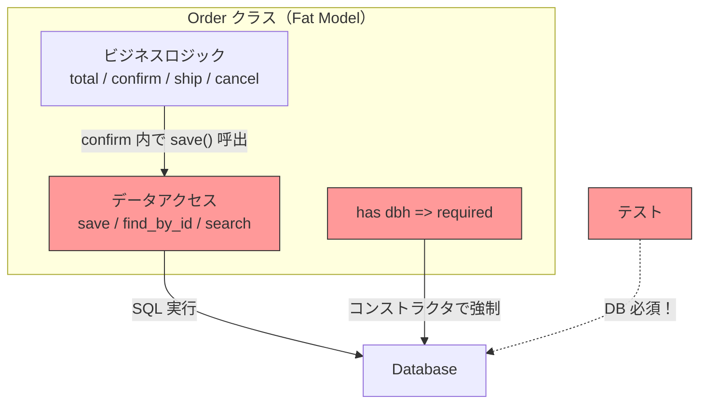
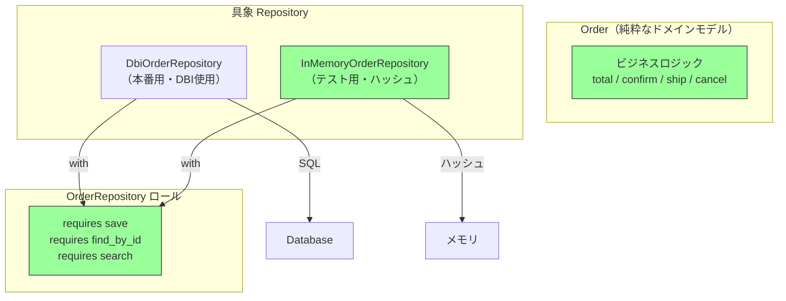

---
categories:
  - tech
date: 2026-04-01T07:07:05+09:00
description: 受発注SaaSの注文モデルにビジネスロジックとSQL直書きが同居し、テストに毎回DB接続が必須。テストスイート30分、CIタイムアウトの悪循環を「Repositoryパターン」でデータアクセス層を分離し、テスト3秒に激減させるコード探偵ロックの推理。
draft: true
epoch: 1774994825
image: /public_images/2026/code-detective-repository/header.webp
iso8601: 2026-04-01T07:07:05+09:00
tags:
  - design-pattern
  - perl
  - moo
  - repository
  - fat-model
  - refactoring
  - code-detective
title: コード探偵ロックの事件簿【Repository】肥大化した容疑者の腹の中〜データベースに縛られた証言〜
toc: true
---

「テストスイートが30分かかります。CIがタイムアウトで落ちて、PRが3日マージできていません」

僕は中原。BtoB SaaS「OrderHub」のバックエンドエンジニアだ。経験6年、30歳。OrderHubは中小企業向けの受発注管理プラットフォームで、月間取引件数は50万件を超えている。

OrderHubの初期開発メンバーとして、僕は注文管理の `Order` クラスを自分で書いた。最初はシンプルだった。注文の作成、ステータス遷移、合計金額の計算。それだけのクラスだった。

だが3年間の機能追加で、`Order` クラスは膨れ上がった。ビジネスロジックだけでなく、`save`、`find_by_id`、`search` といったデータベースアクセスのメソッドが同居するようになった。SQLを直接書いて、DBIで実行している。

問題はテストだ。`Order` クラスをインスタンス化するには、コンストラクタに `$dbh`（データベース接続ハンドル）を渡す必要がある。注文ステータスの遷移ロジックをテストしたいだけなのに、テスト用のDBを毎回立ち上げなければならない。テストスイートは30分。CIのタイムアウトは20分。結果、CIは毎回赤く染まり、PRはマージできず、チームの士気は下がる一方だった。

「テストが遅いから書かない。書かないからバグが出る。バグが出るからリファクタリングが必要。でもテストがないからリファクタリングできない」——この悪循環を、僕は3ヶ月間、ずっと見て見ぬふりをしていた。

限界が来たのは先週だ。注文ステータスの遷移に新しいルールを追加したところ、既存のテストが5件壊れた。修正しようにもテストの実行に30分かかるから、トライ&エラーが1日3回しかできない。

僕は観念して、雑居ビルの階段を上がった。

「レガシー・コード・インベスティゲーション（LCI）」

看板の下に「※コードの悩み、伺います」と手書きで追記されていたが、「コ」の字がかすれて「ードの悩み」になっていた。何の悩みだか分からない。

ドアを開けると、デスクトップPCの排熱がこもった蒸し暑い空気が顔を包んだ。デスクの上にはレッドブルとモンスターエナジーの空き缶が混在しており、その合間にPerlの技術書が数冊、付箋だらけで積まれている。革張りの椅子に座った男は、モニターに映るテスト結果のログを眺めていた。`All tests successful.` の文字が緑色に光っている。他人のテストは通るらしい。

「——初歩的なにおいだよ、ワトソン君。テストが30分かかるのは、テストが悪いのではない。**テスト対象が太りすぎている**」

会って一秒で見知らぬ名前を呼ばれた。

「中原です。注文モデルの `Order` クラスが——」

「知りすぎた容疑者だね」ロックと名乗る男——正確には名乗っておらず、モニターの横に「Locke - Code Detective」と印字されたステッカーが貼ってあるだけだ——は、エナジードリンクの缶を持ち上げた。「モデルが自分のビジネスルールだけでなく、どのテーブルに住んでいるか、どんなSQLで呼ばれるかまで知っている。**知りすぎた容疑者は、口が重くなるものだ**」

何の比喩か一瞬分からなかったが、要は「責務が多すぎてテストしにくい」ということだろう。

「まず現場を見せたまえ」

## 現場検証：肥大化した容疑者の取り調べ

ロックは僕のノートPCを引き寄せた。「ワトソン君、画面をこちらに」と言いながら、もう画面をスクロールし始めている。この男に所有権の概念がないことは、ドアを開けた瞬間に察していた。

「注文モデルを見せてくれたまえ」

僕は `Order` クラスを開いた。

```perl
package Order {
    use Moo;
    use Carp qw( croak );

    has id       => ( is => 'rw' );
    has customer => ( is => 'ro', required => 1 );
    has items    => ( is => 'ro', required => 1 );  # [{ name, price, qty }]
    has status   => ( is => 'rw', default  => 'draft' );
    has dbh      => ( is => 'ro', required => 1 );   # ← DB接続が必須！

    # --- ビジネスロジック ---
    sub total ($self) {
        my $sum = 0;
        $sum += $_->{price} * $_->{qty} for $self->items->@*;
        return $sum;
    }

    sub confirm ($self) {
        croak "Cannot confirm: status is " . $self->status
            unless $self->status eq 'draft';
        $self->status('confirmed');
        $self->save();  # ← ビジネスロジックの中で直接 DB に書き込む
    }

    sub ship ($self) {
        croak "Cannot ship: status is " . $self->status
            unless $self->status eq 'confirmed';
        $self->status('shipped');
        $self->save();
    }

    sub cancel ($self) {
        croak "Cannot cancel: status is " . $self->status
            unless $self->status eq 'draft' || $self->status eq 'confirmed';
        $self->status('cancelled');
        $self->save();
    }

    # --- データアクセス（SQL直書き）---
    sub save ($self) {
        my $dbh = $self->dbh;
        if ($self->id) {
            $dbh->do(
                "UPDATE orders SET customer=?, status=?, items=? WHERE id=?",
                $self->customer, $self->status, _serialize_items($self->items), $self->id,
            );
        }
        else {
            $dbh->do(
                "INSERT INTO orders (customer, status, items) VALUES (?, ?, ?)",
                $self->customer, $self->status, _serialize_items($self->items),
            );
            $self->id($dbh->last_insert_id(undef, undef, 'orders', 'id'));
        }
    }

    sub find_by_id ($class, $dbh, $id) {
        my $row = $dbh->selectrow_hashref(
            "SELECT * FROM orders WHERE id = ?", undef, $id,
        );
        return undef unless $row;
        return $class->new(
            id => $row->{id}, customer => $row->{customer},
            items => $row->{items}, status => $row->{status}, dbh => $dbh,
        );
    }

    sub search ($class, $dbh, %criteria) {
        my $rows = $dbh->selectall_arrayref(
            "SELECT * FROM orders WHERE status = ?", { Slice => {} },
            $criteria{status} // 'draft',
        );
        return [ map {
            $class->new(
                id => $_->{id}, customer => $_->{customer},
                items => $_->{items}, status => $_->{status}, dbh => $dbh,
            )
        } @$rows ];
    }
}
```

ロックは椅子から立ち上がり、ホワイトボードの前に歩み出た。マーカーのキャップをカチッと外す音が妙に大きく響く。事件現場の鑑識官が証拠品に手袋をはめるような仕草だが、やっていることはコードの責務分析だ。

「このクラスには**二つの人格**が同居している」

ロックはホワイトボードを縦に二分した。

「左が**ビジネスロジック**。`total`、`confirm`、`ship`、`cancel`。注文の振る舞いを定義する——これは Order の本来の仕事だ。右が**データアクセス**。`save`、`find_by_id`、`search`。SQLを組み立て、DBに問い合わせる——これは Order の仕事ではない」

「でも、`confirm` の中で `$self->save()` を呼んでいます。ステータスを変えたら即座にDBに反映したくて——」

「**それが問題だ**」ロックはマーカーで `confirm` と `save` の間に矢印を引いた。「ビジネスロジックがデータアクセスを直接呼んでいる。つまり `confirm` をテストするには `save` が動く必要があり、`save` が動くには `$dbh` が必要だ。`$dbh` が必要ということはDBが必要だ」



「赤い部分が全部、テストの足枷になっている。**注文の合計金額を計算するだけのテストに、なぜデータベースが要るのか**。答えは簡単だ——`has dbh => ( required => 1 )` がすべてを縛っている」

「確かに、`total` のテストを書くだけでも `FakeDbh` を用意して `$dbh` に渡さないと `Order->new` がエラーになる……」

「**容疑者が太りすぎている**。自分のビジネスルールだけでなく、自分がどこに保存されるかまで知っている。これが**Fat Model（ファットモデル）**——今回の犯人だよ、ワトソン君」

言われてみれば、3年前にこのクラスを書いた犯人は僕自身なのだが、指摘されると確かにひどい設計だ。「モデルにsaveがあるのは普通だろう」と思っていたが、その「普通」がテスト不能の元凶だった。

## 推理披露：データの番人を分離せよ（Repository）

ロックはエナジードリンクの新しい缶を開けた。プシュッという音が推理ショーの開演ベルのように室内に響く。本人は「さて、容疑者のダイエットに取り掛かろう」と言ったが、これからやることはリファクタリングである。

「解決策は**データの番人を分離する**ことだ。Order は自分のビジネスルールだけを知っていればいい。どこに保存されるか、どんなSQLで取り出されるかは、**別の番人**に任せる」

**【After】純粋なドメインモデル（DB依存なし）**

```perl
package Order {
    use Moo;
    use Carp qw( croak );

    has id       => ( is => 'rw' );
    has customer => ( is => 'ro', required => 1 );
    has items    => ( is => 'ro', required => 1 );
    has status   => ( is => 'rw', default  => 'draft' );
    # dbh は不要！

    sub total ($self) {
        my $sum = 0;
        $sum += $_->{price} * $_->{qty} for $self->items->@*;
        return $sum;
    }

    sub confirm ($self) {
        croak "Cannot confirm: status is " . $self->status
            unless $self->status eq 'draft';
        $self->status('confirmed');
        # save() は呼ばない — 永続化は呼び出し側の責務
    }

    sub ship ($self) {
        croak "Cannot ship: status is " . $self->status
            unless $self->status eq 'confirmed';
        $self->status('shipped');
    }

    sub cancel ($self) {
        croak "Cannot cancel: status is " . $self->status
            unless $self->status eq 'draft' || $self->status eq 'confirmed';
        $self->status('cancelled');
    }
}
```

「`has dbh` が消えた。`confirm` の中の `$self->save()` も消えた。Order は**自分のビジネスルールだけを知っている**。どこに保存されるかは知らない。知る必要がない」

「でも、保存や検索はどこかがやらないと——」

「そのために**番人**を作る。Repository だ」

**【After】Repository ロール（インターフェース）**

```perl
package OrderRepository {
    use Moo::Role;

    requires 'save';           # ($order) → $order (id付与済み)
    requires 'find_by_id';     # ($id)    → $order | undef
    requires 'search';         # (%criteria) → [$order, ...]
}
```

「`OrderRepository` ロールが**番人の契約書**だ。`save`、`find_by_id`、`search`——この3つを実装しなければ、番人にはなれない。そして番人は2人用意する」

ロックはホワイトボードに2つの箱を書いた。

「1人目は**本番用の番人**。DBI を使って実際のデータベースに問い合わせる」

**【After】DbiOrderRepository（本番用）**

```perl
package DbiOrderRepository {
    use Moo;
    with 'OrderRepository';

    has dbh => ( is => 'ro', required => 1 );

    sub save ($self, $order) {
        my $dbh = $self->dbh;
        if ($order->id) {
            $dbh->do(
                "UPDATE orders SET customer=?, status=?, items=? WHERE id=?",
                $order->customer, $order->status,
                _serialize($order->items), $order->id,
            );
        }
        else {
            $dbh->do(
                "INSERT INTO orders (customer, status, items) VALUES (?, ?, ?)",
                $order->customer, $order->status,
                _serialize($order->items),
            );
            $order->id($dbh->last_insert_id(undef, undef, 'orders', 'id'));
        }
        return $order;
    }

    sub find_by_id ($self, $id) {
        my $row = $self->dbh->selectrow_hashref(
            "SELECT * FROM orders WHERE id = ?", undef, $id,
        );
        return undef unless $row;
        return Order->new(
            id => $row->{id}, customer => $row->{customer},
            items => $row->{items}, status => $row->{status},
        );
    }

    sub search ($self, %criteria) {
        my $rows = $self->dbh->selectall_arrayref(
            "SELECT * FROM orders WHERE status = ?", { Slice => {} },
            $criteria{status} // 'draft',
        );
        return [ map {
            Order->new(
                id => $_->{id}, customer => $_->{customer},
                items => $_->{items}, status => $_->{status},
            )
        } @$rows ];
    }
}
```

「SQL は `DbiOrderRepository` の中に閉じ込められた。Order は SQL の存在すら知らない」

「なるほど……でも、テスト用にもDB接続が要りますよね？ `DbiOrderRepository` をテストで使う限り」

「だから**2人目の番人**を作る。これが核心だよ、ワトソン君」

ロックの表情が変わった。推理の最も重要な場面で見せる、あの芝居がかった表情だ。やっていることはインメモリ実装の解説なのだが。

**【After】InMemoryOrderRepository（テスト用）**

```perl
package InMemoryOrderRepository {
    use Moo;
    with 'OrderRepository';

    has _store   => ( is => 'ro', default => sub { {} } );
    has _next_id => ( is => 'rw', default => 1 );

    sub save ($self, $order) {
        unless ($order->id) {
            $order->id($self->_next_id);
            $self->_next_id($self->_next_id + 1);
        }
        $self->_store->{$order->id} = {
            id       => $order->id,
            customer => $order->customer,
            items    => [ map { {%$_} } $order->items->@* ],
            status   => $order->status,
        };
        return $order;
    }

    sub find_by_id ($self, $id) {
        my $data = $self->_store->{$id};
        return undef unless $data;
        return Order->new(
            id       => $data->{id},
            customer => $data->{customer},
            items    => [ map { {%$_} } $data->{items}->@* ],
            status   => $data->{status},
        );
    }

    sub search ($self, %criteria) {
        my @results;
        for my $data (values $self->_store->%*) {
            if ($criteria{status}) {
                next unless $data->{status} eq $criteria{status};
            }
            push @results, Order->new(
                id       => $data->{id},
                customer => $data->{customer},
                items    => [ map { {%$_} } $data->{items}->@* ],
                status   => $data->{status},
            );
        }
        return \@results;
    }

    sub count ($self) { scalar keys $self->_store->%* }
}
```

「`InMemoryOrderRepository` は**ハッシュだけ**でデータを保持する。DBは不要。SQL も不要。テストでこの番人を使えば、データベース接続なしで保存・検索・取得ができる」

「DB なしで Repository が動く……！」

「しかも `with 'OrderRepository'` で同じロールを実装しているから、**インターフェースは完全に同じ**だ。本番は `DbiOrderRepository`、テストは `InMemoryOrderRepository`。Order クラスはどちらの番人がいるかを知らない」



「Before では Order の中にビジネスロジックとデータアクセスが一体化していた。After では完全に分離されている。Order は緑——**テストにDBが要らない**」

「使い方はこうなりますか？」僕は確認した。

```perl
# 本番コード
my $repo = DbiOrderRepository->new(dbh => $dbh);
my $order = Order->new(customer => '株式会社X', items => \@items);
$order->confirm();
$repo->save($order);

# テストコード — DB 不要！
my $repo = InMemoryOrderRepository->new;
my $order = Order->new(customer => 'テスト社', items => \@items);
$order->confirm();
$repo->save($order);

my $found = $repo->find_by_id($order->id);
```

「その通り。本番とテストで**Repositoryを差し替えるだけ**だ。Order のコードは1行も変わらない」

## 解決：30分が3秒に

ロックがテストを実行した。腕を組んでターミナルの出力を見つめるその姿は——事件の判決を待つ名探偵のつもりなのだろう。Perlのテストハーネスに判決はないが、`All tests successful.` の文字が出たとき、僕は正直に感動した。

```bash
$ prove -v t/repository.t
# Subtest: Before: Fat Model
    ok 1 - Total: 1000*5 + 2000*3 = 11000
    ok 2 - Status changed to confirmed
    ok 3 - save() was called inside confirm() — id assigned
    ok 4 - Cannot create Order without dbh — Fat Model problem
    ok 5 - find_by_id requires $dbh as argument
    ok 6 - Found order has correct status
    ok 7 - search requires $dbh as argument
    ok 8 - PROBLEM: Every test needs a DB handle, even for pure business logic
ok 1 - Before: Fat Model
# Subtest: After: Repository Pattern — Pure Business Logic (no DB)
    ok 1 - Total: 1000*5 + 2000*3 = 11000 (no DB needed)
    ok 2 - confirm() changes status without DB
    ok 3 - confirm() does NOT call save() — no side effects
    ok 4 - ship() changes status without DB
    ok 5 - Cannot cancel a shipped order
    ok 6 - confirmed order can be cancelled
    ok 7 - FIX: All business logic tests run WITHOUT any DB handle
ok 2 - After: Repository Pattern — Pure Business Logic (no DB)
# Subtest: After: Repository Pattern — InMemoryRepository
    ok 1 - save() assigns id via Repository
    ok 2 - Repository has 1 order
    ok 3 - find_by_id returns correct order
    ok 4 - Found order has correct status
    ok 5 - Status updated after save
    ok 6 - Repository has 2 orders
    ok 7 - search(status => draft) returns 1 order
    ok 8 - Draft order is テスト社
    ok 9 - search(status => confirmed) returns 1 order
    ok 10 - Confirmed order is 株式会社タクミ
ok 3 - After: Repository Pattern — InMemoryRepository
# Subtest: After: Repository Pattern — DbiOrderRepository (same interface)
    ok 1 - DbiOrderRepository assigns id
    ok 2 - DbiOrderRepository find_by_id works
    ok 3 - InMemoryOrderRepository implements OrderRepository role
    ok 4 - DbiOrderRepository implements OrderRepository role
    ok 5 - Both repositories share the same interface — swappable
ok 4 - After: Repository Pattern — DbiOrderRepository (same interface)
# Subtest: After: Repository Pattern — Testability comparison
    ok 1 - Business logic test: no setup required
    ok 2 - State transition test: no setup required
    ok 3 - FIX: Business logic tests need ZERO infrastructure
    ok 4 - FIX: Test suite runs in seconds, not 30 minutes
ok 5 - After: Repository Pattern — Testability comparison
All tests successful.
```

「Before のテスト4を見たまえ——`dbh` なしでは Order を生成すらできない。After のテスト1〜3——**DB なしでビジネスロジックが完全にテストできる**。テスト3に注目、`confirm()` は `save()` を呼ばない。副作用がゼロだ」

「テスト7——ビジネスロジックのテストに DB ハンドルが一切不要……」

「そしてテスト3と4——`InMemoryOrderRepository` と `DbiOrderRepository` は**同じロールを実装している**。インターフェースが同じだから、差し替えるだけで本番とテストを切り替えられる」

「30分が——」

「**3秒**だ。ビジネスロジックのテストにDBは要らない。`InMemoryOrderRepository` でステータス遷移も保存も検索も検証できる。CIのタイムアウトとはおさらばだ」

僕はPCを閉じかけたが、ロックが手を上げた。

「報酬は——そうだな。その OrderHub のノベルティグッズにメカニカルキーボードはないかね？ 展示会で配るようなやつだ。Cherry MX 茶軸であればなお良い」

「……ノベルティはボールペンとトートバッグしかないです」

「残念だ。ではその Perl の技術書——デスクの上に『Programming Perl』第4版が見えるが、あれはまだ入手可能かね？ 探偵の書棚に第4版がないのは、推理小説の書棚にホームズ全集がないのと同じでね」

自分の本棚に何があるかは自分で管理してほしいと思ったが、キーボード1台で30分のテストが3秒になるなら安いものだ。

ロックは人差し指を立てた。

「最後に一つ。Repository は**データアクセスの抽象化**であって、ビジネスロジックの置き場所ではない。Repository に `confirm_and_save` のようなメソッドを生やし始めたら、それは**番人が太り始めた**サインだ。すべての不吉な `$self->save()` を排除して残ったものが、いかにシンプルであっても、それが真実なんだ」

「Repository のインターフェースが肥大化したら？」

「複雑なクエリが増えてきたら、Query Object パターンや Specification パターンで検索条件をオブジェクト化する手もある。だが**まずは `save`、`find_by_id`、`search` の3メソッドで始める**べきだ。シンプルな番人こそが最良の番人だ。番人を太らせるな——Fat Model の二の舞になるぞ」

僕はLCIを出て、チームのSlackに書いた。「テストスイートの高速化、目処が立ちました。来週のスプリントで `Order` のリファクタリングに着手します」——『Programming Perl』第4版の件は、まず自分の本棚を確認してからにしようと思った。

---

## 探偵の調査報告書

| 容疑（アンチパターン） | 真実（パターン） | 証拠（効果） |
| :--- | :--- | :--- |
| Fat Model（ファットモデル）。Order クラスにビジネスロジック（ステータス遷移・合計計算）とデータアクセス（SQL直書き・DBI操作）が混在。コンストラクタに `$dbh` が必須となり、ビジネスロジックのテストにもDB接続が必要。テストスイートが30分かかり、CIがタイムアウトで破綻。 | Repository パターン。データアクセスを `OrderRepository` ロールとして分離し、本番用（`DbiOrderRepository`）とテスト用（`InMemoryOrderRepository`）を差し替え可能にする。Order は純粋なドメインモデルとなり、DB依存なしでテスト可能に。 | Order クラスから `dbh`・`save`・`find_by_id`・`search` を除去。ビジネスロジックのテストにDB接続が不要に。テスト実行時間が30分→数秒に短縮。`InMemoryOrderRepository` と `DbiOrderRepository` が同一のロールを実装し、差し替え可能。 |

### 推理のステップ

1. **ビジネスロジックとデータアクセスを特定する**: モデルクラスのメソッドを「ドメインの振る舞い（total, confirm, ship）」と「永続化操作（save, find_by_id, search）」に分類する。両者が混在しているのが Fat Model のにおい。
2. **Repository ロールを定義する**: `save`、`find_by_id`、`search` の3メソッドを `requires` で宣言した `OrderRepository` ロールを作る。これがデータアクセスの契約書となる。
3. **モデルからデータアクセスを除去する**: `has dbh` を削除し、`confirm` 内の `$self->save()` 呼び出しを除去する。永続化は呼び出し側（サービス層）の責務にする。
4. **具象 Repository を2つ実装する**: `DbiOrderRepository`（本番用・DBI経由）と `InMemoryOrderRepository`（テスト用・ハッシュ保持）。同じロールを実装しているため、差し替えるだけで本番とテストを切り替えられる。

### ロックより

ワトソン君。モデルが太りすぎていると、取り調べ——つまりテスト——が困難になる。容疑者が「DBがなければ何も話さない」と黙秘するようなものだ。

Repository パターンの本質は「知識の分離」だ。Order は自分のビジネスルールだけを知っていればいい。どこに保存されるか、どんなSQLで呼ばれるかは、番人の仕事だ。そして番人を差し替えれば、テストはDBなしで数秒で終わる。30分の苦行から解放されるのだ。

ただし、番人を太らせてはいけない。`confirm_and_save` のようなビジネスロジック混じりのメソッドを Repository に生やし始めたら、それは Fat Model の転生だ。番人の仕事は `save`、`find_by_id`、`search`——**保管と返却だけ**。それ以上のことをさせるな。シンプルな番人こそが、最良の番人なのだから。
