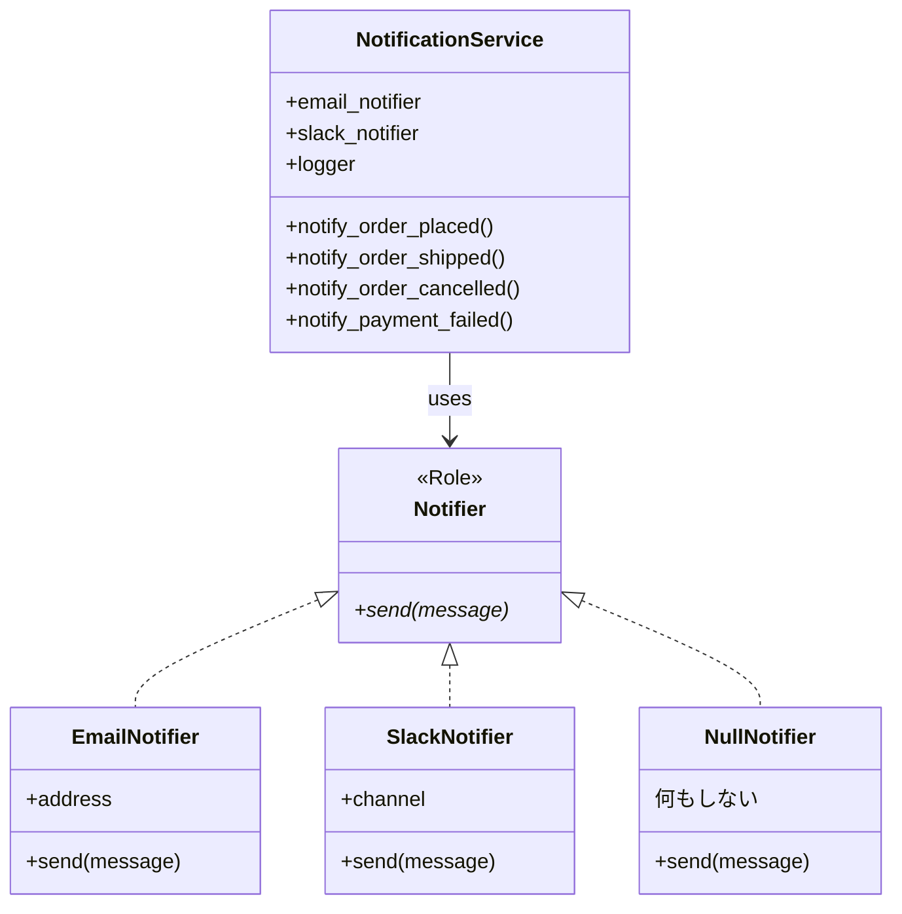

---
categories:
  - tech
date: 2026-04-02T07:07:05+09:00
description: 通知システム全メソッドに散らばる12箇所のdefinedチェック。1箇所の漏れで本番障害が発生した防衛的プログラミングの呪いをNull Objectパターンで根絶するコード探偵ロックの推理。
draft: false
epoch: 1775081225
image: /public_images/2026/code-detective-null-object/header.webp
iso8601: 2026-04-02T07:07:05+09:00
tags:
  - design-pattern
  - perl
  - moo
  - null-object
  - defensive-programming
  - refactoring
  - code-detective
title: コード探偵ロックの事件簿【Null Object】幽霊の正体〜undefの亡霊が棲む防衛線〜
toc: true
---

「通知チャネルを1つ追加するたびに、`if (defined ...)` を30箇所以上に書かなきゃいけないんです。先週、1箇所だけ書き忘れて本番障害が起きました」

僕は小野寺。社内システム部で通知基盤を担当している中堅エンジニアだ。30歳。入社7年目。

社内の受発注システムには、注文が入ったとき・発送されたとき・キャンセルされたとき・決済失敗したとき——と、4つのイベントで通知を飛ばす仕組みがある。通知先はメール、Slack、ログの3種類だが、ユーザーの設定によって「メールだけ」「Slackだけ」「通知なし」と異なる。

問題は「通知なし」のユーザーだ。全体の7割を占める。通知先が未設定のユーザーは、notifier が `undef` になる。だからコードのあらゆる場所に `if (defined $self->email_notifier)` というガードを入れている。4つのメソッド × 3つの通知先 = 12箇所。同じ防衛パターンの繰り返しだ。

先週の本番障害は、決済失敗の通知メソッドで Slack の `defined` チェックを1箇所だけ書き忘れたことが原因だった。`Can't call method "send" on an undefined value`——このエラーメッセージが深夜3時のPagerDutyアラートになって鳴り響いたとき、僕は自分の注意力では限界だと悟った。

雑居ビルの階段を上がると、くすんだガラスの向こうに看板が見えた。

「レガシー・コード・インベスティゲーション（LCI）」

ドアを開けた瞬間、デスクトップPCの排熱で蒸された空気と、モンスターエナジーの甘ったるい残り香が鼻を突いた。デスクの上にはエナジードリンクの空き缶がピラミッド状に積まれており、その頂点にRealforceのキーキャップが1個だけ載せてある。何の儀式だろう。

革張りの椅子に座った男——モニターの横に「Locke - Code Detective」というステッカーが貼ってある——は、僕の顔を一瞥して言った。

「——ほう。幽霊に怯えているね、ワトソン君」

「小野寺です。幽霊じゃなくて `undef` なんですが——」

「同じことだよ」ロックと呼ばれているらしいこの男は、エナジードリンクの缶をくるりと回した。「`undef` は幽霊だ。存在しないのに、おまえたちの行動を支配している。12箇所の防衛線——いや、12回の *お祓い* だね。毎回同じ呪文を唱えて、幽霊が出ないことを祈っている」

お祓いと言われると確かにそんな気がしてくる。

「現場を見せたまえ」

## 現場検証：12箇所の防衛線

ロックは僕のノートPCを引き寄せると、許可を求めずにスクロールを始めた。この男に礼儀作法を期待してはいけないことは、積み上げられたエナジードリンクの缶を見た時点で察していた。

「通知サービスのコードを見せてくれたまえ」

僕は `NotificationService` を開いた。

```perl
package NotificationService {
    use Moo;

    # すべてオプショナル — undef の可能性がある
    has email_notifier => ( is => 'ro' );
    has slack_notifier => ( is => 'ro' );
    has logger         => ( is => 'ro' );

    sub notify_order_placed ($self, $order_id, $customer) {
        my $msg = "注文 #${order_id} が ${customer} から入りました";

        # ↓ 毎回同じ防衛パターンの繰り返し！
        if (defined $self->email_notifier) {
            $self->email_notifier->send($msg);
        }
        if (defined $self->slack_notifier) {
            $self->slack_notifier->send($msg);
        }
        if (defined $self->logger) {
            $self->logger->log('info', $msg);
        }
    }

    sub notify_order_shipped ($self, $order_id) {
        my $msg = "注文 #${order_id} が発送されました";

        # ↓ また同じ defined チェック！
        if (defined $self->email_notifier) {
            $self->email_notifier->send($msg);
        }
        if (defined $self->slack_notifier) {
            $self->slack_notifier->send($msg);
        }
        if (defined $self->logger) {
            $self->logger->log('info', $msg);
        }
    }

    sub notify_order_cancelled ($self, $order_id, $reason) {
        my $msg = "注文 #${order_id} がキャンセルされました: ${reason}";

        # ↓ さらにまた同じ防衛線！
        if (defined $self->email_notifier) {
            $self->email_notifier->send($msg);
        }
        if (defined $self->slack_notifier) {
            $self->slack_notifier->send($msg);
        }
        if (defined $self->logger) {
            $self->logger->log('warn', $msg);
        }
    }

    sub notify_payment_failed ($self, $order_id, $error) {
        my $msg = "注文 #${order_id} の決済に失敗: ${error}";

        if (defined $self->email_notifier) {
            $self->email_notifier->send($msg);
        }
        if (defined $self->slack_notifier) {
            $self->slack_notifier->send($msg);
        }
        if (defined $self->logger) {
            $self->logger->log('error', $msg);
        }
    }
}
```

ロックは画面をスクロールしながら、指で `if (defined ...` の行を一つずつ数えていた。鑑識官が弾痕を数えるような仕草だが、やっていることはコードのにおい検査だ。

「——12箇所」

「はい。4メソッド × 3通知先で12箇所です」

「初歩的な（コードの）においだよ、ワトソン君。同じ呪文が12回唱えられている。そして13箇所目で唱え忘れたから、深夜3時にアラートが鳴った」

（呪文って……`if (defined ...)` のことですよね）

「さらに問題がある。新しい通知チャネルを追加するとどうなる？」

「たとえば SMS 通知を追加すると——4つのメソッドすべてに `if (defined $self->sms_notifier)` を追加することになります。16箇所に増えます」

「犯人は `undef` ではない」ロックは立ち上がった。「犯人は、`undef` を恐れるおまえたちの *臆病さ* だ。存在しないかもしれない相手に対して、毎回12回のお伺いを立てている。これが防衛的プログラミング——今回の真犯人だよ」

ホワイトボードに書かれた `if (defined ...)` の羅列は、確かに異様な光景だった。同じコードが12回。コピペとすら呼べない、思考停止の繰り返し。

## 推理披露：幽霊に実体を与えよ（Null Object）

ロックは新しいエナジードリンクの缶を開けた。プシュッという音が、まるで推理ショーの開演ベルのように事務所に響く。

「ワトソン君。幽霊を退治する方法は2つある。一つは、幽霊が現れるたびにお祓いをする——これがいまの `if (defined ...)` だ。だがもう一つの方法がある」

「もう一つ？」

「幽霊に実体を与える。存在しない証人を、証言台に立たせるんだ」

ロックの言い回しは相変わらず芝居がかっているが、要は「undef の代わりに何かを置く」ということだろう——と思った。

「まず、通知者の契約書を作る」

【After】Notifier ロール（インターフェース）

```perl
package Notifier {
    use Moo::Role;
    requires 'send';
}
```

「`Notifier` ロールは契約書だ。`send` メソッドを持つこと——それが通知者の唯一の義務。そしてこの契約書にサインする者が3人いる」

【After】本物の通知者たち

```perl
package EmailNotifier {
    use Moo;
    with 'Notifier';

    has address => ( is => 'ro', required => 1 );

    sub send ($self, $message) {
        # 実際にメールを送信する処理
        ...
    }
}

package SlackNotifier {
    use Moo;
    with 'Notifier';

    has channel => ( is => 'ro', required => 1 );

    sub send ($self, $message) {
        # 実際にSlackに投稿する処理
        ...
    }
}
```

「ここまでは分かります。でも、通知不要のユーザーはどうするんですか？ `undef` を入れないと——」

「入れない」ロックは人差し指を立てた。「4人目の証人を用意する」

【After】NullNotifier — 何もしないが、同じ契約に従う

```perl
package NullNotifier {
    use Moo;
    with 'Notifier';

    sub send ($self, $message) {
        # 何もしない。それが仕事。
        return 1;
    }
}
```

「……何もしないオブジェクトを作るって、意味あるんですか？」

「何もしないことに意味があるのだよ、ワトソン君」ロックはホワイトボードにNullNotifierの箱を描いた。「`NullNotifier` は `send` を呼ばれても何もしない。しかし `Notifier` ロールを実装しているから、`send` メソッドを持っている。つまり——」

「`defined` チェックが要らない……！」

「その通り。幽霊を消すのではない。幽霊に実体を与えるんだ。`undef` の代わりに `NullNotifier->new` を入れる。呼び出し側は相手が本物かどうかを気にする必要がない」

Logger にも同じ手法を適用する。

```perl
package LoggerRole {
    use Moo::Role;
    requires 'log';
}

package NullLogger {
    use Moo;
    with 'LoggerRole';

    sub log ($self, $level, $message) {
        # 何もしない。
        return 1;
    }
}
```

「そして `NotificationService` はこうなる」

【After】NotificationService — defined チェック完全消滅

```perl
package NotificationService {
    use Moo;

    # デフォルトで Null Object を注入 — undef は存在しない
    has email_notifier => (
        is      => 'ro',
        default => sub { NullNotifier->new },
    );
    has slack_notifier => (
        is      => 'ro',
        default => sub { NullNotifier->new },
    );
    has logger => (
        is      => 'ro',
        default => sub { NullLogger->new },
    );

    sub notify_order_placed ($self, $order_id, $customer) {
        my $msg = "注文 #${order_id} が ${customer} から入りました";
        # ↓ defined チェック不要！ 全員が send/log に応答する
        $self->email_notifier->send($msg);
        $self->slack_notifier->send($msg);
        $self->logger->log('info', $msg);
    }

    sub notify_order_shipped ($self, $order_id) {
        my $msg = "注文 #${order_id} が発送されました";
        $self->email_notifier->send($msg);
        $self->slack_notifier->send($msg);
        $self->logger->log('info', $msg);
    }

    sub notify_order_cancelled ($self, $order_id, $reason) {
        my $msg = "注文 #${order_id} がキャンセルされました: ${reason}";
        $self->email_notifier->send($msg);
        $self->slack_notifier->send($msg);
        $self->logger->log('warn', $msg);
    }

    sub notify_payment_failed ($self, $order_id, $error) {
        my $msg = "注文 #${order_id} の決済に失敗: ${error}";
        $self->email_notifier->send($msg);
        $self->slack_notifier->send($msg);
        $self->logger->log('error', $msg);
    }
}
```

僕は画面を見て息を呑んだ。

「`if (defined ...)` が——1つも残っていない」

「12箇所あった防衛線が、ゼロだ。`default => sub { NullNotifier->new }` がすべてを解決している。通知先が指定されなければ、何もしない `NullNotifier` が入る。`undef` はもう存在しない。存在しないものを恐れる必要もない」



「しかも新しいチャネルの追加も簡単だ」ロックはキーボードを叩いた。

```perl
package SmsNotifier {
    use Moo;
    with 'Notifier';

    has phone => ( is => 'ro', required => 1 );

    sub send ($self, $message) {
        # SMS送信処理
        ...
    }
}
```

「`SmsNotifier` を追加しても `NotificationService` のコードは1行も変わらない。新しいチャネルは `Notifier` ロールを実装するだけ。`defined` チェックの追加は——」

「ゼロです。永遠にゼロ」

「そういうことだ。Null Object は防衛線を根絶するパターンだ。チェックの漏れは起こらない。漏れるチェックが存在しないのだから」

## 解決：12箇所の防衛線、消滅

ロックがテストを実行した。結果をじっと見つめるその姿は、判決を待つ名探偵のつもりなのだろう。

```bash
$ prove -v t/null_object.t
# Subtest: Before: 全通知あり — 正常動作
    ok 1 - Email sent
    ok 2 - Slack sent
    ok 3 - Log recorded
ok 1 - Before: 全通知あり — 正常動作
# Subtest: Before: 通知なし（undef）— defined チェックに依存
    ok 1 - No crash — but only because of 12 defined checks across 4 methods
ok 2 - Before: 通知なし（undef）— defined チェックに依存
# Subtest: Before: 問題の証明 — defined チェック漏れは即死
    ok 1 - email_notifier is undef
    ok 2 - slack_notifier is undef
    ok 3 - logger is undef
    ok 4 - PROBLEM: calling send on undef crashes
    ok 5 - PROBLEM: Every call site must remember the defined check
ok 3 - Before: 問題の証明 — defined チェック漏れは即死
# Subtest: After: Null Object — 通知なしでも defined チェック不要
    ok 1 - email_notifier is always defined (NullNotifier)
    ok 2 - slack_notifier is always defined (NullNotifier)
    ok 3 - logger is always defined (NullLogger)
    ok 4 - FIX: No crash even without defined checks
ok 4 - After: Null Object — 通知なしでも defined チェック不要
# Subtest: After: Notifier ロールのポリモーフィズム
    ok 1 - EmailNotifier does Notifier
    ok 2 - SlackNotifier does Notifier
    ok 3 - NullNotifier does Notifier
    ok 4 - Logger does LoggerRole
    ok 5 - NullLogger does LoggerRole
    ok 6 - FIX: All notifiers share the same interface — swappable
ok 5 - After: Notifier ロールのポリモーフィズム
# Subtest: After: 防衛的コードの消滅を確認
    ok 1 - FIX: ZERO defined checks in the After code
ok 6 - After: 防衛的コードの消滅を確認
All tests successful.
```

「Before のテスト3を見たまえ——`undef` に対して `send` を呼ぶと即座にクラッシュする。`defined` チェックを漏らした瞬間に障害が起きる。これがおまえたちを深夜3時に叩き起こした犯人だ」

「After のテスト1——notifier が指定されていなくても `NullNotifier` が入っているから、`defined` は常に真……」

「テスト5がポイントだよ。`EmailNotifier`、`SlackNotifier`、`NullNotifier`——すべてが `Notifier` ロールを実装している。呼び出し側にとっては区別がつかない。本物も幽霊も、同じ契約に従っている」

「テスト6——After コードの `defined` チェック数がゼロ……！」

「すべての不吉な `if` 構文を排除して残ったものが、いかにオブジェクト指向的でなくとも、それが真実なんだ」

僕はPCを閉じかけたが、ロックが手を上げた。

「報酬の話だが——ワトソン君、その鞄にエナジードリンクは入っていないかね？ 探偵の推理にはカフェインが不可欠でね。このメソッドの行数と同じミリリットルのモンスターエナジーがあれば理想だが」

「……すみません、水筒しかないです」

「残念だ。ではあのヴィンテージの Sun Type 5 キーボードの情報でも構わない。紫色のモデルだ。あれは Unix の歴史を指先で感じられる逸品でね」

（通知システムの修正とキーボード収集の間に、何の関係があるんだろう）

ロックは最後に付け加えた。

「Null Object は万能ではない。`NullNotifier` は『何もしない』ことが正しい振る舞いである場合にだけ使いたまえ。『何もしない』のではなく『デフォルトの振る舞いをする』場合は、Default Object や Strategy パターンの領域だ。**幽霊に実体を与えるのは、幽霊が何もしないときだけ**——それを忘れるな」

僕はLCIを出て、会社のSlackに書いた。「通知基盤の `defined` チェック撲滅、着手します。`NullNotifier` パターンで全箇所の防衛コードを除去できる見込みです」——深夜3時のアラートは、もう鳴らないはずだ。

---

## 探偵の調査報告書

| 容疑（アンチパターン） | 真実（パターン） | 証拠（効果） |
| :--- | :--- | :--- |
| 防衛的プログラミング（Defensive Programming）。通知先が未設定（`undef`）のユーザーに対し、4メソッド×3通知先＝12箇所に `if (defined ...)` チェックを散布。1箇所の漏れが本番障害を引き起こし、チャネル追加のたびにチェック箇所が増殖する。 | Null Object パターン。`Notifier` ロール（インターフェース）を定義し、`NullNotifier`（何もしない実装）をデフォルト値として注入。`undef` を排除し、`defined` チェックをゼロにする。 | 12箇所の `if (defined ...)` が完全に消滅。チェック漏れによる本番障害のリスクがゼロに。新チャネル追加時もロールを実装するだけで、既存コードの修正不要。 |

### 推理のステップ

1. ロール（インターフェース）を定義する: `Notifier` ロールで `send` メソッドを `requires` 宣言する。すべての通知者はこの契約に従う。
2. Null Object を実装する: `NullNotifier` クラスを作り、`with 'Notifier'` で同じロールを実装する。`send` メソッドは何もせず `return 1` するだけ。
3. デフォルト値として注入する: `has email_notifier => ( default => sub { NullNotifier->new } )` で、未指定時に自動的に Null Object が入るようにする。`undef` の余地を消す。
4. 防衛コードを全削除する: すべての `if (defined ...)` を削除する。全属性が必ずオブジェクト（本物または Null Object）なので、チェックは不要。

### ロックより

ワトソン君。`undef` は幽霊だ。存在しないのに、おまえたちのコードを支配し、12箇所の防衛線を張らせ、深夜3時のアラートで眠りを奪う。

Null Object の本質は「不在の表現」だ。「何もない」を `undef` で表すのではなく、「何もしない」オブジェクトで表す。呼び出し側は相手が本物か幽霊かを気にする必要がない——同じ契約に従っているのだから。

ただし、幽霊に実体を与えるのは、幽霊が本当に「何もしない」ときだけだ。「何かデフォルトの処理をする」必要があるなら、それは Null Object ではなく Default Object の仕事だ。適用範囲を見誤るな——幽霊退治の呪文を間違えると、今度は別の亡霊が棲みつくぞ。
