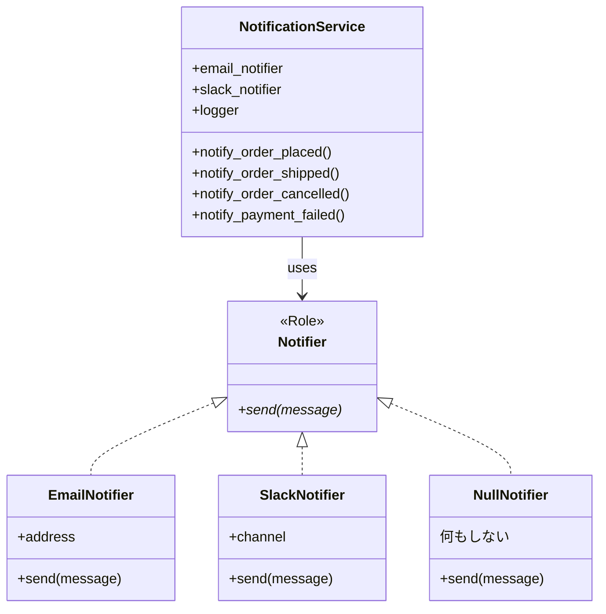

---
categories:
  - tech
date: 2026-04-02T07:07:05+09:00
description: 通知システム全メソッドに散らばる12箇所のdefinedチェック。1箇所の漏れで本番障害が発生した防衛的プログラミングの呪いをNull Objectパターンで根絶するコード探偵ロックの推理。
draft: false
epoch: 1775081225
image: /public_images/2026/code-detective-null-object/header.webp
iso8601: 2026-04-02T07:07:05+09:00
tags:
  - design-pattern
  - perl
  - moo
  - null-object
  - defensive-programming
  - refactoring
  - code-detective
title: コード探偵ロックの事件簿【Null Object】幽霊の正体〜undefの亡霊が棲む防衛線〜
toc: true
---

深夜3時のPagerDutyアラートから18時間が経った。

僕は小野寺。社内システム部で通知基盤を担当しているエンジニア、30歳。入社7年目にして初めての本番障害を出した——原因は自分のコードだ。

会議室Cのホワイトボードには、障害タイムラインが殴り書きされている。「03:02 PagerDuty発報」「03:08 小野寺対応開始」「03:24 原因特定：`notify_payment_failed` の Slack `defined` チェック漏れ」「03:31 ホットフィックス適用」。

社内の受発注システムには、注文・発送・キャンセル・決済失敗の4イベントで通知を飛ばす仕組みがある。通知先はメール、Slack、ログの3種類だが、ユーザーの設定によって「メールだけ」「Slackだけ」「通知なし」と異なる。問題は「通知なし」のユーザーだ。全体の7割を占める。通知先が未設定のユーザーでは notifier が `undef` になるから、コードのあらゆる場所に `if (defined $self->email_notifier)` というガードを入れている。4つのメソッド × 3つの通知先 = 12箇所。同じ防衛パターンの繰り返しだ。

昨夜の障害は、決済失敗の通知メソッドで Slack の `defined` チェックを1箇所だけ書き忘れたことが原因だった。`Can't call method "send" on an undefined value`——深夜3時にこのメッセージが鳴り響いたとき、僕は自分の注意力の限界を悟った。

ポストモーテムの準備をしているところに、上司の三田さんが会議室に入ってきた。

「小野寺、根本原因の分析を一人でやるな。コードの構造的な問題を見抜くのがうまい人間を知ってる。少し変わった奴だが、腕は確かだ」

「変わった、というのは？」

「まあ、会えばわかる」

10分後。ノックもなしに会議室のドアが開いた。

入ってきた男はショルダーバッグからノートPCと大玉のトラックボール——Kensingtonだ——を取り出すと、挨拶もなく会議テーブルに並べ始めた。名刺もない。PCの天板には「Locke - Code Detective」のステッカーが貼ってある。

（コード探偵？）

男はホワイトボードのタイムラインを一瞥して言った。

「——幽霊退治の記録だね」

「障害対応のタイムラインです。03時02分に——」

「`Can't call method "send" on an undefined value`。典型的な幽霊事件だよ」

言い当てられた。三田さんから概要を聞いているのか、それともこの手の障害に見慣れているのか。男はトラックボールを手元に引き寄せながら続けた。

「`undef` は幽霊だ。実体がないのに、コード全体を支配する。おまえたちの12箇所の防衛線は、お祓いの呪文と同じだ。毎回唱えているのに、1回唱え忘れたら深夜3時に起こされる」

「コードを見せたまえ、ワトソン君」

「小野寺です」

訂正したが、男はすでに僕のPCの方を向いていた。

## 現場検証：12箇所の防衛線

ロックと名乗った男——名刺がないからステッカーで判断するしかない——は僕のPCの前に座ると、許可を求めずにスクロールを始めた。三田さんの「腕は確かだ」がなければ、この時点で追い出していたと思う。

```perl
package NotificationService {
    use Moo;

    # すべてオプショナル — undef の可能性がある
    has email_notifier => ( is => 'ro' );
    has slack_notifier => ( is => 'ro' );
    has logger         => ( is => 'ro' );

    sub notify_order_placed ($self, $order_id, $customer) {
        my $msg = "注文 #${order_id} が ${customer} から入りました";

        # ↓ 毎回同じ防衛パターンの繰り返し！
        if (defined $self->email_notifier) {
            $self->email_notifier->send($msg);
        }
        if (defined $self->slack_notifier) {
            $self->slack_notifier->send($msg);
        }
        if (defined $self->logger) {
            $self->logger->log('info', $msg);
        }
    }

    sub notify_order_shipped ($self, $order_id) {
        my $msg = "注文 #${order_id} が発送されました";

        # ↓ また同じ defined チェック！
        if (defined $self->email_notifier) {
            $self->email_notifier->send($msg);
        }
        if (defined $self->slack_notifier) {
            $self->slack_notifier->send($msg);
        }
        if (defined $self->logger) {
            $self->logger->log('info', $msg);
        }
    }

    sub notify_order_cancelled ($self, $order_id, $reason) {
        my $msg = "注文 #${order_id} がキャンセルされました: ${reason}";

        # ↓ さらにまた同じ防衛線！
        if (defined $self->email_notifier) {
            $self->email_notifier->send($msg);
        }
        if (defined $self->slack_notifier) {
            $self->slack_notifier->send($msg);
        }
        if (defined $self->logger) {
            $self->logger->log('warn', $msg);
        }
    }

    sub notify_payment_failed ($self, $order_id, $error) {
        my $msg = "注文 #${order_id} の決済に失敗: ${error}";

        if (defined $self->email_notifier) {
            $self->email_notifier->send($msg);
        }
        if (defined $self->slack_notifier) {
            $self->slack_notifier->send($msg);
        }
        if (defined $self->logger) {
            $self->logger->log('error', $msg);
        }
    }
}
```

ロックはトラックボールをゆっくり回しながら、画面を追っていた。大きな球体が手のひらの下で静かに回転する。やがて手を止め、画面を指さした。

「——12箇所」

「はい。4メソッド × 3通知先で12箇所です」

「そして13箇所目を書き忘れたから、深夜3時にアラートが鳴った」ロックはホワイトボードのタイムラインに目を向けた。「犯人は `undef` じゃないよ、ワトソン君」

「小野寺です。2度目ですが」

「犯人は、`undef` を恐れる *その設計* だ。存在しないかもしれない相手に、毎回12回のお伺いを立てている。防衛的プログラミング——それが今回の真犯人だよ」

確かに、同じコードが12回。だが僕にはまだ反論がある。

「でも、通知先が任意設定である以上、`undef` チェックは安全策として必要でしょう。書き忘れた僕が悪いだけで、設計自体は間違っていない——」

「では聞くが」ロックが振り向いた。「SMS通知を追加したらどうなる？」

「4メソッドに `if (defined $self->sms_notifier)` を追加して……16箇所になります」

「Webhook通知を追加したら？」

「20箇所」

「LINEは？」

「24——」

言いかけて、口を閉じた。安全策が増殖するたびに、漏れのリスクも増殖する。防衛線を張る行為そのものが、新たな脆弱性を生み出している。

## 推理披露：幽霊に実体を与えよ（Null Object）

ロックは会議テーブルに置いてあったペットボトルの水を勝手に開けた。僕の水だ。文句を言おうとしたが、すでに一口飲まれていた。

「幽霊を退治する方法は2つある。一つは、幽霊が出るたびにお祓いをする——いまの `if (defined ...)` だ。だがもう一つの方法がある」

「もう一つ？」

「幽霊に実体を与える」

ロックはPCを開き、コードを書き始めた。トラックボールの大玉がカタカタと小さく音を立てるが、ほとんどキーボードだけで作業していた。

「まず、通知者の契約書を作る」

【After】Notifier ロール（インターフェース）

```perl
package Notifier {
    use Moo::Role;
    requires 'send';
}
```

「`Notifier` ロールは契約書だ。`send` メソッドを持つこと——それが通知者の唯一の義務だ」

【After】本物の通知者たち

```perl
package EmailNotifier {
    use Moo;
    with 'Notifier';

    has address => ( is => 'ro', required => 1 );

    sub send ($self, $message) {
        # 実際にメールを送信する処理
        ...
    }
}

package SlackNotifier {
    use Moo;
    with 'Notifier';

    has channel => ( is => 'ro', required => 1 );

    sub send ($self, $message) {
        # 実際にSlackに投稿する処理
        ...
    }
}
```

「ここまでは設計の整理ですよね。でも通知不要のユーザーは？ `undef` を入れないと——」

「入れない」ロックは画面から目を離さず言った。「4人目の通知者を用意する」

【After】NullNotifier — 何もしないが、同じ契約に従う

```perl
package NullNotifier {
    use Moo;
    with 'Notifier';

    sub send ($self, $message) {
        # 何もしない。それが仕事。
        return 1;
    }
}
```

「……何もしないオブジェクト？」僕は眉をひそめた。「メモリを使ってインスタンスを生成しておいて、何もしないんですか。通知なしユーザーは7割ですよ。7割のユーザーに空のオブジェクトを割り当てるのは——」

「無駄だと？」ロックは初めてこちらに視線を向けた。「ではその "無駄" と、深夜3時のアラートを天秤にかけたまえ。`NullNotifier` のインスタンスはフィールドを一つも持たない。メモリ消費は実質ゼロだ。一方、`defined` チェックの漏れは本番障害になる。省くべきコストの見積もりが逆だよ」

反論できなかった。インスタンス1つのメモリコストと本番障害のコストでは、比較にならない。

「だが、もう一つ訊きたいことがありそうだね」

見透かされている。僕は率直に言った。

「`defined` チェックを漏らしたのは僕のミスです。でもそれはテストの網羅性で防げる問題じゃないですか？ すべてのメソッドに『通知なしユーザーで呼んでもエラーにならない』テストを書けば——」

「書けば、何だ？」ロックがトラックボールの球体を指先で弾いた。「テストを書くのも人間だよ。12箇所の `defined` チェックを書き忘れる人間が、12箇所のテストを書き忘れない保証がどこにある？ 人の注意力に依存する設計は、設計とは呼ばない。*構造で防げ*」

Logger にも同じ手法を適用する。

```perl
package LoggerRole {
    use Moo::Role;
    requires 'log';
}

package NullLogger {
    use Moo;
    with 'LoggerRole';

    sub log ($self, $level, $message) {
        # 何もしない。
        return 1;
    }
}
```

「そして `NotificationService` はこうなる」

【After】NotificationService — defined チェック完全消滅

```perl
package NotificationService {
    use Moo;

    # デフォルトで Null Object を注入 — undef は存在しない
    has email_notifier => (
        is      => 'ro',
        default => sub { NullNotifier->new },
    );
    has slack_notifier => (
        is      => 'ro',
        default => sub { NullNotifier->new },
    );
    has logger => (
        is      => 'ro',
        default => sub { NullLogger->new },
    );

    sub notify_order_placed ($self, $order_id, $customer) {
        my $msg = "注文 #${order_id} が ${customer} から入りました";
        # ↓ defined チェック不要！ 全員が send/log に応答する
        $self->email_notifier->send($msg);
        $self->slack_notifier->send($msg);
        $self->logger->log('info', $msg);
    }

    sub notify_order_shipped ($self, $order_id) {
        my $msg = "注文 #${order_id} が発送されました";
        $self->email_notifier->send($msg);
        $self->slack_notifier->send($msg);
        $self->logger->log('info', $msg);
    }

    sub notify_order_cancelled ($self, $order_id, $reason) {
        my $msg = "注文 #${order_id} がキャンセルされました: ${reason}";
        $self->email_notifier->send($msg);
        $self->slack_notifier->send($msg);
        $self->logger->log('warn', $msg);
    }

    sub notify_payment_failed ($self, $order_id, $error) {
        my $msg = "注文 #${order_id} の決済に失敗: ${error}";
        $self->email_notifier->send($msg);
        $self->slack_notifier->send($msg);
        $self->logger->log('error', $msg);
    }
}
```

僕は画面を見つめた。

「`if (defined ...)` が——1つもない」

「`default => sub { NullNotifier->new }` がすべてを解決している。通知先が指定されなければ NullNotifier が入る。`undef` はもう存在しない。チェックを忘れるも何も、チェックする必要がなくなった」



「新しいチャネルの追加も見てくれたまえ」

```perl
package SmsNotifier {
    use Moo;
    with 'Notifier';

    has phone => ( is => 'ro', required => 1 );

    sub send ($self, $message) {
        # SMS送信処理
        ...
    }
}
```

「SMS を追加しても `NotificationService` のコードは1行も変わらない。`Notifier` ロールを実装するだけだ。`defined` チェックの追加は——」

「ゼロ。追加するチェックが存在しないから」

「そういうことだ」

## 解決：12箇所の防衛線、消滅

ロックがテストを走らせた。

```bash
$ prove -v t/null_object.t
# Subtest: Before: 全通知あり — 正常動作
    ok 1 - Email sent
    ok 2 - Slack sent
    ok 3 - Log recorded
ok 1 - Before: 全通知あり — 正常動作
# Subtest: Before: 通知なし（undef）— defined チェックに依存
    ok 1 - No crash — but only because of 12 defined checks across 4 methods
ok 2 - Before: 通知なし（undef）— defined チェックに依存
# Subtest: Before: 問題の証明 — defined チェック漏れは即死
    ok 1 - email_notifier is undef
    ok 2 - slack_notifier is undef
    ok 3 - logger is undef
    ok 4 - PROBLEM: calling send on undef crashes
    ok 5 - PROBLEM: Every call site must remember the defined check
ok 3 - Before: 問題の証明 — defined チェック漏れは即死
# Subtest: After: Null Object — 通知なしでも defined チェック不要
    ok 1 - email_notifier is always defined (NullNotifier)
    ok 2 - slack_notifier is always defined (NullNotifier)
    ok 3 - logger is always defined (NullLogger)
    ok 4 - FIX: No crash even without defined checks
ok 4 - After: Null Object — 通知なしでも defined チェック不要
# Subtest: After: Notifier ロールのポリモーフィズム
    ok 1 - EmailNotifier does Notifier
    ok 2 - SlackNotifier does Notifier
    ok 3 - NullNotifier does Notifier
    ok 4 - Logger does LoggerRole
    ok 5 - NullLogger does LoggerRole
    ok 6 - FIX: All notifiers share the same interface — swappable
ok 5 - After: Notifier ロールのポリモーフィズム
# Subtest: After: 防衛的コードの消滅を確認
    ok 1 - FIX: ZERO defined checks in the After code
ok 6 - After: 防衛的コードの消滅を確認
All tests successful.
```

「Before のテスト3——`undef` に対して `send` を呼ぶと即座にクラッシュする。これが昨夜おまえを叩き起こした犯人だ」

「After のテスト1……notifier が指定されていなくても `NullNotifier` が入っているから、`defined` は常に真」

「テスト5がポイントだよ。`EmailNotifier`、`SlackNotifier`、`NullNotifier`——すべてが `Notifier` ロールを実装している。呼び出し側に区別はつかない。本物も幽霊も、同じ契約書にサインしている」

「テスト6——After コードの `defined` チェック数がゼロ」

ロックはPCを閉じ、トラックボールをバッグに戻し始めた。

「一つだけ」

僕は身構えた。

「Null Object は *何もしないこと* が正しい場合にだけ使いたまえ。もし通知不要のユーザーにもデフォルトログを残したいなら、それは NullNotifier ではなく DefaultNotifier の仕事だ。幽霊に実体を与えるのは、幽霊が本当に何もしないときだけだ」

ショルダーバッグを肩にかけ、ドアに手をかけたところで振り返った。

「——深夜3時のアラートは、もう鳴らないだろう。小野寺」

名前で呼ばれたのは、それが初めてだった。僕が何か返す前に、ドアは閉まっていた。

会社のSlackに書いた。「通知基盤の `defined` チェック撲滅、着手します。Null Object パターンで全箇所の防衛コードを除去します」——深夜3時のアラートは、もう鳴らないはずだ。

---

## 探偵の調査報告書

| 容疑（アンチパターン） | 真実（パターン） | 証拠（効果） |
| :--- | :--- | :--- |
| 防衛的プログラミング（Defensive Programming）。通知先が未設定（`undef`）のユーザーに対し、4メソッド×3通知先＝12箇所に `if (defined ...)` チェックを散布。1箇所の漏れが本番障害を引き起こし、チャネル追加のたびにチェック箇所が増殖する。 | Null Object パターン。`Notifier` ロール（インターフェース）を定義し、`NullNotifier`（何もしない実装）をデフォルト値として注入。`undef` を排除し、`defined` チェックをゼロにする。 | 12箇所の `if (defined ...)` が完全に消滅。チェック漏れによる本番障害のリスクがゼロに。新チャネル追加時もロールを実装するだけで、既存コードの修正不要。 |

### 推理のステップ

1. ロール（インターフェース）を定義する: `Notifier` ロールで `send` メソッドを `requires` 宣言する。すべての通知者はこの契約に従う。
2. Null Object を実装する: `NullNotifier` クラスを作り、`with 'Notifier'` で同じロールを実装する。`send` メソッドは何もせず `return 1` するだけ。
3. デフォルト値として注入する: `has email_notifier => ( default => sub { NullNotifier->new } )` で、未指定時に自動的に Null Object が入るようにする。`undef` の余地を消す。
4. 防衛コードを全削除する: すべての `if (defined ...)` を削除する。全属性が必ずオブジェクト（本物または Null Object）なので、チェックは不要。

### ロックより

ワトソン君——いや、小野寺。`undef` は幽霊だ。存在しないのに、おまえのコードを支配し、12箇所の防衛線を張らせ、深夜3時の眠りを奪う。

Null Object の本質は「不在の表現」だ。「何もない」を `undef` で表すのではなく、「何もしない」オブジェクトで表す。呼び出し側が相手の正体を気にする必要はない——同じ契約に従っているのだから。

ただし、覚えておけ。幽霊に実体を与えるのは、幽霊が本当に「何もしない」ときだけだ。「デフォルトの処理をする」必要があるなら、それは Null Object ではなく Default Object の領域だ。
