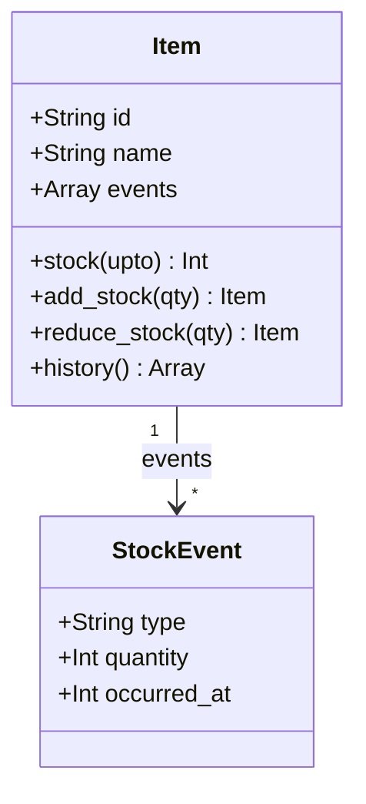

---
categories:
  - tech
date: 2026-04-03T07:07:05+09:00
description: "ECサイトの在庫数が合わない。DBには現在値しかなく、監査に答えられない——上書きが消す履歴という証拠をEvent Sourcingで復元するコード探偵ロックの推理。"
draft: false
epoch: 1775167625
image: /public_images/2026/code-detective-event-sourcing/header.webp
iso8601: 2026-04-03T07:07:05+09:00
tags:
  - design-pattern
  - perl
  - moo
  - event-sourcing
  - lost-history
  - refactoring
  - code-detective
title: "コード探偵ロックの事件簿【Event Sourcing】消えた在庫の証拠品〜上書きが奪う真実と時を遡る捜査〜"
toc: true
---

「在庫数が合わないんです。DBの数字と、実際の入出荷の合計が一致しない。監査部門から『過去30日の在庫変動の根拠データを出せ』と言われているんですが、そのデータが——存在しないんです」

俺は柴田リョウ。ECサービスを展開する中規模のIT企業でバックエンドを担当している。33歳。在庫管理システムの一人担当。

システムは単純だ。入荷があれば在庫数を増やし、出荷があれば減らす。誰でも書けるコードだ。だからこそ気づかなかった。3年間、誰もそのコードに「過去は？」と聞かなかったから。

監査が入るまでは。

雑居ビルの階段を三階まで上がると、くすんだガラス扉に手書きの紙が貼ってあった。

「レガシー・コード・インベスティゲーション（LCI）」

ドアを押すと、デスクトップPCの排熱で蒸し暑い空気が流れ出してきた。デスクの上にはエナジードリンクの空き缶が並び、その隣にキーボードが6枚。なぜ6枚。

椅子に深く座った男が、モニターから視線を外さずに言った。

「——証拠が消えているね、ワトソン君」

「柴田です。まだ何も話していないんですが」

「話す前に分かる。おまえの目が言っている。『あるべきものがない』という目だ」

男の名はロック。名刺には「コード探偵」とだけ書いてあった。

## 在庫課からのSOS

現状を説明した。ECサイトの在庫テーブル。商品が入荷されるたびに在庫数を加算し、注文が確定するたびに減算する。現在の在庫数は正確に管理できている。

しかし「30日前の在庫は何個だったか」は分からない。「いつ誰が何個出荷したか」も分からない。DBには今の数字だけが残っている。

「コードを見せたまえ」

俺はノートPCを開いてコードを見せた。

```perl
package Item;
use Moo;

has id    => (is => 'ro', required => 1);
has name  => (is => 'ro', required => 1);
has stock => (is => 'rw', default => 0);

sub add_stock ($self, $qty) {
    $self->stock($self->stock + $qty);
    return $self;
}

sub reduce_stock ($self, $qty) {
    die "在庫不足\n" if $self->stock < $qty;
    $self->stock($self->stock - $qty);
    return $self;
}
```

ロックはコードを三秒ほど眺めて、缶コーヒーをひと口飲んだ。

「完璧な証拠隠滅だ」

「は？」

「このシステムは犯行の都度、現場を書き換えている。入荷があれば`stock`を上書き。出荷があれば`stock`を上書き。現場には『今の数字』だけが残り、そこに至るまでの出来事は跡形もなく消えている」

「でもそれって——普通の在庫管理じゃないですか。状態を保持して、変更するだけで」

「探偵が事件現場を消しながら捜査するかね、ワトソン君」

俺は答えられなかった。

## 現場検証：上書きされた犯行現場

ロックは椅子から立ち上がり、俺のノートPCを指差した。

「問題の核心を特定しよう。`stock`が`rw`——読み書き可能になっている。これが今回の真犯人だ。名前をつけるならLost History（消えた履歴）。状態を直接書き換えることで、変化の記録がすべて失われる」

「でも現在の在庫数は正確に管理できています」

「今は、ね。だが過去は？　1週間前の在庫は？　特定の注文が処理された後の在庫は？　それを答えられるか」

答えられなかった。監査部門が求めているのはまさにそこだった。

```perl
my $item = Item->new(id => '1', name => 'リンゴ');

$item->add_stock(200);    # 200個入荷
$item->reduce_stock(50);  # 50個出荷
$item->reduce_stock(30);  # 30個出荷
$item->add_stock(10);     # 10個入荷返品

print $item->stock;  # 130 — 現在値は分かる

# しかし——
# $item->history;             # このメソッドは存在しない
# $item->stock($timestamp);   # このメソッドも存在しない
```

「`stock`が`130`であることは分かる。しかし『なぜ130なのか』を証明できない。誰が、いつ、何個動かしたのか——すべて消えている」

ロックはホワイトボードに書いた。

```
t=0  stock=0
t=1  add_stock(200)  → stock=200  ← このt=1の状態に戻れるか？
t=2  reduce_stock(50) → stock=150  ← このt=2の状態は？
t=3  reduce_stock(30) → stock=120
t=4  add_stock(10)    → stock=130
```

「`t=1`の状態、`t=2`の状態——これらはシステムにとって存在しなかったことになっている。消えた証拠品だ」

## 推理披露：出来事を積み重ねる捜査手法

「解決策を聞かせてください」

「初歩的なことだよ、ワトソン君」ロックは指を立てた。「優秀な探偵は現場を変えない。*出来事を記録する*だけだ。状態はその記録から演繹する」

「出来事を……記録する？」

「`stock=200`というのは状態だ。だが探偵が見るべきは『200個が入荷されたという出来事』だ。出来事は消えない。出来事を積み重ねれば、任意の時点での状態が計算できる」

これが **Event Sourcing** だとロックは言った。

状態そのものをデータとして持つのではなく、状態の変化を引き起こした「イベント（出来事）」を不変のレコードとして積み重ねる。現在の状態はイベントを最初から順番に適用（リプレイ）することで導出する。

「まずイベントを表すクラスを作る」

```perl
package StockEvent;
use Moo;
use Types::Standard qw(Str Int);

has type        => (is => 'ro', isa => Str, required => 1);  # 'added' | 'reduced'
has quantity    => (is => 'ro', isa => Int, required => 1);
has occurred_at => (is => 'ro', isa => Int, required => 1);
```

「`is => 'ro'`——読み取り専用だ。イベントは一度記録されたら変更できない。これが肝心だ。過去の出来事を改ざんさせてはならない」

「なるほど。で、この`StockEvent`をどう使うんですか？」

「`Item`を書き直す」

```perl
package Item;
use Moo;
use Types::Standard qw(Str ArrayRef);

has id     => (is => 'ro', isa => Str, required => 1);
has name   => (is => 'ro', isa => Str, required => 1);
has events => (is => 'ro', isa => ArrayRef, default => sub { [] });

sub stock ($self, $upto = undef) {
    my $total = 0;
    for my $e (@{ $self->events }) {
        last if defined $upto && $e->occurred_at > $upto;
        $total += $e->quantity if $e->type eq 'added';
        $total -= $e->quantity if $e->type eq 'reduced';
    }
    return $total;
}

sub add_stock ($self, $qty) {
    push @{ $self->events }, StockEvent->new(
        type        => 'added',
        quantity    => $qty,
        occurred_at => time(),
    );
    return $self;
}

sub reduce_stock ($self, $qty) {
    die "在庫不足\n" if $self->stock < $qty;
    push @{ $self->events }, StockEvent->new(
        type        => 'reduced',
        quantity    => $qty,
        occurred_at => time(),
    );
    return $self;
}

sub history ($self) {
    return @{ $self->events };
}
```

「`stock`が属性じゃなくなった——」

「そう。`stock`はもはや保存されたデータではなく、イベントを積み重ねて*演算した結果*だ。探偵の言葉で言えば、証言の一覧から真実を演繹するようなものだね」

俺はコードを追った。`add_stock`は`stock`を変えるのではなく、`StockEvent->new(type => 'added', ...)`をイベントリストに追加するだけだ。`reduce_stock`も同じ。状態の変化ではなく、出来事の記録。

「`stock()`メソッドは全イベントをループして、`added`は足し、`reduced`は引く。これで現在の在庫が計算できる」

「でも……毎回全イベントをループするのって遅くないですか？」

「鋭い質問だ、ワトソン君」ロックはわずかに表情を変えた。「Snapshotという技術がある。一定数のイベントが溜まったら、その時点の状態を『スナップショット』として保存する。リプレイはそのスナップショット以降のイベントだけ処理すればいい。だが今回の事件にはまだ必要ない。まずは基本を理解したまえ」

## 時間を遡る捜査

「では、この手法の真価を見せよう」

ロックは`stock`メソッドに注目した。引数`$upto`がある。これがEvent Sourcingの核心だとロックは言った。

```perl
sub stock ($self, $upto = undef) {
    my $total = 0;
    for my $e (@{ $self->events }) {
        last if defined $upto && $e->occurred_at > $upto;  # ここがキモ
        $total += $e->quantity if $e->type eq 'added';
        $total -= $e->quantity if $e->type eq 'reduced';
    }
    return $total;
}
```

「タイムスタンプを渡すと、その時点までのイベントだけを集計する。つまり——」

```perl
my $item = Item->new(id => '1', name => 'リンゴ');

my $t0 = time();        # 操作前
sleep(1);
$item->add_stock(500);  # 500個入荷

my $t1 = time();        # 入荷後
sleep(1);
$item->reduce_stock(100); # 100個出荷

my $t2 = time();
sleep(1);
$item->reduce_stock(200); # 200個出荷

my $t3 = time();

print $item->stock;       # 200（現在）
print $item->stock($t0);  # 0（入荷前）
print $item->stock($t1);  # 500（入荷後、出荷前）
print $item->stock($t2);  # 400（1回目の出荷後）
```

「過去の任意の時点に遡れる——」

俺は思わず声が出た。これだ。監査部門が求めていたのは、まさにこれだった。「30日前の在庫を教えろ」という問いに、タイムスタンプ一つで答えられる。

「出来事を消していなければ、時間などただの変数に過ぎない」

さらに`history()`で全イベントを取り出せる。

```perl
my @history = $item->history;
for my $e (@history) {
    printf "[%s] %s: %d個 (at %d)\n",
        $e->type, ($e->type eq 'added' ? '入荷' : '出荷'), $e->quantity, $e->occurred_at;
}
```

「誰が何をいつやったか。証拠品の一覧が揃った」

## 事件解決：緑に点灯する真実

テストを走らせた。

```
# Subtest: After: FIX — 全イベント履歴が残る
ok 1 - 現在の在庫は130個
ok 2 - FIX: 4件のイベントが記録されている
ok 3 - 1件目: added
ok 4 - 1件目: 200個
...
ok 10 - 4件目: 10個

# Subtest: After: FIX — 任意時点の在庫を復元できる（time travel）
ok 1 - 現在の在庫: 200個 (500 - 100 - 200)
ok 2 - t0時点: 0個（何も起きていない）
ok 3 - t1時点: 500個（入荷後、出荷前）
ok 4 - t2時点: 400個（1回目の出荷後）
ok 5 - t3時点: 200個（2回目の出荷後）
1..5
ok 4 - After: FIX — 任意時点の在庫を復元できる（time travel）
```

全テスト、警告ゼロでパスした。

「これで監査部門に提出できます。30日分のイベントログから、どの時点の在庫でも再現できる」

「当然だね」ロックは缶のプルタブを引いた。「探偵は証拠を消さない。消すのは犯人だ」

俺は思った。3年間、俺たちは知らないうちに証拠を消し続けていた犯人だったわけだ。



「報酬は？」

「さっき言ったろう。Cherry MX 赤軸のキーキャップ一式だ。108キー分。色はグレーで頼む」

俺は帰り道、「それはいくらするんだ」とスマホで調べた。探偵の報酬にしては随分と具体的だった。

---

## 探偵の調査報告書

| 容疑（アンチパターン） | 真実（パターン） | 証拠（効果） |
|---|---|---|
| Mutable State — 状態を直接上書きすることで、変化の記録が消える | Event Sourcing — 状態の変化を「イベント」として不変に記録し、状態はリプレイで算出 | 任意時点の状態復元・完全な監査ログ・履歴の追跡が可能になる |
| Lost History — 「今」しか知らないシステム | イベントの蓄積による「時間軸の復元」 | `stock($timestamp)` で過去の任意時点の在庫を演算できる |

### 推理のステップ

1. イベントクラスを作る — 状態変化の「出来事」を表す不変オブジェクト（`type`, `quantity`, `occurred_at`）を定義する
2. 状態を属性から演算に変える — 集約クラスの`stock`を`rw`属性から、イベントをリプレイして計算するメソッドに変換する
3. 変更操作をイベント追加に変える — `add_stock`/`reduce_stock`は状態を変えず、イベントを`push`するだけにする
4. 履歴を取得できるようにする — `history()`メソッドで全イベントを返す
5. 過去の状態を演算できるようにする — `stock($timestamp)`で特定時点以前のイベントだけを集計する

### ロックより

証拠を消す者は、自分が犯人でなくても共犯者になる。`UPDATE SET stock = ?`という一行は、そこに至るまでの「出来事の連鎖」を永遠に葬る命令だ。

Event Sourcingは複雑に見えるが、本質は単純だ。「状態を保存する」のではなく「出来事を保存する」。状態は常に、出来事の積み重ねから演繹される副産物に過ぎない。

次はSnapshotを調べたまえ、ワトソン君。イベントが増えるほどリプレイのコストが上がる——そのときの切り札だ。
