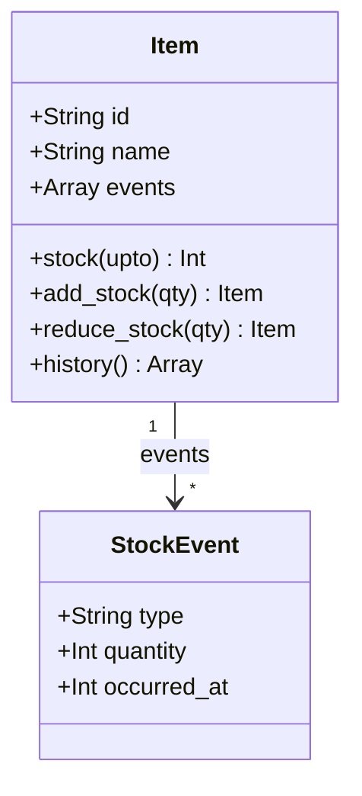

---
categories:
  - tech
date: 2026-04-03T07:07:05+09:00
description: "在庫数が合わないのにDBには現在値しかない。監査の30日間に答えられない在庫管理をEvent Sourcingで再設計し、出来事の積み重ねから任意時点の在庫を復元するコード探偵ロックの推理。"
draft: false
epoch: 1775167625
image: /public_images/2026/code-detective-event-sourcing/header.webp
iso8601: 2026-04-03T07:07:05+09:00
tags:
  - design-pattern
  - perl
  - moo
  - event-sourcing
  - lost-history
  - refactoring
  - code-detective
title: "コード探偵ロックの事件簿【Event Sourcing】失われた三十日間〜数字が語れない過去と出来事が紡ぐ真実〜"
toc: true
---

モニターに表示された監査部門からのメールを、俺は三度目に読み返していた。

> 過去30日間の在庫変動について、各商品の入出荷根拠データを提出してください。期限は来週金曜です。

俺は日下部カイ。EC事業部でバックエンドを担当している。34歳。在庫管理システムの一人担当になって3年になる。

在庫数なら出せる。DBを叩けば、どの商品が今何個あるかは一瞬で分かる。だが「30日前に何個だったか」は分からない。「いつ、何個入荷して、いつ、何個出荷したか」も分からない。テーブルには現在の数字しか入っていない。3年間ずっとそうだった。誰も過去を聞かなかったから、問題にならなかっただけだ。

隣のデスクの吉岡が、俺のモニターを横目で見て言った。

「前にうちのAPIのバグを見てもらった奴がいるんだけど。コードの設計問題を嗅ぎ分けるのがうまい。ちょっと変わってるけど、腕は確かだ」

「変わってる、ってのは？」

「会えば分かる。連絡しとくわ」

翌日の午後。俺のデスクの前に、ノートPCのバッグを肩にかけた男が立っていた。手にはエナジードリンクの缶。挨拶はなかった。

男は俺のモニターに映ったメールをちらりと見て言った。

「三十日分の変動記録か。データはあるのか」

「在庫数ならDBにある」

「在庫数ではない。出来事だ」

意味が分からなかった。男はPCバッグのストラップに下げたキーホルダー——よく見るとキーキャップだ——を揺らしながら、俺の隣の空き椅子に座った。

「ロックだ。コード探偵をしている。コードを見せてもらおうか、ワトソン君」

日下部だ、と言おうとしたが、男はもう俺のモニターに向き直っていた。

## 三十日間の空白

俺は在庫管理のコードを開いた。

ECサイトの在庫テーブルに対応する`Item`クラス。商品が入荷されるたびに在庫数を加算し、注文が確定するたびに減算する。3年前に書いた、ごく普通のコードだ。

```perl
package Item;
use Moo;

has id    => (is => 'ro', required => 1);
has name  => (is => 'ro', required => 1);
has stock => (is => 'rw', default => 0);

sub add_stock ($self, $qty) {
    $self->stock($self->stock + $qty);
    return $self;
}

sub reduce_stock ($self, $qty) {
    die "在庫不足\n" if $self->stock < $qty;
    $self->stock($self->stock - $qty);
    return $self;
}
```

ロックはコードを数秒眺めてから、エナジードリンクを一口飲んだ。

「完璧な証拠隠滅だ」

「何が？」

「このコードは、操作のたびに現場を書き換えている。入荷があれば`stock`を上書き。出荷があれば`stock`を上書き。現場には今の数字だけが残り、そこに至るまでの出来事は跡形もなく消えている」

「証拠隠滅って——普通の在庫管理だろう。状態を保持して、変更するだけだ」

「その通り。だが普通の在庫管理では、監査には答えられない」

ロックは静かにそう返した。反論しようとしたが、モニターに表示されたメールの文面が目に入って言葉を飲んだ。

## 上書きされた犯行現場

ロックは俺の許可を待たずに、デスクの付箋を一枚はがしてペンを取った。

「核心を特定しよう。`stock`が`rw`になっている。読み書き可能だ。これが今回の真犯人だよ」

「真犯人？」

「名前をつけるなら Lost History。消えた履歴。状態を直接書き換えることで、変化の記録がすべて失われる」

「でも現在の在庫数は正確だ」

「今は、ね」ロックは付箋にペンを走らせた。「1週間前の在庫は？ 特定の出荷の後の在庫は？ 答えられるか」

答えられなかった。監査部門の問いがまさにそれだ。

```perl
my $item = Item->new(id => '1', name => 'リンゴ');

$item->add_stock(200);    # 200個入荷
$item->reduce_stock(50);  # 50個出荷
$item->reduce_stock(30);  # 30個出荷
$item->add_stock(10);     # 10個入荷返品

print $item->stock;  # 130 — 現在値は分かる

# しかし——
# $item->history;             # このメソッドは存在しない
# $item->stock($timestamp);   # このメソッドも存在しない
```

ロックは付箋に時系列を書いた。

```
t=0  stock=0
t=1  add_stock(200)  → stock=200  ← この時点に戻れるか？
t=2  reduce_stock(50) → stock=150  ← この時点の状態は？
t=3  reduce_stock(30) → stock=120
t=4  add_stock(10)    → stock=130
```

「`t=1`も`t=2`も、このシステムにとっては存在しなかったことになっている。30日分の空白——これが消えた証拠だ、ワトソン君」

「日下部だ」

訂正したが、ロックは付箋にもう一行書き足していた。

## 出来事を積み重ねる捜査手法

「で、どう直す」

俺は回りくどい比喩に付き合うつもりはなかった。監査の期限は来週だ。ロックはペンを置いて、こちらを向いた。

「優秀な探偵は現場を変えない。出来事を記録するだけだ。状態は、その記録から演繹する」

「具体的に」

「`stock = 200`というのは状態だ。だが記録すべきは『200個が入荷された』という出来事のほうだ。出来事は消えない。出来事を積み重ねれば、任意の時点での状態が計算できる」

つまり、`stock`の値を書き換える代わりに、「入荷200個」「出荷50個」という出来事だけを溜めていく。今の在庫が知りたければ、出来事を頭から順に足し引きすればいい——Event Sourcingという手法だ。理屈は分かる。だが本当にそれで現場が回るのか。

「まずイベントを表すクラスを作る」

ロックは俺のPCのエディタを開いた。さすがに勝手にキーボードを触ろうとはしなかった——こちらに目で打てと促してきた。

```perl
package StockEvent;
use Moo;
use Types::Standard qw(Str Int);

has type        => (is => 'ro', isa => Str, required => 1);  # 'added' | 'reduced'
has quantity    => (is => 'ro', isa => Int, required => 1);
has occurred_at => (is => 'ro', isa => Int, required => 1);
```

「`is => 'ro'`。読み取り専用だ。イベントは一度記録されたら変更できない。過去の出来事を改ざんさせてはならない」

「分かった。で、これをどう使う」

「`Item`を書き直す」

```perl
package Item;
use Moo;
use Types::Standard qw(Str ArrayRef);

has id     => (is => 'ro', isa => Str, required => 1);
has name   => (is => 'ro', isa => Str, required => 1);
has events => (is => 'ro', isa => ArrayRef, default => sub { [] });

sub stock ($self, $upto = undef) {
    my $total = 0;
    for my $e (@{ $self->events }) {
        last if defined $upto && $e->occurred_at > $upto;
        $total += $e->quantity if $e->type eq 'added';
        $total -= $e->quantity if $e->type eq 'reduced';
    }
    return $total;
}

sub add_stock ($self, $qty) {
    push @{ $self->events }, StockEvent->new(
        type        => 'added',
        quantity    => $qty,
        occurred_at => time(),
    );
    return $self;
}

sub reduce_stock ($self, $qty) {
    die "在庫不足\n" if $self->stock < $qty;
    push @{ $self->events }, StockEvent->new(
        type        => 'reduced',
        quantity    => $qty,
        occurred_at => time(),
    );
    return $self;
}

sub history ($self) {
    return @{ $self->events };
}
```

俺はコードを追った。`add_stock`は`stock`の値を変えるのではなく、`StockEvent->new(type => 'added', ...)`をイベントリストに追加するだけだ。`reduce_stock`も同じ。状態の変更ではなく、出来事の記録。

「`stock`が属性じゃなくなっている」

「そう。`stock`はもはや保存されたデータではなく、イベントを積み重ねて演算した結果だ。証言の一覧から真実を演繹するようなものだね」

「`stock()`メソッドは全イベントをループして、`added`なら加算、`reduced`なら減算。これで現在の在庫が出る——」

俺は一度コードから目を離した。ここが引っかかる。

「待ってくれ。毎回全イベントをループするのか。うちのECサイト、商品1万点ある。年間の入出荷イベントが商品あたり数百件だとして、全商品で数百万件。それを毎回先頭から舐めるのか」

ロックは初めて、少しだけ椅子を引いてこちらに体を向けた。

「いい反論だ。Snapshotという手法がある。一定数のイベントが溜まった時点で、その瞬間の状態を『スナップショット』として保存する。リプレイはそのスナップショット以降のイベントだけ処理すればいい」

「それなら現実的だな」

「だが今回の事件にはまだ必要ない。まず基本の仕組みを理解してからだ」

もう一つ気になることがあった。

「イベントが`ro`で不変だと言ったな。間違って記録したらどうする。消せないんだろう」

「消さない。補正イベントを追加する。帳簿の赤伝票と同じだ。誤った入荷100個に対して、減算100個の補正イベントを記録する。元のイベントは改ざんせず、記録の連鎖で正しい状態に収束させる」

なるほど。削除ではなく追記。不変なログが積み重なる構造なら、矛盾なく成り立つ。

## 時を遡る証明

「この手法の真価を見せよう」

ロックは`stock`メソッドの引数`$upto`に注目した。

```perl
sub stock ($self, $upto = undef) {
    my $total = 0;
    for my $e (@{ $self->events }) {
        last if defined $upto && $e->occurred_at > $upto;  # ここがキモ
        $total += $e->quantity if $e->type eq 'added';
        $total -= $e->quantity if $e->type eq 'reduced';
    }
    return $total;
}
```

「タイムスタンプを渡せば、その時点までのイベントだけを集計する」

```perl
my $item = Item->new(id => '1', name => 'リンゴ');

my $t0 = time();        # 操作前
sleep(1);
$item->add_stock(500);  # 500個入荷

my $t1 = time();        # 入荷後
sleep(1);
$item->reduce_stock(100); # 100個出荷

my $t2 = time();
sleep(1);
$item->reduce_stock(200); # 200個出荷

my $t3 = time();

print $item->stock;       # 200（現在）
print $item->stock($t0);  # 0（入荷前）
print $item->stock($t1);  # 500（入荷後、出荷前）
print $item->stock($t2);  # 400（1回目の出荷後）
```

30日前の在庫が、タイムスタンプ一つで出せる。

俺は黙ってモニターを見ていた。監査部門が要求しているのは、まさにこれだ。「この日の在庫は何個だったか」「この出荷で何個減ったか」——全部、イベントから演算できる。

さらに`history()`で全イベントを取り出せる。

```perl
my @history = $item->history;
for my $e (@history) {
    printf "[%s] %s: %d個 (at %d)\n",
        $e->type, ($e->type eq 'added' ? '入荷' : '出荷'), $e->quantity, $e->occurred_at;
}
```

「出来事を消していなければ、時間などただの変数に過ぎない」

ロックは静かにそう言った。

テストを走らせた。

```
# Subtest: After: FIX — 全イベント履歴が残る
ok 1 - 現在の在庫は130個
ok 2 - FIX: 4件のイベントが記録されている
ok 3 - 1件目: added
ok 4 - 1件目: 200個
...
ok 10 - 4件目: 10個

# Subtest: After: FIX — 任意時点の在庫を復元できる（time travel）
ok 1 - 現在の在庫: 200個 (500 - 100 - 200)
ok 2 - t0時点: 0個（何も起きていない）
ok 3 - t1時点: 500個（入荷後、出荷前）
ok 4 - t2時点: 400個（1回目の出荷後）
ok 5 - t3時点: 200個（2回目の出荷後）
1..5
ok 4 - After: FIX — 任意時点の在庫を復元できる（time travel）
```

全テスト、警告ゼロでパスした。

「これで30日分のイベントログから、どの時点の在庫でも再現できる」

ロックは頷いた。荷物をまとめ始めている。



「報酬の話をしていない」

「吉岡に借りがあった。今回はその返済だ」

ロックはエナジードリンクの空き缶をゴミ箱に入れて、そのまま出ていった。

静かになったデスクで、俺はモニターに残ったコードを眺めていた。3年間、`UPDATE items SET stock = ? WHERE id = ?` を何千回と実行してきた。あれは在庫を更新していたんじゃない。毎回、入荷と出荷の記録を消していたんだ。

俺たちは3年間、知らないうちに証拠を消す側にいた。

---

## 探偵の調査報告書

| 容疑（アンチパターン） | 真実（パターン） | 証拠（効果） |
|---|---|---|
| Mutable State — 状態を直接上書きすることで、変化の記録が消える | Event Sourcing — 状態の変化を「イベント」として不変に記録し、状態はリプレイで算出 | 任意時点の状態復元・完全な監査ログ・履歴の追跡が可能になる |
| Lost History — 「今」しか知らないシステム | イベントの蓄積による「時間軸の復元」 | `stock($timestamp)` で過去の任意時点の在庫を演算できる |

### 推理のステップ

1. イベントクラスを作る — 状態変化の「出来事」を表す不変オブジェクト（`type`, `quantity`, `occurred_at`）を定義する
2. 状態を属性から演算に変える — 集約クラスの`stock`を`rw`属性から、イベントをリプレイして計算するメソッドに変換する
3. 変更操作をイベント追加に変える — `add_stock`/`reduce_stock`は状態を変えず、イベントを`push`するだけにする
4. 履歴を取得できるようにする — `history()`メソッドで全イベントを返す
5. 過去の状態を演算できるようにする — `stock($timestamp)`で特定時点以前のイベントだけを集計する

### ロックより

`UPDATE SET stock = ?` という一行が実行されるたびに、そこに至るまでの出来事の連鎖が消えていく。証拠の隠滅に悪意は要らない。知らなかっただけで十分だ。

Event Sourcingの本質は単純だ。状態を保存するのではなく、出来事を保存する。状態は常に、出来事の積み重ねから演繹される——副産物に過ぎない。イベントの数が増えてリプレイのコストが気になり始めたら、Snapshotという切り札がある。だがそれは次の事件だ。
