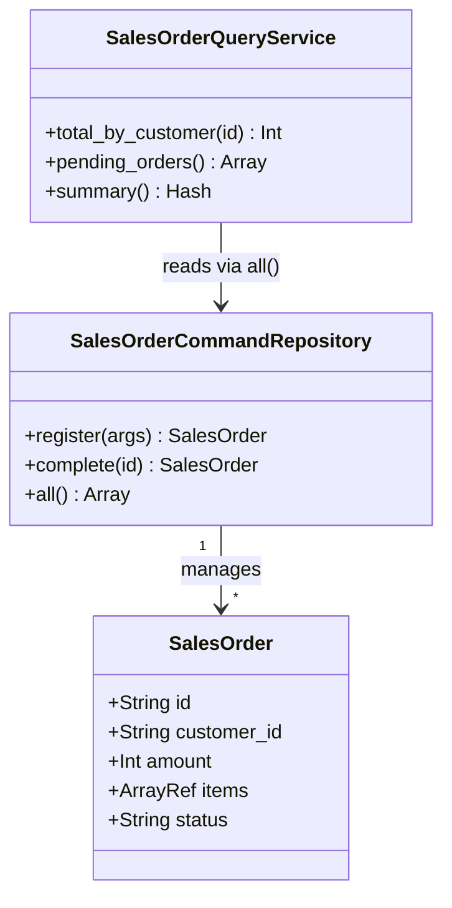

---
categories:
  - tech
date: 2026-04-04T07:07:05+09:00
description: 受注登録の修正でレポートが壊れる。集計変更でバリデーションが落ちる——読み書き混在リポジトリの呪縛をCQRSで断ち切るコード探偵ロックの推理。
draft: true
epoch: 1775254025
image: /public_images/2026/code-detective-cqrs/header.webp
iso8601: 2026-04-04T07:07:05+09:00
tags:
  - design-pattern
  - perl
  - moo
  - cqrs
  - mixed-repository
  - refactoring
  - code-detective
title: コード探偵ロックの事件簿【CQRS】読み書き混在の証言台〜書き込んで読めなくなったリポジトリの密室〜
toc: true
---

金曜日の朝、駅前のファミレスでノートPCを開いていた。

私は高橋サクラ。営業支援システムのバックエンドエンジニア、28歳。受注管理、ダッシュボード、月次レポート——すべてひとりで担当している。始業前のこの1時間だけは、Slackの通知に邪魔されずにコードに集中できる貴重な時間だ。

のはずだった。

ターミナルに赤い文字が並んでいる。受注バリデーションのロジックを一箇所修正しただけで、ダッシュボードの集計テストが3本落ちた。先週は逆だった。集計クエリの最適化をしたら、受注バリデーションのテストが壊れた。触っていない場所が壊れる。片方を直すともう片方が崩れる。

3週間、このシーソーが止まらない。

「集計側が落ちたか」

右隣のテーブルから、声がかかった。

振り返ると、男がノートPCの向こうから私の画面を見ていた。テーブルの上にはエナジードリンクの缶と、分解途中のメカニカルキーボード——スイッチが外されてフレームだけの状態だ。ファミレスの朝にキーボードを分解している人間は初めて見た。

「見えてるんですか？」

「フォントサイズが大きいからね。赤いテスト結果は離れていても目を引く」

「覗き見はやめてもらえますか」

「公共の場でモニターを開くのは、見てくれと言っているようなものだよ」

反論したかったが、一理あった。男はエナジードリンクを一口飲んで続けた。

「受注のバリデーションを修正すると集計テストが壊れる。集計を最適化するとバリデーションのテストが壊れる。そのサイクルだね——正しいかね」

テスト出力を読んだだけでそこまで分かるのか。いや、クラス名とメソッド名は出力に含まれている。読めば分かる情報だ。

「……正しいです」

「ロックだ。コードの設計を調べる仕事をしている」

男はPCの天板を見せた。「Locke — Code Detective」のステッカーが貼ってある。名刺代わりのつもりらしい。

「コード探偵、ですか」

「お宅のコード、少し見せてもらえるかね。ワトソン君」

「高橋です。ワトソンではないんですが」

「こちらの都合だ。気にしないでくれたまえ」

気にする。しかし3週間のシーソーに消耗しきった私には、ファミレスのキーボード分解男がまともな助言をくれる可能性に賭けるだけの切実さがあった。

ノートPCを男の方に向けた。

## 現場検証：五つの責任を押し込んだ一つのクラス

ロックは分解途中のキーボードを脇に寄せ、画面を覗き込んだ。

```perl
package SalesOrderRepository;
use Moo;
use List::Util qw(sum0);

has _orders => (is => 'ro', default => sub { [] });

sub register {
    my ($self, %args) = @_;
    die "顧客IDが必要です\n"       unless $args{customer_id};
    die "金額は正の整数が必要です\n" unless ($args{amount} // 0) > 0;
    die "商品リストが必要です\n"     unless $args{items} && @{$args{items}};

    my $order = {
        id          => sprintf('ORD-%04d', scalar(@{$self->_orders}) + 1),
        customer_id => $args{customer_id},
        amount      => $args{amount},
        items       => $args{items},
        status      => 'pending',
        created_at  => time(),
    };
    push @{$self->_orders}, $order;
    return $order;
}

sub complete_order {
    my ($self, $order_id) = @_;
    my ($order) = grep { $_->{id} eq $order_id } @{$self->_orders};
    die "受注が見つかりません\n" unless $order;
    $order->{status} = 'completed';
    return $order;
}

sub total_by_customer {
    my ($self, $customer_id) = @_;
    return sum0(map  { $_->{amount} }
                grep { $_->{customer_id} eq $customer_id } @{$self->_orders});
}

sub pending_orders {
    my ($self) = @_;
    return grep { $_->{status} eq 'pending' } @{$self->_orders};
}

sub summary {
    my ($self) = @_;
    my @orders = @{$self->_orders};
    return {
        count   => scalar @orders,
        total   => sum0(map { $_->{amount} } @orders),
        pending => scalar(grep { $_->{status} eq 'pending' } @orders),
    };
}
```

「一つのクラスに五つのメソッド」ロックは指を折った。「`register`と`complete_order`——この二つは状態を変える。書き込みだ。`total_by_customer`、`pending_orders`、`summary`——この三つは状態を読む。読み取りだ」

「同じデータを扱うので、一箇所にまとめたほうが管理しやすいと思ったんです」

「管理しやすいと言ったね」ロックは缶を置いた。「`register`はどんな責任を持つ？」

「バリデーションしてデータを書き込みます」

「`summary`は？」

「受注件数と合計金額と保留数を返します」

「この二つに、共通する作業はあるかね」

少し考えた。ない。入力も出力も、チェックすべき条件も、まったく違う。

「……ありません」

「にもかかわらず、同じクラスに入れた。`register`のバリデーションを変えれば`summary`のテストが巻き添えになる。`summary`の集計ロジックを変えれば`register`のテストが影響を受ける。壊れるのは偶然ではない。クラスが一つだからだ」

言い返す材料を探したが、見つからなかった。3週間苦しんでいた原因を、ものの10分で言語化された。

ロックはエナジードリンクの缶を指先で弾いた。カン、と乾いた音がファミレスの朝に響く。

「容疑者の名は**Mixed Repository**——読み書き混在リポジトリだ。目的が違うメソッドを同じクラスに閉じ込めることで、一方の変更がもう一方を汚染する」

「分ければいいんですか。でも共有しているのはデータであって——」

「データの共有と、ロジックの同居は別の話だ。今から分け方を見せよう。ただし」ロックは言葉を切った。「相談料をいただく。パームレスト——メカニカルキーボード用の、革製で頼む」

ファミレスの隣テーブルで始まった覗き見が、いつの間にか有料サービスになっていた。

## 推理披露：命令する者と問い合わせる者を分ける

「やることは地味だ。Command——状態を変えるクラス。Query——状態を読むクラス。目的の違いでクラスを分ける」

ロックが口にしたのは **CQRS（Command Query Responsibility Segregation）** というアプローチだった。名前だけは聞いたことがある。大層な響きに身構えていた。

「構えなくていい。受注を登録するクラスに`summary`を持たせるのは、電話の受付係にレポート作成まで任せているのと同じだ。できなくはないが、どちらかの仕事が変わるたびに、もう片方の手が止まる」

確かに、現実の業務に置き換えると分離は当然に思える。

「まず、受注データの入れ物を定義する」

```perl
package SalesOrder;
use Moo;
use Types::Standard qw(Str Int ArrayRef);

has id          => (is => 'ro', isa => Str,      required => 1);
has customer_id => (is => 'ro', isa => Str,      required => 1);
has amount      => (is => 'ro', isa => Int,      required => 1);
has items       => (is => 'ro', isa => ArrayRef, required => 1);
has status      => (is => 'rw',                  default  => 'pending');
has created_at  => (is => 'ro', isa => Int,      required => 1);
```

「`SalesOrder`はデータそのものだ。もとのコードではハッシュリファレンスで保持していたが、型付きのオブジェクトにする。ここまではいいかね」

「はい」

「次にCommand側。書き込み専用だ」

```perl
package SalesOrderCommandRepository;
use Moo;

has _store => (is => 'ro', default => sub { [] });

sub register {
    my ($self, %args) = @_;
    die "顧客IDが必要です\n"       unless $args{customer_id};
    die "金額は正の整数が必要です\n" unless ($args{amount} // 0) > 0;
    die "商品リストが必要です\n"     unless $args{items} && @{$args{items}};

    my $order = SalesOrder->new(
        id          => sprintf('ORD-%04d', scalar(@{$self->_store}) + 1),
        customer_id => $args{customer_id},
        amount      => $args{amount},
        items       => $args{items},
        created_at  => time(),
    );
    push @{$self->_store}, $order;
    return $order;
}

sub complete {
    my ($self, $order_id) = @_;
    my ($order) = grep { $_->id eq $order_id } @{$self->_store};
    die "受注が見つかりません\n" unless $order;
    $order->status('completed');
    return $order;
}

sub all { return @{$_[0]->_store} }
```

「`SalesOrderCommandRepository`には`register`と`complete`と`all`だけ。集計メソッドは一つもない」

「では集計はどこへ行くんですか？」

「Query側だ」

```perl
package SalesOrderQueryService;
use Moo;
use List::Util qw(sum0);

has _command_repo => (is => 'ro', required => 1);

sub total_by_customer {
    my ($self, $customer_id) = @_;
    return sum0(map  { $_->amount }
                grep { $_->customer_id eq $customer_id }
                $self->_command_repo->all);
}

sub pending_orders {
    my ($self) = @_;
    return grep { $_->status eq 'pending' } $self->_command_repo->all;
}

sub summary {
    my ($self) = @_;
    my @orders = $self->_command_repo->all;
    return {
        count   => scalar @orders,
        total   => sum0(map { $_->amount } @orders),
        pending => scalar(grep { $_->status eq 'pending' } @orders),
    };
}
```

「`SalesOrderQueryService`は集計だけを担当する。`_command_repo`からデータを受け取るが、書き込みメソッドは持たない」

「待ってください」私は一つ引っかかった。「`QueryService`が`CommandRepository`を受け取っていますよね。これだと結局、依存関係がありませんか？」

ロックは少しだけ目を細めた。

「良い質問だ。データの依存はある。だがロジックの依存はない。`SalesOrderQueryService`は`all`メソッド経由でデータを読むだけで、`register`や`complete`のバリデーションロジックには一切触れない。バリデーションを変えても集計のコードに影響しない。逆もまた然りだ」

使い方はこうなる。

```perl
my $cmd = SalesOrderCommandRepository->new;
my $qry = SalesOrderQueryService->new(_command_repo => $cmd);

# 書き込みはCommandへ
$cmd->register(customer_id => 'CUST-001', amount => 5000, items => ['商品A']);

# 読み取りはQueryへ
my $total = $qry->total_by_customer('CUST-001');  # 5000
my $s     = $qry->summary;  # { count => 1, total => 5000, pending => 1 }
```

「バリデーションのルールを変えたければ`SalesOrderCommandRepository`だけ触ればいい。集計ロジックを最適化したければ`SalesOrderQueryService`だけ触ればいい。互いは干渉しない」



## 事件解決：シーソーが止まった朝

ファミレスの席でテストを走らせた。

```
# Subtest: After: FIX — CommandとQueryの責任が完全に分離されている
ok 3 - FIX: CommandにQueryメソッドが混入していない
ok 4 - FIX: CommandにQueryメソッドが混入していない
ok 5 - FIX: CommandにQueryメソッドが混入していない
ok 9 - FIX: QueryにCommandメソッドが混入していない
ok 10 - FIX: QueryにCommandメソッドが混入していない
1..10
ok 5 - After: FIX — CommandとQueryの責任が完全に分離されている

# Subtest: After: FIX — Queryのロジック変更がCommandに影響しない
ok 1 - FIX: Command側のテストはQuery側変更に無関係
1..1
ok 6 - After: FIX — Queryのロジック変更がCommandに影響しない
```

全テスト通過。警告ゼロ。

3週間続いたシーソーが止まった。集計ロジックを変えても受注バリデーションのテストは無傷だ。受注のルールを変えても、集計コードには波及しない。

「これで、金曜の朝に赤いテスト結果を眺めなくて済みそうです」

ロックはすでにキーボードの組み直しに戻っていた。スイッチがフレームにはまるクリック音がリズミカルに続く。

「当然だ。目的が違うコードを同じ箱に入れなければ、箱を開けるたびに中身が散らかることもない」

組み上がったキーボードがテーブルの上で完成形になった。ロックはそれをバッグに入れ、残りのエナジードリンクを飲み干して席を立った。

「パームレスト、忘れないでくれたまえ」

私はドリンクバーの冷めたコーヒーを飲み干した。パームレストの相場を知らなかったが、3週間の消耗から解放された対価としては安いかもしれない。

---

## 探偵の調査報告書

| 容疑（アンチパターン） | 真実（パターン） | 証拠（効果） |
|---|---|---|
| Mixed Repository — 書き込みと読み取りが同一クラスに同居し、変更が互いに干渉する | CQRS — CommandとQueryを別クラスに分離し、それぞれが単一の責任のみを持つ | 集計ロジックの変更がバリデーションのテストに影響しない。受注ルールの変更が集計コードに影響しない |
| 単一責任原則の違反 — 変更理由が複数あるクラスは壊れやすい | 目的別の責任分離 — 「書く」と「読む」は変更理由が異なるため分離する | `SalesOrderCommandRepository`と`SalesOrderQueryService`が独立して変更・テストできる |

### 推理のステップ

1. **責任を識別する** — 既存リポジトリのメソッドを「状態を変えるもの（Command）」と「状態を読むもの（Query）」に分類する
2. **データの入れ物を定義する** — 書き込みと読み取りの両方が扱うデータ構造を`SalesOrder`として型付きクラスにする
3. **CommandRepositoryを分離する** — バリデーションと業務ルールを持つ書き込み専用クラスを作る。`register`・`complete`等の変更操作のみを持たせる
4. **QueryServiceを分離する** — 集計・フィルタ・表示に特化した読み取り専用クラスを作る。`total_by_customer`・`summary`等の参照操作のみを持たせる
5. **テストの独立を確認する** — Commandのテストと Queryのテストが互いに干渉しないことを確かめる

### ロックより

書くことと読むことは、目的が違う。目的が違えば、コードが変わる理由も違う。理由が違うのに同じクラスに住まわせると、片方の引っ越しがもう片方の家具を壊す——3週間のシーソーはそこから来ていた。

CQRSの本質は大層なアーキテクチャではなく、「変更する理由が違うものを分けて管理する」という仕分けに過ぎない。もし関心があるなら、Event SourcingとCQRSの組み合わせを調べてみたまえ。Command側でイベントを積み上げ、Query側でそのイベントから最適化されたビューを作る——それがイベント駆動アーキテクチャの入り口になるだろう。
