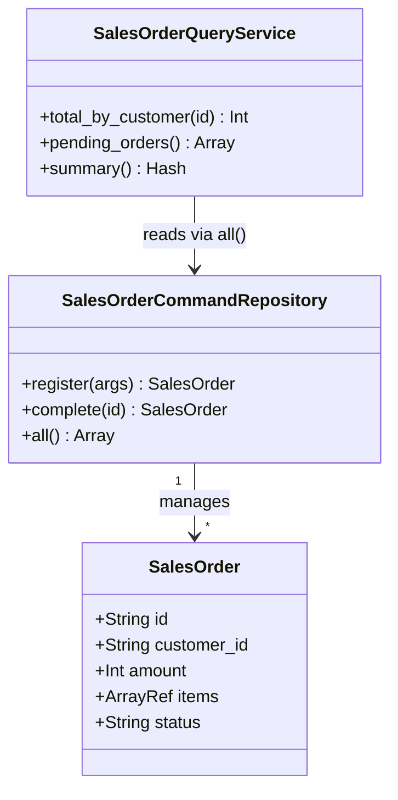

---
categories:
  - tech
date: 2026-04-04T07:07:05+09:00
description: 受注登録の修正でレポートが壊れる。集計変更でバリデーションが落ちる——読み書き混在リポジトリの呪縛をCQRSで断ち切るコード探偵ロックの推理。
draft: true
epoch: 1775254025
image: /favicon.png
iso8601: 2026-04-04T07:07:05+09:00
tags:
  - design-pattern
  - perl
  - moo
  - cqrs
  - mixed-repository
  - refactoring
  - code-detective
title: コード探偵ロックの事件簿【CQRS】読み書き混在の証言台〜書き込んで読めなくなったリポジトリの密室〜
toc: true
---

「受注登録のバリデーションを修正したんです。でもテストを走らせたら、ダッシュボードの集計テストが落ちました。触ってもいないのに」

私は高橋サクラ。社内の営業支援システムを担当しているバックエンドエンジニア、28歳。受注管理・ダッシュボード・月次レポート——全部ひとりで面倒を見ている。

本来なら誇らしいはずだ。でも最近は誇らしいと思う暇もなく、なぜか壊れたテストをひたすら直している。

受注バリデーションを修正すると、集計のテストが落ちる。集計クエリを最適化すると、バリデーションのテストが落ちる。コードを触るたびに想定外の場所が爆発する。なぜか。全部同じクラスに書いてあるから。

「レガシー・コード・インベスティゲーション（LCI）」

雑居ビルの三階、汗ばむような排熱の空気。デスクの上のエナジードリンク缶と、積み重なったキーボードたち。

椅子の男が、モニターを一瞥もせず言った。

「——告発と尋問を、同じ部屋でやっているのかね、ワトソン君」

「高橋です。告発じゃなくてリポジトリなんですが」

「同じことだよ」

## 現場検証：証言台を汚染した混在コード

コードを見せると、ロックは腕を組んで静止した。十秒ほどそのままだった。

```perl
package SalesOrderRepository;
use Moo;
use List::Util qw(sum0);

has _orders => (is => 'ro', default => sub { [] });

sub register {
    my ($self, %args) = @_;
    die "顧客IDが必要です\n"       unless $args{customer_id};
    die "金額は正の整数が必要です\n" unless ($args{amount} // 0) > 0;
    die "商品リストが必要です\n"     unless $args{items} && @{$args{items}};
    my $order = {
        id          => sprintf('ORD-%04d', scalar(@{$self->_orders}) + 1),
        customer_id => $args{customer_id},
        amount      => $args{amount},
        items       => $args{items},
        status      => 'pending',
        created_at  => time(),
    };
    push @{$self->_orders}, $order;
    return $order;
}

sub complete_order { ... }   # ステータス変更
sub total_by_customer { ... } # 顧客別合計
sub pending_orders { ... }    # 保留件数
sub summary { ... }           # 月次サマリー
```

「`SalesOrderRepository`——一つのクラスに五つのメソッド。うち二つは書き込み、三つは読み取りだ」

「分けようかとも思ったんですが、受注データにアクセスするのは全部ここだから、まとめた方が管理しやすいかなと」

「管理しやすい？」ロックは指を三本立てた。「`register`は告発状だ——正確なバリデーションと不変条件を守る責任がある。`summary`は証言記録だ——速く、読みやすく、表示に最適化する責任がある。この二つは何から何まで目的が違う。なぜ同じ部屋に閉じ込めた」

「……同じデータを扱うから、でしょうか」

「探偵と被告が同じ部屋にいたら、証言が汚染される。これはその状態だ」

アンチパターンに名前をつけるなら**Mixed Repository（読み書き混在リポジトリ）**。書き込み側と読み取り側が互いの変更に引っ張られ、単一責任の原則が崩れていく。

## 推理披露：告発台と証言台の分離

「解決策は単純だ。Command（書く）とQuery（読む）を、別々の部屋に移す」

これが**CQRS（Command Query Responsibility Segregation）**の核心だとロックは言った。

- **Command**: 状態を変える。バリデーションと業務ルールの不変条件を守る責任のみ
- **Query**: 状態を読む。集計・フィルタ・表示に最適化する責任のみ

「書く者と読む者は、目的が違う。目的が違えば、変更する理由が違う。変更する理由が違うなら、同じクラスに入れてはいけない」

まずCollect（集約）クラスを定義する。

```perl
package SalesOrder;
use Moo;
use Types::Standard qw(Str Int ArrayRef);

has id          => (is => 'ro', isa => Str,      required => 1);
has customer_id => (is => 'ro', isa => Str,      required => 1);
has amount      => (is => 'ro', isa => Int,      required => 1);
has items       => (is => 'ro', isa => ArrayRef, required => 1);
has status      => (is => 'rw',                  default  => 'pending');
has created_at  => (is => 'ro', isa => Int,      required => 1);
```

次に**Command側**——書き込み専用のリポジトリ。

```perl
package SalesOrderCommandRepository;
use Moo;

has _store => (is => 'ro', default => sub { [] });

sub register {
    my ($self, %args) = @_;
    die "顧客IDが必要です\n"       unless $args{customer_id};
    die "金額は正の整数が必要です\n" unless ($args{amount} // 0) > 0;
    die "商品リストが必要です\n"     unless $args{items} && @{$args{items}};

    my $order = SalesOrder->new(
        id          => sprintf('ORD-%04d', scalar(@{$self->_store}) + 1),
        customer_id => $args{customer_id},
        amount      => $args{amount},
        items       => $args{items},
        created_at  => time(),
    );
    push @{$self->_store}, $order;
    return $order;
}

sub complete {
    my ($self, $order_id) = @_;
    my ($order) = grep { $_->id eq $order_id } @{$self->_store};
    die "受注が見つかりません\n" unless $order;
    $order->status('completed');
    return $order;
}

sub all { return @{$_[0]->_store} }
```

「`SalesOrderCommandRepository`には`register`と`complete`だけ。集計のメソッドは一つもない」

「では集計はどこに？」

「**Query側**に任せる」

```perl
package SalesOrderQueryService;
use Moo;
use List::Util qw(sum0);

has _command_repo => (is => 'ro', required => 1);

sub total_by_customer {
    my ($self, $customer_id) = @_;
    return sum0(map  { $_->amount }
                grep { $_->customer_id eq $customer_id }
                $self->_command_repo->all);
}

sub pending_orders {
    my ($self) = @_;
    return grep { $_->status eq 'pending' } $self->_command_repo->all;
}

sub summary {
    my ($self) = @_;
    my @orders = $self->_command_repo->all;
    return {
        count   => scalar @orders,
        total   => sum0(map { $_->amount } @orders),
        pending => scalar(grep { $_->status eq 'pending' } @orders),
    };
}
```

「`SalesOrderQueryService`は`_command_repo`からデータを受け取るが、書き込みメソッドは持たない。告発台と証言台を完全に分けた」

使い方はこうなる。

```perl
my $cmd = SalesOrderCommandRepository->new;
my $qry = SalesOrderQueryService->new(_command_repo => $cmd);

# 書き込みはCommandへ
$cmd->register(customer_id => 'CUST-001', amount => 5000, items => ['商品A']);

# 読み取りはQueryへ
my $total = $qry->total_by_customer('CUST-001');  # 5000
my $s     = $qry->summary;  # { count => 1, total => 5000, pending => 1 }
```

「バリデーションのルールを変えたければ`SalesOrderCommandRepository`だけ触ればいい。集計ロジックを最適化したければ`SalesOrderQueryService`だけ触ればいい。互いは干渉しない」



私はコードを見比べた。Before では一つのクラスがすべてを担っていた。After では目的が違う二つのクラスが、それぞれの責任だけを持つ。

「……これで、集計を変えても受注バリデーションのテストは落ちないんですか？」

「当然だね。証言担当者が証言の書き方を変えても、告発担当者の仕事には影響しない」

## 事件解決：二つの部屋で整う証言

テストを走らせた。

```
# Subtest: After: FIX — CommandとQueryの責任が完全に分離されている
ok 3 - FIX: CommandにQueryメソッドが混入していない
ok 4 - FIX: CommandにQueryメソッドが混入していない
ok 5 - FIX: CommandにQueryメソッドが混入していない
ok 9 - FIX: QueryにCommandメソッドが混入していない
ok 10 - FIX: QueryにCommandメソッドが混入していない
1..10
ok 5 - After: FIX — CommandとQueryの責任が完全に分離されている

# Subtest: After: FIX — Queryのロジック変更がCommandに影響しない
ok 1 - FIX: Command側のテストはQuery側変更に無関係
1..1
ok 6 - After: FIX — Queryのロジック変更がCommandに影響しない
```

全テスト、警告ゼロでパスした。

「これで集計ロジックを変えても受注のテストは安全です。やっと安心して変更できる」

「*安心して変更できる*——それが優れた設計の証明だよ、ワトソン君」

ロックはエナジードリンクを一気に飲み干した。

「ところで報酬だが、メカニカルキーボード用のパームレストを忘れていないね？革製で頼む」

革製のパームレストがキーボード用品なのか家具なのか判断しかねながら、私は事務所を後にした。

---

## 探偵の調査報告書

| 容疑（アンチパターン） | 真実（パターン） | 証拠（効果） |
|---|---|---|
| Mixed Repository — 書き込み（バリデーション）と読み取り（集計）が同一クラスに同居し、変更が互いに干渉する | CQRS — CommandとQueryを別クラスに分離し、それぞれが単一の責任のみを持つ | 集計ロジックの変更がバリデーションのテストに影響しない。受注ルールの変更が集計コードに影響しない |
| 単一責任原則の違反 — 変更する理由が複数あるクラスは壊れやすい | 目的別の責任分離 — 「書く」クラスと「読む」クラスは変更理由が異なるため、分けることで安定する | `SalesOrderCommandRepository`と`SalesOrderQueryService`が互いに独立して変更・テストできる |

### 推理のステップ

1. **責任を識別する** — 既存リポジトリのメソッドを「状態を変えるもの（Command）」と「状態を読むもの（Query）」に分類する
2. **Aggregateを定義する** — 書き込み・読み取り両方が扱うデータ構造を`SalesOrder`等のクラスとして定義する
3. **CommandRepositoryを作る** — バリデーションと業務ルールを持つ書き込み専用のクラスを分離する。`register`・`complete`等の変更操作のみを持つ
4. **QueryServiceを作る** — 集計・フィルタ・表示に特化した読み取り専用のクラスを分離する。`total_by_customer`・`summary`等の参照操作のみを持つ
5. **テストを分ける** — CommandのテストはCommandのみを検証し、QueryのテストはQueryのみを検証する。互いのテストが干渉しないことを確認する

### ロックより

書くことと読むことは、同じ行為ではない。書く者には正確さが求められ、読む者には速さと柔軟性が求められる。同じ責任者に両方を押しつけたとき、どちらも中途半端になる——それがMixed Repositoryの本質的な罪だ。

CQRSはシステムを「命令する者」と「問い合わせる者」に分ける。次の事件では、昨日解決したEvent Sourcingと組み合わせてみたまえ。Command側にイベントを積み上げ、Query側でそのイベントをリプレイして最適化されたビューを作る——それが本格的なEvent-Driven Architectureの入り口だ。
