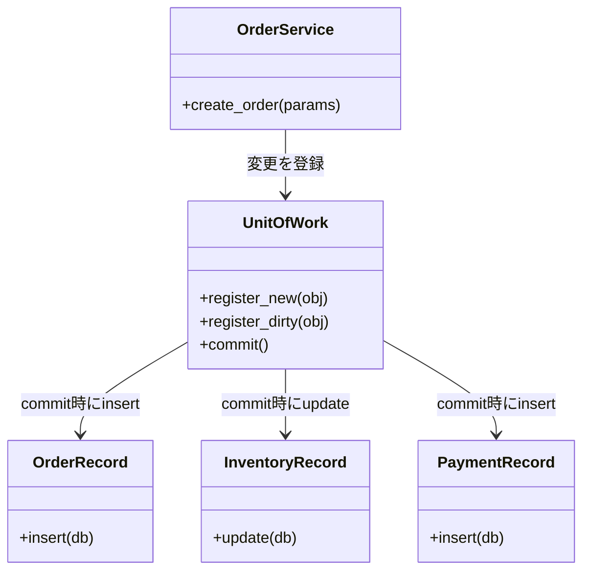

---
categories:
  - tech
date: 2026-04-05T07:07:05+09:00
description: 注文は完了しているのに在庫が減らない——エラーログも残さず消える整合性を、Unit of Workパターンで一括封印するコード探偵ロックの推理。
draft: false
epoch: 1775340425
image: /public_images/2026/code-detective-unit-of-work/header.webp
iso8601: 2026-04-05T07:07:05+09:00
tags:
  - design-pattern
  - perl
  - moo
  - unit-of-work
  - scattered-writes
  - refactoring
  - code-detective
title: コード探偵ロックの事件簿【Unit of Work】宙に浮く証拠品の行方〜バラバラに届く提出書類と壊れた帳簿〜
toc: true
---

十三回目の月曜日だった。

僕は田中誠、三十二歳。担当するECサイトの受注処理を一人で面倒を見ているバックエンドエンジニアだ。今朝もまた、注文テーブルにレコードがあるのに在庫テーブルが動いていない。支払いテーブルも空白のまま。エラーログは出ていない。アプリケーションは正常に動いている。なのに帳簿が合わない。

十三回目ともなると、手動修正の手順は体が覚えている。注文IDを控え、在庫テーブルを手で減算し、支払いレコードを手で追加する。だいたい二十分。だいたい毎週。だいたい月曜。

最初の月は「たまたまだ」と思っていた。二ヶ月目は「環境起因かもしれない」と調べた。三ヶ月目の今、僕は原因を突き止めることを半ば諦めて、代わりに手順書の精度を上げることに注力していた。

先週、社内のエンジニア向けSlackチャンネルに「原因不明のDB不整合について」と投稿した。いくつかのリアクションと、一件のDM。知らないアカウントからだった。

> コードを見せていただければ、原因は分かると思います。——Locke

プロフィールには「レガシー・コード・インベスティゲーション（LCI）」とだけ書いてあった。検索しても公式サイトすら出てこない。怪しかった。しかし十三回目の月曜を過ごした人間に、怪しさを気にする余裕はなかった。

翌日の夕方、指定された住所に向かった。ビルの入口にある案内板に「LCI」の文字はなく、代わりに手書きのインデックスカードがテープで貼ってある。階段を上がると、半開きのドアの向こうに男が一人いた。

デスクの上にはO'Reillyのラクダ本が三冊——版違いで並べてある。男はそのうちの一冊を開いたまま、虫眼鏡でページの活字を覗き込んでいた。

「ああ。Slackの件だね」

こちらを見ずに言った。虫眼鏡はまだ本の上にある。

「田中です。DBの不整合について相談したくて——」

「座りたまえ、ワトソン君」

何のことか分からなかったが、とにかく椅子を引いた。

## 現場検証：バラバラに提出される三通の証拠書類

ノートPCを開いてリポジトリを見せた。男——ロックさんは虫眼鏡を置き、画面に顔を近づけた。

```perl
package OrderService;
use Moo;

has _order_repo     => (is => 'ro', required => 1);
has _inventory_repo => (is => 'ro', required => 1);
has _payment_repo   => (is => 'ro', required => 1);

sub create_order {
    my ($self, %params) = @_;

    my $order = {
        id       => 'ORD-' . ($self->_order_repo->count + 1),
        item_id  => $params{item_id},
        quantity => $params{quantity},
        user_id  => $params{user_id},
    };

    $self->_order_repo->save($order);                         # 1. 注文を保存
    $self->_inventory_repo->decrease(                         # 2. 在庫を減らす
        $params{item_id}, $params{quantity}
    );
    $self->_payment_repo->save({                              # 3. 支払いを保存
        order_id => $order->{id},
        amount   => $params{amount},
    });

    return $order;
}
```

しばらく無言だった。ロックさんはラクダ本を閉じ、その上に両手を重ねた。

「三通の書類を、三人の別々の窓口に提出している」

「書類？」

「`_order_repo->save`、`_inventory_repo->decrease`、`_payment_repo->save`——それぞれが独立した書き込み操作だ。一番目の窓口で受理された時点で、注文レコードはDBに確定する。二番目の窓口が閉まっていたら？」

僕はモニターに目を戻した。コードの行をもう一度追う。save, decrease, save。三つの操作が順番に並んでいる。

「二番目が失敗しても、一番目はもう書き込まれている——ということですか」

「そこまでは分かっているようだね」

「いえ、分かっていたら三ヶ月も手動修正してません」

ロックさんは初めてこちらを見た。

「知っていることと、見えていることは違う。君はコードの行を読んでいた。だが書き込みの境界を見ていなかった」

在庫サービスで稀に発生するタイムアウト。同時アクセスによるロック競合。理由は何であれ、二番目の操作が失敗した瞬間、一番目の注文レコードだけが宙に浮く。エラーは呼び出し元に伝播するが、注文はすでに保存済み。ログにはエラーが記録されても、保存済みの注文レコードは戻らない。

**Scattered Writes（散弾銃的DB更新）**。複数の書き込み操作を「まとめて成功するか、まとめて失敗するか」という単位で管理しないまま、個別に実行してしまう構造的欠陥だ。

「でも、この三つの操作は業務上ひとまとまりのはずです。注文と在庫と支払いは——」

「その通り。業務上ひとまとまりの操作が、コード上ではばらばらになっている。だから帳簿が壊れる」

## 推理披露：証拠品を一括封印する金庫

「解決の方針は、すべての書類を一つの金庫に入れて、まとめて提出するか、まとめて破棄するかのどちらかにすることだ」

「金庫？」

「**Unit of Work**。作業単位という意味だ。複数の変更操作を一つのオブジェクトに登録しておいて、最後にまとめてコミットする。途中で何かが失敗したら、金庫ごと破棄して全変更を取り消す」

ロックさんはラクダ本を脇に寄せてキーボードに向かった。

まず、変更を「いつ書くか」から分離する。ドメインオブジェクトに`insert`と`update`メソッドを持たせて、呼ばれるまで実際のDBには触れないようにする。

```perl
package OrderRecord;
use Moo;

has id       => (is => 'ro', required => 1);
has item_id  => (is => 'ro', required => 1);
has quantity => (is => 'ro', required => 1);
has user_id  => (is => 'ro', required => 1);

sub insert {
    my ($self, $db) = @_;
    push @{ $db->orders }, {
        id => $self->id, item_id => $self->item_id,
        quantity => $self->quantity, user_id => $self->user_id,
    };
}
```

```perl
package InventoryRecord;
use Moo;

has item_id      => (is => 'ro', required => 1);
has new_quantity => (is => 'rw', required => 1);

sub update {
    my ($self, $db) = @_;
    $db->inventory->{ $self->item_id } = $self->new_quantity;
}
```

「`OrderRecord`は注文データを保持するだけだ。`insert`が呼ばれて初めてDBに書く。`InventoryRecord`も同じ。計算は先に済ませ、書き込みは後回しにする」

「後回しにしたら、誰がいつ書くんですか」

「それが**Unit of Work**の仕事だ」

```perl
package UnitOfWork;
use Moo;
use Carp qw(croak);

has _db            => (is => 'ro', required => 1);
has _new_objects   => (is => 'ro', default  => sub { [] });
has _dirty_objects => (is => 'ro', default  => sub { [] });

sub register_new {
    my ($self, $obj) = @_;
    push @{ $self->_new_objects }, $obj;
    return $self;
}

sub register_dirty {
    my ($self, $obj) = @_;
    push @{ $self->_dirty_objects }, $obj;
    return $self;
}

sub commit {
    my ($self) = @_;
    my $db = $self->_db;

    # スナップショットを保存（トランザクションの代わり）
    my $snapshot = {
        orders    => [ @{ $db->orders } ],
        inventory => { %{ $db->inventory } },
        payments  => [ @{ $db->payments } ],
    };

    eval {
        for my $obj (@{ $self->_new_objects }) {
            $obj->insert($db);
        }
        for my $obj (@{ $self->_dirty_objects }) {
            $obj->update($db);
        }
    };
    if (my $err = $@) {
        # ロールバック：スナップショットを復元
        $db->orders(   $snapshot->{orders}    );
        $db->inventory($snapshot->{inventory} );
        $db->payments( $snapshot->{payments}  );
        croak $err;
    }
}
```

「`register_new`で新しく作る書類を登録。`register_dirty`で変更済みの書類を登録。そして`commit`——金庫の扉を閉じて、すべてを一括で提出する。途中でエラーが起きれば、スナップショットで元に戻す」

僕は`commit`の中身をもう一度読んだ。`eval`の中で`insert`と`update`を回して、失敗したら`$snapshot`で復元する。理屈は分かる。だが引っかかることがあった。

「スナップショットのコピーを毎回取るのは、パフォーマンス的に問題ないですか」

「実運用ではDBのトランザクション——`begin_work`と`commit`、`rollback`——を使う。インメモリのスナップショットは原理を見せるための模型だよ。本物のDBなら、スナップショットのコストはDBエンジンが引き受ける」

なるほど。模型として理解すれば、原子性の仕組みが見える。

「では、`OrderService`はこう書き直せる」

```perl
package OrderService;
use Moo;

has _db => (is => 'ro', required => 1);

sub create_order {
    my ($self, %params) = @_;
    my $db = $self->_db;

    my $current_stock = $db->inventory->{ $params{item_id} } // 0;
    die "在庫不足: $params{item_id}\n" if $current_stock < $params{quantity};

    my $order = OrderRecord->new(
        id       => 'ORD-' . (scalar(@{ $db->orders }) + 1),
        item_id  => $params{item_id},
        quantity => $params{quantity},
        user_id  => $params{user_id},
    );

    my $inventory = InventoryRecord->new(
        item_id      => $params{item_id},
        new_quantity => $current_stock - $params{quantity},
    );

    my $payment = PaymentRecord->new(
        order_id => $order->id,
        amount   => $params{amount},
    );

    # すべての変更を Unit of Work に登録し、一括コミット
    UnitOfWork->new(_db => $db)
        ->register_new($order)
        ->register_dirty($inventory)
        ->register_new($payment)
        ->commit;

    return $order;
}
```

「`_order_repo->save`が消えた」と僕は呟いた。

「気づいたね。`OrderService`はもうDBに直接書かない。`UnitOfWork`に変更を登録して、最後の`commit`だけが実際の書き込みを行う」

Beforeでは三つの独立した`save`が、それぞれの時点でDBを更新していた。Afterでは、三つの変更が`UnitOfWork`に預けられ、`commit`の一瞬だけDBに触れる。



「でも」と僕は食い下がった。「在庫の更新が失敗した場合、注文のinsertはもう実行されているんじゃないですか。`commit`の中で順番に呼んでいるなら——」

ロックさんは`commit`のコードを指差した。`eval`ブロックの直後、`if (my $err = $@)`の行を。

「失敗したらここに来る。`$snapshot`で三つのテーブルすべてを巻き戻す。注文も、在庫も、支払いも。`eval`の中で最初の`insert`が成功していても、スナップショットが上書きするから結果としてなかったことになる」

ようやく腑に落ちた。`save`を個別に呼んでいたから壊れていたのではなく、「壊れたときに戻す仕組み」がなかったから壊れていたのだ。

## 事件解決：整合性が戻った帳簿

テストを走らせた。

```
# Subtest: After: FIX — 在庫更新が失敗すると全変更がロールバックされる
ok 2 - FIX: 注文は保存されていない（ロールバック済み）
ok 3 - FIX: 在庫も元に戻っている
ok 4 - FIX: 支払いも保存されていない
1..4
ok 3 - After: FIX — 在庫更新が失敗すると全変更がロールバックされる

# Subtest: After: UnitOfWork の構造 — 責任が明確に分離されている
ok 4 - FIX: OrderService が直接 save しない
1..4
ok 4 - After: UnitOfWork の構造 — 責任が明確に分離されている
```

全テスト、警告ゼロ。

在庫更新が失敗しても注文レコードは残らない。正常系では三つのデータがすべて揃って保存される。どちらか一方しかない。

「……田中です。さっきからワトソン君って呼ばれてますけど」

「ああ。助手にはそう呼ぶことにしている」

訂正する気力もなかった。ロックさんはすでにラクダ本を開き直して、虫眼鏡を構えている。話は終わったらしい。

僕は礼を言って立ち上がった。報酬の話は出なかった。出口でふと振り返ると、ロックさんは活字を追いながら小さく手を振った。

次の月曜の朝、帳簿は合っていた。

---

## 探偵の調査報告書

| 容疑（アンチパターン） | 真実（パターン） | 証拠（効果） |
|---|---|---|
| Scattered Writes — 注文・在庫・支払いへの書き込みが個別に実行され、途中失敗で整合性のないデータが残る | Unit of Work — すべての変更を一つのオブジェクトに登録し、`commit`で一括適用。失敗時はロールバックで全変更を取り消す | 在庫更新が失敗しても注文レコードは残らない。三つのデータが常に揃って保存されるか、揃って保存されないかのどちらかになる |
| 原子性の欠如 — 複数の書き込み操作を「全成功か全失敗か」という単位で管理していない | トランザクション的な一貫性 — `register_new`・`register_dirty`で変更を追跡し、`commit`時にまとめてDBへ反映する | OrderServiceは直接DBに書かなくなる。書き込みの責任がUnitOfWorkに集約され、整合性の保証が一箇所にまとまる |

### 推理のステップ

1. **Scattered Writesを識別する** — 同一ユースケースの中に複数の独立した`save`・`update`呼び出しがある箇所を探す。これが整合性バグの温床になっている
2. **ドメインオブジェクトに`insert`/`update`を持たせる** — 書き込みのタイミングをオブジェクト自身から切り離す。オブジェクトは変更を保持し、実際の書き込みはUnitOfWorkに委ねる
3. **UnitOfWorkを実装する** — `register_new`（新規作成）・`register_dirty`（更新）で変更を登録する。`commit`でスナップショットを保存してから全操作を実行し、失敗時はスナップショットで復元する
4. **Serviceのsaveを置き換える** — OrderServiceなどから直接リポジトリへの書き込みを除き、代わりにUnitOfWorkへの登録に変える。最後の`commit`一行で全変更が確定される
5. **失敗シナリオをテストする** — 中間操作が失敗した場合に、すでに実行された操作も巻き戻されることをテストで確認する。これがUnit of Workの核心的な保証だ

### ロックより

三つの窓口に三枚の書類を出して、二枚目で窓口が閉まったとき、一枚目はもう受理されている。取り下げに行く仕組みがなければ、帳簿は静かに壊れていく。そして壊れた帳簿は、エラーログよりもたちが悪い。「正常に完了した」という記録が残っているからだ。

Unit of Workは、その取り下げの仕組みを一箇所に集約する。実運用では、インメモリのスナップショットではなくDBのトランザクション（`begin_work`/`commit`/`rollback`）と組み合わせることで、より堅牢な原子性が得られる。金庫の鍵は一つでいい。
