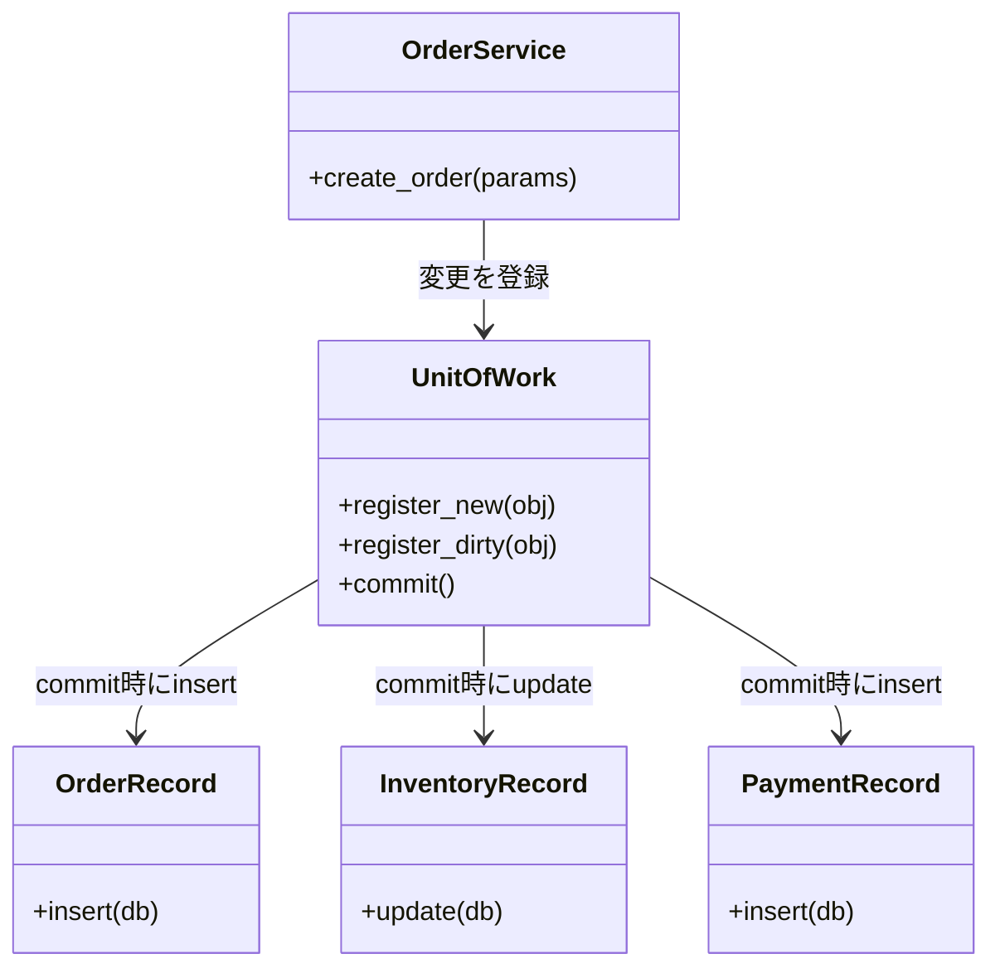

---
categories:
  - tech
date: 2026-04-05T07:07:05+09:00
description: 注文は完了しているのに在庫が減らない——エラーログも残さず消える整合性を、Unit of Workパターンで一括封印するコード探偵ロックの推理。
draft: false
epoch: 1775340425
image: /public_images/2026/code-detective-unit-of-work/header.webp
iso8601: 2026-04-05T07:07:05+09:00
tags:
  - design-pattern
  - perl
  - moo
  - unit-of-work
  - scattered-writes
  - refactoring
  - code-detective
title: コード探偵ロックの事件簿【Unit of Work】宙に浮く証拠品の行方〜バラバラに届く提出書類と壊れた帳簿〜
toc: true
---

「注文は完了しています。でも在庫は減っていません。しかもログには何も残っていない」

僕は田中誠、三十二歳。担当するECサイトの受注処理を一人で面倒を見ているバックエンドエンジニアだ。

月曜の朝はいつもこうだった。顧客から「在庫があるはずなのに買えない」「注文が入っているのに商品が出荷されない」というメールが届く。DBを覗くと、注文テーブルにはレコードがある。でも在庫テーブルは何も変わっていない。支払いテーブルも空白のままだ。

エラーログは出ていない。アプリケーションは正常に動いている。なのに帳簿が合わない。

最初の月は「週一の不運だ」と思っていた。二ヶ月目は「何か環境問題か」と思っていた。三ヶ月目の今、僕は原因を突き止めることを諦め、毎週月曜の朝に手動でDBを修正することを諦めていなかった。

限界だった。

「レガシー・コード・インベスティゲーション（LCI）」

雑居ビルの三階。うっすらと埃っぽい廊下を歩くと、排熱の熱気が足元から漂ってくる。扉を開けると、デスクの上にエナジードリンクの缶が六本、三種類のメカニカルキーボードが並んでいた。

椅子に深々と沈んだ男が、こちらを見もせず言った。

「——宙に浮いた証拠品のにおいがするよ、ワトソン君」

「田中です。証拠品じゃなくて注文データなんですが」

「同じことだ。座りたまえ」

## 現場検証：バラバラに提出される三通の証拠書類

コードを見せると、男——ロックは指先だけでキーボードを引き寄せ、画面を睨んだ。

```perl
package OrderService;
use Moo;

has _order_repo     => (is => 'ro', required => 1);
has _inventory_repo => (is => 'ro', required => 1);
has _payment_repo   => (is => 'ro', required => 1);

sub create_order {
    my ($self, %params) = @_;

    my $order = {
        id       => 'ORD-' . ($self->_order_repo->count + 1),
        item_id  => $params{item_id},
        quantity => $params{quantity},
        user_id  => $params{user_id},
    };

    $self->_order_repo->save($order);                         # 1. 注文を保存
    $self->_inventory_repo->decrease(                         # 2. 在庫を減らす
        $params{item_id}, $params{quantity}
    );
    $self->_payment_repo->save({                              # 3. 支払いを保存
        order_id => $order->{id},
        amount   => $params{amount},
    });

    return $order;
}
```

沈黙が続いた。十秒ほどそのままだった。

「三通の証拠書類を、三人の別々の担当者に提出させているな」

「は？」

「`$order_repo->save`、`$inventory_repo->decrease`、`$payment_repo->save`——それぞれ独立した操作だ。一番目が完了した時点で注文レコードはDBに書き込まれる。二番目が何らかの事情で失敗した場合、注文だけが残り、在庫も支払いも更新されない」

「……それが、月曜の朝に起きていることか」

「そうだね。在庫サービスで稀に発生するタイムアウトか、同時アクセスによるロック競合か、理由は何であれ——二番目の担当者が倒れた瞬間、一番目の提出書類だけが宙に浮く。ログにはエラーが残らない。DBには嘘のデータが残る」

アンチパターンに名前をつけるなら**Scattered Writes（散弾銃的DB更新）**。複数の書き込み操作を「まとめて成功するか、まとめて失敗するか」という単位で管理しないまま、個別に実行してしまう構造的欠陥だ。

「三ヶ月間、僕は何の手がかりも持てなかったわけですか」

「犯人は最初からいた。単に、捕まえる仕組みがなかっただけだよ」

## 推理披露：証拠品を一括封印する金庫

「解決策は一つだ。すべての証拠品を一つの金庫に預けて、まとめて提出する」

「金庫？」

「**Unit of Work**——作業単位。複数の変更操作を一つのオブジェクトに登録し、最後にまとめてコミットする。途中で何かが失敗すれば、金庫ごと破棄してすべてをなかったことにする」

ロックはキーボードを叩き始めた。

まず、変更を「いつ書くか」から分離するために、ドメインオブジェクトに`insert`と`update`メソッドを持たせる。

```perl
package OrderRecord;
use Moo;

has id       => (is => 'ro', required => 1);
has item_id  => (is => 'ro', required => 1);
has quantity => (is => 'ro', required => 1);
has user_id  => (is => 'ro', required => 1);

sub insert {
    my ($self, $db) = @_;
    push @{ $db->orders }, {
        id => $self->id, item_id => $self->item_id,
        quantity => $self->quantity, user_id => $self->user_id,
    };
}
```

```perl
package InventoryRecord;
use Moo;

has item_id      => (is => 'ro', required => 1);
has new_quantity => (is => 'rw', required => 1);

sub update {
    my ($self, $db) = @_;
    $db->inventory->{ $self->item_id } = $self->new_quantity;
}
```

「`OrderRecord`は注文データを保持するだけで、実際にDBへ書くのは`insert`が呼ばれた時だけだ。`InventoryRecord`も同様。計算は先に済ませておいて、書き込みは後回しにする」

「それを誰が引き受けるんですか」

「**Unit of Work**だ」

```perl
package UnitOfWork;
use Moo;
use Carp qw(croak);

has _db            => (is => 'ro', required => 1);
has _new_objects   => (is => 'ro', default  => sub { [] });
has _dirty_objects => (is => 'ro', default  => sub { [] });

sub register_new {
    my ($self, $obj) = @_;
    push @{ $self->_new_objects }, $obj;
    return $self;
}

sub register_dirty {
    my ($self, $obj) = @_;
    push @{ $self->_dirty_objects }, $obj;
    return $self;
}

sub commit {
    my ($self) = @_;
    my $db = $self->_db;

    # スナップショットを保存（トランザクションの代わり）
    my $snapshot = {
        orders    => [ @{ $db->orders } ],
        inventory => { %{ $db->inventory } },
        payments  => [ @{ $db->payments } ],
    };

    eval {
        for my $obj (@{ $self->_new_objects }) {
            $obj->insert($db);
        }
        for my $obj (@{ $self->_dirty_objects }) {
            $obj->update($db);
        }
    };
    if (my $err = $@) {
        # ロールバック：スナップショットを復元
        $db->orders(   $snapshot->{orders}    );
        $db->inventory($snapshot->{inventory} );
        $db->payments( $snapshot->{payments}  );
        croak $err;
    }
}
```

「`register_new`は新規作成する証拠品の登録。`register_dirty`は変更された証拠品の登録。そして`commit`——金庫の扉を閉じ、すべてをまとめて提出する。途中で失敗すれば、`commit`の内部でスナップショットを復元して、すべてをなかったことにする」

「……在庫の更新が失敗しても、注文は残らないんですか？」

「それが Unit of Work の目的だよ、ワトソン君」

`OrderService`も書き直した。

```perl
package OrderService;
use Moo;

has _db => (is => 'ro', required => 1);

sub create_order {
    my ($self, %params) = @_;
    my $db = $self->_db;

    my $current_stock = $db->inventory->{ $params{item_id} } // 0;
    die "在庫不足: $params{item_id}\n" if $current_stock < $params{quantity};

    my $order = OrderRecord->new(
        id       => 'ORD-' . (scalar(@{ $db->orders }) + 1),
        item_id  => $params{item_id},
        quantity => $params{quantity},
        user_id  => $params{user_id},
    );

    my $inventory = InventoryRecord->new(
        item_id      => $params{item_id},
        new_quantity => $current_stock - $params{quantity},
    );

    my $payment = PaymentRecord->new(
        order_id => $order->id,
        amount   => $params{amount},
    );

    # すべての変更を Unit of Work に登録し、一括コミット
    UnitOfWork->new(_db => $db)
        ->register_new($order)
        ->register_dirty($inventory)
        ->register_new($payment)
        ->commit;

    return $order;
}
```

「注目してほしいのは、`$order_repo->save`が消えたことだ。`OrderService`は直接DBに書かない。`UnitOfWork`に証拠品を登録するだけだ。そして最後に`commit`——金庫を閉めれば、すべてが原子的に保存される」

僕はコードを見比べた。

Beforeでは三つの独立した`save`が、それぞれの瞬間にDBへ書いていた。Afterでは、三つの変更が`UnitOfWork`という金庫に預けられ、`commit`が呼ばれた一瞬だけDBに触れる。



「三人の担当者に別々に頼むのをやめて、一人の金庫番に全部託す——それが Unit of Work だ」

## 事件解決：整合性が戻った帳簿

テストを走らせた。

```
# Subtest: After: FIX — 在庫更新が失敗すると全変更がロールバックされる
ok 2 - FIX: 注文は保存されていない（ロールバック済み）
ok 3 - FIX: 在庫も元に戻っている
ok 4 - FIX: 支払いも保存されていない
1..4
ok 3 - After: FIX — 在庫更新が失敗すると全変更がロールバックされる

# Subtest: After: UnitOfWork の構造 — 責任が明確に分離されている
ok 4 - FIX: OrderService が直接 save しない
1..4
ok 4 - After: UnitOfWork の構造 — 責任が明確に分離されている
```

全テスト、警告ゼロでパスした。

在庫更新が失敗した場合に注文レコードが残らないことを確認した。正常系では三つのデータがすべて揃って保存されることも確認した。

「これで月曜の朝が怖くなくなります」

「当然だね。証拠品はまとめて提出するか、まとめて破棄するかどちらかだ。半端に宙に浮かせることはもうできない」

ロックはエナジードリンクを一本開けた。

「報酬だが——このリポジトリの行数と同じミリ数のバーボンでいい」

行数を数えたら二百行を超えていた。二百ミリのバーボンが何に換算されるのか判断しかねながら、僕は事務所を後にした。

次の月曜の朝、帳簿は合っていた。

---

## 探偵の調査報告書

| 容疑（アンチパターン） | 真実（パターン） | 証拠（効果） |
|---|---|---|
| Scattered Writes — 注文・在庫・支払いへの書き込みが個別に実行され、途中失敗で整合性のないデータが残る | Unit of Work — すべての変更を一つのオブジェクトに登録し、`commit`で一括適用。失敗時はロールバックで全変更を取り消す | 在庫更新が失敗しても注文レコードは残らない。三つのデータが常に揃って保存されるか、揃って保存されないかのどちらかになる |
| 原子性の欠如 — 複数の書き込み操作を「全成功か全失敗か」という単位で管理していない | トランザクション的な一貫性 — `register_new`・`register_dirty`で変更を追跡し、`commit`時にまとめてDBへ反映する | OrderServiceは直接DBに書かなくなる。書き込みの責任がUnitOfWorkに集約され、整合性の保証が一箇所にまとまる |

### 推理のステップ

1. **Scattered Writesを識別する** — 同一ユースケースの中に複数の独立した`save`・`update`呼び出しがある箇所を探す。これが整合性バグの温床になっている
2. **ドメインオブジェクトに`insert`/`update`を持たせる** — 書き込みのタイミングをオブジェクト自身から切り離す。オブジェクトは変更を保持し、実際の書き込みはUnitOfWorkに委ねる
3. **UnitOfWorkを実装する** — `register_new`（新規作成）・`register_dirty`（更新）で変更を登録する。`commit`でスナップショットを保存してから全操作を実行し、失敗時はスナップショットで復元する
4. **Serviceのsaveを置き換える** — OrderServiceなどから直接リポジトリへの書き込みを除き、代わりにUnitOfWorkへの登録に変える。最後の`commit`一行で全変更が確定される
5. **失敗シナリオをテストする** — 中間操作が失敗した場合に、すでに実行された操作も巻き戻されることをテストで確認する。これがUnit of Workの核心的な保証だ

### ロックより

証拠品は、まとめて提出されるか、まとめて破棄されるかのどちらかであるべきだ。半分だけ提出された証拠は、存在しないよりも厄介だ——なぜなら「あるはずのものがある」という誤った確信を生むからだ。

Unit of Workは、複数の書き込みを「一つの作業単位」として扱う。DBのトランザクションと同じ考え方だが、そのトランザクション境界をアプリケーション層で明示的にコントロールできる点が強みだ。今回はインメモリのスナップショットで再現したが、実際のシステムではDBH（データベースハンドル）の`begin_work`と`commit`/`rollback`と組み合わせることで、より確実な原子性が得られる。

次の事件が待っているよ、ワトソン君——整合性が確保できたなら、次は「何を・いつ・誰が変えたか」を追跡する番だ。
