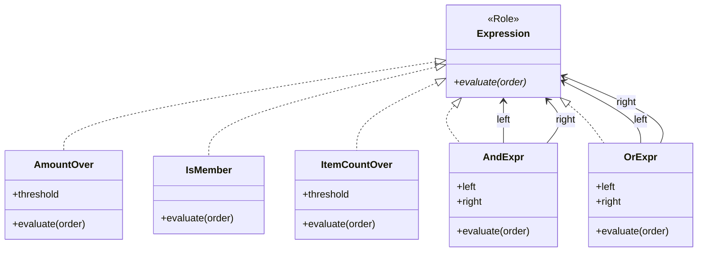

---
categories:
  - tech
date: 2026-04-06T07:07:05+09:00
description: 割引ルールが300行のif/elsifに石化したECサイト。ルール追加のたびにデグレが起き、誰も全容を読めなくなった暗号文書にInterpreterパターンで文法を与え、宣言的にルールを組み立てるコード探偵ロックの推理。
draft: true
epoch: 1775426825
image: /public_images/2026/code-detective-interpreter/header.webp
iso8601: 2026-04-06T07:07:05+09:00
tags:
  - design-pattern
  - perl
  - moo
  - interpreter
  - hardcoded-business-rules
  - refactoring
  - code-detective
title: コード探偵ロックの事件簿【Interpreter】失われた言語の鍵〜硬直した規則の牢獄〜
toc: true
---

「割引ルールを3つ追加してほしいと言われたんですが、触るたびに別のルールが壊れるんです。もう誰もあのコードの全容を把握していません」

僕は三島カズキ。社内ECサイトのバックエンド開発を担当している30代のエンジニアだ。入社6年目。

担当しているのはプロモーション管理——つまり割引ルールの実装だ。会員なら15%、1万円以上なら10%、まとめ買いなら5%。最初は3つしかなかったルールが、マーケティング部の「ちょっとこの条件も追加して」の積み重ねで、気づけば `calculate` メソッドは300行を超えるif/elsifの塊になっていた。

先月、「会員かつ5点以上購入で8%引き」というルールを追加した。翌日、本番で「1万円以上の非会員に10%割引が適用されない」という障害が発生した。if/elsifの順番を1行間違えたのだ。その修正で今度は3点以上の割引が二重適用された。もぐら叩きだ。

そして今週、マーケティング部から来週までに新しい複合条件ルールを3つ追加するよう依頼が来た。あの300行のif/elsifに、だ。

僕は藁にもすがる思いで、ネットで見つけた怪しげな看板の住所を訪ねた。

雑居ビルの3階。くすんだガラスの向こうに金文字で——

「レガシー・コード・インベスティゲーション（LCI）」

ドアを開けた瞬間、デスクトップPCの排熱と、飲みかけのモンスターエナジーの甘い匂いが混ざった空気が押し寄せた。デスクの上にはエナジードリンクの空き缶が3段に積み上げられ、その横に黄ばんだペーパーバックが山と積まれている。表紙を見ると『The Art of Computer Programming』の各巻が3冊ずつある。コレクターなのか、それとも読み返しすぎて買い直しているのか。

革張りの椅子に座った男——胸元の名札に「Locke - Code Detective」と書いてある——は、僕が差し出した印刷コードの束を一瞥して目を細めた。

「——ほう。古代文明の暗号文書を持ってきたね、ワトソン君」

「三島です。暗号文書じゃなくて、割引計算のコードなんですが」

「同じことだよ」ロックは紙束を鼻先に近づけ、くんくんと匂いを嗅ぐ仕草をした。コードの匂いを嗅ぐ、というのは比喩だと思っていたが、この男は物理的にやるらしい。「300行のif/elsif。文法なし、構造なし。書いた本人すら読めない。これは暗号文書と呼ぶほかないね」

「……確かに、前任者はもう退職していて」

「初歩的な（コードの）においだよ、ワトソン君。このコードには *言語* がない。だから誰も新しい文を書き足せない。来週までにルールを3つ追加？ 言語なき暗号文書に3行書き足すのは、解読不能の古文書に落書きをするようなものだ」

報酬の話になった。

「Knuthの『The Art of Computer Programming』第3巻、初版があるだろう？ それで手を打とう」

「ないです。あと、僕ワトソンじゃ——」

「細かいことはいい。さぁ、暗号の解読に取り掛かろう」

## 現場検証：文法なき暗号文書

ロックは僕のノートPCを無断で引き寄せた。礼儀作法をこの男に期待するだけ無駄だということは、エナジードリンク缶のピラミッドを見た時点で悟っていた。

「割引計算のコードを見せたまえ」

僕は `DiscountCalculator` を開いた。

```perl
package DiscountCalculator {
    use Moo;

    sub calculate ($self, $order) {
        # 会員かつ1万円以上 → 15%
        if ($order->total >= 10000 && $order->is_member) {
            return 0.15;
        }
        # 1万円以上（非会員含む） → 10%
        elsif ($order->total >= 10000) {
            return 0.10;
        }
        # 会員かつ5点以上 → 8%
        elsif ($order->is_member && $order->item_count >= 5) {
            return 0.08;
        }
        # 3点以上 → 5%
        elsif ($order->item_count >= 3) {
            return 0.05;
        }

        return 0;
    }
}
```

「本番ではこれが300行以上ありまして……ここでは代表的な4ルールだけ抜粋しています」

ロックは画面を睨みながら、ホワイトボードに何かを書き始めた。

```
if (A >= 10000 && B) → 0.15
elsif (A >= 10000) → 0.10
elsif (B && C >= 5) → 0.08
elsif (C >= 3) → 0.05
```

「見たまえ、ワトソン君。ここには *言語* がない」

「言語？」

「文法だよ。ルールを表現するための構造が存在しない。条件は `if` の壁に直接刻みつけられている。壁を壊さなければ一文字も変えられない——これが "硬直した規則の牢獄" の正体だ」

「でも、最初は3つしかルールがなくて、これで十分だったんです」

「3つの独房でも牢獄は牢獄だよ、ワトソン君。そして独房が増えるたびに、看守——つまり君——が壁を叩き壊して増築している。壊すたびに隣の独房まで崩れる。先月の障害はそれだろう？」

図星だった。

「さらに問題がある。新しいルールを追加したいとき、外部からルールを差し込む手段があるかね？」

「……ありません。`calculate` メソッドの中を直接書き換えるしか」

「つまりルールの追加は、必ず既存コードの改修を伴う。開放閉鎖の原則——拡張に対して開き、修正に対して閉じる——の真逆だね。犯人は見つかったよ」

ロックはホワイトボードに赤いマーカーで書いた。

**容疑者: Hardcoded Business Rules（石化したビジネスルール）**

## 推理披露：失われた言語を取り戻す

ロックは新しいエナジードリンクの缶を開けた。プシュッという音が事務所に響く。推理ショーの開幕ベルのつもりなのだろう。

「ワトソン君。暗号を解読する方法は2つある。一つは、暗号表を手に入れて一文字ずつ変換する。もう一つは——」

「もう一つは？」

「暗号に *言語* を与える。文法さえ定義すれば、誰でも新しい文を書けるようになる。失われた鍵を取り戻すんだ」

ロックの言い回しは相変わらず芝居がかっているが、要は「条件式をオブジェクトとして構造化する」ということだろう——と思った。

「まず、すべての条件式が従うべき契約書を作る」

### Expression ロール（文法の基盤）

```perl
package Expression {
    use Moo::Role;
    requires 'evaluate';
}
```

「`Expression` ロールは言語の基盤だ。`evaluate` メソッドを持つこと——これが文法のルールブックになる。この契約に従う者は、すべて *式* として扱える」

### Terminal Expression（終端記号）——単語を定義する

「まず、言語の *単語* を作る。一つ一つの条件判定がそれぞれ独立したオブジェクトになる」

```perl
package AmountOver {
    use Moo;
    use Types::Standard qw(Num);
    with 'Expression';

    has threshold => (is => 'ro', isa => Num, required => 1);

    sub evaluate ($self, $order) {
        return $order->total >= $self->threshold;
    }
}

package IsMember {
    use Moo;
    with 'Expression';

    sub evaluate ($self, $order) {
        return $order->is_member;
    }
}

package ItemCountOver {
    use Moo;
    use Types::Standard qw(Int);
    with 'Expression';

    has threshold => (is => 'ro', isa => Int, required => 1);

    sub evaluate ($self, $order) {
        return $order->item_count >= $self->threshold;
    }
}
```

「`AmountOver` は『注文金額が閾値以上か』を判定する単語。`IsMember` は『会員か否か』。`ItemCountOver` は『購入点数が閾値以上か』。それぞれが独立した *終端記号* だ。文法用語で言えば、これ以上分解できない最小単位の表現だよ」

「なるほど、個々の条件が1クラスになっているんですね。でもこれだけだと、`if ($order->total >= 10000 && $order->is_member)` みたいな *複合条件* はどう表現するんですか？」

「良い質問だよ、ワトソン君。単語だけでは文は作れない。次は *文法規則* だ」

### Non-terminal Expression（非終端記号）——文法規則を定義する

```perl
package AndExpr {
    use Moo;
    with 'Expression';

    has left  => (is => 'ro', required => 1);
    has right => (is => 'ro', required => 1);

    sub evaluate ($self, $order) {
        return $self->left->evaluate($order)
            && $self->right->evaluate($order);
    }
}

package OrExpr {
    use Moo;
    with 'Expression';

    has left  => (is => 'ro', required => 1);
    has right => (is => 'ro', required => 1);

    sub evaluate ($self, $order) {
        return $self->left->evaluate($order)
            || $self->right->evaluate($order);
    }
}
```

「`AndExpr` は2つの式を AND で結合する。`OrExpr` は OR だ。そしてここが重要——`AndExpr` 自体も `Expression` ロールを実装している。つまり `AndExpr` の中にさらに `AndExpr` を入れられる」

「入れ子にできる……ツリー構造ですか？」

「その通り。これが *構文木* だ。終端記号が葉、非終端記号が枝。どんなに複雑な条件でも、単語と文法規則の組み合わせで表現できる」



「言語が定義できたところで、次はルールの *翻訳* だ」

### DiscountRule と RuleEngine——文を読む翻訳機

```perl
package DiscountRule {
    use Moo;
    use Types::Standard qw(Num);

    has expression => (is => 'ro', required => 1);
    has rate       => (is => 'ro', isa => Num, required => 1);

    sub matches ($self, $order) {
        return $self->expression->evaluate($order);
    }
}

package RuleEngine {
    use Moo;
    use Types::Standard qw(ArrayRef);

    has rules => (is => 'ro', isa => ArrayRef, required => 1);

    sub calculate ($self, $order) {
        for my $rule (@{ $self->rules }) {
            return $rule->rate if $rule->matches($order);
        }
        return 0;
    }
}
```

「`DiscountRule` は条件式（Expression）と割引率のペア。`RuleEngine` はルール一覧を上から順に走査して、最初にマッチしたルールの割引率を返す」

「あ、これで if/elsif の順序がルールの並び順に置き換わるんですね」

「その通り。そして Beforeの4ルールを、この言語で翻訳するとこうなる」

```perl
my $engine = RuleEngine->new(
    rules => [
        # 会員かつ1万円以上 → 15%
        DiscountRule->new(
            expression => AndExpr->new(
                left  => AmountOver->new(threshold => 10000),
                right => IsMember->new,
            ),
            rate => 0.15,
        ),
        # 1万円以上 → 10%
        DiscountRule->new(
            expression => AmountOver->new(threshold => 10000),
            rate       => 0.10,
        ),
        # 会員かつ5点以上 → 8%
        DiscountRule->new(
            expression => AndExpr->new(
                left  => IsMember->new,
                right => ItemCountOver->new(threshold => 5),
            ),
            rate => 0.08,
        ),
        # 3点以上 → 5%
        DiscountRule->new(
            expression => ItemCountOver->new(threshold => 3),
            rate       => 0.05,
        ),
    ],
);
```

「これ、ただのクラス分けでは？」

「君はロゼッタ・ストーンをただの石板と呼ぶのかね？」ロックはエナジードリンクを一口飲んで続けた。「ロゼッタ・ストーンが偉大なのは、石に刻まれた文字ではない。*3つの言語で同じ文が書いてある* ことで、未知の言語に文法を与えたからだ。これも同じだよ。if/elsif の壁に刻まれた暗号に、`Expression` という文法を与えた。文法さえあれば——」

「新しい文が書ける」

「そういうことだ。新しいルールの追加に、既存コードの改修は1行も要らない」

## 解決：牢獄からの解放

ロックがテストを実行した。

```bash
$ prove -v t/interpreter.t
# Subtest: After: 会員かつ1万円以上 → 15%
    ok 1 - 会員+高額で最大割引
ok 1 - After: 会員かつ1万円以上 → 15%
# Subtest: After: 非会員で1万円以上 → 10%
    ok 1 - 非会員でも高額なら10%
ok 2 - After: 非会員で1万円以上 → 10%
# Subtest: After: 会員かつ5点以上 → 8%
    ok 1 - 会員+まとめ買いで8%
ok 3 - After: 会員かつ5点以上 → 8%
# Subtest: After: 3点以上 → 5%
    ok 1 - 非会員でも3点以上で5%
ok 4 - After: 3点以上 → 5%
# Subtest: After: 条件に合致しない → 0%
    ok 1 - 割引なし
ok 5 - After: 条件に合致しない → 0%
# Subtest: After: FIX — 新ルールを既存コード改修なしに追加できる
    ok 1 - FIX: 新ルールが適用される
    ok 2 - FIX: 既存ルールも正常
ok 6 - After: FIX — 新ルールを既存コード改修なしに追加できる
# Subtest: After: FIX — OrExpr で OR 条件を表現できる
    ok 1 - 会員なら適用
    ok 2 - 高額なら適用
    ok 3 - どちらでもなければ不適用
ok 7 - After: FIX — OrExpr で OR 条件を表現できる
# Subtest: After: FIX — Expression を does で確認できる
    ok 1 - AmountOver は Expression
    ok 2 - IsMember は Expression
    ok 3 - ItemCountOver は Expression
    ok 4 - AndExpr は Expression
    ok 5 - OrExpr は Expression
ok 8 - After: FIX — Expression を does で確認できる
All tests successful.
```

「テスト6を見たまえ、ワトソン君」

「新ルールの追加テスト……『会員かつ3点以上かつ5000円以上で12%引き』ですね。既存コードを1行も触らずに、`Expression` の組み合わせだけで追加できている」

「`AndExpr` の中に `AndExpr` を入れ子にしている——3つの条件のANDだ。終端記号と非終端記号の組み合わせで、どんなに複雑な条件でも構文木として表現できる。if/elsif の壁を壊す必要はない」

「テスト7——`OrExpr` でOR条件も表現できる……」

「AND だけでなく OR もある。NOT が欲しければ `NotExpr` を1つ追加すればいい。言語に新しい文法規則を加えるだけで、表現力が広がる」

僕はその場で来週のルールを試してみた。「会員かつ3点以上かつ5000円以上で12%引き」——`AndExpr` を2段重ねにするだけで、3分で書けた。既存の4ルールは一切触っていない。テストも全部グリーンのままだ。

「来週の3ルール……今すぐ追加できそうです」

「言語さえあれば、新しい文はいつでも書ける。牢獄の壁を壊す必要はないんだ、ワトソン君。鍵を手に入れればいい——それが Interpreter パターンだよ」

ビルドが緑色に点灯した。300行のif/elsifの牢獄に、ようやく鍵が差し込まれた瞬間だった。

報酬の話になった。

「ワトソン君。Knuthの初版は諦めよう。代わりに——あのヴィンテージの IBM Model M キーボードの情報があれば手を打つ。1989年製の、まだバックリングスプリングが生きている個体だ。あのタイプ音は推理のリズムに最適でね」

「……僕はキーボード屋じゃないです」

（割引ルールの修正とキーボード収集の間に、いったい何の関係があるんだろう）

ロックは最後に付け加えた。

「Interpreter パターンは万能ではない。文法が複雑になりすぎると構文木の組み立てが手作業では辛くなる。そうなったらパーサー——文字列から自動的に構文木を構築する翻訳機——の導入を検討したまえ。今回は手動で構文木を組んだが、非エンジニアが管理画面からルールを入力して `Expression` ツリーを自動生成できるようになれば——それこそが Interpreter の完成形だよ」

僕はLCIを出て、会社のSlackに書いた。「割引ルールの改修、着手します。if/elsif チェーンを Expression ツリーに置き換えます。来週の新ルール3つもこの方式で対応します」——もう、壁を壊す必要はない。

---

## 探偵の調査報告書

| 容疑（アンチパターン） | 真実（パターン） | 証拠（効果） |
| :--- | :--- | :--- |
| Hardcoded Business Rules（石化したビジネスルール）。割引条件が300行超のif/elsifチェーンにハードコードされ、ルール追加のたびに既存コードの改修が必要。順序ミスや条件漏れでデグレが頻発する。 | Interpreter パターン。条件式を Expression オブジェクトの木構造（構文木）として表現。終端記号（AmountOver, IsMember, ItemCountOver）と非終端記号（AndExpr, OrExpr）の組み合わせで、任意の複合条件を宣言的に構築する。 | if/elsifチェーンが完全に消滅。新ルール追加は Expression の組み合わせのみで実現でき、既存コードの改修がゼロに。ルールの可読性・テスト容易性が大幅に向上。 |

### 推理のステップ

1. Expression ロール（インターフェース）を定義する: `Expression` ロールで `evaluate` メソッドを `requires` 宣言する。すべての条件式はこの契約に従う。
2. Terminal Expression（終端記号）を実装する: 個々の条件判定（金額、会員、点数など）をそれぞれ独立したクラスにする。各クラスは `Expression` ロールを実装し、`evaluate` で真偽値を返す。
3. Non-terminal Expression（非終端記号）を実装する: `AndExpr` と `OrExpr` で複数の式を論理演算で結合する。これらも `Expression` を実装しているため、入れ子にして複雑な条件を構文木として表現できる。
4. ルールエンジンを組み立てる: `DiscountRule`（条件式 + 割引率）のリストを `RuleEngine` に渡す。エンジンはルールを順に走査し、最初にマッチした割引率を返す。
5. 新ルールの追加は宣言的に行う: 既存コードを改修せず、`Expression` の組み合わせで新しい `DiscountRule` を追加するだけ。

### ロックより

ワトソン君。300行のif/elsifは暗号文書だ。書いた本人すら読めない暗号に、新しい文を書き足す愚かさに、君はようやく気づいた。

Interpreter パターンの本質は「言語を与える」ことだ。条件式をオブジェクトの木構造——構文木——として表現することで、ビジネスルールに文法が生まれる。文法さえあれば、誰でも新しい文を書ける。壁を壊す必要はない。鍵を手に入れればいいのだ。

ただし、この鍵にも限界がある。文法が十分に複雑になったら、手動で構文木を組み立てるのは現実的ではなくなる。そのときはパーサーを導入して、文字列やDSLから自動的に構文木を構築する仕組みを検討したまえ。Interpreter パターンの真の完成形は、非エンジニアでもルールを定義できるようになったときだ——君の牢獄を解放した鍵が、やがてチーム全体を解放する日が来ることを期待しているよ。
