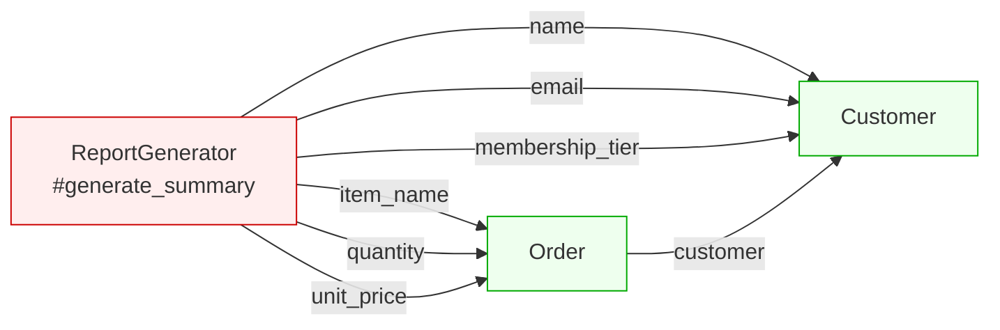
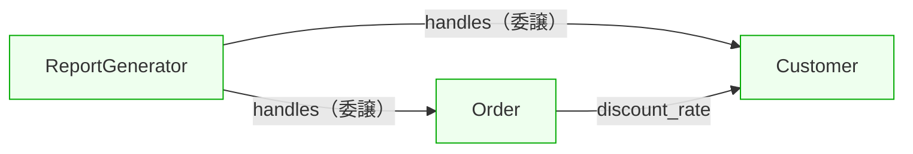

---
categories:
  - tech
date: 2026-04-06T07:07:05+09:00
description: 機能追加のたびにテストが3本壊れる——他クラスのゲッターばかり使うFeature EnvyをMove MethodとMooのhandles委譲で解消するコード探偵ロックの推理。
draft: true
epoch: 1775426825
image: /favicon.png
iso8601: 2026-04-06T07:07:05+09:00
tags:
  - design-pattern
  - perl
  - moo
  - feature-envy
  - move-method
  - refactoring
  - code-detective
title: コード探偵ロックの事件簿【Feature Envy】よそ見するメソッドの末路〜他人のポケットに手を突っ込む関数たち〜
toc: true
---

社内のコードレビュー勉強会が終わった。

参加者は20人ほど。四半期に一度、チームリードの河野さんが外部から講師を呼んで開くレビュー勉強会で、今回の講師は「コードの設計を専門に調べている」という触れ込みの男だった。名前はロック。

勉強会の中身は悪くなかった。結合度、凝集度、変更の波及範囲——既存コードの問題点を見つける観点について、実例を挙げて解説していた。ただ、プレゼンのスタイルが引っかかった。スライド操作にレーザーポインタではなく、どう見ても90年代のテレビ用赤外線リモコンを使っていた。前列の何人かが目配せしていたが、本人は気にしている様子がなかった。

私は椎名ミカ、26歳。SaaS企業でバックエンドの機能追加を担当して2年目になる。先輩から「コードの設計問題を見つけるのがうまい変わった人が来る」と聞いて参加したのだが、勉強会のあと控え室でノートPCを開いたのは、講義中に言われた一言が引っかかったからだ。

「変更のたびにテストが壊れるなら、疑うべきは変更したコードではなく設計だ」

まさに半年間、私が悩まされている症状だった。前任者が書いた `ReportGenerator` というクラスがある。注文レポートを生成するだけのはずなのに、機能を追加するたびにテストが3本壊れる。`Order` を修正しても壊れる。`Customer` に項目を足しても壊れる。触っていない場所が道連れになる。

「見せてもらえるかね」

声のした方を振り返ると、さっきの講師——ロックが控え室の入口に立っていた。赤外線リモコンをまだ右手に持っている。

「勉強会の最中に君のモニターが目に入ってね。あの `generate_summary` メソッド——なかなかのにおいだった」

「におい、ですか」

「調べがいのある、という意味だ」

河野さんから「質問があれば終了後に個別で聞いていい」と案内されていたので、断る理由はなかった。ノートPCの画面をロックさんの方に向けた。

## よそ見するメソッドの指紋

ロックさんは控え室の丸椅子を引き寄せて座り、赤外線リモコンをテーブルに置いた。代わりに鞄からエナジードリンクの缶を取り出す。ペットボトルではなくエナジードリンク——この人の標準装備らしい。

私が開いていたのは `ReportGenerator` のコードだった。

```perl
package ReportGenerator;
use Moo;

has order => (is => 'ro', required => 1);

sub generate_summary ($self) {
    # 注文情報を取得
    my $item_name  = $self->order->item_name;
    my $quantity   = $self->order->quantity;
    my $unit_price = $self->order->unit_price;
    my $subtotal   = $quantity * $unit_price;

    # 顧客情報を取得
    my $name  = $self->order->customer->name;
    my $email = $self->order->customer->email;
    my $tier  = $self->order->customer->membership_tier;

    # 割引計算
    my $discount = 0;
    if ($tier eq 'gold') {
        $discount = $subtotal * 0.1;
    }
    elsif ($tier eq 'platinum') {
        $discount = $subtotal * 0.2;
    }

    my $total = $subtotal - $discount;

    return {
        customer_name  => $name,
        customer_email => $email,
        item           => $item_name,
        quantity       => $quantity,
        subtotal       => $subtotal,
        discount       => $discount,
        total          => $total,
    };
}
```

ロックさんはコードを5秒ほど眺めてから、缶を開けた。

「このメソッド、`$self` のデータを一つも使っていない」

「`$self->order` を使っていますけど」

「`order` は窓口だ。そこから先はすべて、`Order` と `Customer` のポケットに手を突っ込んでいる。`item_name`、`quantity`、`unit_price`——全部 `Order` のデータだ。`name`、`email`、`membership_tier`——全部 `Customer` のデータだ」

言われて数えた。`generate_summary` の中で `$self` が直接保持するデータへのアクセスはゼロ。アクセサの呼び出しはすべて `$self->order->...` か `$self->order->customer->...` を経由している。

「このメソッドは `ReportGenerator` に住んでいるが、心はよそにある」

ロックさんはエナジードリンクを一口飲んだ。

「容疑者は **Feature Envy**——他人のクラスのデータばかり覗き見するメソッドのにおいだ」

エディタの端に図を描き始めた。



「矢印が全部外を向いているだろう。`ReportGenerator` は自分のデータを何も持たないのに、他人のデータだけで仕事をしている。これが Feature Envy の指紋だ」

「でも、このクラスの仕事はレポートを作ることですよね。注文データと顧客データを集めて出力するのは、正しい責務では」

「仕事の名前と仕事の中身は別の話だ」

ロックさんは缶をテーブルに置いて続けた。

「レポートを作ることは構わない。だが、割引率の計算は顧客のランクだけで決まる。小計は数量と単価だけで決まる。その計算まで `ReportGenerator` が抱えている必要はない。作ることと計算することは違う」

テストが3本壊れる原因が、少しだけ見えた気がした。`Customer` に項目を追加すると `ReportGenerator` のテストが壊れていたのは、`ReportGenerator` が `Customer` の中身に手を突っ込んでいたからだ。

## 推理披露：Move Method と handles

「解決策は Move Method だ。他人のデータに依存しているロジックを、そのデータを持つクラスに移す」

ロックさんは3段階でリファクタリングを見せた。

### Step 1：割引率を Customer に移動

「まず割引の計算だ。`membership_tier` は `Customer` のデータだから、割引率の判定も `Customer` に置く」

```perl
package Customer;
use v5.36;
use Moo;

has name            => (is => 'ro', required => 1);
has email           => (is => 'ro', required => 1);
has membership_tier => (is => 'ro', default => 'standard');

sub discount_rate ($self) {
    my %rates = (gold => 0.1, platinum => 0.2);
    return $rates{$self->membership_tier} // 0;
}
```

「`discount_rate` は `$self->membership_tier` だけを見ている。他のクラスのデータには一切触れていない。自分のポケットの中身だけで完結している」

「`ReportGenerator` にあった `if-elsif` の分岐が消えましたね」

「分岐が消えたのではない。分岐がいるべき場所に帰っただけだ」

### Step 2：小計と合計を Order に移動

「次に小計と合計だ。`quantity` と `unit_price` は `Order` のデータだから、計算も `Order` に置く」

```perl
package Order;
use v5.36;
use Moo;

has item_name  => (is => 'ro', required => 1);
has quantity   => (is => 'ro', required => 1);
has unit_price => (is => 'ro', required => 1);
has customer   => (is => 'ro', required => 1);

sub subtotal ($self) {
    return $self->quantity * $self->unit_price;
}

sub discount ($self) {
    return $self->subtotal * $self->customer->discount_rate;
}

sub total ($self) {
    return $self->subtotal - $self->discount;
}
```

「何割くらい他クラスのアクセサを使っていたら Feature Envy だと判断すべきなんですか」

「厳密な閾値はない。だが一つ目安がある——メソッドの中で `$self` へのアクセスより他クラスのアクセスが多ければ、そのメソッドは居場所を間違えている可能性が高い」

「全部移動したら、元のクラスが空になりませんか」

ロックさんはわずかに首を傾けた。

「移動するのは他人のデータに依存しているメソッドだけだ。すべてを移して元のクラスが空っぽになったとしたら、それは Middle Man——ただの仲介人になったということだ。そこまでやってはいけない」

### Step 3：ReportGenerator に handles を導入

「最後に `ReportGenerator` を Moo の `handles` で書き直す」

```perl
package ReportGenerator;
use v5.36;
use Moo;

has order => (
    is       => 'ro',
    required => 1,
    handles  => [qw(item_name quantity subtotal discount total)],
);

has _customer => (
    is      => 'lazy',
    builder => sub ($self) { $self->order->customer },
    handles => {
        customer_name  => 'name',
        customer_email => 'email',
    },
);

sub generate_summary ($self) {
    return {
        customer_name  => $self->customer_name,
        customer_email => $self->customer_email,
        item           => $self->item_name,
        quantity       => $self->quantity,
        subtotal       => $self->subtotal,
        discount       => $self->discount,
        total          => $self->total,
    };
}
```

「`handles` って、要するにショートカットですか。`$self->order->item_name` を `$self->item_name` で呼べるようにしているだけに見えますが」

「ショートカットではない」

ロックさんの声がわずかに硬くなった。

「`handles` はインターフェースの約束だ。`ReportGenerator` は `item_name` を提供すると宣言している。その裏で `order` に委譲しているのは実装の都合であって、呼び出し側は知る必要がない。`$self->order->item_name` と `$self->item_name` は見た目が似ているが、意味が違う」

「呼び出し側が `order` の存在を知らなくてよくなる、ということですか」

「そういうことだ。`generate_summary` を見たまえ。`$self->order->customer->name` のような連鎖はどこにもない。すべて `$self->customer_name`、`$self->subtotal` だ。このメソッドは自分のインターフェースだけで仕事をしている。よそ見は、もうしていない」

リファクタリング後のアクセスの向きを図にすると、先ほどとは様子が変わっていた。



## テストが独立した瞬間

「テストを走らせてみたまえ、ワトソン君」

その呼び方が出たのは、このときが初めてだった。勉強会の最中もコードレビューの間も、ロックさんは私のことを「君」としか呼んでいなかった。

「椎名です」

「そうだったかね。テストだ」

訂正が届いた様子はなかった。私はターミナルに向き直った。

まず `Customer` の単体テスト。

```perl
subtest 'Customer: discount_rate — gold会員は0.1' => sub {
    my $c = Customer->new(
        name            => '田中太郎',
        email           => 'tanaka@example.com',
        membership_tier => 'gold',
    );
    is($c->discount_rate, 0.1, '割引率0.1');
};
```

パス。`Customer` のテストは `Customer` のコードだけで閉じている。

次に `Order` の単体テスト。

```perl
subtest 'Order: discount — Customerのdiscount_rateを使った計算' => sub {
    my $order = Order->new(
        item_name  => 'ウィジェットA',
        quantity   => 10,
        unit_price => 500,
        customer   => Customer->new(
            name            => '田中太郎',
            email           => 'tanaka@example.com',
            membership_tier => 'gold',
        ),
    );
    is($order->subtotal, 5000, '小計');
    is($order->discount, 500,  '10%割引');
    is($order->total,    4500, '合計');
};
```

パス。`Order` のテストが `ReportGenerator` に依存していない。

最後に `ReportGenerator` の委譲テスト。

```perl
subtest 'handles — ReportGenerator から委譲メソッドが呼べる' => sub {
    my $order = Order->new(
        item_name  => 'ウィジェットA',
        quantity   => 3,
        unit_price => 1000,
        customer   => Customer->new(
            name  => '田中太郎',
            email => 'tanaka@example.com',
            membership_tier => 'standard',
        ),
    );
    my $report = ReportGenerator->new(order => $order);

    is($report->item_name,      'ウィジェットA',          'item_name 委譲');
    is($report->quantity,       3,                         'quantity 委譲');
    is($report->subtotal,       3000,                      'subtotal 委譲');
    is($report->customer_name,  '田中太郎',               'customer_name 委譲');
    is($report->customer_email, 'tanaka@example.com',      'customer_email 委譲');
};
```

全テスト、パス。

ターミナルに並んだ `ok` を見ながら、半年間のことを思い返していた。`Customer` に項目を追加するたびに `ReportGenerator` のテストが壊れていたのは、`ReportGenerator` が `Customer` の内部を直接覗いていたからだ。今は `Customer` のテストは `Customer` の中で完結し、`ReportGenerator` は `handles` の向こう側の構造を知らない。

触っていない場所のテストが道連れになるシーソーは、メソッドがよそ見をしていたから起きていた。

だが、一つ引っかかることがあった。

「`handles` で委譲しても、裏では `Order` のメソッドを呼んでいますよね。`Order` の `item_name` が変わったら、`ReportGenerator` のテストも結局壊れませんか」

半年間、私を苦しめてきたのはまさにこの構造だ。あるクラスの変更が、別のクラスのテストを巻き込んで壊す。`handles` で見た目を整えても、依存の線がつながっている限り同じことが起きるのではないか。

ロックさんは缶をテーブルに置いた。

「壊れる。だが壊れ方が違う」

「どう違うんですか」

「以前の `generate_summary` を思い出したまえ。メソッドの中で `$self->order->item_name`、`$self->order->quantity`、`$self->order->customer->name`——他クラスのアクセサを6箇所で直接呼んでいた。`Order` が `item_name` を `product_name` に変えたら、メソッド本体の中で壊れる。どこで壊れたかを探すには、メソッドの中身を読まなければならない」

「今は？」

「今は `handles => [qw(item_name quantity subtotal discount total)]` の一行だ。`Order` が `item_name` を消せば、`handles` の宣言で壊れる。メソッド本体は無傷だ。壊れる場所が、メソッドの奥ではなくクラス定義の入口に移っている」

言われて、`has order` の宣言を見直した。確かに、`generate_summary` の中には `$self->order->...` という連鎖は一つもない。仮に `Order` の属性名が変わっても、修正するのは `handles` の配列の一要素だけだ。メソッドの中を掘り返す必要がない。

「テストも同じだ。`$report->item_name` が期待通りの値を返すかどうかは、`ReportGenerator` のテストで確認する。`Order` が内部でどう `item_name` を実装しているかは、`Order` のテストの責務だ。責任の境界が、テストの境界になる」

半年間のシーソーが頭に浮かんだ。`Customer` に `phone` を追加しただけで `ReportGenerator` のテストが3本落ちていたのは、`generate_summary` の中で `$self->order->customer->email` の隣に `$self->order->customer->phone` を足す必要があったからだ。メソッドの中身が他クラスの構造を知りすぎていた。今の設計なら、`Customer` に項目を追加しても、`ReportGenerator` が `handles` で公開していない限りテストは壊れない。

壊れないのではない。壊れる範囲を自分で決められるようになった、ということだ。

ロックさんが立ち上がった。赤外線リモコンとエナジードリンクの空き缶を鞄にしまいながら、こちらを見ずに言った。

「自分のデータを知っているメソッドだけが、信用に足る証言者だ」

控え室のドアが閉まった。

半年間、テストが壊れるたびに `ReportGenerator` のメソッド本体を読み返していた。原因はいつも `Order` や `Customer` の変更だった。直すべきはメソッドの中身ではなく、メソッドの居場所だった。

壊れる範囲が見えている。修正する場所が一箇所に絞れる。テストがそれぞれの責任で閉じている。初めて、このコードが自分の手の中にある気がした。

---

## 探偵の調査報告書

| 容疑（アンチパターン） | 真実（パターン） | 証拠（効果） |
|:---|:---|:---|
| Feature Envy（他クラスのゲッターに過度に依存するメソッド） | Move Method + Moo の `handles`（委譲） | 各クラスが自分のデータだけで動作し、テストが独立する |

### 推理のステップ

1. **Feature Envy を見つける**: メソッド内で `$self` のデータへのアクセスより、他クラスのアクセサ呼び出しが多い箇所を探す
2. **データの所有者を特定する**: 各ロジックが依存しているデータが、どのクラスの属性かを確認する
3. **Move Method を適用する**: ロジックを、そのデータを持つクラスに移動する
   - `discount_rate` → `Customer`（`membership_tier` に依存）
   - `subtotal` / `discount` / `total` → `Order`（`quantity` / `unit_price` に依存）
4. **`handles` で委譲する**: 元のクラスからは `handles` でインターフェースだけを公開し、内部構造への直接アクセスを排除する
5. **テストを分離する**: 各クラスのテストが、他クラスの内部変更に影響されないことを確認する

### ロックより

他人のポケットの中身で仕事をしているメソッドは、結果が正しくても証言者としては信用ならない。ポケットの持ち主が中身を入れ替えた瞬間に、証言が崩壊するからだ。

Feature Envy を見つけるのは難しくない。メソッドの中でアクセサの矢印がすべて外を向いていたら、それが答えだ。そのメソッドを、データのある場所に帰してやるだけでいい。
