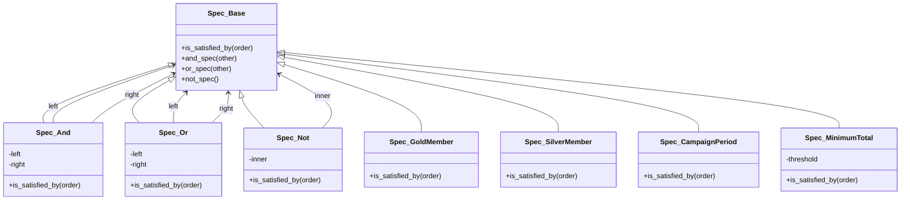

---
categories:
  - tech
date: 2026-04-07T07:07:05+09:00
description: 散在するif文の組み合わせでバグが出る——条件分岐の共犯者たちをSpecificationパターンで個別に取り調べ、AND/ORで合成するコード探偵ロックの推理。
draft: false
epoch: 1775513225
image: /public_images/2026/code-detective-specification/header.webp
iso8601: 2026-04-07T07:07:05+09:00
tags:
  - design-pattern
  - perl
  - moo
  - specification-pattern
  - scattered-conditions
  - refactoring
  - code-detective
title: コード探偵ロックの事件簿【Specification】条件迷宮の共犯者たち〜散らばったif文が隠す真実〜
toc: true
---

「ゴールド会員でキャンペーン期間中で、一万円以上買っているのに、組み合わせ割引が効かないんです」

僕は佐々木拓也、二十九歳。ECサイトの受注システムを一人で抱えているバックエンドエンジニアだ。

割引、送料無料、ポイント付与——ビジネスルールは四半期ごとに増えていく。営業から「ゴールド会員 × キャンペーン × 一万円以上で特別割引」と言われて実装したのは先週のことだ。テストでは動いた。本番でも、ほとんどのケースでは動いた。

ほとんどの、だ。

「特定のパターンだけ適用されない」と営業から電話があったのが金曜の午後。土日をかけてログを追い、原因がわからないまま月曜の朝を迎えた。

「レガシー・コード・インベスティゲーション（LCI）」

雑居ビルの三階。夏でもないのにむわっとした排熱が足元から漂ってくる。扉を開けると、デスクの上に五台のメカニカルキーボードが並んでいた。その奥で、パイプ型のUSBメモリを手のひらで転がしている男がいた。

「——散らばった指紋のにおいがするね、ワトソン君」

「佐々木です。指紋じゃなくて割引のバグなんですけど」

「同じことだよ。散らばった証拠が犯罪を見えにくくする。さあ、証拠品を見せたまえ」

## 現場検証：三箇所に残された同一犯の指紋

コードを見せると、ロックは五台のキーボードのうち一台——打鍵音が妙に甲高いやつ——を引き寄せ、画面に集中した。

```perl
package DiscountService;
use Moo;

sub calculate_discount {
    my ($self, $order) = @_;
    my $discount = 0;

    # 会員ランク割引
    if ($order->member_rank eq 'gold') {
        $discount += $order->total * 0.10;
    } elsif ($order->member_rank eq 'silver') {
        $discount += $order->total * 0.05;
    }

    # 期間限定キャンペーン
    if ($order->is_campaign_period && $order->total >= 5000) {
        $discount += 500;
    }

    # 組み合わせ割引（ゴールド会員 × キャンペーン × 1万円以上）
    if ($order->member_rank eq 'gold'
        && $order->is_campaign_period
        && $order->total >= 10000) {
        $discount += 1000;
    }

    return $discount;
}

sub is_free_shipping {
    my ($self, $order) = @_;

    if ($order->member_rank eq 'gold') {
        return 1;
    }
    if ($order->total >= 5000) {
        return 1;
    }
    return 0;
}

sub calculate_points {
    my ($self, $order) = @_;
    my $points = int($order->total * 0.01);

    if ($order->member_rank eq 'gold') {
        $points *= 2;
    }

    if ($order->is_campaign_period) {
        $points += 100;
    }

    return $points;
}
```

十五秒ほど黙ったあと、ロックが口を開いた。

「`member_rank eq 'gold'`——この指紋が三箇所に残されているね」

「指紋って、if文のことですか」

「`calculate_discount`で一回。`is_free_shipping`で一回。`calculate_points`で一回。まったく同じ条件判定が、三つのメソッドに散在している。`is_campaign_period`も二箇所。これは共犯事件だよ、ワトソン君」

「共犯……」

「そうだ。犯人が一人なら追跡は簡単だ。だが、同じ犯人が複数の現場に証拠を残し、しかもそれぞれの現場で微妙に異なる行動をとっている。どこか一箇所を修正しても、別の現場で矛盾が生じる」

ロックは画面を指差した。

「問題の核心はここだ。組み合わせ割引の条件——ゴールド会員 AND キャンペーン AND 一万円以上——これが正しく機能しない原因は、三つの条件がこのメソッドの中で初めて出会うからだ。条件同士の関係性がコードのどこにも表現されていない」

アンチパターンに名前をつけるなら**Scattered Conditions（条件分岐の散在）**。同じビジネスルールの判定ロジックが複数箇所にコピペされ、組み合わせの整合性が管理不能になる構造的な欠陥だ。

「じゃあ、条件をまとめればいいんですか？ 共通メソッドに切り出すとか」

「共通メソッドに切り出す——初歩的な発想だが、不十分だね。なぜなら、君が本当に必要としているのは『条件を部品として扱い、自由に組み合わせる』能力だからだ」

## 推理披露：条件を個別に取り調べ、合成する

「各容疑者を独立した取調室に入れるんだ」

「取調室？」

「**Specification パターン**——各ビジネスルールを独立したオブジェクトにカプセル化し、`and_spec`・`or_spec`・`not_spec`で合成可能にする。まずは取調室の雛形を見せよう」

ロックはキーボードを叩き始めた。

```perl
package Spec::Base;
use Moo;

sub is_satisfied_by {
    my ($self, $order) = @_;
    die "Must override is_satisfied_by";
}

sub and_spec {
    my ($self, $other) = @_;
    return Spec::And->new(left => $self, right => $other);
}

sub or_spec {
    my ($self, $other) = @_;
    return Spec::Or->new(left => $self, right => $other);
}

sub not_spec {
    my ($self) = @_;
    return Spec::Not->new(inner => $self);
}
```

「`Spec::Base`は取調室の設計図だ。`is_satisfied_by`で容疑者が条件を満たすかどうかを判定する。そして`and_spec`、`or_spec`、`not_spec`で取調室同士を接続できる」

「接続？」

「AND——二つの取調室を直列につなげる。両方の部屋を通過できた容疑者だけが該当する。OR——並列につなげる。どちらかの部屋を通過できれば該当する。NOT——部屋を通過できなかった場合のみ該当する」

```perl
package Spec::And;
use Moo;
extends 'Spec::Base';

has left  => (is => 'ro', required => 1);
has right => (is => 'ro', required => 1);

sub is_satisfied_by {
    my ($self, $order) = @_;
    return $self->left->is_satisfied_by($order)
        && $self->right->is_satisfied_by($order);
}
```

```perl
package Spec::Or;
use Moo;
extends 'Spec::Base';

has left  => (is => 'ro', required => 1);
has right => (is => 'ro', required => 1);

sub is_satisfied_by {
    my ($self, $order) = @_;
    return $self->left->is_satisfied_by($order)
        || $self->right->is_satisfied_by($order);
}
```

```perl
package Spec::Not;
use Moo;
extends 'Spec::Base';

has inner => (is => 'ro', required => 1);

sub is_satisfied_by {
    my ($self, $order) = @_;
    return !$self->inner->is_satisfied_by($order);
}
```

「ここまでがインフラだ。次に、各容疑者——つまり、各ビジネスルールを個別のクラスにする」

```perl
package Spec::GoldMember;
use Moo;
extends 'Spec::Base';

sub is_satisfied_by {
    my ($self, $order) = @_;
    return $order->member_rank eq 'gold';
}
```

```perl
package Spec::SilverMember;
use Moo;
extends 'Spec::Base';

sub is_satisfied_by {
    my ($self, $order) = @_;
    return $order->member_rank eq 'silver';
}
```

```perl
package Spec::CampaignPeriod;
use Moo;
extends 'Spec::Base';

sub is_satisfied_by {
    my ($self, $order) = @_;
    return $order->is_campaign_period;
}
```

```perl
package Spec::MinimumTotal;
use Moo;
extends 'Spec::Base';

has threshold => (is => 'ro', required => 1);

sub is_satisfied_by {
    my ($self, $order) = @_;
    return $order->total >= $self->threshold;
}
```

「`member_rank eq 'gold'`は`Spec::GoldMember`に一箇所だけ。`is_campaign_period`は`Spec::CampaignPeriod`に一箇所だけ。共犯者たちは、それぞれ自分専用の取調室に閉じ込められた」

「でも、組み合わせ条件はどうなるんですか？ ゴールド会員 AND キャンペーン AND 一万円以上って……」

「こう書ける」

```perl
my $combo_spec = $self->gold_member
    ->and_spec($self->campaign_period)
    ->and_spec($self->min_10000);
```

「`and_spec`でつなげるだけ——」

「その通りだよ、ワトソン君。条件の組み合わせが、コードを読むだけで意味がわかる文章になる」

僕は思わず唸った。Beforeのコードでは、三重のif文のネストの中に条件が埋もれていた。Afterでは、条件の関係性そのものがオブジェクトの構造として表現されている。

ロックは`DiscountService`全体を書き直した。

```perl
package DiscountService;
use Moo;

has gold_member     => (is => 'ro', default => sub { Spec::GoldMember->new });
has silver_member   => (is => 'ro', default => sub { Spec::SilverMember->new });
has campaign_period => (is => 'ro', default => sub { Spec::CampaignPeriod->new });
has min_5000        => (is => 'ro', default => sub { Spec::MinimumTotal->new(threshold => 5000) });
has min_10000       => (is => 'ro', default => sub { Spec::MinimumTotal->new(threshold => 10000) });

sub calculate_discount {
    my ($self, $order) = @_;
    my $discount = 0;

    if ($self->gold_member->is_satisfied_by($order)) {
        $discount += $order->total * 0.10;
    }
    if ($self->silver_member->is_satisfied_by($order)) {
        $discount += $order->total * 0.05;
    }

    my $campaign_min_5000 = $self->campaign_period->and_spec($self->min_5000);
    if ($campaign_min_5000->is_satisfied_by($order)) {
        $discount += 500;
    }

    my $combo_spec = $self->gold_member
        ->and_spec($self->campaign_period)
        ->and_spec($self->min_10000);
    if ($combo_spec->is_satisfied_by($order)) {
        $discount += 1000;
    }

    return $discount;
}

sub is_free_shipping {
    my ($self, $order) = @_;
    my $free_shipping_spec = $self->gold_member->or_spec($self->min_5000);
    return $free_shipping_spec->is_satisfied_by($order);
}

sub calculate_points {
    my ($self, $order) = @_;
    my $points = int($order->total * 0.01);

    if ($self->gold_member->is_satisfied_by($order)) {
        $points *= 2;
    }
    if ($self->campaign_period->is_satisfied_by($order)) {
        $points += 100;
    }

    return $points;
}
```

「`is_free_shipping`を見てみたまえ。送料無料の条件は、ゴールド会員 OR 五千円以上——`or_spec`一行で書ける。条件の意味がそのまま読める」



「各容疑者が独立した取調室にいる。ANDで直列に、ORで並列につなげる。新しい容疑者が現れたら、新しい取調室を一つ追加するだけだ」

## 事件解決：共犯者たちの自白

テストを走らせた。

```
# Subtest: Spec: GoldMember
ok 1 - ゴールド会員はtrue
ok 2 - シルバー会員はfalse

# Subtest: Spec: 三段合成 — ゴールド AND キャンペーン AND 1万円以上
ok 1 - 全条件を満たすとtrue
ok 2 - 金額不足でfalse
ok 3 - キャンペーン外でfalse
ok 4 - シルバー会員はfalse

# Subtest: After: ゴールド × キャンペーン × 1万円以上の組み合わせ割引
ok 1 - 全条件の組み合わせで2500円割引
```

全テスト、警告ゼロでパスした。

問題だった「ゴールド × キャンペーン × 一万円以上」の組み合わせ割引が正しく動作することを確認した。各Specificationの単体テストもすべて緑。条件が独立しているから、個別にテストできる。

「各条件が独立しているから、テストもすごく書きやすいですね。`Spec::GoldMember`だけを単体でテストできる」

「初歩的なことだよ、ワトソン君。共犯者を個別に取り調べれば、矛盾はすぐに見つかる。全員をまとめて尋問するから事件が迷宮入りするんだ」

「……僕は佐々木です」

「新しいビジネスルールが増えたらどうするか、わかるかね？」

「新しいSpecクラスを追加して、`and_spec`か`or_spec`でつなげる——ですよね」

ロックが僅かに口角を上げた。それは、僕が見たなかで最も控えめな笑みだった。

「報酬は、散在していたif文の数と同じ年数もののスコッチでいい」

if文を数えた。八個だった。八年もののスコッチ。いい値段がするはずだが、三ヶ月間のデバッグ地獄から解放された代償としては安いのかもしれない。

金曜日、営業から電話が来た。「割引の件、直ったみたいだね」

直ったんじゃない。条件の共犯者たちを、ようやく個別に取り調べられるようにしたんだ。

---

## 探偵の調査報告書

| 容疑（アンチパターン） | 真実（パターン） | 証拠（効果） |
|---|---|---|
| Scattered Conditions — 同じ条件判定（`member_rank eq 'gold'`など）が複数メソッドに散在し、組み合わせの整合性が管理不能になる | Specification — 各ビジネスルールを独立したオブジェクトにカプセル化し、`is_satisfied_by`で判定。`and_spec`・`or_spec`・`not_spec`で自由に合成できる | 条件判定が一箇所に集約され、DRY原則を遵守。新ルール追加は新Specクラスの追加のみ（OCP準拠） |
| 複合条件の不透明さ — 三重のif文のネストに条件が埋もれ、どの組み合わせが正しく動作するかコードからは読み取れない | 宣言的な条件合成 — `gold->and_spec(campaign)->and_spec(min_10000)`と書けば、条件の意味がそのまま読める | 各Specificationが単体テスト可能。組み合わせのバグを個別のテストで検出できる |

### 推理のステップ

1. **Scattered Conditionsを識別する** — 同じ条件判定が複数メソッドにコピペされている箇所を探す。`grep`一発で見つかる指紋だ
2. **Spec::Baseを作る** — `is_satisfied_by`メソッドと、`and_spec`・`or_spec`・`not_spec`による合成メソッドを持つ基底クラスを定義する
3. **合成クラスを実装する** — `Spec::And`（両方満たす）、`Spec::Or`（どちらか満たす）、`Spec::Not`（満たさない）を実装する。これが条件合成のインフラになる
4. **具象Specificationに切り出す** — 散在していた各条件（`GoldMember`、`CampaignPeriod`、`MinimumTotal`など）をそれぞれ独立したクラスに抽出する
5. **Serviceで合成する** — `DiscountService`などのビジネスロジックで、Specificationオブジェクトを`and_spec`・`or_spec`で組み合わせて使う。条件の意味がコードから読める状態を目指す

### ロックより

散らばった条件は、散らばった指紋と同じだ——どの現場にも同じ犯人がいるのに、バラバラに捜査するから事件が解けない。

Specificationパターンは、条件をオブジェクトとして独立させ、AND・OR・NOTで自由に合成する。各条件が独立しているから個別にテストでき、組み合わせの関係性がコードの構造そのものとして表現される。新しいビジネスルールが四半期ごとに降ってきても、新しい取調室を一つ追加するだけでいい。既存の部屋には一切触れない。

次の事件が待っているよ、ワトソン君——条件を合成できるようになったなら、次は「条件に基づいてオブジェクトを生成する」方法が必要になるかもしれないね。
