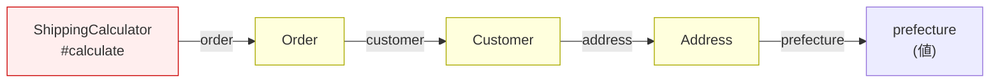
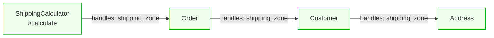

---
categories:
  - tech
date: 2026-04-07T07:07:05+09:00
description: 住所テーブルを変更しただけで配送料計算が全滅した——$order->customer->address->prefectureの4段連鎖が招くLaw of Demeter違反をMooのhandles委譲で断ち切るコード探偵ロックの推理。
draft: true
epoch: 1775513225
image: /public_images/2026/code-detective-law-of-demeter/header.webp
iso8601: 2026-04-07T07:07:05+09:00
tags:
  - design-pattern
  - perl
  - moo
  - law-of-demeter
  - train-wreck
  - message-chains
  - refactoring
  - code-detective
title: コード探偵ロックの事件簿【Law of Demeter】列車事故の共犯者たち〜メソッドの連鎖が暴く内部構造の地図〜
toc: true
---

深夜1時を回っていた。

僕は森川ユウジ、30歳。ECシステムのバックエンドとインフラを兼任して3年目になる。今夜は障害対応でオフィスに残っている。

症状は単純だ。配送料の計算が全滅している。注文は受け付けられるが、配送料が0円になる。正確に言えば、配送料の計算メソッドが例外を吐いて死んでいる。

原因には心当たりがあった。昨日の午後、住所テーブルのカラム名を変更した。`prefecture` を `region` に。都道府県だけでなく海外の地域コードも扱えるようにするための拡張だった。マイグレーションは通った。`Address` クラスのアクセサも書き換えた。単体テストも通した。

なのに配送料が死んだ。税計算も死んだ。請求書生成も死んだ。触っていないはずのクラスが、3つ同時に壊れた。

ターミナルのスタックトレースを見ても、壊れているのは `ShippingCalculator` の中だ。`Address` のテストは通っているのに、そこから3クラス先の `ShippingCalculator` が倒れている。

影響範囲が見えない。`prefecture` を使っている箇所を grep すれば出てくるが、直接使っているのか、何かを経由しているのか、依存の深さが分からない。

コーヒーを淹れに給湯室へ行ったとき、窓の外に目が止まった。同じビルの3階に灯りがついている。この時間に灯りがついているフロアは、僕が知る限り5階のうちのオフィスだけのはずだった。

3階のテナントは知らない。入居時に案内板を見た記憶では、IT系の会社名が並んでいたはずだ。この時間にまだ仕事をしているなら、同業の可能性が高い。

藁にもすがる気持ちで階段を降りた。ドアの前に立って、初めて看板を読んだ。

「レガシー・コード・インベスティゲーション」

聞いたことのない社名だった。ドアは半開きで、中から蛍光灯の光が漏れている。

ノックして開けると、壁一面に紙が貼ってあった。

クラス図だった。印刷されたクラス図がA4用紙で20枚以上、壁にテープで貼り付けてある。クラスとクラスの間を赤い糸で結んでいる。刑事ドラマの捜査ボードそのものだ。

部屋の中央のデスクに、男が一人座っていた。赤い糸の端をピンで留めながら、クラス図を睨んでいる。デスクの上にはエナジードリンクの空き缶が5本と、開きかけの宅配ピザの箱。

「あの、すみません。上の階でシステムの障害対応をしていて——」

「座りたまえ、ワトソン君」

振り向きもせずに言った。壁のクラス図から目を離さない。

「森川です。今それどころじゃないんです。配送料の計算が全滅していて——」

「知っている」

男がようやくこちらを向いた。

「知っている、とは」

「このビルの共用Wi-Fiのパケットが22時頃から荒れていてね。誰かが何度もデプロイとロールバックを繰り返しているのが分かった。3階でそんなことをするのは私ではないから、上の階だろうと推理していたところだ」

パケットの乱れでデプロイを推理する人間は初めて見た。

「見せたまえ、ワトソン君。コードをだ」

「森川です」

訂正が届いた様子はなかった。しかし選んでいる場合ではなかった。ノートPCを開いて、壊れている `ShippingCalculator` のコードをこの男——ロックと名乗った——に見せた。

## 列車事故の現場

```perl
package ShippingCalculator;
use Moo;

has order => (is => 'ro', required => 1);

sub calculate ($self) {
    my $pref = $self->order->customer->address->prefecture;
    my %zone = (
        '東京都'   => 'kanto',
        '神奈川県' => 'kanto',
        '千葉県'   => 'kanto',
        '大阪府'   => 'kansai',
        '京都府'   => 'kansai',
    );
    my $zone = $zone{$pref} // 'other';
    my %rate = (kanto => 500, kansai => 700, other => 1000);
    return $rate{$zone};
}
```

ロックさんは5秒ほど画面を見て、壁のクラス図の方を指さした。

「この行だ」

```perl
my $pref = $self->order->customer->address->prefecture;
```

「矢印が4本つながっている。`$self` から `order`、`order` から `customer`、`customer` から `address`、`address` から `prefecture`。この連鎖は列車だ」

「列車？」

「客車が4両つながっている。先頭車両の `$self` から最後尾の `prefecture` に到達するには、途中の客車——`order`、`customer`、`address`——をすべて通過しなければならない。途中の車両を1両でも入れ替えたら、後ろの車両ごと脱線する。Train Wreck——列車事故だ」



「`ShippingCalculator` は、配送料を計算するだけのクラスだ。なのに `Order` の中に `Customer` がいて、`Customer` の中に `Address` があって、`Address` が `prefecture` を持っている——という構造を丸ごと知っている。知りすぎている」

「でも、都道府県がないと配送ゾーンは決められませんよね」

「都道府県が必要なのは正しい。だが都道府県を得るために、`Customer` と `Address` の存在を知る必要があるかどうかは別の話だ」

ロックさんはエナジードリンクの缶を1本取り上げたが、空だった。舌打ちして缶を戻す。

「これは **Law of Demeter——デメテルの法則** の違反だ。原則はシンプルでね。『直接の友人とだけ話せ。見知らぬ者とは話すな』」

「見知らぬ者」

「`ShippingCalculator` にとって `order` は直接の友人だ。属性として保持している。だが `customer` は友人の友人であり、`address` は友人の友人の友人だ。見知らぬ者に道を尋ねて、さらにその先の見知らぬ者に案内を頼んでいる」

理屈は分かった。しかし実務的な疑問が先に出た。

「つまり何をすればいいんですか」

「列車を解体する」

## 推理披露：handles で列車を解体する

ロックさんは壁のクラス図に新しい紙を1枚追加した。

「3段階で進める。まず、配送ゾーンの判定を住所に返す」

### Step 1：Address に配送ゾーン判定を移す

「都道府県から配送ゾーンを決めるロジックは、`ShippingCalculator` にある必要がない。このロジックが必要とするデータは `prefecture` だけであり、それは `Address` が持っている」

```perl
package Address;
use v5.36;
use Moo;

has prefecture => (is => 'ro', required => 1);

sub shipping_zone ($self) {
    my %zone = (
        '東京都'   => 'kanto',
        '神奈川県' => 'kanto',
        '千葉県'   => 'kanto',
        '大阪府'   => 'kansai',
        '京都府'   => 'kansai',
    );
    return $zone{$self->prefecture} // 'other';
}
```

「`shipping_zone` は `$self->prefecture` しか使っていない。自分のデータだけで完結している」

「計算をデータの持ち主に寄せるのは分かりました。でも `ShippingCalculator` から呼ぶときは、結局 `$self->order->customer->address->shipping_zone` って書くんですよね。連鎖が3段残ったままじゃないですか」

ロックさんはピザの箱を開けて1切れ取り、噛みながら答えた。

「そうだ。ロジックの置き場所を正しただけでは、列車事故は止まらない。`ShippingCalculator` はまだ `Order` → `Customer` → `Address` という経路——内部構造の地図を丸暗記している。計算を移すだけじゃなくて、経路を短くしないと意味がない」

「どうやって短くするんですか」

「委譲だ。Moo の `handles` を使う」

### Step 2：Customer と Order に handles を設定する

「次に、この `shipping_zone` を上位のクラスに委譲する。Moo の `handles` を使う」

```perl
package Customer;
use v5.36;
use Moo;

has name    => (is => 'ro', required => 1);
has email   => (is => 'ro', required => 1);
has address => (
    is       => 'ro',
    required => 1,
    handles  => [qw(shipping_zone)],
);
```

「`Customer` に `handles => [qw(shipping_zone)]` と書くことで、`$customer->shipping_zone` と呼べるようになる。裏では `$customer->address->shipping_zone` が呼ばれるが、呼び出し側はそれを知らない」

「1層挟んでいるだけじゃないですか。`Address` の構造が変わったら、結局 `Customer` も壊れるんじゃ」

ロックさんはピザを置いた。

「壊れる場所が違う。以前は `ShippingCalculator` のメソッド本体の中で壊れていた。今は `Customer` の `has address` の宣言——クラス定義の入り口で壊れる。メソッドの中身を掘り返す必要がない」

「でも、壊れること自体は変わらないですよね」

「壊れることは変わらない。変わるのは、壊れる場所の数だ」

ロックさんは壁のクラス図を指さした。

「今の設計では、`$self->order->customer->address->prefecture` を使っているクラスが3つある。`ShippingCalculator`、`TaxCalculator`、`InvoiceGenerator`。住所テーブルのカラム名を変えたら、この3つのメソッド本体がすべて壊れた。それが今夜の障害だ」

図星だった。まさにその3つが同時に死んでいた。

「`handles` にすれば、壊れるのは `Address` の `shipping_zone` メソッドと、`Customer` の `has address` の `handles` 宣言——この2箇所だけだ。`ShippingCalculator` も `TaxCalculator` も `InvoiceGenerator` も、`Order` から `shipping_zone` を受け取るだけだから、中間の構造がどう変わろうと影響を受けない」

同じことを `Order` にも適用する。

```perl
package Order;
use v5.36;
use Moo;

has item_name  => (is => 'ro', required => 1);
has quantity   => (is => 'ro', required => 1);
has unit_price => (is => 'ro', required => 1);
has customer   => (
    is       => 'ro',
    required => 1,
    handles  => [qw(shipping_zone)],
);
```

### Step 3：ShippingCalculator も handles で受け取る

「最後に `ShippingCalculator` 自体も `handles` で `shipping_zone` を受け取る」

```perl
package ShippingCalculator;
use v5.36;
use Moo;

has order => (
    is       => 'ro',
    required => 1,
    handles  => [qw(shipping_zone)],
);

sub calculate ($self) {
    my %rate = (kanto => 500, kansai => 700, other => 1000);
    return $rate{$self->shipping_zone};
}
```

「`$self->order->customer->address->prefecture` が `$self->shipping_zone` になった。4両の列車が1両になっている」

「でも裏側では4段の委譲が連鎖しているわけですよね。`ShippingCalculator` → `Order` → `Customer` → `Address`。結局、構造は同じじゃないですか」

ロックさんは空き缶をデスクの端に並べた。5本の缶を一列に。

「これが列車だ。先頭の缶を押すと、5本全部が倒れる」

1本目を指で弾いた。缶が倒れ、2本目にぶつかり、5本目まで連鎖して倒れた。

ロックさんは缶を立て直し、今度は1本ずつの間に手のひらを挟んだ。

「これが `handles` だ。1本目が倒れても、2本目には届かない。間に壁がある」

「壁？」

「`handles` はインターフェースの宣言だ。`Customer` は『`shipping_zone` を提供する』と宣言している。その裏で `Address` に委譲しているのは実装の都合であって、`Order` はそれを知らない。`Address` が `GeoAPI` に変わろうと、`Customer` が `shipping_zone` を提供し続ける限り、`Order` は壊れない」

「委譲は地図を持つことではない——地図を持たなくて済むようにすることだ」と言いたいわけですか」

「私が言おうとしていたことを先に言うのはやめたまえ、ワトソン君」

「森川です」



## 列車が止まった夜

「テストだ」

ロックさんが顎をしゃくった。僕はターミナルに向き直った。

まず `Address` の単体テスト。

```perl
subtest 'Address: shipping_zone — 東京都はkanto' => sub {
    my $addr = Address->new(prefecture => '東京都');
    is($addr->shipping_zone, 'kanto', '関東ゾーン');
};

subtest 'Address: shipping_zone — 大阪府はkansai' => sub {
    my $addr = Address->new(prefecture => '大阪府');
    is($addr->shipping_zone, 'kansai', '関西ゾーン');
};

subtest 'Address: shipping_zone — 北海道はother' => sub {
    my $addr = Address->new(prefecture => '北海道');
    is($addr->shipping_zone, 'other', 'otherゾーン');
};
```

パス。`Address` のテストは `Address` だけで閉じている。

次に `Customer` の委譲テスト。

```perl
subtest 'Customer: handles — shipping_zoneが委譲される' => sub {
    my $customer = Customer->new(
        name    => '森川ユウジ',
        email   => 'morikawa@example.com',
        address => Address->new(prefecture => '大阪府'),
    );
    is($customer->shipping_zone, 'kansai', 'Customer経由で関西ゾーン');
};
```

パス。`Customer` のテストは `Customer` と `Address` で閉じている。`Order` や `ShippingCalculator` は関係ない。

`Order` の委譲テスト。

```perl
subtest 'Order: handles — shipping_zoneが委譲される' => sub {
    my $order = Order->new(
        item_name  => 'ウィジェットA',
        quantity   => 1,
        unit_price => 1000,
        customer   => Customer->new(
            name    => '森川ユウジ',
            email   => 'morikawa@example.com',
            address => Address->new(prefecture => '東京都'),
        ),
    );
    is($order->shipping_zone, 'kanto', 'Order経由で関東ゾーン');
};
```

パス。

最後に `ShippingCalculator`。

```perl
subtest 'ShippingCalculator: 東京都 — 500円' => sub {
    my $order = Order->new(
        item_name  => 'ウィジェットA',
        quantity   => 1,
        unit_price => 1000,
        customer   => Customer->new(
            name    => '森川ユウジ',
            email   => 'morikawa@example.com',
            address => Address->new(prefecture => '東京都'),
        ),
    );
    my $calc = ShippingCalculator->new(order => $order);
    is($calc->calculate, 500, '関東ゾーン');
};
```

全テスト、パス。

僕はターミナルの `ok` の列を見ながら、今夜の障害を思い返していた。

`prefecture` を `region` に変更したとき、`Address` クラスのアクセサは書き換えた。`Address` の単体テストも通した。なのに3つのクラスが同時に死んだのは、3つのクラスがすべて `$order->customer->address->prefecture` という連鎖で `Address` の内部構造に直接到達していたからだ。

もし `handles` で委譲していれば、`prefecture` が `region` に変わっても、修正するのは `Address` の `shipping_zone` メソッドの中——`$self->prefecture` を `$self->region` に変えるだけだ。`Customer` も `Order` も `ShippingCalculator` も、`shipping_zone` というインターフェースを通じて結果を受け取っているだけだから、内部のカラム名など知る必要がない。

壊れなかったのではない。壊れる場所が、列車全体から1両目だけに絞られた。

「メソッドチェーンが何段まではOK、みたいな基準ってあるんですか」

ロックさんはピザの最後の1切れに手を伸ばした。

「段数の問題ではない。ドットの数を数えることに意味はない。Fluent Interface——メソッドが自分自身を返す連鎖は、何段続いても Law of Demeter には違反しない。問題は、連鎖の途中で異なるオブジェクトを渡り歩いているかどうかだ」

「Fluent Interface なら OK？」

「`$builder->set_name('X')->set_age(30)->build()` は毎回 `$builder` 自身が返っている。相手は変わらない。だが `$order->customer->address->prefecture` は、`Order` から `Customer` へ、`Customer` から `Address` へと、相手が変わり続けている。話し相手が変わるたびに、知らなくてよかった構造を知ることになる」

答えに納得した。段数ではなく、型が変わるかどうか。

ロックさんが立ち上がった。ピザの箱を閉じて、壁のクラス図を1枚ずつ剥がし始めた。

「報酬は」

「え？」

「深夜のコンサルティング料だ」

この時間にピザを食べているのはこの人だ。僕が提供したものは何もない。

「……ピザの代金を払えということですか」

「ピザは私のだ。代金は受け取れない。だが君が2階のオフィスに戻る途中で、1階の自販機で缶コーヒーを1本買ってきてくれれば、それでいい」

「5階です。僕のオフィスは5階です」

「そうだったかね」

クラス図をすべて剥がし終えた壁は、テープの跡だけが残っていた。

壊れた列車を直すのに必要だったのは、新しい車両ではなかった。車両と車両の間に壁を立てて、それぞれが自分の車両の中だけで仕事をするようにすること。見知らぬ者に道を尋ねるのをやめて、隣の友人に聞くだけで済む設計にすること。

缶コーヒーを買いに階段を降りながら、明日のリファクタリング計画を頭の中で組み立てていた。

---

## 探偵の調査報告書

| 容疑（アンチパターン） | 真実（パターン） | 証拠（効果） |
|:---|:---|:---|
| Law of Demeter 違反（Train Wreck / Message Chains） | Moo の `handles`（委譲）による構造の隠蔽 | メソッドチェーンが解消され、中間オブジェクトの変更が波及しなくなる |

### 推理のステップ

1. **Train Wreck を見つける**: メソッド内で `$self->a->b->c->d` のように異なるオブジェクトを渡り歩く連鎖を探す
2. **末端のロジックを末端に移す**: 連鎖の最後で取得しているデータを使った計算を、そのデータを持つクラスのメソッドにする（例: `shipping_zone` を `Address` に移動）
3. **`handles` で1段ずつ委譲する**: 各クラスが直接保持する属性に対して `handles` を宣言し、上位クラスに必要なメソッドだけを公開する
4. **呼び出し側を `$self->method` に書き換える**: メソッドチェーンを `handles` 経由の1段アクセスに置き換え、連鎖を解消する
5. **テストの独立性を確認する**: 各クラスのテストが、他クラスの内部構造の変更に影響されないことを検証する

### ロックより

列車事故の原因は、速度でも車両の数でもない。車両同士が直結していて、1両の脱線が全体を巻き込むことだ。`handles` は車両間の連結器に衝撃吸収材を入れるようなものだ。衝撃は伝わらなくなるが、列車は走り続ける。見知らぬ者に道を尋ねるのは、今夜で最後にしたまえ。
