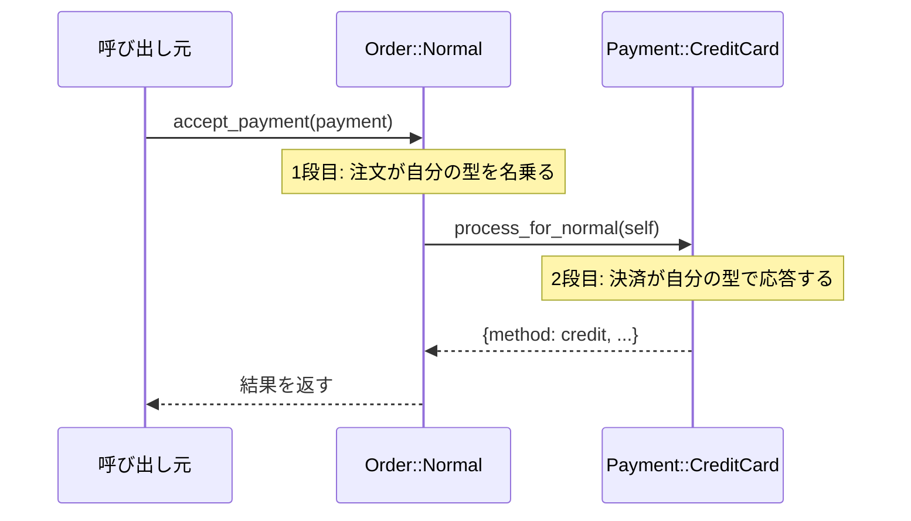

---
categories:
  - tech
date: 2026-04-08T07:07:05+09:00
description: 注文種別と決済方法の組み合わせでref()の二重ネストが爆発——型チェックの連鎖をDouble Dispatchで「対面尋問」に変えるコード探偵ロックの推理。
draft: false
epoch: 1775599625
image: /favicon.png
iso8601: 2026-04-08T07:07:05+09:00
tags:
  - design-pattern
  - perl
  - moo
  - double-dispatch
  - type-checking-chains
  - refactoring
  - code-detective
title: コード探偵ロックの事件簿【Double Dispatch】二人の容疑者の対面尋問〜型の組み合わせが生む死角〜
toc: true
---

「定期購入とコンビニ払いの組み合わせを追加したら、通常注文と銀行振込が壊れました」

私は宮本彩、二十六歳。ECプラットフォームの決済基盤チームでバックエンドを担当している。

注文種別は三つ。通常注文、定期購入、予約注文。決済方法も三つ。クレジットカード、銀行振込、コンビニ払い。それぞれの組み合わせで処理が違う。三掛ける三の九パターン。

最初は「if文で分ければいい」と思っていた。そして今、そのif文は二重のネストになり、一つのメソッドに九つの分岐が詰め込まれ、先月追加した「定期購入 × コンビニ払い」のelsifが隣の分岐を壊した。修正したら別の組み合わせが動かなくなった。

モグラ叩きだった。

「レガシー・コード・インベスティゲーション（LCI）」

雑居ビルの三階。扉を開けると、二台のモニタの間にルービックキューブが挟まっていた。その奥で、片手でキューブを回しながらコードを読んでいる男がいた。

「——二人の容疑者が、別々の部屋でアリバイを主張している。古典的な共犯崩しの問題だね、ワトソン君」

「宮本です。共犯って、if文のことですか？」

「if文は共犯者じゃない。if文は、共犯者を見分けられない盲目の証人だよ。さあ、証拠品を見せたまえ」

## 現場検証：盲目の証人が抱える九つの分岐

コードを見せると、ロックはルービックキューブを置き、キーボードに両手を移した。

```perl
package PaymentProcessor;
use Moo;

sub process {
    my ($self, $order, $payment) = @_;

    if (ref $order eq 'NormalOrder') {
        if (ref $payment eq 'CreditCard') {
            return { method => 'credit', amount => $order->total, status => 'charged' };
        } elsif (ref $payment eq 'BankTransfer') {
            return { method => 'bank', amount => $order->total, status => 'pending', due_days => 7 };
        } elsif (ref $payment eq 'ConvenienceStore') {
            return { method => 'convenience', amount => $order->total, status => 'awaiting', expires_in => 3 };
        }
    } elsif (ref $order eq 'SubscriptionOrder') {
        if (ref $payment eq 'CreditCard') {
            return { method => 'credit', amount => $order->monthly_amount, status => 'enrolled', recurring => 1 };
        } elsif (ref $payment eq 'BankTransfer') {
            return { method => 'bank', amount => $order->monthly_amount, status => 'pending', due_days => 14, recurring => 1 };
        } elsif (ref $payment eq 'ConvenienceStore') {
            die "定期購入にコンビニ払いは未対応です";
        }
    } elsif (ref $order eq 'PreOrder') {
        if (ref $payment eq 'CreditCard') {
            return { method => 'credit', amount => 0, status => 'authorized', hold => $order->total };
        } elsif (ref $payment eq 'BankTransfer') {
            return { method => 'bank', amount => $order->total, status => 'pending', due_days => 30 };
        } elsif (ref $payment eq 'ConvenienceStore') {
            return { method => 'convenience', amount => $order->deposit, status => 'awaiting', expires_in => 7 };
        }
    }
}
```

ロックは十秒ほど黙って画面を見つめた。

「`ref $order eq 'NormalOrder'`——この `ref` が、盲目の証人だ」

「盲目の証人？」

「相手に名前を聞かず、こちらから身体検査をしている。注文オブジェクトは自分が何者か知っているのに、このメソッドはそれを信じず、`ref`で外から型を覗き見ている」

ロックは画面を指差した。

「しかも二重だ。まず注文の型を覗き見て、次に決済の型を覗き見る。注文が三種、決済が三種。九つの分岐を、`PaymentProcessor`という第三者が一人で背負い込んでいる」

「新しい組み合わせを追加するたびに、ここに分岐を足すしかなくて……」

「問題の核心はここだよ、ワトソン君。二人の容疑者の組み合わせを、第三者が外から当て推量している。だから死角が生まれる」

アンチパターンに名前をつけるなら**Type Checking Chains（型チェックの連鎖）**。`ref`やisaによる型判定を連鎖させ、二つのオブジェクトの組み合わせを外部から分岐で管理する構造的な欠陥だ。

「じゃあ、型チェックをやめるにはどうすればいいんですか？ `ref` を使わずに、注文と決済の組み合わせをどうやって判断するんですか？」

「名乗らせればいい」

「名乗る？」

「容疑者に、自分の名前を名乗らせるんだよ」

## 推理披露：二人の容疑者を対面させる

「解決策は対面尋問だ。容疑者Aに容疑者Bの前で自分の名を名乗らせる。すると容疑者Bは、相手の名前に応じた反応を返す。第三者の推測は不要になる」

「対面尋問……？」

「**Double Dispatch**——二段階のメソッド呼び出しだ。一段目で注文が自分の型を名乗り、二段目で決済が自分の型に応じた処理を返す」

ロックはキーボードを叩き始めた。

```perl
package Order::Normal;
use Moo;

has total => (is => 'ro', required => 1);

sub accept_payment {
    my ($self, $payment) = @_;
    return $payment->process_for_normal($self);
}
```

「注文クラスに `accept_payment` というメソッドを持たせる。このメソッドの中で、注文は自分が何者かを名乗る——`process_for_normal` を呼ぶことで」

「`$payment->process_for_normal($self)` ……注文が、決済に自分を渡しているんですか？」

「その通り。これが一段目のディスパッチだ。`Order::Normal`が呼ばれたという事実が、メソッド名 `process_for_normal` に変換される。`ref` は使わない」

```perl
package Order::Subscription;
use Moo;

has monthly_amount => (is => 'ro', required => 1);

sub accept_payment {
    my ($self, $payment) = @_;
    return $payment->process_for_subscription($self);
}
```

```perl
package Order::PreOrder;
use Moo;

has total   => (is => 'ro', required => 1);
has deposit => (is => 'ro', required => 1);

sub accept_payment {
    my ($self, $payment) = @_;
    return $payment->process_for_preorder($self);
}
```

「三つの注文クラスが、それぞれ異なるメソッド名で決済を呼ぶ。これで一段目の型解決は完了だ」

「でも、二段目は？ クレジットカードと銀行振込とコンビニ払いで処理が違いますよね」

「二段目は、決済クラス側で受ける。決済クラスは `process_for_normal`、`process_for_subscription`、`process_for_preorder` をそれぞれ実装する」

```perl
package Payment::CreditCard;
use Moo;

sub process_for_normal {
    my ($self, $order) = @_;
    return { method => 'credit', amount => $order->total, status => 'charged' };
}

sub process_for_subscription {
    my ($self, $order) = @_;
    return { method => 'credit', amount => $order->monthly_amount, status => 'enrolled', recurring => 1 };
}

sub process_for_preorder {
    my ($self, $order) = @_;
    return { method => 'credit', amount => 0, status => 'authorized', hold => $order->total };
}
```

```perl
package Payment::BankTransfer;
use Moo;

sub process_for_normal {
    my ($self, $order) = @_;
    return { method => 'bank', amount => $order->total, status => 'pending', due_days => 7 };
}

sub process_for_subscription {
    my ($self, $order) = @_;
    return { method => 'bank', amount => $order->monthly_amount, status => 'pending', due_days => 14, recurring => 1 };
}

sub process_for_preorder {
    my ($self, $order) = @_;
    return { method => 'bank', amount => $order->total, status => 'pending', due_days => 30 };
}
```

```perl
package Payment::ConvenienceStore;
use Moo;

sub process_for_normal {
    my ($self, $order) = @_;
    return { method => 'convenience', amount => $order->total, status => 'awaiting', expires_in => 3 };
}

sub process_for_subscription {
    my ($self, $order) = @_;
    die "定期購入にコンビニ払いは未対応です";
}

sub process_for_preorder {
    my ($self, $order) = @_;
    return { method => 'convenience', amount => $order->deposit, status => 'awaiting', expires_in => 7 };
}
```

「`Payment::CreditCard` は三つのメソッドを持つ。`process_for_normal`、`process_for_subscription`、`process_for_preorder`。それぞれが、クレジットカードとしての処理を、注文種別ごとに返す。`Payment::BankTransfer` も `Payment::ConvenienceStore` も同様だ」

私はコードを見比べた。Beforeでは `PaymentProcessor` という第三者が九つの分岐を抱えていた。Afterでは、その九つの処理が三つの決済クラスに三つずつ分配されている。

「`ref` が一つもない……」

「そうだ。第三者は不要になった。注文が名乗り、決済が応答する。二人が直接対面するから、盲目の証人に頼る必要がない」



「呼び出し元は `$order->accept_payment($payment)` と書くだけだ。注文の型も決済の型も、呼び出し元は知る必要がない。二段階のポリモーフィズムが、正しい処理を自動的に選ぶ」

「新しい注文種別を追加する場合は……」

「新しいOrderクラスに `accept_payment` を一つ追加し、各Paymentクラスに `process_for_新種別` を追加する。既存のコードには一切触れない」

「既存のコードに触れないなら、他の組み合わせを壊す心配がない」

「初歩的なことだよ、ワトソン君」

## 事件解決：九つの分岐が消えた日

テストを走らせた。

```
# Subtest: After: 通常注文 × クレジットカード
ok 1 - 決済方法はcredit
ok 2 - 金額は5000
ok 3 - ステータスはcharged

# Subtest: After: 定期購入 × コンビニ払い → エラー
ok 1 - 未対応の組み合わせでdie

# Subtest: After: 予約注文 × コンビニ払い
ok 1 - 決済方法はconvenience
ok 2 - 内金2000
ok 3 - 有効期限は7日
```

全テスト、警告ゼロでパスした。

九つの組み合わせすべてが正しく動作することを確認した。「定期購入 × コンビニ払い」のエラーケースも、`Payment::ConvenienceStore` の `process_for_subscription` で明示的に管理されている。他の組み合わせに影響を与えない。

「各組み合わせが独立したメソッドになっているから、テストも一つずつ書けるんですね」

「そして、新しい決済方法——たとえばQRコード決済を追加したければ、`Payment::QRCode` クラスに三つのメソッドを持たせるだけだ。`PaymentProcessor` はもう存在しない」

ロックはルービックキューブを手に取り、三手で一面を揃えた。

「報酬は、この型チェーンの深さと同じフィンガーのウイスキーでいい」

二重ネストだから二フィンガー。それは普通の量だ。拍子抜けするほど控えめな要求だった。

「……安くないですか？」

「二人の容疑者を対面させるだけで済む事件に、高い報酬は要求しないよ。初歩的な事件だ」

初歩的と言いながら、私が三週間かけて解けなかった問題を、ロックは三十分で片付けた。

帰り道、私はふと思った。`ref` で型を覗き見ていたのは、相手を信じていなかったからだ。オブジェクトに名乗らせる——それは、相手を信じることから始まる。

---

## 探偵の調査報告書

| 容疑（アンチパターン） | 真実（パターン） | 証拠（効果） |
|---|---|---|
| Type Checking Chains — `ref` による型チェックの二重ネスト。注文3種 × 決済3種 = 9分岐を一つのメソッドに集中させ、新しい組み合わせの追加で既存分岐を破壊する | Double Dispatch — 注文が `accept_payment` で自分の型を名乗り（1段目）、決済が `process_for_*` で自分の型に応じた処理を返す（2段目）。型チェックなしで正しい処理が選ばれる | `ref` による型チェックが完全に消滅。各組み合わせの処理が独立したメソッドになり、新しい注文種別・決済方法の追加で既存コードに触れる必要がない |
| 第三者依存の型解決 — `PaymentProcessor` が二つのオブジェクトの型を外から判定するため、型の組み合わせに死角が生まれる | ポリモーフィズムの二段活用 — 1段目は注文クラスのメソッドディスパッチ、2段目は決済クラスのメソッドディスパッチ。両者が直接対話するので第三者の介入は不要 | 9つの分岐が3クラス × 3メソッドに分配され、各メソッドが単体テスト可能。テスト網羅性の見落としがなくなる |

### 推理のステップ

1. **Type Checking Chainsを識別する** — `ref` や `isa` で二つ以上のオブジェクトの型を外部から判定している箇所を探す。分岐数が型の組み合わせの掛け算で増えているなら、これが犯人だ
2. **注文クラスに`accept_payment`を追加する** — 各注文クラスに、決済オブジェクトを受け取って自分に固有のメソッドを呼ぶメソッドを定義する。これが1段目のディスパッチになる
3. **決済クラスに`process_for_*`メソッド群を実装する** — 各決済クラスに、注文種別ごとのメソッド（`process_for_normal`、`process_for_subscription`等）を実装する。これが2段目のディスパッチになる
4. **PaymentProcessorを削除する** — 二つのオブジェクトが直接対話するので、型チェックを担っていた第三者クラスは不要になる。呼び出し元は `$order->accept_payment($payment)` と書くだけだ
5. **各メソッドを個別にテストする** — 9つの組み合わせが独立したメソッドになっているため、一つずつテストできる。未対応の組み合わせ（`process_for_subscription` での `die`）も明示的に管理される

### ロックより

二人の容疑者の組み合わせを第三者が当て推量する——それが`ref`による型チェーンの正体だ。容疑者が増えるたびに分岐が掛け算で膨らみ、隣接する分岐を壊す。第三者の推測力には限界がある。

Double Dispatchは、二人の容疑者を直接対面させる手法だ。一段目で注文が名乗り、二段目で決済が応答する。Perlのような動的型付け言語では、メソッド名にエンコードすることで型情報を次のオブジェクトに伝える。Visitorパターンと本質的には同じ構造だが、Visitorが「操作の追加」に主眼を置くのに対し、Double Dispatchは「二つの型の組み合わせによる振る舞いの選択」に焦点を当てている。

次の事件が待っているよ、ワトソン君——二人の対面尋問ができるようになったなら、次は三人の容疑者が絡む事件かもしれないね。
